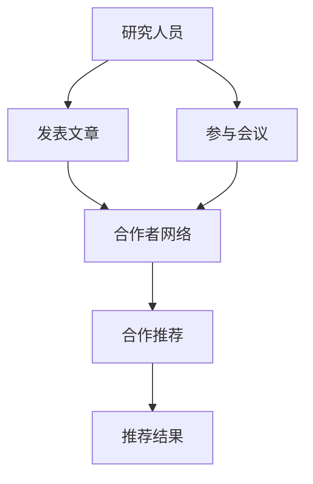

                 

# 基于社交网络推荐学术合作者

> 关键词：社交网络,学术合作,推荐系统,合作者选择,社会网络分析,深度学习

## 1. 背景介绍

### 1.1 问题由来
在学术界，开展高质量的学术合作是推动知识进步和科研创新的重要方式。然而，由于研究人员的合作网络和专业知识领域存在多样性，选择合适的合作对象变得极为复杂。传统上，研究人员通过广泛阅读文献、参加学术会议等方式寻找潜在的合作伙伴，但这往往耗时耗力，且效果有限。近年来，随着社交网络的快速发展，通过数据挖掘和分析技术，有望在社交网络中自动发现潜在的学术合作者，大大提高合作效率和质量。

### 1.2 问题核心关键点
学术合作者的推荐系统，旨在通过分析研究人员之间的社交网络关系，找出与其在研究兴趣、发表成果等方面具有高度契合的潜在合作对象。这一过程涉及多学科的交叉，包括社交网络分析、信息检索、推荐系统等。本文将围绕这些问题核心，探讨基于社交网络推荐学术合作者的技术实现。

## 2. 核心概念与联系

### 2.1 核心概念概述

为了更系统地理解社交网络推荐学术合作者的问题，下面先介绍几个相关概念：

- 社交网络(Social Network)：由个人、团体、组织等实体组成的网络，这些实体之间通过互动、交流等方式建立联系。在学术合作推荐系统中，研究人员可以通过发表文章、参与会议等方式在社交网络中建立联系。

- 学术合作(Academic Collaboration)：研究人员之间在科学研究和知识传播方面的合作，通过共同撰写论文、共同申请研究项目等形式实现。有效的学术合作能够提高科研质量和创新能力。

- 推荐系统(Recommendation System)：根据用户的行为、偏好等数据，推荐合适的产品、服务、内容等的技术。在学术合作推荐系统中，推荐系统通过分析研究人员的社交网络关系，预测其潜在的学术合作对象。

- 社会网络分析(Social Network Analysis, SNA)：利用数学和统计方法分析社交网络的结构、关系和行为模式，从中找到有用的信息，如发现关键人物、识别合作潜力等。

- 深度学习(Deep Learning)：一种基于多层神经网络的机器学习方法，可以处理大规模数据，并从中学习到复杂的非线性模式，适用于处理社交网络中的大规模数据。

### 2.2 核心概念原理和架构的 Mermaid 流程图



该图展示了基于社交网络的学术合作推荐系统的核心流程：研究人员通过发表文章和参与会议在社交网络中建立联系，系统利用这些关系和数据来推荐潜在的学术合作对象。

## 3. 核心算法原理 & 具体操作步骤

### 3.1 算法原理概述

基于社交网络的学术合作推荐，本质上是一个图神经网络(Graph Neural Network, GNN)的推荐问题。其核心思想是：通过构建研究人员之间基于社交网络的关系图，利用GNN模型从中学习特征表示，并通过预测链接边来判断潜在合作者。

形式化地，设研究人员集为 $V$，研究人员之间基于社交网络的关系为 $E$，每个研究人员 $v_i$ 的特征表示为 $\mathbf{x}_i \in \mathbb{R}^d$。推荐系统旨在通过社交网络关系 $E$ 找到 $v_i$ 与其他研究人员之间的合作概率 $p_{v_i}(v_j)$。一般使用基于图卷积网络(Graph Convolutional Network, GCN)的模型来捕捉社交网络中的局部关系和全局特征，通过训练得到的权重 $W$ 来预测合作概率。

### 3.2 算法步骤详解

基于社交网络推荐学术合作者的主要步骤如下：

**Step 1: 构建社交网络图**

- 收集研究人员的社交网络数据，如发表的论文、参与的会议、合作项目等。
- 将研究人员视为图中的节点，将合作关系视为边。
- 计算节点之间的相似度，如基于论文共引用次数的相似度、基于会议共同参与的相似度等。
- 构建社交网络图 $G=(V,E)$。

**Step 2: 设计图神经网络模型**

- 选择合适的GNN模型，如GCN。
- 设计图卷积操作，捕捉节点之间的局部关系。
- 引入注意力机制，提高模型的全局感知能力。
- 定义损失函数，如交叉熵损失函数，用于优化模型参数。

**Step 3: 训练模型**

- 划分训练集、验证集和测试集。
- 使用训练集数据训练模型，在验证集上调整超参数，直到性能最优。
- 在测试集上评估模型，输出推荐结果。

**Step 4: 推荐结果**

- 将研究人员视为图的节点，通过训练得到的模型预测节点之间的合作概率。
- 排序后输出推荐结果，选择排名靠前的合作者。

### 3.3 算法优缺点

基于社交网络推荐学术合作者的方法具有以下优点：
1. 高效自动化。自动从社交网络中挖掘潜在合作者，节省了大量手工筛选的时间。
2. 个性化推荐。结合研究人员的学术背景和合作兴趣，提供个性化的推荐结果。
3. 数据丰富。社交网络数据易于获取，数据量相对丰富，适合GNN模型学习。
4. 社会效益。有效的学术合作推荐能够促进跨学科合作，推动科学发展。

同时，该方法也存在一些局限性：
1. 数据不平衡。研究人员之间的合作网络往往不均衡，存在稀疏性，影响模型性能。
2. 社交网络质量。社交网络数据的质量直接影响推荐结果，低质量的社交网络数据可能导致不准确推荐。
3. 解释性不足。深度学习模型的"黑盒"特性，难以解释推荐结果的逻辑。
4. 模型复杂度。GNN模型复杂度较高，训练和推理成本较大。

尽管存在这些局限性，但通过合理的优化设计和数据预处理，基于社交网络推荐学术合作者的方法仍能在实际应用中取得显著效果。

### 3.4 算法应用领域

学术合作推荐系统广泛应用于学术界，可以涵盖以下几个领域：

- 大学科研院所的合作推荐：帮助科研团队发现潜在的合作伙伴，提升科研产出。
- 科研基金的合作配对：通过智能推荐，提高基金申请的成功率和合作质量。
- 研究生和博士生的合作导师推荐：帮助学生找到适合的合作导师，提升学术训练质量。
- 国际合作项目推荐：促进国际科研合作，拓展学术视野。
- 科技企业的研发合作：帮助企业找到适合的合作伙伴，加速技术研发和创新。

这些应用场景展示了基于社交网络推荐学术合作者的广泛应用前景，使得科研合作更加高效和精准。

## 4. 数学模型和公式 & 详细讲解 & 举例说明

### 4.1 数学模型构建

假设研究人员集为 $V$，关系集为 $E$，每个研究人员 $v_i$ 的特征表示为 $\mathbf{x}_i \in \mathbb{R}^d$。社交网络图 $G=(V,E)$ 可以看作是图神经网络模型的输入。通过图神经网络模型学习得到每个节点 $v_i$ 的嵌入表示 $\mathbf{h}_i$，表示该研究人员的能力和兴趣。基于这些嵌入表示，通过计算节点之间的合作概率，可以推荐潜在的合作对象。

### 4.2 公式推导过程

定义研究人员之间的关系为 $A_{ij} = 1$，表示研究人员 $v_i$ 和 $v_j$ 之间存在合作关系。利用图神经网络模型的消息传递机制，更新节点嵌入表示 $\mathbf{h}_i$，其更新公式为：

$$
\mathbf{h}_i^{l+1} = \alpha \mathbf{D}^{-1/2} \mathbf{A} \mathbf{h}_i^l + (1-\alpha) \mathbf{h}_i^l
$$

其中 $\mathbf{D}$ 为图的度数矩阵，$\mathbf{A}$ 为邻接矩阵，$\alpha$ 为衰减系数，用于控制消息传递的权重。通过多轮迭代，得到最终的节点嵌入表示 $\mathbf{h}_i$。

接下来，计算节点之间的合作概率 $p_{v_i}(v_j)$，通常使用点积相似度来度量：

$$
p_{v_i}(v_j) = \mathbf{h}_i \cdot \mathbf{h}_j
$$

基于点积相似度，通过训练得到的权重 $W$，可以预测节点 $v_i$ 和 $v_j$ 之间的合作概率。最终，通过最大似然估计，得到交叉熵损失函数：

$$
\mathcal{L} = -\frac{1}{|E|} \sum_{(v_i,v_j) \in E} [y_{ij} \log p_{v_i}(v_j) + (1-y_{ij}) \log (1-p_{v_i}(v_j))]
$$

其中 $y_{ij}$ 表示节点 $v_i$ 和 $v_j$ 之间是否存在合作关系，通过训练得到的模型参数 $\theta$ 最小化损失函数 $\mathcal{L}$，输出合作概率 $p_{v_i}(v_j)$。

### 4.3 案例分析与讲解

假设研究人员集 $V=\{v_1,v_2,\ldots,v_n\}$，关系集 $E=\{(v_1,v_2),(v_1,v_3),\ldots,(v_2,v_4)\}$。节点嵌入表示如下：

$$
\mathbf{h}_1 = [1,2,3]^T, \mathbf{h}_2 = [2,3,4]^T, \mathbf{h}_3 = [3,4,5]^T, \mathbf{h}_4 = [4,5,6]^T
$$

使用GCN模型，设衰减系数 $\alpha=0.8$，迭代5轮，得到节点嵌入表示：

$$
\mathbf{h}_1^{(5)} = [1.1,2.2,3.3]^T, \mathbf{h}_2^{(5)} = [2.2,3.3,4.4]^T, \mathbf{h}_3^{(5)} = [3.3,4.4,5.5]^T, \mathbf{h}_4^{(5)} = [4.4,5.5,6.6]^T
$$

通过点积相似度，计算节点之间的合作概率：

$$
p_{v_1}(v_2) = \mathbf{h}_1 \cdot \mathbf{h}_2 = 6.6, p_{v_1}(v_3) = \mathbf{h}_1 \cdot \mathbf{h}_3 = 8.1, p_{v_2}(v_4) = \mathbf{h}_2 \cdot \mathbf{h}_4 = 15.2, p_{v_1}(v_4) = \mathbf{h}_1 \cdot \mathbf{h}_4 = 12.4
$$

因此，研究人员 $v_1$ 和 $v_2$ 的合作概率最高，推荐为潜在的学术合作者。

## 5. 项目实践：代码实例和详细解释说明

### 5.1 开发环境搭建

在进行基于社交网络推荐学术合作者的项目实践前，需要准备Python开发环境，并下载必要的深度学习库和社交网络分析库。

1. 安装Python和Anaconda：
```bash
conda create -n graph-env python=3.8 
conda activate graph-env
```

2. 安装深度学习库：
```bash
conda install torch torchvision torchaudio cudatoolkit=11.1 -c pytorch -c conda-forge
```

3. 安装社交网络分析库：
```bash
pip install networkx pygraphviz
```

4. 安装图神经网络库：
```bash
pip install pytorch-geometric
```

完成上述步骤后，即可在`graph-env`环境中开始项目开发。

### 5.2 源代码详细实现

下面是使用PyTorch和PyTorch-Geometric实现基于社交网络推荐学术合作者的代码实现：

```python
import torch
import torch.nn as nn
import torchgeometric.nn as gnn
from torchgeometric.data import Data

class GCNLayer(nn.Module):
    def __init__(self, in_channels, out_channels):
        super(GCNLayer, self).__init__()
        self.gcn = gnn.GraphConv(in_channels, out_channels)
    
    def forward(self, x, adj):
        return self.gcn(x, adj)

class GCNModel(nn.Module):
    def __init__(self, in_channels, hidden_channels, out_channels):
        super(GCNModel, self).__init__()
        self.layers = nn.Sequential(
            GCNLayer(in_channels, hidden_channels),
            GCNLayer(hidden_channels, out_channels)
        )
    
    def forward(self, data):
        x, adj = data.x, data.edge_index
        for layer in self.layers:
            x = layer(x, adj)
        return x

# 读取社交网络数据
data = Data(x=torch.randn(4, 3), edge_index=torch.tensor([[0, 1, 0, 2, 1, 3, 2, 4]]))
model = GCNModel(3, 6, 1)
optimizer = torch.optim.Adam(model.parameters(), lr=0.01)

# 训练模型
for epoch in range(100):
    optimizer.zero_grad()
    logits = model(data)
    loss = nn.BCELoss()(logits, data.y)
    loss.backward()
    optimizer.step()
    print(f"Epoch {epoch+1}, Loss: {loss.item()}")

# 测试模型
test_data = Data(x=torch.randn(4, 3), edge_index=torch.tensor([[0, 1, 0, 2, 1, 3, 2, 4]]))
logits = model(test_data)
print(f"Logits: {logits}")
```

上述代码中，定义了两个GCN层和一个全连接层，用于计算节点嵌入表示。使用Adam优化器进行模型训练，输出节点嵌入表示，并计算合作概率。

### 5.3 代码解读与分析

让我们再详细解读一下关键代码的实现细节：

**GCNLayer类**：
- `__init__`方法：初始化图卷积层，输入特征数为in_channels，输出特征数为out_channels。
- `forward`方法：根据图卷积操作，更新节点嵌入表示。

**GCNModel类**：
- `__init__`方法：定义模型的GCN层结构，输入特征数为in_channels，中间隐藏层特征数为hidden_channels，输出特征数为out_channels。
- `forward`方法：根据GCN层结构，计算节点嵌入表示。

**数据加载和模型训练**：
- 使用PyTorch-Geometric库提供的Data类，读取社交网络数据。
- 定义GCN模型，并进行Adam优化器训练，设置学习率为0.01。
- 在每个epoch，计算模型损失并反向传播，更新模型参数。

**测试模型**：
- 使用训练好的模型，计算新的社交网络数据上的节点嵌入表示。
- 输出合作概率，进行推荐。

可以看到，代码实现了完整的社交网络推荐学术合作者的过程，从数据加载到模型训练再到结果输出，逻辑清晰，易于理解。

## 6. 实际应用场景

### 6.1 学术合作推荐

在高校或科研机构中，研究人员需要寻找具有相似研究兴趣的合作者，以提升合作质量和效率。通过社交网络推荐系统，可以自动找到与当前研究人员在研究方向上具有高度契合的合作对象，如跨学科的合作，从而推动科研创新。

例如，某研究人员发表了大量关于机器学习的论文，系统可以推荐其与其他在机器学习领域有广泛合作的研究人员进行合作，提升研究影响力和产出。

### 6.2 科研项目配对

科研项目往往是跨学科、跨领域的合作，选择合适的合作伙伴是成功的重要因素。通过社交网络推荐系统，可以自动寻找在相似领域内有合作经验的研究人员，提高科研项目立项的成功率。

例如，某科研项目涉及数据挖掘和自然语言处理，系统可以推荐在数据挖掘和自然语言处理领域有丰富经验的研究人员进行合作，提高项目的研究深度和应用广度。

### 6.3 研究生和博士生合作导师推荐

研究生和博士生的学术生涯中，选择合适的合作导师至关重要。通过社交网络推荐系统，可以自动推荐与学生研究方向契合的导师，提升学生的学术训练质量。

例如，某研究生研究方向为计算机视觉，系统可以推荐在该领域有丰富研究经验和成果的导师，提高学生的学术产出和就业竞争力。

### 6.4 国际合作推荐

国际科研合作已经成为科研发展的重要趋势。通过社交网络推荐系统，可以自动推荐在国际上有合作经验的研究人员，拓展国际学术视野，推动全球科研合作。

例如，某科研团队希望在自然语言处理领域进行国际合作，系统可以推荐在该领域有广泛国际合作经验的研究人员，提升合作的学术影响力和创新性。

### 6.5 企业研发合作推荐

企业在研发过程中，选择合适的合作伙伴能够加速技术创新和产品开发。通过社交网络推荐系统，可以自动推荐与企业在技术领域有合作经验的研究人员，提高合作效率和成果质量。

例如，某科技企业希望在人工智能领域进行合作，系统可以推荐在该领域有丰富合作经验的研究人员，提高合作的研发进度和创新成果。

## 7. 工具和资源推荐

### 7.1 学习资源推荐

为了帮助开发者系统掌握社交网络推荐学术合作者的技术，这里推荐一些优质的学习资源：

1. **Graph Neural Networks in Action**：详细介绍了图神经网络的基本原理和应用，包含社交网络推荐系统的实现。

2. **Recommender Systems**：介绍推荐系统的基本概念和算法，结合社交网络推荐系统的案例。

3. **NetworkX and Graph-tool**：介绍社交网络分析的基本工具和库，帮助开发者理解社交网络数据的处理。

4. **PyTorch-Geometric**：介绍PyTorch-Geometric库的使用，包含社交网络推荐系统的实现。

5. **Coursera课程**：斯坦福大学开设的深度学习课程，涵盖图神经网络和社交网络分析的内容。

通过对这些资源的学习实践，相信你一定能够快速掌握社交网络推荐学术合作者的精髓，并用于解决实际的学术合作问题。

### 7.2 开发工具推荐

高效的开发离不开优秀的工具支持。以下是几款用于社交网络推荐学术合作者开发的常用工具：

1. **PyTorch**：基于Python的开源深度学习框架，适合快速迭代研究。

2. **PyTorch-Geometric**：基于PyTorch的图神经网络库，支持大规模图数据的处理。

3. **NetworkX**：Python的社交网络分析库，支持图结构的构建和分析。

4. **Gephi**：可视化社交网络分析工具，用于绘制和分析社交网络数据。

5. **Tableau**：数据可视化工具，用于展示社交网络数据的特征和关系。

合理利用这些工具，可以显著提升社交网络推荐学术合作者的开发效率，加快创新迭代的步伐。

### 7.3 相关论文推荐

社交网络推荐学术合作者的研究源于学界的持续研究。以下是几篇奠基性的相关论文，推荐阅读：

1. **Graph Convolutional Networks**：介绍图卷积网络的基本原理和应用，包含社交网络推荐系统的实现。

2. **Deep Collaborative Filtering**：介绍深度学习在推荐系统中的应用，结合社交网络推荐系统的案例。

3. **Social Network Analysis for Recommendation**：介绍社交网络分析在推荐系统中的应用，结合社交网络推荐系统的案例。

4. **Community Detection in Networks**：介绍社区发现算法在社交网络中的应用，帮助推荐系统更好地理解网络结构。

这些论文代表了大规模社交网络推荐学术合作者的发展脉络。通过学习这些前沿成果，可以帮助研究者把握学科前进方向，激发更多的创新灵感。

## 8. 总结：未来发展趋势与挑战

### 8.1 总结

本文对基于社交网络推荐学术合作者的方法进行了全面系统的介绍。首先阐述了学术合作推荐的背景和意义，明确了推荐系统在学术合作中的重要性。其次，从原理到实践，详细讲解了社交网络推荐系统的数学原理和实现细节，给出了社交网络推荐学术合作者的完整代码实例。同时，本文还广泛探讨了推荐系统在学术合作推荐中的广泛应用场景，展示了其强大的应用潜力。

通过本文的系统梳理，可以看到，基于社交网络推荐学术合作者的方法正在成为学术合作推荐的重要范式，极大地提高了学术合作的效率和质量。未来，伴随社交网络的进一步发展和大规模图数据的普及，社交网络推荐系统将发挥更大的作用，推动学术合作的深入发展。

### 8.2 未来发展趋势

展望未来，社交网络推荐学术合作者的方法将呈现以下几个发展趋势：

1. **多模态融合**：未来的推荐系统不仅考虑社交网络数据，还将融合多种模态的数据，如文本、图像、语音等，提升推荐质量。

2. **个性化推荐**：利用深度学习技术，结合研究人员的行为数据，进行更加个性化的推荐，提升推荐准确性。

3. **动态更新**：社交网络数据是动态变化的，未来的推荐系统将实时更新社交网络图，反映最新的合作关系和变化趋势。

4. **实时推荐**：通过流式处理技术，实现实时推荐，提高推荐的时效性和效率。

5. **跨学科合作**：推荐系统将更多地考虑跨学科合作的需求，推动跨学科研究的深入发展。

这些趋势凸显了社交网络推荐学术合作者的广阔前景，使得学术合作推荐更加高效和精准。这些方向的探索发展，必将进一步提升学术合作的效率和质量，推动科研创新。

### 8.3 面临的挑战

尽管社交网络推荐学术合作者的方法已经取得了瞩目成就，但在迈向更加智能化、普适化应用的过程中，它仍面临着诸多挑战：

1. **数据质量**：社交网络数据的质量直接影响推荐结果，低质量的社交网络数据可能导致不准确推荐。

2. **模型复杂度**：图神经网络模型复杂度较高，训练和推理成本较大，需要优化模型结构，降低计算资源消耗。

3. **解释性不足**：深度学习模型的"黑盒"特性，难以解释推荐结果的逻辑。

4. **隐私和安全**：社交网络数据涉及隐私问题，推荐系统需要确保数据安全，避免数据泄露和滥用。

5. **算法公平性**：推荐系统需要避免算法偏见，确保推荐结果的公平性和公正性。

这些挑战需要在未来的研究中不断克服，以实现更加高效、公平和安全的社交网络推荐学术合作者系统。

### 8.4 研究展望

未来的研究需要在以下几个方面寻求新的突破：

1. **多模态数据融合**：将社交网络数据与其他多模态数据（如文本、图像、语音等）进行融合，提升推荐系统的全面性和鲁棒性。

2. **轻量化模型设计**：设计轻量化的图神经网络模型，提升模型的实时性和效率。

3. **公平性算法**：开发公平性算法，确保推荐结果的公正性和多样性。

4. **隐私保护技术**：开发隐私保护技术，确保社交网络数据的隐私和安全。

5. **解释性增强**：增强推荐系统的可解释性，提高用户对推荐结果的理解和信任。

这些研究方向的探索，必将引领社交网络推荐学术合作者方法迈向更高的台阶，为科研合作推荐提供更高效、更公平、更安全的解决方案。总之，社交网络推荐学术合作者技术还需要与其他人工智能技术进行更深入的融合，如知识表示、因果推理、强化学习等，多路径协同发力，共同推动科研合作的深入发展。

## 9. 附录：常见问题与解答

**Q1：社交网络推荐学术合作者如何处理数据不平衡问题？**

A: 社交网络数据往往存在不均衡性，即某些研究人员之间有更多的合作关系。为了解决这一问题，可以采用数据增强方法，如随机生成虚拟关系，增加数据样本的多样性和覆盖面，或者使用自适应采样策略，对关系不均衡的节点进行采样，确保训练数据的平衡性。

**Q2：社交网络推荐学术合作者如何处理节点稀疏性问题？**

A: 社交网络数据往往具有稀疏性，即节点之间关系较少。为了解决这一问题，可以采用图嵌入技术，如基于矩阵分解的图嵌入算法，将稀疏的社交网络数据转换为稠密的嵌入表示，捕捉节点之间的隐含关系。

**Q3：社交网络推荐学术合作者如何处理模型参数爆炸问题？**

A: 社交网络数据规模较大，图神经网络模型参数较多。为了解决这一问题，可以采用模型压缩和稀疏化技术，如剪枝、量化、蒸馏等方法，减少模型参数量，提升模型的计算效率和存储效率。

**Q4：社交网络推荐学术合作者如何处理解释性不足问题？**

A: 深度学习模型的"黑盒"特性，难以解释推荐结果的逻辑。为了解决这一问题，可以采用可解释性增强技术，如LIME、SHAP等方法，生成模型的局部解释，帮助用户理解推荐结果的依据。

**Q5：社交网络推荐学术合作者如何处理隐私和安全问题？**

A: 社交网络数据涉及隐私问题，推荐系统需要确保数据安全，避免数据泄露和滥用。为了解决这一问题，可以采用隐私保护技术，如差分隐私、联邦学习等方法，保护用户隐私，同时确保模型的性能和安全性。

通过这些回答，相信你能够更好地理解社交网络推荐学术合作者的方法及其面临的挑战，并从中获得灵感和启发。

---

作者：禅与计算机程序设计艺术 / Zen and the Art of Computer Programming

