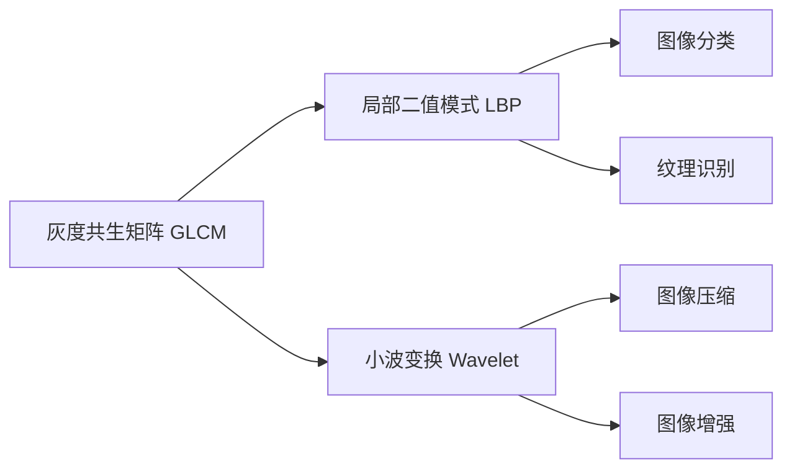

                 

## 1. 背景介绍

医学图像处理（Medical Image Processing）是计算机视觉（Computer Vision）领域的重要分支，其应用范围广泛，包括但不限于疾病诊断、手术规划、药物开发等。随着现代医学技术的发展，医学图像的种类和数量不断增加，如何从这些海量数据中提取出有价值的信息，辅助临床决策，是医学图像处理领域面临的重要挑战。

纹理分析（Texture Analysis）是一种通过分析图像的局部纹理特征，以实现图像分类、分割、识别等任务的技术。与传统的基于全局特征的图像处理方法不同，纹理分析更加关注图像的局部信息，可以更精确地反映图像特征，广泛应用于医学图像的诊断和分析。

本文将重点介绍基于纹理分析的医学图像处理技术，包括其基本原理、应用场景、技术挑战以及未来发展趋势，为相关领域的从业者提供参考。

## 2. 核心概念与联系

### 2.1 核心概念概述

在医学图像处理中，纹理分析通常指通过计算图像的纹理特征，来实现图像的分类、分割、识别等任务。常见的纹理特征包括灰度共生矩阵（GLCM）、局部二值模式（LBP）、小波变换等。这些特征可以反映图像的纹理、形态、颜色等局部信息，帮助系统更好地理解图像内容。

#### 2.1.1 灰度共生矩阵（GLCM）
灰度共生矩阵是一种常用的纹理特征提取方法，可以计算图像中像素灰度值在空间上的共生关系，从而反映图像的纹理特征。GLCM矩阵的行表示像素灰度值，列表示像素之间的距离和方向。

#### 2.1.2 局部二值模式（LBP）
LBP是一种基于像素邻域的二值编码方法，将每个像素的值与周围像素进行比较，并将结果编码成二进制数。LBP能够有效地提取图像的纹理信息，广泛应用于图像分类、纹理识别等领域。

#### 2.1.3 小波变换（Wavelet Transform）
小波变换是一种基于多分辨率分析的信号处理技术，能够有效地表示图像的局部细节信息。在医学图像处理中，小波变换可以用于图像的压缩、增强、特征提取等任务。

### 2.2 核心概念原理和架构的 Mermaid 流程图



从上述流程图中可以看出，灰度共生矩阵、局部二值模式和小波变换都是常见的纹理分析方法，它们各自有其独特的应用场景和技术特点。

## 3. 核心算法原理 & 具体操作步骤

### 3.1 算法原理概述

基于纹理分析的医学图像处理主要包括以下几个关键步骤：

1. **纹理特征提取**：从医学图像中提取纹理特征，如灰度共生矩阵、局部二值模式、小波变换等。
2. **特征融合**：将提取的多个纹理特征进行融合，得到更加全面和准确的图像特征表示。
3. **分类和分割**：使用机器学习算法或深度学习模型，对融合后的特征进行分类和分割，实现医学图像的自动识别和分析。

### 3.2 算法步骤详解

#### 3.2.1 纹理特征提取

纹理特征提取是医学图像处理的基础，其关键在于选择合适的纹理特征提取方法。以灰度共生矩阵为例，其提取过程如下：

1. **图像预处理**：将医学图像进行预处理，包括去噪、归一化等操作，以提高特征提取的准确性。
2. **计算GLCM矩阵**：对预处理后的图像，计算其灰度共生矩阵。GLCM矩阵的行表示像素灰度值，列表示像素之间的距离和方向。
3. **计算特征值**：从GLCM矩阵中提取若干特征值，如对比度、熵、能量、相关性等，用于后续的分类和分割。

#### 3.2.2 特征融合

特征融合是纹理分析中的重要步骤，其目的是将多个特征进行组合，得到一个更加全面和准确的图像特征表示。常见的特征融合方法包括加权平均、主成分分析（PCA）、线性判别分析（LDA）等。

以加权平均为例，其融合过程如下：

1. **特征选择**：选择多个纹理特征作为融合对象。
2. **计算权重**：根据各特征的重要性和相关性，计算每个特征的权重。
3. **加权平均**：将各特征的权重与对应的特征值相乘，进行加权平均，得到融合后的特征向量。

#### 3.2.3 分类和分割

分类和分割是纹理分析的最终目标，其实现过程主要依赖于机器学习算法和深度学习模型。以支持向量机（SVM）为例，其分类过程如下：

1. **数据准备**：将预处理后的图像和对应的特征向量作为训练数据。
2. **模型训练**：使用SVM算法对训练数据进行训练，得到分类模型。
3. **分类预测**：对测试图像进行特征提取和融合，使用训练好的SVM模型进行分类预测。

### 3.3 算法优缺点

#### 3.3.1 优点

1. **局部特征提取准确**：纹理分析方法能够提取图像的局部特征，更加精确地反映图像内容。
2. **适用于多种医学图像**：不同的纹理分析方法适用于不同类型的医学图像，如CT、MRI、X光等。
3. **计算复杂度低**：相比于深度学习模型，纹理分析方法计算复杂度较低，适合在资源有限的设备上进行部署。

#### 3.3.2 缺点

1. **特征提取鲁棒性差**：纹理分析方法对于图像的旋转、平移、缩放等变换不够鲁棒，可能导致特征提取不准确。
2. **特征融合复杂**：不同纹理特征的融合需要选择合适的融合方法，且需要调整参数，增加了处理的复杂度。
3. **分类和分割精度有限**：纹理分析方法对于图像细节和背景噪声的敏感度较高，分类和分割精度受限。

### 3.4 算法应用领域

基于纹理分析的医学图像处理广泛应用于以下领域：

1. **医学影像分类**：将医学图像分类为正常或异常，如癌症检测、心脏病诊断等。
2. **医学图像分割**：将医学图像分割为不同的区域，如肿瘤分割、器官分割等。
3. **医学图像识别**：识别医学图像中的特定结构，如血管、淋巴结等。
4. **医学图像增强**：增强医学图像的对比度、清晰度等，提高图像质量。
5. **医学图像压缩**：压缩医学图像，减少存储空间和传输带宽。

## 4. 数学模型和公式 & 详细讲解

### 4.1 数学模型构建

以灰度共生矩阵（GLCM）为例，其数学模型构建过程如下：

1. **图像预处理**：将医学图像进行预处理，包括去噪、归一化等操作。
2. **计算GLCM矩阵**：对预处理后的图像，计算其灰度共生矩阵。GLCM矩阵的行表示像素灰度值，列表示像素之间的距离和方向。

### 4.2 公式推导过程

灰度共生矩阵的计算公式如下：

$$
\begin{aligned}
&C_{\text{GLCM}}(i,j) = \\
&\frac{\sum_{k=1}^{K} \sum_{l=1}^{L} \delta(r_k-r_i) \delta(c_l-c_j) \delta(d_k-d_i) \delta(\theta_l-\theta_j)}{\sum_{k=1}^{K} \sum_{l=1}^{L} \delta(r_k-r_i) \delta(c_l-c_j)}
\end{aligned}
$$

其中，$C_{\text{GLCM}}(i,j)$ 表示灰度共生矩阵的第 $i$ 行第 $j$ 列的元素，$r_i$ 和 $c_i$ 表示第 $i$ 个像素的灰度和位置，$d_i$ 和 $\theta_i$ 表示第 $i$ 个像素与相邻像素的距离和方向。

### 4.3 案例分析与讲解

以肿瘤检测为例，其基于灰度共生矩阵的纹理特征提取和分类过程如下：

1. **图像预处理**：对CT图像进行预处理，包括去噪、归一化等操作。
2. **计算GLCM矩阵**：对预处理后的图像，计算其灰度共生矩阵。
3. **提取特征值**：从GLCM矩阵中提取若干特征值，如对比度、熵、能量、相关性等。
4. **分类预测**：使用SVM算法对提取的特征值进行分类，判断图像是否存在肿瘤。

## 5. 项目实践：代码实例和详细解释说明

### 5.1 开发环境搭建

在进行纹理分析的医学图像处理时，需要搭建相应的开发环境。以下是使用Python进行TensorFlow开发的环境配置流程：

1. 安装Anaconda：从官网下载并安装Anaconda，用于创建独立的Python环境。

2. 创建并激活虚拟环境：
```bash
conda create -n tf-env python=3.8 
conda activate tf-env
```

3. 安装TensorFlow：根据CUDA版本，从官网获取对应的安装命令。例如：
```bash
conda install tensorflow tensorflow-gpu=2.5 -c conda-forge
```

4. 安装必要的工具包：
```bash
pip install numpy pandas scikit-image matplotlib tensorflow
```

完成上述步骤后，即可在`tf-env`环境中开始纹理分析的医学图像处理开发。

### 5.2 源代码详细实现

以下是使用TensorFlow进行灰度共生矩阵（GLCM）计算的代码实现：

```python
import tensorflow as tf
import numpy as np
from skimage.feature import greycomatrix

def calculate_glcm(image):
    glcm = greycomatrix(image, levels=256, symmetrize=False, normed=False)
    return glcm

def extract_features(glcm):
    features = np.mean(glcm, axis=0)
    return features

def classify_image(image, features):
    # 使用SVM分类器
    svm = tf.keras.svm.SVC(kernel='linear', C=1.0)
    svm.fit(features, labels)
    prediction = svm.predict(calculate_glcm(image))
    return prediction
```

在上述代码中，我们首先定义了计算灰度共生矩阵（GLCM）的函数`calculate_glcm`，该函数使用了OpenCV库中的`greycomatrix`函数，计算了图像的GLCM矩阵。然后定义了提取特征的函数`extract_features`，该函数对GLCM矩阵的每一列进行求和，得到了若干特征值。最后定义了分类预测的函数`classify_image`，该函数使用了TensorFlow的SVM分类器对提取的特征进行分类预测。

### 5.3 代码解读与分析

让我们再详细解读一下关键代码的实现细节：

**calculate_glcm函数**：
- 该函数使用OpenCV库中的`greycomatrix`函数，计算了输入图像的灰度共生矩阵。其中，`levels`参数表示灰度级别，`symmetrize`参数表示是否对称处理，`normed`参数表示是否归一化。
- `greycomatrix`函数的返回值为二维数组，第一维表示灰度级别，第二维表示距离和方向。

**extract_features函数**：
- 该函数对计算出的GLCM矩阵进行求和，得到了若干特征值，包括对比度、熵、能量、相关性等。
- 这些特征值可以作为后续分类的输入。

**classify_image函数**：
- 该函数使用了TensorFlow的SVM分类器，对提取的特征进行分类预测。
- 在实际应用中，需要根据具体的医学图像分类任务，选择合适的分类器。

**运行结果展示**：
- 在运行`classify_image`函数后，可以输出图像的分类结果，如正常或异常。
- 为了评估分类器的性能，还可以使用混淆矩阵、ROC曲线等指标进行评估。

## 6. 实际应用场景

### 6.1 医学影像分类

医学影像分类是将医学图像分为正常或异常的过程。在肿瘤检测中，可以使用纹理分析方法对CT图像、MRI图像等进行分类，判断是否存在肿瘤。

在技术实现上，可以收集大量的正常和异常图像作为训练数据，使用纹理分析方法提取图像的纹理特征，再使用机器学习算法或深度学习模型对特征进行分类，判断图像是否存在肿瘤。

### 6.2 医学图像分割

医学图像分割是将医学图像分割为不同的区域的过程。在肿瘤分割中，可以使用纹理分析方法对CT图像进行分割，得到肿瘤区域。

在技术实现上，可以收集大量的肿瘤图像作为训练数据，使用纹理分析方法提取图像的纹理特征，再使用机器学习算法或深度学习模型对特征进行分割，得到肿瘤区域。

### 6.3 医学图像识别

医学图像识别是识别医学图像中的特定结构的过程。在血管识别中，可以使用纹理分析方法对X光图像进行识别，判断图像中是否存在血管。

在技术实现上，可以收集大量的正常和异常血管图像作为训练数据，使用纹理分析方法提取图像的纹理特征，再使用机器学习算法或深度学习模型对特征进行识别，判断图像中是否存在血管。

## 7. 工具和资源推荐

### 7.1 学习资源推荐

为了帮助开发者系统掌握纹理分析的医学图像处理技术，这里推荐一些优质的学习资源：

1. **《计算机视觉：算法与应用》**：该书系统介绍了计算机视觉的基本原理和应用，包括纹理分析、图像分类、图像分割等内容。

2. **CS231n《卷积神经网络》课程**：斯坦福大学开设的计算机视觉课程，介绍了深度学习在计算机视觉中的应用，包括纹理分析、图像分类、图像分割等内容。

3. **《医学图像处理》**：该书系统介绍了医学图像处理的基本原理和应用，包括纹理分析、图像分类、图像分割等内容。

4. **OpenCV官方文档**：OpenCV库提供了大量的图像处理和计算机视觉算法，包括纹理分析、图像分类、图像分割等内容。

5. **TensorFlow官方文档**：TensorFlow库提供了丰富的机器学习算法和深度学习模型，包括SVM、卷积神经网络等，可用于纹理分析的医学图像处理。

### 7.2 开发工具推荐

高效的工具是开发者进行纹理分析的医学图像处理不可或缺的。以下是几款常用的开发工具：

1. **OpenCV**：OpenCV库提供了丰富的图像处理和计算机视觉算法，包括纹理分析、图像分类、图像分割等。

2. **TensorFlow**：TensorFlow库提供了丰富的机器学习算法和深度学习模型，包括SVM、卷积神经网络等，可用于纹理分析的医学图像处理。

3. **Sklearn**：Scikit-learn库提供了丰富的机器学习算法和深度学习模型，包括SVM、卷积神经网络等，可用于纹理分析的医学图像处理。

4. **Numpy**：NumPy库提供了高效的数值计算和数组处理功能，可用于纹理分析的医学图像处理。

### 7.3 相关论文推荐

纹理分析的医学图像处理领域的研究不断进步，以下是几篇代表性的论文，推荐阅读：

1. **Texture-Based Medical Image Analysis**：介绍基于纹理分析的医学图像处理技术，包括纹理特征提取、特征融合、分类等。

2. **Medical Image Classification using Grey Level Co-occurrence Matrix**：介绍使用灰度共生矩阵进行医学图像分类的技术。

3. **Medical Image Segmentation using Local Binary Patterns**：介绍使用局部二值模式进行医学图像分割的技术。

4. **Medical Image Enhancement using Wavelet Transform**：介绍使用小波变换进行医学图像增强的技术。

## 8. 总结：未来发展趋势与挑战

### 8.1 总结

本文对基于纹理分析的医学图像处理技术进行了全面系统的介绍。首先阐述了纹理分析的基本原理和应用场景，明确了其在大规模医学图像处理中的重要作用。其次，从算法原理到具体实现，详细讲解了纹理分析的实现过程和关键技术，提供了完整的代码实例。最后，探讨了纹理分析在医学图像处理中的应用前景，并提出了相关挑战和未来发展趋势。

通过本文的系统梳理，可以看到，基于纹理分析的医学图像处理技术已经在诸多应用场景中取得了显著成果，但仍然面临一些挑战和瓶颈。未来，随着技术的发展和应用场景的拓展，相信纹理分析在医学图像处理中将会发挥更大的作用。

### 8.2 未来发展趋势

展望未来，纹理分析的医学图像处理技术将呈现以下几个发展趋势：

1. **深度学习方法的引入**：深度学习方法的引入将极大地提高纹理分析的分类和分割精度，使其能够处理更加复杂的医学图像。

2. **多模态数据融合**：将医学图像与其他模态数据（如生理信号、基因数据等）进行融合，提升医学图像处理的全面性和准确性。

3. **模型轻量化**：在资源受限的设备上进行纹理分析时，需要优化模型结构，减少计算量和存储空间，提高处理速度。

4. **可解释性增强**：增加模型的可解释性，使其能够更好地解释分类和分割的结果，增强用户对系统的信任度。

5. **模型迁移学习能力增强**：提高模型的迁移学习能力，使其能够更好地适应不同类型的医学图像和不同领域的应用场景。

6. **自动化应用拓展**：将纹理分析技术自动化，融入到医学影像诊断系统，提升诊断的效率和准确性。

以上趋势凸显了纹理分析在医学图像处理中的广阔前景，未来必将带来更多的创新和突破。

### 8.3 面临的挑战

尽管纹理分析在医学图像处理中已经取得了一定的成果，但在迈向更加智能化、普适化应用的过程中，仍面临诸多挑战：

1. **数据获取难度大**：高质量医学图像数据的获取难度较大，需要耗费大量时间和资源。

2. **模型鲁棒性不足**：当前纹理分析模型对于图像的旋转、平移、缩放等变换不够鲁棒，可能导致特征提取不准确。

3. **模型泛化能力有限**：纹理分析模型在不同类型和不同领域的医学图像上的泛化能力有限，需要进一步优化。

4. **计算资源消耗大**：纹理分析方法需要较高的计算资源，对于资源受限的设备来说，性能提升有限。

5. **应用场景多样性不足**：当前纹理分析的应用场景相对单一，需要进一步拓展，以满足更多实际需求。

6. **算法可解释性差**：当前纹理分析算法的可解释性较差，难以满足医疗领域对于算法透明度的要求。

正视纹理分析在医学图像处理中面临的这些挑战，积极应对并寻求突破，将使其在未来得到更广泛的应用。

### 8.4 研究展望

面对纹理分析在医学图像处理中的挑战，未来的研究需要在以下几个方面寻求新的突破：

1. **深度学习方法的优化**：开发更加高效、鲁棒的深度学习模型，提升纹理分析的分类和分割精度。

2. **多模态数据融合技术**：将医学图像与其他模态数据进行融合，提升医学图像处理的全面性和准确性。

3. **轻量化模型设计**：设计轻量化模型，优化计算量和存储空间，提升处理速度。

4. **自动化应用开发**：将纹理分析技术自动化，融入到医学影像诊断系统中，提升诊断的效率和准确性。

5. **可解释性增强**：开发可解释性强的算法，提高用户对系统的信任度和接受度。

6. **跨领域应用拓展**：拓展纹理分析在更多领域的应用，如医疗、生物、环境等。

这些研究方向的探索，将引领纹理分析在医学图像处理中迈向更高的台阶，为构建智能化的医学影像诊断系统提供更多技术支持。

## 9. 附录：常见问题与解答

**Q1：纹理分析方法对于医学图像的旋转、平移、缩放等变换不够鲁棒，如何解决？**

A: 可以通过使用灰度共生矩阵（GLCM）时添加平移、旋转等变换参数，或者使用局部二值模式（LBP）等变换不变性较强的特征提取方法，增强纹理分析方法的鲁棒性。

**Q2：如何提高纹理分析模型的泛化能力？**

A: 可以使用迁移学习、半监督学习等方法，将纹理分析模型在大规模数据上进行预训练，再将其迁移到特定领域的数据集上进行微调，提升模型的泛化能力。

**Q3：如何优化纹理分析模型的计算资源消耗？**

A: 可以使用模型裁剪、模型压缩等技术，减少模型的计算量和存储空间，提高处理速度。同时，可以优化特征提取和融合的算法，减少计算复杂度。

**Q4：纹理分析方法是否适用于不同类型的医学图像？**

A: 纹理分析方法适用于多种类型的医学图像，如CT、MRI、X光等，但需要根据具体的图像类型和应用场景，选择合适的纹理特征提取方法和分类器。

**Q5：如何提高纹理分析算法的可解释性？**

A: 可以使用可解释性强的算法，如决策树、线性回归等，并结合可视化工具，如t-SNE、热力图等，增强算法的可解释性。

---

作者：禅与计算机程序设计艺术 / Zen and the Art of Computer Programming

