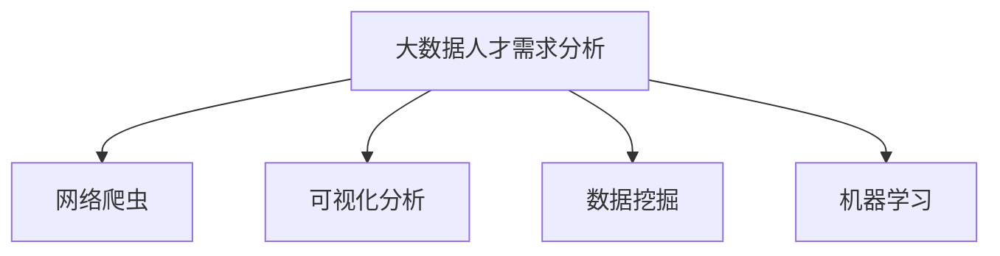

                 

# 基于网络爬虫的国内大数据人才需求可视化分析

## 1. 背景介绍

### 1.1 问题由来
随着大数据技术的不断成熟和应用领域的迅速扩展，企业对于大数据人才的需求日益增长。大数据人才不仅需要具备数据处理、数据分析等核心技能，还需要掌握多种技术和工具，具备较强的解决复杂问题的能力。然而，尽管市场上大数据需求旺盛，但大数据人才的供应相对短缺，导致人才争夺战愈演愈烈。

### 1.2 问题核心关键点
目前，企业在选择大数据人才时，通常需要考虑到以下几个方面：

- **技能要求**：包括数据处理、数据挖掘、机器学习等核心技能。
- **工具熟练度**：如Hadoop、Spark、SQL、Python等。
- **行业经验**：与特定行业或业务场景相关的经验。
- **学历背景**：通常要求本科及以上学历，计算机、统计、数学等相关专业优先。
- **工作经历**：1-5年不等，视企业规模和项目需求而定。

因此，准确理解国内大数据人才需求，对人才供给与企业招聘进行有效匹配，是当前人力资源管理的重要课题。

## 2. 核心概念与联系

### 2.1 核心概念概述

为了更好地理解基于网络爬虫的大数据人才需求可视化分析方法，本节将介绍几个密切相关的核心概念：

- **大数据人才需求分析**：通过网络爬虫技术，从招聘网站、企业官网、人才社交平台等获取大数据岗位招聘信息，提取关键职位要求、薪酬待遇等数据，分析国内大数据人才需求的趋势和特点。
- **网络爬虫**：一种自动化获取网页内容的技术，常用于大规模数据采集，是进行大数据人才需求分析的基础。
- **可视化分析**：将大数据人才需求数据通过图形、图表等形式直观展示，便于快速理解数据背后蕴含的趋势和规律。
- **数据挖掘与机器学习**：用于从大规模招聘数据中发现关联规律，提取关键信息，构建预测模型，实现对人才需求的精准分析。

这些核心概念之间的逻辑关系可以通过以下Mermaid流程图来展示：



这个流程图展示了大数据人才需求分析的核心概念及其之间的关系：

1. 通过网络爬虫获取大规模招聘数据。
2. 利用数据挖掘和机器学习技术，分析数据背后的规律。
3. 将分析结果通过可视化形式展现出来。

这些概念共同构成了大数据人才需求分析的完整框架，使其能够对当前和未来的趋势进行全面理解。

## 3. 核心算法原理 & 具体操作步骤
### 3.1 算法原理概述

基于网络爬虫的大数据人才需求分析，本质上是一种利用网络爬虫技术和大数据分析技术，对招聘网站和社交平台上的大数据岗位招聘信息进行自动化抓取、处理和分析的过程。其核心思想是：通过大规模数据采集和预处理，构建大数据人才需求模型，并使用可视化工具展示分析结果，从而为人才供给与企业招聘提供决策支持。

形式化地，假设通过网络爬虫获取到国内某城市大数据岗位招聘信息 $D=\{d_i\}_{i=1}^N$，其中 $d_i$ 表示第 $i$ 个招聘职位。记岗位要求为 $R=\{r_j\}_{j=1}^M$，薪酬待遇为 $C=\{c_k\}_{k=1}^L$。则大数据人才需求分析的目标是找到岗位要求和薪酬待遇之间的关系 $f(R,C)$，并可视化展示需求趋势。

### 3.2 算法步骤详解

基于网络爬虫的大数据人才需求分析一般包括以下几个关键步骤：

**Step 1: 准备爬虫工具和数据源**
- 选择Python等编程语言，安装Scrapy、BeautifulSoup等网络爬虫库。
- 确定数据源，如智联招聘、猎聘网、58同城等，根据网站结构编写爬虫脚本，抓取招聘信息。
- 设置爬虫规则，避免频繁访问导致被封禁，同时确保数据完整性。

**Step 2: 数据预处理**
- 对抓取到的数据进行清洗，去除无关信息，如HTML标签、特殊字符等。
- 提取岗位要求和薪酬待遇等关键字段，进行结构化存储，如使用Pandas库。
- 对缺失或异常值进行处理，如填补缺失值、删除异常值等。

**Step 3: 数据建模与分析**
- 使用数据挖掘和机器学习技术，构建岗位要求和薪酬待遇之间的关系模型。
- 利用回归分析、聚类分析等技术，对数据进行探索性分析和假设检验。
- 使用时间序列分析，对人才需求变化趋势进行预测和可视化展示。

**Step 4: 结果展示与分析**
- 利用Python的Matplotlib、Seaborn等可视化库，生成折线图、柱状图、散点图等，直观展示人才需求变化趋势。
- 对分析结果进行详细解读，提炼关键发现和建议，如高薪岗位需求、热门技能、热门行业等。

### 3.3 算法优缺点

基于网络爬虫的大数据人才需求分析方法具有以下优点：

- 自动化采集：通过网络爬虫自动化抓取招聘数据，减少人工操作，提高数据采集效率。
- 数据量大：爬虫技术可以处理大规模数据，能够反映更全面的市场需求。
- 实时更新：网络爬虫技术可以实时更新数据，及时反映市场需求变化。
- 多样性高：数据源丰富，能够从不同平台获取多角度的数据，提供更全面的视角。

同时，该方法也存在一定的局限性：

- 数据噪音多：招聘网站上的数据存在大量噪音，如重复信息、错误信息等。
- 数据隐私问题：抓取招聘网站数据可能涉及数据隐私问题，需合规处理。
- 爬虫规则难度高：不同的招聘网站结构不同，编写爬虫规则需要较高的技术水平。
- 数据时效性有限：数据更新速度受网站规则和服务器负载影响，可能存在一定延迟。

尽管存在这些局限性，但就目前而言，基于网络爬虫的大数据人才需求分析方法仍是大数据人才供给分析的主流范式。未来相关研究的重点在于如何进一步提高数据采集的准确性和效率，降低数据噪音，确保数据合规性。

### 3.4 算法应用领域

基于网络爬虫的大数据人才需求分析方法，在企业招聘、人才培训、职业教育等领域已经得到了广泛应用，具体如下：

- **企业招聘**：通过分析大数据人才需求，帮助企业制定招聘策略，优化岗位设置，吸引和选拔合适的人才。
- **人才培训**：根据大数据人才需求趋势，制定培训计划，提升员工技能，满足企业需求。
- **职业教育**：根据市场需求调整课程设置，提升教育质量，促进就业。
- **人才管理**：分析大数据人才的供给和需求变化，进行人才储备和优化配置，提升组织竞争力。
- **人才流动**：分析人才流动趋势，预测行业热点，引导人才流动。

## 4. 数学模型和公式 & 详细讲解 & 举例说明
### 4.1 数学模型构建

本节将使用数学语言对基于网络爬虫的大数据人才需求分析过程进行更加严格的刻画。

记通过网络爬虫获取的招聘信息为 $D=\{d_i\}_{i=1}^N$，其中 $d_i$ 表示第 $i$ 个招聘职位。假设每个职位包含岗位要求 $R=\{r_j\}_{j=1}^M$ 和薪酬待遇 $C=\{c_k\}_{k=1}^L$，分别表示成向量形式：

$$
R = \{r_1, r_2, ..., r_M\}, C = \{c_1, c_2, ..., c_L\}
$$

数据预处理后，构建向量形式的关系模型 $f(R,C)$，其中 $f$ 表示函数关系。常见的函数关系包括线性回归、非线性回归、决策树等。

### 4.2 公式推导过程

以下我们以线性回归为例，推导岗位要求和薪酬待遇之间的关系公式。

假设岗位要求 $R$ 和薪酬待遇 $C$ 之间存在线性关系，即：

$$
C = \beta_0 + \beta_1 R_1 + \beta_2 R_2 + ... + \beta_M R_M + \epsilon
$$

其中 $\beta_0, \beta_1, \beta_2, ..., \beta_M$ 为回归系数，$\epsilon$ 为误差项。通过最小二乘法，可以得到回归系数的求解公式：

$$
\beta_j = \frac{\sum_{i=1}^N (R_{ij} - \bar{R}) \cdot (C_i - \bar{C})}{\sum_{i=1}^N (R_{ij} - \bar{R})^2} / \frac{\sum_{i=1}^N (C_i - \bar{C})^2}
$$

其中 $\bar{R}$ 和 $\bar{C}$ 分别为岗位要求和薪酬待遇的均值。

### 4.3 案例分析与讲解

假设我们爬取了某城市共1000条大数据岗位招聘信息，岗位要求和薪酬待遇分别包含5个关键字段，分别为数据处理、数据挖掘、机器学习、统计分析和编程技能。我们将这些字段表示为向量 $R$ 和 $C$，进行线性回归分析。

使用Pandas库对数据进行预处理，得到岗位要求 $R$ 和薪酬待遇 $C$ 的均值 $\bar{R}$ 和 $\bar{C}$。使用最小二乘法求解回归系数 $\beta_j$，得到线性回归模型。最后，使用Matplotlib库绘制折线图，展示岗位要求和薪酬待遇之间的关系。

以数据挖掘技能为例，展示回归系数 $\beta_2$ 的计算过程：

$$
\beta_2 = \frac{\sum_{i=1}^{1000} (R_{2i} - \bar{R}) \cdot (C_i - \bar{C})}{\sum_{i=1}^{1000} (R_{2i} - \bar{R})^2} / \frac{\sum_{i=1}^{1000} (C_i - \bar{C})^2}
$$

根据实际计算结果，可以得到数据挖掘技能对薪酬待遇的系数 $\beta_2$，并绘制折线图。

## 5. 项目实践：代码实例和详细解释说明
### 5.1 开发环境搭建

在进行大数据人才需求分析实践前，我们需要准备好开发环境。以下是使用Python进行Scrapy框架开发的环境配置流程：

1. 安装Scrapy：从官网下载并安装Scrapy，安装依赖库，如BeautifulSoup、Twisted等。

2. 创建Scrapy项目：使用Scrapy CLI创建项目骨架，填写必要配置信息，定义爬虫脚本。

3. 编写爬虫脚本：根据目标网站结构，编写爬虫代码，抓取招聘信息。

4. 数据存储与预处理：使用Pandas库进行数据存储和预处理，去除无关信息，提取关键字段。

5. 数据可视化：使用Matplotlib、Seaborn等库进行数据可视化，展示分析结果。

完成上述步骤后，即可在Scrapy项目中开始大数据人才需求分析的实践。

### 5.2 源代码详细实现

下面以某城市大数据岗位招聘信息为例，展示Scrapy框架下的数据采集和处理代码实现。

```python
import scrapy
from scrapy.spiders import CrawlSpider, Rule
from scrapy.linkextractors import LinkExtractor
from scrapy.http import Request
import pandas as pd

class BigDataSpider(CrawlSpider):
    name = 'bigdata_spider'
    allowed_domains = ['www.lagou.com', 'www.51job.com']
    start_urls = ['http://www.lagou.com/jobs/list_%E5%A4%A7%E6%95%B0%E6%8D%AE']
    
    # 定义数据存储路径
    data_path = 'data/bigdata.csv'
    
    # 爬虫规则，提取链接
    rules = (
        Rule(LinkExtractor(allow=(r'/jobs/list_',)), callback='parse_item', follow=True),
    )
    
    # 数据解析函数
    def parse_item(self, response):
        item = {}
        
        # 提取岗位要求和薪酬待遇
        item['title'] = response.css('职位名称::text').extract_first()
        item['requirement'] = response.css('职位要求::text').extract_first()
        item['salary'] = response.css('薪资水平::text').extract_first()
        
        # 存储到本地CSV文件
        data = pd.DataFrame([item])
        data.to_csv(self.data_path, index=False, mode='a')
        
        # 返回下一页链接
        next_page = response.css('.next::attr(href)').extract_first()
        if next_page:
            yield Request(next_page, callback=self.parse_item)
    
if __name__ == '__main__':
    spider = BigDataSpider()
    spider.start_requests()
```

代码中，我们首先定义了一个CrawlSpider类，用于处理链接提取和数据解析。通过start_urls指定起始页面，设置爬虫规则，提取职位名称、职位要求和薪资水平等关键信息，并将数据存储到本地CSV文件中。最后，启动爬虫脚本进行数据采集。

### 5.3 代码解读与分析

让我们再详细解读一下关键代码的实现细节：

**BigDataSpider类**：
- `name`属性：指定爬虫名称，方便调试和管理。
- `allowed_domains`属性：指定允许爬取的域名，防止爬虫访问其他网站。
- `start_urls`属性：指定起始页面，通常为招聘网站首页或相关分类页面。
- `rules`属性：定义爬虫规则，使用LinkExtractor提取链接，回调函数为`parse_item`。
- `parse_item`方法：对每个链接页面进行数据解析，提取关键信息，并存储到本地文件中。

**start_requests方法**：
- 初始化爬虫，启动数据采集过程。

**数据存储与预处理**：
- 使用Pandas库进行数据存储和预处理，去除无关信息，提取关键字段。

**数据可视化**：
- 使用Matplotlib、Seaborn等库进行数据可视化，展示分析结果。

以上代码实现了基于Scrapy框架的简单数据采集和存储过程，但对于实际应用，还需要进行数据清洗、数据建模、结果展示等进一步处理。

## 6. 实际应用场景
### 6.1 招聘与求职

企业通过分析大数据人才需求，可以制定更有针对性的招聘策略，提高招聘效率和成功率。例如，根据分析结果，企业可以调整岗位要求，吸引更多适合的人才。求职者也可以通过分析不同岗位的需求变化趋势，选择更有发展潜力的岗位，提升就业竞争力。

### 6.2 人才培训与职业教育

高校和培训机构可以根据分析结果，调整课程设置和教学内容，提升学生的就业技能和市场需求匹配度。例如，分析热门技能和热门行业，调整专业设置和课程安排，提升教学质量。

### 6.3 人才管理与人力资源优化

企业可以根据分析结果，优化人才配置和人力资源管理。例如，通过分析人才需求变化趋势，合理规划人才储备，避免人才浪费和紧缺。同时，通过分析不同岗位的薪酬待遇，制定更合理的薪酬体系，提升员工满意度和留任率。

## 7. 工具和资源推荐
### 7.1 学习资源推荐

为了帮助开发者系统掌握基于网络爬虫的大数据人才需求分析技术，这里推荐一些优质的学习资源：

1. 《Python网络爬虫实战》系列书籍：详细介绍了Scrapy、BeautifulSoup等网络爬虫库的使用方法，提供了大量实战案例。
2. 《Python数据分析实战》系列书籍：讲解了Pandas、Matplotlib、Seaborn等数据处理和可视化工具的使用方法，帮助开发者进行数据分析和结果展示。
3. 《机器学习实战》系列书籍：介绍了回归分析、分类分析等机器学习算法的使用方法，帮助开发者构建模型并进行预测。
4. 斯坦福大学Coursera课程：提供了一系列数据挖掘和机器学习课程，由知名专家授课，课程内容覆盖全面。
5. Kaggle平台：提供大量真实数据集和比赛项目，帮助开发者进行数据处理和分析实践。

通过对这些资源的学习实践，相信你一定能够快速掌握基于网络爬虫的大数据人才需求分析的精髓，并用于解决实际的NLP问题。

### 7.2 开发工具推荐

高效的开发离不开优秀的工具支持。以下是几款用于大数据人才需求分析开发的常用工具：

1. Scrapy：Python的高级爬虫框架，支持异步请求，高并发性能，适合大规模数据采集。
2. Beautiful Soup：用于解析HTML页面，提取关键信息。
3. Pandas：用于数据存储和预处理，支持多种数据格式，易于使用。
4. Matplotlib、Seaborn：用于数据可视化，生成折线图、散点图、柱状图等，直观展示分析结果。
5. Jupyter Notebook：交互式编程环境，适合进行数据处理和分析，支持代码调试和实时展示。

合理利用这些工具，可以显著提升大数据人才需求分析的开发效率，加快创新迭代的步伐。

### 7.3 相关论文推荐

大数据人才需求分析的相关研究涉及数据挖掘、机器学习、网络爬虫等多个领域，以下是几篇奠基性的相关论文，推荐阅读：

1. Web Scraping Techniques for Data Collection and Analysis: A Survey（网络爬虫技术综述）：介绍了多种网络爬虫技术，涵盖爬虫工具、爬虫框架和爬虫策略，帮助开发者构建高效爬虫系统。
2. Data Mining from Multimedia Big Data：介绍从多媒体大数据中挖掘有价值信息的方法，涵盖数据预处理、特征提取、数据建模等多个方面。
3. Big Data Talent Demand Analysis in China: A Survey（中国大数据人才需求分析综述）：总结了中国大数据人才需求分析的研究成果，涵盖数据源选择、数据预处理、数据建模和结果展示等多个方面。
4. Machine Learning in Big Data Talent Demand Analysis：介绍机器学习在大数据人才需求分析中的应用，涵盖回归分析、聚类分析、时间序列分析等方法。

这些论文代表了大数据人才需求分析的研究进展，通过学习这些前沿成果，可以帮助研究者把握学科前进方向，激发更多的创新灵感。

## 8. 总结：未来发展趋势与挑战
### 8.1 总结

本文对基于网络爬虫的大数据人才需求分析方法进行了全面系统的介绍。首先阐述了大数据人才需求分析的研究背景和意义，明确了网络爬虫在大数据人才需求分析中的重要地位。其次，从原理到实践，详细讲解了基于网络爬虫的数据采集和分析过程，给出了大数据人才需求分析的完整代码实例。同时，本文还广泛探讨了大数据人才需求分析在招聘、培训、职业教育等多个领域的应用前景，展示了网络爬虫技术的巨大潜力。最后，本文精选了网络爬虫技术的各类学习资源，力求为开发者提供全方位的技术指引。

通过本文的系统梳理，可以看到，基于网络爬虫的大数据人才需求分析方法正在成为大数据人才供给分析的重要手段，极大地拓展了人才管理的应用边界，催生了更多的人才管理新方法。受益于网络爬虫和大数据分析技术的持续演进，大数据人才需求分析必将不断突破技术瓶颈，提供更全面、精准的人才需求洞察。

### 8.2 未来发展趋势

展望未来，基于网络爬虫的大数据人才需求分析技术将呈现以下几个发展趋势：

1. **自动化与智能化**：爬虫技术和数据分析技术的自动化与智能化程度将不断提升，减少人工干预，提高数据采集和处理的效率和准确性。
2. **多源数据融合**：利用多源数据进行融合分析，提供更全面、真实的人才需求洞察，涵盖企业招聘、人才社交、教育培训等多个维度。
3. **实时性提升**：爬虫技术和数据分析技术的实时性将不断提升，实现对人才需求变化趋势的实时监测和预警。
4. **精准预测**：利用机器学习和深度学习技术，构建更加精准的人才需求预测模型，帮助企业制定更科学的招聘策略和人才管理方案。
5. **可视化增强**：利用更先进的可视化技术，提供更直观、易理解的人才需求分析报告，帮助企业快速决策。

这些趋势凸显了大数据人才需求分析技术的广阔前景，为人才供给与企业招聘提供更精准、实时、自动化的决策支持。

### 8.3 面临的挑战

尽管基于网络爬虫的大数据人才需求分析技术已经取得了瞩目成就，但在迈向更加智能化、普适化应用的过程中，仍面临诸多挑战：

1. **数据噪音多**：招聘网站上的数据存在大量噪音，如重复信息、错误信息等，需要有效的数据清洗和预处理技术。
2. **爬虫规则复杂**：不同的招聘网站结构不同，编写爬虫规则需要较高的技术水平，且可能存在封禁风险。
3. **数据隐私问题**：抓取招聘网站数据可能涉及数据隐私问题，需合规处理，保护用户隐私。
4. **数据质量控制**：数据质量控制是保证分析结果准确性的关键，需设置合适的质量标准和控制策略。
5. **数据时效性有限**：数据更新速度受网站规则和服务器负载影响，可能存在一定延迟，需定期更新数据。

尽管存在这些挑战，但就目前而言，基于网络爬虫的大数据人才需求分析方法仍是大数据人才供给分析的主流范式。未来相关研究的重点在于如何进一步提高数据采集的准确性和效率，降低数据噪音，确保数据合规性。

### 8.4 研究展望

面对大数据人才需求分析所面临的种种挑战，未来的研究需要在以下几个方面寻求新的突破：

1. **自动化数据清洗**：开发更先进的自动化数据清洗工具，减少人工干预，提升数据质量。
2. **智能爬虫技术**：研究基于人工智能的智能爬虫技术，提高爬虫规则编写效率和鲁棒性。
3. **数据隐私保护**：研究数据隐私保护技术，确保数据采集和分析过程符合法律法规要求。
4. **数据质量控制**：构建数据质量控制机制，设置合适的质量标准和控制策略，保证分析结果准确性。
5. **实时数据更新**：研究实时数据更新技术，提高数据时效性，实现对人才需求变化趋势的实时监测和预警。

这些研究方向凸显了大数据人才需求分析技术的发展潜力，为构建更全面、精准的人才供给与企业招聘决策支持系统提供技术保障。

## 9. 附录：常见问题与解答

**Q1：网络爬虫采集数据有哪些注意事项？**

A: 网络爬虫采集数据时，需要注意以下几点：
1. **遵守法律法规**：确保采集数据符合法律法规要求，避免侵犯用户隐私和数据安全。
2. **避免高频访问**：设置合理的爬虫访问频率，避免频繁访问导致网站封禁。
3. **数据去重和清洗**：对采集到的数据进行去重和清洗，去除无关信息，确保数据质量。
4. **数据存储和备份**：将采集到的数据进行合理存储和备份，防止数据丢失。
5. **数据权限管理**：设置合适的数据权限管理策略，防止数据泄露和滥用。

**Q2：如何进行数据预处理？**

A: 数据预处理通常包括以下几个步骤：
1. **数据清洗**：去除无关信息，如HTML标签、特殊字符等。
2. **数据转换**：将文本数据转换为数字格式，如使用词向量表示，方便后续分析。
3. **特征提取**：提取关键特征，如岗位要求、薪酬待遇等，进行特征编码。
4. **数据归一化**：对数据进行归一化处理，确保数据在分析过程中的一致性和可比性。
5. **数据集划分**：将数据集划分为训练集、验证集和测试集，进行模型训练和评估。

**Q3：数据可视化有哪些工具和方法？**

A: 数据可视化通常有以下几种工具和方法：
1. **Python可视化库**：如Matplotlib、Seaborn、Plotly等，用于生成折线图、散点图、柱状图等。
2. **数据可视化平台**：如Tableau、Power BI等，提供更丰富的可视化图表和交互功能。
3. **可视化编程语言**：如D3.js、Highcharts等，用于实现交互式可视化效果。
4. **数据可视化算法**：如聚类分析、散点图分析、时间序列分析等，帮助用户发现数据背后的规律和趋势。

**Q4：数据挖掘和机器学习有什么区别？**

A: 数据挖掘和机器学习虽然紧密相关，但各有侧重：
1. **数据挖掘**：从大规模数据中发现潜在模式、规律和知识，侧重于数据探索和发现。
2. **机器学习**：利用数据构建模型，进行预测、分类、回归等，侧重于模型构建和应用。
3. **区别**：数据挖掘更多依赖手工特征提取，侧重于发现数据中的隐含关系；机器学习更多依赖算法模型，侧重于利用模型进行数据预测和分析。

**Q5：数据挖掘和机器学习各自的应用场景是什么？**

A: 数据挖掘和机器学习各自的应用场景如下：
1. **数据挖掘**：适用于数据分析、数据预处理、知识发现等领域，如客户关系管理、市场分析、社交网络分析等。
2. **机器学习**：适用于预测、分类、回归等领域，如金融风险评估、推荐系统、自然语言处理等。

通过对这些问题的回答，相信你能够更全面地理解基于网络爬虫的大数据人才需求分析技术，并应用于实际工作中。

---

作者：禅与计算机程序设计艺术 / Zen and the Art of Computer Programming

