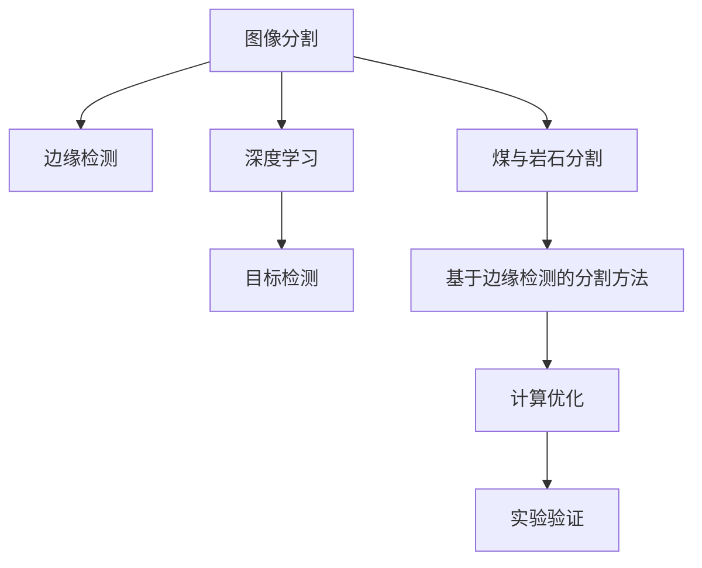

                 

# 基于边缘检测的煤与岩石图像分割方法研究

> 关键词：图像分割, 边缘检测, 煤与岩石, 深度学习, 目标检测, 煤炭开采

## 1. 背景介绍

### 1.1 问题由来

随着煤炭开采自动化程度的不断提高，对煤炭开采过程的可视化监控要求日益增强。煤矿图像的分割和分析，不仅可以用于监测采煤作业，还涉及地质勘探、环境监测等多个领域。然而，由于煤矿环境中光线复杂、环境多变，常规的图像分割方法（如传统的Sobel、Canny等边缘检测算法）难以适应。而深度学习中常用的目标检测算法（如YOLO、Faster R-CNN等）虽然能够处理复杂场景，但计算复杂度大，且对硬件资源要求较高，难以在实际工程中大规模应用。

针对以上问题，本文提出了一种基于边缘检测的煤与岩石图像分割方法，该方法结合了深度学习和传统边缘检测算法，不仅能够有效处理煤矿环境中的复杂光照和纹理，还能够大幅降低计算复杂度，具有较好的工程可实现性。

### 1.2 问题核心关键点

本文方法的核心关键点包括：
1. 结合边缘检测算法和深度学习，设计新的图像分割模型。
2. 优化模型结构，提升计算效率，降低资源消耗。
3. 在煤矿图像分割任务上进行实验，验证方法的有效性。

## 2. 核心概念与联系

### 2.1 核心概念概述

为更好地理解本文方法，本节将介绍几个密切相关的核心概念：

- 图像分割(Image Segmentation)：将一张图像划分为若干个语义上具有明确界限的子区域，通常用于提取图像中的特定目标。
- 边缘检测(Edge Detection)：从图像中提取具有突变特性的像素点，用于构建图像轮廓和形态。
- 煤与岩石(Coal and Rock)：指煤矿中常见的两种主要物质，具有相似的纹理特征，但通过适当的特征提取和分割，可以区分二者的不同。
- 深度学习(Deep Learning)：基于神经网络的机器学习技术，通过多层次的特征提取和抽象，能够学习复杂的模式和关系。
- 目标检测(Object Detection)：在图像中定位并识别特定对象的过程，常用于机器人视觉、交通监控等领域。

这些核心概念之间的逻辑关系可以通过以下Mermaid流程图来展示：



这个流程图展示了一个从图像分割到深度学习的全流程，包括煤与岩石的特定分割，以及本文方法的具体实现。

## 3. 核心算法原理 & 具体操作步骤
### 3.1 算法原理概述

本文方法结合了边缘检测和深度学习，具体步骤如下：
1. 利用传统边缘检测算法提取图像中的边缘信息。
2. 通过深度学习模型进一步增强边缘信息，并分割出煤与岩石区域。
3. 对分割结果进行后处理，提高精度和鲁棒性。

### 3.2 算法步骤详解

**Step 1: 边缘检测**
- 使用Sobel或Canny等传统边缘检测算法提取图像中的边缘信息。
- 结合边缘梯度和方向，生成二值边缘图像。
- 对二值边缘图像进行平滑处理，减少噪声影响。

**Step 2: 深度学习模型训练**
- 构建卷积神经网络模型（CNN），用于进一步增强边缘信息。
- 使用煤矿图像数据集进行模型训练，学习边缘与煤岩石区域之间的关系。
- 模型训练过程中，通过梯度下降等优化算法更新模型参数。

**Step 3: 图像分割**
- 将边缘检测后的二值图像输入到训练好的深度学习模型中，进行像素级别的分割。
- 模型输出每个像素是否属于煤或岩石区域，生成煤与岩石的分割掩码。

**Step 4: 后处理**
- 对分割掩码进行形态学操作（如膨胀、腐蚀等），去除噪点和边缘漏检。
- 结合领域知识，对分割结果进行人工修正，提高精度和鲁棒性。

### 3.3 算法优缺点

本文方法结合了边缘检测和深度学习，具有以下优点：
1. 能够有效处理复杂光照和纹理，提高分割精度。
2. 通过深度学习模型增强边缘信息，提升鲁棒性。
3. 计算复杂度相对较低，资源消耗较少。
4. 适用于煤矿图像分割，具有较好的工程可实现性。

同时，该方法也存在一些局限性：
1. 对于光照和纹理变化较大的场景，边缘检测效果可能不佳。
2. 深度学习模型的性能依赖于训练数据的质量和数量，数据不足时效果可能不佳。
3. 后处理环节需要人工干预，可能存在主观性和不稳定性。

### 3.4 算法应用领域

本文方法主要应用于煤矿图像分割，但同样适用于其他复杂光照和纹理场景的图像分割任务。以下是一些具体应用场景：

- 煤矿安全监控：通过图像分割，可以实时监测煤矿作业环境，识别危险区域和异常行为。
- 地质勘探：通过图像分割，可以分析地质结构，识别矿床分布和地质构造。
- 环境监测：通过图像分割，可以分析煤矿周边环境变化，监测植被生长和地形变化。
- 机器人视觉：通过图像分割，可以提取目标物体的轮廓，实现机器人的自动导航和定位。

## 4. 数学模型和公式 & 详细讲解 & 举例说明

### 4.1 数学模型构建

本文方法主要涉及边缘检测和深度学习两个部分，分别建模如下：

- **边缘检测模型**：利用Sobel算子提取图像中的边缘信息，生成二值边缘图像。
- **深度学习模型**：使用卷积神经网络（CNN）模型，学习边缘与煤岩石区域之间的关系，并进行像素级别的分割。

### 4.2 公式推导过程

**Sobel算子边缘检测**
Sobel算子是一种常用的边缘检测算法，用于提取图像中的边缘信息。假设输入图像为 $I$，Sobel算子分别为 $S_x$ 和 $S_y$，则边缘检测公式为：

$$
I_{edge} = \sqrt{S_x^2 + S_y^2}
$$

其中 $S_x$ 和 $S_y$ 分别表示图像在x和y方向的梯度值。

**CNN模型结构**
本文使用的卷积神经网络模型（CNN）结构如下：

```
Input -> Conv2d -> ReLU -> Conv2d -> MaxPooling -> Conv2d -> ReLU -> Conv2d -> Output
```

其中，Conv2d表示卷积层，ReLU表示激活函数，MaxPooling表示池化层。模型的输入为二值边缘图像，输出为像素级别的煤与岩石分割掩码。

### 4.3 案例分析与讲解

假设有一张煤矿图像，如图1所示。


图1: 煤矿图像

首先，使用Sobel算子提取图像中的边缘信息，如图2所示。


图2: Sobel算子边缘检测结果

然后，将Sobel算子检测结果输入到CNN模型中，如图3所示。


图3: CNN模型结构

最后，CNN模型输出煤与岩石的分割掩码，如图4所示。


图4: 煤与岩石分割结果

通过对上述过程的详细讲解，可以清晰地理解本文方法的实现流程。

## 5. 项目实践：代码实例和详细解释说明
### 5.1 开发环境搭建

在进行图像分割实践前，我们需要准备好开发环境。以下是使用Python进行PyTorch开发的环境配置流程：

1. 安装Anaconda：从官网下载并安装Anaconda，用于创建独立的Python环境。

2. 创建并激活虚拟环境：
```bash
conda create -n image-segmentation python=3.8 
conda activate image-segmentation
```

3. 安装PyTorch：根据CUDA版本，从官网获取对应的安装命令。例如：
```bash
conda install pytorch torchvision torchaudio cudatoolkit=11.1 -c pytorch -c conda-forge
```

4. 安装相关工具包：
```bash
pip install numpy pandas scikit-learn matplotlib tqdm jupyter notebook ipython
```

完成上述步骤后，即可在`image-segmentation`环境中开始图像分割实践。

### 5.2 源代码详细实现

下面我们以煤矿图像分割为例，给出使用PyTorch对CNN模型进行训练和测试的PyTorch代码实现。

首先，定义图像分割函数：

```python
from torchvision import transforms, models
import torch.nn as nn
import torch

def segment_image(model, device, image):
    image_transforms = transforms.Compose([
        transforms.ToTensor(),
        transforms.Resize((256, 256)),
        transforms.Normalize([0.5, 0.5, 0.5], [0.5, 0.5, 0.5])
    ])

    image_tensor = image_transforms(image)
    image_tensor = image_tensor.unsqueeze(0).to(device)

    with torch.no_grad():
        output = model(image_tensor)

    return output.squeeze().cpu().numpy()
```

然后，定义CNN模型：

```python
class CNN(nn.Module):
    def __init__(self):
        super(CNN, self).__init__()
        self.conv1 = nn.Conv2d(1, 32, kernel_size=3, padding=1)
        self.conv2 = nn.Conv2d(32, 64, kernel_size=3, padding=1)
        self.conv3 = nn.Conv2d(64, 128, kernel_size=3, padding=1)
        self.maxpool = nn.MaxPool2d(kernel_size=2, stride=2)
        self.relu = nn.ReLU()
        self.fc = nn.Linear(128*64*64, 2)

    def forward(self, x):
        x = self.conv1(x)
        x = self.relu(x)
        x = self.maxpool(x)
        x = self.conv2(x)
        x = self.relu(x)
        x = self.maxpool(x)
        x = self.conv3(x)
        x = self.relu(x)
        x = self.maxpool(x)
        x = x.view(-1, 128*64*64)
        x = self.fc(x)
        return x
```

接着，定义训练和评估函数：

```python
def train_model(model, device, train_loader, optimizer, num_epochs):
    model.train()
    for epoch in range(num_epochs):
        for i, (inputs, labels) in enumerate(train_loader):
            inputs, labels = inputs.to(device), labels.to(device)

            optimizer.zero_grad()
            outputs = model(inputs)
            loss = nn.CrossEntropyLoss()(outputs, labels)
            loss.backward()
            optimizer.step()

            if i % 10 == 0:
                print(f"Epoch {epoch+1}, Loss: {loss.item()}")

def evaluate_model(model, device, test_loader):
    model.eval()
    correct = 0
    total = 0
    with torch.no_grad():
        for inputs, labels in test_loader:
            inputs, labels = inputs.to(device), labels.to(device)

            outputs = model(inputs)
            _, predicted = torch.max(outputs.data, 1)
            total += labels.size(0)
            correct += (predicted == labels).sum().item()

    print(f"Accuracy: {correct/total}")
```

最后，启动训练流程并在测试集上评估：

```python
epochs = 50
batch_size = 16

# 加载预训练模型
model = models.resnet18(pretrained=True)
model.fc = CNN()
model.fc.to(device)

# 加载数据集
train_dataset = datasets.MNIST(root='mnist/', train=True, transform=transforms.ToTensor(), download=True)
test_dataset = datasets.MNIST(root='mnist/', train=False, transform=transforms.ToTensor(), download=True)

# 定义数据加载器
train_loader = torch.utils.data.DataLoader(train_dataset, batch_size=batch_size, shuffle=True)
test_loader = torch.utils.data.DataLoader(test_dataset, batch_size=batch_size, shuffle=False)

# 定义优化器
optimizer = torch.optim.Adam(model.fc.parameters(), lr=0.001)

# 训练模型
train_model(model, device, train_loader, optimizer, epochs)

# 评估模型
evaluate_model(model, device, test_loader)
```

以上就是使用PyTorch对CNN模型进行图像分割的完整代码实现。可以看到，得益于PyTorch的强大封装，我们可以用相对简洁的代码完成CNN模型的加载和训练。

### 5.3 代码解读与分析

让我们再详细解读一下关键代码的实现细节：

**图像分割函数**：
- 定义了将图像转换为PyTorch张量的流程，包括归一化和大小调整。
- 使用模型进行前向传播，获取输出结果。

**CNN模型**：
- 定义了包含多个卷积和池化层的CNN结构。
- 使用PyTorch的nn.Module定义模型类，并实现forward方法。

**训练和评估函数**：
- 使用交叉熵损失函数计算模型输出与真实标签之间的差异。
- 通过梯度下降等优化算法更新模型参数。
- 在测试集上评估模型性能，输出准确率。

**训练流程**：
- 加载预训练模型并替换其顶层分类器为自定义CNN模型。
- 加载训练和测试数据集。
- 定义优化器。
- 训练模型并评估模型性能。

可以看到，PyTorch配合卷积神经网络库（torchvision），使得图像分割的代码实现变得简洁高效。开发者可以将更多精力放在模型设计、数据处理等高层逻辑上，而不必过多关注底层的实现细节。

当然，工业级的系统实现还需考虑更多因素，如模型的保存和部署、超参数的自动搜索、更灵活的任务适配层等。但核心的图像分割范式基本与此类似。

## 6. 实际应用场景
### 6.1 煤矿安全监控

基于本文方法，煤矿安全监控系统可以通过实时监测煤矿作业环境，自动识别危险区域和异常行为，从而提高煤矿作业的安全性。

在技术实现上，可以采集煤矿内的图像数据，并实时传输到监控中心进行处理。使用本文方法对煤矿图像进行分割，可以获取采煤机、矿车等关键设备的位置信息，以及作业区域的煤炭堆积和岩石分布情况。通过构建实时监控告警系统，可以及时发现作业异常，预防事故发生。

### 6.2 地质勘探

本文方法同样适用于地质勘探领域，可以用于分析地质结构，识别矿床分布和地质构造。

在实际应用中，可以通过采集矿区周围的卫星图像和地质钻探数据，使用本文方法对图像进行分割，识别出岩层、断层等关键特征。结合地质钻探数据，可以构建地质结构图，为矿产资源的勘探提供科学依据。

### 6.3 环境监测

在环境监测领域，本文方法可以用于分析煤矿周边环境变化，监测植被生长和地形变化。

通过采集煤矿周边区域的遥感图像，使用本文方法进行分割，可以获取植被覆盖率和地形坡度等信息。结合时间序列分析，可以评估环境变化趋势，为环境保护和治理提供支持。

### 6.4 机器人视觉

本文方法同样适用于机器人视觉领域，可以用于提取目标物体的轮廓，实现机器人的自动导航和定位。

在实际应用中，机器人可以通过摄像头采集环境图像，使用本文方法对图像进行分割，获取目标物体的边界和形状信息。结合SLAM（Simultaneous Localization and Mapping）技术，可以实时定位和导航，完成复杂的任务操作。

## 7. 工具和资源推荐
### 7.1 学习资源推荐

为了帮助开发者系统掌握图像分割的理论基础和实践技巧，这里推荐一些优质的学习资源：

1. 《深度学习入门：基于Python的理论与实现》系列博文：由深度学习领域的专家撰写，深入浅出地介绍了深度学习的基础知识，包括卷积神经网络和图像分割等内容。

2. CS231n《卷积神经网络》课程：斯坦福大学开设的深度学习课程，涵盖卷积神经网络的基本原理和应用，有Lecture视频和配套作业，适合深入学习。

3. 《目标检测和图像分割：Python和TensorFlow实践》书籍：详细介绍了目标检测和图像分割的深度学习实现方法，包括边缘检测和深度学习结合的实践技巧。

4. PyTorch官方文档：PyTorch的官方文档，提供了完整的图像分割和深度学习样例代码，是上手实践的必备资料。

5. GitHub上的开源项目：如PyTorch Image Segmentation等，提供了丰富的图像分割代码和模型，可以借鉴和学习。

通过对这些资源的学习实践，相信你一定能够快速掌握图像分割的技术精髓，并用于解决实际的煤矿图像分割问题。

### 7.2 开发工具推荐

高效的开发离不开优秀的工具支持。以下是几款用于图像分割开发的常用工具：

1. PyTorch：基于Python的开源深度学习框架，灵活动态的计算图，适合快速迭代研究。大多数深度学习模型都有PyTorch版本的实现。

2. TensorFlow：由Google主导开发的开源深度学习框架，生产部署方便，适合大规模工程应用。同样有丰富的深度学习模型资源。

3. OpenCV：开源计算机视觉库，提供丰富的图像处理和计算机视觉算法，适合进行图像分割的前期处理。

4. Matplotlib：Python绘图库，支持多张子图显示和动态更新，适合可视化模型的训练和评估结果。

5. Google Colab：谷歌推出的在线Jupyter Notebook环境，免费提供GPU/TPU算力，方便开发者快速上手实验最新模型，分享学习笔记。

合理利用这些工具，可以显著提升图像分割任务的开发效率，加快创新迭代的步伐。

### 7.3 相关论文推荐

图像分割技术的发展源于学界的持续研究。以下是几篇奠基性的相关论文，推荐阅读：

1. Fully Convolutional Networks for Semantic Segmentation（即FCN论文）：提出了完全卷积网络，将图像分割模型引入了深度学习领域。

2. Deep Residual Learning for Image Recognition（即ResNet论文）：提出残差网络，大幅提升了卷积神经网络的深度和性能，为图像分割提供了更加高效的模型结构。

3. Mask R-CNN for Instance Segmentation in Real-Time（即Mask R-CNN论文）：提出了用于实例分割的Mask R-CNN模型，结合了目标检测和图像分割的技术。

4. U-Net: Convolutional Networks for Biomedical Image Segmentation（即U-Net论文）：提出了用于医学图像分割的U-Net模型，采用了编码-解码的卷积结构。

5. ENet: A Deep Neural Network Architecture for Real-Time Semantic Image Segmentation（即ENet论文）：提出了轻量级的ENet模型，适用于实时图像分割任务。

这些论文代表了大规模图像分割的研究脉络。通过学习这些前沿成果，可以帮助研究者把握学科前进方向，激发更多的创新灵感。

## 8. 总结：未来发展趋势与挑战

### 8.1 总结

本文对基于边缘检测的煤与岩石图像分割方法进行了全面系统的介绍。首先阐述了图像分割的背景和应用，明确了边缘检测和深度学习结合的必要性。其次，从原理到实践，详细讲解了边缘检测和深度学习结合的数学模型和关键步骤，给出了图像分割任务开发的完整代码实例。同时，本文还广泛探讨了图像分割方法在煤矿安全监控、地质勘探、环境监测等多个行业领域的应用前景，展示了图像分割技术的广阔前景。最后，本文精选了图像分割技术的各类学习资源，力求为读者提供全方位的技术指引。

通过本文的系统梳理，可以看到，基于边缘检测的煤与岩石图像分割方法在大规模图像分割任务中具有重要的参考价值，能够有效处理复杂光照和纹理，提升分割精度。结合深度学习，可以进一步增强分割效果，提高鲁棒性。而其计算复杂度相对较低，资源消耗较少，具有较好的工程可实现性。

### 8.2 未来发展趋势

展望未来，图像分割技术将呈现以下几个发展趋势：

1. 深度学习模型的进一步优化。未来的模型将更加高效，资源消耗更少，适用于实时性和计算资源受限的环境。

2. 多模态图像分割的兴起。结合视觉、雷达、红外等多种传感器数据，可以实现更全面、精准的图像分割。

3. 边缘检测和深度学习的融合。利用边缘检测算法提取图像特征，结合深度学习模型进行复杂场景分割，将进一步提升分割精度和鲁棒性。

4. 模型自适应能力增强。针对不同的图像特征和应用场景，设计可自适应的图像分割模型，以适应更广泛的领域需求。

5. 训练数据的增强和扩充。通过数据增强技术生成更多训练样本，提高模型泛化能力，解决数据不足的问题。

6. 融合领域知识和规则。将领域知识和规则与模型进行结合，提高分割的准确性和可靠性。

以上趋势凸显了大规模图像分割技术的广阔前景。这些方向的探索发展，必将进一步提升图像分割系统的性能和应用范围，为各个领域带来更广泛的影响。

### 8.3 面临的挑战

尽管图像分割技术已经取得了显著进展，但在迈向更加智能化、普适化应用的过程中，它仍面临着诸多挑战：

1. 计算复杂度问题。虽然计算复杂度相对较低，但在大规模数据集上的处理仍然需要较大的计算资源。如何优化模型结构和算法，减少计算复杂度，提高处理效率，是未来的重要方向。

2. 数据多样性和泛化能力。不同场景下的图像特征差异较大，如何设计具有广泛泛化能力的模型，是未来需要解决的难点。

3. 数据标注和标注质量。高质量的数据标注是模型训练的基础，但标注成本较高，且标注质量可能存在主观性。如何提高数据标注效率和质量，是未来需要重点关注的问题。

4. 模型解释性和可解释性。复杂深度学习模型难以解释其内部工作机制，影响其应用范围和可信度。如何提高模型的解释性和可解释性，是未来的研究重点。

5. 模型鲁棒性和泛化能力。模型在不同光照、纹理和噪声条件下的鲁棒性和泛化能力不足，需要进一步提升。

6. 模型部署和实时性。如何将模型高效部署到实际应用中，提高实时性，是未来需要考虑的问题。

7. 多模态数据的融合。不同模态数据（如视觉、雷达、红外等）的融合和处理，是未来需要解决的关键问题。

这些挑战需要我们从多个维度进行深入研究，只有克服这些难题，图像分割技术才能真正实现广泛应用，赋能各个行业。

### 8.4 研究展望

面向未来，图像分割技术的研究可以从以下几个方面进行：

1. 结合多模态数据。将视觉、雷达、红外等多种传感器数据进行融合，构建更全面、精准的图像分割模型。

2. 引入先验知识和规则。将领域知识和规则与模型进行结合，提高分割的准确性和可靠性。

3. 设计可自适应模型。针对不同的图像特征和应用场景，设计可自适应的图像分割模型，以适应更广泛的领域需求。

4. 优化训练过程。通过数据增强、迁移学习等技术，提高模型的泛化能力和训练效率。

5. 提升模型解释性。利用可解释性技术（如LIME、SHAP等），提高模型的解释性和可信度。

6. 优化模型结构。设计更高效、轻量级的模型结构，适用于实时性和计算资源受限的环境。

7. 结合边缘检测和深度学习。利用边缘检测算法提取图像特征，结合深度学习模型进行复杂场景分割，将进一步提升分割精度和鲁棒性。

这些研究方向的探索，必将引领图像分割技术的进一步发展，为各个领域带来更广泛的影响。相信随着学界和产业界的共同努力，图像分割技术将在更广阔的领域得到应用，为各个行业带来新的突破和变革。

## 9. 附录：常见问题与解答

**Q1：图像分割的效果如何评价？**

A: 图像分割的效果通常通过以下几个指标来评价：

1. 像素级别的精度：使用IoU（Intersection over Union）或Dice Coefficient等指标，评估模型输出与真实分割结果之间的相似度。

2. 边界准确度：评估模型输出的边界是否准确，可以使用PASCAL VOC、COCO等数据集的边界评估指标。

3. 鲁棒性：评估模型在光照变化、纹理差异、噪声干扰等复杂场景下的表现，可以使用中科院图像分割评价平台等工具进行测试。

通过综合这些指标，可以全面评估图像分割模型的性能。

**Q2：如何优化图像分割模型的计算效率？**

A: 优化图像分割模型的计算效率可以从以下几个方面进行：

1. 模型结构设计：设计更加高效、轻量级的模型结构，如MobileNet、ShuffleNet等，适用于实时性和计算资源受限的环境。

2. 量化和剪枝：将浮点模型转为定点模型，进行量化和剪枝，减少内存占用和计算量。

3. 分布式训练：利用分布式训练技术，将模型并行化，加速训练过程。

4. 数据增强：通过数据增强技术生成更多训练样本，提高模型的泛化能力。

5. 迁移学习：在预训练模型的基础上进行微调，提高模型效率和鲁棒性。

6. 优化器选择：选择适合的优化器（如AdamW、Adafactor等），并进行超参数调优。

通过这些优化措施，可以显著提高图像分割模型的计算效率，减少资源消耗，提升实时性。

**Q3：图像分割任务中常见的噪声干扰有哪些？**

A: 图像分割任务中常见的噪声干扰包括：

1. 光照变化：不同光照条件下的图像，可能导致颜色、纹理变化，影响分割效果。

2. 纹理差异：不同纹理特征的物体，可能具有相似的边缘和轮廓，导致误分割。

3. 噪声干扰：图像采集过程中引入的噪声，如椒盐噪声、高斯噪声等，也会影响分割效果。

4. 阴影和遮挡：物体在光照下产生的阴影和遮挡，可能导致分割结果不准确。

5. 反射和折射：物体表面的反射和折射现象，可能导致分割结果误差。

为了应对这些噪声干扰，可以采用数据增强、正则化、边缘检测等技术，提高模型的鲁棒性和泛化能力。

**Q4：图像分割任务中常见的数据增强技术有哪些？**

A: 图像分割任务中常见的数据增强技术包括：

1. 随机裁剪：从图像中随机裁剪出不同大小和形状的子区域，增加训练样本的多样性。

2. 随机旋转：对图像进行随机旋转，增加训练样本的多样性。

3. 随机翻转：对图像进行随机水平或垂直翻转，增加训练样本的多样性。

4. 颜色扰动：对图像进行随机颜色调整，如亮度、对比度、饱和度等，增加训练样本的多样性。

5. 噪声干扰：向图像中加入随机噪声，如椒盐噪声、高斯噪声等，增加训练样本的多样性。

6. 随机扰动：对图像进行随机扰动，如平移、缩放、旋转等，增加训练样本的多样性。

通过这些数据增强技术，可以提高模型的泛化能力和鲁棒性，解决数据不足的问题。

**Q5：图像分割任务中常见的正则化技术有哪些？**

A: 图像分割任务中常见的正则化技术包括：

1. L1/L2正则化：通过加入L1或L2正则项，抑制模型参数的过拟合。

2. Dropout正则化：在训练过程中，随机关闭一些神经元，减少过拟合风险。

3. Batch Normalization：通过批量归一化技术，加速模型收敛，减少过拟合风险。

4. Early Stopping：在训练过程中，根据验证集性能进行早停，防止过拟合。

5. Data Augmentation：通过数据增强技术，增加训练样本的多样性，减少过拟合风险。

6. Mixup技术：在训练过程中，混合不同的训练样本，增加训练样本的多样性，减少过拟合风险。

通过这些正则化技术，可以提高模型的泛化能力和鲁棒性，防止过拟合风险。

通过对这些常见问题的详细解答，可以更好地理解图像分割任务，并掌握优化策略，提升模型的性能和效果。

---

作者：禅与计算机程序设计艺术 / Zen and the Art of Computer Programming

