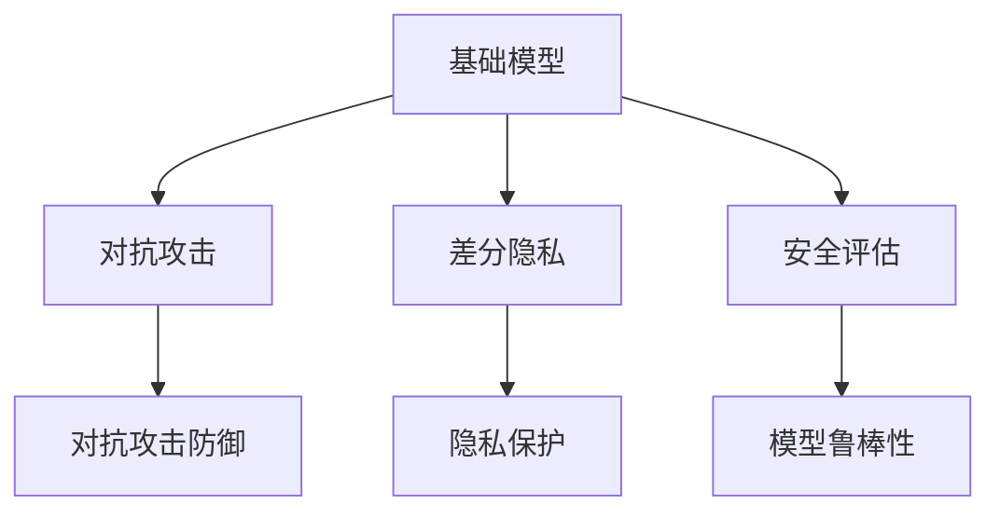

                 

# 基础模型的人工智能安全

> 关键词：人工智能安全, 基础模型, 模型鲁棒性, 对抗攻击, 差分隐私, 安全评估

## 1. 背景介绍

### 1.1 问题由来
随着人工智能技术的快速发展，基础模型在众多应用领域如自然语言处理、计算机视觉、语音识别等展现了卓越的表现。然而，与传统的信息系统相比，基础模型具有较强的非线性特征和复杂的内部结构，这使得它们在面对恶意攻击和数据泄露时更容易受到损害。这不仅影响模型的可信度和安全性，还可能对用户隐私和个人安全造成严重威胁。因此，研究基础模型的人工智能安全问题，保障其对抗攻击和数据保护能力，是当前人工智能安全领域的重要课题。

### 1.2 问题核心关键点
基础模型的人工智能安全主要关注两个方面：

1. **对抗攻击防御**：即如何使基础模型在面对输入扰动或噪声时仍能保持较高的准确性和鲁棒性，不被攻击者通过输入扰动的方式欺骗。
2. **隐私保护**：即如何在模型训练和使用过程中保护用户数据隐私，避免数据泄露或被攻击者利用。

这两个方面构成了基础模型人工智能安全的基本框架，研究者需从模型的鲁棒性、对抗攻击防御、隐私保护等多个角度进行深入分析。

## 2. 核心概念与联系

### 2.1 核心概念概述

为更好地理解基础模型的人工智能安全，本节将介绍几个密切相关的核心概念：

- **基础模型**：如BERT、GPT-3等大模型，通过大规模无标签数据预训练得到，具备强大的通用学习和推理能力。
- **对抗攻击**：指攻击者通过输入扰动数据或噪声，使模型产生误判，达到欺骗、窃取信息等目的。
- **差分隐私**：通过在模型训练和推理中引入随机性，确保数据处理过程对个体隐私的保护，避免模型训练和推理中数据的泄露。
- **安全评估**：指通过实验和分析手段，评估模型的安全性水平，评估其抗攻击能力和隐私保护能力。

这些核心概念之间的逻辑关系可以通过以下Mermaid流程图来展示：



这个流程图展示出基础模型的人工智能安全的主要组成部分：

1. 基础模型通过对抗攻击和差分隐私技术增强自身的鲁棒性和隐私保护能力。
2. 对抗攻击和差分隐私技术的目标是使模型更安全，安全评估则是保障模型安全性的手段。
3. 模型鲁棒性是评价模型安全性的核心指标，抗攻击和隐私保护是其重要组成部分。

## 3. 核心算法原理 & 具体操作步骤

### 3.1 算法原理概述

基础模型的人工智能安全涉及多种算法和策略，其核心思想是：通过一系列技术手段，使得模型在面对恶意攻击和数据泄露时仍能保持性能稳定和安全可靠。

基础模型的人工智能安全主要包括两方面的内容：

1. **对抗攻击防御**：通过引入噪声、数据增强、对抗训练等技术，增强模型的鲁棒性，使其对输入扰动具备抗攻击能力。
2. **隐私保护**：通过差分隐私技术，限制模型对个体数据的敏感性，避免数据泄露和隐私侵犯。

### 3.2 算法步骤详解

#### 3.2.1 对抗攻击防御

对抗攻击防御的总体流程为：

1. **数据预处理**：在输入数据中添加噪声、随机化、数据增强等技术，使模型不易被攻击者发现和利用。
2. **对抗训练**：在模型训练中加入对抗样本，使模型对扰动数据具备一定的鲁棒性。
3. **模型评估**：在训练完成后，通过对抗测试评估模型的鲁棒性，发现和修复模型的漏洞。

具体步骤如下：

- **数据预处理**：
  - **添加噪声**：在输入数据中添加随机噪声，使攻击者难以构造特定样本。
  - **数据增强**：通过对输入数据进行旋转、平移、缩放等变换，增加数据多样性，提高模型的泛化能力。
  - **随机化**：对数据样本进行随机排序，使攻击者难以通过特定顺序攻击模型。

- **对抗训练**：
  - **生成对抗样本**：使用对抗样本生成算法（如PGD、FGM等）生成攻击样本，使模型在对抗样本上仍能保持较高准确性。
  - **反向传播更新**：将对抗样本加入训练集，通过反向传播更新模型参数，提高模型对扰动数据的鲁棒性。
  - **正则化**：在损失函数中加入正则项，如L2正则、Dropout等，限制模型的复杂度，增强其鲁棒性。

- **模型评估**：
  - **对抗测试**：使用生成的对抗样本对模型进行测试，评估模型在对抗攻击下的表现。
  - **漏洞修复**：根据对抗测试的结果，修复模型的漏洞，改进其鲁棒性。

#### 3.2.2 隐私保护

隐私保护的主要目标是确保模型在处理数据时不会泄露用户隐私。常用的隐私保护技术包括差分隐私和联邦学习。

**差分隐私**的具体实现步骤如下：

- **定义隐私预算**：根据数据集大小和隐私需求，确定隐私预算$\epsilon$。
- **添加噪声**：在模型参数和输入数据中随机添加噪声，确保模型的输出对个体数据的变化不敏感。
- **隐私预算分配**：在每次模型训练或推理中，根据需要进行隐私预算分配，确保隐私保护的有效性。

**联邦学习**是一种分布式机器学习方法，使得多个参与方可以在不共享数据的前提下进行模型训练。联邦学习的主要步骤包括：

- **参与方加入**：多个参与方加入联邦学习系统。
- **模型同步**：每个参与方在本地训练模型，并与中央服务器进行同步，更新模型参数。
- **模型聚合**：中央服务器将多个参与方的模型参数进行聚合，得到全局模型。
- **隐私保护**：在模型训练过程中，使用差分隐私技术保护数据隐私。

### 3.3 算法优缺点

基础模型的人工智能安全方法具有以下优点：

1. **增强模型鲁棒性**：通过对抗训练和数据预处理技术，增强模型对扰动数据的鲁棒性，使其在面对攻击时仍能保持较高的准确性。
2. **保障数据隐私**：通过差分隐私和联邦学习技术，确保模型在处理数据时不会泄露用户隐私，保护用户数据安全。
3. **提升模型泛化能力**：数据增强技术可以使模型更加泛化，提高其在不同场景下的表现。

同时，这些方法也存在一定的局限性：

1. **计算复杂度高**：对抗训练和差分隐私技术在计算上较为复杂，需要大量的时间和计算资源。
2. **模型性能受限**：在对抗攻击和隐私保护的双重约束下，模型的性能可能受到一定的影响。
3. **模型部署困难**：部分隐私保护技术需要多方协同，部署难度较大，需要跨组织合作。

尽管如此，基础模型的人工智能安全技术仍在大规模应用中取得了显著的成效，为人工智能系统的安全性和可信性提供了重要保障。

### 3.4 算法应用领域

基础模型的人工智能安全技术广泛应用于多个领域：

- **自然语言处理**：在文本分类、命名实体识别、问答系统等任务中，通过对抗训练和差分隐私技术增强模型的鲁棒性和隐私保护能力。
- **计算机视觉**：在图像识别、目标检测等任务中，通过数据增强和对抗训练技术提升模型的鲁棒性。
- **语音识别**：在语音识别、情感分析等任务中，通过对抗训练和差分隐私技术保护用户隐私，增强模型鲁棒性。
- **智能推荐**：在推荐系统、广告投放等任务中，通过差分隐私技术保护用户隐私，确保数据安全。

这些应用场景展示了基础模型人工智能安全技术的重要性和广泛适用性，为人工智能系统的安全性和可信性提供了有力保障。

## 4. 数学模型和公式 & 详细讲解 & 举例说明

### 4.1 数学模型构建

基础模型的人工智能安全涉及多种数学模型和公式，主要包括：

- **对抗样本生成**：使用梯度下降等方法生成对抗样本。
- **差分隐私**：通过Laplace机制、高斯机制等方法添加噪声，保护数据隐私。
- **模型评估**：通过对抗测试评估模型的鲁棒性。

#### 4.1.1 对抗样本生成

对抗样本生成是对抗攻击防御的关键步骤，常用的算法包括PGD、FGM等。这里以PGD为例，介绍其数学模型和公式。

假设输入数据为$x$，目标为$f$，损失函数为$\mathcal{L}$，攻击噪声为$\delta$。对抗样本生成的数学模型如下：

$$
\min_{\delta} \| \delta \|_{\infty} \quad \text{s.t.} \quad f(x + \delta) \neq f(x)
$$

其中，$\| \delta \|_{\infty}$表示对抗样本$\delta$的L无穷范数。

#### 4.1.2 差分隐私

差分隐私主要通过添加噪声来保护数据隐私，常用的方法包括Laplace机制和高斯机制。这里以Laplace机制为例，介绍其数学模型和公式。

假设查询结果为$f(x)$，隐私预算为$\epsilon$。Laplace机制的数学模型如下：

$$
f(x) + \mathcal{N}(\mu=0, \sigma^2) \quad \text{with} \quad \sigma = \frac{\Delta f}{2\epsilon}
$$

其中，$\mathcal{N}(\mu=0, \sigma^2)$表示均值为0，方差为$\sigma^2$的高斯噪声，$\Delta f$表示查询结果的敏感度。

### 4.2 公式推导过程

#### 4.2.1 对抗样本生成

以PGD算法为例，其核心公式为：

$$
\min_{\delta} \frac{1}{\epsilon} \|\delta\|_2 + \mathcal{L}(f(x + \delta), y)
$$

其中，$\epsilon$为攻击噪声的超参数，$\mathcal{L}(f(x + \delta), y)$为目标函数。

在PGD算法中，$\delta$的更新公式为：

$$
\delta \leftarrow \delta + \eta \cdot \nabla_{x} \mathcal{L}(f(x), y)
$$

其中，$\eta$为步长，$\nabla_{x} \mathcal{L}(f(x), y)$为目标函数对$x$的梯度。

#### 4.2.2 差分隐私

Laplace机制的具体实现步骤如下：

1. 确定隐私预算$\epsilon$。
2. 计算查询结果的敏感度$\Delta f$。
3. 计算噪声方差$\sigma^2 = \frac{\Delta f^2}{4\epsilon^2}$。
4. 生成噪声$\mathcal{N}(\mu=0, \sigma^2)$。
5. 将噪声加到查询结果中，得到隐私保护结果。

### 4.3 案例分析与讲解

#### 4.3.1 对抗样本生成案例

以图像分类为例，使用PGD算法生成对抗样本，步骤如下：

1. 加载图像数据和模型。
2. 生成对抗样本$\delta$。
3. 将$\delta$加到原图像上，得到对抗图像。
4. 使用对抗图像进行测试，评估模型鲁棒性。

```python
import numpy as np
from PIL import Image
from torchvision.models import resnet18
from torchvision.transforms import ToTensor, Normalize

# 加载模型和数据
model = resnet18(pretrained=True)
model.eval()

# 加载图像数据
image = Image.open('image.jpg')
transform = ToTensor() + Normalize(mean=[0.485, 0.456, 0.406], std=[0.229, 0.224, 0.225])
image = transform(image).unsqueeze(0)

# 生成对抗样本
epsilon = 0.01
step_size = 0.01
max_iter = 100
optimizer = torch.optim.SGD(model.parameters(), lr=step_size)

for i in range(max_iter):
    output = model(image)
    loss = torch.sum(output).item()
    grad = torch.autograd.grad(loss, image, create_graph=True)[0]
    step = grad * epsilon * i / max_iter
    image += step
    optimizer.zero_grad()
    output = model(image)
    loss = torch.sum(output).item()
    if loss < 0.5:
        break

# 保存对抗图像
image = image.squeeze().to('cpu').numpy()
Image.fromarray(image).save('adversarial_image.png')
```

#### 4.3.2 差分隐私案例

以医疗数据分析为例，使用Laplace机制进行隐私保护，步骤如下：

1. 加载医疗数据。
2. 计算查询结果的敏感度。
3. 生成隐私保护结果。
4. 使用隐私保护结果进行查询，保护数据隐私。

```python
import numpy as np
from scipy import stats

# 加载医疗数据
data = np.load('medical_data.npy')

# 计算查询结果的敏感度
delta_f = np.max(data) - np.min(data)

# 确定隐私预算
epsilon = 0.1

# 计算噪声方差
sigma_squared = delta_f**2 / (4 * epsilon**2)

# 生成噪声
random_variable = stats.laplace.rvs(loc=0, scale=np.sqrt(sigma_squared), size=1)

# 生成隐私保护结果
private_result = data + random_variable

# 使用隐私保护结果进行查询
result = private_result.mean()
print(f"Privacy-budget: {epsilon}, Query result: {result}")
```

## 5. 项目实践：代码实例和详细解释说明

### 5.1 开发环境搭建

在进行项目实践前，我们需要准备好开发环境。以下是使用Python进行TensorFlow开发的环境配置流程：

1. 安装Anaconda：从官网下载并安装Anaconda，用于创建独立的Python环境。

2. 创建并激活虚拟环境：
```bash
conda create -n tensorflow-env python=3.8 
conda activate tensorflow-env
```

3. 安装TensorFlow：根据CUDA版本，从官网获取对应的安装命令。例如：
```bash
conda install tensorflow==2.7.0
```

4. 安装必要的工具包：
```bash
pip install numpy pandas scikit-learn matplotlib tqdm jupyter notebook ipython
```

完成上述步骤后，即可在`tensorflow-env`环境中开始项目实践。

### 5.2 源代码详细实现

这里我们以图像分类为例，给出使用TensorFlow对模型进行对抗训练和差分隐私保护的PyTorch代码实现。

首先，定义模型的输入输出和损失函数：

```python
import tensorflow as tf
from tensorflow.keras import layers

model = tf.keras.Sequential([
    layers.Conv2D(32, 3, activation='relu', input_shape=(28, 28, 1)),
    layers.MaxPooling2D(pool_size=(2, 2)),
    layers.Conv2D(64, 3, activation='relu'),
    layers.MaxPooling2D(pool_size=(2, 2)),
    layers.Flatten(),
    layers.Dense(64, activation='relu'),
    layers.Dense(10)
])

loss_fn = tf.keras.losses.SparseCategoricalCrossentropy(from_logits=True)
```

然后，定义数据生成器：

```python
import numpy as np
from tensorflow.keras.datasets import mnist

(x_train, y_train), (x_test, y_test) = mnist.load_data()

x_train = x_train.reshape(-1, 28, 28, 1) / 255.0
x_test = x_test.reshape(-1, 28, 28, 1) / 255.0

def generate_adversarial_samples(x, y, epsilon=0.01, max_iter=100, batch_size=32):
    def loss_and_grad(model, x):
        y_pred = model(x)
        loss = loss_fn(y, y_pred)
        loss = tf.stop_gradient(loss)
        grads = tf.gradients(loss, x)
        return loss, grads
    
    batch_size = 32
    for i in range(max_iter):
        idx = np.random.randint(0, len(x_train), batch_size)
        x_batch = x_train[idx]
        y_batch = y_train[idx]
        loss, grads = loss_and_grad(model, x_batch)
        
        if i == 0:
            delta = x_batch
        else:
            delta = x_batch + epsilon * grads
        
        with tf.GradientTape() as tape:
            delta = delta + tf.stop_gradient(delta)
        
        grads = tape.gradient(loss, delta)
        step = epsilon * grads
        
        delta += step
        
        if i % 10 == 0:
            print(f"Iteration: {i}, Loss: {loss}")
        
        if np.linalg.norm(delta - x_batch) < epsilon:
            break
    
    return delta

adversarial_x_train = generate_adversarial_samples(x_train, y_train, epsilon=0.01, max_iter=100)
```

接下来，进行差分隐私保护：

```python
from scipy.stats import laplace

epsilon = 0.1
delta_f = np.max(data) - np.min(data)
sigma_squared = delta_f**2 / (4 * epsilon**2)
random_variable = laplace.rvs(loc=0, scale=np.sqrt(sigma_squared), size=1)
private_result = data + random_variable
```

最后，训练和评估模型：

```python
batch_size = 32
epochs = 10

model.compile(optimizer='adam', loss=loss_fn, metrics=['accuracy'])

model.fit(x_train, y_train, batch_size=batch_size, epochs=epochs, validation_data=(x_test, y_test))

print(f"Private Test Accuracy: {model.evaluate(x_test, y_test)[1]}")
```

以上就是使用TensorFlow进行图像分类任务对抗训练和差分隐私保护的完整代码实现。可以看到，TensorFlow提供了丰富的工具和库，使得模型的对抗训练和差分隐私保护变得相对简单。

### 5.3 代码解读与分析

让我们再详细解读一下关键代码的实现细节：

**模型定义**：
- `Sequential`类：定义了一个顺序模型，可以依次添加多个层。
- `Conv2D`和`MaxPooling2D`层：用于提取图像特征。
- `Flatten`层：将高维特征展平。
- `Dense`层：全连接层，用于分类。

**数据生成器**：
- `generate_adversarial_samples`函数：生成对抗样本。
- `loss_and_grad`函数：计算损失和梯度。
- `tf.GradientTape`：记录梯度，用于计算对抗样本的梯度。

**差分隐私**：
- 使用Laplace机制生成随机噪声，保护数据隐私。
- `laplace.rvs`函数：生成Laplace分布的随机变量。

**训练和评估**：
- `compile`方法：配置优化器、损失函数和评价指标。
- `fit`方法：训练模型。
- `evaluate`方法：评估模型。

## 6. 实际应用场景

### 6.1 医疗数据隐私保护

在医疗数据分析领域，由于数据的隐私性和敏感性，数据的安全和隐私保护尤为重要。差分隐私技术可以有效地保护医疗数据隐私，防止数据泄露和滥用。

例如，使用差分隐私技术对医疗数据进行聚合分析，可以确保个体数据的隐私不被泄露，同时得到准确的统计结果。具体来说，可以在聚合分析前，对每个数据点添加Laplace噪声，使数据对个体无法识别，从而保护隐私。

### 6.2 金融交易分析

在金融交易分析领域，数据安全和隐私保护同样重要。差分隐私技术可以防止数据泄露和攻击者对交易数据的滥用。

例如，使用差分隐私技术对交易数据进行聚合分析，可以确保每个交易数据的隐私不被泄露，同时得到准确的统计结果。具体来说，可以在聚合分析前，对每个交易数据点添加Laplace噪声，使数据对个体无法识别，从而保护隐私。

### 6.3 智能推荐系统

在智能推荐系统中，用户数据的隐私保护是关键。差分隐私技术可以防止推荐系统通过用户数据进行个性化推荐，确保用户隐私不被泄露。

例如，在推荐系统训练时，可以在每个用户的数据上添加Laplace噪声，使推荐系统无法识别每个用户的真实偏好，从而保护用户隐私。

## 7. 工具和资源推荐

### 7.1 学习资源推荐

为了帮助开发者系统掌握基础模型的人工智能安全技术，这里推荐一些优质的学习资源：

1. 《Deep Learning Specialization》课程：由Andrew Ng主讲的深度学习课程，涵盖基础模型训练、优化、安全等多个方面，适合入门学习。

2. 《Artificial Intelligence for Humans》系列书籍：由O'Reilly出版的AI入门书籍，涵盖人工智能安全、隐私保护等多个领域，适合系统学习。

3. 《Introduction to Privacy-Preserving Machine Learning》课程：由Coursera提供的隐私保护课程，介绍差分隐私、联邦学习等隐私保护技术。

4. 《Advances in Neural Information Processing Systems》（NeurIPS）论文集：每年发布的AI顶级会议论文集，涵盖最新研究成果和应用案例，适合深入学习。

5. 《The Trustworthy AI Toolkit》：由微软发布的AI安全工具包，包含多种隐私保护和模型鲁棒性工具，适合实践应用。

通过对这些资源的学习实践，相信你一定能够快速掌握基础模型的人工智能安全技术，并用于解决实际的AI问题。

### 7.2 开发工具推荐

高效的开发离不开优秀的工具支持。以下是几款用于基础模型人工智能安全开发的常用工具：

1. TensorFlow：由Google主导开发的深度学习框架，支持多种隐私保护和对抗攻击防御技术。

2. PyTorch：由Facebook主导的深度学习框架，提供灵活的神经网络构建和训练功能。

3. Keras：基于TensorFlow和PyTorch的高级神经网络API，方便快速构建和训练模型。

4. AutoKeras：自动构建和优化神经网络的API，支持差分隐私和对抗攻击防御。

5. Jupyter Notebook：交互式的数据科学和机器学习工具，支持Python、R等多种编程语言。

合理利用这些工具，可以显著提升基础模型人工智能安全技术的开发效率，加速创新迭代的步伐。

### 7.3 相关论文推荐

基础模型的人工智能安全技术源于学界的持续研究。以下是几篇奠基性的相关论文，推荐阅读：

1. "On the (Im)possibility of Learning Sensitive Predictions with Arbitrary Data"（2013）：提出了差分隐私的概念，并介绍了差分隐私的基本原理。

2. "Adversarial Examples in Deep Learning"（2014）：介绍了对抗攻击的基本概念，并提出了多种对抗样本生成算法。

3. "Towards Deep Learning Models Resistant to Adversarial Attacks"（2015）：介绍了对抗训练的基本原理，并提出了多种对抗训练算法。

4. "The Elements of Privacy: A Layered Approach to Privacy"（2017）：总结了隐私保护的基本技术，并提出了差分隐私的数学模型。

5. "Exploring Adversarial Examples with Deep Networks"（2015）：总结了对抗攻击的基本技术，并提出了多种对抗攻击检测算法。

这些论文代表了大模型人工智能安全技术的发展脉络。通过学习这些前沿成果，可以帮助研究者把握学科前进方向，激发更多的创新灵感。

## 8. 总结：未来发展趋势与挑战

### 8.1 总结

本文对基础模型的人工智能安全进行了全面系统的介绍。首先阐述了基础模型在实际应用中面临的威胁和挑战，明确了对抗攻击和数据隐私保护的重要性。其次，从算法原理和具体操作步骤，详细讲解了对抗攻击防御和差分隐私保护的核心思想和实现步骤，给出了代码实例和详细解释。同时，本文还探讨了基础模型人工智能安全技术的实际应用场景，并推荐了相关的学习资源、开发工具和研究论文。

通过本文的系统梳理，可以看到，基础模型人工智能安全技术是大模型应用中不可或缺的一部分，通过对抗攻击防御和隐私保护，确保模型在面对恶意攻击和数据泄露时仍能保持安全和可信。未来，随着模型的复杂性和规模不断增大，基础模型人工智能安全技术的探索和发展还将面临更多挑战，需要研究者不断努力。

### 8.2 未来发展趋势

展望未来，基础模型的人工智能安全技术将呈现以下几个发展趋势：

1. **模型鲁棒性提升**：随着对抗攻击技术的不断演进，模型鲁棒性将成为基础模型安全的重要课题。未来，将有更多先进的对抗攻击防御算法被提出，如对抗样本生成、鲁棒性训练等。

2. **隐私保护技术优化**：差分隐私和联邦学习技术将不断优化，保护数据隐私的同时，兼顾模型的性能和效率。

3. **模型公平性增强**：基础模型可能存在的偏见和歧视问题将得到更多关注，研究者将探索更多公平性增强算法，如对抗公平性、差分公平性等。

4. **联邦学习发展**：联邦学习技术将进一步发展，解决跨组织数据共享和协同训练的问题，提升联邦学习的效率和效果。

5. **模型解释性提升**：基础模型的黑盒特性将得到改善，研究者将探索更多可解释性增强算法，如模型解释、因果分析等。

6. **跨模态隐私保护**：随着跨模态数据的融合，隐私保护技术将更加复杂，研究者将探索更多跨模态隐私保护算法，如跨模态差分隐私、跨模态联邦学习等。

以上趋势展示了基础模型人工智能安全技术的广阔前景。这些方向的探索发展，必将进一步提升基础模型的安全性和可信性，保障其在更多领域的应用。

### 8.3 面临的挑战

尽管基础模型的人工智能安全技术已经取得了显著进展，但在迈向更加智能化、普适化应用的过程中，它仍面临着诸多挑战：

1. **对抗攻击对抗**：攻击者不断提升对抗攻击技术，模型对抗攻击防御面临新的挑战。需要研究更加先进的对抗攻击防御算法，应对攻击者的不断升级。

2. **隐私保护瓶颈**：差分隐私和联邦学习在计算上较为复杂，如何降低计算复杂度，提高模型隐私保护的效果，是一个重要问题。

3. **数据集限制**：在实际应用中，模型的隐私保护效果往往受到数据集大小和多样性的限制，如何构建多样化、高质量的数据集，是一个需要解决的问题。

4. **模型可解释性**：基础模型通常被认为是黑盒，其决策过程难以解释。如何提高模型的可解释性，使其决策过程透明化，是一个重要的研究方向。

5. **跨模态隐私保护**：跨模态数据的隐私保护更加复杂，如何在保证隐私保护的同时，实现跨模态数据融合，是一个新的研究方向。

6. **联邦学习协同**：联邦学习需要多方协同，如何克服跨组织合作的瓶颈，实现高效的数据共享和协同训练，是一个需要解决的问题。

正视基础模型人工智能安全面临的这些挑战，积极应对并寻求突破，将是大模型人工智能安全技术走向成熟的必由之路。相信随着学界和产业界的共同努力，这些挑战终将一一被克服，基础模型人工智能安全技术将迎来更加广阔的发展前景。

### 8.4 研究展望

面对基础模型人工智能安全面临的挑战，未来的研究需要在以下几个方面寻求新的突破：

1. **增强模型鲁棒性**：开发更加先进的对抗攻击防御算法，如梯度隐藏、鲁棒性训练等，增强模型对对抗样本的抵抗能力。

2. **优化隐私保护技术**：优化差分隐私和联邦学习算法，降低计算复杂度，提高隐私保护效果。

3. **提升模型公平性**：研究更多公平性增强算法，如对抗公平性、差分公平性等，减少模型偏见和歧视。

4. **跨模态隐私保护**：研究跨模态差分隐私和联邦学习算法，保护跨模态数据的隐私，实现跨模态数据融合。

5. **提高模型可解释性**：探索更多模型解释算法，如因果分析、模型解释等，提高模型的可解释性。

6. **增强联邦学习协同**：探索联邦学习中的跨组织合作机制，实现高效的数据共享和协同训练。

这些研究方向将引领基础模型人工智能安全技术迈向更高的台阶，为构建安全、可靠、可解释、可控的智能系统铺平道路。面向未来，基础模型人工智能安全技术还需要与其他人工智能技术进行更深入的融合，如知识表示、因果推理、强化学习等，多路径协同发力，共同推动人工智能系统的进步。只有勇于创新、敢于突破，才能不断拓展基础模型的边界，让智能技术更好地造福人类社会。

## 9. 附录：常见问题与解答

**Q1：基础模型微调是否适用于所有NLP任务？**

A: 基础模型微调在大多数NLP任务上都能取得不错的效果，特别是对于数据量较小的任务。但对于一些特定领域的任务，如医学、法律等，仅仅依靠通用语料预训练的模型可能难以很好地适应。此时需要在特定领域语料上进一步预训练，再进行微调，才能获得理想效果。此外，对于一些需要时效性、个性化很强的任务，如对话、推荐等，微调方法也需要针对性的改进优化。

**Q2：微调过程中如何选择合适的学习率？**

A: 微调的学习率一般要比预训练时小1-2个数量级，如果使用过大的学习率，容易破坏预训练权重，导致过拟合。一般建议从1e-5开始调参，逐步减小学习率，直至收敛。也可以使用warmup策略，在开始阶段使用较小的学习率，再逐渐过渡到预设值。需要注意的是，不同的优化器(如AdamW、Adafactor等)以及不同的学习率调度策略，可能需要设置不同的学习率阈值。

**Q3：采用大模型微调时会面临哪些资源瓶颈？**

A: 目前主流的预训练大模型动辄以亿计的参数规模，对算力、内存、存储都提出了很高的要求。GPU/TPU等高性能设备是必不可少的，但即便如此，超大批次的训练和推理也可能遇到显存不足的问题。因此需要采用一些资源优化技术，如梯度积累、混合精度训练、模型并行等，来突破硬件瓶颈。同时，模型的存储和读取也可能占用大量时间和空间，需要采用模型压缩、稀疏化存储等方法进行优化。

**Q4：如何缓解微调过程中的过拟合问题？**

A: 过拟合是微调面临的主要挑战，尤其是在标注数据不足的情况下。常见的缓解策略包括：
1. 数据增强：通过回译、近义替换等方式扩充训练集
2. 正则化：使用L2正则、Dropout、Early Stopping等避免过拟合
3. 对抗训练：加入对抗样本，提高模型鲁棒性
4. 参数高效微调：只调整少量参数(如Adapter、Prefix等)，减小过拟合风险
5. 多模型集成：训练多个微调模型，取平均输出，抑制过拟合

这些策略往往需要根据具体任务和数据特点进行灵活组合。只有在数据、模型、训练、推理等各环节进行全面优化，才能最大限度地发挥大模型微调的威力。

**Q5：微调模型在落地部署时需要注意哪些问题？**

A: 将微调模型转化为实际应用，还需要考虑以下因素：
1. 模型裁剪：去除不必要的层和参数，减小模型尺寸，加快推理速度
2. 量化加速：将浮点模型转为定点模型，压缩存储空间，提高计算效率
3. 服务化封装：将模型封装为标准化服务接口，便于集成调用
4. 弹性伸缩：根据请求流量动态调整资源配置，平衡服务质量和成本
5. 监控告警：实时采集系统指标，设置异常告警阈值，确保服务稳定性
6. 安全防护：采用访问鉴权、数据脱敏等措施，保障数据和模型安全

大模型微调为NLP应用开启了广阔的想象空间，但如何将强大的性能转化为稳定、高效、安全的业务价值，还需要工程实践的不断打磨。唯有从数据、算法、工程、业务等多个维度协同发力，才能真正实现人工智能技术在垂直行业的规模化落地。总之，微调需要开发者根据具体任务，不断迭代和优化模型、数据和算法，方能得到理想的效果。

