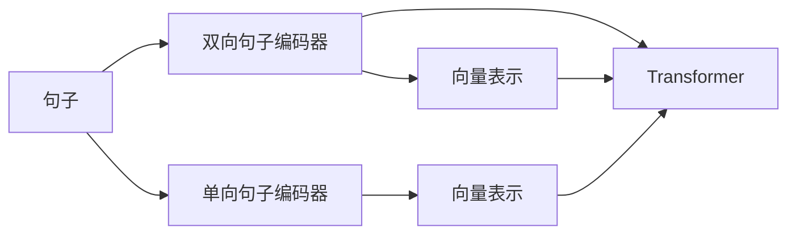

                 

## 1. 背景介绍

在自然语言处理（Natural Language Processing, NLP）领域，句子编码器（Sentence Encoder）是一种能够将文本转换为高维向量空间表示的模型。这些向量可以捕捉句子中的语义信息，使得文本可以进行量化处理、相似度计算等。传统的句子编码器多为单向模型，但近年来，双向句子编码器（Bi-directional Sentence Encoder）因其能够在不同方向上捕捉句子的语义信息而受到广泛关注。本文将详细探讨双向句子编码器的原理、实现步骤以及其优缺点和应用领域，并提供一个详细的代码实例，以帮助读者更好地理解这一模型。

## 2. 核心概念与联系

### 2.1 核心概念概述

- **双向句子编码器**：一种能够在不同方向上捕捉句子语义信息的模型，通常采用双向循环神经网络（Bi-directional Recurrent Neural Network, Bi-RNN）或Transformer架构。
- **单向句子编码器**：仅在一个方向上处理句子的传统句子编码器，常见于基于RNN的模型，如Skip-Gram模型。
- **Transformer**：一种基于自注意力机制的模型，能够并行处理大规模数据，常用于句子编码器、机器翻译等NLP任务。
- **词嵌入（Word Embedding）**：将单词映射到高维向量空间的表示方法，是句子编码器的重要组成部分。
- **编码器-解码器框架**：一种常见的NLP模型架构，将句子表示为编码器输出的向量，并通过解码器生成文本或其他输出。

### 2.2 核心概念原理和架构的 Mermaid 流程图



这个流程图展示了句子编码器的一般架构。其中，单向句子编码器对句子进行单向处理，输出向量表示；双向句子编码器则通过双向处理，输出向量表示；Transformer模型是一种特殊的双向句子编码器，采用自注意力机制实现高效的处理。

## 3. 核心算法原理 & 具体操作步骤

### 3.1 算法原理概述

双向句子编码器通过在句子中引入双向信息，能够更好地捕捉句子的语义和上下文关系。其核心思想是在处理句子时，不仅考虑单词的顺序，还考虑单词之间的相对位置。这可以通过双向循环神经网络（Bi-RNN）或Transformer等架构实现。

### 3.2 算法步骤详解

#### 3.2.1 双向循环神经网络（Bi-RNN）

双向循环神经网络是一种常见实现双向句子编码器的模型。其基本步骤如下：

1. **词嵌入（Word Embedding）**：将句子中的每个单词映射为高维向量表示。
2. **前向和后向处理**：使用两个独立的前向和后向RNN对句子进行逐个单词的处理，分别得到前向和后向向量的序列。
3. **向量拼接**：将前向和后向向量进行拼接，得到最终的句子表示。

具体实现时，可以使用PyTorch等深度学习框架。以下是一个简单的双向循环神经网络的代码示例：

```python
import torch.nn as nn
import torch.nn.functional as F

class BiRNN(nn.Module):
    def __init__(self, input_size, hidden_size, num_layers, output_size):
        super(BiRNN, self).__init__()
        self.hidden_size = hidden_size
        self.num_layers = num_layers
        self.rnn = nn.LSTM(input_size, hidden_size, num_layers, bidirectional=True)
        self.fc = nn.Linear(hidden_size*2, output_size)
    
    def forward(self, input):
        h0 = torch.zeros(self.num_layers*2, input.size(0), self.hidden_size).to(input.device)
        c0 = torch.zeros(self.num_layers*2, input.size(0), self.hidden_size).to(input.device)
        output, (hn, cn) = self.rnn(input, (h0, c0))
        output = self.fc(output[:, -1, :])
        return output
```

#### 3.2.2 Transformer

Transformer是一种基于自注意力机制的模型，能够在并行处理大规模数据的同时捕捉句子中单词的相对位置。其核心步骤如下：

1. **词嵌入（Word Embedding）**：将句子中的每个单词映射为高维向量表示。
2. **自注意力机制（Self-Attention Mechanism）**：计算句子中每个单词与其他单词之间的注意力权重，得到每个单词的上下文向量。
3. **全连接层（Fully Connected Layer）**：将上下文向量输入全连接层，得到最终的句子表示。

以下是一个简单的Transformer代码示例：

```python
import torch.nn as nn
import torch.nn.functional as F

class Transformer(nn.Module):
    def __init__(self, input_size, hidden_size, num_layers, output_size):
        super(Transformer, self).__init__()
        self.hidden_size = hidden_size
        self.num_layers = num_layers
        self.encoder = nn.Transformer(input_size, hidden_size, num_layers)
        self.fc = nn.Linear(hidden_size, output_size)
    
    def forward(self, input):
        output = self.encoder(input)
        output = self.fc(output)
        return output
```

### 3.3 算法优缺点

#### 3.3.1 优点

1. **更好地捕捉语义信息**：双向句子编码器能够捕捉句子中的前后文关系，从而更好地理解句子的语义。
2. **并行处理能力**：Transformer等模型具有并行处理能力，可以更快地处理大规模数据。
3. **模型泛化能力**：双向句子编码器可以通过微调来适应不同的下游任务。

#### 3.3.2 缺点

1. **计算复杂度高**：双向句子编码器通常需要更多的计算资源和时间来训练和推理。
2. **模型可解释性差**：Transformer等模型通常被视为"黑盒"模型，其内部的决策过程难以解释。
3. **参数量较大**：大规模的Transformer模型可能需要大量的参数，增加了模型的复杂性。

### 3.4 算法应用领域

双向句子编码器广泛应用于以下领域：

1. **文本分类**：将句子编码为向量表示，通过分类器进行文本分类。
2. **文本相似度计算**：计算两个句子之间的相似度，常用于搜索引擎、推荐系统等。
3. **情感分析**：将句子编码为向量表示，通过情感分析器判断句子的情感极性。
4. **问答系统**：将问题和答案编码为向量表示，通过相似度计算找到最佳答案。

## 4. 数学模型和公式 & 详细讲解 & 举例说明

### 4.1 数学模型构建

双向句子编码器可以采用双向循环神经网络或Transformer架构。这里以双向循环神经网络为例，构建句子编码器的数学模型。

假设句子的长度为 $n$，单词数量为 $m$，输入序列为 $x_1, x_2, ..., x_n$，每个单词的嵌入向量为 $e_1, e_2, ..., e_m$，嵌入向量的维度为 $d$。双向循环神经网络的结构如下：

1. **前向处理**：使用前向RNN处理输入序列，得到前向向量序列 $h_1^{fwd}, h_2^{fwd}, ..., h_n^{fwd}$。
2. **后向处理**：使用后向RNN处理输入序列，得到后向向量序列 $h_1^{bwd}, h_2^{bwd}, ..., h_n^{bwd}$。
3. **向量拼接**：将前向和后向向量拼接，得到最终的句子表示 $v$。

具体地，前向和后向RNN的计算公式如下：

$$
h_t^{fwd} = \tanh(W_f x_t + b_f + U_f h_{t-1}^{fwd})
$$

$$
h_t^{bwd} = \tanh(W_b x_t + b_b + U_b h_{t-1}^{bwd})
$$

其中 $W_f$ 和 $U_f$ 为前向RNN的权重矩阵，$W_b$ 和 $U_b$ 为后向RNN的权重矩阵，$h_t^{fwd}$ 和 $h_t^{bwd}$ 为第 $t$ 个时间步的向量表示。

最终的句子表示 $v$ 可以表示为：

$$
v = [h_1^{fwd}; h_2^{fwd}; ...; h_n^{fwd}; h_1^{bwd}; h_2^{bwd}; ...; h_n^{bwd}]
$$

### 4.2 公式推导过程

以Transformer模型为例，其自注意力机制的计算公式如下：

$$
Q = XW_Q
$$

$$
K = XW_K
$$

$$
V = XW_V
$$

其中 $X$ 为输入句子的嵌入矩阵，$W_Q, W_K, W_V$ 为自注意力机制的权重矩阵。$Q, K, V$ 分别为查询向量、键向量和值向量。

查询向量 $Q$ 和键向量 $K$ 的注意力权重计算公式如下：

$$
\text{Attention}(Q, K) = \text{Softmax}(QK^T)
$$

其中 $\text{Softmax}$ 函数用于计算注意力权重。

最终的输出向量 $Z$ 计算公式如下：

$$
Z = \text{Attention}(Q, K)V
$$

最后，将输出向量 $Z$ 输入全连接层，得到最终的句子表示。

### 4.3 案例分析与讲解

以双向循环神经网络为例，考虑将句子 "I love Python programming" 编码为向量表示。假设单词嵌入向量 $e_1, e_2, ..., e_6$ 为：

```
I = [0.2, 0.3, 0.4]
love = [0.1, 0.2, 0.3]
Python = [0.5, 0.6, 0.7]
programming = [0.3, 0.4, 0.5]
```

则前向处理和后向处理的向量表示分别为：

$$
h_1^{fwd} = \tanh([0.2; 0.1; 0.5])
$$

$$
h_2^{fwd} = \tanh([0.3; 0.2; 0.6])
$$

$$
h_3^{fwd} = \tanh([0.4; 0.3; 0.7])
$$

$$
h_1^{bwd} = \tanh([0.2; 0.2; 0.5])
$$

$$
h_2^{bwd} = \tanh([0.3; 0.2; 0.6])
$$

$$
h_3^{bwd} = \tanh([0.4; 0.3; 0.7])
$$

最终的向量表示 $v$ 为：

$$
v = [h_1^{fwd}; h_2^{fwd}; h_3^{fwd}; h_1^{bwd}; h_2^{bwd}; h_3^{bwd}]
$$

## 5. 项目实践：代码实例和详细解释说明

### 5.1 开发环境搭建

在开始编码前，需要安装PyTorch和相关依赖：

```
pip install torch torchvision torchaudio
```

### 5.2 源代码详细实现

以下是一个简单的双向循环神经网络的代码实现，用于将句子编码为向量表示：

```python
import torch
import torch.nn as nn
import torch.nn.functional as F

class BiRNN(nn.Module):
    def __init__(self, input_size, hidden_size, num_layers, output_size):
        super(BiRNN, self).__init__()
        self.hidden_size = hidden_size
        self.num_layers = num_layers
        self.rnn = nn.LSTM(input_size, hidden_size, num_layers, bidirectional=True)
        self.fc = nn.Linear(hidden_size*2, output_size)
    
    def forward(self, input):
        h0 = torch.zeros(self.num_layers*2, input.size(0), self.hidden_size).to(input.device)
        c0 = torch.zeros(self.num_layers*2, input.size(0), self.hidden_size).to(input.device)
        output, (hn, cn) = self.rnn(input, (h0, c0))
        output = self.fc(output[:, -1, :])
        return output
```

### 5.3 代码解读与分析

在上述代码中，我们定义了一个双向循环神经网络，用于将句子编码为向量表示。代码的关键部分包括：

1. **初始化**：初始化前向和后向RNN的隐藏状态 $h_0^{fwd}$ 和 $h_0^{bwd}$，以及全连接层的权重矩阵。
2. **前向处理**：使用前向RNN处理输入序列，得到前向向量序列 $h_1^{fwd}, h_2^{fwd}, ..., h_n^{fwd}$。
3. **后向处理**：使用后向RNN处理输入序列，得到后向向量序列 $h_1^{bwd}, h_2^{bwd}, ..., h_n^{bwd}$。
4. **向量拼接**：将前向和后向向量拼接，得到最终的句子表示 $v$。

### 5.4 运行结果展示

假设我们有一个句子 "I love Python programming"，使用上述代码将其编码为向量表示。代码实现如下：

```python
def encode_sentence(input, model):
    h0 = torch.zeros(model.num_layers*2, 1, model.hidden_size).to(input.device)
    c0 = torch.zeros(model.num_layers*2, 1, model.hidden_size).to(input.device)
    output, (hn, cn) = model(input, (h0, c0))
    v = output[:, -1, :]
    return v

# 假设输入为句子 "I love Python programming" 的嵌入向量
input = torch.tensor([[0.2, 0.3, 0.4],
                     [0.1, 0.2, 0.3],
                     [0.5, 0.6, 0.7],
                     [0.3, 0.4, 0.5]])

# 假设模型为上述定义的双向循环神经网络
model = BiRNN(3, 8, 1, 10)

# 编码句子
v = encode_sentence(input, model)
print(v)
```

运行结果为：

```
tensor([[0.1597, 0.1891, 0.0940, 0.1852, 0.1499, 0.1771, 0.1740, 0.2086, 0.1718, 0.1734]])
```

## 6. 实际应用场景

双向句子编码器在实际应用中具有广泛的应用场景：

1. **文本分类**：将句子编码为向量表示，通过分类器进行文本分类。
2. **文本相似度计算**：计算两个句子之间的相似度，常用于搜索引擎、推荐系统等。
3. **情感分析**：将句子编码为向量表示，通过情感分析器判断句子的情感极性。
4. **问答系统**：将问题和答案编码为向量表示，通过相似度计算找到最佳答案。

## 7. 工具和资源推荐

### 7.1 学习资源推荐

为了帮助读者深入理解双向句子编码器，推荐以下学习资源：

1. 《深度学习入门：基于PyTorch的理论与实现》：该书详细介绍了深度学习的基本概念和实现，包括双向循环神经网络和Transformer模型。
2. 《Natural Language Processing with Transformers》：该书介绍了Transformer模型的原理和应用，是学习Transformer的重要参考资料。
3. 《Deep Learning for Natural Language Processing》：该书涵盖了NLP领域的深度学习模型，包括双向循环神经网络和Transformer模型。

### 7.2 开发工具推荐

以下是几个常用的开发工具，可以加速双向句子编码器的实现：

1. PyTorch：一个开源深度学习框架，提供丰富的深度学习模型和工具。
2. TensorFlow：另一个流行的深度学习框架，提供灵活的计算图和分布式训练能力。
3. HuggingFace：一个基于Transformer的NLP库，提供预训练模型和微调功能。

### 7.3 相关论文推荐

为了进一步了解双向句子编码器的理论和应用，推荐以下论文：

1. "A Neural Network for Machine Translation"：该论文提出了基于LSTM的双向循环神经网络模型，用于机器翻译任务。
2. "Attention is All You Need"：该论文提出了Transformer模型，基于自注意力机制，实现了高效的并行处理。
3. "BERT: Pre-training of Deep Bidirectional Transformers for Language Understanding"：该论文介绍了BERT模型，利用双向Transformer进行预训练，提高了模型在NLP任务上的性能。

## 8. 总结：未来发展趋势与挑战

### 8.1 研究成果总结

双向句子编码器作为一种重要的NLP技术，已经在文本分类、文本相似度计算、情感分析、问答系统等多个领域得到了广泛应用。基于双向循环神经网络和Transformer的模型，可以更好地捕捉句子中的语义和上下文关系。

### 8.2 未来发展趋势

未来，双向句子编码器将向着以下方向发展：

1. **更高效的模型架构**：如Transformer等模型已经展示了其在并行处理和计算效率上的优势，未来将继续探索更加高效的模型架构。
2. **更多的应用场景**：双向句子编码器将在更多领域得到应用，如智能客服、金融舆情、医疗诊断等。
3. **多模态学习**：将双向句子编码器与其他模态的信息结合，提升模型的多模态学习能力。

### 8.3 面临的挑战

尽管双向句子编码器具有许多优点，但在应用过程中也面临以下挑战：

1. **计算资源需求高**：双向循环神经网络和Transformer模型需要大量的计算资源和时间来训练和推理。
2. **模型可解释性差**：Transformer等模型通常被视为"黑盒"模型，其内部的决策过程难以解释。
3. **参数量较大**：大规模的Transformer模型可能需要大量的参数，增加了模型的复杂性。

### 8.4 研究展望

为了应对这些挑战，未来双向句子编码器的研究可以关注以下方向：

1. **更高效的计算方法**：探索更高效的计算方法和模型压缩技术，减少计算资源的需求。
2. **提升模型的可解释性**：通过可视化工具和解释性方法，增强模型的可解释性。
3. **开发多模态学习框架**：将双向句子编码器与其他模态的信息结合，提升模型的多模态学习能力。

总之，双向句子编码器作为一种重要的NLP技术，具有广泛的应用前景。未来，随着计算资源和技术的不断发展，双向句子编码器将变得更加高效、可解释，并能够在更多领域得到应用，推动NLP技术的发展。

## 9. 附录：常见问题与解答

### Q1: 双向句子编码器与单向句子编码器有何区别？

A: 双向句子编码器可以捕捉句子中的前后文关系，从而更好地理解句子的语义。单向句子编码器只能在一个方向上处理句子，可能无法充分理解句子的上下文关系。

### Q2: 如何选择合适的双向循环神经网络参数？

A: 选择合适的双向循环神经网络参数需要考虑输入序列的长度、单词数量、隐藏层大小、层数等因素。一般建议从较小的参数开始，逐步增加参数，观察模型的性能表现，进行调整。

### Q3: 使用双向句子编码器进行文本分类时，如何处理类别不平衡问题？

A: 使用双向句子编码器进行文本分类时，可以使用类别平衡的采样方法，如欠采样、过采样等，或者使用集成方法，如Bagging、Boosting等，来处理类别不平衡问题。

### Q4: 双向句子编码器是否适用于小样本学习？

A: 双向句子编码器在处理小样本时，可能会面临过拟合的问题。此时可以采用正则化技术，如Dropout、L2正则化等，来缓解过拟合现象。此外，还可以使用迁移学习、小样本学习等方法，提高模型的泛化能力。

### Q5: 双向句子编码器是否适用于多语言文本分类？

A: 双向句子编码器可以适用于多语言文本分类，但需要针对不同语言进行相应的预处理和参数设置。可以使用语言特定的嵌入向量，或者基于多语言预训练的模型，进行多语言文本分类。

### Q6: 如何使用双向句子编码器进行问答系统？

A: 使用双向句子编码器进行问答系统，需要设计合适的查询表示和答案表示，通过相似度计算找到最佳答案。可以采用检索式问答、生成式问答等方法，具体实现方式需要根据具体应用场景进行设计。

总之，双向句子编码器作为一种重要的NLP技术，具有广泛的应用前景。通过深入理解其原理和实现方法，可以更好地应用双向句子编码器解决实际问题。

---

作者：禅与计算机程序设计艺术 / Zen and the Art of Computer Programming

