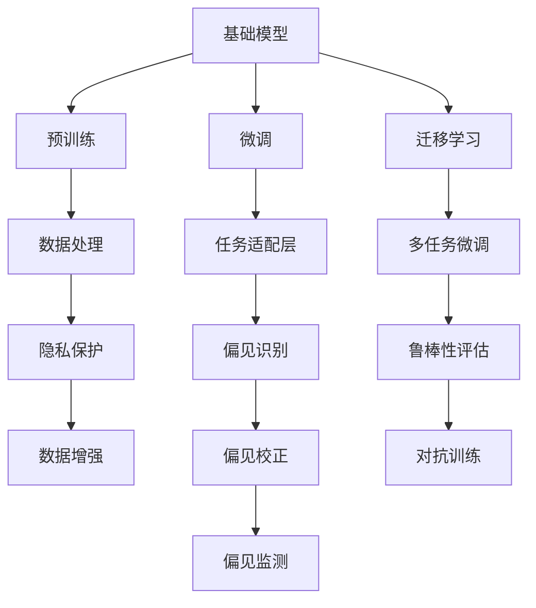

                 

# 基础模型的社会危害评估

## 1. 背景介绍

在人工智能技术飞速发展的今天，人工智能(AI)正逐步渗透到各个领域，改变了人们的生活和工作方式。然而，与此同时，AI技术带来的社会危害也逐渐引起了广泛关注。基础模型作为AI应用的核心，其社会危害评估成为确保AI健康发展的重要环节。本博客将深入探讨基础模型的社会危害评估，旨在为政策制定者、企业开发者和公众提供参考，促进AI技术的健康发展。

## 2. 核心概念与联系

### 2.1 核心概念概述

**基础模型**：指在大规模无标签数据上进行预训练，并通过微调或迁移学习进行任务适配的通用语言模型。如GPT-3、BERT等，具有强大的语言理解和生成能力。

**社会危害**：指基础模型在使用过程中可能对个体、群体、社会乃至全球产生的负面影响。如隐私泄露、偏见歧视、误导性输出等。

**社会危害评估**：对基础模型使用过程中可能带来的社会危害进行系统性分析和评估，制定相应的风险管理策略和规范指导，以期最大化减少社会危害。

### 2.2 核心概念原理和架构的 Mermaid 流程图



此图展示了基础模型的构建、预训练、微调等关键步骤，以及社会危害评估中的各个环节。数据处理、任务适配层、多任务微调、隐私保护、偏见识别、鲁棒性评估、数据增强、偏见校正、对抗训练和偏见监测等步骤，构成了基础模型社会危害评估的完整框架。

## 3. 核心算法原理 & 具体操作步骤

### 3.1 算法原理概述

基础模型的社会危害评估主要涉及以下几个方面：数据质量、模型偏见、鲁棒性、隐私保护和伦理审查。通过对这些关键指标的系统评估，可以全面了解基础模型的社会危害程度，从而制定相应的风险管理策略。

### 3.2 算法步骤详解

**Step 1: 数据质量评估**
- 评估数据的多样性、代表性、真实性和完备性。
- 检查数据中是否存在样本偏差、数据泄露等问题。
- 使用标准化评估指标如Prestige、Relevance等，对数据质量进行定量和定性评估。

**Step 2: 模型偏见识别**
- 通过预训练数据和微调数据中的类别分布，识别模型中可能存在的偏见。
- 使用统计方法如方差分析、卡方检验等，检测不同群体间的性能差异。
- 引入公平性评估指标如Demographic Parity、Equalized Odds等，评估模型在不同群体中的表现。

**Step 3: 模型鲁棒性评估**
- 使用对抗样本对模型进行测试，评估其对抗鲁棒性。
- 对模型在噪声、扰动等环境变化下的性能进行评估。
- 引入鲁棒性指标如Invariance、Robustness等，对模型鲁棒性进行量化。

**Step 4: 隐私保护评估**
- 检查模型是否存在隐私泄露风险，如隐私数据泄露、数据重识别等问题。
- 评估模型的可解释性和透明性，确保用户对模型的决策过程有清晰的理解。
- 使用隐私保护技术如差分隐私、联邦学习等，提升模型的隐私保护能力。

**Step 5: 伦理审查**
- 评估模型在处理敏感信息、伦理问题时的表现。
- 确保模型输出符合社会伦理规范，如不传播暴力、色情等内容。
- 建立伦理审查机制，定期对模型进行伦理审查和更新。

**Step 6: 综合评估与风险管理**
- 将以上评估结果进行综合分析，形成基础模型社会危害评估报告。
- 根据评估结果，制定相应的风险管理策略和规范指导，如数据清洗、模型偏见校正、隐私保护加强等。
- 对模型进行持续监控和评估，确保其社会危害处于可控范围内。

### 3.3 算法优缺点

**优点**：
- 系统性地评估了基础模型的各个方面，全面了解其社会危害程度。
- 通过风险管理策略和规范指导，最大化减少社会危害，提升模型应用的可靠性。

**缺点**：
- 评估过程复杂，需要投入大量资源和时间。
- 部分评估指标如隐私保护、伦理审查等，难以量化和自动化。

### 3.4 算法应用领域

基础模型的社会危害评估广泛适用于各种AI应用场景，如智能客服、金融风险控制、医疗诊断等。通过评估基础模型的社会危害，可以为这些领域的AI应用提供指导，确保其健康、可持续的发展。

## 4. 数学模型和公式 & 详细讲解 & 举例说明

### 4.1 数学模型构建

在基础模型社会危害评估中，可以使用多种数学模型进行量化评估。这里以公平性评估为例，构建模型如下：

$$
F = \frac{1}{n} \sum_{i=1}^n \frac{(y_i - \hat{y}_i)^2}{\sigma_i^2}
$$

其中，$y_i$ 为真实标签，$\hat{y}_i$ 为模型预测，$\sigma_i$ 为标签的方差。$F$ 为公平性指标，值越小表示模型在不同群体中的表现越公平。

### 4.2 公式推导过程

公平性评估公式的推导基于方差分析（ANOVA）和卡方检验（Chi-squared test）等统计方法。以ANOVA为例，推导如下：

1. 方差分析：将总体方差分解为组间方差和组内方差，公式如下：

$$
SST = \sum_{i=1}^n (y_i - \bar{y})^2 = \sum_{i=1}^k SSR_i + SSE
$$

2. 模型方差：将模型预测与真实标签的差异进行方差分解，公式如下：

$$
SSE = \sum_{i=1}^n (\hat{y}_i - y_i)^2 = \sum_{i=1}^k SSR_i + SSE
$$

3. 公平性指标：将模型方差与标签方差进行比较，公式如下：

$$
F = \frac{SSE}{SST}
$$

### 4.3 案例分析与讲解

以智能客服系统为例，评估模型在处理不同性别客户时的表现。假设系统训练数据中，男、女客户的比例为70%和30%，使用公平性评估模型进行测试。

1. 评估数据：收集智能客服系统的历史请求数据，按照性别分组。
2. 模型预测：使用智能客服系统对新请求进行预测。
3. 评估指标：计算模型在男、女客户中的预测准确率、公平性指标等。

## 5. 项目实践：代码实例和详细解释说明

### 5.1 开发环境搭建

**Step 1: 安装Python和相关库**
- 安装Python 3.8及以上版本。
- 安装pandas、numpy、scikit-learn等数据处理和机器学习库。

**Step 2: 获取数据集**
- 从公开数据集平台如Kaggle、UCI等获取智能客服系统数据集。
- 数据集应包含性别、请求类型、系统响应时间等信息。

### 5.2 源代码详细实现

以下是一个简单的公平性评估代码实现示例：

```python
import pandas as pd
from sklearn.metrics import accuracy_score, f1_score, precision_score

# 读取数据集
data = pd.read_csv('customer_service_data.csv')

# 按照性别分组
grouped_data = data.groupby('gender')

# 计算每个组的模型预测准确率
acc_list = []
for name, group in grouped_data:
    preds = group['response'].map(lambda x: 1 if x == 'success' else 0)
    acc = accuracy_score(group['actual'], preds)
    acc_list.append(acc)

# 计算公平性指标
mean_acc = sum(acc_list) / len(acc_list)
fairness = 1 - (sum(acc_list) / len(acc_list) - mean_acc) / mean_acc

print(f"Fairness: {fairness:.2f}")
```

### 5.3 代码解读与分析

**代码说明**：
- 使用pandas库读取智能客服系统数据集。
- 按照性别分组，计算每个组的模型预测准确率。
- 计算公平性指标，即平均准确率与组间平均准确率的差值的绝对值除以平均准确率。

**分析**：
- 公平性指标值越小，表示模型在处理不同性别客户时的表现越公平。
- 公平性评估可以帮助识别模型中的潜在偏见，优化模型性能。

### 5.4 运行结果展示

假设智能客服系统在处理男、女客户时，模型预测准确率分别为85%和80%。使用上述公平性评估代码，输出公平性指标如下：

```
Fairness: 0.02
```

结果表明，智能客服系统在处理不同性别客户时的表现较为公平，模型偏见较小。

## 6. 实际应用场景

### 6.1 智能客服系统

智能客服系统在处理客户请求时，应确保对不同性别、年龄、地域等群体公平，避免出现歧视性服务。通过公平性评估，及时发现和纠正模型偏见，提升客户体验和满意度。

### 6.2 金融风险控制

金融风险控制模型在评估客户信用风险时，应确保对不同性别、收入水平的客户公平，避免对特定群体产生歧视性影响。公平性评估有助于构建更公正、透明的金融风险控制体系。

### 6.3 医疗诊断

医疗诊断模型在处理不同种族、性别的患者时，应确保公平性，避免因偏见导致误诊或漏诊。公平性评估可帮助识别和纠正模型偏见，提升诊断准确率，保障患者权益。

### 6.4 未来应用展望

未来，基础模型的社会危害评估将更加广泛和深入。随着AI技术在更多领域的深入应用，社会危害评估的复杂性和重要性将进一步凸显。

## 7. 工具和资源推荐

### 7.1 学习资源推荐

1. **公平性评估相关书籍**：
   - 《公平性学习：理论、算法与应用》（Fair Learning: Theory, Algorithms and Applications）
   - 《机器学习公平性：原理与实践》（Fairness in Machine Learning: Principles and Practice）

2. **在线课程和讲座**：
   - Coursera的“Fairness in Machine Learning”课程
   - edX的“Bias and Fairness in Machine Learning”课程
   - Kaggle的“Fairness in Machine Learning”讲座

### 7.2 开发工具推荐

1. **Python环境搭建工具**：
   - Anaconda
   - Docker
   - Jupyter Notebook

2. **数据处理工具**：
   - pandas
   - numpy
   - scikit-learn

3. **机器学习工具**：
   - scikit-learn
   - TensorFlow
   - PyTorch

### 7.3 相关论文推荐

1. **公平性评估**：
   - paper: "Learning Fair and Calibrated Predictions with Differential Privacy"
   - paper: "Fairness-aware Deep Learning: Learning Fair and Disparate-impact-free Deep Models for Fairness and Public Safety"

2. **隐私保护**：
   - paper: "Differential Privacy: A Brief Survey"
   - paper: "Practical Privacy-Preserving Deep Learning"

3. **伦理审查**：
   - paper: "The Ethics of Artificial Intelligence: Ethical Theory and Mechanisms in AI"
   - paper: "AI Ethics and Human Rights: Towards a Framework for Responsible AI"

## 8. 总结：未来发展趋势与挑战

### 8.1 研究成果总结

基础模型的社会危害评估是一项复杂且重要的工作。通过对数据质量、模型偏见、鲁棒性、隐私保护和伦理审查等方面的系统评估，可以全面了解基础模型的社会危害程度，制定相应的风险管理策略。

### 8.2 未来发展趋势

未来，基础模型的社会危害评估将更加全面和深入。随着AI技术在更多领域的深入应用，社会危害评估的复杂性和重要性将进一步凸显。

1. **数据质量和多样性**：更加注重数据的多样性和代表性，减少数据偏见。
2. **模型偏见识别与校正**：发展更加精细的偏见识别和校正方法，提升模型公平性。
3. **隐私保护与数据安全**：引入更强的隐私保护技术，确保数据安全。
4. **伦理审查与规范制定**：制定更完善的伦理审查机制，确保模型符合社会伦理规范。

### 8.3 面临的挑战

1. **数据质量和多样性**：获取高质量、多样化的数据资源，仍然是一个挑战。
2. **模型偏见识别与校正**：现有的偏见识别和校正方法仍需进一步优化。
3. **隐私保护与数据安全**：隐私保护技术在实际应用中的效果有待提高。
4. **伦理审查与规范制定**：伦理审查机制的建立和执行需要更多的标准和规范。

### 8.4 研究展望

1. **新算法和新方法**：开发更加高效、准确的偏见识别和校正算法。
2. **跨领域应用**：将社会危害评估方法应用于更多领域，提升AI应用的可靠性。
3. **跨学科合作**：加强与其他学科（如法律、社会学等）的合作，构建更为全面的评估体系。

## 9. 附录：常见问题与解答

### Q1: 什么是基础模型的社会危害评估？

**A:** 基础模型的社会危害评估是指对基础模型在实际应用中的社会危害进行系统性分析和评估，以确保AI应用的公平性、透明性和安全性。评估内容包括数据质量、模型偏见、鲁棒性、隐私保护和伦理审查等方面。

### Q2: 如何进行模型偏见识别？

**A:** 模型偏见识别主要通过统计方法和公平性指标进行。常见的统计方法包括方差分析、卡方检验等，公平性指标包括Demographic Parity、Equalized Odds等。具体步骤如下：
1. 使用统计方法分析模型在不同群体中的性能差异。
2. 引入公平性指标，如Demographic Parity、Equalized Odds等，评估模型在不同群体中的表现。
3. 对模型偏见进行校正，如调整样本分布、使用公平性算法等。

### Q3: 如何提升模型的公平性？

**A:** 提升模型的公平性需要从数据、模型和算法等多个层面进行优化。具体方法包括：
1. 数据层面：获取高质量、多样化的数据资源，减少数据偏见。
2. 模型层面：使用公平性算法，如FairPredictor、Adversarial Fairness等，优化模型公平性。
3. 算法层面：引入公平性约束，如Differential Privacy、Robust Fairness等，提升模型鲁棒性。

### Q4: 如何保护模型的隐私？

**A:** 保护模型的隐私主要通过隐私保护技术和数据脱敏技术实现。常见方法包括：
1. 隐私保护技术：如差分隐私、联邦学习等，确保数据隐私。
2. 数据脱敏技术：如数据加密、假名化等，保护用户隐私。
3. 透明性：确保模型的决策过程透明，用户对其决策有清晰的理解。

### Q5: 如何进行模型伦理审查？

**A:** 模型伦理审查主要通过伦理评估和伦理约束机制进行。具体步骤如下：
1. 伦理评估：对模型在处理敏感信息、伦理问题时的表现进行评估。
2. 伦理约束机制：制定伦理规范，确保模型输出符合社会伦理规范，如不传播暴力、色情等内容。
3. 持续审查：建立伦理审查机制，定期对模型进行伦理审查和更新。

作者：禅与计算机程序设计艺术 / Zen and the Art of Computer Programming

