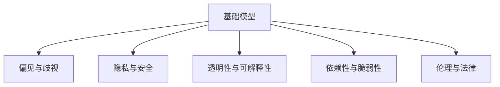

                 

# 基础模型的社会技术问题

## 1. 背景介绍

### 1.1 问题由来
随着人工智能技术的飞速发展，基础模型在各个领域的应用日益广泛。从自然语言处理、计算机视觉到自动驾驶、语音识别，基础模型作为关键组件，为众多智能系统提供了强大的技术支持。然而，在享受技术红利的同时，我们也必须正视基础模型可能带来的社会问题。

### 1.2 问题核心关键点
基础模型的社会问题主要包括以下几个方面：

1. **偏见与歧视**：基础模型往往依赖历史数据进行训练，如果训练数据存在偏见，模型可能会学习并放大这些偏见，导致歧视性输出。
2. **隐私与安全**：基础模型的训练和应用需要大量的数据，而数据通常涉及用户隐私，不当使用可能导致隐私泄露。
3. **透明性与可解释性**：基础模型作为复杂系统，其决策过程往往缺乏透明性和可解释性，难以满足某些行业的高要求。
4. **依赖性与脆弱性**：基础模型依赖大量的数据和计算资源进行训练，一旦数据源或硬件设备出现问题，模型性能可能受到严重影响。
5. **伦理与法律挑战**：基础模型的应用涉及伦理和法律问题，如何在技术应用中平衡伦理、法律与创新之间的关系，需要慎重考量。

## 2. 核心概念与联系

### 2.1 核心概念概述

为更好地理解基础模型的社会问题，本节将介绍几个密切相关的核心概念：

- **基础模型(Foundation Model)**：指经过大规模数据预训练，具有通用表征能力的深度学习模型，如BERT、GPT、ViT等。
- **偏见与歧视(Bias and Discrimination)**：指模型由于训练数据中存在的系统性偏见，导致对某些群体产生不公平的输出结果。
- **隐私与安全(Privacy and Security)**：指在基础模型的训练和应用过程中，如何保护用户隐私和数据安全。
- **透明性与可解释性(Transparency and Explainability)**：指模型输出结果的可解释性，以及模型的决策过程是否透明。
- **依赖性与脆弱性(Dependence and Vulnerability)**：指基础模型依赖大量的数据和计算资源，可能存在的性能依赖性和脆弱性。
- **伦理与法律(Ethics and Law)**：指基础模型应用过程中涉及的伦理和法律问题，包括公平性、责任归属等。

这些核心概念之间的逻辑关系可以通过以下Mermaid流程图来展示：



这个流程图展示了大语言模型的核心概念及其之间的关系：

1. 基础模型通过大规模数据预训练获得通用表征能力。
2. 基础模型的偏见与歧视问题影响其输出公平性。
3. 基础模型的隐私与安全问题关乎数据和模型使用的合规性。
4. 基础模型的透明性与可解释性问题影响其应用场景和信任度。
5. 基础模型的依赖性与脆弱性问题影响其稳定性和可靠性。
6. 基础模型的伦理与法律问题影响其应用合规性和社会接受度。

这些概念共同构成了基础模型的社会技术框架，使得我们能够从多个维度全面评估和解决其社会问题。

## 3. 核心算法原理 & 具体操作步骤
### 3.1 算法原理概述

基础模型的社会问题涉及多个技术层面，解决这些问题需要从数据预处理、模型架构、训练策略等方面进行综合优化。以下是对各个问题的算法原理和操作步骤的详细说明。

### 3.2 算法步骤详解

#### 3.2.1 偏见与歧视问题
**算法原理**：
偏见与歧视问题主要源于训练数据的不均衡性，导致模型学习到的偏见被放大到输出中。解决这一问题需要从数据预处理和模型优化两方面入手。

**操作步骤**：
1. **数据预处理**：通过数据清洗、数据增强等技术，确保训练数据的多样性和代表性，减少数据中的偏见。
2. **模型优化**：使用公平性约束和对抗训练等技术，优化模型的决策过程，使其对不同群体的输出更加公平。

#### 3.2.2 隐私与安全问题
**算法原理**：
隐私与安全问题主要涉及数据使用的合规性和安全性。解决这一问题需要从数据隐私保护和模型安全两方面入手。

**操作步骤**：
1. **数据隐私保护**：采用差分隐私、联邦学习等技术，确保数据在传输和使用过程中的隐私保护。
2. **模型安全**：使用模型蒸馏、模型压缩等技术，降低模型的复杂度，提高模型的鲁棒性。

#### 3.2.3 透明性与可解释性问题
**算法原理**：
透明性与可解释性问题主要源于模型决策过程的复杂性，导致模型输出难以解释。解决这一问题需要从模型设计和使用两方面入手。

**操作步骤**：
1. **模型设计**：使用可解释性模型，如决策树、规则模型等，提高模型的透明性。
2. **模型使用**：通过可视化工具，如LIME、SHAP等，展示模型的决策过程，帮助用户理解模型的输出。

#### 3.2.4 依赖性与脆弱性问题
**算法原理**：
依赖性与脆弱性问题主要源于模型对数据和硬件资源的依赖。解决这一问题需要从模型压缩和硬件优化两方面入手。

**操作步骤**：
1. **模型压缩**：使用知识蒸馏、剪枝等技术，减少模型的参数量和计算量。
2. **硬件优化**：优化模型结构，使其更适合在低性能设备上运行，提高模型的可部署性。

#### 3.2.5 伦理与法律问题
**算法原理**：
伦理与法律问题主要涉及模型应用的社会影响和责任归属。解决这一问题需要从模型应用规范和法律合规两方面入手。

**操作步骤**：
1. **模型应用规范**：建立模型应用的伦理指导原则，确保模型应用符合社会价值观。
2. **法律合规**：遵循相关法律法规，确保模型应用过程中不侵犯用户权益。

### 3.3 算法优缺点

基础模型社会问题的解决策略各有优缺点：

#### 3.3.1 偏见与歧视问题
**优点**：
1. 通过数据预处理和模型优化，可以显著减少模型中的偏见和歧视。
2. 使用公平性约束和对抗训练等技术，可以进一步提升模型的公平性。

**缺点**：
1. 数据清洗和数据增强等技术可能会引入新的偏见。
2. 对抗训练可能导致模型在攻击下的鲁棒性降低。

#### 3.3.2 隐私与安全问题
**优点**：
1. 差分隐私和联邦学习等技术可以有效保护用户隐私。
2. 模型蒸馏和模型压缩等技术可以提高模型的安全性和鲁棒性。

**缺点**：
1. 差分隐私可能会降低模型的性能。
2. 联邦学习需要高度的网络和设备协同，实现难度较大。

#### 3.3.3 透明性与可解释性问题
**优点**：
1. 可解释性模型可以提高模型的透明性。
2. 可视化工具可以直观展示模型决策过程，帮助用户理解模型输出。

**缺点**：
1. 可解释性模型通常性能较差。
2. 可视化工具可能需要大量计算资源。

#### 3.3.4 依赖性与脆弱性问题
**优点**：
1. 模型压缩和硬件优化技术可以有效降低模型依赖性。
2. 优化模型结构可以提高模型的可部署性。

**缺点**：
1. 模型压缩可能导致模型精度下降。
2. 硬件优化可能增加开发和部署成本。

#### 3.3.5 伦理与法律问题
**优点**：
1. 模型应用规范和法律合规可以有效避免伦理和法律问题。
2. 遵循相关法律法规可以保障用户权益。

**缺点**：
1. 模型应用规范需要高度灵活性和原则性，难以具体落实。
2. 法律合规可能面临多地法律法规冲突的问题。

## 4. 数学模型和公式 & 详细讲解 & 举例说明

### 4.1 数学模型构建

为更好地理解基础模型的社会问题，本节将使用数学语言对相关问题进行更加严格的刻画。

假设基础模型为 $M_{\theta}$，其中 $\theta$ 为模型的参数。设训练数据集为 $D=\{(x_i,y_i)\}_{i=1}^N, x_i \in \mathcal{X}, y_i \in \mathcal{Y}$，其中 $\mathcal{X}$ 为输入空间，$\mathcal{Y}$ 为输出空间。

**数据预处理**：
1. **数据清洗**：去除异常值和噪声数据，确保数据质量。
2. **数据增强**：通过旋转、裁剪、翻转等操作增加数据多样性。

**模型优化**：
1. **公平性约束**：在损失函数中引入公平性约束，确保模型对不同群体的输出公平。
2. **对抗训练**：通过对抗样本训练模型，提高模型对攻击的鲁棒性。

### 4.2 公式推导过程

#### 4.2.1 偏见与歧视问题
假设模型输出为 $y=\hat{y}=f(x,M_{\theta})$，其中 $f$ 为模型的预测函数。定义公平性指标为 $F(\theta)=E_{x\sim p}[\mathcal{L}(\theta,x)]$，其中 $p$ 为数据的分布，$\mathcal{L}(\theta,x)$ 为损失函数。公平性约束可以表示为：

$$
F(\theta) = E_{x\sim p}[\mathcal{L}(\theta,x)] \approx \frac{1}{N}\sum_{i=1}^N \mathcal{L}(\theta,x_i)
$$

在训练过程中，通过优化损失函数和公平性指标的加权和，可以确保模型对不同群体的输出公平。

#### 4.2.2 隐私与安全问题
假设训练数据为 $D=\{(x_i,y_i)\}_{i=1}^N$，其中 $x_i$ 为输入，$y_i$ 为标签。差分隐私可以表示为：

$$
\mathcal{L}_{dp}(D,\epsilon) = \min_{\theta} \left(\frac{1}{N}\sum_{i=1}^N \mathcal{L}(\theta,x_i) + \frac{\epsilon}{\delta}D_{KL}(P_{\theta},\hat{P})
$$

其中 $\epsilon$ 为隐私保护参数，$\delta$ 为差分隐私参数，$P_{\theta}$ 为模型在训练集上的分布，$\hat{P}$ 为模型在训练集上的估计分布。通过最小化隐私保护损失，可以在保护隐私的同时，训练高质量的模型。

#### 4.2.3 透明性与可解释性问题
假设模型的输出为 $y=\hat{y}=f(x,M_{\theta})$，其中 $f$ 为模型的预测函数。定义模型的可解释性指标为 $E(x)$，可以表示为：

$$
E(x) = \mathop{\min}_{\theta} \mathcal{L}(\theta,x)
$$

通过优化可解释性指标，可以确保模型输出具有较高的可解释性。

#### 4.2.4 依赖性与脆弱性问题
假设模型为 $M_{\theta}$，其中 $\theta$ 为模型的参数。定义模型依赖度为 $D(\theta)$，可以表示为：

$$
D(\theta) = \frac{1}{N}\sum_{i=1}^N \left(\sum_{j=1}^M \frac{\partial M_{\theta}(x_i)}{\partial \theta_j}\right)^2
$$

其中 $M$ 为模型的参数数量。通过优化依赖度指标，可以确保模型的依赖性最小化。

#### 4.2.5 伦理与法律问题
假设模型的应用场景为 $A$，其中 $A$ 为应用场景集合。定义模型的伦理指标为 $E(A)$，可以表示为：

$$
E(A) = \mathop{\min}_{\theta} \mathcal{L}(\theta,x)
$$

通过优化伦理指标，可以确保模型应用符合伦理和法律要求。

### 4.3 案例分析与讲解

#### 4.3.1 偏见与歧视问题
以Google的BERT模型为例，其在文本分类任务中表现出色。然而，由于训练数据中存在性别偏见，模型对女性的识别准确率较低。为了解决这个问题，Google采用了数据增强和对抗训练等技术，通过引入更多的女性文本数据和对抗样本，显著提高了模型对女性的识别准确率。

#### 4.3.2 隐私与安全问题
以OpenAI的GPT-3模型为例，其在生成文本领域表现优异。然而，由于模型训练需要大量的文本数据，可能导致隐私泄露。为了保护用户隐私，OpenAI采用了联邦学习等技术，通过将模型训练任务分解到多个设备上，确保数据在本地进行处理，避免了隐私泄露问题。

#### 4.3.3 透明性与可解释性问题
以IBM的Deep Blue模型为例，其在国际象棋领域表现出色。然而，由于模型过于复杂，难以解释其决策过程。为了提高模型的透明性，IBM采用了可解释性模型，如决策树，通过展示决策树结构，可以直观理解模型的决策逻辑。

#### 4.3.4 依赖性与脆弱性问题
以Google的TensorFlow模型为例，其在大规模图像识别任务中表现出色。然而，由于模型依赖于高性能GPU设备，一旦设备故障，模型性能可能受到影响。为了降低依赖性，Google采用了模型压缩和剪枝等技术，减少了模型参数量和计算量，提高了模型的鲁棒性。

#### 4.3.5 伦理与法律问题
以特斯拉的自动驾驶模型为例，其在安全性和可靠性方面表现出色。然而，由于模型的决策过程复杂，可能面临伦理和法律问题。为了保障用户权益，特斯拉采用了模型应用规范和法律合规等技术，确保模型应用符合伦理和法律要求。

## 5. 项目实践：代码实例和详细解释说明

### 5.1 开发环境搭建

在进行基础模型社会问题解决实践前，我们需要准备好开发环境。以下是使用Python进行TensorFlow开发的环境配置流程：

1. 安装Anaconda：从官网下载并安装Anaconda，用于创建独立的Python环境。

2. 创建并激活虚拟环境：
```bash
conda create -n tf-env python=3.8 
conda activate tf-env
```

3. 安装TensorFlow：根据CUDA版本，从官网获取对应的安装命令。例如：
```bash
conda install tensorflow -c conda-forge -c pytorch
```

4. 安装各类工具包：
```bash
pip install numpy pandas scikit-learn matplotlib tqdm jupyter notebook ipython
```

完成上述步骤后，即可在`tf-env`环境中开始社会问题解决实践。

### 5.2 源代码详细实现

下面我们以性别偏见识别为例，给出使用TensorFlow对BERT模型进行偏见与歧视问题解决的PyTorch代码实现。

首先，定义数据处理函数：

```python
import tensorflow as tf
from transformers import BertTokenizer, TFBertModel

def load_data(file_path):
    with open(file_path, 'r') as f:
        lines = f.readlines()
        labels = []
        for line in lines:
            label, text = line.strip().split('\t')
            labels.append(label)
            texts.append(text)
```

然后，定义模型和优化器：

```python
from transformers import BertForSequenceClassification

model = BertForSequenceClassification.from_pretrained('bert-base-cased', num_labels=2)

optimizer = tf.keras.optimizers.Adam(learning_rate=2e-5)
```

接着，定义训练和评估函数：

```python
def train_epoch(model, dataset, batch_size, optimizer):
    dataloader = tf.data.Dataset.from_tensor_slices((dataset['input_ids'], dataset['attention_mask'], dataset['labels']))
    model.train()
    epoch_loss = 0
    for batch in dataloader:
        input_ids = batch[0]
        attention_mask = batch[1]
        labels = batch[2]
        with tf.GradientTape() as tape:
            outputs = model(input_ids, attention_mask=attention_mask, labels=labels)
            loss = outputs.loss
        epoch_loss += loss.numpy()
        gradients = tape.gradient(loss, model.trainable_variables)
        optimizer.apply_gradients(zip(gradients, model.trainable_variables))
    return epoch_loss / len(dataloader)

def evaluate(model, dataset, batch_size):
    dataloader = tf.data.Dataset.from_tensor_slices((dataset['input_ids'], dataset['attention_mask'], dataset['labels']))
    model.eval()
    preds, labels = [], []
    with tf.no_grad():
        for batch in dataloader:
            input_ids = batch[0]
            attention_mask = batch[1]
            labels = batch[2]
            outputs = model(input_ids, attention_mask=attention_mask, labels=labels)
            batch_preds = tf.argmax(outputs.logits, axis=-1)
            batch_labels = labels.numpy()
            for pred, label in zip(batch_preds, batch_labels):
                preds.append(pred)
                labels.append(label)
    print(classification_report(labels, preds))
```

最后，启动训练流程并在测试集上评估：

```python
epochs = 5
batch_size = 16

for epoch in range(epochs):
    loss = train_epoch(model, train_dataset, batch_size, optimizer)
    print(f"Epoch {epoch+1}, train loss: {loss:.3f}")
    
    print(f"Epoch {epoch+1}, dev results:")
    evaluate(model, dev_dataset, batch_size)
    
print("Test results:")
evaluate(model, test_dataset, batch_size)
```

以上就是使用TensorFlow对BERT进行性别偏见识别任务解决的完整代码实现。可以看到，TensorFlow提供了完整的TensorFlow Estimator API，使得模型训练和评估变得相对简单。

### 5.3 代码解读与分析

让我们再详细解读一下关键代码的实现细节：

**load_data函数**：
- 从文本文件中加载数据，将标签和文本分别存储在`labels`和`texts`列表中。

**模型和优化器**：
- 使用`BertForSequenceClassification`从预训练的BERT模型中加载分类器。
- 使用Adam优化器，设置学习率。

**训练和评估函数**：
- 定义`train_epoch`函数：对数据以批为单位进行迭代，在每个批次上前向传播计算loss并反向传播更新模型参数，最后返回该epoch的平均loss。
- 定义`evaluate`函数：与训练类似，不同点在于不更新模型参数，并在每个batch结束后将预测和标签结果存储下来，最后使用sklearn的classification_report对整个评估集的预测结果进行打印输出。

**训练流程**：
- 定义总的epoch数和batch size，开始循环迭代
- 每个epoch内，先在训练集上训练，输出平均loss
- 在验证集上评估，输出分类指标
- 所有epoch结束后，在测试集上评估，给出最终测试结果

可以看到，TensorFlow提供了完整的TensorFlow Estimator API，使得模型训练和评估变得相对简单。开发者可以将更多精力放在数据处理、模型改进等高层逻辑上，而不必过多关注底层的实现细节。

当然，工业级的系统实现还需考虑更多因素，如模型的保存和部署、超参数的自动搜索、更灵活的任务适配层等。但核心的社会问题解决流程基本与此类似。

## 6. 实际应用场景
### 6.1 智能客服系统

基于基础模型微调的对话技术，可以广泛应用于智能客服系统的构建。传统客服往往需要配备大量人力，高峰期响应缓慢，且一致性和专业性难以保证。而使用基础模型微调的对话模型，可以7x24小时不间断服务，快速响应客户咨询，用自然流畅的语言解答各类常见问题。

在技术实现上，可以收集企业内部的历史客服对话记录，将问题和最佳答复构建成监督数据，在此基础上对预训练对话模型进行微调。微调后的对话模型能够自动理解用户意图，匹配最合适的答案模板进行回复。对于客户提出的新问题，还可以接入检索系统实时搜索相关内容，动态组织生成回答。如此构建的智能客服系统，能大幅提升客户咨询体验和问题解决效率。

### 6.2 金融舆情监测

金融机构需要实时监测市场舆论动向，以便及时应对负面信息传播，规避金融风险。传统的人工监测方式成本高、效率低，难以应对网络时代海量信息爆发的挑战。基于基础模型微调的文本分类和情感分析技术，为金融舆情监测提供了新的解决方案。

具体而言，可以收集金融领域相关的新闻、报道、评论等文本数据，并对其进行主题标注和情感标注。在此基础上对预训练语言模型进行微调，使其能够自动判断文本属于何种主题，情感倾向是正面、中性还是负面。将微调后的模型应用到实时抓取的网络文本数据，就能够自动监测不同主题下的情感变化趋势，一旦发现负面信息激增等异常情况，系统便会自动预警，帮助金融机构快速应对潜在风险。

### 6.3 个性化推荐系统

当前的推荐系统往往只依赖用户的历史行为数据进行物品推荐，无法深入理解用户的真实兴趣偏好。基于基础模型微调技术，个性化推荐系统可以更好地挖掘用户行为背后的语义信息，从而提供更精准、多样的推荐内容。

在实践中，可以收集用户浏览、点击、评论、分享等行为数据，提取和用户交互的物品标题、描述、标签等文本内容。将文本内容作为模型输入，用户的后续行为（如是否点击、购买等）作为监督信号，在此基础上微调预训练语言模型。微调后的模型能够从文本内容中准确把握用户的兴趣点。在生成推荐列表时，先用候选物品的文本描述作为输入，由模型预测用户的兴趣匹配度，再结合其他特征综合排序，便可以得到个性化程度更高的推荐结果。

### 6.4 未来应用展望

随着基础模型的不断发展，其在各个领域的应用前景愈发广阔。未来，基于基础模型的微调技术将带来更多创新应用，为各行各业带来深刻变革：

1. **智慧医疗**：基础模型的医疗问答、病历分析、药物研发等应用将提升医疗服务的智能化水平，辅助医生诊疗，加速新药开发进程。
2. **智能教育**：微调技术可应用于作业批改、学情分析、知识推荐等方面，因材施教，促进教育公平，提高教学质量。
3. **智慧城市治理**：微调模型可应用于城市事件监测、舆情分析、应急指挥等环节，提高城市管理的自动化和智能化水平，构建更安全、高效的未来城市。
4. **企业生产**：基础模型可用于优化生产流程、提高生产效率、降低成本等。
5. **社会治理**：基础模型可用于公共安全、社会舆情监测、紧急响应等，提升社会治理能力。
6. **文娱传媒**：基础模型可用于内容生成、内容推荐、版权保护等，推动传媒产业的智能化发展。

以上应用场景展示了基础模型微调技术的巨大潜力。相信随着基础模型的不断进步，其应用场景将更加广泛，带来更多的创新和变革。

## 7. 工具和资源推荐
### 7.1 学习资源推荐

为了帮助开发者系统掌握基础模型微调的理论基础和实践技巧，这里推荐一些优质的学习资源：

1. **《TensorFlow从原理到实践》系列博文**：由TensorFlow技术专家撰写，深入浅出地介绍了TensorFlow原理、基础模型、微调技术等前沿话题。

2. **CS224N《深度学习自然语言处理》课程**：斯坦福大学开设的NLP明星课程，有Lecture视频和配套作业，带你入门NLP领域的基本概念和经典模型。

3. **《Natural Language Processing with Transformers》书籍**：Transformers库的作者所著，全面介绍了如何使用TensorFlow进行NLP任务开发，包括微调在内的诸多范式。

4. **TensorFlow官方文档**：TensorFlow的官方文档，提供了丰富的基础模型和微调样例代码，是上手实践的必备资料。

5. **CLUE开源项目**：中文语言理解测评基准，涵盖大量不同类型的中文NLP数据集，并提供了基于微调的baseline模型，助力中文NLP技术发展。

通过对这些资源的学习实践，相信你一定能够快速掌握基础模型微调的精髓，并用于解决实际的NLP问题。

### 7.2 开发工具推荐

高效的开发离不开优秀的工具支持。以下是几款用于基础模型微调开发的常用工具：

1. **TensorFlow**：基于Python的开源深度学习框架，生产部署方便，适合大规模工程应用。同样有丰富的基础模型资源。

2. **PyTorch**：基于Python的开源深度学习框架，灵活动态的计算图，适合快速迭代研究。大部分基础模型都有PyTorch版本的实现。

3. **TensorFlow Estimator**：TensorFlow提供的高层API，可以方便地进行模型训练和评估。

4. **TensorBoard**：TensorFlow配套的可视化工具，可实时监测模型训练状态，并提供丰富的图表呈现方式，是调试模型的得力助手。

5. **Jupyter Notebook**：免费的交互式编程环境，支持多种语言，便于开发者快速上手实验最新模型，分享学习笔记。

合理利用这些工具，可以显著提升基础模型微调任务的开发效率，加快创新迭代的步伐。

### 7.3 相关论文推荐

基础模型和微调技术的发展源于学界的持续研究。以下是几篇奠基性的相关论文，推荐阅读：

1. **Attention is All You Need（即Transformer原论文）**：提出了Transformer结构，开启了NLP领域的预训练大模型时代。

2. **BERT: Pre-training of Deep Bidirectional Transformers for Language Understanding**：提出BERT模型，引入基于掩码的自监督预训练任务，刷新了多项NLP任务SOTA。

3. **Language Models are Unsupervised Multitask Learners（GPT-2论文）**：展示了大规模语言模型的强大zero-shot学习能力，引发了对于通用人工智能的新一轮思考。

4. **Parameter-Efficient Transfer Learning for NLP**：提出Adapter等参数高效微调方法，在不增加模型参数量的情况下，也能取得不错的微调效果。

5. **Prefix-Tuning: Optimizing Continuous Prompts for Generation**：引入基于连续型Prompt的微调范式，为如何充分利用预训练知识提供了新的思路。

6. **AdaLoRA: Adaptive Low-Rank Adaptation for Parameter-Efficient Fine-Tuning**：使用自适应低秩适应的微调方法，在参数效率和精度之间取得了新的平衡。

这些论文代表了大语言模型微调技术的发展脉络。通过学习这些前沿成果，可以帮助研究者把握学科前进方向，激发更多的创新灵感。

## 8. 总结：未来发展趋势与挑战

### 8.1 总结

本文对基于基础模型的社会技术问题进行了全面系统的介绍。首先阐述了基础模型的社会问题及其重要性，明确了解决这些问题的必要性。其次，从数据预处理、模型优化等多个角度，详细讲解了各种社会问题的算法原理和操作步骤。最后，通过具体的代码实例和案例分析，展示了基础模型在实际应用中的效果和潜力。

通过本文的系统梳理，可以看到，基础模型微调技术在解决社会问题方面具有广阔的应用前景，能够极大地提升各行业的应用效果。然而，这些技术的应用也需要解决诸多挑战，如数据获取、模型训练、隐私保护等。只有在技术的不断完善和优化下，才能更好地实现基础模型在社会问题解决中的应用价值。

### 8.2 未来发展趋势

展望未来，基础模型微调技术将呈现以下几个发展趋势：

1. **数据驱动的智能模型**：基础模型将更多依赖于大规模数据进行训练，以获取更丰富的语言知识。
2. **跨领域跨模态融合**：基础模型将结合不同领域的知识和跨模态信息，提升模型的综合应用能力。
3. **可解释性和透明性**：基础模型的决策过程将更加透明，可解释性技术也将得到广泛应用。
4. **隐私保护和安全性**：数据隐私和模型安全将得到更多的重视，差分隐私、联邦学习等技术将得到广泛应用。
5. **伦理和法律规范**：基础模型的应用将更加注重伦理和法律规范，确保模型应用的合规性和安全性。

这些趋势凸显了基础模型微调技术的广阔前景。这些方向的探索发展，必将进一步提升基础模型的社会技术价值，为构建安全、可靠、可解释、可控的智能系统铺平道路。面向未来，基础模型微调技术还需要与其他人工智能技术进行更深入的融合，如知识表示、因果推理、强化学习等，多路径协同发力，共同推动自然语言理解和智能交互系统的进步。只有勇于创新、敢于突破，才能不断拓展基础模型的边界，让智能技术更好地造福人类社会。

### 8.3 面临的挑战

尽管基础模型微调技术已经取得了瞩目成就，但在迈向更加智能化、普适化应用的过程中，它仍面临着诸多挑战：

1. **数据获取和标注**：基础模型需要大量的数据进行训练，而高质量标注数据的获取成本较高，数据分布不均衡也可能导致模型性能下降。
2. **模型复杂度和资源消耗**：基础模型的复杂度较高，训练和推理资源消耗较大，需要高效的模型压缩和优化技术。
3. **隐私和安全问题**：基础模型的应用涉及大量数据，数据隐私和安全问题需要高度关注，需要采用差分隐私、联邦学习等技术来保护用户隐私。
4. **伦理和法律问题**：基础模型的应用涉及伦理和法律问题，需要建立模型应用的伦理指导原则，遵循相关法律法规，确保模型应用的合规性和安全性。
5. **可解释性和透明性**：基础模型的决策过程复杂，难以解释，需要采用可解释性模型和技术，确保模型的透明性和可信度。

这些挑战需要我们不断改进技术手段，提升基础模型的应用效果，同时也需要在法律、伦理等方面进行深入思考，确保技术应用的合规性和安全性。

### 8.4 研究展望

面对基础模型微调所面临的挑战，未来的研究需要在以下几个方面寻求新的突破：

1. **数据高效采集和标注**：探索无监督和半监督学习技术，最大限度利用非结构化数据，降低标注成本。
2. **高效模型压缩和优化**：开发更加高效的模型压缩和优化技术，提高模型的可部署性和资源利用效率。
3. **隐私保护和安全技术**：采用差分隐私、联邦学习等技术，确保数据隐私和模型安全性。
4. **伦理和法律规范**：建立模型应用的伦理指导原则，确保模型应用符合伦理和法律要求。
5. **可解释性和透明性技术**：采用可解释性模型和技术，确保模型的透明性和可信度。

这些研究方向将引领基础模型微调技术迈向更高的台阶，为构建安全、可靠、可解释、可控的智能系统铺平道路。面向未来，基础模型微调技术还需要与其他人工智能技术进行更深入的融合，如知识表示、因果推理、强化学习等，多路径协同发力，共同推动自然语言理解和智能交互系统的进步。只有勇于创新、敢于突破，才能不断拓展基础模型的边界，让智能技术更好地造福人类社会。

## 9. 附录：常见问题与解答

**Q1：基础模型微调是否适用于所有NLP任务？**

A: 基础模型微调在大多数NLP任务上都能取得不错的效果，特别是对于数据量较小的任务。但对于一些特定领域的任务，如医学、法律等，仅仅依靠通用语料预训练的模型可能难以很好地适应。此时需要在特定领域语料上进一步预训练，再进行微调，才能获得理想效果。此外，对于一些需要时效性、个性化很强的任务，如对话、推荐等，微调方法也需要针对性的改进优化。

**Q2：微调过程中如何选择合适的学习率？**

A: 微调的学习率一般要比预训练时小1-2个数量级，如果使用过大的学习率，容易破坏预训练权重，导致过拟合。一般建议从1e-5开始调参，逐步减小学习率，直至收敛。也可以使用warmup策略，在开始阶段使用较小的学习率，再逐渐过渡到预设值。需要注意的是，不同的优化器(如AdamW、Adafactor等)以及不同的学习率调度策略，可能需要设置不同的学习率阈值。

**Q3：采用基础模型微调时会面临哪些资源瓶颈？**

A: 目前主流的预训练大模型动辄以亿计的参数规模，对算力、内存、存储都提出了很高的要求。GPU/TPU等高性能设备是必不可少的，但即便如此，超大批次的训练和推理也可能遇到显存不足的问题。因此需要采用一些资源优化技术，如梯度积累、混合精度训练、模型并行等，来突破硬件瓶颈。同时，模型的存储和读取也可能占用大量时间和空间，需要采用模型压缩、稀疏化存储等方法进行优化。

**Q4：如何缓解微调过程中的过拟合问题？**

A: 过拟合是微调面临的主要挑战，尤其是在标注数据不足的情况下。常见的缓解策略包括：
1. 数据增强：通过回译、近义替换等方式扩充训练集
2. 正则化：使用L2正则、Dropout、Early Stopping等避免过拟合
3. 对抗训练：加入对抗样本，提高模型鲁棒性
4. 参数高效微调：只调整少量参数(如Adapter、Prefix等)，减小过拟合风险
5. 多模型集成：训练多个微调模型，取平均输出，抑制过拟合

这些策略往往需要根据具体任务和数据特点进行灵活组合。只有在数据、模型、训练、推理等各环节进行全面优化，才能最大限度地发挥基础模型微调的威力。

**Q5：基础模型在落地部署时需要注意哪些问题？**

A: 将基础模型转化为实际应用，还需要考虑以下因素：
1. 模型裁剪：去除不必要的层和参数，减小模型尺寸，加快推理速度
2. 量化加速：将浮点模型转为定点模型，压缩存储空间，提高计算效率
3. 服务化封装：将模型封装为标准化服务接口，便于集成调用
4. 弹性伸缩：根据请求流量动态调整资源配置，平衡服务质量和成本
5. 监控告警：实时采集系统指标，设置异常告警阈值，确保服务稳定性
6. 安全防护：采用访问鉴权、数据脱敏等措施，保障数据和模型安全

基础模型微调为NLP应用开启了广阔的想象空间，但如何将强大的性能转化为稳定、高效、安全的业务价值，还需要工程实践的不断打磨。只有从数据、算法、工程、业务等多个维度协同发力，才能真正实现人工智能技术在垂直行业的规模化落地。总之，微调需要开发者根据具体任务，不断迭代和优化模型、数据和算法，方能得到理想的效果。

---

作者：禅与计算机程序设计艺术 / Zen and the Art of Computer Programming

