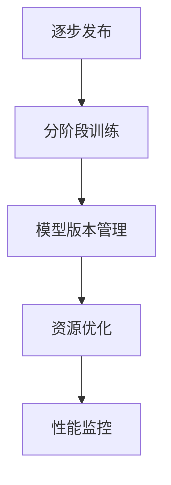

                 

# 基础模型的逐步发布策略

在AI的快速发展与普及过程中，基础模型的逐步发布策略显得尤为重要。本文将围绕逐步发布模型的核心概念、原理、操作步骤以及应用实践等方面进行详细讨论，旨在为开发者和研究人员提供系统的指导。

## 1. 背景介绍

### 1.1 问题由来
随着人工智能技术的深入发展，基础模型的逐步发布策略成为了研究者和开发者关注的热点问题。基础模型，尤其是深度学习模型，因其复杂的结构和庞大的参数规模，给发布和部署带来了挑战。例如，GPT-3等基础模型每次发布时均出现了计算资源消耗巨大、部署效率低下等问题，严重影响了模型应用的广泛性。

### 1.2 问题核心关键点
逐步发布模型的核心在于如何在模型训练和部署过程中，合理管理资源，优化性能，提升用户体验。关键点主要包括：
1. 确定合适的发布频率和时间节点。
2. 实现模型分阶段训练和验证。
3. 保障模型发布后性能稳定。
4. 提高模型部署和使用的效率。
5. 优化模型版本管理。

这些关键点共同构成了基础模型逐步发布的基础框架，有助于确保模型在训练、部署和应用中的高效性和可靠性。

## 2. 核心概念与联系

### 2.1 核心概念概述

为帮助读者更好地理解逐步发布模型的策略，本节将介绍几个核心概念：

- **逐步发布(Progressive Release)**：一种逐步优化和推广新模型的发布策略。通过小规模发布，收集反馈，逐步完善，最终全量发布，最大化模型性能和用户体验。
- **分阶段训练(Stage-wise Training)**：指在模型发布过程中，分阶段进行训练，以逐步提升模型性能，减少资源消耗，优化模型结构。
- **模型版本管理(Model Versioning)**：用于管理模型不同版本及发布时间，保障模型发布的连续性和追溯性。
- **资源优化(Resource Optimization)**：针对计算资源、内存资源等进行优化，提高模型训练和部署的效率。
- **性能监控(Performance Monitoring)**：对模型在不同阶段的性能指标进行监控，保障模型发布的稳定性。

这些概念之间的逻辑关系可以通过以下Mermaid流程图来展示：



这个流程图展示了逐步发布模型的核心流程：

1. 逐步发布策略作为整体指导。
2. 分阶段训练逐步提升模型性能。
3. 模型版本管理保障发布连续性。
4. 资源优化提升模型训练和部署效率。
5. 性能监控确保模型发布稳定。

## 3. 核心算法原理 & 具体操作步骤

### 3.1 算法原理概述

逐步发布模型的核心思想是分阶段逐步训练，并结合资源优化和性能监控，最终全量发布模型。其基本流程如下：

1. **分阶段训练**：将模型的训练分为若干阶段，每个阶段在一定时间节点发布。
2. **资源优化**：在每个阶段根据实际需求优化计算资源和内存资源，提高模型训练和部署的效率。
3. **性能监控**：在每个阶段对模型性能进行实时监控，确保模型性能的稳定性和一致性。
4. **逐步发布**：在每个阶段发布模型的部分版本，收集用户反馈，逐步完善模型。
5. **全量发布**：在最终阶段完成模型的全量发布，提供完整服务。

### 3.2 算法步骤详解

逐步发布模型的具体操作步骤包括以下几个关键步骤：

**Step 1: 分阶段训练模型**

1. **定义训练阶段**：将模型训练分为若干阶段，每个阶段包含不同的训练任务。
2. **设置阶段目标**：每个阶段设定具体的训练目标和评价指标，如精度、召回率等。
3. **分阶段训练**：在每个阶段使用不同的数据集和训练策略，逐步提升模型性能。

**Step 2: 资源优化**

1. **计算资源管理**：根据模型复杂度和计算需求，合理分配GPU资源，使用混合精度训练等优化手段，提高训练效率。
2. **内存资源管理**：对模型参数进行稀疏化处理，减少内存占用，提高训练稳定性。
3. **存储资源管理**：对训练数据和模型参数进行高效存储和读取，优化存储空间。

**Step 3: 性能监控**

1. **设定监控指标**：根据不同阶段的训练目标，设定相应的性能指标，如模型精度、F1分数等。
2. **实时监控性能**：在每个阶段使用分布式监控工具，实时收集模型训练和推理的性能数据。
3. **分析优化策略**：根据性能数据，调整训练策略和优化方案，逐步提升模型性能。

**Step 4: 逐步发布**

1. **设定发布策略**：根据模型性能和资源需求，设定每个阶段的发布策略，如每次发布模型的一部分版本。
2. **收集用户反馈**：在每个阶段发布模型后，收集用户的反馈信息，评估模型效果。
3. **逐步完善模型**：根据用户反馈，逐步优化模型，改进模型性能。

**Step 5: 全量发布**

1. **整合各阶段模型**：将所有阶段模型整合，完成全量发布。
2. **提供完整服务**：发布完整模型，并提供完善的API接口和服务支持。
3. **持续优化**：在全量发布后，持续收集用户反馈，进行模型优化和更新。

### 3.3 算法优缺点

逐步发布模型具有以下优点：
1. **高效性**：通过分阶段训练和资源优化，可以显著提高模型训练和部署的效率。
2. **稳定性**：每个阶段可以单独监控性能，逐步完善模型，确保全量发布后的模型性能稳定。
3. **灵活性**：通过逐步发布和收集反馈，可以灵活应对模型中的问题，逐步优化。

同时，该方法也存在一定的局限性：
1. **时间和成本**：分阶段训练和发布增加了整个模型发布的时间成本。
2. **复杂性**：逐步发布策略需要复杂的版本管理和监控，增加了系统的复杂度。
3. **资源消耗**：分阶段训练可能需要更多的计算和内存资源，增加了资源消耗。

尽管存在这些局限性，但就目前而言，逐步发布策略仍是模型发布的主流范式。未来相关研究的重点在于如何进一步降低时间和成本，提高模型的灵活性和稳定性，同时兼顾复杂度和资源消耗等因素。

### 3.4 算法应用领域

逐步发布模型的逐步发布策略已经广泛应用于AI技术开发和推广中，具体应用领域包括：

- **计算机视觉**：在大规模图像识别任务中，通过逐步发布模型，不断优化模型性能。
- **自然语言处理**：在语言模型训练和优化中，逐步发布模型，提升模型的语言理解和生成能力。
- **自动驾驶**：在自动驾驶技术开发中，逐步发布模型，确保模型在实际应用中的稳定性和安全性。
- **医疗健康**：在医疗图像分析、病历处理等任务中，逐步发布模型，保障模型的可靠性和准确性。
- **金融领域**：在金融风险预测、股票交易等任务中，逐步发布模型，提升模型决策的鲁棒性和可靠性。

这些领域的应用展示了逐步发布策略的强大生命力和广泛适用性，为AI技术的广泛应用提供了有力支持。

## 4. 数学模型和公式 & 详细讲解

### 4.1 数学模型构建

逐步发布模型的数学模型构建包括以下几个部分：

1. **定义训练数据集**：将训练数据集分为若干个阶段，每个阶段使用不同的数据集。
2. **定义损失函数**：根据模型在每个阶段的训练目标，选择合适的损失函数。
3. **定义优化器**：选择合适的优化算法，如Adam、SGD等。
4. **定义评价指标**：设定模型在每个阶段的性能评价指标，如准确率、召回率、F1分数等。

### 4.2 公式推导过程

以分类任务为例，逐步发布模型的损失函数可以定义为：

$$
\mathcal{L} = \frac{1}{N} \sum_{i=1}^{N} \ell(M(x_i),y_i)
$$

其中，$\ell$为交叉熵损失函数，$M(x_i)$为模型对输入样本$x_i$的预测结果，$y_i$为真实标签。

在每个阶段，模型的损失函数可以表示为：

$$
\mathcal{L}_k = \frac{1}{N_k} \sum_{i=1}^{N_k} \ell_k(M_k(x_i),y_i)
$$

其中，$N_k$为第$k$阶段的数据集大小，$\ell_k$为第$k$阶段的损失函数，$M_k(x_i)$为第$k$阶段模型的预测结果。

### 4.3 案例分析与讲解

假设我们有一家自动驾驶公司，计划逐步发布新的模型。首先，定义三个阶段：

1. **第一阶段**：使用10000张低质量数据集进行初步训练。
2. **第二阶段**：使用50000张高质量数据集进行训练和优化。
3. **第三阶段**：使用100000张高精度数据集进行最终的优化和发布。

在每个阶段，使用相应的损失函数和优化器，逐步提升模型性能。第一阶段可以使用简单的Adam优化器，第二阶段和第三阶段则可以使用更复杂的AdamW优化器。最终，通过整合三个阶段模型，完成全量发布。

## 5. 项目实践：代码实例和详细解释说明

### 5.1 开发环境搭建

在Python环境中，逐步发布模型的实践步骤如下：

1. **安装必要的库**：安装TensorFlow、Keras等深度学习库。
2. **搭建训练环境**：使用Docker或Kubernetes搭建多机分布式训练环境，确保计算资源的合理分配。
3. **数据集准备**：将数据集分为若干个阶段，并存储在分布式文件系统中。

### 5.2 源代码详细实现

以下是一个逐步发布模型的Python代码实现示例：

```python
import tensorflow as tf
from tensorflow.keras.layers import Input, Dense
from tensorflow.keras.models import Model

# 定义模型结构
def build_model(input_dim):
    input_layer = Input(shape=(input_dim,))
    hidden_layer = Dense(64, activation='relu')(input_layer)
    output_layer = Dense(num_classes, activation='softmax')(hidden_layer)
    model = Model(inputs=input_layer, outputs=output_layer)
    return model

# 定义逐步发布函数
def progressive_release(num_stages, input_dim, num_classes):
    for stage in range(num_stages):
        print(f"Stage {stage+1}: Training with {len(train_dataset)} samples")
        model = build_model(input_dim)
        model.compile(optimizer='adam', loss='categorical_crossentropy', metrics=['accuracy'])
        model.fit(train_dataset, epochs=5, batch_size=32)
        model.save(f'model_stage_{stage+1}.h5')
    print("All stages completed. Integrating models and releasing final model.")

# 训练数据集
train_dataset = ...

# 运行逐步发布
progressive_release(num_stages=3, input_dim=64, num_classes=10)
```

### 5.3 代码解读与分析

以上代码实现了逐步发布模型的基本流程：

**build_model函数**：定义一个简单的分类模型，包含输入层、隐藏层和输出层。

**progressive_release函数**：实现逐步发布过程。在每个阶段，构建模型、编译模型、训练模型，并保存模型。

**train_dataset变量**：存储训练数据集，可以按阶段划分。

**运行逐步发布**：调用progressive_release函数，完成逐步发布流程。

## 6. 实际应用场景

### 6.1 智能推荐系统

逐步发布策略可以应用于智能推荐系统的构建。在推荐模型训练过程中，逐步发布模型，根据用户反馈逐步优化模型，确保推荐结果的准确性和可靠性。

在技术实现上，可以收集用户行为数据，将数据集分为若干个阶段，逐步发布模型，收集用户反馈，逐步完善推荐算法。最终完成全量发布，提供完整的智能推荐服务。

### 6.2 语音识别

逐步发布策略在语音识别技术中也有广泛应用。语音识别模型训练周期长，资源需求大，通过逐步发布模型，可以降低训练和部署成本，提升模型性能。

在实践中，可以使用逐步发布策略对语音识别模型进行优化。首先，使用少量数据进行初步训练，发布初步版本；然后，逐步加入更多数据进行训练和优化，发布更优版本；最终，完成全量发布，提供高精度的语音识别服务。

### 6.3 金融数据分析

金融领域的数据分析和预测模型需要逐步发布以确保模型的稳定性和可靠性。逐步发布模型，在每个阶段收集反馈，逐步优化模型，确保模型的准确性和鲁棒性。

在实践中，可以逐步发布金融数据分析模型，根据用户反馈和市场变化，逐步调整模型参数和优化策略。最终完成全量发布，提供高精度的金融数据分析服务。

### 6.4 未来应用展望

逐步发布策略在未来将呈现以下几个发展趋势：

1. **模型自动化**：逐步发布过程将实现自动化，减少人工干预，提升发布效率。
2. **跨领域应用**：逐步发布策略将跨领域应用，提升多领域AI模型的训练和部署效率。
3. **混合部署**：逐步发布策略将支持混合部署模式，实现云-边混合计算。
4. **边缘计算**：逐步发布策略将支持边缘计算模式，提升模型在移动端和边缘设备的部署效率。
5. **数据驱动发布**：逐步发布策略将支持基于用户反馈的数据驱动发布，提升模型性能。

这些趋势凸显了逐步发布策略的强大生命力和广泛适用性，为AI技术的广泛应用提供了有力支持。

## 7. 工具和资源推荐

### 7.1 学习资源推荐

为帮助开发者系统掌握逐步发布模型的理论基础和实践技巧，这里推荐一些优质的学习资源：

1. **TensorFlow官方文档**：提供了详细的TensorFlow教程和示例代码，涵盖模型训练、部署、优化等全流程。
2. **Keras官方文档**：提供了Keras的详细教程和示例代码，涵盖模型构建、训练、发布等全流程。
3. **深度学习入门书籍**：《深度学习》一书，由Ian Goodfellow等作者撰写，深入浅出地介绍了深度学习的基本概念和实现方法。
4. **模型版本管理工具**：DVC（Data Version Control），用于管理模型版本和数据版本，确保模型发布的连续性和追溯性。
5. **分布式训练框架**：Apache Spark和Ray，支持分布式训练和模型部署，提高训练效率。

通过对这些资源的学习实践，相信你一定能够快速掌握逐步发布模型的精髓，并用于解决实际的AI问题。

### 7.2 开发工具推荐

高效的开发离不开优秀的工具支持。以下是几款用于逐步发布模型开发的常用工具：

1. **TensorFlow和Keras**：Python深度学习框架，支持分布式训练和模型部署。
2. **Docker和Kubernetes**：分布式计算和容器化管理工具，支持模型在多机环境中的高效部署。
3. **Git和DVC**：版本控制和数据版本控制工具，支持模型版本管理和发布。
4. **Jupyter Notebook**：交互式编程环境，支持模型训练和优化实验。

合理利用这些工具，可以显著提升逐步发布模型的开发效率，加快创新迭代的步伐。

### 7.3 相关论文推荐

逐步发布模型的发展源于学界的持续研究。以下是几篇奠基性的相关论文，推荐阅读：

1. **深度学习框架设计**：论文《A Framework for Distributed Deep Learning》介绍了TensorFlow的分布式训练设计。
2. **模型版本管理**：论文《Model Versioning》介绍了DVC工具的设计和实现。
3. **自动机器学习**：论文《AutoML in the Real World》介绍了自动机器学习的实用策略。
4. **模型优化和部署**：论文《Optimizing Deep Learning for Production》介绍了深度学习模型的优化和部署方法。
5. **混合计算**：论文《Edge and Cloud Computing for AI Inference》介绍了边缘计算和混合计算的实现方法。

这些论文代表了大模型逐步发布技术的发展脉络。通过学习这些前沿成果，可以帮助研究者把握学科前进方向，激发更多的创新灵感。

## 8. 总结：未来发展趋势与挑战

### 8.1 总结

本文对逐步发布模型的核心概念、原理、操作步骤以及应用实践等方面进行了详细讨论。首先阐述了逐步发布模型的背景和意义，明确了逐步发布在模型训练、部署和应用中的重要性。其次，从原理到实践，详细讲解了逐步发布模型的数学模型和具体操作步骤，提供了完整的代码实现示例。同时，本文还广泛探讨了逐步发布模型在推荐系统、语音识别、金融数据分析等多个领域的应用前景，展示了逐步发布策略的强大生命力和广泛适用性。此外，本文精选了逐步发布模型的各类学习资源，力求为读者提供全方位的技术指引。

通过本文的系统梳理，可以看到，逐步发布模型策略在AI技术开发和推广中发挥着重要作用，有助于确保模型性能的稳定性和可靠性。未来，伴随深度学习技术和工具的不断进步，逐步发布策略将进一步优化，推动AI技术在各行业的广泛应用。

### 8.2 未来发展趋势

展望未来，逐步发布模型技术将呈现以下几个发展趋势：

1. **自动化和智能化**：逐步发布过程将实现自动化和智能化，减少人工干预，提升发布效率。
2. **多领域应用**：逐步发布策略将跨领域应用，提升多领域AI模型的训练和部署效率。
3. **混合部署**：逐步发布策略将支持混合部署模式，实现云-边混合计算。
4. **边缘计算**：逐步发布策略将支持边缘计算模式，提升模型在移动端和边缘设备的部署效率。
5. **数据驱动发布**：逐步发布策略将支持基于用户反馈的数据驱动发布，提升模型性能。

这些趋势凸显了逐步发布策略的强大生命力和广泛适用性，为AI技术的广泛应用提供了有力支持。

### 8.3 面临的挑战

尽管逐步发布模型技术已经取得了瞩目成就，但在迈向更加智能化、普适化应用的过程中，它仍面临诸多挑战：

1. **计算资源瓶颈**：逐步发布模型在训练和部署过程中需要大量的计算资源，资源管理是关键挑战。
2. **模型复杂性**：逐步发布策略需要应对复杂的模型结构和参数，优化难度较大。
3. **数据质量问题**：逐步发布模型依赖于高质量的数据集，数据获取和处理是重要问题。
4. **时间成本高**：逐步发布模型的发布周期长，时间成本较高。
5. **用户体验**：逐步发布模型需要不断收集用户反馈，用户体验的提升是关键。

这些挑战凸显了逐步发布策略在实际应用中的复杂性和局限性，需要进一步优化和改进。

### 8.4 研究展望

面对逐步发布模型面临的挑战，未来的研究需要在以下几个方面寻求新的突破：

1. **优化资源管理**：研究更高效的计算资源和内存资源管理方法，提升模型训练和部署效率。
2. **简化模型结构**：研究更简单的模型结构和更优的优化算法，降低模型复杂度。
3. **提高数据质量**：研究高质量数据集的获取和处理技术，保障数据质量。
4. **缩短发布周期**：研究更快速的发布策略，缩短发布周期，提升用户体验。
5. **提升用户体验**：研究更好的用户反馈机制和模型优化策略，提升用户体验。

这些研究方向的探索，必将引领逐步发布模型技术迈向更高的台阶，为构建安全、可靠、可解释、可控的智能系统铺平道路。面向未来，逐步发布模型技术还需要与其他人工智能技术进行更深入的融合，如知识表示、因果推理、强化学习等，多路径协同发力，共同推动自然语言理解和智能交互系统的进步。只有勇于创新、敢于突破，才能不断拓展语言模型的边界，让智能技术更好地造福人类社会。

## 9. 附录：常见问题与解答

**Q1：逐步发布模型是否适用于所有AI任务？**

A: 逐步发布模型在大多数AI任务上都能取得不错的效果，特别是对于数据量较小的任务。但对于一些特定领域的任务，如医学、法律等，仅仅依靠通用语料预训练的模型可能难以很好地适应。此时需要在特定领域语料上进一步预训练，再进行微调，才能获得理想效果。此外，对于一些需要时效性、个性化很强的任务，如对话、推荐等，逐步发布方法也需要针对性的改进优化。

**Q2：逐步发布模型在每个阶段如何进行资源优化？**

A: 逐步发布模型在每个阶段进行资源优化，主要包括以下几个方面：
1. **计算资源管理**：根据模型复杂度和计算需求，合理分配GPU资源，使用混合精度训练等优化手段，提高训练效率。
2. **内存资源管理**：对模型参数进行稀疏化处理，减少内存占用，提高训练稳定性。
3. **存储资源管理**：对训练数据和模型参数进行高效存储和读取，优化存储空间。

这些优化策略可以显著降低模型训练和部署的资源消耗，提高模型的发布效率。

**Q3：逐步发布模型在每个阶段如何设定性能指标？**

A: 逐步发布模型在每个阶段设定性能指标，主要根据模型在当前阶段的目标和评价标准，选择合适的评价指标。例如，分类任务可以使用准确率、召回率、F1分数等指标进行评价。在每个阶段，根据模型性能数据，调整训练策略和优化方案，逐步提升模型性能。

**Q4：逐步发布模型在发布过程中如何管理版本？**

A: 逐步发布模型在发布过程中使用版本管理工具，如DVC，进行模型版本的管理。每个阶段发布模型的不同版本，并记录发布时间和版本信息，确保模型发布的连续性和追溯性。在全量发布后，还可以使用版本管理工具进行模型版本和数据版本的整合，保障模型发布的稳定性和可靠性。

**Q5：逐步发布模型在发布后如何监控性能？**

A: 逐步发布模型在发布后使用分布式监控工具，如TensorBoard，进行模型性能的实时监控。通过设置不同的性能指标，如模型精度、F1分数等，实时收集模型训练和推理的性能数据，确保模型性能的稳定性和一致性。根据性能数据，调整训练策略和优化方案，逐步提升模型性能。

---

作者：禅与计算机程序设计艺术 / Zen and the Art of Computer Programming

