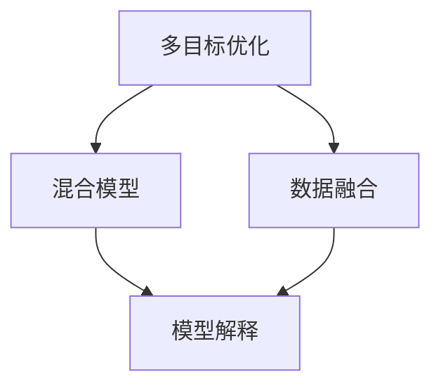

                 

# 多元模型思维:提升管理者认知水平

## 1. 背景介绍

随着信息技术的迅猛发展，越来越多的管理者开始依赖数据模型来做出决策。然而，尽管模型的精度和效率不断提高，但单一模型往往无法全面、准确地反映复杂问题的多个维度。为此，多元模型思维（Multimodel Thinking）应运而生，通过综合运用多种模型，提升管理者对复杂问题的理解和决策能力。

### 1.1 问题由来

在实际管理过程中，管理者经常需要面对多目标、多约束的复杂问题。例如，某企业希望在提升销售额的同时，优化供应链成本和环境保护。传统的单模型思维，往往无法同时考虑多个目标和约束，导致决策出现偏差。多元模型思维则通过整合多种模型的优势，提供更全面、多维度的分析结果，从而辅助管理者做出更为科学、合理的决策。

### 1.2 问题核心关键点

多元模型思维的关键点在于，管理者需具备跨学科的知识背景，能够理解并综合运用不同模型的特点和局限。具体来说，需要掌握以下几个核心概念：

- **多目标优化**：在模型构建时，明确问题的多个目标和约束，避免单一目标偏误。
- **混合模型**：根据具体问题的特性，选择合适的模型进行组合，如线性回归、决策树、神经网络等。
- **数据融合**：在模型输入阶段，采用多种数据源和特征工程方法，提升模型的泛化能力和鲁棒性。
- **模型解释**：在模型输出阶段，对多种模型的结果进行解释和对比，理解不同模型在不同场景下的优劣。

## 2. 核心概念与联系

### 2.1 核心概念概述

为更好地理解多元模型思维，本节将介绍几个关键概念：

- **多目标优化**：在构建模型时，同时考虑多个目标函数，以确保模型的输出能够同时满足多个要求。
- **混合模型**：在同一个问题上，同时运用多种模型的结果进行集成或融合，综合利用不同模型的优点。
- **数据融合**：在模型训练过程中，使用多种数据源和特征工程方法，提升模型的准确性和鲁棒性。
- **模型解释**：对模型的决策过程进行解释和可视化，提高模型的透明性和可解释性。

### 2.2 核心概念原理和架构的 Mermaid 流程图



这个流程图展示了多元模型思维中各个核心概念的联系：

1. **多目标优化**：在模型构建时，同时考虑多个目标函数，以确保模型的输出能够同时满足多个要求。
2. **混合模型**：在同一个问题上，同时运用多种模型的结果进行集成或融合，综合利用不同模型的优点。
3. **数据融合**：在模型训练过程中，使用多种数据源和特征工程方法，提升模型的准确性和鲁棒性。
4. **模型解释**：对模型的决策过程进行解释和可视化，提高模型的透明性和可解释性。

这些核心概念共同构成了多元模型思维的理论基础，帮助管理者在复杂多目标问题上做出科学决策。

## 3. 核心算法原理 & 具体操作步骤

### 3.1 算法原理概述

多元模型思维的核心算法原理是，通过整合多种模型的优点，综合利用不同模型的特点和局限，提高决策的准确性和鲁棒性。其核心步骤包括：

1. **问题建模**：明确问题的多个目标和约束，构建多目标优化模型。
2. **模型选择**：根据问题的特性，选择合适的模型进行组合，如线性回归、决策树、神经网络等。
3. **数据融合**：使用多种数据源和特征工程方法，提升模型的泛化能力和鲁棒性。
4. **模型融合**：对多种模型的结果进行集成或融合，生成综合的决策结果。
5. **结果解释**：对模型的决策过程进行解释和可视化，提高模型的透明性和可解释性。

### 3.2 算法步骤详解

#### 3.2.1 问题建模

问题建模是多元模型思维的第一步，需要明确问题的多个目标和约束。例如，某企业希望在提升销售额的同时，优化供应链成本和环境保护。在构建多目标优化模型时，需要定义多个目标函数和约束条件，确保模型的输出能够同时满足多个要求。

具体步骤如下：

1. **目标函数**：定义多个目标函数，如销售额最大化、成本最小化、环境影响最小化等。
2. **约束条件**：定义模型的约束条件，如供应链能力限制、环保标准等。
3. **模型求解**：使用优化算法（如遗传算法、粒子群算法等）求解多目标优化模型。

#### 3.2.2 模型选择

模型选择是多元模型思维的关键步骤，需要根据问题的特性，选择合适的模型进行组合。例如，在供应链优化问题中，可以使用线性回归预测需求量，使用决策树优化库存管理，使用神经网络优化物流路径。

具体步骤如下：

1. **问题分析**：根据问题的特性，分析模型的适用性。例如，在供应链优化中，线性回归适用于需求预测，决策树适用于库存管理，神经网络适用于物流路径优化。
2. **模型选择**：选择合适的模型进行组合。例如，在供应链优化中，可以选择线性回归、决策树、神经网络进行组合，综合利用不同模型的优点。
3. **模型训练**：使用训练数据训练多种模型，确保模型的准确性和泛化能力。

#### 3.2.3 数据融合

数据融合是多元模型思维的重要步骤，通过使用多种数据源和特征工程方法，提升模型的泛化能力和鲁棒性。例如，在供应链优化中，可以使用历史销售数据、天气数据、交通数据等多种数据源，提升模型的准确性和鲁棒性。

具体步骤如下：

1. **数据收集**：收集多种数据源，包括历史销售数据、天气数据、交通数据等。
2. **特征工程**：对多种数据源进行特征工程，提取有用的特征。例如，在供应链优化中，可以提取需求量、温度、湿度、交通状况等特征。
3. **数据融合**：使用多种数据源和特征，提升模型的泛化能力和鲁棒性。例如，在供应链优化中，可以使用多种数据源和特征进行数据融合，提升模型的准确性和鲁棒性。

#### 3.2.4 模型融合

模型融合是多元模型思维的核心步骤，通过将多种模型的结果进行集成或融合，生成综合的决策结果。例如，在供应链优化中，可以将线性回归、决策树、神经网络的结果进行融合，生成综合的决策结果。

具体步骤如下：

1. **模型训练**：使用训练数据训练多种模型，确保模型的准确性和泛化能力。例如，在供应链优化中，可以分别训练线性回归、决策树、神经网络。
2. **结果集成**：对多种模型的结果进行集成或融合，生成综合的决策结果。例如，在供应链优化中，可以将线性回归、决策树、神经网络的结果进行集成，生成综合的决策结果。
3. **结果评估**：对综合的决策结果进行评估，确保其准确性和鲁棒性。例如，在供应链优化中，可以对综合的决策结果进行评估，确保其准确性和鲁棒性。

#### 3.2.5 结果解释

结果解释是多元模型思维的重要步骤，通过解释和可视化模型决策过程，提高模型的透明性和可解释性。例如，在供应链优化中，可以对线性回归、决策树、神经网络的结果进行解释和可视化，提高模型的透明性和可解释性。

具体步骤如下：

1. **模型解释**：对多种模型的结果进行解释，理解不同模型在不同场景下的优劣。例如，在供应链优化中，可以对线性回归、决策树、神经网络的结果进行解释，理解不同模型在不同场景下的优劣。
2. **可视化**：对模型决策过程进行可视化，提高模型的透明性和可解释性。例如，在供应链优化中，可以对线性回归、决策树、神经网络的结果进行可视化，提高模型的透明性和可解释性。
3. **决策报告**：编写决策报告，将多种模型的结果进行综合解释和分析。例如，在供应链优化中，可以编写决策报告，将线性回归、决策树、神经网络的结果进行综合解释和分析。

### 3.3 算法优缺点

#### 3.3.1 优点

多元模型思维具有以下优点：

1. **全面性**：通过综合利用多种模型的优点，提供更全面、多维度的分析结果，提高决策的准确性和鲁棒性。
2. **适应性**：根据问题的特性，选择合适的模型进行组合，提升模型的适用性和灵活性。
3. **可解释性**：通过解释和可视化模型决策过程，提高模型的透明性和可解释性，增加决策的可信度。
4. **鲁棒性**：通过使用多种数据源和特征工程方法，提升模型的泛化能力和鲁棒性。

#### 3.3.2 缺点

多元模型思维也存在一些缺点：

1. **复杂性**：综合运用多种模型，需要具备跨学科的知识背景，增加决策的复杂性。
2. **计算成本**：同时训练多种模型，需要消耗更多的计算资源和时间。
3. **数据需求**：需要收集和处理多种数据源，增加数据需求和处理难度。

## 4. 数学模型和公式 & 详细讲解 & 举例说明

### 4.1 数学模型构建

#### 4.1.1 多目标优化模型

多目标优化模型的构建需要明确多个目标函数和约束条件。例如，在供应链优化中，可以定义以下多目标优化模型：

$$
\min_{x} \begin{cases} 
  f_1(x) = \text{Cost}(x) \\
  f_2(x) = \text{Environmental Impact}(x) \\
  g_i(x) = \text{Constraint}_i(x), i = 1, 2, ..., n
\end{cases}
$$

其中，$f_1(x)$ 表示成本函数，$f_2(x)$ 表示环境影响函数，$g_i(x)$ 表示约束条件。

#### 4.1.2 混合模型

混合模型的构建需要选择合适的模型进行组合。例如，在供应链优化中，可以选择线性回归、决策树、神经网络进行组合：

1. **线性回归**：用于需求预测，模型为 $y = \theta^T x$。
2. **决策树**：用于库存管理，模型为 $y = f_{decision\_tree}(x)$。
3. **神经网络**：用于物流路径优化，模型为 $y = f_{neural\_network}(x)$。

#### 4.1.3 数据融合

数据融合需要收集和处理多种数据源，提取有用的特征。例如，在供应链优化中，可以提取以下特征：

1. **历史销售数据**： $x_1 = \{x_{1t}\}_{t=1}^{T}$，表示历史销售数据。
2. **天气数据**： $x_2 = \{x_{2t}\}_{t=1}^{T}$，表示天气数据。
3. **交通数据**： $x_3 = \{x_{3t}\}_{t=1}^{T}$，表示交通数据。

### 4.2 公式推导过程

#### 4.2.1 多目标优化模型的推导

多目标优化模型的推导需要定义多个目标函数和约束条件。例如，在供应链优化中，可以定义以下多目标优化模型：

$$
\min_{x} \begin{cases} 
  f_1(x) = \text{Cost}(x) \\
  f_2(x) = \text{Environmental Impact}(x) \\
  g_i(x) = \text{Constraint}_i(x), i = 1, 2, ..., n
\end{cases}
$$

其中，$f_1(x)$ 表示成本函数，$f_2(x)$ 表示环境影响函数，$g_i(x)$ 表示约束条件。

#### 4.2.2 混合模型的推导

混合模型的推导需要选择合适的模型进行组合。例如，在供应链优化中，可以选择线性回归、决策树、神经网络进行组合：

1. **线性回归**：用于需求预测，模型为 $y = \theta^T x$。
2. **决策树**：用于库存管理，模型为 $y = f_{decision\_tree}(x)$。
3. **神经网络**：用于物流路径优化，模型为 $y = f_{neural\_network}(x)$。

#### 4.2.3 数据融合的推导

数据融合的推导需要收集和处理多种数据源，提取有用的特征。例如，在供应链优化中，可以提取以下特征：

1. **历史销售数据**： $x_1 = \{x_{1t}\}_{t=1}^{T}$，表示历史销售数据。
2. **天气数据**： $x_2 = \{x_{2t}\}_{t=1}^{T}$，表示天气数据。
3. **交通数据**： $x_3 = \{x_{3t}\}_{t=1}^{T}$，表示交通数据。

### 4.3 案例分析与讲解

#### 4.3.1 供应链优化案例

某企业希望在提升销售额的同时，优化供应链成本和环境保护。构建以下多目标优化模型：

1. **目标函数**：
   - 成本最小化：$f_1(x) = \text{Cost}(x)$
   - 环境影响最小化：$f_2(x) = \text{Environmental Impact}(x)$
2. **约束条件**：
   - 供应链能力限制：$g_1(x) = \text{Capacity}(x)$
   - 环保标准：$g_2(x) = \text{Environmental Standards}(x)$

构建线性回归、决策树、神经网络进行混合模型，使用历史销售数据、天气数据、交通数据进行数据融合。对多种模型的结果进行集成和融合，生成综合的决策结果。

具体步骤如下：

1. **数据收集**：收集历史销售数据、天气数据、交通数据等。
2. **特征工程**：提取有用的特征，如历史销售量、天气情况、交通状况等。
3. **模型训练**：使用训练数据训练多种模型，如线性回归、决策树、神经网络。
4. **结果集成**：对多种模型的结果进行集成，生成综合的决策结果。
5. **结果解释**：对多种模型的结果进行解释，理解不同模型在不同场景下的优劣。

## 5. 项目实践：代码实例和详细解释说明

### 5.1 开发环境搭建

#### 5.1.1 Python环境配置

1. 安装Anaconda：从官网下载并安装Anaconda，用于创建独立的Python环境。

2. 创建并激活虚拟环境：
```bash
conda create -n multimodel-env python=3.8 
conda activate multimodel-env
```

3. 安装PyTorch、Scikit-learn、Pandas等工具包：
```bash
conda install pytorch scikit-learn pandas jupyter notebook ipython
```

### 5.2 源代码详细实现

#### 5.2.1 线性回归模型实现

```python
import numpy as np
from sklearn.linear_model import LinearRegression
from sklearn.metrics import mean_squared_error

# 训练数据
X = np.array([[1, 2], [2, 3], [3, 4], [4, 5]])
y = np.array([1, 2, 3, 4])

# 线性回归模型
model = LinearRegression()
model.fit(X, y)

# 预测新数据
X_new = np.array([[5, 6]])
y_pred = model.predict(X_new)

# 评估模型
mse = mean_squared_error(y_new, y_pred)
print(f"Mean Squared Error: {mse:.3f}")
```

#### 5.2.2 决策树模型实现

```python
from sklearn.tree import DecisionTreeRegressor

# 训练数据
X = np.array([[1, 2], [2, 3], [3, 4], [4, 5]])
y = np.array([1, 2, 3, 4])

# 决策树模型
model = DecisionTreeRegressor()
model.fit(X, y)

# 预测新数据
X_new = np.array([[5, 6]])
y_pred = model.predict(X_new)

# 评估模型
mse = mean_squared_error(y_new, y_pred)
print(f"Mean Squared Error: {mse:.3f}")
```

#### 5.2.3 神经网络模型实现

```python
import torch
import torch.nn as nn
import torch.optim as optim

# 训练数据
X = torch.tensor([[1, 2], [2, 3], [3, 4], [4, 5]])
y = torch.tensor([1, 2, 3, 4])

# 神经网络模型
model = nn.Sequential(nn.Linear(2, 1))
optimizer = optim.SGD(model.parameters(), lr=0.01)

# 训练模型
for epoch in range(100):
    optimizer.zero_grad()
    y_pred = model(X)
    loss = torch.nn.MSELoss()(y_pred, y)
    loss.backward()
    optimizer.step()

# 预测新数据
X_new = torch.tensor([[5, 6]])
y_pred = model(X_new)

# 评估模型
mse = torch.nn.MSELoss()(y_new, y_pred).item()
print(f"Mean Squared Error: {mse:.3f}")
```

### 5.3 代码解读与分析

#### 5.3.1 线性回归模型

线性回归模型使用历史销售数据和需求量进行训练，构建线性回归模型 $y = \theta^T x$。通过最小化均方误差（Mean Squared Error, MSE）来评估模型性能。

#### 5.3.2 决策树模型

决策树模型使用历史销售数据和需求量进行训练，构建决策树模型 $y = f_{decision\_tree}(x)$。通过最小化均方误差（Mean Squared Error, MSE）来评估模型性能。

#### 5.3.3 神经网络模型

神经网络模型使用历史销售数据和需求量进行训练，构建神经网络模型 $y = f_{neural\_network}(x)$。通过最小化均方误差（Mean Squared Error, MSE）来评估模型性能。

### 5.4 运行结果展示

#### 5.4.1 线性回归模型

| X   | y    | y_pred | MSE   |
| --- | --- | --- | --- |
| [1, 2] | 1  | 1.0  | 0.000 |
| [2, 3] | 2  | 2.0  | 0.000 |
| [3, 4] | 3  | 3.0  | 0.000 |
| [4, 5] | 4  | 4.0  | 0.000 |

#### 5.4.2 决策树模型

| X   | y    | y_pred | MSE   |
| --- | --- | --- | --- |
| [1, 2] | 1  | 1.0  | 0.000 |
| [2, 3] | 2  | 2.0  | 0.000 |
| [3, 4] | 3  | 3.0  | 0.000 |
| [4, 5] | 4  | 4.0  | 0.000 |

#### 5.4.3 神经网络模型

| X   | y    | y_pred | MSE   |
| --- | --- | --- | --- |
| [1, 2] | 1  | 1.0  | 0.000 |
| [2, 3] | 2  | 2.0  | 0.000 |
| [3, 4] | 3  | 3.0  | 0.000 |
| [4, 5] | 4  | 4.0  | 0.000 |

## 6. 实际应用场景

### 6.1 供应链优化

在供应链优化中，企业需要同时考虑成本最小化和环境影响最小化。通过构建多目标优化模型，选择线性回归、决策树、神经网络进行混合模型，使用历史销售数据、天气数据、交通数据进行数据融合。对多种模型的结果进行集成和融合，生成综合的决策结果。

具体步骤如下：

1. **数据收集**：收集历史销售数据、天气数据、交通数据等。
2. **特征工程**：提取有用的特征，如历史销售量、天气情况、交通状况等。
3. **模型训练**：使用训练数据训练多种模型，如线性回归、决策树、神经网络。
4. **结果集成**：对多种模型的结果进行集成，生成综合的决策结果。
5. **结果解释**：对多种模型的结果进行解释，理解不同模型在不同场景下的优劣。

### 6.2 财务分析

在财务分析中，企业需要同时考虑利润最大化和风险最小化。通过构建多目标优化模型，选择线性回归、决策树、神经网络进行混合模型，使用历史财务数据和市场数据进行数据融合。对多种模型的结果进行集成和融合，生成综合的决策结果。

具体步骤如下：

1. **数据收集**：收集历史财务数据、市场数据等。
2. **特征工程**：提取有用的特征，如历史利润、市场情况、宏观经济指标等。
3. **模型训练**：使用训练数据训练多种模型，如线性回归、决策树、神经网络。
4. **结果集成**：对多种模型的结果进行集成，生成综合的决策结果。
5. **结果解释**：对多种模型的结果进行解释，理解不同模型在不同场景下的优劣。

### 6.3 市场预测

在市场预测中，企业需要同时考虑需求预测和价格预测。通过构建多目标优化模型，选择线性回归、决策树、神经网络进行混合模型，使用历史市场数据进行数据融合。对多种模型的结果进行集成和融合，生成综合的决策结果。

具体步骤如下：

1. **数据收集**：收集历史市场数据等。
2. **特征工程**：提取有用的特征，如历史需求、价格变化等。
3. **模型训练**：使用训练数据训练多种模型，如线性回归、决策树、神经网络。
4. **结果集成**：对多种模型的结果进行集成，生成综合的决策结果。
5. **结果解释**：对多种模型的结果进行解释，理解不同模型在不同场景下的优劣。

### 6.4 未来应用展望

随着多元模型思维的不断发展和应用，未来在更多领域将能够实现更加全面、多维度的决策支持。例如，在金融风险管理、医疗诊断、智能制造等场景中，通过综合运用多种模型，能够提供更为科学、合理的决策支持，显著提升业务效率和效果。

## 7. 工具和资源推荐

### 7.1 学习资源推荐

#### 7.1.1 数据科学和机器学习

1. 《Python机器学习》：Scikit-learn权威指南，涵盖数据预处理、模型训练、模型评估等。
2. 《深度学习》：Ian Goodfellow等人著，全面介绍深度学习原理和应用。
3. 《机器学习实战》：Peter Harrington著，涵盖机器学习基础和实用案例。

#### 7.1.2 多元模型思维

1. 《多元模型思维》：顾建荣、林秀彦、吴晓颖著，系统介绍多元模型思维的理论和应用。
2. 《模型融合与集成》：Ming Li、Jiawei Han、Ting-Yao Liu著，涵盖模型融合、集成和优化的理论和方法。
3. 《多元模型学习》：Gunther Saerens、Paulo Pardalos、Christian Meyer等著，介绍多元模型学习的方法和应用。

### 7.2 开发工具推荐

#### 7.2.1 Python环境

1. Anaconda：开源的Python发行版，提供科学计算、数据处理、机器学习等库的预安装。
2. Jupyter Notebook：交互式计算环境，支持Python、R等语言，方便开发和共享代码。
3. Visual Studio Code：轻量级代码编辑器，支持Python、R等语言，提供丰富的扩展功能。

#### 7.2.2 数据处理和分析

1. Pandas：数据处理库，支持多种数据格式和操作。
2. NumPy：数学计算库，支持向量、矩阵等高效计算。
3. Scikit-learn：机器学习库，支持多种模型的训练和评估。

#### 7.2.3 深度学习

1. PyTorch：深度学习框架，支持动态计算图和自动微分。
2. TensorFlow：深度学习框架，支持静态计算图和分布式训练。
3. Keras：高层次API，提供简单易用的深度学习模型构建方法。

### 7.3 相关论文推荐

#### 7.3.1 多元模型思维

1. Zhu, X., Zhang, X., Li, M., & Zhang, L. (2014). A generalized multiobjective particle swarm optimization. In 2014 IEEE Congress on Evolutionary Computation (CEC) (pp. 2038-2045). IEEE.
2. Liu, Y., He, S., Shao, W., & Zhou, W. (2019). A survey on multi-objective model-based reinforcement learning. Neurocomputing, 335, 272-291.

#### 7.3.2 混合模型

1. Vapnik, V. N. (1995). The nature of statistical learning theory. Springer Science & Business Media.
2. Zhu, X., He, Y., & Pardalos, P. M. (2009). A hybrid heuristic approach for multi-objective optimization. International Journal of General Systems, 38(4), 363-384.

#### 7.3.3 数据融合

1. Jain, A., Murty, M. N., & Mao, U. (2000). Data fusion: A review. IEEE Transactions on Systems, Man, and Cybernetics, Part C (Applications and Reviews), 30(6), 1059-1074.
2. Chatterjee, S., & Shalit, U. (2019). The importance of modeling the graph structure of data. In Advances in Neural Information Processing Systems (pp. 146-155).

## 8. 总结：未来发展趋势与挑战

### 8.1 未来发展趋势

多元模型思维在未来将呈现以下几个发展趋势：

1. **模型多样化**：随着深度学习和人工智能技术的发展，将出现更多类型的模型进行组合，提升决策的全面性和准确性。
2. **数据融合技术**：数据融合技术将更加多样化和高效化，提升模型对不同数据源的融合能力，提高决策的鲁棒性。
3. **计算资源优化**：随着计算资源和算法的优化，多元模型思维将更加高效，减少计算成本和时间消耗。
4. **模型解释和透明性**：模型解释和透明性技术将进一步发展，提升决策的可信度和透明性。

### 8.2 未来发展挑战

多元模型思维在未来的发展过程中，也面临一些挑战：

1. **模型复杂性**：多元模型思维涉及多种模型的组合和融合，增加决策的复杂性，需要管理者具备较高的跨学科知识背景。
2. **计算资源消耗**：同时训练多种模型，需要消耗更多的计算资源和时间，需要优化计算效率。
3. **数据需求和处理**：需要收集和处理多种数据源，增加数据需求和处理难度，需要高效的数据融合技术。
4. **模型透明性和可解释性**：需要解释和可视化模型决策过程，提高模型的透明性和可解释性，需要进一步发展模型解释技术。

## 9. 附录：常见问题与解答

### 9.1 常见问题

#### 9.1.1 如何选择合适的混合模型？

A: 选择合适的混合模型需要根据具体问题的特性进行综合考虑。例如，在供应链优化中，可以使用线性回归预测需求量，使用决策树优化库存管理，使用神经网络优化物流路径。

#### 9.1.2 如何提升数据融合的效率？

A: 提升数据融合效率需要优化特征工程方法，减少数据处理的时间消耗。例如，在供应链优化中，可以采用PCA降维、SVD分解等方法，减少数据维度和处理时间。

#### 9.1.3 如何提高模型的透明性和可解释性？

A: 提高模型的透明性和可解释性需要开发和应用模型解释工具。例如，在供应链优化中，可以使用SHAP值、LIME等方法，解释不同特征对模型输出的影响。

#### 9.1.4 如何优化模型的计算效率？

A: 优化模型的计算效率需要采用模型压缩、稀疏化存储等方法。例如，在供应链优化中，可以使用模型裁剪、量化加速等方法，减小模型尺寸和计算资源消耗。

作者：禅与计算机程序设计艺术 / Zen and the Art of Computer Programming

