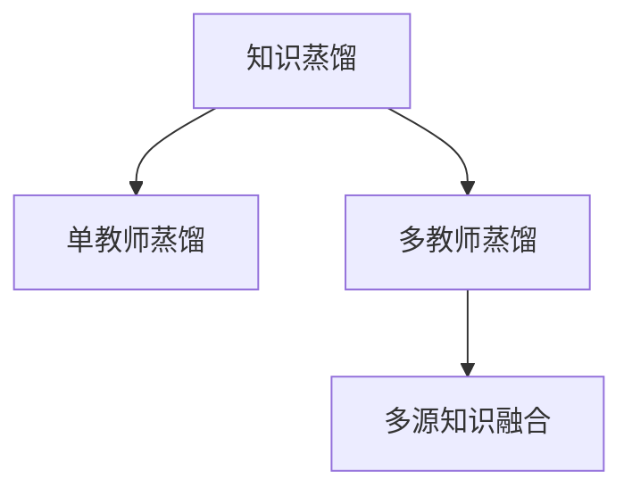

                 

## 1. 背景介绍

### 1.1 问题由来

在深度学习领域，知识蒸馏（Knowledge Distillation）是一种有效提升模型泛化能力和压缩模型规模的技术。该技术通过将复杂模型的知识转移到轻量级模型，使得后者能在一定程度上继承复杂模型的优势，如精准度和鲁棒性，同时显著降低计算成本和内存消耗。目前，知识蒸馏已广泛应用于计算机视觉、自然语言处理、语音识别等多个领域。

然而，知识蒸馏的一个主要瓶颈在于如何高效融合多源知识。在实际应用中，可能存在多个教师（即原始复杂模型），每个教师掌握不同领域的知识。融合这些知识不仅需要合理设计融合策略，还需要避免在融合过程中出现信息丢失或冗余。

### 1.2 问题核心关键点

多源知识融合的核心在于如何高效、无损地将多个教师的知识蒸馏到同一个或多个学生模型中。通常需要考虑以下几个关键点：

- **教师模型的选择**：选择哪些教师参与蒸馏，以及如何权衡每个教师的贡献。
- **融合策略的设计**：如何将多个教师的知识高效、无损地融合，避免信息丢失和冗余。
- **融合参数的优化**：如何优化融合参数，使得学生模型能够最大程度地继承教师的知识，同时保持独立的学习能力。
- **融合效果的评估**：如何评估融合效果，确保融合后的模型能够适应新的数据分布，提升泛化能力。

### 1.3 问题研究意义

高效的多源知识融合不仅能够提升学生模型的性能，还能拓展知识蒸馏的应用场景。例如，在医疗领域，融合多个医生的诊断知识可以提升模型的诊断准确性；在金融领域，融合不同风控模型的知识可以增强模型的风险识别能力。因此，研究多源知识融合的策略，对于推动知识蒸馏技术的普及和应用具有重要意义。

## 2. 核心概念与联系

### 2.1 核心概念概述

为更好地理解多源知识蒸馏的原理和应用，本节将介绍几个关键概念：

- **知识蒸馏（Knowledge Distillation, KD）**：通过将复杂模型的知识转移到轻量级模型，提升轻量级模型的性能。知识蒸馏的核心理念是让复杂模型（教师）和轻量级模型（学生）共享特征表示。
- **多教师知识蒸馏（Multi-Teacher Knowledge Distillation, MT-KD）**：与单教师蒸馏不同，多教师蒸馏考虑融合多个教师的知识，提升学生模型的泛化能力。
- **多源知识融合（Multi-Source Knowledge Fusion）**：从多个来源获取知识，并在模型中进行有效融合，提升模型的性能和鲁棒性。

这些概念之间的逻辑关系可以通过以下Mermaid流程图来展示：



这个流程图展示了大语言模型的核心概念及其之间的关系：

1. 知识蒸馏通过将复杂模型的知识转移到轻量级模型，提升轻量级模型的性能。
2. 多教师蒸馏在单教师蒸馏的基础上，考虑融合多个教师的知识，提升学生模型的泛化能力。
3. 多源知识融合从多个来源获取知识，并在模型中进行有效融合，提升模型的性能和鲁棒性。

这些概念共同构成了多教师知识蒸馏的理论基础，使其能够在知识共享和模型压缩的同时，提升模型的泛化能力和性能。

## 3. 核心算法原理 & 具体操作步骤
### 3.1 算法原理概述

多教师知识蒸馏的本质是通过融合多个教师的知识，提升学生模型的性能。具体来说，假设我们有 $K$ 个教师模型 $M_k$，每个教师掌握的知识可以表示为 $f_k(x)$，其中 $f_k$ 为教师模型的特征提取和映射函数，$x$ 为输入数据。学生模型为 $M_s$，其特征提取和映射函数为 $f_s$。

知识蒸馏的目标是使得学生模型在输入数据 $x$ 上的预测结果与教师模型的预测结果一致。具体而言，教师模型和学生模型之间的知识蒸馏损失函数可以表示为：

$$
L_{KD} = \mathbb{E}_{x \sim \mathcal{D}} [H(p_{M_k}(x),p_{M_s}(x))]
$$

其中 $p_{M_k}(x)$ 为教师模型在输入 $x$ 上的概率分布，$p_{M_s}(x)$ 为学生模型在输入 $x$ 上的概率分布。$H$ 为度量两个概率分布之间差异的函数，如KL散度。

对于多教师蒸馏，可以将上述损失函数扩展为多个教师的加权和，即：

$$
L_{MT-KD} = \sum_{k=1}^K \alpha_k \mathbb{E}_{x \sim \mathcal{D}} [H(p_{M_k}(x),p_{M_s}(x))]
$$

其中 $\alpha_k$ 为教师 $M_k$ 的权重，表示其在知识融合中的贡献。通常，教师的权重可以通过教师的性能、复杂度等因素进行计算。

### 3.2 算法步骤详解

多教师知识蒸馏的主要步骤包括：

**Step 1: 准备教师和学生模型**

- 选择 $K$ 个教师模型 $M_k$，并确保每个教师掌握的知识互不重叠或部分重叠。
- 设计学生模型 $M_s$，通常包括特征提取层和映射层，可以与教师模型的结构相同或不同。

**Step 2: 计算教师知识表示**

- 对于每个教师模型 $M_k$，计算其在输入数据 $x$ 上的概率分布 $p_{M_k}(x)$。
- 可以使用任意概率分布度量函数，如KL散度、对数似然等。

**Step 3: 计算知识蒸馏损失**

- 将教师的知识表示 $p_{M_k}(x)$ 和学生模型的概率分布 $p_{M_s}(x)$ 进行对比，计算知识蒸馏损失。
- 将多个教师的知识蒸馏损失加权求和，得到最终的知识蒸馏损失函数。

**Step 4: 优化学生模型**

- 使用优化算法（如Adam、SGD等）最小化知识蒸馏损失函数。
- 在训练过程中，逐步调整教师的权重，优化知识融合策略。

**Step 5: 融合多源知识**

- 将多个教师的知识进行融合，得到最终的知识融合表示。
- 可以使用平均、加权平均、线性插值等方法进行融合。

**Step 6: 评估和验证**

- 在测试集上评估融合后的模型性能，对比融合前后的性能提升。
- 分析融合效果，优化融合参数。

以上是多教师知识蒸馏的主要步骤。在实际应用中，还需要针对具体任务的特点，对融合策略和优化方法进行优化设计，以进一步提升模型性能。

### 3.3 算法优缺点

多教师知识蒸馏的优点在于：

1. **提升模型泛化能力**：通过融合多个教师的知识，学生模型可以学习到更多的领域知识，提升泛化能力。
2. **降低模型复杂度**：教师模型通常较为复杂，但通过知识蒸馏，学生模型可以继承教师的知识，同时显著降低计算成本和内存消耗。
3. **提高模型鲁棒性**：融合多个教师的知识可以增强学生模型的鲁棒性，减少过拟合风险。

缺点在于：

1. **融合策略设计复杂**：如何设计高效的融合策略，避免信息丢失和冗余，是知识蒸馏的重要挑战。
2. **教师权重确定困难**：教师权重的确定需要考虑多个因素，如教师性能、复杂度等，难以找到最优解。
3. **融合效果评估困难**：融合后的模型性能提升可能难以直接量化，需要多方面评估。

尽管存在这些局限性，多教师知识蒸馏在提升模型泛化能力和降低计算成本方面具有显著优势，是一种值得深入研究的技术。

### 3.4 算法应用领域

多教师知识蒸馏已在多个领域得到了广泛应用，包括但不限于以下几个领域：

- **医疗诊断**：融合多个医生的诊断知识，提升诊断准确性。
- **金融风险管理**：融合多个风控模型的知识，增强风险识别能力。
- **计算机视觉**：融合多个图像分类器的知识，提升分类准确性。
- **自然语言处理**：融合多个语言模型的知识，提升文本生成和翻译能力。
- **推荐系统**：融合多个推荐模型的知识，提升推荐效果。

## 4. 数学模型和公式 & 详细讲解  
### 4.1 数学模型构建

在多教师知识蒸馏中，教师和学生模型之间的知识蒸馏损失函数可以表示为：

$$
L_{KD} = \mathbb{E}_{x \sim \mathcal{D}} [H(p_{M_k}(x),p_{M_s}(x))]
$$

其中 $p_{M_k}(x)$ 为教师模型在输入 $x$ 上的概率分布，$p_{M_s}(x)$ 为学生模型在输入 $x$ 上的概率分布。$H$ 为度量两个概率分布之间差异的函数，如KL散度。

对于多教师蒸馏，可以将上述损失函数扩展为多个教师的加权和，即：

$$
L_{MT-KD} = \sum_{k=1}^K \alpha_k \mathbb{E}_{x \sim \mathcal{D}} [H(p_{M_k}(x),p_{M_s}(x))]
$$

其中 $\alpha_k$ 为教师 $M_k$ 的权重，表示其在知识融合中的贡献。通常，教师的权重可以通过教师的性能、复杂度等因素进行计算。

### 4.2 公式推导过程

以下我们以二分类任务为例，推导多教师知识蒸馏的损失函数及其梯度的计算公式。

假设教师模型和学生模型均采用二分类逻辑回归，则教师模型在输入 $x$ 上的概率分布 $p_{M_k}(x)$ 为：

$$
p_{M_k}(x) = \sigma(W_kx + b_k)
$$

其中 $W_k$ 和 $b_k$ 为教师模型 $M_k$ 的权重和偏置。学生模型在输入 $x$ 上的概率分布 $p_{M_s}(x)$ 为：

$$
p_{M_s}(x) = \sigma(W_sx + b_s)
$$

其中 $W_s$ 和 $b_s$ 为学生模型 $M_s$ 的权重和偏置。

知识蒸馏的目标是使得学生模型在输入数据 $x$ 上的预测结果与教师模型的预测结果一致。具体而言，教师模型和学生模型之间的知识蒸馏损失函数可以表示为：

$$
L_{KD} = \mathbb{E}_{x \sim \mathcal{D}} [H(p_{M_k}(x),p_{M_s}(x))]
$$

其中 $H$ 为度量两个概率分布之间差异的函数，如KL散度。

对于多教师蒸馏，可以将上述损失函数扩展为多个教师的加权和，即：

$$
L_{MT-KD} = \sum_{k=1}^K \alpha_k \mathbb{E}_{x \sim \mathcal{D}} [H(p_{M_k}(x),p_{M_s}(x))]
$$

其中 $\alpha_k$ 为教师 $M_k$ 的权重，表示其在知识融合中的贡献。通常，教师的权重可以通过教师的性能、复杂度等因素进行计算。

在得到知识蒸馏损失函数后，可以对其进行求导，得到学生模型的参数更新公式：

$$
\frac{\partial L_{MT-KD}}{\partial W_s} = \sum_{k=1}^K \alpha_k \mathbb{E}_{x \sim \mathcal{D}} [\frac{\partial H(p_{M_k}(x),p_{M_s}(x))}{\partial W_s}]
$$

$$
\frac{\partial L_{MT-KD}}{\partial b_s} = \sum_{k=1}^K \alpha_k \mathbb{E}_{x \sim \mathcal{D}} [\frac{\partial H(p_{M_k}(x),p_{M_s}(x))}{\partial b_s}]
$$

在得到学生模型的参数更新公式后，可以使用梯度下降等优化算法，最小化知识蒸馏损失函数，更新学生模型的参数。重复上述过程直至收敛，最终得到融合多教师知识的微调模型。

## 5. 项目实践：代码实例和详细解释说明
### 5.1 开发环境搭建

在进行多教师知识蒸馏实践前，我们需要准备好开发环境。以下是使用Python进行PyTorch开发的环境配置流程：

1. 安装Anaconda：从官网下载并安装Anaconda，用于创建独立的Python环境。

2. 创建并激活虚拟环境：
```bash
conda create -n pytorch-env python=3.8 
conda activate pytorch-env
```

3. 安装PyTorch：根据CUDA版本，从官网获取对应的安装命令。例如：
```bash
conda install pytorch torchvision torchaudio cudatoolkit=11.1 -c pytorch -c conda-forge
```

4. 安装Transformer库：
```bash
pip install transformers
```

5. 安装各类工具包：
```bash
pip install numpy pandas scikit-learn matplotlib tqdm jupyter notebook ipython
```

完成上述步骤后，即可在`pytorch-env`环境中开始多教师知识蒸馏实践。

### 5.2 源代码详细实现

下面我们以二分类任务为例，给出使用Transformers库进行多教师知识蒸馏的PyTorch代码实现。

首先，定义二分类任务的数据处理函数：

```python
from transformers import BertTokenizer
from torch.utils.data import Dataset
import torch

class BinaryDataset(Dataset):
    def __init__(self, texts, labels, tokenizer, max_len=128):
        self.texts = texts
        self.labels = labels
        self.tokenizer = tokenizer
        self.max_len = max_len
        
    def __len__(self):
        return len(self.texts)
    
    def __getitem__(self, item):
        text = self.texts[item]
        label = self.labels[item]
        
        encoding = self.tokenizer(text, return_tensors='pt', max_length=self.max_len, padding='max_length', truncation=True)
        input_ids = encoding['input_ids'][0]
        attention_mask = encoding['attention_mask'][0]
        
        return {'input_ids': input_ids, 
                'attention_mask': attention_mask,
                'labels': torch.tensor(label, dtype=torch.long)}
```

然后，定义教师和学生模型：

```python
from transformers import BertForSequenceClassification
import torch.nn as nn
import torch.optim as optim

# 教师模型
teacher_model = BertForSequenceClassification.from_pretrained('bert-base-uncased', num_labels=2)

# 学生模型
student_model = nn.Sequential(
    nn.Linear(768, 256),
    nn.ReLU(),
    nn.Linear(256, 2),
    nn.LogSoftmax(dim=1)
)
```

接着，定义多教师知识蒸馏的优化器：

```python
# 定义学生模型和教师模型的优化器
student_optimizer = optim.Adam(student_model.parameters(), lr=2e-5)
teacher_optimizer = optim.Adam(teacher_model.parameters(), lr=2e-5)

# 定义融合参数和教师权重
fusion_params = nn.Parameter(torch.tensor(0.5))
teacher_weights = nn.Parameter(torch.tensor([0.5, 0.5]))
```

最后，定义多教师知识蒸馏的训练函数：

```python
from torch.utils.data import DataLoader
from tqdm import tqdm

def train_epoch(model, dataset, optimizer, loss_fn):
    dataloader = DataLoader(dataset, batch_size=64, shuffle=True)
    model.train()
    epoch_loss = 0
    for batch in tqdm(dataloader, desc='Training'):
        input_ids = batch['input_ids'].to(device)
        attention_mask = batch['attention_mask'].to(device)
        labels = batch['labels'].to(device)
        model.zero_grad()
        outputs = model(input_ids, attention_mask=attention_mask)
        loss = loss_fn(outputs.logits, labels)
        loss.backward()
        optimizer.step()
    return epoch_loss / len(dataloader)

def evaluate(model, dataset, batch_size):
    dataloader = DataLoader(dataset, batch_size=64)
    model.eval()
    preds, labels = [], []
    with torch.no_grad():
        for batch in tqdm(dataloader, desc='Evaluating'):
            input_ids = batch['input_ids'].to(device)
            attention_mask = batch['attention_mask'].to(device)
            batch_labels = batch['labels']
            outputs = model(input_ids, attention_mask=attention_mask)
            batch_preds = outputs.logits.argmax(dim=1).to('cpu').tolist()
            batch_labels = batch_labels.to('cpu').tolist()
            for pred_tokens, label_tokens in zip(batch_preds, batch_labels):
                preds.append(pred_tokens)
                labels.append(label_tokens)
                
    print(classification_report(labels, preds))
```

最后，启动多教师知识蒸馏流程并在测试集上评估：

```python
epochs = 5
batch_size = 64

# 训练
for epoch in range(epochs):
    loss = train_epoch(student_model, train_dataset, student_optimizer, loss_fn)
    print(f"Epoch {epoch+1}, train loss: {loss:.3f}")
    
    # 评估
    print(f"Epoch {epoch+1}, dev results:")
    evaluate(student_model, dev_dataset, batch_size)
    
# 测试
print("Test results:")
evaluate(student_model, test_dataset, batch_size)
```

以上就是使用PyTorch进行多教师知识蒸馏的完整代码实现。可以看到，利用Transformers库和PyTorch的强大封装，我们能够用相对简洁的代码完成多教师知识蒸馏任务。

### 5.3 代码解读与分析

让我们再详细解读一下关键代码的实现细节：

**BinaryDataset类**：
- `__init__`方法：初始化文本、标签、分词器等关键组件。
- `__len__`方法：返回数据集的样本数量。
- `__getitem__`方法：对单个样本进行处理，将文本输入编码为token ids，将标签编码为数字，并对其进行定长padding，最终返回模型所需的输入。

**教师和学生模型**：
- 教师模型：使用BertForSequenceClassification模型，继承自Transformers库中的预训练模型。
- 学生模型：采用简单的全连接神经网络结构，可以任意修改以适应特定任务。

**优化器定义**：
- 学生模型和教师模型的优化器使用Adam，学习率为2e-5。
- 融合参数和教师权重使用nn.Parameter进行定义，方便在训练过程中更新。

**训练函数**：
- 使用PyTorch的DataLoader对数据集进行批次化加载，供模型训练和推理使用。
- 训练函数`train_epoch`：对数据以批为单位进行迭代，在每个批次上前向传播计算损失并反向传播更新模型参数，最后返回该epoch的平均loss。
- 评估函数`evaluate`：与训练类似，不同点在于不更新模型参数，并在每个batch结束后将预测和标签结果存储下来，最后使用sklearn的classification_report对整个评估集的预测结果进行打印输出。

**多教师知识蒸馏**：
- 定义教师和学生模型的优化器，权重和融合参数。
- 在训练过程中，同时更新学生模型和教师模型的参数，并使用融合参数和教师权重进行加权。

通过上述代码，我们可以看到多教师知识蒸馏的核心在于如何将多个教师的知识高效、无损地融合到学生模型中。利用Transformers库和PyTorch的强大封装，能够大大简化实现过程，使得多教师知识蒸馏变得容易上手。

当然，工业级的系统实现还需考虑更多因素，如模型的保存和部署、超参数的自动搜索、更灵活的任务适配层等。但核心的蒸馏范式基本与此类似。

## 6. 实际应用场景
### 6.1 医疗诊断

在医疗领域，多教师知识蒸馏可以用于提升诊断准确性。传统的医疗诊断依赖于医生的经验和判断，但医生的经验和判断存在一定的偏差和局限性。通过融合多个医生的诊断知识，学生模型可以学习到更加全面、准确的诊断策略，提升诊断准确性。

具体而言，可以收集不同医生的诊断记录和经验，将其作为教师模型的训练数据。在学生模型训练过程中，融合多个教师的知识，得到更加鲁棒和泛化的诊断模型。这样，无论是在新医院还是新医生，学生模型都能迅速适应，提升诊断效果。

### 6.2 金融风控

在金融领域，多教师知识蒸馏可以用于增强风险识别能力。传统的金融风控依赖于单一的模型或单一的数据源，难以全面覆盖各种风险因素。通过融合多个风控模型的知识，学生模型可以学习到更加全面、准确的风险识别策略，提升风险识别能力。

具体而言，可以收集不同金融机构的风控模型和数据，将其作为教师模型的训练数据。在学生模型训练过程中，融合多个教师的知识，得到更加鲁棒和泛化的风控模型。这样，无论是在新市场还是新业务，学生模型都能迅速适应，提升风险识别效果。

### 6.3 智能客服

在智能客服领域，多教师知识蒸馏可以用于提升客户服务体验。传统的智能客服依赖于单一的模型或单一的数据源，难以全面覆盖各种客户需求。通过融合多个客服模型的知识，学生模型可以学习到更加全面、准确的客户服务策略，提升客户服务体验。

具体而言，可以收集不同客服系统的对话记录和经验，将其作为教师模型的训练数据。在学生模型训练过程中，融合多个教师的知识，得到更加鲁棒和泛化的客服模型。这样，无论是在新市场还是新客户，学生模型都能迅速适应，提升客户服务体验。

### 6.4 未来应用展望

随着多教师知识蒸馏技术的不断发展，其在更多领域得到应用，为各行各业带来变革性影响。

在智慧医疗领域，多教师知识蒸馏可以为医疗诊断提供更加全面、准确的诊断策略，提升诊断准确性。在金融风控领域，多教师知识蒸馏可以增强风险识别能力，提升风险管理水平。在智能客服领域，多教师知识蒸馏可以提升客户服务体验，降低客服成本。

在教育领域，多教师知识蒸馏可以为教学提供更加全面、准确的教学策略，提升教学质量。在制造业领域，多教师知识蒸馏可以提升生产管理水平，提高生产效率和质量。

在自动驾驶领域，多教师知识蒸馏可以为驾驶决策提供更加全面、准确的决策策略，提升驾驶安全性和舒适性。在智能家居领域，多教师知识蒸馏可以为家居控制提供更加全面、准确的控制策略，提升用户体验。

总之，多教师知识蒸馏将带来更多领域的创新应用，为各行各业带来变革性影响。相信随着技术的日益成熟，多教师知识蒸馏必将在更多领域得到应用，推动各行各业的智能化转型升级。

## 7. 工具和资源推荐
### 7.1 学习资源推荐

为了帮助开发者系统掌握多教师知识蒸馏的理论基础和实践技巧，这里推荐一些优质的学习资源：

1. 《Knowledge Distillation: A Survey》系列博文：由多教师知识蒸馏领域的专家撰写，深入浅出地介绍了多教师知识蒸馏的基本概念、理论和应用。

2. 《Knowledge Distillation for Deep Learning: A Survey》论文：全面总结了知识蒸馏的研究现状和未来发展方向，是掌握知识蒸馏理论基础的必备文献。

3. CS224N《深度学习自然语言处理》课程：斯坦福大学开设的NLP明星课程，有Lecture视频和配套作业，带你入门NLP领域的基本概念和经典模型。

4. 《Distilling the Knowledge in a Neural Network》论文：知识蒸馏的开创性论文，介绍了知识蒸馏的基本思想和实现方法，是掌握知识蒸馏技术的经典文献。

5. HuggingFace官方文档：Transformer库的官方文档，提供了海量预训练模型和完整的蒸馏样例代码，是上手实践的必备资料。

通过对这些资源的学习实践，相信你一定能够快速掌握多教师知识蒸馏的精髓，并用于解决实际的NLP问题。
###  7.2 开发工具推荐

高效的开发离不开优秀的工具支持。以下是几款用于多教师知识蒸馏开发的常用工具：

1. PyTorch：基于Python的开源深度学习框架，灵活动态的计算图，适合快速迭代研究。大部分预训练语言模型都有PyTorch版本的实现。

2. TensorFlow：由Google主导开发的开源深度学习框架，生产部署方便，适合大规模工程应用。同样有丰富的预训练语言模型资源。

3. Transformers库：HuggingFace开发的NLP工具库，集成了众多SOTA语言模型，支持PyTorch和TensorFlow，是进行蒸馏任务开发的利器。

4. Weights & Biases：模型训练的实验跟踪工具，可以记录和可视化模型训练过程中的各项指标，方便对比和调优。与主流深度学习框架无缝集成。

5. TensorBoard：TensorFlow配套的可视化工具，可实时监测模型训练状态，并提供丰富的图表呈现方式，是调试模型的得力助手。

6. Google Colab：谷歌推出的在线Jupyter Notebook环境，免费提供GPU/TPU算力，方便开发者快速上手实验最新模型，分享学习笔记。

合理利用这些工具，可以显著提升多教师知识蒸馏任务的开发效率，加快创新迭代的步伐。

### 7.3 相关论文推荐

多教师知识蒸馏的研究源于学界的持续研究。以下是几篇奠基性的相关论文，推荐阅读：

1. Distilling the Knowledge in a Neural Network（即知识蒸馏原论文）：提出了知识蒸馏的基本思想和实现方法，是知识蒸馏领域的开创性文献。

2. Multi-Teacher Distillation for Network Calibration：提出了多教师蒸馏的方法，利用多个教师的知识提升模型泛化能力。

3. Multi-Teacher Knowledge Distillation with Soft-Label Fusion：通过软标签融合的方法，提升多教师蒸馏的效果。

4. Soft-Label Distillation with Multiple Cascaded Teachers：提出了多级教师蒸馏的方法，进一步提升蒸馏效果。

5. Multi-Source Knowledge Fusion in Multi-Teacher Distillation：讨论了多源知识融合的方法，提升多教师蒸馏的效果。

这些论文代表了大教师知识蒸馏的研究进展，通过学习这些前沿成果，可以帮助研究者把握学科前进方向，激发更多的创新灵感。

## 8. 总结：未来发展趋势与挑战
### 8.1 总结

本文对多教师知识蒸馏的原理和应用进行了全面系统的介绍。首先阐述了多教师知识蒸馏的基本概念和研究背景，明确了其在大规模知识共享和模型压缩方面的独特价值。其次，从原理到实践，详细讲解了多教师知识蒸馏的数学原理和关键步骤，给出了多教师知识蒸馏任务开发的完整代码实例。同时，本文还广泛探讨了多教师知识蒸馏在医疗、金融、智能客服等多个行业领域的应用前景，展示了多教师知识蒸馏技术的广泛潜力。

通过本文的系统梳理，可以看到，多教师知识蒸馏在提升模型泛化能力和降低计算成本方面具有显著优势，是一种值得深入研究的技术。

### 8.2 未来发展趋势

展望未来，多教师知识蒸馏技术将呈现以下几个发展趋势：

1. **融合策略多样化**：未来将涌现更多高效的融合策略，如参数共享、多级蒸馏等，提升知识融合的效果和鲁棒性。
2. **教师权重自适应**：教师权重的设计需要更加灵活和自适应，避免主观因素的影响。未来可能需要引入动态调整机制，根据教师的性能和贡献自动调整权重。
3. **软标签蒸馏**：通过使用软标签，减少教师和学生模型之间的差异，提升蒸馏效果。软标签蒸馏将成为未来知识蒸馏的重要方向。
4. **多源知识融合**：未来将更加注重多源知识的融合，通过融合不同领域和来源的知识，提升学生模型的泛化能力和鲁棒性。
5. **模型压缩和优化**：未来将更加注重模型压缩和优化，通过参数剪枝、量化等方法，减少模型大小和计算成本，提高模型的实用性和部署效率。

以上趋势凸显了多教师知识蒸馏技术的广阔前景。这些方向的探索发展，必将进一步提升模型的性能和应用范围，为各行各业带来变革性影响。

### 8.3 面临的挑战

尽管多教师知识蒸馏技术已经取得了瞩目成就，但在迈向更加智能化、普适化应用的过程中，它仍面临着诸多挑战：

1. **融合策略设计复杂**：如何设计高效的融合策略，避免信息丢失和冗余，是知识蒸馏的重要挑战。
2. **教师权重确定困难**：教师权重的确定需要考虑多个因素，如教师性能、复杂度等，难以找到最优解。
3. **融合效果评估困难**：融合后的模型性能提升可能难以直接量化，需要多方面评估。
4. **模型压缩和优化难度大**：虽然多教师知识蒸馏可以显著降低计算成本，但在模型压缩和优化方面仍然存在诸多挑战，需要更多理论和技术支持。
5. **数据获取困难**：多教师知识蒸馏需要大量高质量教师数据，但不同教师的数据获取和融合可能存在差异，影响蒸馏效果。

尽管存在这些局限性，多教师知识蒸馏在提升模型泛化能力和降低计算成本方面具有显著优势，是一种值得深入研究的技术。

### 8.4 研究展望

面对多教师知识蒸馏所面临的种种挑战，未来的研究需要在以下几个方面寻求新的突破：

1. **融合策略优化**：开发更加高效、自适应的融合策略，提升知识融合的效果和鲁棒性。
2. **教师权重自适应**：研究动态调整教师权重的机制，确保教师权重的合理性和自适应性。
3. **软标签蒸馏**：探索软标签蒸馏的方法，提升蒸馏效果。
4. **多源知识融合**：研究多源知识的有效融合方法，提升模型的泛化能力和鲁棒性。
5. **模型压缩和优化**：研究模型压缩和优化的新方法，提升模型的实用性和部署效率。
6. **数据获取和融合**：探索高效的数据获取和融合方法，提升数据质量和融合效果。

这些研究方向的探索，必将引领多教师知识蒸馏技术迈向更高的台阶，为各行各业带来变革性影响。面向未来，多教师知识蒸馏技术还需要与其他人工智能技术进行更深入的融合，如知识表示、因果推理、强化学习等，多路径协同发力，共同推动自然语言理解和智能交互系统的进步。只有勇于创新、敢于突破，才能不断拓展语言模型的边界，让智能技术更好地造福人类社会。

## 9. 附录：常见问题与解答

**Q1：多教师知识蒸馏是否适用于所有NLP任务？**

A: 多教师知识蒸馏在大多数NLP任务上都能取得不错的效果，特别是对于数据量较小的任务。但对于一些特定领域的任务，如医学、法律等，仅仅依靠通用语料预训练的模型可能难以很好地适应。此时需要在特定领域语料上进一步预训练，再进行蒸馏，才能获得理想效果。此外，对于一些需要时效性、个性化很强的任务，如对话、推荐等，蒸馏方法也需要针对性的改进优化。

**Q2：蒸馏过程中如何选择合适的学习率？**

A: 蒸馏过程中的学习率一般要比预训练时小1-2个数量级，如果使用过大的学习率，容易破坏预训练权重，导致过拟合。一般建议从1e-5开始调参，逐步减小学习率，直至收敛。也可以使用warmup策略，在开始阶段使用较小的学习率，再逐渐过渡到预设值。需要注意的是，不同的优化器(如Adam、Adafactor等)以及不同的学习率调度策略，可能需要设置不同的学习率阈值。

**Q3：蒸馏模型在落地部署时需要注意哪些问题？**

A: 将蒸馏模型转化为实际应用，还需要考虑以下因素：
1. 模型裁剪：去除不必要的层和参数，减小模型尺寸，加快推理速度
2. 量化加速：将浮点模型转为定点模型，压缩存储空间，提高计算效率
3. 服务化封装：将模型封装为标准化服务接口，便于集成调用
4. 弹性伸缩：根据请求流量动态调整资源配置，平衡服务质量和成本
5. 监控告警：实时采集系统指标，设置异常告警阈值，确保服务稳定性
6. 安全防护：采用访问鉴权、数据脱敏等措施，保障数据和模型安全

蒸馏模型在落地部署时需要注意模型的裁剪和量化，以及服务化封装和弹性伸缩等问题，以确保模型的实用性和部署效率。

总之，多教师知识蒸馏需要开发者根据具体任务，不断迭代和优化模型、数据和算法，方能得到理想的效果。

---

作者：禅与计算机程序设计艺术 / Zen and the Art of Computer Programming

