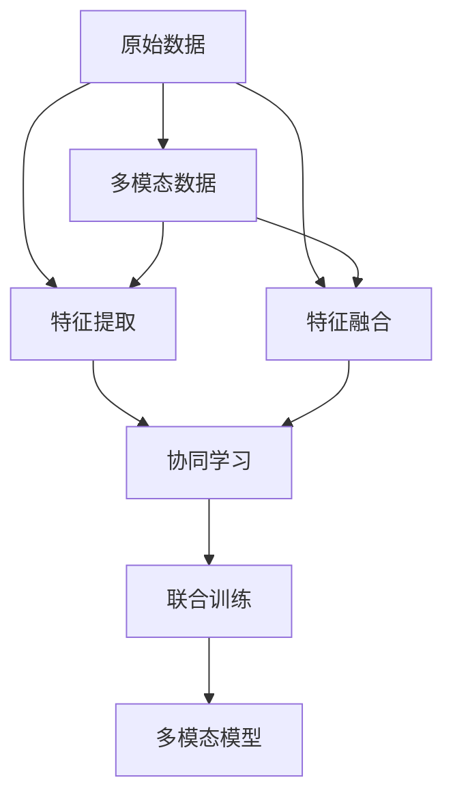

                 

## 1. 背景介绍

随着技术的飞速发展，多模态AI（Artificial Intelligence）技术已经成为了热门的研究方向。与传统单模态AI不同，多模态AI能够综合处理图像、音频、视频等多种类型的数据，这使得其应用范围更加广泛，且在很多场景中具有明显优势。例如，在医疗领域中，医生可以通过结合影像和病历信息，更准确地诊断疾病；在智能家居领域，多模态系统可以实时监测家庭环境和用户行为，提供更个性化的服务；在无人驾驶领域，多模态系统可以通过综合分析摄像头、雷达、激光雷达等传感器数据，确保车辆安全行驶。

然而，多模态AI的处理复杂性也相对较高，涉及到不同模态数据的协同处理，不同模态间特征的融合，以及如何有效利用这些多源数据进行高效的模型训练等问题。本文将系统地介绍多模态AI在图像、音频、视频处理中的应用，探讨其核心算法原理，分析其优缺点，并对未来的发展趋势进行展望。

## 2. 核心概念与联系

### 2.1 核心概念概述

为了更好地理解多模态AI，首先介绍几个核心概念：

- **多模态AI**：指同时处理图像、音频、视频等多种数据类型的AI技术。多模态AI的优点在于能够从多个维度获取信息，更全面、准确地进行分析和推理。

- **特征提取**：从原始数据中提取有意义的特征是进行多模态数据融合的前提。不同模态的数据有不同的特征提取方式，例如图像的特征提取通常通过卷积神经网络（CNN）实现，音频的特征提取通常通过卷积操作（例如卷积神经网络中的Time-Domain卷积）或者基于频域的DFT（离散傅里叶变换）实现，视频则通常通过时间上的特征提取（如3D卷积神经网络）或融合空间和时间的特征（如2D和3D特征的组合）来实现。

- **特征融合**：将不同模态的特征融合在一起，形成综合性的表示。特征融合的方式有很多种，包括特征拼接、特征加权融合、深度融合等。

- **协同学习**：多模态AI中的一种重要技术，它通过不同模态的数据协同训练模型，实现知识的互补和共享。

- **联合训练**：另一种多模态AI技术，它通过同时训练多模态数据，使得模型能够对不同模态数据进行联合处理。

这些概念之间有着密切的联系。特征提取是基础，特征融合是关键，协同学习和联合训练是提升模型性能的有效方法。通过多模态AI技术，我们可以更好地理解和处理复杂的多源数据，提升应用的效果。

### 2.2 核心概念原理和架构的 Mermaid 流程图



上述 Mermaid 流程图展示了多模态AI处理的基本流程：原始数据经过特征提取后，通过特征融合形成了综合性的特征，协同学习和联合训练进一步提升了模型的性能，最终得到了一个多模态模型。

## 3. 核心算法原理 & 具体操作步骤

### 3.1 算法原理概述

多模态AI的核心算法原理是融合不同模态的数据，以提升模型的性能。具体来说，它的主要流程包括：

1. 特征提取：分别从图像、音频、视频等多种模态中提取特征。
2. 特征融合：将不同模态的特征融合在一起，形成综合性的特征表示。
3. 模型训练：在综合性的特征表示上训练模型，以提升性能。

### 3.2 算法步骤详解

以下是多模态AI在图像、音频、视频处理中的详细步骤：

#### 步骤1：特征提取

- **图像特征提取**：通常使用卷积神经网络（CNN）进行特征提取。CNN可以通过多层卷积和池化操作，提取出图像的空间特征，例如颜色、纹理、形状等。常用的图像特征提取模型包括VGG、ResNet、Inception等。

- **音频特征提取**：可以使用卷积神经网络（CNN）、卷积操作（如Time-Domain卷积）、基于频域的DFT等方法进行特征提取。常用的音频特征提取模型包括MFCC（Mel-Frequency Cepstral Coefficients）、Wav2Vec等。

- **视频特征提取**：可以通过3D卷积神经网络、时空卷积神经网络等模型进行特征提取。常用的视频特征提取模型包括C3D、I3D等。

#### 步骤2：特征融合

特征融合的方法有很多，常见的包括：

- **特征拼接**：将不同模态的特征直接拼接在一起，形成一个大的特征向量。这种方法简单易实现，但容易导致信息丢失。

- **特征加权融合**：在特征拼接的基础上，对不同模态的特征进行加权融合，使得模型更注重关键特征。

- **深度融合**：通过深度学习模型（如融合神经网络），将不同模态的特征进行深度融合，以提升模型的性能。

#### 步骤3：模型训练

模型训练通常使用深度学习模型，例如卷积神经网络（CNN）、递归神经网络（RNN）、长短时记忆网络（LSTM）等。训练过程可以分为以下几个步骤：

- **数据准备**：将原始数据转化为模型可以处理的格式，例如将图像转换为张量，将音频转换为频谱图，将视频转换为帧序列等。

- **模型选择**：选择合适的模型，例如卷积神经网络（CNN）、递归神经网络（RNN）、长短时记忆网络（LSTM）等。

- **模型训练**：使用训练数据训练模型，并使用验证数据进行调参和评估。训练过程中，可以采用小批量梯度下降（Mini-Batch Gradient Descent）、动量（Momentum）等优化算法。

- **模型评估**：使用测试数据评估模型性能，通常采用精度、召回率、F1分数等指标进行评估。

### 3.3 算法优缺点

多模态AI具有以下优点：

- **数据融合**：能够综合多种模态数据的信息，提升模型的性能。
- **多源信息**：通过结合不同模态的数据，可以从多个角度理解问题，提升模型的鲁棒性和泛化能力。
- **任务多样化**：多模态AI可以应用于图像、音频、视频等多个领域，具有广泛的应用前景。

然而，多模态AI也存在一些缺点：

- **计算复杂**：多模态AI的计算复杂度较高，需要处理多种模态的数据，且不同模态的特征提取和融合方法各有差异，增加了计算难度。
- **数据量需求大**：多模态AI需要大量的训练数据，不同模态的数据量需求也不相同，对数据采集和标注提出了更高的要求。
- **模型复杂**：多模态AI的模型通常较为复杂，训练和推理过程相对耗时。

### 3.4 算法应用领域

多模态AI在多个领域得到了广泛应用，例如：

- **医疗**：通过结合影像和病历信息，实现疾病诊断和治疗决策。
- **智能家居**：通过结合传感器数据和用户行为信息，提供个性化服务。
- **无人驾驶**：通过结合摄像头、雷达、激光雷达等传感器数据，实现安全行驶。
- **安防监控**：通过结合视频和音频数据，实现智能监控和安全预警。
- **金融**：通过结合股票市场数据和新闻信息，进行股票预测和风险评估。
- **娱乐**：通过结合视频和音频数据，实现电影推荐和音乐推荐。

## 4. 数学模型和公式 & 详细讲解 & 举例说明

### 4.1 数学模型构建

多模态AI的数学模型可以表示为：

$$
\mathcal{M} = \mathcal{M}_{img} \otimes \mathcal{M}_{aud} \otimes \mathcal{M}_{vid}
$$

其中，$\mathcal{M}_{img}$、$\mathcal{M}_{aud}$、$\mathcal{M}_{vid}$分别表示图像、音频、视频模型的输出。$\otimes$表示特征融合操作。

### 4.2 公式推导过程

以图像和音频融合为例，假设输入图像为$I$，音频为$A$，分别提取特征后得到$I' \in \mathbb{R}^{H \times W \times C}$和$A' \in \mathbb{R}^{T \times D}$。特征融合可以采用拼接的方式，得到综合特征$F \in \mathbb{R}^{H \times W \times C + T \times D}$。然后，在该综合特征上训练深度学习模型$M$。

### 4.3 案例分析与讲解

以智能家居多模态系统为例，假设输入为摄像头监控的图像$I$、门窗传感器传来的声音$A$以及门窗开合的情况$V$。首先，使用卷积神经网络（CNN）提取图像特征$I'$，使用MFCC提取音频特征$A'$，使用时间序列模型（如LSTM）提取视频特征$V'$。然后，将这三个特征拼接在一起，得到综合特征$F$，并在该特征上训练深度学习模型$M$，实现家居智能控制和安全预警等功能。

## 5. 项目实践：代码实例和详细解释说明

### 5.1 开发环境搭建

搭建多模态AI开发环境主要需要安装Python、PyTorch、TensorFlow等深度学习框架，以及相应的预训练模型库和特征提取库。例如，使用PyTorch框架时，可以使用以下命令安装：

```bash
pip install torch torchvision torchaudio transformers
```

### 5.2 源代码详细实现

以多模态图像和音频融合为例，代码实现如下：

```python
import torch
from torchvision import models
from torchaudio import transforms

# 加载预训练模型
model_img = models.vgg16(pretrained=True)
model_aud = transforms.load_pretrained_model('wav2vec')

# 特征提取
I_prime = model_img(I_tensor)  # 图像特征提取
A_prime = model_aud(A_tensor)  # 音频特征提取

# 特征拼接
F = torch.cat([I_prime, A_prime], dim=1)

# 训练模型
model = models.linear_layer(in_features=F.size()[1], out_features=num_classes)
model = torch.nn.Sequential(model, torch.nn.Linear(in_features=F.size()[1], out_features=num_classes))
model.train()
criterion = torch.nn.CrossEntropyLoss()
optimizer = torch.optim.Adam(model.parameters(), lr=learning_rate)

# 训练过程
for epoch in range(num_epochs):
    for inputs, labels in train_loader:
        inputs = inputs.to(device)
        labels = labels.to(device)
        optimizer.zero_grad()
        outputs = model(inputs)
        loss = criterion(outputs, labels)
        loss.backward()
        optimizer.step()

# 测试过程
with torch.no_grad():
    correct = 0
    total = 0
    for inputs, labels in test_loader:
        inputs = inputs.to(device)
        labels = labels.to(device)
        outputs = model(inputs)
        _, predicted = torch.max(outputs.data, 1)
        total += labels.size(0)
        correct += (predicted == labels).sum().item()

    print(f'Test Accuracy: {100 * correct / total:.2f}%')
```

### 5.3 代码解读与分析

上述代码中，首先加载了预训练的图像和音频特征提取模型，对输入的图像和音频数据进行特征提取。然后，将提取的特征进行拼接，并定义了一个线性分类器。在训练过程中，使用Adam优化器进行参数更新，交叉熵损失函数进行损失计算。最后，在测试集上评估模型的性能。

## 6. 实际应用场景

### 6.1 智能家居系统

智能家居系统可以通过多模态AI技术，实时监测和分析家庭环境和用户行为，提供个性化的服务。例如，结合摄像头图像、门窗传感器传来的声音、红外传感器检测到的用户活动等数据，可以实现智能门禁、智能灯光、智能安防等功能。

### 6.2 无人驾驶系统

无人驾驶系统可以通过多模态AI技术，实时感知和理解周围环境，实现安全行驶。例如，结合摄像头、雷达、激光雷达等传感器数据，实现目标检测、车道保持、自动泊车等功能。

### 6.3 安防监控系统

安防监控系统可以通过多模态AI技术，实现智能监控和安全预警。例如，结合视频和音频数据，检测异常行为、识别可疑人员、报警等。

### 6.4 金融预测系统

金融预测系统可以通过多模态AI技术，综合股票市场数据和新闻信息，进行股票预测和风险评估。例如，结合股票价格、交易量、公司财报、新闻报道等多源数据，进行多模态学习，提升预测准确率。

## 7. 工具和资源推荐

### 7.1 学习资源推荐

- **《深度学习》**：Ian Goodfellow等人撰写的深度学习经典教材，涵盖深度学习的基本概念、算法和应用。
- **《多模态深度学习》**：David Lay等人编写的多模态深度学习教材，涵盖多模态数据处理和深度学习模型的实现。
- **《Deep Learning with PyTorch》**：Bach et al.撰写的PyTorch深度学习实战教程，涵盖深度学习模型的实现和应用。

### 7.2 开发工具推荐

- **PyTorch**：一个开源的深度学习框架，支持动态计算图和GPU加速。
- **TensorFlow**：一个开源的深度学习框架，支持静态计算图和GPU加速。
- **OpenCV**：一个开源的计算机视觉库，支持图像处理和特征提取。
- **PyAudio**：一个开源的音频处理库，支持音频数据的读取和处理。
- **Keras**：一个高级深度学习API，支持快速原型设计和模型训练。

### 7.3 相关论文推荐

- **《多模态深度学习：原理与实践》**：Cui et al.综述了多模态深度学习的研究现状和应用，涵盖多个领域的多模态数据处理和深度学习模型。
- **《多模态特征融合方法》**：Liu et al.综述了多模态特征融合的方法和技术，涵盖特征拼接、特征加权融合、深度融合等多种方法。

## 8. 总结：未来发展趋势与挑战

### 8.1 研究成果总结

多模态AI在图像、音频、视频处理等领域得到了广泛应用，并取得了显著的进展。其核心算法原理包括特征提取、特征融合、模型训练等步骤，能够有效提升模型的性能。多模态AI的优点在于数据融合、多源信息、任务多样化等，但也存在计算复杂、数据量大、模型复杂等缺点。

### 8.2 未来发展趋势

未来，多模态AI将继续在多个领域得到应用，其发展趋势包括：

- **计算效率提升**：随着硬件技术的不断进步，多模态AI的计算效率将进一步提升，特别是在GPU、TPU等高性能设备的支持下。
- **数据采集和标注**：随着传感器技术的不断进步，多模态数据的采集将更加便捷和高效。同时，自动化数据标注技术的发展，将减少标注工作量。
- **多模态融合技术**：特征融合技术将进一步发展，深度融合和联合训练方法将更加高效和准确。
- **模型轻量化**：多模态AI模型的轻量化技术将不断提升，使得模型更适用于移动设备和嵌入式系统。
- **模型迁移学习**：多模态AI模型的迁移学习技术将进一步发展，使得模型可以更好地适应不同场景和任务。

### 8.3 面临的挑战

尽管多模态AI在多个领域得到了广泛应用，但仍然面临一些挑战：

- **数据多样性**：不同模态的数据格式和特性差异较大，如何有效融合这些数据仍然是一个挑战。
- **计算资源消耗**：多模态AI需要处理多种模态的数据，计算资源消耗较大，需要更高效的计算方法。
- **模型可解释性**：多模态AI模型的黑盒性质使得其难以解释，需要进一步研究和解决。
- **数据隐私和安全**：多模态AI系统需要处理大量敏感数据，如何保障数据隐私和安全是一个重要挑战。

### 8.4 研究展望

未来的研究将围绕以下几个方向展开：

- **数据预处理技术**：研究如何更好地处理不同模态的数据，提升特征提取和融合的效率。
- **深度融合技术**：研究如何通过深度学习技术实现多模态数据的深度融合，提升模型的性能。
- **迁移学习技术**：研究如何利用迁移学习技术，使得多模态AI模型能够适应不同场景和任务。
- **模型轻量化技术**：研究如何通过模型压缩、稀疏化等方法，提升多模态AI模型的轻量化和实时性。
- **模型可解释性技术**：研究如何通过可解释性技术，使得多模态AI模型具有更高的可解释性和透明性。

## 9. 附录：常见问题与解答

### Q1：多模态AI处理图像、音频、视频等不同模态数据时，如何进行选择？

A: 选择多模态AI处理不同模态数据时，需要考虑以下因素：

- **任务需求**：根据任务需求选择合适的模态数据。例如，处理图像时，可以使用卷积神经网络（CNN）提取特征；处理音频时，可以使用MFCC或卷积神经网络（CNN）提取特征；处理视频时，可以使用3D卷积神经网络或时空卷积神经网络提取特征。
- **数据可用性**：根据数据的可用性选择合适的模态数据。例如，如果图像数据丰富且易于获取，可以选择图像作为主要模态；如果音频数据丰富且易于获取，可以选择音频作为主要模态；如果视频数据丰富且易于获取，可以选择视频作为主要模态。
- **系统资源**：根据系统资源选择合适的模态数据。例如，如果系统计算资源有限，可以选择图像作为主要模态；如果系统计算资源丰富，可以选择视频作为主要模态。

### Q2：多模态AI模型如何进行特征融合？

A: 多模态AI模型的特征融合方法有很多，常见的包括：

- **特征拼接**：将不同模态的特征直接拼接在一起，形成一个大的特征向量。这种方法简单易实现，但容易导致信息丢失。
- **特征加权融合**：在特征拼接的基础上，对不同模态的特征进行加权融合，使得模型更注重关键特征。
- **深度融合**：通过深度学习模型（如融合神经网络），将不同模态的特征进行深度融合，以提升模型的性能。

### Q3：多模态AI模型如何进行联合训练？

A: 多模态AI模型的联合训练可以通过以下步骤实现：

- **数据准备**：将原始数据转化为模型可以处理的格式，例如将图像转换为张量，将音频转换为频谱图，将视频转换为帧序列等。
- **模型选择**：选择合适的模型，例如卷积神经网络（CNN）、递归神经网络（RNN）、长短时记忆网络（LSTM）等。
- **模型训练**：使用训练数据训练模型，并使用验证数据进行调参和评估。训练过程中，可以采用小批量梯度下降（Mini-Batch Gradient Descent）、动量（Momentum）等优化算法。

### Q4：多模态AI模型如何进行协同学习？

A: 多模态AI模型的协同学习可以通过以下步骤实现：

- **数据准备**：将原始数据转化为模型可以处理的格式，例如将图像转换为张量，将音频转换为频谱图，将视频转换为帧序列等。
- **模型选择**：选择合适的模型，例如卷积神经网络（CNN）、递归神经网络（RNN）、长短时记忆网络（LSTM）等。
- **模型训练**：使用训练数据训练模型，并使用验证数据进行调参和评估。训练过程中，可以采用小批量梯度下降（Mini-Batch Gradient Descent）、动量（Momentum）等优化算法。
- **协同学习**：在模型训练过程中，通过不同模态的数据协同学习，实现知识的互补和共享。例如，在图像分类任务中，可以使用图像和音频数据协同训练模型，提升模型的泛化能力。

### Q5：多模态AI模型如何优化计算资源消耗？

A: 多模态AI模型优化计算资源消耗的方法包括：

- **模型轻量化**：通过模型压缩、稀疏化等方法，提升多模态AI模型的轻量化和实时性。
- **分布式计算**：使用分布式计算技术，将计算任务分配到多个计算节点上，提升计算效率。
- **异步训练**：通过异步训练技术，将计算任务并行化，提升计算效率。
- **GPU加速**：使用GPU加速技术，提升多模态AI模型的计算速度。

---

作者：禅与计算机程序设计艺术 / Zen and the Art of Computer Programming

