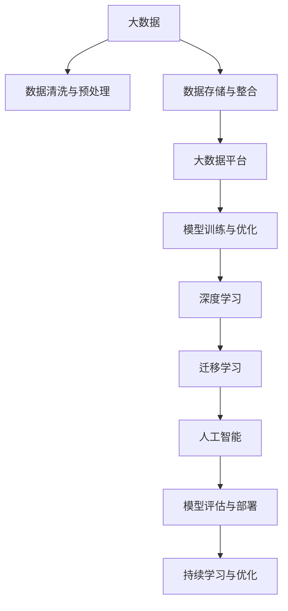

                 

# 大数据对AI学习的影响

在AI领域，大数据与人工智能（AI）技术的融合，正在彻底改变我们对数据的学习方式、模型训练的效率与准确性，以及AI的实际应用场景。本文旨在深入探讨大数据对AI学习的影响，从背景介绍、核心概念、算法原理、数学模型、项目实践、应用场景、工具资源推荐、总结展望等方面，全方位解析这一深刻变革。

## 1. 背景介绍

随着互联网的普及和数字化的加速，数据正以指数级增长。根据国际数据公司（IDC）的预测，到2025年，全球产生的数据总量将达到175ZB，即1.75万亿GB。在这庞大的数据海洋中，蕴含着无尽的智慧和知识，成为人工智能技术进步的重要基石。

**背景描述**：
- **数据爆炸与存储技术**：数据量飞速增长，传统存储方式面临挑战，分布式存储和云存储应运而生。
- **数据质量与数据清洗**：大规模数据集的噪声与缺失值问题凸显，数据清洗与预处理技术愈发重要。
- **数据整合与大数据平台**：不同数据源的整合成为关键，大数据平台（如Hadoop、Spark）提供了高效的数据处理能力。
- **数据治理与安全**：数据隐私、安全和合规成为关注焦点，数据治理与合规技术需求上升。

## 2. 核心概念与联系

### 2.1 核心概念概述

理解大数据对AI学习的影响，首先需要把握以下几个核心概念：

- **大数据（Big Data）**：指规模巨大、类型多样、速度极快的数据集，涵盖结构化、半结构化与非结构化数据。
- **人工智能（AI）**：涵盖机器学习、深度学习、自然语言处理、计算机视觉等多个子领域，通过算法与模型训练实现自主决策与智能分析。
- **数据驱动（Data-Driven）**：AI模型训练与优化依赖于大量高质量数据，模型性能的提升基于数据的积累与优化。
- **深度学习（Deep Learning）**：通过多层神经网络结构，自动提取复杂特征，提升模型预测能力。
- **迁移学习（Transfer Learning）**：利用已学习到的知识迁移到新任务，提升模型在不同任务间的泛化能力。

这些概念通过以下Mermaid流程图体现其内在联系：



### 2.2 核心概念原理和架构

在大数据与AI学习的过程中，以下几个关键原理和技术架构至关重要：

- **数据清洗与预处理**：通过去除噪声、填补缺失值、标准化数据等技术，提升数据质量。
- **分布式计算架构**：如Hadoop、Spark等分布式计算框架，支持海量数据的高效处理与分析。
- **模型训练与优化**：通过梯度下降等优化算法，在大规模数据集上训练深度神经网络模型，提升模型性能。
- **迁移学习与知识复用**：在大规模数据集上预训练模型，并将知识迁移到新任务上，减少新任务的数据需求。
- **模型评估与部署**：通过交叉验证、混淆矩阵等方法评估模型性能，并部署至实际应用场景中。

## 3. 核心算法原理 & 具体操作步骤

### 3.1 算法原理概述

大数据对AI学习的影响主要体现在以下几个方面：

- **数据量的影响**：数据量增加可以提升模型的泛化能力，减少过拟合风险。
- **数据多样性的影响**：多样化的数据增强模型对噪声的鲁棒性，提升模型的普适性。
- **数据流处理的影响**：实时数据流处理提升AI模型的响应速度与实时性。
- **数据隐私与安全的影响**：大数据环境下数据隐私与安全的挑战，促使隐私计算与联邦学习技术的发展。

### 3.2 算法步骤详解

大数据环境下AI学习的一般步骤包括：

1. **数据采集与预处理**：
    - 数据采集：从不同来源（如日志、传感器、社交媒体等）获取数据。
    - 数据预处理：清洗数据、处理缺失值、特征工程等。

2. **分布式存储与处理**：
    - 数据存储：使用分布式文件系统（如HDFS）存储海量数据。
    - 数据处理：利用Spark等分布式计算框架进行并行处理。

3. **模型训练与优化**：
    - 模型选择：选择合适的深度学习模型（如CNN、RNN、Transformer等）。
    - 数据划分：将数据划分为训练集、验证集和测试集。
    - 模型训练：使用随机梯度下降（SGD）等优化算法训练模型。
    - 模型评估：使用交叉验证等方法评估模型性能。
    - 模型调优：调整超参数、增加正则化、引入对抗样本等。

4. **模型部署与监控**：
    - 模型部署：将训练好的模型部署至生产环境。
    - 模型监控：实时监控模型性能，及时调整与优化。

### 3.3 算法优缺点

大数据环境下的AI学习具有以下优点：

- **数据多样性**：多样化的数据来源提供更广泛的视角，提升模型泛化能力。
- **模型可解释性**：大数据使模型结构更透明，便于理解与解释。
- **实时性**：数据流处理提升模型响应速度与实时性。

但同时也存在以下缺点：

- **计算资源需求高**：大数据处理需要大量计算资源，对硬件设施要求高。
- **数据隐私与安全风险**：大规模数据处理带来隐私泄露与数据安全风险。
- **数据噪声与质量问题**：大数据中存在大量噪声与缺失值，数据质量管理复杂。

### 3.4 算法应用领域

大数据与AI学习的应用领域极为广泛，涵盖以下几个主要方向：

- **金融科技**：利用大数据进行信用评估、风险管理、算法交易等。
- **医疗健康**：通过分析患者数据，提升疾病诊断与治疗方案的精确性。
- **智能制造**：利用传感器数据优化生产流程与设备维护。
- **智慧城市**：通过大数据实时分析城市运行数据，提升城市管理效率与应急响应能力。
- **交通运输**：分析交通数据，优化路线规划与交通管理。
- **电子商务**：通过用户行为数据，进行个性化推荐与广告投放。

## 4. 数学模型和公式 & 详细讲解 & 举例说明

### 4.1 数学模型构建

在大数据与AI学习中，常用的数学模型包括线性回归、决策树、支持向量机、神经网络等。以下以线性回归模型为例，展示其构建过程。

假设我们有一组数据集 $(x_1, y_1), (x_2, y_2), ..., (x_n, y_n)$，其中 $x_i$ 是特征向量，$y_i$ 是目标变量。我们的目标是通过训练模型，找到最优的线性回归方程 $y = \theta_0 + \theta_1x_1 + \theta_2x_2 + ... + \theta_kx_k$。

**模型构建**：
- **数据标准化**：对特征 $x_i$ 进行标准化，使其均值为0，方差为1。
- **梯度下降**：使用梯度下降算法最小化损失函数 $\frac{1}{2m}\sum_{i=1}^m(y_i - \theta_0 - \theta_1x_{i1} - \theta_2x_{i2} - ... - \theta_kx_{ik})^2$。
- **正则化**：引入L2正则项 $\frac{\lambda}{2m}\sum_{j=1}^k\theta_j^2$，避免过拟合。

### 4.2 公式推导过程

线性回归模型的公式推导如下：

1. **数据标准化**：
   $$
   \bar{x}_i = \frac{\sum_{i=1}^mx_i}{m}, \quad S_x = \sqrt{\frac{\sum_{i=1}^m(x_i - \bar{x})^2}{m-1}}
   $$
   $$
   x_{i'} = \frac{x_i - \bar{x}}{S_x}, \quad y_{i'} = \frac{y_i - \bar{y}}{S_y}
   $$

2. **梯度下降**：
   $$
   \frac{\partial L}{\partial \theta_j} = \frac{1}{m}\sum_{i=1}^m(x_{i'} - \theta_j)y_{i'}
   $$
   $$
   \theta_j \leftarrow \theta_j - \eta \frac{\partial L}{\partial \theta_j}
   $$

3. **正则化**：
   $$
   L(\theta) = \frac{1}{2m}\sum_{i=1}^m(y_{i'} - \theta_0 - \theta_1x_{i1} - \theta_2x_{i2} - ... - \theta_kx_{ik})^2 + \frac{\lambda}{2m}\sum_{j=1}^k\theta_j^2
   $$

### 4.3 案例分析与讲解

以金融信贷评估为例，分析大数据与AI学习的实际应用：

1. **数据采集**：
    - 数据来源：用户信用记录、社交媒体行为、交易记录等。
    - 数据格式：结构化数据（如SQL数据库）、非结构化数据（如文本、图片）。

2. **数据预处理**：
    - 清洗数据：去除重复、异常值，处理缺失值。
    - 特征工程：提取有效特征（如年龄、收入、信用评分）。

3. **模型训练**：
    - 模型选择：线性回归、逻辑回归等。
    - 数据划分：训练集、验证集、测试集。
    - 模型训练：使用随机梯度下降（SGD）算法。
    - 模型调优：调整正则化系数 $\lambda$，增加正则化项。

4. **模型评估**：
    - 评估指标：准确率、召回率、F1分数。
    - 交叉验证：使用k-fold交叉验证方法评估模型性能。

## 5. 项目实践：代码实例和详细解释说明

### 5.1 开发环境搭建

在项目实践中，搭建开发环境是第一步。以下以Python和TensorFlow为例，介绍搭建过程：

1. **环境准备**：
    - 安装Python：从官网下载Python安装程序，选择相应版本进行安装。
    - 安装TensorFlow：使用pip安装TensorFlow。
    ```bash
    pip install tensorflow
    ```

2. **开发工具安装**：
    - 安装IDE：如PyCharm、Jupyter Notebook等。
    - 安装数据处理工具：如Pandas、NumPy、SciPy等。
    ```bash
    pip install pandas numpy scipy
    ```

3. **数据集准备**：
    - 数据集获取：从公开数据集或API获取数据。
    - 数据预处理：清洗、归一化数据。
    ```python
    import pandas as pd
    data = pd.read_csv('data.csv')
    data = data.dropna()  # 删除缺失值
    data = (data - data.mean()) / data.std()  # 标准化
    ```

### 5.2 源代码详细实现

以下是一个简单的线性回归模型实现：

```python
import tensorflow as tf
import numpy as np

# 数据集准备
x = np.array([1, 2, 3, 4, 5]).reshape(-1, 1)
y = np.array([2, 4, 6, 8, 10])

# 模型定义
model = tf.keras.Sequential([
    tf.keras.layers.Dense(units=1, input_shape=(1,))
])

# 模型编译
model.compile(optimizer=tf.keras.optimizers.Adam(learning_rate=0.01), loss='mse')

# 模型训练
model.fit(x, y, epochs=100, batch_size=1, verbose=0)

# 模型评估
y_pred = model.predict(x)
print('预测值:', y_pred)
print('真实值:', y)
```

### 5.3 代码解读与分析

代码详细解读如下：

- **数据准备**：使用NumPy创建输入特征 $x$ 和目标变量 $y$。
- **模型定义**：定义一个包含一个神经元的全连接层。
- **模型编译**：使用Adam优化器，设置学习率为0.01，损失函数为均方误差。
- **模型训练**：使用fit方法训练模型，设置100个epoch和1个batch size。
- **模型评估**：使用predict方法进行预测，并打印输出预测值和真实值。

## 6. 实际应用场景

大数据与AI学习的应用场景丰富多样，以下列举几个典型应用：

### 6.1 金融风险管理

大数据分析可以提升金融风险管理的精准度。通过对海量交易数据的分析，预测市场波动，识别潜在风险，及时调整投资策略。

### 6.2 智能推荐系统

智能推荐系统通过分析用户行为数据，推荐个性化的产品或服务。大数据环境下的实时数据流处理，提升了推荐系统的响应速度与效果。

### 6.3 医疗健康监测

医疗健康监测利用患者传感器数据，实时监测健康状况，提前预警疾病风险，提供个性化医疗方案。

### 6.4 智慧城市管理

智慧城市通过大数据分析，优化交通管理，提升城市安全，改善居民生活质量。

### 6.5 智能制造

智能制造利用传感器数据，实时监控设备状态，优化生产流程，提升生产效率。

### 6.6 智能客服

智能客服系统通过分析客户历史数据，快速响应客户咨询，提升服务效率与客户满意度。

## 7. 工具和资源推荐

### 7.1 学习资源推荐

- **在线课程**：Coursera、edX等平台提供的机器学习和深度学习课程，涵盖理论与实践。
- **书籍**：《深度学习》（Ian Goodfellow等著）、《Python机器学习》（Sebastian Raschka等著）等。
- **博客与社区**：Kaggle、GitHub等平台丰富的资源与社区支持。

### 7.2 开发工具推荐

- **IDE**：PyCharm、Jupyter Notebook等。
- **数据处理与分析**：Pandas、NumPy、SciPy等。
- **模型训练与优化**：TensorFlow、PyTorch等。
- **可视化工具**：Matplotlib、Seaborn等。

### 7.3 相关论文推荐

- **《深度学习》**（Ian Goodfellow等著）
- **《Python机器学习》**（Sebastian Raschka等著）
- **《机器学习实战》**（Peter Harrington著）

## 8. 总结：未来发展趋势与挑战

### 8.1 研究成果总结

大数据与AI学习的融合，带来了模型性能的显著提升，应用场景的拓展。

### 8.2 未来发展趋势

- **AI自动化**：自动数据清洗、特征工程与模型训练，提升研发效率。
- **模型可解释性**：解释AI模型决策过程，增强用户信任。
- **实时性与智能性**：实时数据流处理，提升智能系统响应速度与智能化水平。
- **跨领域知识融合**：结合多模态数据，提升模型在复杂环境下的适应能力。

### 8.3 面临的挑战

- **数据隐私与安全**：大规模数据处理带来隐私与安全挑战。
- **数据质量管理**：数据噪声与缺失值问题复杂。
- **计算资源需求**：大数据处理需要高计算资源。
- **模型复杂性**：模型参数量激增，优化难度大。

### 8.4 研究展望

- **自动化数据处理**：开发自动数据清洗与预处理工具，降低人工干预。
- **隐私计算与联邦学习**：保护数据隐私，提升数据安全。
- **模型压缩与加速**：减少模型参数，提升计算效率。
- **跨领域知识融合**：结合多模态数据，提升模型泛化能力。

## 9. 附录：常见问题与解答

**Q1: 如何在大数据环境下优化模型训练？**

A: 优化模型训练的关键在于数据预处理与模型选择。

1. **数据预处理**：
    - 数据清洗：去除重复、异常值，处理缺失值。
    - 特征工程：提取有效特征，减少噪声影响。

2. **模型选择**：
    - 选择适合大数据环境的模型，如DNN、CNN、RNN等。
    - 调整模型结构，减少过拟合风险。

**Q2: 大数据环境下的模型可解释性如何提升？**

A: 提升模型可解释性，关键在于透明度与逻辑可理解性。

1. **模型结构简化**：减少模型复杂度，增加可解释性。
2. **模型可视化**：使用可视化工具展示模型内部结构与决策过程。
3. **解释性模型**：采用逻辑回归、决策树等解释性模型，便于理解。

**Q3: 如何在大数据环境下保证模型鲁棒性？**

A: 保证模型鲁棒性，关键在于数据多样性与模型泛化能力。

1. **数据多样性**：使用多样化的数据来源，增强模型泛化能力。
2. **对抗样本训练**：引入对抗样本，提高模型鲁棒性。
3. **正则化技术**：使用L2正则、Dropout等技术，减少过拟合风险。

**Q4: 大数据环境下的数据隐私与安全如何保障？**

A: 保障数据隐私与安全，关键在于数据保护与隐私计算。

1. **数据加密**：对敏感数据进行加密处理，防止泄露。
2. **隐私计算**：使用联邦学习、差分隐私等技术，保护数据隐私。
3. **数据脱敏**：对数据进行匿名化处理，减少隐私风险。

**Q5: 如何在大数据环境下提高模型训练效率？**

A: 提高模型训练效率，关键在于优化算法与计算资源配置。

1. **优化算法**：使用如Adam、Adagrad等高效的优化算法。
2. **模型压缩**：减少模型参数量，提高计算效率。
3. **分布式计算**：使用分布式计算框架，加速模型训练。

**Q6: 大数据环境下，如何确保模型的准确性与可靠性？**

A: 确保模型准确性与可靠性，关键在于数据质量与模型验证。

1. **数据质量管理**：进行数据清洗与预处理，提升数据质量。
2. **模型验证**：使用交叉验证、混淆矩阵等方法，评估模型性能。
3. **模型调优**：调整模型参数，减少过拟合风险。

---

作者：禅与计算机程序设计艺术 / Zen and the Art of Computer Programming

