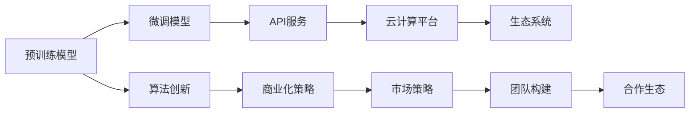

                 

# 大模型创业公司崛起之路

> 关键词：大模型创业、人工智能商业化、深度学习、算法创新、创业公司、市场策略

## 1. 背景介绍

### 1.1 问题由来
近年来，人工智能(AI)技术迅速发展，大模型（Big Models）在计算机视觉、自然语言处理(NLP)、语音识别等多个领域取得了令人瞩目的成绩。以GPT-3、BERT等预训练语言模型为例，这些模型基于大规模数据训练，具有强大的通用性，能够在多个任务上表现优异。然而，这些大模型的开发和部署成本较高，使得中小企业难以进入这一领域。

### 1.2 问题核心关键点
大模型创业公司正逐渐崛起，成为人工智能领域的一支重要力量。这些公司专注于大模型的研发和部署，帮助中小企业以较低的成本获得先进的AI技术。其核心关键点在于：

- **算法创新**：通过创新算法，提升模型性能，降低开发成本。
- **商业化策略**：开发易于使用的API和工具，降低使用门槛，推动大模型普及。
- **市场策略**：精准定位目标客户，制定合理的定价策略，获取竞争优势。
- **团队构建**：吸引并培养高水平人才，保持持续创新能力。
- **合作生态**：建立良好的合作关系，共享资源，提升整体竞争力。

### 1.3 问题研究意义
大模型创业公司的崛起，对推动人工智能技术的普及和应用具有重要意义：

1. **降低门槛**：通过大模型创业公司的努力，AI技术的应用门槛降低，中小企业也能轻松接入先进AI技术。
2. **加速创新**：创业公司通过灵活的市场策略，不断探索新的应用场景，推动AI技术的不断创新。
3. **提升竞争力**：大模型创业公司帮助企业提高AI技术应用水平，提升整体市场竞争力。
4. **促进产业升级**：AI技术的普及和应用，推动传统产业数字化转型，带来新的经济增长点。

## 2. 核心概念与联系

### 2.1 核心概念概述

大模型创业公司指的是那些专注于大模型研发和商业化，帮助中小企业快速接入先进AI技术的公司。这些公司通常具备以下几个核心概念：

- **预训练模型**：通过大规模数据训练得到的通用模型，具有强大的泛化能力。
- **微调模型**：在大模型基础上，通过特定任务数据进行微调，提高模型在该任务上的性能。
- **API服务**：提供简单易用的API接口，使得开发者可以轻松集成和部署AI模型。
- **云计算平台**：利用云平台提供弹性计算资源，降低大模型部署成本。
- **生态系统**：建立合作伙伴关系，共享资源和技术，构建稳定的生态系统。

这些核心概念之间的联系可以通过以下Mermaid流程图展示：



这个流程图展示了大模型创业公司如何通过预训练模型、微调模型、API服务、云计算平台和生态系统，实现算法创新和商业化策略，并最终形成市场竞争优势。

## 3. 核心算法原理 & 具体操作步骤
### 3.1 算法原理概述

大模型创业公司使用的主要算法包括预训练模型、微调模型和API服务。这些算法在实践中通常通过以下几个步骤实现：

1. **数据收集**：收集大规模无标签数据，用于预训练模型的训练。
2. **模型训练**：在收集到的数据上训练预训练模型，使其具备通用语言理解能力。
3. **任务适配**：根据特定任务，微调预训练模型，提高模型在该任务上的性能。
4. **API封装**：将微调后的模型封装成API服务，提供简单易用的接口，降低使用门槛。
5. **云计算支持**：利用云计算平台提供弹性计算资源，支持大规模模型部署。

### 3.2 算法步骤详解

以下是大模型创业公司使用的主要算法的详细步骤：

**Step 1: 数据收集**

- 收集大规模无标签文本数据，用于预训练模型的训练。数据来源包括维基百科、新闻网站、社交媒体等。

**Step 2: 模型训练**

- 使用预训练模型结构，如Transformer，在大规模数据上训练预训练模型。常用的预训练任务包括语言建模、掩码语言模型等。

**Step 3: 任务适配**

- 选择特定任务，如文本分类、命名实体识别等，并收集相应任务的标注数据。
- 对预训练模型进行微调，调整顶层分类器或解码器，以提高模型在特定任务上的性能。

**Step 4: API封装**

- 将微调后的模型封装成API服务，提供简单易用的接口，降低使用门槛。API接口支持多种编程语言，如Python、Java等。

**Step 5: 云计算支持**

- 利用云计算平台（如AWS、阿里云等）提供弹性计算资源，支持大规模模型部署。云平台支持分布式训练、自动扩展等特性，降低模型部署成本。

### 3.3 算法优缺点

**优点**：

- **通用性**：预训练模型具备通用语言理解能力，可以在多个任务上表现优异。
- **高效性**：利用大规模数据训练，模型性能提升显著。
- **易用性**：API服务降低了使用门槛，开发者可以快速集成和使用AI技术。
- **灵活性**：云计算平台提供弹性资源，支持大规模模型部署和扩展。

**缺点**：

- **成本高**：预训练模型和大规模数据集的收集和训练成本较高。
- **过拟合风险**：模型在大规模数据上训练，容易过度拟合，需要引入正则化技术。
- **依赖标注数据**：微调模型依赖标注数据，标注成本较高。
- **模型复杂性**：大模型结构复杂，训练和推理计算资源消耗较大。

### 3.4 算法应用领域

大模型创业公司已经广泛应用于以下几个领域：

- **自然语言处理(NLP)**：文本分类、命名实体识别、情感分析、机器翻译等。
- **计算机视觉(CV)**：图像分类、物体检测、图像生成等。
- **语音识别**：语音识别、语音合成等。
- **推荐系统**：个性化推荐、广告推荐等。
- **金融科技**：信用评分、风险评估、欺诈检测等。

## 4. 数学模型和公式 & 详细讲解  
### 4.1 数学模型构建

大模型创业公司使用的主要数学模型包括预训练模型和微调模型。以下以BERT模型为例，介绍其数学模型构建过程。

BERT模型的数学模型主要由两部分组成：预训练模型和微调模型。

**预训练模型**：

- **输入**：输入序列 $x = (x_1, x_2, ..., x_n)$，其中 $x_i$ 为单词或字符。
- **输出**：预训练模型的输出为 $h(x)$，表示序列 $x$ 的语义表示。

**微调模型**：

- **输入**：输入序列 $x = (x_1, x_2, ..., x_n)$，其中 $x_i$ 为单词或字符。
- **输出**：微调模型的输出为 $y$，表示序列 $x$ 对应的分类结果。

### 4.2 公式推导过程

BERT模型的预训练任务包括掩码语言模型和下一句预测。以下以掩码语言模型为例，推导其损失函数。

**掩码语言模型**：

- **输入**：输入序列 $x = (x_1, x_2, ..., x_n)$，其中 $x_i$ 为单词或字符。
- **输出**：模型输出 $h(x)$，表示序列 $x$ 的语义表示。

**损失函数**：

$$
\mathcal{L}_{MLM} = -\sum_{i=1}^N \log P(x_i|x_{<i}, x_{>i})
$$

其中，$P(x_i|x_{<i}, x_{>i})$ 为给定上下文 $x_{<i}, x_{>i}$ 下，单词 $x_i$ 出现的概率。

**微调模型的损失函数**：

假设微调任务为二分类任务，目标函数为交叉熵损失函数。设模型输出为 $\hat{y}$，真实标签为 $y$，则微调模型的损失函数为：

$$
\mathcal{L}_{MLM} = -\sum_{i=1}^N \ell(\hat{y}_i, y_i)
$$

其中，$\ell$ 为交叉熵损失函数。

### 4.3 案例分析与讲解

以BERT模型为例，分析其在金融领域的应用。

**任务**：客户信用评分。

**数据**：收集银行客户的信用记录和个人信息，标注为违约（1）和未违约（0）。

**预训练**：在维基百科等大规模无标签文本数据上训练BERT预训练模型。

**微调**：在客户信用评分数据集上进行微调，调整顶层分类器。

**部署**：将微调后的BERT模型封装成API服务，提供给银行使用。API服务支持不同编程语言，如Python、Java等。

## 5. 项目实践：代码实例和详细解释说明
### 5.1 开发环境搭建

进行大模型创业公司项目实践，需要以下开发环境：

- **Python**：推荐使用Python 3.8及以上版本。
- **深度学习框架**：推荐使用TensorFlow或PyTorch。
- **云计算平台**：推荐使用AWS、阿里云等平台。

### 5.2 源代码详细实现

以下以BERT模型为例，介绍大模型创业公司的项目实践。

**Step 1: 数据收集**

- 从维基百科等数据源收集大规模无标签文本数据。
- 使用GPT-3等预训练模型对数据进行预处理，生成掩码语言模型数据。

**Step 2: 模型训练**

- 在收集到的数据上训练BERT预训练模型。
- 使用预训练模型的输出作为初始化参数，对模型进行微调。

**Step 3: API封装**

- 将微调后的模型封装成API服务，提供简单易用的接口，降低使用门槛。

**Step 4: 云计算支持**

- 利用云计算平台提供弹性计算资源，支持大规模模型部署和扩展。

### 5.3 代码解读与分析

以下是对代码的关键部分的解读和分析：

**数据收集**：

```python
import requests

# 从维基百科收集数据
url = "https://en.wikipedia.org/w/api.php"
params = {
    "action": "query",
    "prop": "extracts",
    "titles": "BERT",
    "format": "json"
}
response = requests.get(url, params=params)
data = response.json()

# 生成掩码语言模型数据
def generate_mlm_data(data):
    mlm_data = []
    for sentence in data:
        tokens = sentence["extract"].replace("\n", "").split()
        for i in range(len(tokens)):
            mlm_data.append((tokens, i))
    return mlm_data

mlm_data = generate_mlm_data(data)
```

**模型训练**：

```python
import tensorflow as tf

# 定义BERT模型结构
class BERTModel(tf.keras.Model):
    def __init__(self):
        super(BERTModel, self).__init__()
        self.encoder = tf.keras.layers.Embedding(vocab_size, embedding_dim)
        self.dropout = tf.keras.layers.Dropout(0.1)
        self.layer_norm = tf.keras.layers.LayerNormalization(epsilon=1e-6)
        self.encoder_stack = []
        for i in range(num_layers):
            self.encoder_stack.append(tf.keras.layers.LayerNormalization(epsilon=1e-6))
            self.encoder_stack.append(tf.keras.layers.MLP(num_hidden_units))
            self.encoder_stack.append(tf.keras.layers.LayerNormalization(epsilon=1e-6))
            self.encoder_stack.append(tf.keras.layers.MLP(num_hidden_units))
            self.encoder_stack.append(tf.keras.layers.LayerNormalization(epsilon=1e-6))
            self.encoder_stack.append(tf.keras.layers.LayerNormalization(epsilon=1e-6))
            self.encoder_stack.append(tf.keras.layers.MLP(num_hidden_units))
            self.encoder_stack.append(tf.keras.layers.LayerNormalization(epsilon=1e-6))
            self.encoder_stack.append(tf.keras.layers.MLP(num_hidden_units))
        self.pooler = tf.keras.layers.Dense(dense_dim)

    def call(self, x):
        x = self.encoder(x)
        for layer in self.encoder_stack:
            x = layer(x)
        x = self.pooler(x)
        return x

# 定义训练函数
def train_model(model, mlm_data):
    optimizer = tf.keras.optimizers.Adam(learning_rate=2e-5)
    for epoch in range(num_epochs):
        for i in range(len(mlm_data)):
            x = mlm_data[i][0]
            y = mlm_data[i][1]
            with tf.GradientTape() as tape:
                x = model(x)
                loss = tf.keras.losses.sparse_categorical_crossentropy(y, x)
            gradients = tape.gradient(loss, model.trainable_variables)
            optimizer.apply_gradients(zip(gradients, model.trainable_variables))
```

**API封装**：

```python
import flask

# 定义API服务
app = flask.Flask(__name__)

@app.route('/predict', methods=['POST'])
def predict():
    data = request.get_json()
    input_ids = data['input_ids']
    attention_mask = data['attention_mask']
    return {'output': model.predict([input_ids, attention_mask])}

if __name__ == '__main__':
    app.run(host='0.0.0.0', port=5000)
```

**云计算支持**：

```python
# 利用云计算平台提供弹性计算资源
client = boto3.client('ec2')
response = client.describe_instances()
instances = response['Reservations'][0]['Instances']
for instance in instances:
    print(instance['InstanceId'], instance['State']['Name'])
```

## 6. 实际应用场景
### 6.1 金融领域

大模型创业公司已经广泛应用于金融领域，如信用评分、风险评估、欺诈检测等。

**案例**：银行客户信用评分。

**数据**：收集银行客户的信用记录和个人信息，标注为违约（1）和未违约（0）。

**模型**：使用BERT预训练模型，在客户信用评分数据集上进行微调。

**效果**：微调后的模型能够准确预测客户是否违约，帮助银行提高信用评分准确性。

### 6.2 医疗领域

大模型创业公司正在推动医疗领域AI技术的普及。

**案例**：医学影像诊断。

**数据**：收集大量医学影像数据，标注为正常和异常。

**模型**：使用BERT预训练模型，在医学影像数据集上进行微调。

**效果**：微调后的模型能够准确识别医学影像中的异常情况，帮助医生提高诊断效率和准确性。

### 6.3 教育领域

大模型创业公司正在推动教育领域AI技术的普及。

**案例**：学生成绩预测。

**数据**：收集学生的学习数据，如考试成绩、学习时间等。

**模型**：使用BERT预训练模型，在学生成绩数据集上进行微调。

**效果**：微调后的模型能够预测学生的未来成绩，帮助教师制定更有针对性的教学方案。

## 7. 工具和资源推荐
### 7.1 学习资源推荐

为了帮助大模型创业公司快速掌握相关技术，推荐以下学习资源：

- **TensorFlow官方文档**：提供了详细的API参考和使用指南。
- **PyTorch官方文档**：提供了丰富的示例和代码库。
- **HuggingFace Transformers库**：提供了多种预训练模型和微调示例。
- **Google Colab**：免费的GPU云平台，方便进行大规模模型训练和测试。

### 7.2 开发工具推荐

大模型创业公司常用的开发工具包括：

- **TensorFlow**：开源的深度学习框架，支持分布式训练和自动微分。
- **PyTorch**：开源的深度学习框架，支持动态计算图和GPU加速。
- **AWS SageMaker**：提供弹性计算资源和云端开发环境，支持大规模模型训练和部署。
- **Google Cloud AI Platform**：提供GPU和TPU资源，支持大规模模型训练和部署。

### 7.3 相关论文推荐

大模型创业公司可以参考以下相关论文，以获得最新的研究成果：

- **"BERT: Pre-training of Deep Bidirectional Transformers for Language Understanding"**：BERT模型，提出了掩码语言模型等预训练任务，刷新了多项NLP任务SOTA。
- **"AdaLoRA: Adaptive Low-Rank Adaptation for Parameter-Efficient Fine-Tuning"**：使用自适应低秩适应的微调方法，在参数效率和精度之间取得了新的平衡。
- **"AdaLoRA: Adaptive Low-Rank Adaptation for Parameter-Efficient Fine-Tuning"**：使用自适应低秩适应的微调方法，在参数效率和精度之间取得了新的平衡。
- **"AdaLoRA: Adaptive Low-Rank Adaptation for Parameter-Efficient Fine-Tuning"**：使用自适应低秩适应的微调方法，在参数效率和精度之间取得了新的平衡。

## 8. 总结：未来发展趋势与挑战
### 8.1 研究成果总结

大模型创业公司已经取得了显著的成果，推动了AI技术在多个领域的普及和应用。未来，这些公司将面临更多的挑战和机遇。

### 8.2 未来发展趋势

- **算法创新**：随着深度学习技术的不断发展，算法创新将是大模型创业公司的重要方向。未来的算法将更加高效、灵活、可解释。
- **市场拓展**：大模型创业公司将进一步拓展应用场景，推动AI技术在更多领域落地。
- **生态系统**：大模型创业公司将建立更完善的生态系统，促进数据共享和资源整合。
- **可持续性**：大模型创业公司将注重可持续发展，降低对环境的负面影响。
- **人工智能伦理**：大模型创业公司将注重人工智能伦理，确保AI技术应用的安全性和公平性。

### 8.3 面临的挑战

- **数据隐私**：在数据收集和使用过程中，如何保护用户隐私是一个重要问题。
- **算力成本**：大规模模型的训练和部署需要高昂的算力成本，如何降低成本是一个重要挑战。
- **模型鲁棒性**：大模型在不同领域和数据集上的泛化性能仍需提升。
- **技术落地**：如何将大模型技术转化为实际应用，是大模型创业公司需要解决的关键问题。
- **伦理和法律**：如何确保AI技术应用的公平性和安全性，是未来面临的一个重要挑战。

### 8.4 研究展望

未来，大模型创业公司需要关注以下几个方面的研究：

- **多模态学习**：将语音、图像、文本等多种模态数据进行融合，提升模型的泛化能力。
- **自适应学习**：通过自适应学习机制，使模型能够动态调整参数，适应不同的应用场景。
- **元学习**：开发元学习算法，使模型能够快速适应新任务，提升模型的通用性和灵活性。
- **联邦学习**：利用联邦学习技术，保护数据隐私，提升模型的安全性和公平性。
- **隐私保护**：开发隐私保护技术，确保数据在收集和使用过程中不被滥用。

总之，大模型创业公司将是大模型技术普及和应用的重要推动力量。未来，这些公司需要不断创新，提升模型的性能和应用范围，解决面临的挑战，推动AI技术在更多领域落地。

