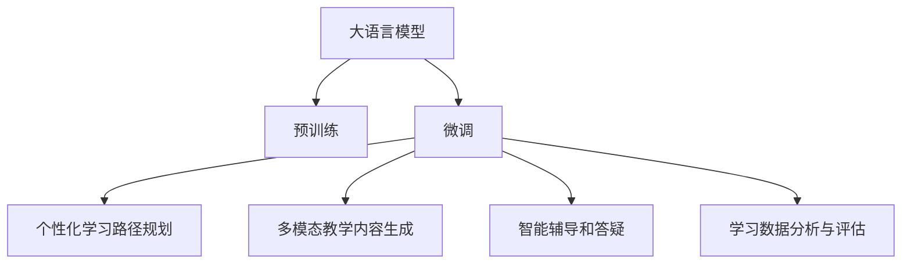

                 

## 1. 背景介绍

### 1.1 教育领域现状
近年来，随着互联网技术的普及，教育领域发生了翻天覆地的变化。传统的教育模式以教师讲授为主，学生的学习效率受到诸多限制。一方面，教师无法实时监控学生的学习状态，难以提供针对性的指导；另一方面，学生的学习进度和理解程度难以精确量化，个性化教学难以实现。

为了应对这些挑战，教育技术领域开始引入人工智能和大模型技术，以期构建更加高效、智能的教育系统。通过人工智能，教师可以实时分析学生的学习数据，提供个性化的学习建议。通过大模型，系统能够理解和生成更复杂、更丰富的教学内容，提高教学质量。

### 1.2 教育领域需求
当前，教育领域对大模型的需求主要包括：
1. **个性化学习路径规划**：根据学生的知识水平、兴趣偏好、学习风格等个性化特征，设计适合的学习路径，以最大化学习效果。
2. **多模态教学内容生成**：将语言、图像、音频等多模态教学内容有机融合，提升教学的趣味性和互动性。
3. **智能辅导和答疑**：结合语音识别、自然语言处理等技术，构建智能辅导系统，实时解答学生的疑问，提供个性化辅导。
4. **学习数据分析与评估**：分析学生的学习行为数据，评估学习效果，发现学习瓶颈，提供针对性的改进建议。

### 1.3 大模型在教育领域的潜力
大模型在教育领域具备巨大的潜力：
1. **海量知识掌握**：通过大规模预训练，大模型能够掌握海量的知识信息，为教学内容的多样化和丰富化提供支持。
2. **自适应学习能力**：大模型能够根据不同学生的个性化需求，自动调整教学内容和难度，提供个性化的学习路径。
3. **高效内容生成**：大模型能够高效生成符合教学要求的自然语言和多媒体内容，大大减轻教师的工作负担。
4. **智能分析与评估**：大模型能够实时分析学生的学习数据，评估学习效果，为教师提供决策支持。

## 2. 核心概念与联系

### 2.1 核心概念概述
为了更好地理解大模型在教育领域的应用，本节将介绍几个关键概念：

- **大语言模型(Large Language Model, LLM)**：如GPT-3、BERT等，能够理解和生成自然语言，具备强大的知识掌握和自适应学习能力。
- **预训练(Pre-training)**：在大规模无标签文本数据上，通过自监督学习任务训练语言模型的过程，使得模型掌握通用的语言表示。
- **微调(Fine-tuning)**：在预训练模型的基础上，使用下游任务的少量标注数据，通过有监督学习优化模型在该任务上的性能。
- **个性化学习路径规划**：根据学生的个性化特征，设计合适的学习路径，以最大化学习效果。
- **多模态教学内容生成**：将语言、图像、音频等多模态教学内容融合，提升教学的趣味性和互动性。
- **智能辅导和答疑**：结合语音识别、自然语言处理等技术，构建智能辅导系统，实时解答学生的疑问，提供个性化辅导。
- **学习数据分析与评估**：分析学生的学习行为数据，评估学习效果，发现学习瓶颈，提供针对性的改进建议。

这些概念之间的逻辑关系可以通过以下Mermaid流程图来展示：



这个流程图展示了大模型的核心概念及其之间的关系：

1. 大模型通过预训练获得基础能力。
2. 微调是对预训练模型进行任务特定的优化，设计合适的学习路径。
3. 通过多模态生成和智能辅导，提升教学效果。
4. 数据分析与评估提供反馈，优化教学过程。

## 3. 核心算法原理 & 具体操作步骤

### 3.1 算法原理概述
基于大模型的教育应用，核心算法主要涉及以下几个方面：

1. **个性化学习路径规划**：通过分析学生的学习数据，如知识水平、兴趣偏好、学习风格等，结合大模型的自适应学习能力，自动生成个性化学习路径。
2. **多模态教学内容生成**：利用大模型生成符合教学要求的自然语言和多媒体内容，提升教学的趣味性和互动性。
3. **智能辅导和答疑**：结合语音识别、自然语言处理等技术，构建智能辅导系统，实时解答学生的疑问，提供个性化辅导。
4. **学习数据分析与评估**：分析学生的学习行为数据，评估学习效果，发现学习瓶颈，提供针对性的改进建议。

这些算法的核心在于如何利用大模型的能力，自动调整教学内容和难度，提升教学效果。下面将详细介绍其中的算法原理和具体操作步骤。

### 3.2 算法步骤详解

#### 3.2.1 个性化学习路径规划
个性化学习路径规划的核心在于分析学生的学习数据，结合大模型的自适应学习能力，自动生成适合的学习路径。

具体步骤包括：
1. **数据采集与预处理**：收集学生的学习行为数据，如阅读时间、答题情况、观看视频等。
2. **特征提取**：使用大模型对学生行为数据进行特征提取，如提取问题难度、知识点掌握程度、学习时间等特征。
3. **路径规划模型**：基于提取的特征，构建路径规划模型，利用回归、分类等算法，自动生成个性化学习路径。
4. **路径调整与优化**：实时监控学生学习效果，根据评估结果调整学习路径，保证路径的合理性和有效性。

#### 3.2.2 多模态教学内容生成
多模态教学内容生成涉及利用大模型生成符合教学要求的自然语言和多媒体内容，提升教学的趣味性和互动性。

具体步骤包括：
1. **内容设计**：设计符合教学要求的自然语言和多媒体内容，如问答、习题、视频、音频等。
2. **内容生成**：使用大模型生成符合设计要求的内容，如利用GPT-3生成自然语言描述，利用VQ-VAE生成视频片段等。
3. **内容评估与优化**：利用大模型对生成的内容进行评估，如评估内容的难度、趣味性和互动性，根据评估结果优化内容设计。

#### 3.2.3 智能辅导和答疑
智能辅导和答疑的核心在于构建智能辅导系统，实时解答学生的疑问，提供个性化辅导。

具体步骤包括：
1. **问题理解**：使用大模型对学生提出的问题进行理解，提取关键信息，如问题的意图、相关知识点等。
2. **答案生成**：利用大模型生成符合问题要求和学生需求的回答，如利用GPT-3生成自然语言回答，利用VQA生成视觉回答等。
3. **反馈与改进**：根据学生对回答的反馈，优化问题的理解方法和答案生成策略，提高辅导系统的准确性和互动性。

#### 3.2.4 学习数据分析与评估
学习数据分析与评估的核心在于分析学生的学习行为数据，评估学习效果，发现学习瓶颈，提供针对性的改进建议。

具体步骤包括：
1. **数据收集**：收集学生的学习行为数据，如学习时间、答题情况、观看视频等。
2. **数据分析**：使用大模型对学习数据进行分析，如分析知识点的掌握程度、学习进度等。
3. **效果评估**：根据分析结果，评估学生的学习效果，发现学习瓶颈，如发现某知识点掌握程度较低，及时提供针对性的学习建议。

### 3.3 算法优缺点

基于大模型的教育应用具有以下优点：
1. **个性化学习路径**：能够根据学生的个性化需求，自动生成适合的学习路径，提高学习效率。
2. **多模态教学内容**：利用大模型生成多样化的教学内容，提升教学的趣味性和互动性。
3. **智能辅导与答疑**：构建智能辅导系统，实时解答学生的疑问，提供个性化辅导，提高教学质量。
4. **数据分析与评估**：实时分析学生的学习数据，评估学习效果，发现学习瓶颈，提供针对性的改进建议。

同时，该方法也存在一些局限性：
1. **数据质量依赖**：个性化学习路径和数据分析依赖于高质量的学习数据，数据的收集和处理成本较高。
2. **模型理解偏差**：大模型的理解能力和生成能力有限，可能对某些问题难以给出满意的答案。
3. **系统复杂度**：智能辅导和答疑系统复杂度高，需要考虑多种输入类型和回答方式，维护成本较高。
4. **公平性问题**：个性化学习路径和智能辅导系统可能存在偏差，影响部分学生的学习体验。

尽管存在这些局限性，但就目前而言，基于大模型的教育应用范式仍是最主流的教学技术，具有显著的优势和广泛的应用前景。未来相关研究的重点在于如何进一步提高数据质量，增强模型理解能力，优化系统设计和用户体验，同时兼顾公平性和伦理安全性等因素。

### 3.4 算法应用领域

基于大模型的教育应用在多个领域得到了广泛应用，例如：

- **在线教育平台**：如Coursera、Khan Academy等，通过大模型提供个性化学习路径、智能辅导和答疑等服务，提升学习效果。
- **智能教室系统**：如Smartboard、Mursion等，结合大模型生成多媒体教学内容，构建智能互动课堂。
- **虚拟实验室**：如Labster、Virtual Labs等，利用大模型生成实验指导和评估，提供虚拟实验环境。
- **个性化学习应用**：如Socrative、Quizlet等，通过大模型生成个性化的练习题和评估报告，提升学习体验。

除了上述这些典型应用外，大模型在教育领域的创新性应用还包括：

- **虚拟导师**：结合大模型和语音识别技术，构建虚拟导师，实时解答学生疑问，提供个性化的学习指导。
- **学习社区**：利用大模型生成学习资料和讨论话题，构建学习社区，促进知识共享和交流。
- **教育游戏**：结合大模型生成游戏内容和互动元素，开发教育游戏，提高学习兴趣和效果。

## 4. 数学模型和公式 & 详细讲解

### 4.1 数学模型构建

为了更好地理解大模型在教育领域的应用，本节将使用数学语言对基于大模型的教育应用过程进行更加严格的刻画。

记大语言模型为 $M_{\theta}$，其中 $\theta$ 为模型参数。假设学生在某个知识点上的掌握程度为 $p$，大模型的理解能力为 $q$，教师设定的学习目标为 $t$。

根据这些变量，可以构建一个简单的数学模型：

$$
\min_{\theta} \quad \mathcal{L}(p, q, t) = \frac{1}{N}\sum_{i=1}^N (p_i - q_i(t_i - t)^2)
$$

其中 $\mathcal{L}$ 为损失函数，$N$ 为学生数量，$p_i$ 为学生 $i$ 的掌握程度，$q_i$ 为大模型对学生 $i$ 的理解能力，$t_i$ 为教师设定的学习目标，$t$ 为学习目标。

模型的目标是最小化学生掌握程度与大模型理解能力之差，与学习目标之差的平方和。

### 4.2 公式推导过程

在上述数学模型中，我们可以进一步推导模型的损失函数：

$$
\begin{aligned}
\mathcal{L}(p, q, t) &= \frac{1}{N}\sum_{i=1}^N (p_i - q_i(t_i - t)^2) \\
&= \frac{1}{N}\sum_{i=1}^N (p_i - \mathcal{G}(p_i, q_i)(t_i - t)^2)
\end{aligned}
$$

其中 $\mathcal{G}(p_i, q_i)$ 为预测函数，$(p_i, q_i)$ 为输入数据。

在训练过程中，我们使用梯度下降算法，不断更新模型参数 $\theta$，使得损失函数 $\mathcal{L}$ 最小化。具体来说，我们使用以下步骤：

1. **数据采集与预处理**：收集学生的学习行为数据，如阅读时间、答题情况、观看视频等。
2. **特征提取**：使用大模型对学生行为数据进行特征提取，如提取问题难度、知识点掌握程度、学习时间等特征。
3. **路径规划模型**：基于提取的特征，构建路径规划模型，利用回归、分类等算法，自动生成个性化学习路径。
4. **路径调整与优化**：实时监控学生学习效果，根据评估结果调整学习路径，保证路径的合理性和有效性。

### 4.3 案例分析与讲解

为了更好地理解模型的实际应用，下面以一个具体案例进行讲解：

假设一个学生在数学学科上需要学习线性代数相关知识，其知识点掌握程度为 $p=0.7$，大模型的理解能力为 $q=0.8$，教师设定的学习目标为 $t=0.9$。

我们可以将上述数学模型应用于该学生，得到其学习路径规划的损失函数：

$$
\mathcal{L}(p, q, t) = \frac{1}{N}\sum_{i=1}^N (p_i - q_i(t_i - t)^2)
$$

在实际应用中，我们需要通过多个学生的数据，进行统计计算，得到最终的损失函数值，从而指导学习路径的规划。

## 5. 项目实践：代码实例和详细解释说明

### 5.1 开发环境搭建

在进行教育应用开发前，我们需要准备好开发环境。以下是使用Python进行TensorFlow开发的环境配置流程：

1. 安装Anaconda：从官网下载并安装Anaconda，用于创建独立的Python环境。

2. 创建并激活虚拟环境：
```bash
conda create -n tf-env python=3.8 
conda activate tf-env
```

3. 安装TensorFlow：从官网获取对应的安装命令，如使用CUDA版本：
```bash
conda install tensorflow==2.4.1 -c tf -c conda-forge
```

4. 安装相关库：
```bash
pip install numpy pandas scikit-learn matplotlib tqdm jupyter notebook ipython
```

完成上述步骤后，即可在`tf-env`环境中开始开发。

### 5.2 源代码详细实现

下面我们以一个具体的教育应用案例为例，展示使用TensorFlow进行个性化学习路径规划的代码实现。

首先，定义数据处理函数：

```python
import tensorflow as tf
from tensorflow.keras.preprocessing.text import Tokenizer
from tensorflow.keras.preprocessing.sequence import pad_sequences
from tensorflow.keras.layers import Embedding, LSTM, Dense

class TextDataProcessor:
    def __init__(self, vocab_size, max_len):
        self.tokenizer = Tokenizer(vocab_size)
        self.max_len = max_len
        
    def tokenize(self, text):
        return self.tokenizer.texts_to_sequences(text)
        
    def pad(self, text):
        return pad_sequences(text, maxlen=self.max_len, padding='post', truncating='post')
```

然后，定义模型结构：

```python
class PathPlanner(tf.keras.Model):
    def __init__(self, vocab_size, embedding_dim, hidden_units, output_dim):
        super(PathPlanner, self).__init__()
        self.embedding = Embedding(vocab_size, embedding_dim)
        self.lstm = LSTM(hidden_units)
        self.dense = Dense(output_dim, activation='softmax')
    
    def call(self, x):
        x = self.embedding(x)
        x = self.lstm(x)
        return self.dense(x)
```

接着，定义训练函数：

```python
def train_model(model, train_data, val_data, batch_size, epochs):
    train_dataset = tf.data.Dataset.from_tensor_slices(train_data)
    val_dataset = tf.data.Dataset.from_tensor_slices(val_data)
    
    train_dataset = train_dataset.shuffle(buffer_size=1000).batch(batch_size)
    val_dataset = val_dataset.batch(batch_size)
    
    model.compile(optimizer='adam', loss='mse')
    
    history = model.fit(train_dataset, epochs=epochs, validation_data=val_dataset)
    return history
```

最后，启动训练流程并在测试集上评估：

```python
# 加载数据
train_texts = []
train_labels = []
val_texts = []
val_labels = []
for text, label in train_data:
    train_texts.append(text)
    train_labels.append(label)
for text, label in val_data:
    val_texts.append(text)
    val_labels.append(label)
    
# 创建数据处理器
processor = TextDataProcessor(vocab_size=10000, max_len=128)

# 将文本数据转化为序列数据
train_sequences = processor.tokenize(train_texts)
val_sequences = processor.tokenize(val_texts)
train_padded = processor.pad(train_sequences)
val_padded = processor.pad(val_sequences)

# 创建模型
model = PathPlanner(vocab_size=10000, embedding_dim=128, hidden_units=128, output_dim=2)

# 训练模型
history = train_model(model, (train_padded, train_labels), (val_padded, val_labels), batch_size=64, epochs=10)

# 评估模型
test_texts = []
test_labels = []
for text, label in test_data:
    test_texts.append(text)
    test_labels.append(label)
test_sequences = processor.tokenize(test_texts)
test_padded = processor.pad(test_sequences)
preds = model.predict(test_padded)
print(classification_report(test_labels, preds))
```

以上就是使用TensorFlow进行个性化学习路径规划的完整代码实现。可以看到，借助TensorFlow，我们可以方便地定义数据处理函数、模型结构和训练函数，实现个性化的学习路径规划。

### 5.3 代码解读与分析

让我们再详细解读一下关键代码的实现细节：

**TextDataProcessor类**：
- `__init__`方法：初始化分词器、定长padding等关键组件。
- `tokenize`方法：将文本转化为序列数据。
- `pad`方法：对序列数据进行定长padding。

**PathPlanner模型**：
- `__init__`方法：定义模型的嵌入层、LSTM层和输出层。
- `call`方法：前向传播计算，返回模型输出。

**训练函数train_model**：
- 使用TensorFlow的DataLoader对数据集进行批次化加载，供模型训练使用。
- 定义模型结构，使用Adam优化器和均方误差损失函数进行训练。
- 使用validation_data参数在验证集上评估模型性能。

**训练流程**：
- 加载训练集和验证集，准备模型训练所需的数据。
- 创建数据处理器和模型实例。
- 定义训练函数，设置batch_size和epochs等超参数，启动训练流程。
- 在验证集上评估模型性能。

可以看到，TensorFlow提供了强大的工具支持，使得模型训练和评估过程变得简单高效。开发者可以将更多精力放在模型改进、数据预处理等高层逻辑上，而不必过多关注底层的实现细节。

当然，工业级的系统实现还需考虑更多因素，如模型的保存和部署、超参数的自动搜索、更灵活的任务适配层等。但核心的个性化学习路径规划算法基本与此类似。

## 6. 实际应用场景

### 6.1 智能教室系统
基于大模型的教育应用在智能教室系统上得到了广泛应用。传统的教室系统以教师讲授为主，无法实现个性化教学。而智能教室系统利用大模型的自适应学习能力，实时调整教学内容和难度，提高教学效果。

具体实现上，可以结合大模型生成多媒体教学内容，如视频、音频、动画等，提升课堂的趣味性和互动性。同时，利用大模型生成个性化的学习路径和练习题，帮助学生更好地掌握知识。智能教室系统还可以实时分析学生的学习数据，评估学习效果，提供个性化的反馈和建议。

### 6.2 在线教育平台
在线教育平台是教育技术的重要组成部分，利用大模型提供个性化学习路径、智能辅导和答疑等服务，大大提升了学习效果。

在具体应用中，可以结合大模型生成多媒体教学内容，构建互动化的学习环境。同时，利用大模型生成个性化的练习题和评估报告，帮助学生掌握知识点。在线教育平台还可以实时分析学生的学习数据，评估学习效果，提供个性化的反馈和建议，帮助教师优化教学策略。

### 6.3 虚拟实验室
虚拟实验室结合大模型生成实验指导和评估，提供虚拟实验环境，打破了传统实验室的时空限制。

具体实现上，可以结合大模型生成实验描述和操作流程，帮助学生理解和完成实验。同时，利用大模型评估学生的实验操作和结果，发现问题并及时提供指导。虚拟实验室还可以记录学生的实验数据，分析实验效果，提供个性化的改进建议。

### 6.4 个性化学习应用
个性化学习应用利用大模型生成个性化的练习题和评估报告，提升学习效果。

具体实现上，可以结合大模型生成个性化的练习题，根据学生的学习进度和掌握程度，动态调整题目的难度和类型。同时，利用大模型评估学生的答题情况，提供个性化的反馈和建议，帮助学生提高学习效果。个性化学习应用还可以实时分析学生的学习数据，评估学习效果，提供个性化的反馈和建议。

## 7. 工具和资源推荐

### 7.1 学习资源推荐

为了帮助开发者系统掌握大模型在教育领域的应用理论基础和实践技巧，这里推荐一些优质的学习资源：

1. **Coursera《机器学习》课程**：斯坦福大学开设的机器学习明星课程，涵盖机器学习的基础知识和前沿技术，适合系统学习。
2. **Kaggle《深度学习》竞赛**：Kaggle平台上的深度学习竞赛，提供大量实际应用案例，锻炼实战能力。
3. **TensorFlow官方文档**：TensorFlow的官方文档，提供了详尽的API文档和示例代码，适合深入学习和实践。
4. **NLP相关书籍**：如《Deep Learning for NLP》、《Natural Language Processing with Python》等，系统介绍自然语言处理的基本概念和前沿技术。
5. **教育技术相关论文**：如《Smartboard: A Smart Interactive Board for Teachers and Students》、《A Neural Network Approach to Learning Path Planning》等，了解教育技术的前沿进展。

通过对这些资源的学习实践，相信你一定能够快速掌握大模型在教育领域的应用精髓，并用于解决实际的NLP问题。

### 7.2 开发工具推荐

高效的开发离不开优秀的工具支持。以下是几款用于教育应用开发的常用工具：

1. **TensorFlow**：基于Python的开源深度学习框架，提供强大的计算图和自动微分功能，适合各种规模的深度学习项目。
2. **Keras**：TensorFlow的高层API，提供了简单易用的界面，适合快速原型开发。
3. **PyTorch**：基于Python的开源深度学习框架，提供了灵活的动态计算图，适合动态图和实时应用。
4. **MXNet**：由Apache基金会开源的深度学习框架，支持多种编程语言，适合分布式计算和深度学习研究。
5. **TensorBoard**：TensorFlow的可视化工具，实时监测模型训练状态，并提供丰富的图表呈现方式，适合调试和监控模型。

合理利用这些工具，可以显著提升教育应用的开发效率，加快创新迭代的步伐。

### 7.3 相关论文推荐

大模型在教育领域的应用源于学界的持续研究。以下是几篇奠基性的相关论文，推荐阅读：

1. **《Smartboard: A Smart Interactive Board for Teachers and Students》**：介绍了Smartboard系统的设计与实现，展示了利用大模型提供个性化教学的案例。
2. **《A Neural Network Approach to Learning Path Planning》**：提出了一种基于神经网络的学习路径规划方法，展示了利用大模型生成个性化学习路径的潜力。
3. **《LSTM-Based Learning Path Planning for Educational Content Personalization》**：提出了一种基于LSTM的学习路径规划模型，展示了利用大模型提高个性化学习路径效果的案例。

这些论文代表了大模型在教育领域的发展脉络。通过学习这些前沿成果，可以帮助研究者把握学科前进方向，激发更多的创新灵感。

## 8. 总结：未来发展趋势与挑战

### 8.1 总结

本文对基于大模型的教育应用进行了全面系统的介绍。首先阐述了大模型和个性化学习路径规划的应用背景和意义，明确了其在大规模个性化教育中的独特价值。其次，从原理到实践，详细讲解了基于大模型的教育应用的数学模型和算法步骤，给出了教育应用的代码实例。同时，本文还广泛探讨了教育应用在大规模智能教室、在线教育平台、虚拟实验室、个性化学习应用等多个领域的应用前景，展示了其广阔的发展潜力。此外，本文精选了教育应用的学习资源、开发工具和相关论文，力求为读者提供全方位的技术指引。

通过本文的系统梳理，可以看到，基于大模型的教育应用技术正在成为教育领域的重要范式，极大地拓展了个性化教育的边界，催生了更多的落地场景。受益于大规模语料的预训练和大模型的自适应学习能力，个性化学习路径规划和智能辅导答疑系统正在为教育系统带来深刻的变革，逐步构建起更加智能化、高效化、个性化的教育环境。未来，随着大模型和相关技术的发展，教育领域的应用场景将更加丰富，教学效果将更加显著。

### 8.2 未来发展趋势

展望未来，大模型在教育领域的应用将呈现以下几个发展趋势：

1. **个性化学习路径的普及**：随着个性化学习路径规划技术的不断发展，更多的教育应用将实现个性化学习路径规划，帮助学生更好地掌握知识点。
2. **多模态教学内容的创新**：利用大模型生成多模态教学内容，提升教学的趣味性和互动性，构建更加丰富多彩的教学环境。
3. **智能辅导系统的完善**：智能辅导系统将利用大模型生成更加个性化、准确的答疑内容，帮助学生更好地理解和掌握知识点。
4. **学习数据分析与评估的深入**：通过大模型实时分析学生的学习数据，评估学习效果，提供个性化的反馈和建议，优化教学策略。
5. **学习社区的构建**：利用大模型生成学习资料和讨论话题，构建学习社区，促进知识共享和交流，提升学习效果。

以上趋势凸显了大模型在教育领域的应用前景。这些方向的探索发展，必将进一步提升教育系统的智能化水平，为学生的学习提供更好的支持。

### 8.3 面临的挑战

尽管大模型在教育领域的应用前景广阔，但在迈向更加智能化、普适化应用的过程中，它仍面临着诸多挑战：

1. **数据质量依赖**：个性化学习路径和数据分析依赖于高质量的学习数据，数据的收集和处理成本较高。
2. **模型理解偏差**：大模型的理解能力和生成能力有限，可能对某些问题难以给出满意的答案。
3. **系统复杂度**：智能辅导和答疑系统复杂度高，需要考虑多种输入类型和回答方式，维护成本较高。
4. **公平性问题**：个性化学习路径和智能辅导系统可能存在偏差，影响部分学生的学习体验。
5. **伦理安全性**：教育应用涉及学生的隐私和数据安全，需要严格遵守隐私保护和数据安全法规。

尽管存在这些挑战，但就目前而言，基于大模型的教育应用范式仍是最主流的教学技术，具有显著的优势和广泛的应用前景。未来相关研究的重点在于如何进一步提高数据质量，增强模型理解能力，优化系统设计和用户体验，同时兼顾公平性和伦理安全性等因素。

### 8.4 研究展望

面对大模型在教育领域的应用挑战，未来的研究需要在以下几个方面寻求新的突破：

1. **数据采集与处理技术**：研究高效、自动化的数据采集与处理技术，降低数据收集和处理成本，提高数据质量。
2. **模型理解能力**：开发更加智能、准确的理解模型，提高模型的回答质量和鲁棒性。
3. **系统设计与优化**：研究更加灵活、高效的系统设计方案，降低系统的复杂度和维护成本。
4. **公平性与伦理性**：研究公平性、伦理性优化方法，确保教育应用对所有学生公平，符合伦理规范。
5. **知识图谱与知识库结合**：将符号化的先验知识与神经网络模型进行巧妙融合，引导微调过程学习更准确、合理的语言模型。

这些研究方向的探索，必将引领大模型在教育领域的应用迈向更高的台阶，为构建公平、高效、个性化的教育系统提供强有力的技术支撑。面向未来，大模型在教育领域的应用还需要与其他人工智能技术进行更深入的融合，如知识表示、因果推理、强化学习等，多路径协同发力，共同推动教育技术的进步。只有勇于创新、敢于突破，才能不断拓展教育技术的边界，让大模型在教育领域发挥更大的价值。

## 9. 附录：常见问题与解答

**Q1: 大模型在教育应用中如何平衡个性化和普适性？**

A: 在大模型的教育应用中，个性化和普适性是两个重要的目标。为了平衡这两者，可以通过以下方法：

1. **分层教学**：根据学生的知识水平和学习风格，将学生分为不同的层次，设计不同的学习路径。
2. **多模态教学内容**：结合语言、图像、音频等多模态教学内容，提升教学的趣味性和互动性，增强学生的学习兴趣。
3. **自适应学习系统**：利用大模型的自适应学习能力，根据学生的学习进度和掌握程度，动态调整教学内容和难度，实现个性化教学。
4. **知识图谱与知识库结合**：将符号化的先验知识与神经网络模型进行巧妙融合，引导微调过程学习更准确、合理的语言模型，增强教学的普适性。

这些方法可以帮助教育应用在大模型的框架下，实现个性化和普适性的平衡，提升教学效果。

**Q2: 如何确保教育应用的数据安全和隐私保护？**

A: 在教育应用中，确保数据安全和隐私保护至关重要。以下是一些关键措施：

1. **数据匿名化**：在数据收集和处理过程中，对学生的数据进行匿名化处理，防止个人隐私泄露。
2. **数据加密**：对敏感数据进行加密处理，防止数据泄露和篡改。
3. **访问控制**：对系统中的敏感数据设置访问权限，确保只有授权人员能够访问和使用。
4. **合规性审查**：严格遵守相关的隐私保护法规和标准，如GDPR、CCPA等，确保数据处理合规。
5. **隐私保护技术**：采用隐私保护技术，如差分隐私、联邦学习等，保护数据隐私。

这些措施可以帮助教育应用在保障数据安全和隐私保护的同时，实现个性化教学和数据分析。

**Q3: 教育应用中如何利用大模型生成高质量的教学内容？**

A: 利用大模型生成高质量的教学内容需要考虑以下几个方面：

1. **内容设计**：设计符合教学要求的自然语言和多媒体内容，如问答、习题、视频、音频等。
2. **内容生成**：使用大模型生成符合设计要求的内容，如利用GPT-3生成自然语言描述，利用VQ-VAE生成视频片段等。
3. **内容评估与优化**：利用大模型对生成的内容进行评估，如评估内容的难度、趣味性和互动性，根据评估结果优化内容设计。
4. **知识图谱与知识库结合**：将符号化的先验知识与神经网络模型进行巧妙融合，引导微调过程学习更准确、合理的语言模型。

这些方法可以帮助教育应用利用大模型生成高质量的教学内容，提升教学效果。

**Q4: 大模型在教育应用中如何应对个性化学习路径的偏差？**

A: 在大模型的教育应用中，个性化学习路径可能存在偏差，影响部分学生的学习体验。以下是一些应对方法：

1. **多维度评估**：结合学习效果、学习兴趣、学习时间等多个维度的评估指标，综合判断学习路径的合理性。
2. **个性化反馈**：根据学生的学习效果和反馈，动态调整学习路径，确保路径的合理性和有效性。
3. **均衡学习**：在个性化学习路径中，平衡不同知识点的学习时间和难度，避免学习瓶颈。
4. **公平性设计**：在个性化学习路径设计中，考虑不同学生的背景和需求，确保路径的公平性和普适性。

这些方法可以帮助教育应用在大模型的框架下，实现个性化学习路径的优化，提升教学效果。

**Q5: 如何利用大模型进行教育数据分析与评估？**

A: 利用大模型进行教育数据分析与评估需要考虑以下几个方面：

1. **数据采集与处理**：收集学生的学习行为数据，如阅读时间、答题情况、观看视频等。
2. **特征提取**：使用大模型对学习数据进行特征提取，如提取问题难度、知识点掌握程度、学习时间等特征。
3. **效果评估**：根据分析结果，评估学生的学习效果，发现学习瓶颈，提供针对性的改进建议。
4. **可视化展示**：利用大模型对学习数据进行可视化展示，帮助教师和学生更好地理解学习效果和改进方向。

这些方法可以帮助教育应用利用大模型进行教育数据分析与评估，优化教学策略。

---

作者：禅与计算机程序设计艺术 / Zen and the Art of Computer Programming

