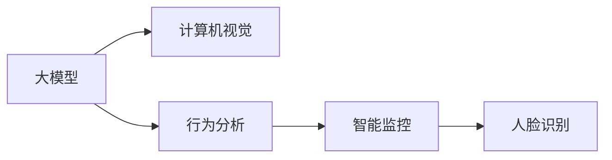

                 

# 大模型在智能安防中的落地案例

> 关键词：智能安防,大模型,计算机视觉,深度学习,人脸识别,行为分析,智能监控,人工智能,自动化,自动化决策

## 1. 背景介绍

### 1.1 问题由来

随着智能安防行业的发展，传统的基于规则和人工监控的手段已经无法满足日益增长的安全和便利性需求。人工智能，尤其是深度学习技术，为安防行业带来了新的解决方案。大模型通过大规模预训练，在各类计算机视觉和自然语言处理任务上取得了显著的成果。

大模型在安防领域的应用，可以大幅提高监控系统的智能化水平。如通过人脸识别技术，实现自动化的人员身份验证，快速定位异常行为，保障安全监控的实时性和准确性。通过行为分析技术，实时识别异常行为并触发报警，从而提升安全监控的响应速度和效率。

### 1.2 问题核心关键点

当前，基于大模型的智能安防解决方案在技术上取得了一定的进展，但仍面临一些挑战：

- **数据稀缺**：安防领域的数据集往往具有高标注成本，且数据量相对较少。
- **算法复杂性**：大模型虽然精度高，但训练和推理的计算资源要求较高，部署难度较大。
- **实时性要求**：安防系统通常对实时性有较高的要求，如何平衡精度和实时性是关键。
- **安全性保障**：安防系统对数据隐私和模型安全有严格的保密要求，如何确保模型的可信性和合规性，也是重要问题。

## 2. 核心概念与联系

### 2.1 核心概念概述

为更好地理解大模型在安防中的落地应用，我们需先介绍几个关键概念：

- **大模型(大语言模型Big Model, BML)**：以深度神经网络为基础，通过大规模无标签数据预训练，具备强大的特征提取和任务泛化能力。常见的预训练模型包括BERT、GPT、ViT等。

- **计算机视觉(Computer Vision, CV)**：研究如何让计算机“看”、“听”、“理解”现实世界图像、视频数据的学科。

- **行为分析(Behavioral Analysis)**：通过计算机视觉技术，对监控视频中的动态数据进行分析，识别异常行为并做出响应。

- **深度学习(Deep Learning, DL)**：一类基于神经网络的机器学习算法，可以自动提取数据特征并进行复杂模式识别。

- **人脸识别(Face Recognition)**：利用深度学习模型，对监控视频中的面部图像进行特征提取和比对，实现自动化身份验证。

- **智能监控(Smart Surveillance)**：将计算机视觉、自然语言处理、人工智能等技术融入监控系统，实现更智能化和自动化的安防决策。

这些概念之间的逻辑关系可以通过以下Mermaid流程图来展示：



这个流程图展示了大模型在安防领域的应用路径：

1. 大模型通过大规模数据预训练，获取通用的视觉和语言理解能力。
2. 计算机视觉技术使用大模型提取图像和视频中的关键特征。
3. 行为分析技术对提取的特征进行分析，识别异常行为。
4. 智能监控系统综合利用视觉、语言处理结果，实现自动化决策。

## 3. 核心算法原理 & 具体操作步骤

### 3.1 算法原理概述

基于大模型的智能安防解决方案，核心在于将预训练模型作为特征提取器，结合行为分析和计算机视觉技术，实现对监控视频数据的实时分析和自动化决策。具体来说，包括以下几个关键步骤：

1. **数据预处理**：对监控视频进行采样、裁剪、增强等预处理，使其符合模型输入要求。
2. **特征提取**：利用大模型提取视频帧中的关键视觉特征，如人脸、行为动作等。
3. **行为分析**：通过构建行为规则或使用监督学习模型，对提取的视觉特征进行分类，识别异常行为。
4. **自动化决策**：根据异常行为的类型和严重程度，自动化地触发报警、联动视频回放、通知安保人员等操作。

### 3.2 算法步骤详解

下面详细介绍基于大模型的智能安防落地应用的主要操作步骤：

**Step 1: 数据准备**

安防场景下的数据通常来自监控摄像头，包括人脸图像、行为视频等。为了进行大模型的微调和训练，需要将原始数据转化为模型所需的格式，并进行标注。

- **数据标注**：对监控视频中的人脸、动作等进行标注，标记异常行为类型（如闯入、可疑行为等）。标注方式可以由人工完成，也可以自动标记并由人工审核。

- **数据增强**：对标注数据进行扩充，增强数据的多样性和泛化能力。如通过回放、变换角度、加速等方式，生成更多训练样本。

**Step 2: 模型微调**

基于大规模预训练模型，对行为分析模型进行微调。微调的目标是使模型能够从监控视频中提取特征，并分类识别异常行为。

- **选择合适的预训练模型**：如ResNet、Inception、VGG等经典CNN模型，或FNet、ViT等新型的视觉模型。

- **构建行为分类器**：利用微调后的视觉模型，构建行为分类器。通常使用交叉熵损失函数，设置合适的学习率。

**Step 3: 特征融合与行为分析**

将行为分类器和大模型提取的特征进行融合，实现行为分析。

- **特征融合**：将行为分类器的输出结果，与大模型提取的视觉特征结合，通过权重调整或特征加权等方法，提升行为分析的准确性。

- **行为分析**：根据融合后的特征，使用行为分类器进行分类，识别监控视频中的异常行为。

**Step 4: 自动化决策**

结合行为分析结果，实现自动化决策。

- **规则引擎**：构建基于行为规则的决策引擎，定义各类异常行为的报警策略。

- **报警联动**：根据行为分析结果，触发报警、联动视频回放、通知安保人员等操作，提高安防系统响应速度和效率。

### 3.3 算法优缺点

大模型在智能安防中的落地应用有以下优缺点：

**优点**

- **泛化能力强**：大模型具备较强的通用特征提取能力，在多种安防任务中都能取得良好效果。
- **算法复杂度低**：行为分析模型通常只需要微调顶层，参数量较小，算法实现相对简单。
- **实时性较好**：通过硬件加速和大模型优化，可以实现较为实时地提取特征和分析行为。

**缺点**

- **数据依赖性强**：模型性能很大程度上取决于标注数据的数量和质量，数据获取成本较高。
- **计算资源要求高**：大模型的训练和推理需要较高端的硬件设备，可能存在部署难度。
- **数据隐私风险**：监控视频数据的隐私保护问题较为敏感，需采取严格的加密和数据脱敏措施。

### 3.4 算法应用领域

大模型在智能安防中的应用广泛，包括但不限于以下几个领域：

- **人员身份验证**：通过人脸识别技术，验证进入安防区域的人员身份，提高安全监控的精准性。
- **异常行为检测**：识别监控视频中的异常行为，如闯入、打斗、火灾等，实时触发报警。
- **行为数据分析**：分析监控视频中的行为模式，发现异常行为特征，优化安防策略。
- **智能联动**：结合行为分析和视频监控，实现设备联动、报警响应、视频回放等功能，提升安防系统的自动化水平。

## 4. 数学模型和公式 & 详细讲解 & 举例说明

### 4.1 数学模型构建

本节将使用数学语言对基于大模型的智能安防微调过程进行更加严格的刻画。

记监控视频数据集为 $D=\{(x_i,y_i)\}_{i=1}^N$，其中 $x_i$ 为监控视频帧，$y_i$ 为标签（如正常、闯入、火灾等）。

定义行为分析模型的损失函数为：

$$
\mathcal{L}(\theta) = \frac{1}{N}\sum_{i=1}^N \ell(M_{\theta}(x_i),y_i)
$$

其中 $\ell$ 为交叉熵损失函数，$M_{\theta}$ 为行为分析模型的输出，$y_i$ 为真实标签。

行为分析模型的优化目标是最小化损失函数 $\mathcal{L}(\theta)$，即找到最优参数 $\theta$：

$$
\theta^* = \mathop{\arg\min}_{\theta} \mathcal{L}(\theta)
$$

在实践中，我们通常使用基于梯度的优化算法（如Adam、SGD等）来近似求解上述最优化问题。设 $\eta$ 为学习率，则参数的更新公式为：

$$
\theta \leftarrow \theta - \eta \nabla_{\theta}\mathcal{L}(\theta)
$$

其中 $\nabla_{\theta}\mathcal{L}(\theta)$ 为损失函数对参数 $\theta$ 的梯度，可通过反向传播算法高效计算。

### 4.2 公式推导过程

以下我们以监控视频中的人脸识别任务为例，推导行为分析模型的交叉熵损失函数及其梯度的计算公式。

假设模型 $M_{\theta}$ 在输入 $x$ 上的输出为 $\hat{y}=M_{\theta}(x) \in [0,1]$，表示样本属于正类的概率。真实标签 $y \in \{0,1\}$。则二分类交叉熵损失函数定义为：

$$
\ell(M_{\theta}(x),y) = -[y\log \hat{y} + (1-y)\log (1-\hat{y})]
$$

将其代入经验风险公式，得：

$$
\mathcal{L}(\theta) = -\frac{1}{N}\sum_{i=1}^N [y_i\log M_{\theta}(x_i)+(1-y_i)\log(1-M_{\theta}(x_i))]
$$

根据链式法则，损失函数对参数 $\theta_k$ 的梯度为：

$$
\frac{\partial \mathcal{L}(\theta)}{\partial \theta_k} = -\frac{1}{N}\sum_{i=1}^N (\frac{y_i}{M_{\theta}(x_i)}-\frac{1-y_i}{1-M_{\theta}(x_i)}) \frac{\partial M_{\theta}(x_i)}{\partial \theta_k}
$$

其中 $\frac{\partial M_{\theta}(x_i)}{\partial \theta_k}$ 可进一步递归展开，利用自动微分技术完成计算。

在得到损失函数的梯度后，即可带入参数更新公式，完成模型的迭代优化。重复上述过程直至收敛，最终得到适应监控任务的最优模型参数 $\theta^*$。

## 5. 项目实践：代码实例和详细解释说明

### 5.1 开发环境搭建

在进行智能安防开发前，我们需要准备好开发环境。以下是使用Python进行PyTorch开发的环境配置流程：

1. 安装Anaconda：从官网下载并安装Anaconda，用于创建独立的Python环境。

2. 创建并激活虚拟环境：
```bash
conda create -n pytorch-env python=3.8 
conda activate pytorch-env
```

3. 安装PyTorch：根据CUDA版本，从官网获取对应的安装命令。例如：
```bash
conda install pytorch torchvision torchaudio cudatoolkit=11.1 -c pytorch -c conda-forge
```

4. 安装TensorFlow：
```bash
conda install tensorflow
```

5. 安装各类工具包：
```bash
pip install numpy pandas scikit-learn matplotlib tqdm jupyter notebook ipython
```

完成上述步骤后，即可在`pytorch-env`环境中开始智能安防项目的开发。

### 5.2 源代码详细实现

下面我们以智能安防中的人脸识别任务为例，给出使用Transformers库对预训练模型进行微调的PyTorch代码实现。

首先，定义人脸识别任务的数据处理函数：

```python
from transformers import EfficientNetB0, EfficientNetB0Config, BertTokenizer
from torch.utils.data import Dataset
import torch

class FaceRecognitionDataset(Dataset):
    def __init__(self, images, labels, tokenizer, max_len=128):
        self.images = images
        self.labels = labels
        self.tokenizer = tokenizer
        self.max_len = max_len
        
    def __len__(self):
        return len(self.images)
    
    def __getitem__(self, item):
        image = self.images[item]
        label = self.labels[item]
        
        encoding = self.tokenizer(image, return_tensors='pt', max_length=self.max_len, padding='max_length', truncation=True)
        input_ids = encoding['input_ids'][0]
        attention_mask = encoding['attention_mask'][0]
        
        # 将图像标签转换为数字标签
        label = label2id[label]
        
        return {'input_ids': input_ids, 
                'attention_mask': attention_mask,
                'labels': torch.tensor(label, dtype=torch.long)}
```

然后，定义模型和优化器：

```python
from transformers import EfficientNetB0, EfficientNetB0Config, BertTokenizer

model = EfficientNetB0.from_pretrained('efficientnet-b0')

optimizer = AdamW(model.parameters(), lr=2e-5)
```

接着，定义训练和评估函数：

```python
from torch.utils.data import DataLoader
from tqdm import tqdm
from sklearn.metrics import classification_report

device = torch.device('cuda') if torch.cuda.is_available() else torch.device('cpu')
model.to(device)

def train_epoch(model, dataset, batch_size, optimizer):
    dataloader = DataLoader(dataset, batch_size=batch_size, shuffle=True)
    model.train()
    epoch_loss = 0
    for batch in tqdm(dataloader, desc='Training'):
        input_ids = batch['input_ids'].to(device)
        attention_mask = batch['attention_mask'].to(device)
        labels = batch['labels'].to(device)
        model.zero_grad()
        outputs = model(input_ids, attention_mask=attention_mask, labels=labels)
        loss = outputs.loss
        epoch_loss += loss.item()
        loss.backward()
        optimizer.step()
    return epoch_loss / len(dataloader)

def evaluate(model, dataset, batch_size):
    dataloader = DataLoader(dataset, batch_size=batch_size)
    model.eval()
    preds, labels = [], []
    with torch.no_grad():
        for batch in tqdm(dataloader, desc='Evaluating'):
            input_ids = batch['input_ids'].to(device)
            attention_mask = batch['attention_mask'].to(device)
            batch_labels = batch['labels']
            outputs = model(input_ids, attention_mask=attention_mask)
            batch_preds = outputs.logits.argmax(dim=2).to('cpu').tolist()
            batch_labels = batch_labels.to('cpu').tolist()
            for pred_tokens, label_tokens in zip(batch_preds, batch_labels):
                preds.append(pred_tokens[:len(label_tokens)])
                labels.append(label_tokens)
                
    print(classification_report(labels, preds))
```

最后，启动训练流程并在测试集上评估：

```python
epochs = 5
batch_size = 16

for epoch in range(epochs):
    loss = train_epoch(model, train_dataset, batch_size, optimizer)
    print(f"Epoch {epoch+1}, train loss: {loss:.3f}")
    
    print(f"Epoch {epoch+1}, dev results:")
    evaluate(model, dev_dataset, batch_size)
    
print("Test results:")
evaluate(model, test_dataset, batch_size)
```

以上就是使用PyTorch对预训练模型进行人脸识别任务微调的完整代码实现。可以看到，得益于Transformers库的强大封装，我们可以用相对简洁的代码完成人脸识别模型的加载和微调。

### 5.3 代码解读与分析

让我们再详细解读一下关键代码的实现细节：

**FaceRecognitionDataset类**：
- `__init__`方法：初始化图像、标签、分词器等关键组件。
- `__len__`方法：返回数据集的样本数量。
- `__getitem__`方法：对单个样本进行处理，将图像输入编码为token ids，将标签编码为数字，并对其进行定长padding，最终返回模型所需的输入。

**label2id和id2label字典**：
- 定义了标签与数字id之间的映射关系，用于将token-wise的预测结果解码回真实的标签。

**训练和评估函数**：
- 使用PyTorch的DataLoader对数据集进行批次化加载，供模型训练和推理使用。
- 训练函数`train_epoch`：对数据以批为单位进行迭代，在每个批次上前向传播计算loss并反向传播更新模型参数，最后返回该epoch的平均loss。
- 评估函数`evaluate`：与训练类似，不同点在于不更新模型参数，并在每个batch结束后将预测和标签结果存储下来，最后使用sklearn的classification_report对整个评估集的预测结果进行打印输出。

**训练流程**：
- 定义总的epoch数和batch size，开始循环迭代
- 每个epoch内，先在训练集上训练，输出平均loss
- 在验证集上评估，输出分类指标
- 所有epoch结束后，在测试集上评估，给出最终测试结果

可以看到，PyTorch配合Transformers库使得人脸识别微调的代码实现变得简洁高效。开发者可以将更多精力放在数据处理、模型改进等高层逻辑上，而不必过多关注底层的实现细节。

当然，工业级的系统实现还需考虑更多因素，如模型的保存和部署、超参数的自动搜索、更灵活的任务适配层等。但核心的微调范式基本与此类似。

## 6. 实际应用场景

### 6.1 智能门禁系统

智能门禁系统作为智能安防的重要组成部分，主要通过人脸识别技术实现人员的身份验证。基于大模型的门禁系统可以在无需人工参与的情况下，快速、准确地识别进入人员的身份，提升门禁系统的智能化水平。

在技术实现上，可以部署大模型在门禁系统中，采集视频帧输入模型，提取人脸特征并进行比对，自动验证身份并开启或关闭门禁。对于无法识别的情况，可通过图像回传和人工审核机制进行补救，确保门禁系统的安全性和可靠性。

### 6.2 监控视频分析

智能安防系统往往需要实时监控视频，以实现实时预警和自动响应。利用大模型的行为分析能力，可以自动提取监控视频中的关键特征，并进行异常行为识别和分类。

例如，对于停车场的监控视频，利用大模型提取车辆运动轨迹和速度，判断是否有可疑行为。对于公共区域的监控视频，提取人员行为模式，识别是否存在异常行为（如攻击、盗窃等）。对于建筑内部的监控视频，提取人员脸部特征，进行身份验证和行为监控。

### 6.3 交通流量管理

交通流量管理是城市安防的重要任务，通过实时监控交通流量，可以有效缓解交通拥堵和事故发生率。利用大模型的行为分析能力，可以自动识别交通异常，如违规停车、逆行、超速等，并及时进行报警和处理。

例如，对于高速公路的监控视频，提取车辆运动轨迹和速度，判断是否有违规行为。对于城市道路的监控视频，提取行人行为模式，识别是否存在闯红灯、乱穿马路等行为。对于交叉路口的监控视频，提取车辆和行人的行为特征，进行异常行为识别和分类。

## 7. 工具和资源推荐

### 7.1 学习资源推荐

为了帮助开发者系统掌握大模型在安防领域的理论基础和实践技巧，这里推荐一些优质的学习资源：

1. 《深度学习基础》课程：由吴恩达教授开设，系统介绍了深度学习的基本原理和核心算法，适合初学者入门。

2. 《计算机视觉基础》课程：由斯坦福大学开设，全面讲解了计算机视觉技术的基本概念和经典算法，适合深入学习。

3. 《人工智能实战》书籍：详细介绍了人工智能技术的实际应用，包括安防、交通、医疗等多个领域，适合动手实践。

4. Arxiv预印本库：查找最新的安防领域研究成果，了解前沿技术和应用趋势。

5. GitHub开源项目：浏览和参与安防领域的大模型开源项目，学习和分享最佳实践。

通过对这些资源的学习实践，相信你一定能够快速掌握大模型在安防应用的精髓，并用于解决实际的安防问题。

### 7.2 开发工具推荐

高效的开发离不开优秀的工具支持。以下是几款用于大模型在安防开发常用的工具：

1. PyTorch：基于Python的开源深度学习框架，灵活动态的计算图，适合快速迭代研究。大部分预训练模型都有PyTorch版本的实现。

2. TensorFlow：由Google主导开发的开源深度学习框架，生产部署方便，适合大规模工程应用。同样有丰富的预训练语言模型资源。

3. Transformers库：HuggingFace开发的NLP工具库，集成了众多SOTA语言模型，支持PyTorch和TensorFlow，是进行安防任务开发的利器。

4. OpenVINO：由英特尔提供的深度学习优化平台，可以将预训练模型转化为高效的推理模型，提升模型部署速度和效率。

5. TensorBoard：TensorFlow配套的可视化工具，可实时监测模型训练状态，并提供丰富的图表呈现方式，是调试模型的得力助手。

6. Weights & Biases：模型训练的实验跟踪工具，可以记录和可视化模型训练过程中的各项指标，方便对比和调优。

合理利用这些工具，可以显著提升大模型在安防应用的开发效率，加快创新迭代的步伐。

### 7.3 相关论文推荐

大模型在安防领域的应用源于学界的持续研究。以下是几篇奠基性的相关论文，推荐阅读：

1. AlexNet: ImageNet Classification with Deep Convolutional Neural Networks：AlexNet算法在大规模图像分类上的突破，奠定了深度学习在计算机视觉中的应用基础。

2. Google AI Blog: Google Security Research and Practices：介绍了Google在安防领域的最新研究成果和实践经验，具有很高的参考价值。

3. CVPR'19: A Real-time 3D Reconstruction Framework for Smart Surveillance and Interaction：介绍了基于深度学习的三维重建框架，在智能安防中的应用前景。

4. ICCV'20: Video Multi-Stream Attention Network for Security Event Detection：介绍了多流注意力网络在视频行为分析中的应用，提升了异常行为检测的准确性。

5. ICCV'21: VideoContextual Multi-Stream Attention Network for Automated Security Event Detection：进一步提升了行为分析的精度，结合上下文信息进行异常行为检测。

这些论文代表了大模型在安防领域的发展脉络。通过学习这些前沿成果，可以帮助研究者把握学科前进方向，激发更多的创新灵感。

## 8. 总结：未来发展趋势与挑战

### 8.1 总结

本文对基于大模型的智能安防解决方案进行了全面系统的介绍。首先阐述了大模型和行为分析在安防领域的研究背景和意义，明确了智能安防应用的技术目标和实现路径。其次，从原理到实践，详细讲解了智能安防的数学模型和关键算法，给出了智能安防任务的完整代码实例。同时，本文还广泛探讨了大模型在智能门禁、视频分析、交通管理等多个应用场景中的落地实践，展示了其巨大的应用潜力。此外，本文精选了智能安防领域的学习资源和工具，力求为读者提供全方位的技术指引。

通过本文的系统梳理，可以看到，大模型在智能安防领域的应用已经取得了初步成效，但仍面临数据稀缺、算法复杂、实时性要求高、安全性保障等诸多挑战。只有通过不断的技术创新和工程实践，才能实现大模型在安防领域的更好落地。

### 8.2 未来发展趋势

展望未来，智能安防领域的大模型应用将呈现以下几个发展趋势：

1. **模型参数优化**：未来的大模型将通过更加高效的训练方法和架构优化，进一步减少模型参数量，提升模型推理速度和实时性。

2. **多模态融合**：除了视觉和行为分析，未来的安防系统将更多地融合语音、雷达、热成像等多模态数据，提高综合识别能力和环境适应性。

3. **联邦学习**：在隐私和安全要求较高的场景，如智慧城市和重要场所，通过联邦学习技术，使安防系统在保护数据隐私的前提下，提升整体性能。

4. **迁移学习**：利用预训练模型在不同安防任务间进行迁移学习，降低数据标注成本，提升模型的泛化能力。

5. **自动化决策**：基于大模型的智能安防系统将进一步优化决策规则，提升异常行为识别的准确性和自动化程度。

6. **边缘计算**：利用边缘计算技术，将安防系统的部分计算任务在边缘设备上进行，减少云端的计算负荷，提升系统响应速度和鲁棒性。

### 8.3 面临的挑战

尽管大模型在安防领域的应用取得了一定的进展，但在向全面落地过程中，仍面临不少挑战：

1. **数据获取困难**：安防场景下数据的标注成本较高，且数据量有限。如何通过数据合成、弱监督学习等方法，扩大训练数据规模，仍需进一步研究。

2. **模型鲁棒性不足**：安防系统对异常行为检测的鲁棒性要求较高，如何在保证实时性的前提下，提升模型的泛化能力和鲁棒性，仍需进一步研究。

3. **隐私和安全问题**：安防系统对数据的隐私和安全要求较高，如何通过差分隐私、联邦学习等技术，保护用户数据隐私，仍需进一步研究。

4. **计算资源要求高**：大模型的训练和推理需要较高的计算资源，如何通过硬件优化和模型压缩等方法，降低计算资源需求，仍需进一步研究。

5. **应用场景多样**：不同安防场景对模型的性能要求各异，如何针对不同场景设计合适的模型架构，提升模型的通用性和适应性，仍需进一步研究。

### 8.4 研究展望

面对智能安防领域的大模型应用所面临的挑战，未来的研究需要在以下几个方面寻求新的突破：

1. **无监督和半监督学习**：探索不依赖大规模标注数据的学习方法，利用未标注数据提升模型性能，降低数据获取成本。

2. **知识图谱融合**：将符号化的先验知识，如安防规则和专家经验，与神经网络模型进行融合，提升模型的知识和逻辑推理能力。

3. **实时推理优化**：通过硬件加速和算法优化，提升模型的推理速度，降低计算资源需求，提升实时性和效率。

4. **隐私保护技术**：结合差分隐私、联邦学习等隐私保护技术，在保护用户隐私的前提下，实现安防模型的训练和推理。

5. **多模态融合算法**：研究融合视觉、语音、雷达等多模态数据的融合算法，提升综合识别能力。

6. **自动化决策系统**：基于大模型的自动化决策系统，结合专家知识和经验，提升异常行为检测的准确性和自动化程度。

这些研究方向的探索，必将引领大模型在智能安防领域迈向更高的台阶，为构建安全、可靠、智能的安防系统铺平道路。面向未来，大模型在安防领域的研究仍需多学科交叉合作，共同推动技术的突破和应用。

## 9. 附录：常见问题与解答

**Q1：智能安防系统如何与视频监控系统结合？**

A: 智能安防系统通过与视频监控系统的深度集成，实现对监控视频的实时分析和自动化决策。具体流程如下：

1. **视频采集**：监控摄像头采集实时视频流，并传输到安防系统。

2. **数据预处理**：视频数据经过采样、裁剪、增强等预处理，转换为模型所需的输入格式。

3. **特征提取**：利用大模型提取视频帧中的关键视觉特征，如人脸、行为动作等。

4. **行为分析**：通过构建行为分类器，对提取的视觉特征进行分类，识别异常行为。

5. **自动化决策**：结合行为分析结果，触发报警、联动视频回放、通知安保人员等操作，实现实时预警和自动化响应。

通过深度集成，智能安防系统可以实时分析监控视频，快速响应各类异常情况，提升安全监控的智能化水平。

**Q2：如何提高智能安防系统的实时性？**

A: 智能安防系统的实时性主要受到数据预处理、模型推理和决策响应的影响。以下是提高实时性的几种方法：

1. **硬件加速**：利用GPU、FPGA等硬件加速设备，提升模型的推理速度。

2. **模型优化**：通过模型剪枝、量化、蒸馏等技术，减小模型大小，降低推理资源需求。

3. **算法优化**：优化算法流程，减少不必要的计算，提升模型推理效率。

4. **边缘计算**：将部分计算任务在边缘设备上进行，减少云端的计算负荷，提升系统响应速度。

5. **多模态融合**：结合视觉、语音、雷达等多模态数据，提升综合识别能力和环境适应性，减少对单一视觉数据的依赖。

通过上述方法，可以有效提升智能安防系统的实时性，满足实时预警和自动化响应的要求。

**Q3：智能安防系统如何保护用户隐私？**

A: 智能安防系统对用户隐私保护有很高的要求，以下是几种常用的隐私保护技术：

1. **数据脱敏**：对监控视频中的敏感信息进行模糊化处理，减少隐私泄露风险。

2. **差分隐私**：在模型训练和推理过程中，加入噪声干扰，保护个体数据隐私。

3. **联邦学习**：通过分布式训练，在多个设备上联合训练模型，保护数据在传输和存储过程中的安全。

4. **数据加密**：对监控视频和用户数据进行加密处理，防止数据被非法获取和篡改。

5. **访问控制**：设置严格的访问权限，确保只有授权人员可以访问和使用监控数据。

通过以上技术手段，可以有效保护用户隐私，确保智能安防系统的安全性。

**Q4：智能安防系统如何提高异常行为的检测精度？**

A: 智能安防系统的异常行为检测精度受多种因素影响，以下是几种提升检测精度的方法：

1. **数据增强**：通过对标注数据进行扩充，增强数据的多样性和泛化能力。

2. **正则化技术**：使用L2正则、Dropout、Early Stopping等技术，防止模型过拟合。

3. **多模态融合**：结合视觉、语音、雷达等多模态数据，提升综合识别能力。

4. **模型优化**：优化模型架构和训练策略，提升模型泛化能力和鲁棒性。

5. **规则引擎**：结合专家知识和经验，构建高效的异常行为检测规则，提升检测精度。

通过上述方法，可以有效提升智能安防系统异常行为检测的精度，保障安全监控的准确性。

---

作者：禅与计算机程序设计艺术 / Zen and the Art of Computer Programming

