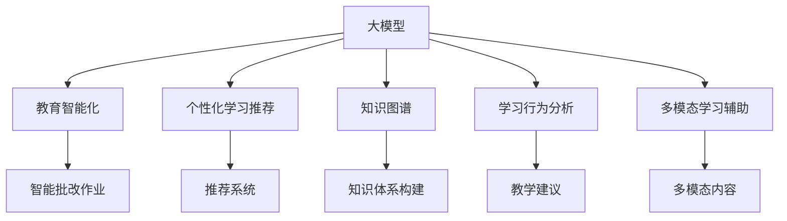

                 

# 大模型在智能教育中的应用探索

## 1. 背景介绍

### 1.1 问题由来

随着信息技术的高速发展，教育领域也面临着前所未有的变革挑战。如何利用最新的技术手段提升教学效果、实现个性化教学、促进教育公平，成为了教育科技发展的核心问题。

大模型在自然语言处理（NLP）领域的突破性进展，为教育智能化提供了新的可能性。基于大模型的语言理解与生成能力，可以在教育场景中实现智能化的知识传授、作业批改、学习行为分析等功能。通过智能化的教育技术，不仅能够提升教学效率，还能根据学生的个性化需求进行差异化教学，从而真正实现因材施教。

### 1.2 问题核心关键点

大模型在教育领域的应用，主要集中在以下几个关键点：

1. **智能批改作业**：利用大模型对学生的作业进行自动批改，提高教师批改效率。
2. **个性化学习推荐**：根据学生的学习行为和偏好，提供个性化的学习资源和课程推荐。
3. **知识图谱构建**：利用大模型构建学科知识图谱，帮助学生构建系统化的知识体系。
4. **学习行为分析**：分析学生的学习行为数据，了解学习效果和行为特征，提供针对性的教学建议。
5. **多模态学习辅助**：结合图像、视频等多种模态的信息，丰富学习内容，提升学习体验。

这些关键点不仅能够提升教育的质量和效率，还能促进教育公平，为不同地区、不同背景的学生提供平等的教育资源。

### 1.3 问题研究意义

大模型在教育领域的应用，具有重要的研究意义：

1. **提高教学效率**：大模型能够自动批改作业，解放教师的时间和精力，使其专注于教学设计。
2. **促进个性化学习**：根据学生的个性化需求，提供定制化的学习资源，提升学习效果。
3. **推动教育公平**：利用大模型提供高质量的远程教育服务，缩小城乡教育差距。
4. **促进教师发展**：为教师提供教学辅助工具，提高教师的教学能力和水平。

通过大模型技术的应用，教育将更加智能化、个性化，能够更好地满足社会发展和个人成长的需求。

## 2. 核心概念与联系

### 2.1 核心概念概述

为更好地理解大模型在教育领域的应用，本节将介绍几个关键概念：

- **大模型**：指基于大规模语料预训练的深度学习模型，如BERT、GPT等，具备强大的语言理解与生成能力。
- **教育智能化**：利用AI技术，自动化教育流程，提升教学效果和学习体验。
- **个性化学习推荐**：根据学生的学习行为和偏好，推荐个性化的学习资源和课程。
- **知识图谱**：构建学科知识图谱，帮助学生构建系统化的知识体系。
- **学习行为分析**：通过分析学生的学习行为数据，提供针对性的教学建议。
- **多模态学习辅助**：结合图像、视频等多种模态的信息，丰富学习内容，提升学习体验。

这些概念之间的逻辑关系可以通过以下Mermaid流程图来展示：



这个流程图展示了大模型在教育领域的关键应用场景：

1. 大模型通过教育智能化，将知识传授、作业批改、学习行为分析等功能自动化。
2. 通过个性化学习推荐，为学生提供定制化的学习资源和课程。
3. 利用知识图谱构建学科知识体系，帮助学生系统化地掌握知识。
4. 学习行为分析提供针对性的教学建议，提升教学效果。
5. 多模态学习辅助丰富学习内容，提升学习体验。

这些概念共同构成了大模型在教育领域的应用框架，为其带来了新的应用前景和挑战。

## 3. 核心算法原理 & 具体操作步骤

### 3.1 算法原理概述

基于大模型在教育领域的应用，本质上是一个自动化教育流程的过程。其核心思想是：利用大模型的语言理解与生成能力，自动化处理教育中的各种任务，提升教学效率和学习效果。

形式化地，假设大模型为 $M_{\theta}$，其中 $\theta$ 为预训练得到的模型参数。给定教育任务 $T$ 的标注数据集 $D=\{(x_i, y_i)\}_{i=1}^N$，大模型应用的方法为目标是找到最优参数 $\hat{\theta}$，使得：

$$
\hat{\theta}=\mathop{\arg\min}_{\theta} \mathcal{L}(M_{\theta},D)
$$

其中 $\mathcal{L}$ 为针对任务 $T$ 设计的损失函数，用于衡量模型预测输出与真实标签之间的差异。常见的损失函数包括交叉熵损失、均方误差损失等。

通过梯度下降等优化算法，大模型在任务 $T$ 上进行微调，最小化损失函数 $\mathcal{L}$，使得模型输出逼近真实标签。由于 $\theta$ 已经通过预训练获得了较好的初始化，因此即便在教育任务中，也能较快收敛到理想的模型参数 $\hat{\theta}$。

### 3.2 算法步骤详解

基于大模型在教育领域的应用，一般包括以下几个关键步骤：

**Step 1: 准备教育数据和任务**

- 收集教育任务相关的数据，如作业、教材、学生行为数据等，并进行预处理和标注。
- 确定教育任务的具体目标，如自动批改作业、个性化推荐、知识图谱构建等。

**Step 2: 选择和加载预训练模型**

- 选择合适的预训练语言模型 $M_{\theta}$ 作为初始化参数，如 BERT、GPT 等。
- 加载预训练模型到开发环境，准备进行微调。

**Step 3: 设计任务适配层**

- 根据教育任务的具体需求，设计合适的任务适配层。例如，作业批改任务可以使用分类层和交叉熵损失；个性化推荐任务可以使用推荐系统等。
- 确定模型输出的格式和损失函数，与预训练模型的顶层进行连接。

**Step 4: 设置微调超参数**

- 选择合适的优化算法及其参数，如 AdamW、SGD 等，设置学习率、批大小、迭代轮数等。
- 设置正则化技术及强度，包括权重衰减、Dropout、Early Stopping 等。
- 确定冻结预训练参数的策略，如仅微调顶层，或全部参数都参与微调。

**Step 5: 执行微调训练**

- 将教育数据分批次输入模型，前向传播计算损失函数。
- 反向传播计算参数梯度，根据设定的优化算法和学习率更新模型参数。
- 周期性在验证集上评估模型性能，根据性能指标决定是否触发 Early Stopping。
- 重复上述步骤直到满足预设的迭代轮数或 Early Stopping 条件。

**Step 6: 部署和应用**

- 在生产环境中部署微调后的模型，进行实际的教育应用。
- 持续收集新的教育数据，定期重新微调模型，以适应数据分布的变化。

以上是基于大模型在教育领域应用的一般流程。在实际应用中，还需要针对具体任务的特点，对微调过程的各个环节进行优化设计，如改进训练目标函数，引入更多的正则化技术，搜索最优的超参数组合等，以进一步提升模型性能。

### 3.3 算法优缺点

基于大模型在教育领域的应用，具有以下优点：

1. **自动化程度高**：利用大模型自动处理教育流程中的各种任务，提升教学效率。
2. **个性化能力强**：根据学生的个性化需求，提供定制化的学习资源和课程，提升学习效果。
3. **数据处理能力强**：大模型能够处理大规模的教育数据，提升数据分析的准确性和全面性。
4. **灵活性强**：不同教育任务可以使用不同的任务适配层，灵活应对各种教育需求。

同时，该方法也存在一定的局限性：

1. **依赖高质量标注数据**：教育任务的标注数据获取成本较高，对数据质量和数量要求严格。
2. **模型复杂度高**：大模型的复杂度高，训练和推理计算资源需求大。
3. **泛化能力有限**：如果教育任务与预训练数据的分布差异较大，微调的性能提升有限。
4. **伦理问题**：教育数据涉及学生隐私，需要严格的数据保护和隐私管理。

尽管存在这些局限性，但就目前而言，基于大模型的教育智能化方法仍是最主流的选择。未来相关研究的重点在于如何进一步降低对标注数据的依赖，提高模型的泛化能力，同时兼顾可解释性和伦理安全性等因素。

### 3.4 算法应用领域

基于大模型在教育领域的应用，涵盖了以下几个主要领域：

- **智能批改作业**：利用大模型自动批改学生的作业，提高教师批改效率。
- **个性化学习推荐**：根据学生的学习行为和偏好，提供个性化的学习资源和课程推荐。
- **知识图谱构建**：利用大模型构建学科知识图谱，帮助学生构建系统化的知识体系。
- **学习行为分析**：分析学生的学习行为数据，了解学习效果和行为特征，提供针对性的教学建议。
- **多模态学习辅助**：结合图像、视频等多种模态的信息，丰富学习内容，提升学习体验。

这些应用领域展示了大模型在教育智能化中的广泛应用前景，为教育科技的创新发展提供了新的方向和思路。

## 4. 数学模型和公式 & 详细讲解  
### 4.1 数学模型构建

本节将使用数学语言对基于大模型在教育领域的应用进行更加严格的刻画。

记教育任务 $T$ 的标注数据集为 $D=\{(x_i,y_i)\}_{i=1}^N, x_i \in \mathcal{X}, y_i \in \mathcal{Y}$，其中 $\mathcal{X}$ 为输入空间，$\mathcal{Y}$ 为输出空间。假设大模型 $M_{\theta}$ 在输入 $x$ 上的输出为 $\hat{y}=M_{\theta}(x) \in [0,1]$，表示预测值。真实标签 $y \in \{0,1\}$。

定义大模型 $M_{\theta}$ 在数据样本 $(x,y)$ 上的损失函数为 $\ell(M_{\theta}(x),y)$，则在数据集 $D$ 上的经验风险为：

$$
\mathcal{L}(\theta) = \frac{1}{N} \sum_{i=1}^N \ell(M_{\theta}(x_i),y_i)
$$

微调的目标是最小化经验风险，即找到最优参数：

$$
\theta^* = \mathop{\arg\min}_{\theta} \mathcal{L}(\theta)
$$

在实践中，我们通常使用基于梯度的优化算法（如SGD、Adam等）来近似求解上述最优化问题。设 $\eta$ 为学习率，$\lambda$ 为正则化系数，则参数的更新公式为：

$$
\theta \leftarrow \theta - \eta \nabla_{\theta}\mathcal{L}(\theta) - \eta\lambda\theta
$$

其中 $\nabla_{\theta}\mathcal{L}(\theta)$ 为损失函数对参数 $\theta$ 的梯度，可通过反向传播算法高效计算。

### 4.2 公式推导过程

以下我们以作业自动批改为例，推导交叉熵损失函数及其梯度的计算公式。

假设大模型 $M_{\theta}$ 在输入 $x$ 上的输出为 $\hat{y}=M_{\theta}(x) \in [0,1]$，表示预测值。真实标签 $y \in \{0,1\}$。则二分类交叉熵损失函数定义为：

$$
\ell(M_{\theta}(x),y) = -[y\log \hat{y} + (1-y)\log (1-\hat{y})]
$$

将其代入经验风险公式，得：

$$
\mathcal{L}(\theta) = -\frac{1}{N}\sum_{i=1}^N [y_i\log M_{\theta}(x_i)+(1-y_i)\log(1-M_{\theta}(x_i))]
$$

根据链式法则，损失函数对参数 $\theta_k$ 的梯度为：

$$
\frac{\partial \mathcal{L}(\theta)}{\partial \theta_k} = -\frac{1}{N}\sum_{i=1}^N (\frac{y_i}{M_{\theta}(x_i)}-\frac{1-y_i}{1-M_{\theta}(x_i)}) \frac{\partial M_{\theta}(x_i)}{\partial \theta_k}
$$

其中 $\frac{\partial M_{\theta}(x_i)}{\partial \theta_k}$ 可进一步递归展开，利用自动微分技术完成计算。

在得到损失函数的梯度后，即可带入参数更新公式，完成模型的迭代优化。重复上述过程直至收敛，最终得到适应教育任务的最优模型参数 $\theta^*$。

## 5. 项目实践：代码实例和详细解释说明
### 5.1 开发环境搭建

在进行教育领域的大模型微调实践前，我们需要准备好开发环境。以下是使用Python进行PyTorch开发的环境配置流程：

1. 安装Anaconda：从官网下载并安装Anaconda，用于创建独立的Python环境。

2. 创建并激活虚拟环境：
```bash
conda create -n pytorch-env python=3.8 
conda activate pytorch-env
```

3. 安装PyTorch：根据CUDA版本，从官网获取对应的安装命令。例如：
```bash
conda install pytorch torchvision torchaudio cudatoolkit=11.1 -c pytorch -c conda-forge
```

4. 安装Transformers库：
```bash
pip install transformers
```

5. 安装各类工具包：
```bash
pip install numpy pandas scikit-learn matplotlib tqdm jupyter notebook ipython
```

完成上述步骤后，即可在`pytorch-env`环境中开始教育领域的大模型微调实践。

### 5.2 源代码详细实现

这里我们以作业自动批改为例，给出使用Transformers库对BERT模型进行教育领域微调的PyTorch代码实现。

首先，定义作业自动批改的任务适配层：

```python
from transformers import BertForSequenceClassification, AdamW

model = BertForSequenceClassification.from_pretrained('bert-base-cased', num_labels=2)

optimizer = AdamW(model.parameters(), lr=2e-5)
```

然后，定义训练和评估函数：

```python
from torch.utils.data import DataLoader
from tqdm import tqdm
from sklearn.metrics import accuracy_score

device = torch.device('cuda') if torch.cuda.is_available() else torch.device('cpu')
model.to(device)

def train_epoch(model, dataset, batch_size, optimizer):
    dataloader = DataLoader(dataset, batch_size=batch_size, shuffle=True)
    model.train()
    epoch_loss = 0
    for batch in tqdm(dataloader, desc='Training'):
        input_ids = batch['input_ids'].to(device)
        attention_mask = batch['attention_mask'].to(device)
        labels = batch['labels'].to(device)
        model.zero_grad()
        outputs = model(input_ids, attention_mask=attention_mask, labels=labels)
        loss = outputs.loss
        epoch_loss += loss.item()
        loss.backward()
        optimizer.step()
    return epoch_loss / len(dataloader)

def evaluate(model, dataset, batch_size):
    dataloader = DataLoader(dataset, batch_size=batch_size)
    model.eval()
    preds, labels = [], []
    with torch.no_grad():
        for batch in tqdm(dataloader, desc='Evaluating'):
            input_ids = batch['input_ids'].to(device)
            attention_mask = batch['attention_mask'].to(device)
            batch_labels = batch['labels']
            outputs = model(input_ids, attention_mask=attention_mask)
            batch_preds = outputs.logits.argmax(dim=2).to('cpu').tolist()
            batch_labels = batch_labels.to('cpu').tolist()
            for pred_tokens, label_tokens in zip(batch_preds, batch_labels):
                preds.append(pred_tokens[:len(label_tokens)])
                labels.append(label_tokens)
                
    print('Accuracy:', accuracy_score(labels, preds))
```

最后，启动训练流程并在验证集上评估：

```python
epochs = 5
batch_size = 16

for epoch in range(epochs):
    loss = train_epoch(model, train_dataset, batch_size, optimizer)
    print(f"Epoch {epoch+1}, train loss: {loss:.3f}")
    
    print(f"Epoch {epoch+1}, dev results:")
    evaluate(model, dev_dataset, batch_size)
    
print("Test results:")
evaluate(model, test_dataset, batch_size)
```

以上就是使用PyTorch对BERT进行作业自动批改任务的完整代码实现。可以看到，得益于Transformers库的强大封装，我们可以用相对简洁的代码完成BERT模型的加载和微调。

### 5.3 代码解读与分析

让我们再详细解读一下关键代码的实现细节：

**BertForSequenceClassification类**：
- `from_pretrained`方法：从预训练的BERT模型中加载模型，用于作业自动批改任务。
- `num_labels`参数：指定任务的分类数目，作业自动批改任务为二分类任务，因此设置 `num_labels=2`。

**train_epoch函数**：
- 定义训练循环，对数据以批为单位进行迭代，在每个批次上前向传播计算loss并反向传播更新模型参数。
- 返回该epoch的平均loss。

**evaluate函数**：
- 定义评估循环，与训练类似，不同点在于不更新模型参数，并在每个batch结束后将预测和标签结果存储下来，最后使用sklearn的accuracy_score对整个评估集的预测结果进行打印输出。

**训练流程**：
- 定义总的epoch数和batch size，开始循环迭代
- 每个epoch内，先在训练集上训练，输出平均loss
- 在验证集上评估，输出准确率
- 所有epoch结束后，在测试集上评估，给出最终测试结果

可以看到，PyTorch配合Transformers库使得BERT微调的代码实现变得简洁高效。开发者可以将更多精力放在数据处理、模型改进等高层逻辑上，而不必过多关注底层的实现细节。

当然，工业级的系统实现还需考虑更多因素，如模型的保存和部署、超参数的自动搜索、更灵活的任务适配层等。但核心的微调范式基本与此类似。

## 6. 实际应用场景

### 6.1 智能批改作业

基于大模型在教育领域的应用，智能批改作业已成为教育智能化的一个重要方向。传统的手动批改作业不仅耗时耗力，还容易出错。而使用大模型自动批改作业，不仅效率高，还能确保批改标准的一致性。

在技术实现上，可以收集大量的作业样例和标准答案，将作业文本和答案作为监督数据，在此基础上对预训练模型进行微调。微调后的模型能够自动理解作业内容，判断作业的正确性。对于不正确的作业，还可以自动生成错误提示和修改建议，帮助学生改正错误。

智能批改作业的应用场景包括：
- 自动批改选择题、填空题等客观题型
- 自动批改作文、答案解析等主观题型
- 自动生成反馈和建议，提升批改效果

通过智能批改作业，教师可以解放出大量时间，专注于教学设计和个性化辅导，提升教学效果。

### 6.2 个性化学习推荐

个性化学习推荐是大模型在教育领域的重要应用之一。通过分析学生的学习行为和偏好，为大模型提供定制化的学习资源和课程，提升学生的学习体验和学习效果。

在技术实现上，可以收集学生的学习数据，如浏览记录、观看时长、答题情况等，将这些数据作为监督信号，对预训练模型进行微调。微调后的模型能够根据学生的行为数据，推荐合适的学习资源和课程。

个性化学习推荐的应用场景包括：
- 根据学生的学习兴趣和知识水平，推荐适合的教材、视频、练习题等
- 根据学生的学习进度和掌握情况，推荐合适的学习路径和进度
- 根据学生的行为数据，动态调整学习推荐策略，提升推荐效果

通过个性化学习推荐，学生能够获得更加贴合自身需求的学习资源，提升学习效率和效果。

### 6.3 知识图谱构建

知识图谱是一种以图形化的方式表示知识体系的方法，能够帮助学生构建系统化的知识体系，提升学习效果。通过大模型在教育领域的应用，可以构建学科知识图谱，提供系统化的学习资源。

在技术实现上，可以利用大模型进行知识抽取和关系推理，构建学科知识图谱。具体步骤如下：
1. 收集学科相关的知识数据，如教材、论文、文档等。
2. 利用大模型进行知识抽取，提取出关键实体和关系。
3. 利用关系推理技术，构建学科知识图谱。
4. 将知识图谱嵌入教学系统中，为学生提供系统化的学习资源。

知识图谱的应用场景包括：
- 为学生提供系统化的学习资源，提升学习效果
- 提供知识之间的关联关系，帮助学生理解知识点之间的联系
- 利用知识图谱进行问题解答，帮助学生解决问题

通过知识图谱构建，学生能够系统化地掌握学科知识，提升学习效果。

### 6.4 学习行为分析

学习行为分析是大模型在教育领域的另一个重要应用。通过分析学生的学习行为数据，了解学生的学习效果和行为特征，为大模型提供个性化的教学建议。

在技术实现上，可以收集学生的学习数据，如阅读时长、答题情况、学习进度等，将这些数据作为监督信号，对预训练模型进行微调。微调后的模型能够分析学生的学习行为数据，提供个性化的教学建议。

学习行为分析的应用场景包括：
- 分析学生的学习效果，评估学习进度
- 提供个性化的教学建议，提升学习效果
- 识别学习中的问题，提供针对性的解决方案

通过学习行为分析，教师能够了解学生的学习效果和行为特征，提供个性化的教学建议，提升教学效果。

### 6.5 多模态学习辅助

多模态学习辅助是大模型在教育领域的新兴应用方向。通过结合图像、视频等多种模态的信息，丰富学习内容，提升学习体验。

在技术实现上，可以利用大模型处理多模态数据，如将文本、图像、视频等信息融合在一起，构建多模态学习资源。具体步骤如下：
1. 收集学习相关的多模态数据，如文本、图像、视频等。
2. 利用大模型进行数据融合，构建多模态学习资源。
3. 将多模态学习资源嵌入教学系统中，为学生提供丰富的学习资源。

多模态学习辅助的应用场景包括：
- 为学生提供丰富的学习资源，提升学习体验
- 结合多种模态的信息，提供系统的学习内容
- 利用多模态学习资源进行问题解答，帮助学生解决问题

通过多模态学习辅助，学生能够获得更加丰富的学习资源，提升学习体验。

## 7. 工具和资源推荐
### 7.1 学习资源推荐

为了帮助开发者系统掌握大模型在教育领域的应用，这里推荐一些优质的学习资源：

1. 《Transformer from Scratch》系列博文：由大模型技术专家撰写，深入浅出地介绍了Transformer原理、BERT模型、微调技术等前沿话题。

2. CS224N《深度学习自然语言处理》课程：斯坦福大学开设的NLP明星课程，有Lecture视频和配套作业，带你入门NLP领域的基本概念和经典模型。

3. 《Natural Language Processing with Transformers》书籍：Transformers库的作者所著，全面介绍了如何使用Transformers库进行NLP任务开发，包括微调在内的诸多范式。

4. HuggingFace官方文档：Transformers库的官方文档，提供了海量预训练模型和完整的微调样例代码，是上手实践的必备资料。

5. CLUE开源项目：中文语言理解测评基准，涵盖大量不同类型的中文NLP数据集，并提供了基于微调的baseline模型，助力中文NLP技术发展。

通过对这些资源的学习实践，相信你一定能够快速掌握大模型在教育领域的应用精髓，并用于解决实际的NLP问题。

### 7.2 开发工具推荐

高效的开发离不开优秀的工具支持。以下是几款用于大模型在教育领域微调开发的常用工具：

1. PyTorch：基于Python的开源深度学习框架，灵活动态的计算图，适合快速迭代研究。大部分预训练语言模型都有PyTorch版本的实现。

2. TensorFlow：由Google主导开发的开源深度学习框架，生产部署方便，适合大规模工程应用。同样有丰富的预训练语言模型资源。

3. Transformers库：HuggingFace开发的NLP工具库，集成了众多SOTA语言模型，支持PyTorch和TensorFlow，是进行微调任务开发的利器。

4. Weights & Biases：模型训练的实验跟踪工具，可以记录和可视化模型训练过程中的各项指标，方便对比和调优。与主流深度学习框架无缝集成。

5. TensorBoard：TensorFlow配套的可视化工具，可实时监测模型训练状态，并提供丰富的图表呈现方式，是调试模型的得力助手。

6. Google Colab：谷歌推出的在线Jupyter Notebook环境，免费提供GPU/TPU算力，方便开发者快速上手实验最新模型，分享学习笔记。

合理利用这些工具，可以显著提升大模型在教育领域微调任务的开发效率，加快创新迭代的步伐。

### 7.3 相关论文推荐

大模型在教育领域的应用源于学界的持续研究。以下是几篇奠基性的相关论文，推荐阅读：

1. Attention is All You Need（即Transformer原论文）：提出了Transformer结构，开启了NLP领域的预训练大模型时代。

2. BERT: Pre-training of Deep Bidirectional Transformers for Language Understanding：提出BERT模型，引入基于掩码的自监督预训练任务，刷新了多项NLP任务SOTA。

3. Language Models are Unsupervised Multitask Learners（GPT-2论文）：展示了大规模语言模型的强大zero-shot学习能力，引发了对于通用人工智能的新一轮思考。

4. Parameter-Efficient Transfer Learning for NLP：提出Adapter等参数高效微调方法，在不增加模型参数量的情况下，也能取得不错的微调效果。

5. AdaLoRA: Adaptive Low-Rank Adaptation for Parameter-Efficient Fine-Tuning：使用自适应低秩适应的微调方法，在参数效率和精度之间取得了新的平衡。

这些论文代表了大模型在教育领域的应用发展脉络。通过学习这些前沿成果，可以帮助研究者把握学科前进方向，激发更多的创新灵感。

## 8. 总结：未来发展趋势与挑战

### 8.1 总结

本文对基于大模型在教育领域的应用进行了全面系统的介绍。首先阐述了教育智能化和大模型在教育领域的应用背景和意义，明确了微调在提升教育效果、推动教育公平、促进教师发展等方面的独特价值。其次，从原理到实践，详细讲解了基于大模型的教育智能化方法，给出了具体的代码实现和评估指标。最后，我们探讨了大模型在教育领域的应用场景和前景，展示了其广阔的应用潜力。

通过本文的系统梳理，可以看到，基于大模型的教育智能化方法不仅能够提升教育效果，还能推动教育公平，促进教师发展，为教育科技的创新发展提供了新的方向和思路。未来，伴随大模型和微调方法的持续演进，相信教育科技将迎来更多的创新和突破，为学生的学习体验和教育公平带来更大的提升。

### 8.2 未来发展趋势

展望未来，大模型在教育领域的应用将呈现以下几个发展趋势：

1. **教育个性化程度提升**：大模型将能够更好地理解学生的个性化需求，提供更加贴合的个性化学习资源和课程。
2. **学习内容丰富化**：结合多模态数据，丰富学习内容，提升学习体验。
3. **教学过程智能化**：利用大模型自动处理教育流程中的各种任务，提升教学效率。
4. **教育公平性增强**：利用大模型提供高质量的远程教育服务，缩小城乡教育差距。
5. **教学行为数据化**：利用大数据分析技术，收集和分析学生的学习行为数据，提供个性化的教学建议。

这些趋势凸显了大模型在教育智能化中的广阔前景，为教育科技的创新发展提供了新的方向和思路。

### 8.3 面临的挑战

尽管大模型在教育领域的应用前景广阔，但在迈向更加智能化、普适化应用的过程中，它仍面临着诸多挑战：

1. **数据隐私和安全**：教育数据涉及学生隐私，需要严格的数据保护和隐私管理。
2. **模型复杂度高**：大模型的复杂度高，训练和推理计算资源需求大。
3. **泛化能力有限**：如果教育任务与预训练数据的分布差异较大，微调的性能提升有限。
4. **伦理问题**：教育数据涉及伦理道德问题，需要综合考虑社会责任和伦理约束。
5. **可解释性不足**：大模型通常被视为"黑盒"系统，难以解释其内部工作机制和决策逻辑。

尽管存在这些挑战，但就目前而言，基于大模型的教育智能化方法仍是最主流的选择。未来相关研究的重点在于如何进一步降低对标注数据的依赖，提高模型的泛化能力，同时兼顾可解释性和伦理安全性等因素。

### 8.4 研究展望

面向未来，大模型在教育领域的应用还需要在以下几个方面寻求新的突破：

1. **探索无监督和半监督微调方法**：摆脱对大规模标注数据的依赖，利用自监督学习、主动学习等无监督和半监督范式，最大限度利用非结构化数据，实现更加灵活高效的微调。
2. **研究参数高效和计算高效的微调范式**：开发更加参数高效的微调方法，在固定大部分预训练参数的同时，只更新极少量的任务相关参数。同时优化微调模型的计算图，减少前向传播和反向传播的资源消耗，实现更加轻量级、实时性的部署。
3. **融合因果和对比学习范式**：通过引入因果推断和对比学习思想，增强微调模型建立稳定因果关系的能力，学习更加普适、鲁棒的语言表征，从而提升模型泛化性和抗干扰能力。
4. **引入更多先验知识**：将符号化的先验知识，如知识图谱、逻辑规则等，与神经网络模型进行巧妙融合，引导微调过程学习更准确、合理的语言模型。同时加强不同模态数据的整合，实现视觉、语音等多模态信息与文本信息的协同建模。
5. **结合因果分析和博弈论工具**：将因果分析方法引入微调模型，识别出模型决策的关键特征，增强输出解释的因果性和逻辑性。借助博弈论工具刻画人机交互过程，主动探索并规避模型的脆弱点，提高系统稳定性。
6. **纳入伦理道德约束**：在模型训练目标中引入伦理导向的评估指标，过滤和惩罚有偏见、有害的输出倾向。同时加强人工干预和审核，建立模型行为的监管机制，确保输出符合人类价值观和伦理道德。

这些研究方向的探索，必将引领大模型在教育领域的应用走向更高的台阶，为构建安全、可靠、可解释、可控的智能系统铺平道路。面向未来，大模型在教育领域的应用还需要与其他人工智能技术进行更深入的融合，如知识表示、因果推理、强化学习等，多路径协同发力，共同推动自然语言理解和智能交互系统的进步。只有勇于创新、敢于突破，才能不断拓展语言模型的边界，让智能技术更好地造福人类社会。

## 9. 附录：常见问题与解答

**Q1：大模型在教育领域应用的主要限制是什么？**

A: 大模型在教育领域应用的主要限制包括：
1. **数据隐私和安全**：教育数据涉及学生隐私，需要严格的数据保护和隐私管理。
2. **模型复杂度高**：大模型的复杂度高，训练和推理计算资源需求大。
3. **泛化能力有限**：如果教育任务与预训练数据的分布差异较大，微调的性能提升有限。
4. **伦理问题**：教育数据涉及伦理道德问题，需要综合考虑社会责任和伦理约束。

**Q2：如何降低大模型在教育领域对标注数据的依赖？**

A: 降低大模型在教育领域对标注数据的依赖，可以从以下几个方面入手：
1. **自监督学习**：利用自监督学习技术，如掩码语言模型、Next Sentence Prediction等，减少对标注数据的依赖。
2. **主动学习**：通过主动学习技术，选择最有代表性的样本进行标注，最大化利用有限标注数据。
3. **知识图谱构建**：利用知识图谱中的先验知识，减少对标注数据的依赖。
4. **多模态学习**：结合多种模态的数据，丰富学习内容，减少对标注数据的依赖。

**Q3：如何提高大模型在教育领域的应用效果？**

A: 提高大模型在教育领域的应用效果，可以从以下几个方面入手：
1. **优化数据质量**：收集高质量的教育数据，确保数据的丰富性和多样性。
2. **改进模型架构**：利用参数高效和计算高效的微调方法，减少计算资源消耗。
3. **融合多种技术**：结合因果分析、博弈论等技术，提高模型的泛化能力和鲁棒性。
4. **引入先验知识**：利用知识图谱、逻辑规则等先验知识，提升模型的准确性和可靠性。
5. **注重伦理和安全**：确保模型的输出符合伦理道德标准，建立模型的监管机制。

**Q4：大模型在教育领域面临的主要伦理问题是什么？**

A: 大模型在教育领域面临的主要伦理问题包括：
1. **数据隐私**：教育数据涉及学生隐私，需要严格的数据保护和隐私管理。
2. **公平性问题**：大模型在处理不同背景学生的数据时，需要确保公平性。
3. **透明性和可解释性**：大模型的决策过程需要透明和可解释，以增强用户信任。
4. **责任归属**：在使用大模型进行教学决策时，需要明确责任归属，避免法律纠纷。

**Q5：大模型在教育领域有哪些实际应用场景？**

A: 大模型在教育领域有以下实际应用场景：
1. **智能批改作业**：利用大模型自动批改作业，提高教师批改效率。
2. **个性化学习推荐**：根据学生的学习行为和偏好，提供个性化的学习资源和课程推荐。
3. **知识图谱构建**：利用大模型构建学科知识图谱，帮助学生构建系统化的知识体系。
4. **学习行为分析**：分析学生的学习行为数据，了解学习效果和行为特征，提供个性化的教学建议。
5. **多模态学习辅助**：结合图像、视频等多种模态的信息，丰富学习内容，提升学习体验。

这些应用场景展示了大模型在教育智能化中的广泛应用前景，为教育科技的创新发展提供了新的方向和思路。

---

作者：禅与计算机程序设计艺术 / Zen and the Art of Computer Programming

