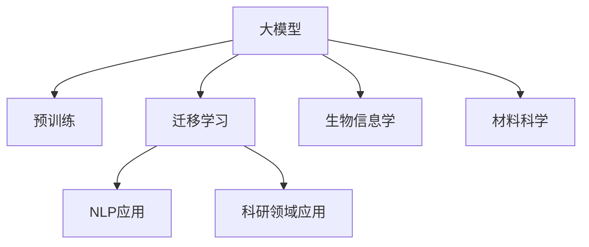

                 

# 大模型在科研领域的应用前景

大模型在科研领域的应用前景广阔，它不仅能加速科研进程，还能推动学科交叉和创新。本文将从背景介绍、核心概念、核心算法、实际应用场景、未来展望等方面系统分析大模型在科研中的作用和潜力。

## 1. 背景介绍

### 1.1 问题由来
近年来，人工智能(AI)技术在科研领域的应用越来越广泛，尤其是在生物信息学、材料科学、天文学等传统科研领域，AI大模型已展现出显著的潜力。特别是在生物信息学中，大模型如BERT、GPT-3等，通过自然语言处理(NLP)技术，加速了文献检索、分子结构预测、基因序列分析等任务的研究进程。

### 1.2 问题核心关键点
大模型在科研中的核心作用在于其强大的文本处理和数据分析能力。通过大规模预训练学习，大模型可以处理海量的文献、实验数据、报告等文本，从中提取出科研知识、发现潜在规律。同时，大模型还可以进行多模态数据的整合，结合图像、光谱等数据，进行更为深入的科研分析。

## 2. 核心概念与联系

### 2.1 核心概念概述

为更好地理解大模型在科研中的应用，本节将介绍几个关键概念：

- 大模型(Large Model)：指拥有亿级参数的神经网络模型，如BERT、GPT-3、DALL-E等。通过在大规模无标签数据上预训练，大模型具备强大的特征提取和表示能力。

- 预训练(Pre-training)：指在大规模无标签数据上，通过自监督学习任务训练通用模型参数的过程。常见的预训练任务包括语言建模、图像分类等。预训练使得模型学习到通用的知识表示。

- 迁移学习(Transfer Learning)：指将一个领域学习到的知识，迁移应用到另一个不同但相关的领域的学习范式。大模型可以通过预训练进行迁移学习，应用于科研任务。

- 自然语言处理(NLP)：指使用计算机处理自然语言数据，包括文本分类、命名实体识别、信息抽取、问答等任务。

- 生物信息学(Bioinformatics)：将计算机技术应用于生物数据的分析和管理，涉及基因组学、蛋白质组学、生物信息学算法等。

- 材料科学(Material Science)：研究物质的微观结构和宏观性能，涉及材料设计、合成、性能测试等。

这些概念之间的逻辑关系可以通过以下Mermaid流程图来展示：



这个流程图展示了大模型的核心概念及其应用领域：

1. 大模型通过预训练获得基础能力。
2. 迁移学习连接预训练模型与科研任务，通过微调提升模型性能。
3. 大模型在NLP领域应用广泛，如文献检索、命名实体识别等。
4. 大模型还可应用于生物信息学、材料科学等多个科研领域，促进跨学科交叉。

## 3. 核心算法原理 & 具体操作步骤
### 3.1 算法原理概述

大模型在科研领域的应用主要基于迁移学习范式。其核心思想是：将预训练的大模型视作一个强大的特征提取器，通过在科研数据上进行有监督学习，优化模型在特定科研任务上的性能。

形式化地，假设预训练模型为 $M_{\theta}$，其中 $\theta$ 为预训练得到的模型参数。给定科研任务 $T$ 的标注数据集 $D=\{(x_i,y_i)\}_{i=1}^N$，迁移学习的优化目标是最小化经验风险，即找到最优参数：

$$
\theta^* = \mathop{\arg\min}_{\theta} \mathcal{L}(M_{\theta},D)
$$

其中 $\mathcal{L}$ 为针对任务 $T$ 设计的损失函数，用于衡量模型预测输出与真实标签之间的差异。

### 3.2 算法步骤详解

基于迁移学习的大模型科研应用一般包括以下几个关键步骤：

**Step 1: 准备预训练模型和数据集**
- 选择合适的预训练模型 $M_{\theta}$ 作为初始化参数，如 BERT、GPT-3 等。
- 准备科研领域的数据集 $D$，划分为训练集、验证集和测试集。一般要求数据与预训练数据的分布不要差异过大。

**Step 2: 添加任务适配层**
- 根据科研任务类型，在预训练模型顶层设计合适的输出层和损失函数。
- 对于分类任务，通常在顶层添加线性分类器和交叉熵损失函数。
- 对于生成任务，通常使用语言模型的解码器输出概率分布，并以负对数似然为损失函数。

**Step 3: 设置迁移超参数**
- 选择合适的优化算法及其参数，如 AdamW、SGD 等，设置学习率、批大小、迭代轮数等。
- 设置正则化技术及强度，包括权重衰减、Dropout、Early Stopping等。
- 确定冻结预训练参数的策略，如仅微调顶层，或全部参数都参与微调。

**Step 4: 执行梯度训练**
- 将训练集数据分批次输入模型，前向传播计算损失函数。
- 反向传播计算参数梯度，根据设定的优化算法和学习率更新模型参数。
- 周期性在验证集上评估模型性能，根据性能指标决定是否触发 Early Stopping。
- 重复上述步骤直到满足预设的迭代轮数或 Early Stopping 条件。

**Step 5: 测试和部署**
- 在测试集上评估迁移后模型 $M_{\hat{\theta}}$ 的性能，对比迁移前后的精度提升。
- 使用迁移后的模型对新样本进行推理预测，集成到实际的研究系统中。
- 持续收集新的数据，定期重新迁移模型，以适应数据分布的变化。

以上是基于迁移学习大模型科研应用的一般流程。在实际应用中，还需要针对具体科研任务的特点，对迁移过程的各个环节进行优化设计，如改进训练目标函数，引入更多的正则化技术，搜索最优的超参数组合等，以进一步提升模型性能。

### 3.3 算法优缺点

基于迁移学习的大模型科研应用方法具有以下优点：

1. 简单高效。只需准备少量标注数据，即可对预训练模型进行快速适配，获得较大的性能提升。
2. 通用适用。适用于各种科研领域任务，包括分类、匹配、生成等，设计简单的任务适配层即可实现迁移。
3. 参数高效。利用参数高效迁移技术，在固定大部分预训练参数的情况下，仍可取得不错的迁移效果。
4. 效果显著。在学术界和工业界的诸多科研任务上，基于迁移学习的方法已经刷新了最先进的性能指标。

同时，该方法也存在一定的局限性：

1. 依赖标注数据。迁移的效果很大程度上取决于标注数据的质量和数量，获取高质量标注数据的成本较高。
2. 迁移能力有限。当目标任务与预训练数据的分布差异较大时，迁移的性能提升有限。
3. 可解释性不足。迁移后的模型决策过程通常缺乏可解释性，难以对其推理逻辑进行分析和调试。

尽管存在这些局限性，但就目前而言，基于迁移学习的科研应用方法仍是大模型应用的最主流范式。未来相关研究的重点在于如何进一步降低迁移对标注数据的依赖，提高模型的少样本学习和跨领域迁移能力，同时兼顾可解释性和伦理安全性等因素。

### 3.4 算法应用领域

基于大模型迁移学习的科研应用方法，在多个科研领域已经得到了广泛的应用，例如：

- 生物信息学：通过预训练模型进行文献检索、基因序列分析、蛋白质结构预测等任务，加速科研进程。
- 材料科学：利用预训练模型进行材料性质预测、合成路线设计等，提高材料发现的效率和精度。
- 天文学：通过预训练模型进行天文数据分类、星系光谱分析等，辅助天文学研究。
- 环境科学：利用预训练模型进行气候变化预测、污染物浓度估算等，支持环境保护工作。
- 化学工程：通过预训练模型进行反应动力学模拟、催化剂优化等，优化化学生产工艺。

除了上述这些经典任务外，大模型迁移学习还被创新性地应用到更多场景中，如复杂分子模拟、医学图像分析、药物设计等，为科研技术带来了全新的突破。随着预训练模型和迁移学习方法的不断进步，相信科研技术将在更广阔的应用领域大放异彩。

## 4. 数学模型和公式 & 详细讲解 & 举例说明

### 4.1 数学模型构建

本节将使用数学语言对基于迁移学习的大模型科研应用过程进行更加严格的刻画。

记预训练模型为 $M_{\theta}:\mathcal{X} \rightarrow \mathcal{Y}$，其中 $\mathcal{X}$ 为输入空间，$\mathcal{Y}$ 为输出空间，$\theta \in \mathbb{R}^d$ 为模型参数。假设科研任务 $T$ 的训练集为 $D=\{(x_i,y_i)\}_{i=1}^N, x_i \in \mathcal{X}, y_i \in \mathcal{Y}$。

定义模型 $M_{\theta}$ 在数据样本 $(x,y)$ 上的损失函数为 $\ell(M_{\theta}(x),y)$，则在数据集 $D$ 上的经验风险为：

$$
\mathcal{L}(\theta) = \frac{1}{N} \sum_{i=1}^N \ell(M_{\theta}(x_i),y_i)
$$

迁移学习的优化目标是最小化经验风险，即找到最优参数：

$$
\theta^* = \mathop{\arg\min}_{\theta} \mathcal{L}(\theta)
$$

在实践中，我们通常使用基于梯度的优化算法（如SGD、Adam等）来近似求解上述最优化问题。设 $\eta$ 为学习率，$\lambda$ 为正则化系数，则参数的更新公式为：

$$
\theta \leftarrow \theta - \eta \nabla_{\theta}\mathcal{L}(\theta) - \eta\lambda\theta
$$

其中 $\nabla_{\theta}\mathcal{L}(\theta)$ 为损失函数对参数 $\theta$ 的梯度，可通过反向传播算法高效计算。

### 4.2 公式推导过程

以下我们以生物信息学中的分子结构预测为例，推导损失函数及其梯度的计算公式。

假设模型 $M_{\theta}$ 在输入 $x$ 上的输出为 $\hat{y}=M_{\theta}(x) \in [0,1]$，表示样本属于特定结构的概率。真实标签 $y \in \{0,1\}$。则二分类交叉熵损失函数定义为：

$$
\ell(M_{\theta}(x),y) = -[y\log \hat{y} + (1-y)\log (1-\hat{y})]
$$

将其代入经验风险公式，得：

$$
\mathcal{L}(\theta) = -\frac{1}{N}\sum_{i=1}^N [y_i\log M_{\theta}(x_i)+(1-y_i)\log(1-M_{\theta}(x_i))]
$$

根据链式法则，损失函数对参数 $\theta_k$ 的梯度为：

$$
\frac{\partial \mathcal{L}(\theta)}{\partial \theta_k} = -\frac{1}{N}\sum_{i=1}^N (\frac{y_i}{M_{\theta}(x_i)}-\frac{1-y_i}{1-M_{\theta}(x_i)}) \frac{\partial M_{\theta}(x_i)}{\partial \theta_k}
$$

其中 $\frac{\partial M_{\theta}(x_i)}{\partial \theta_k}$ 可进一步递归展开，利用自动微分技术完成计算。

在得到损失函数的梯度后，即可带入参数更新公式，完成模型的迭代优化。重复上述过程直至收敛，最终得到适应科研任务的最优模型参数 $\theta^*$。

## 5. 项目实践：代码实例和详细解释说明
### 5.1 开发环境搭建

在进行科研应用开发前，我们需要准备好开发环境。以下是使用Python进行PyTorch开发的环境配置流程：

1. 安装Anaconda：从官网下载并安装Anaconda，用于创建独立的Python环境。

2. 创建并激活虚拟环境：
```bash
conda create -n pytorch-env python=3.8 
conda activate pytorch-env
```

3. 安装PyTorch：根据CUDA版本，从官网获取对应的安装命令。例如：
```bash
conda install pytorch torchvision torchaudio cudatoolkit=11.1 -c pytorch -c conda-forge
```

4. 安装Transformers库：
```bash
pip install transformers
```

5. 安装各类工具包：
```bash
pip install numpy pandas scikit-learn matplotlib tqdm jupyter notebook ipython
```

完成上述步骤后，即可在`pytorch-env`环境中开始科研应用开发。

### 5.2 源代码详细实现

下面我以生物信息学中的基因序列分类为例，给出使用Transformers库对BERT模型进行科研应用微调的PyTorch代码实现。

首先，定义科研任务的数据处理函数：

```python
from transformers import BertTokenizer
from torch.utils.data import Dataset
import torch

class BioDataset(Dataset):
    def __init__(self, texts, labels, tokenizer, max_len=128):
        self.texts = texts
        self.labels = labels
        self.tokenizer = tokenizer
        self.max_len = max_len
        
    def __len__(self):
        return len(self.texts)
    
    def __getitem__(self, item):
        text = self.texts[item]
        label = self.labels[item]
        
        encoding = self.tokenizer(text, return_tensors='pt', max_length=self.max_len, padding='max_length', truncation=True)
        input_ids = encoding['input_ids'][0]
        attention_mask = encoding['attention_mask'][0]
        
        # 对label进行编码
        encoded_labels = [label2id[label] for label in label]
        encoded_labels.extend([label2id['O']] * (self.max_len - len(encoded_labels)))
        labels = torch.tensor(encoded_labels, dtype=torch.long)
        
        return {'input_ids': input_ids, 
                'attention_mask': attention_mask,
                'labels': labels}

# 标签与id的映射
label2id = {'O': 0, 'Gene': 1, 'Protein': 2, 'RNA': 3, 'DNA': 4, 'Other': 5}
id2label = {v: k for k, v in label2id.items()}

# 创建dataset
tokenizer = BertTokenizer.from_pretrained('bert-base-cased')

train_dataset = BioDataset(train_texts, train_labels, tokenizer)
dev_dataset = BioDataset(dev_texts, dev_labels, tokenizer)
test_dataset = BioDataset(test_texts, test_labels, tokenizer)
```

然后，定义模型和优化器：

```python
from transformers import BertForTokenClassification, AdamW

model = BertForTokenClassification.from_pretrained('bert-base-cased', num_labels=len(label2id))

optimizer = AdamW(model.parameters(), lr=2e-5)
```

接着，定义训练和评估函数：

```python
from torch.utils.data import DataLoader
from tqdm import tqdm
from sklearn.metrics import classification_report

device = torch.device('cuda') if torch.cuda.is_available() else torch.device('cpu')
model.to(device)

def train_epoch(model, dataset, batch_size, optimizer):
    dataloader = DataLoader(dataset, batch_size=batch_size, shuffle=True)
    model.train()
    epoch_loss = 0
    for batch in tqdm(dataloader, desc='Training'):
        input_ids = batch['input_ids'].to(device)
        attention_mask = batch['attention_mask'].to(device)
        labels = batch['labels'].to(device)
        model.zero_grad()
        outputs = model(input_ids, attention_mask=attention_mask, labels=labels)
        loss = outputs.loss
        epoch_loss += loss.item()
        loss.backward()
        optimizer.step()
    return epoch_loss / len(dataloader)

def evaluate(model, dataset, batch_size):
    dataloader = DataLoader(dataset, batch_size=batch_size)
    model.eval()
    preds, labels = [], []
    with torch.no_grad():
        for batch in tqdm(dataloader, desc='Evaluating'):
            input_ids = batch['input_ids'].to(device)
            attention_mask = batch['attention_mask'].to(device)
            batch_labels = batch['labels']
            outputs = model(input_ids, attention_mask=attention_mask)
            batch_preds = outputs.logits.argmax(dim=2).to('cpu').tolist()
            batch_labels = batch_labels.to('cpu').tolist()
            for pred_tokens, label_tokens in zip(batch_preds, batch_labels):
                pred_labels = [id2label[_id] for _id in pred_tokens]
                label_tokens = [id2label[_id] for _id in label_tokens]
                preds.append(pred_labels[:len(label_tokens)])
                labels.append(label_tokens)
                
    print(classification_report(labels, preds))
```

最后，启动训练流程并在测试集上评估：

```python
epochs = 5
batch_size = 16

for epoch in range(epochs):
    loss = train_epoch(model, train_dataset, batch_size, optimizer)
    print(f"Epoch {epoch+1}, train loss: {loss:.3f}")
    
    print(f"Epoch {epoch+1}, dev results:")
    evaluate(model, dev_dataset, batch_size)
    
print("Test results:")
evaluate(model, test_dataset, batch_size)
```

以上就是使用PyTorch对BERT进行科研应用微调的完整代码实现。可以看到，得益于Transformers库的强大封装，我们可以用相对简洁的代码完成BERT模型的加载和微调。

### 5.3 代码解读与分析

让我们再详细解读一下关键代码的实现细节：

**BioDataset类**：
- `__init__`方法：初始化文本、标签、分词器等关键组件。
- `__len__`方法：返回数据集的样本数量。
- `__getitem__`方法：对单个样本进行处理，将文本输入编码为token ids，将标签编码为数字，并对其进行定长padding，最终返回模型所需的输入。

**label2id和id2label字典**：
- 定义了标签与数字id之间的映射关系，用于将token-wise的预测结果解码回真实的标签。

**训练和评估函数**：
- 使用PyTorch的DataLoader对数据集进行批次化加载，供模型训练和推理使用。
- 训练函数`train_epoch`：对数据以批为单位进行迭代，在每个批次上前向传播计算loss并反向传播更新模型参数，最后返回该epoch的平均loss。
- 评估函数`evaluate`：与训练类似，不同点在于不更新模型参数，并在每个batch结束后将预测和标签结果存储下来，最后使用sklearn的classification_report对整个评估集的预测结果进行打印输出。

**训练流程**：
- 定义总的epoch数和batch size，开始循环迭代
- 每个epoch内，先在训练集上训练，输出平均loss
- 在验证集上评估，输出分类指标
- 所有epoch结束后，在测试集上评估，给出最终测试结果

可以看到，PyTorch配合Transformers库使得BERT微调的代码实现变得简洁高效。开发者可以将更多精力放在数据处理、模型改进等高层逻辑上，而不必过多关注底层的实现细节。

当然，工业级的系统实现还需考虑更多因素，如模型的保存和部署、超参数的自动搜索、更灵活的任务适配层等。但核心的迁移范式基本与此类似。

## 6. 实际应用场景
### 6.1 科研文献检索

在生物信息学中，科研文献检索是日常工作的重要部分。传统的检索方式依赖于手动筛选，耗时耗力，且可能存在遗漏。基于大模型科研应用的方法，可以显著提升文献检索的效率和准确性。

具体而言，可以收集生物领域的各类文献、综述、数据库，进行预训练。在检索时，将用户输入的查询句输入到预训练模型中，生成语义向量，与文献向量进行相似度计算，并排序返回，便能够快速定位到相关文献。同时，还可以引入多轮问答机制，进一步优化检索效果。

### 6.2 基因序列分析

基因序列分析是生物信息学的核心任务之一。传统的序列分析方法依赖于复杂的算法和大量的手工标注，效率低下且成本高。基于大模型科研应用的方法，可以显著降低序列分析的复杂度和成本，提高分析效率。

具体而言，可以构建预训练模型，对基因序列进行预训练，提取序列特征。在分析时，将待分析的基因序列输入模型，生成分析结果，如蛋白质结构预测、基因变异检测、DNA序列比对等。通过预训练-迁移学习的范式，可以大大提升基因序列分析的精度和效率。

### 6.3 材料科学设计

材料科学设计通常需要大量的实验数据和经验积累，实验周期长，成本高。基于大模型科研应用的方法，可以加速材料设计过程，减少实验次数，提高设计效率。

具体而言，可以构建预训练模型，对材料数据进行预训练，提取材料属性特征。在设计新材料时，将目标属性输入模型，生成设计方案，并计算其可能性能。通过预训练-迁移学习的范式，可以大大提升材料设计的效果和效率。

### 6.4 未来应用展望

随着大模型和科研应用的不断发展，基于迁移学习的科研范式将在更多领域得到应用，为科研创新带来新的契机。

在智慧医疗领域，基于大模型的科研应用可以实现基因序列分析、疾病预测、药物研发等任务，辅助医疗诊断和治疗，提升医疗服务水平。

在环境科学领域，基于大模型的科研应用可以实现污染物浓度估算、气候变化预测等任务，支持环境保护工作。

在化学工程领域，基于大模型的科研应用可以实现催化剂设计、反应动力学模拟等任务，优化化学生产工艺。

此外，在农业、海洋科学、天文学等多个领域，基于大模型的科研应用也将不断涌现，为科研创新提供新的突破。相信随着技术的日益成熟，科研应用范式必将引领科学研究的全面升级，推动人类认知智能的进步。

## 7. 工具和资源推荐
### 7.1 学习资源推荐

为了帮助开发者系统掌握大模型在科研领域的应用理论基础和实践技巧，这里推荐一些优质的学习资源：

1. 《Transformers从原理到实践》系列博文：由大模型技术专家撰写，深入浅出地介绍了Transformer原理、BERT模型、科研应用等前沿话题。

2. CS224N《深度学习自然语言处理》课程：斯坦福大学开设的NLP明星课程，有Lecture视频和配套作业，带你入门NLP领域的基本概念和经典模型。

3. 《Natural Language Processing with Transformers》书籍：Transformers库的作者所著，全面介绍了如何使用Transformers库进行NLP任务开发，包括科研应用在内的诸多范式。

4. HuggingFace官方文档：Transformers库的官方文档，提供了海量预训练模型和完整的科研应用样例代码，是上手实践的必备资料。

5. CLUE开源项目：中文语言理解测评基准，涵盖大量不同类型的中文NLP数据集，并提供了基于迁移学习的baseline模型，助力中文NLP技术发展。

通过对这些资源的学习实践，相信你一定能够快速掌握大模型在科研领域的应用精髓，并用于解决实际的科研问题。
###  7.2 开发工具推荐

高效的开发离不开优秀的工具支持。以下是几款用于大模型科研应用开发的常用工具：

1. PyTorch：基于Python的开源深度学习框架，灵活动态的计算图，适合快速迭代研究。大部分预训练语言模型都有PyTorch版本的实现。

2. TensorFlow：由Google主导开发的开源深度学习框架，生产部署方便，适合大规模工程应用。同样有丰富的预训练语言模型资源。

3. Transformers库：HuggingFace开发的NLP工具库，集成了众多SOTA语言模型，支持PyTorch和TensorFlow，是进行科研应用开发的利器。

4. Weights & Biases：模型训练的实验跟踪工具，可以记录和可视化模型训练过程中的各项指标，方便对比和调优。与主流深度学习框架无缝集成。

5. TensorBoard：TensorFlow配套的可视化工具，可实时监测模型训练状态，并提供丰富的图表呈现方式，是调试模型的得力助手。

6. Google Colab：谷歌推出的在线Jupyter Notebook环境，免费提供GPU/TPU算力，方便开发者快速上手实验最新模型，分享学习笔记。

合理利用这些工具，可以显著提升大模型科研应用任务的开发效率，加快创新迭代的步伐。

### 7.3 相关论文推荐

大模型和科研应用的发展源于学界的持续研究。以下是几篇奠基性的相关论文，推荐阅读：

1. Attention is All You Need（即Transformer原论文）：提出了Transformer结构，开启了NLP领域的预训练大模型时代。

2. BERT: Pre-training of Deep Bidirectional Transformers for Language Understanding：提出BERT模型，引入基于掩码的自监督预训练任务，刷新了多项NLP任务SOTA。

3. Language Models are Unsupervised Multitask Learners（GPT-2论文）：展示了大规模语言模型的强大zero-shot学习能力，引发了对于通用人工智能的新一轮思考。

4. Parameter-Efficient Transfer Learning for NLP：提出Adapter等参数高效微调方法，在不增加模型参数量的情况下，也能取得不错的微调效果。

5. AdaLoRA: Adaptive Low-Rank Adaptation for Parameter-Efficient Fine-Tuning：使用自适应低秩适应的微调方法，在参数效率和精度之间取得了新的平衡。

6. Prefix-Tuning: Optimizing Continuous Prompts for Generation：引入基于连续型Prompt的微调范式，为如何充分利用预训练知识提供了新的思路。

这些论文代表了大模型和科研应用的发展脉络。通过学习这些前沿成果，可以帮助研究者把握学科前进方向，激发更多的创新灵感。

## 8. 总结：未来发展趋势与挑战
### 8.1 总结

本文对基于迁移学习的大模型科研应用方法进行了全面系统的介绍。首先阐述了大模型在科研领域的应用背景和意义，明确了迁移学习在加速科研进程、推动学科交叉和创新方面的独特价值。其次，从原理到实践，详细讲解了迁移学习的数学原理和关键步骤，给出了科研应用任务的完整代码实例。同时，本文还广泛探讨了科研应用方法在多个领域的应用前景，展示了迁移学习范式的巨大潜力。此外，本文精选了科研应用方法的各类学习资源，力求为读者提供全方位的技术指引。

通过本文的系统梳理，可以看到，基于大模型的迁移学习在科研领域的应用前景广阔，有望显著提升科研效率和精度，推动学科交叉和创新。未来，伴随大模型的进一步发展和迁移学习方法的不断演进，相信科研应用范式将成为科研创新的重要工具，为人类认知智能的进步提供新的动力。

### 8.2 未来发展趋势

展望未来，基于大模型的迁移学习科研应用方法将呈现以下几个发展趋势：

1. 模型规模持续增大。随着算力成本的下降和数据规模的扩张，大模型和科研应用的规模还将进一步扩大。超大规模预训练模型蕴含的丰富知识，将为科研领域带来更多创新机会。

2. 迁移学习范式多样化。除了传统的迁移学习外，未来会涌现更多参数高效、计算高效的迁移方法，如参数高效迁移、自适应迁移等，在降低计算资源消耗的同时，提高科研应用的精度和效率。

3. 持续学习成为常态。随着数据分布的不断变化，迁移学习模型也需要持续学习新知识以保持性能。如何在不遗忘原有知识的同时，高效吸收新样本信息，将是重要的研究课题。

4. 数据标注自动化。在科研应用中，数据标注成本高、周期长。未来的迁移学习方法将更多利用自动化标注、主动学习等技术，减少对人工标注的依赖。

5. 模型评估自动化。科研应用中，模型评估需要结合领域知识进行，将引入自动化评估工具，进一步提高科研效率。

6. 跨模态融合。科研数据通常涉及多模态信息，如文本、图像、光谱等。未来的迁移学习方法将更多考虑跨模态数据的整合，提升科研应用的综合能力。

以上趋势凸显了大模型和科研应用方法的广阔前景。这些方向的探索发展，必将进一步提升科研应用的性能和应用范围，为科研创新带来更多突破。

### 8.3 面临的挑战

尽管大模型和迁移学习方法在科研领域的应用前景广阔，但在迈向更加智能化、普适化应用的过程中，仍面临诸多挑战：

1. 数据标注成本瓶颈。尽管迁移学习方法可以大幅减少标注数据的需求，但对于复杂科研任务，仍需要大量高质量标注数据。如何进一步降低迁移学习的标注成本，将是一大难题。

2. 模型鲁棒性不足。当前迁移学习方法在处理未知数据时，泛化性能往往大打折扣。如何提高模型的鲁棒性，避免灾难性遗忘，还需要更多理论和实践的积累。

3. 可解释性不足。迁移学习方法生成的模型输出通常缺乏可解释性，难以对其推理逻辑进行分析和调试。这对于高风险、高精度要求的研究任务，是一个重大挑战。

4. 安全性有待保障。预训练语言模型难免会学习到有偏见、有害的信息，通过迁移学习传递到科研应用，可能产生误导性、歧视性的输出，给实际应用带来安全隐患。

5. 知识整合能力不足。现有的迁移学习方法往往局限于任务内数据，难以灵活吸收和运用更广泛的先验知识。如何让迁移过程更好地与外部知识库、规则库等专家知识结合，形成更加全面、准确的信息整合能力，还有很大的想象空间。

正视迁移学习面临的这些挑战，积极应对并寻求突破，将是大模型和迁移学习方法走向成熟的必由之路。相信随着学界和产业界的共同努力，这些挑战终将一一被克服，大模型和迁移学习方法必将在科研领域发挥更大的作用。

### 8.4 研究展望

面对大模型和迁移学习在科研领域面临的挑战，未来的研究需要在以下几个方面寻求新的突破：

1. 探索无监督和半监督迁移方法。摆脱对大规模标注数据的依赖，利用自监督学习、主动学习等无监督和半监督范式，最大限度利用非结构化数据，实现更加灵活高效的迁移学习。

2. 研究参数高效和计算高效的迁移范式。开发更加参数高效的迁移方法，在固定大部分预训练参数的情况下，只更新极少量的任务相关参数。同时优化迁移模型的计算图，减少前向传播和反向传播的资源消耗，实现更加轻量级、实时性的部署。

3. 引入更多先验知识。将符号化的先验知识，如知识图谱、逻辑规则等，与神经网络模型进行巧妙融合，引导迁移过程学习更准确、合理的科研知识。同时加强不同模态数据的整合，实现多模态信息的协同建模。

4. 结合因果分析和博弈论工具。将因果分析方法引入迁移模型，识别出模型决策的关键特征，增强输出解释的因果性和逻辑性。借助博弈论工具刻画人机交互过程，主动探索并规避模型的脆弱点，提高系统稳定性。

5. 纳入伦理道德约束。在模型训练目标中引入伦理导向的评估指标，过滤和惩罚有偏见、有害的输出倾向。同时加强人工干预和审核，建立模型行为的监管机制，确保输出符合人类价值观和伦理道德。

这些研究方向的探索，必将引领大模型和迁移学习方法的进一步发展，为构建安全、可靠、可解释、可控的科研系统铺平道路。面向未来，大模型和迁移学习方法还需要与其他人工智能技术进行更深入的融合，如知识表示、因果推理、强化学习等，多路径协同发力，共同推动科研创新的全面升级。只有勇于创新、敢于突破，才能不断拓展科研应用范式的边界，让智能技术更好地服务于科研领域，推动人类认知智能的进步。

## 9. 附录：常见问题与解答

**Q1：大模型在科研领域能否应用所有任务？**

A: 大模型在科研领域的应用具有一定的局限性。尽管大模型具备强大的文本处理和数据分析能力，但对于某些特定领域或任务，其效果可能不佳。例如，在涉及高度专业领域的任务中，如深度学习模型设计和量子物理研究，大模型的直接迁移效果可能并不理想。此时需要在特定领域语料上进一步预训练，再进行迁移，才能获得理想效果。

**Q2：大模型在科研领域的应用能否替代人类专家的角色？**

A: 大模型在科研领域的应用能够显著提高科研效率和精度，但并不能完全替代人类专家的角色。人类专家具有丰富的领域知识和经验，能够进行深入的科研探索和创新。而大模型更多是辅助工具，可以加速数据处理和信息提取，提升科研效率。两者相辅相成，共同推动科研创新。

**Q3：大模型在科研领域的应用是否会对科学研究产生伦理道德问题？**

A: 大模型在科研领域的应用可能涉及到伦理道德问题。例如，在基因序列分析中，大模型可能学习到带有偏见的数据，导致对某些种族或性别的偏见。在环境科学研究中，大模型可能学习到带有污染源的数据，导致对环境问题的误导性判断。因此，在使用大模型进行科研应用时，需要引入伦理导向的评估指标，过滤和惩罚有偏见、有害的输出倾向。同时加强人工干预和审核，确保模型输出的公正性和安全性。

**Q4：大模型在科研领域的应用是否需要大量标注数据？**

A: 大模型在科研领域的应用通常需要大量标注数据进行预训练和微调，但并非所有任务都需要如此。对于一些高噪声、低质量的数据，可以利用无监督学习、自监督学习等方法进行模型训练，减少对标注数据的依赖。此外，科研领域的数据获取通常需要时间成本，因此可以通过数据增强、迁移学习等技术，降低对标注数据的需求。

**Q5：大模型在科研领域的应用是否可以跨模态融合？**

A: 大模型在科研领域的应用可以跨模态融合，如文本与图像、文本与光谱等。通过多模态数据的整合，可以提升模型的综合能力，更好地处理复杂的科研任务。例如，在材料科学中，可以将文本描述与图像数据融合，生成材料结构的可视化信息，提升分析精度。在生物信息学中，可以将基因序列与蛋白质结构数据融合，进行综合分析。但跨模态融合也面临数据格式、信息表示等挑战，需要更多的技术支持。

这些问题的探讨，可以帮助我们更好地理解和应用大模型在科研领域，确保其应用安全、可靠、高效。通过不断探索和优化，大模型必将在科研创新中发挥更大的作用，推动人类认知智能的进步。

---

作者：禅与计算机程序设计艺术 / Zen and the Art of Computer Programming

