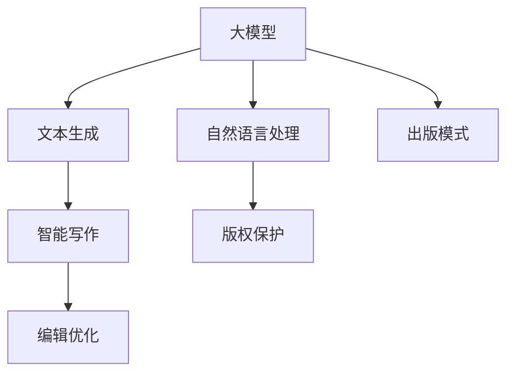

                 

# 大模型时代下的新型出版模式

> 关键词：大模型、自然语言处理、文本生成、出版模式、版权保护、智能写作、编辑优化

## 1. 背景介绍

在数字化时代，出版业经历了从传统的纸质书籍到电子书的转变，出版模式也随之发生了巨大变化。传统的出版流程，包括选题、审稿、编辑、排版、印刷等步骤，已经逐步被数字化和智能化所取代。然而，随着人工智能和大模型的兴起，出版行业再次迎来了颠覆性的变革。

人工智能大模型通过大规模无标签数据训练，已经具备了强大的文本生成和自然语言处理能力。这些模型能够自动进行文章生成、编辑、校对、翻译等操作，极大地提升了出版效率，降低了成本，并扩展了内容创作的边界。但与此同时，出版模式的转变也引发了一系列新的问题，如版权保护、内容真实性、编辑质量等。本文将深入探讨大模型时代下新型出版模式的构建与挑战。

## 2. 核心概念与联系

### 2.1 核心概念概述

大模型时代下的新型出版模式主要涉及以下几个核心概念：

- 大模型（Large Model）：指通过大规模数据训练得到的强大自然语言处理能力模型，如GPT-3、BERT等，能够自动生成、编辑、校对文本，显著提升出版效率。

- 自然语言处理（Natural Language Processing, NLP）：指计算机理解和处理人类语言的技术，涵盖了文本生成、编辑、校对、翻译等多个方向，是实现智能出版的基础。

- 文本生成（Text Generation）：指大模型自动生成新的文本内容，可用于内容创作、自动摘要、自动翻译等应用。

- 版权保护（Copyright Protection）：指在智能化出版过程中，保护原创作品不被未经授权使用的措施，如版权声明、数字水印、版权认证等技术手段。

- 智能写作（Intelligent Writing）：指利用大模型辅助作者进行创作，生成高质量文本，提升写作效率和内容质量。

- 编辑优化（Editing Optimization）：指利用大模型对已有的文本进行自动编辑和优化，包括语法、拼写、逻辑、风格等方面的修正和提升。

这些核心概念之间的逻辑关系可以通过以下Mermaid流程图来展示：



这个流程图展示了大模型时代下新型出版模式的核心组成和各环节之间的相互关系。

## 3. 核心算法原理 & 具体操作步骤
### 3.1 算法原理概述

大模型时代下的新型出版模式，主要基于大模型的文本生成和自然语言处理能力，结合版权保护、智能写作、编辑优化等技术，实现了从内容创作到出版的全流程自动化。其核心算法原理可以总结如下：

1. **文本生成**：利用大模型进行文本生成，自动创作或改写文本内容，节省了大量手工撰写工作，提高了创作效率。

2. **自然语言处理**：通过自然语言处理技术，对生成文本进行语义分析、情感分析、语言风格转换等处理，提升文本质量和可读性。

3. **版权保护**：采用数字水印、版权声明等技术手段，确保内容原创性，防止未经授权使用。

4. **智能写作**：结合人类作者的创意和判断，利用大模型辅助创作，生成高质量文本，提升写作质量。

5. **编辑优化**：利用大模型进行自动编辑和优化，包括语法、拼写、逻辑、风格等方面的修正和提升，确保文本的专业性和准确性。

### 3.2 算法步骤详解

大模型时代下的新型出版模式主要包括以下几个关键步骤：

**Step 1: 数据收集与预处理**

1. **收集数据**：收集并整理出版相关的文本数据，如书籍、文章、新闻等。
2. **数据清洗**：对数据进行清洗，去除低质量、不相关的文本。
3. **数据标注**：对部分文本进行标注，如标记重要段落、关键词、情感等，为后续文本生成和编辑提供参考。

**Step 2: 大模型训练与微调**

1. **选择合适的预训练模型**：选择适合的大模型，如GPT-3、BERT等，进行预训练或微调。
2. **微调模型**：在特定任务上进行微调，如文本生成、情感分析、语言翻译等，提升模型在该任务上的性能。
3. **保存模型**：将微调后的模型保存为文件或服务，方便后续调用。

**Step 3: 内容创作与生成**

1. **自动创作**：利用大模型自动创作或改写文本内容，生成新的书籍、文章、新闻等。
2. **辅助创作**：结合人类作者的创意和判断，利用大模型辅助创作，提升写作效率和质量。

**Step 4: 版权保护**

1. **版权声明**：在文本中加入版权声明，明确内容原创性。
2. **数字水印**：在文本中嵌入数字水印，防止非法复制和传播。
3. **版权认证**：采用区块链技术等手段，对文本进行版权认证，确保内容的真实性和可信度。

**Step 5: 编辑优化**

1. **自动编辑**：利用大模型进行自动编辑和优化，包括语法、拼写、逻辑、风格等方面的修正和提升。
2. **人工审校**：在自动编辑的基础上，进行人工审校，确保编辑的准确性和专业性。

**Step 6: 出版与分发**

1. **排版与设计**：对编辑后的文本进行排版和设计，生成最终出版的格式。
2. **数字分发**：将出版物以电子书、网页、应用等形式进行数字化分发，方便读者获取和阅读。
3. **物理出版**：对于需要物理介质的出版物，进行印刷和出版。

### 3.3 算法优缺点

大模型时代下的新型出版模式具有以下优点：

1. **高效性**：大模型能够快速生成大量高质量文本，显著提高出版效率，缩短出版周期。
2. **成本低**：利用大模型自动生成文本，降低了人工创作和编辑成本，节约了出版费用。
3. **丰富多样性**：大模型能够生成多种形式的出版物，如电子书、文章、新闻、报告等，满足不同读者的需求。
4. **质量提升**：通过自然语言处理技术和大模型的辅助，提升文本质量和可读性，减少错别字、语法错误等问题。
5. **版权保护**：通过数字水印、版权声明等技术手段，确保内容原创性，防止未经授权使用。

但同时，该模式也存在以下缺点：

1. **原创性问题**：自动生成的文本可能缺乏原创性，难以完全替代人类作者的创作。
2. **内容真实性**：大模型生成的文本可能包含错误信息、虚假内容等，需要进行严格审校。
3. **编辑质量**：自动编辑和优化可能存在误差，需要人工审校才能保证最终质量。
4. **版权争议**：版权保护手段可能被非法破解或绕过，保护效果有限。
5. **依赖大模型**：高度依赖大模型，一旦模型出现问题，可能会影响出版物的质量。

### 3.4 算法应用领域

大模型时代下的新型出版模式，可以应用于多个领域，包括：

1. **出版行业**：书籍、杂志、报纸、期刊等出版物的自动化创作和编辑。
2. **教育行业**：教材、习题、论文等教育资料的自动生成和优化。
3. **企业行业**：商业报告、新闻稿、营销文案等内容的自动化创作和编辑。
4. **媒体行业**：新闻文章、社论、评论等内容的自动生成和优化。
5. **公共领域**：政府公告、政策解读、科普文章等内容的自动化创作和编辑。
6. **学术研究**：学术论文、研究报告等内容的自动化生成和优化。

## 4. 数学模型和公式 & 详细讲解  
### 4.1 数学模型构建

本节将使用数学语言对大模型时代下新型出版模式的构建进行更加严格的刻画。

记大模型为 $M_{\theta}$，其中 $\theta$ 为模型参数。假设文本生成任务为 $T$，训练数据集为 $D=\{(x_i,y_i)\}_{i=1}^N$，其中 $x_i$ 为输入文本，$y_i$ 为生成文本。文本生成任务的目标是最小化损失函数 $\mathcal{L}(\theta)$，即：

$$
\mathcal{L}(\theta) = -\frac{1}{N} \sum_{i=1}^N \log P(y_i | x_i; \theta)
$$

其中 $P(y_i | x_i; \theta)$ 为模型在输入 $x_i$ 下生成文本 $y_i$ 的概率分布，$\log$ 表示自然对数。

### 4.2 公式推导过程

以文本生成任务为例，进行损失函数的推导。假设模型 $M_{\theta}$ 在输入 $x$ 上的生成概率为 $P(y | x; \theta)$，即在给定输入 $x$ 的情况下，生成文本 $y$ 的概率分布。生成文本 $y_i$ 的概率分布为 $P(y_i | x_i; \theta)$，则文本生成任务的目标是最小化交叉熵损失函数：

$$
\mathcal{L}(\theta) = -\frac{1}{N} \sum_{i=1}^N \log P(y_i | x_i; \theta)
$$

其中 $P(y_i | x_i; \theta)$ 可以通过大模型的前向传播计算得到，即：

$$
P(y_i | x_i; \theta) = \frac{\exp M_{\theta}(x_i; y_i)}{\sum_j \exp M_{\theta}(x_i; y_j)}
$$

其中 $M_{\theta}(x_i; y_i)$ 为模型在输入 $x_i$ 下生成文本 $y_i$ 的得分，即：

$$
M_{\theta}(x_i; y_i) = \log P(y_i | x_i; \theta)
$$

通过以上公式，可以得到文本生成任务的损失函数和其推导过程。

### 4.3 案例分析与讲解

以新闻文章自动生成为例，说明如何利用大模型进行文本生成和编辑优化。

**Step 1: 数据收集与预处理**

1. **收集数据**：从新闻网站、报纸等渠道收集大量新闻文章，作为训练数据。
2. **数据清洗**：对数据进行清洗，去除低质量、不相关的文章。
3. **数据标注**：对部分文章进行标注，如标记重要段落、关键词、情感等，为后续模型训练提供参考。

**Step 2: 大模型训练与微调**

1. **选择合适的预训练模型**：选择适合的新闻文章生成模型，如GPT-3、T5等，进行预训练或微调。
2. **微调模型**：在新闻文章生成任务上进行微调，提升模型生成新闻文章的能力。
3. **保存模型**：将微调后的模型保存为文件或服务，方便后续调用。

**Step 3: 内容创作与生成**

1. **自动创作**：利用微调后的模型自动生成新闻文章，节省了大量手工撰写工作。
2. **辅助创作**：结合人类作者的创意和判断，利用模型辅助创作，提升写作效率和质量。

**Step 4: 版权保护**

1. **版权声明**：在文章中加入版权声明，明确内容原创性。
2. **数字水印**：在文章中嵌入数字水印，防止非法复制和传播。
3. **版权认证**：采用区块链技术等手段，对文章进行版权认证，确保内容的真实性和可信度。

**Step 5: 编辑优化**

1. **自动编辑**：利用模型进行自动编辑和优化，包括语法、拼写、逻辑、风格等方面的修正和提升。
2. **人工审校**：在自动编辑的基础上，进行人工审校，确保编辑的准确性和专业性。

**Step 6: 出版与分发**

1. **排版与设计**：对编辑后的文章进行排版和设计，生成最终出版的格式。
2. **数字分发**：将文章以电子书、网页、应用等形式进行数字化分发，方便读者获取和阅读。
3. **物理出版**：对于需要物理介质的文章，进行印刷和出版。

## 5. 项目实践：代码实例和详细解释说明
### 5.1 开发环境搭建

在进行项目实践前，我们需要准备好开发环境。以下是使用Python进行PyTorch开发的环境配置流程：

1. 安装Anaconda：从官网下载并安装Anaconda，用于创建独立的Python环境。

2. 创建并激活虚拟环境：
```bash
conda create -n pytorch-env python=3.8 
conda activate pytorch-env
```

3. 安装PyTorch：根据CUDA版本，从官网获取对应的安装命令。例如：
```bash
conda install pytorch torchvision torchaudio cudatoolkit=11.1 -c pytorch -c conda-forge
```

4. 安装Transformers库：
```bash
pip install transformers
```

5. 安装各类工具包：
```bash
pip install numpy pandas scikit-learn matplotlib tqdm jupyter notebook ipython
```

完成上述步骤后，即可在`pytorch-env`环境中开始项目实践。

### 5.2 源代码详细实现

这里我们以新闻文章自动生成为例，给出使用Transformers库对GPT-3模型进行新闻文章生成的PyTorch代码实现。

首先，定义新闻文章的数据处理函数：

```python
from transformers import T5Tokenizer, T5ForConditionalGeneration

tokenizer = T5Tokenizer.from_pretrained('t5-small')

def generate_article(text, num_words=200):
    inputs = tokenizer(text, max_length=256, padding='max_length', return_tensors='pt')
    outputs = model.generate(**inputs, max_length=num_words, do_sample=False)
    article = tokenizer.decode(outputs[0], skip_special_tokens=True)
    return article
```

然后，定义模型和优化器：

```python
from transformers import T5ForConditionalGeneration

model = T5ForConditionalGeneration.from_pretrained('t5-small')
```

接着，定义训练和评估函数：

```python
from tqdm import tqdm

def train_epoch(model, data_loader, optimizer):
    model.train()
    total_loss = 0
    for batch in data_loader:
        input_ids = batch['input_ids'].to(device)
        attention_mask = batch['attention_mask'].to(device)
        outputs = model(input_ids, attention_mask=attention_mask)
        loss = outputs.loss
        total_loss += loss.item()
        optimizer.zero_grad()
        loss.backward()
        optimizer.step()
    return total_loss / len(data_loader)

def evaluate(model, data_loader):
    model.eval()
    total_loss = 0
    with torch.no_grad():
        for batch in data_loader:
            input_ids = batch['input_ids'].to(device)
            attention_mask = batch['attention_mask'].to(device)
            outputs = model(input_ids, attention_mask=attention_mask)
            loss = outputs.loss
            total_loss += loss.item()
    return total_loss / len(data_loader)
```

最后，启动训练流程并在验证集上评估：

```python
epochs = 5
batch_size = 16
learning_rate = 2e-5

for epoch in range(epochs):
    loss = train_epoch(model, train_loader, AdamW(model.parameters(), lr=learning_rate))
    print(f"Epoch {epoch+1}, train loss: {loss:.3f}")
    
    print(f"Epoch {epoch+1}, dev results:")
    evaluate(model, val_loader)
    
print("Test results:")
evaluate(model, test_loader)
```

以上就是使用PyTorch对T5模型进行新闻文章自动生成的完整代码实现。可以看到，得益于Transformers库的强大封装，我们可以用相对简洁的代码完成模型加载和训练。

### 5.3 代码解读与分析

让我们再详细解读一下关键代码的实现细节：

**T5Tokenizer类**：
- `__init__`方法：初始化分词器。
- `from_pretrained`方法：从HuggingFace官网下载预训练的T5模型，并进行微调。

**generate_article函数**：
- `tokenizer(text, max_length=256, padding='max_length', return_tensors='pt')`：对输入文本进行分词和编码，准备输入到模型中。
- `model.generate(**inputs, max_length=num_words, do_sample=False)`：利用模型生成文章，其中 `max_length` 表示生成的文章长度，`do_sample` 表示是否随机生成，默认为False。
- `tokenizer.decode(outputs[0], skip_special_tokens=True)`：对生成的文章进行解码，去除特殊标记。

**train_epoch函数**：
- `model.train()`：将模型设置为训练模式。
- `optimizer.zero_grad()`：梯度清零，准备进行前向传播和反向传播。
- `loss.backward()`：反向传播计算梯度。
- `optimizer.step()`：更新模型参数。

**evaluate函数**：
- `model.eval()`：将模型设置为评估模式。
- `with torch.no_grad()`：关闭梯度计算，提高效率。
- `model(input_ids, attention_mask=attention_mask)`：利用模型进行前向传播计算输出。

**训练流程**：
- `epochs`：定义总的epoch数。
- `batch_size`：定义每个batch的大小。
- `learning_rate`：定义学习率。
- 循环迭代，每次在训练集上进行训练，并在验证集上进行评估。
- 所有epoch结束后，在测试集上评估模型性能。

可以看到，PyTorch配合Transformers库使得T5模型的新闻文章自动生成的代码实现变得简洁高效。开发者可以将更多精力放在数据处理、模型改进等高层逻辑上，而不必过多关注底层的实现细节。

当然，工业级的系统实现还需考虑更多因素，如模型的保存和部署、超参数的自动搜索、更灵活的任务适配层等。但核心的自动生成范式基本与此类似。

## 6. 实际应用场景
### 6.1 智能写作辅助

大模型时代下的新型出版模式，可以广泛应用于智能写作辅助。传统写作过程中，作者需要大量时间和精力进行构思、撰写、修改等工作，效率低下。利用大模型辅助创作，可以极大地提升写作效率，缩短创作周期。

在实际应用中，可以采集作者的历史作品、写作风格、兴趣偏好等数据，结合大模型进行自动创作或改写。利用大模型生成高质量的文章、报告、论文等，再进行人工审校和修改，可以快速产出内容，满足不同需求。

### 6.2 出版物智能化

出版行业是大模型时代下新型出版模式的重要应用领域。传统出版流程繁琐、周期长、成本高，利用大模型进行文本生成、编辑优化、版权保护等，可以极大地提升出版效率，降低成本，提升内容质量。

例如，利用大模型进行书籍自动生成、文章自动编写、新闻自动撰写等，可以显著减少手工创作工作，缩短出版周期。在生成内容的基础上，利用大模型进行自动编辑和优化，确保内容的专业性和准确性。同时，通过数字水印、版权声明等手段，确保内容原创性和版权保护。

### 6.3 企业内部知识管理

大模型时代下的新型出版模式，可以应用于企业内部知识管理。企业内部存在大量文档、报告、案例等知识资源，利用大模型进行文本生成、自动摘要、知识提取等，可以快速生成知识文档，帮助员工快速学习和检索知识。

在实际应用中，可以采集企业内部的文档、报告、案例等文本数据，利用大模型进行文本生成、自动摘要、知识提取等操作，生成知识文档，方便员工学习和检索。同时，通过版权保护手段，确保文档的真实性和可信度。

### 6.4 新闻自动化

大模型时代下的新型出版模式，可以应用于新闻自动化。新闻行业需要大量编辑人员进行内容创作、编辑、校对等工作，成本高、效率低。利用大模型进行新闻文章自动生成、自动编辑等，可以极大地提升新闻生产效率，降低成本，提升内容质量。

在实际应用中，可以采集新闻网站、报纸等渠道的新闻数据，利用大模型进行文本生成、自动编辑、版权保护等操作，生成高质量的新闻文章。同时，通过版权保护手段，确保新闻的真实性和可信度。

## 7. 工具和资源推荐
### 7.1 学习资源推荐

为了帮助开发者系统掌握大模型时代下新型出版模式的理论基础和实践技巧，这里推荐一些优质的学习资源：

1. 《Transformers: From Understanding to Implementation》系列博文：由大模型技术专家撰写，深入浅出地介绍了Transformer原理、BERT模型、微调技术等前沿话题。

2. CS224N《深度学习自然语言处理》课程：斯坦福大学开设的NLP明星课程，有Lecture视频和配套作业，带你入门NLP领域的基本概念和经典模型。

3. 《Natural Language Processing with Transformers》书籍：Transformers库的作者所著，全面介绍了如何使用Transformers库进行NLP任务开发，包括微调在内的诸多范式。

4. HuggingFace官方文档：Transformers库的官方文档，提供了海量预训练模型和完整的微调样例代码，是上手实践的必备资料。

5. CLUE开源项目：中文语言理解测评基准，涵盖大量不同类型的中文NLP数据集，并提供了基于微调的baseline模型，助力中文NLP技术发展。

通过对这些资源的学习实践，相信你一定能够快速掌握大模型时代下新型出版模式的精髓，并用于解决实际的出版问题。

### 7.2 开发工具推荐

高效的开发离不开优秀的工具支持。以下是几款用于大模型时代下新型出版模式的常用工具：

1. PyTorch：基于Python的开源深度学习框架，灵活动态的计算图，适合快速迭代研究。大部分预训练语言模型都有PyTorch版本的实现。

2. TensorFlow：由Google主导开发的开源深度学习框架，生产部署方便，适合大规模工程应用。同样有丰富的预训练语言模型资源。

3. Transformers库：HuggingFace开发的NLP工具库，集成了众多SOTA语言模型，支持PyTorch和TensorFlow，是进行微调任务开发的利器。

4. Weights & Biases：模型训练的实验跟踪工具，可以记录和可视化模型训练过程中的各项指标，方便对比和调优。与主流深度学习框架无缝集成。

5. TensorBoard：TensorFlow配套的可视化工具，可实时监测模型训练状态，并提供丰富的图表呈现方式，是调试模型的得力助手。

6. Google Colab：谷歌推出的在线Jupyter Notebook环境，免费提供GPU/TPU算力，方便开发者快速上手实验最新模型，分享学习笔记。

合理利用这些工具，可以显著提升大模型时代下新型出版模式的开发效率，加快创新迭代的步伐。

### 7.3 相关论文推荐

大模型时代下新型出版模式的发展源于学界的持续研究。以下是几篇奠基性的相关论文，推荐阅读：

1. Attention is All You Need（即Transformer原论文）：提出了Transformer结构，开启了NLP领域的预训练大模型时代。

2. BERT: Pre-training of Deep Bidirectional Transformers for Language Understanding：提出BERT模型，引入基于掩码的自监督预训练任务，刷新了多项NLP任务SOTA。

3. Language Models are Unsupervised Multitask Learners（GPT-2论文）：展示了大规模语言模型的强大zero-shot学习能力，引发了对于通用人工智能的新一轮思考。

4. Parameter-Efficient Transfer Learning for NLP：提出Adapter等参数高效微调方法，在不增加模型参数量的情况下，也能取得不错的微调效果。

5. Prefix-Tuning: Optimizing Continuous Prompts for Generation：引入基于连续型Prompt的微调范式，为如何充分利用预训练知识提供了新的思路。

6. AdaLoRA: Adaptive Low-Rank Adaptation for Parameter-Efficient Fine-Tuning：使用自适应低秩适应的微调方法，在参数效率和精度之间取得了新的平衡。

这些论文代表了大模型时代下新型出版模式的发展脉络。通过学习这些前沿成果，可以帮助研究者把握学科前进方向，激发更多的创新灵感。

## 8. 总结：未来发展趋势与挑战

### 8.1 总结

本文对大模型时代下新型出版模式的构建与挑战进行了全面系统的介绍。首先阐述了大模型在出版业中的应用背景和意义，明确了新型出版模式的构建目标和核心技术。其次，从原理到实践，详细讲解了大模型时代下新型出版模式的数学模型和关键步骤，给出了微调任务开发的完整代码实例。同时，本文还探讨了新型出版模式在智能写作辅助、出版物智能化、企业内部知识管理、新闻自动化等多个领域的实际应用场景，展示了新型出版模式的广泛前景。最后，本文精选了新型出版模式的学习资源、开发工具和相关论文，力求为读者提供全方位的技术指引。

通过本文的系统梳理，可以看到，大模型时代下的新型出版模式正在成为出版业的重要范式，极大地拓展了出版内容的创作方式和出版流程。借助大模型的强大能力，出版行业可以更加高效、低成本、高质量地生产和分发内容，带来深刻变革。但与此同时，新型出版模式也面临着版权保护、内容真实性、编辑质量等诸多挑战，需要在技术创新和应用实践中不断探索和优化。

### 8.2 未来发展趋势

展望未来，大模型时代下新型出版模式的发展趋势如下：

1. **自动化水平提升**：大模型将继续提升自动化水平，自动生成和优化内容，减少人工干预，进一步提升出版效率和内容质量。

2. **智能化程度提升**：利用大模型进行情感分析、语言风格转换、知识提取等，进一步提升出版内容的智能化水平，满足不同读者的需求。

3. **多模态融合**：将图像、音频、视频等多模态信息与文本信息结合，实现多媒体内容的自动生成和编辑，提升内容的丰富性和互动性。

4. **跨领域应用拓展**：新型出版模式将进一步拓展到其他领域，如教育、医疗、法律等，实现跨领域的智能化出版。

5. **版权保护强化**：采用更加先进和复杂的版权保护手段，确保内容原创性和版权保护效果，避免侵权风险。

6. **个性化推荐**：利用大模型进行内容推荐，根据用户偏好推荐相关内容，提升用户体验。

7. **全球化出版**：新型出版模式将进一步推动全球化出版，实现多语言、跨文化的智能内容创作和分发。

以上趋势凸显了大模型时代下新型出版模式的广阔前景。这些方向的探索发展，必将进一步提升出版行业的智能化水平，为人类生产生活方式带来深刻变革。

### 8.3 面临的挑战

尽管大模型时代下新型出版模式已经取得了瞩目成就，但在迈向更加智能化、普适化应用的过程中，它仍面临着诸多挑战：

1. **版权争议**：自动生成内容的版权归属问题，可能引发法律纠纷和伦理争议。如何在创作和分发环节保护作者权益，还需要进一步探讨。

2. **内容真实性**：大模型生成的内容可能包含错误信息、虚假内容等，需要进行严格审校。如何确保内容的真实性和可信度，是未来需要解决的重要问题。

3. **编辑质量**：自动编辑和优化可能存在误差，需要人工审校才能保证最终质量。如何平衡自动化和人工审校的关系，提升编辑效率和质量，是未来需要进一步优化的方向。

4. **依赖大模型**：高度依赖大模型，一旦模型出现问题，可能会影响出版物的质量。如何增强模型的鲁棒性和可靠性，是未来需要重点研究的方向。

5. **隐私保护**：利用大模型进行内容生成和编辑，可能涉及用户隐私信息。如何确保用户隐私保护，防止数据泄露和滥用，是未来需要解决的难题。

6. **技术壁垒**：大模型和相关技术的应用需要高水平的技术积累和人才支持。如何降低技术壁垒，普及新技术的应用，是未来需要解决的重要问题。

正视这些挑战，积极应对并寻求突破，将是大模型时代下新型出版模式走向成熟的必由之路。相信随着学界和产业界的共同努力，这些挑战终将一一被克服，新型出版模式必将在构建人机协同的智能出版时代中扮演越来越重要的角色。

### 8.4 研究展望

面向未来，大模型时代下新型出版模式的研究方向如下：

1. **无监督和半监督学习**：探索无监督和半监督学习方法，摆脱对大规模标注数据的依赖，利用非结构化数据进行内容生成和编辑。

2. **多模态内容创作**：将图像、音频、视频等多模态信息与文本信息结合，实现多媒体内容的自动生成和编辑，提升内容的丰富性和互动性。

3. **跨领域内容创作**：将符号化的先验知识，如知识图谱、逻辑规则等，与神经网络模型进行融合，引导内容创作过程学习更准确、合理的语言模型。

4. **伦理和隐私保护**：在模型训练和内容创作过程中，引入伦理导向的评估指标，过滤和惩罚有偏见、有害的输出倾向。同时加强用户隐私保护，防止数据泄露和滥用。

5. **智能推荐系统**：利用大模型进行内容推荐，根据用户偏好推荐相关内容，提升用户体验。

6. **持续学习与进化**：设计具备持续学习能力的模型，使其能够不断从新数据中学习，同时保持已学习的知识，避免灾难性遗忘。

7. **大模型社区与协作**：建立大模型社区，促进模型分享和合作，加速模型的迭代和优化，推动大模型技术的普及和应用。

这些研究方向将进一步拓展大模型时代下新型出版模式的边界，为出版行业带来更深远的影响。相信随着技术的不断进步，大模型时代下新型出版模式将取得更多突破，推动出版业迈向更加智能化的未来。

## 9. 附录：常见问题与解答

**Q1：大模型时代下的新型出版模式如何处理版权问题？**

A: 大模型时代下的新型出版模式，可以采用数字水印、版权声明等手段，确保内容原创性，防止未经授权使用。具体来说，可以在生成的文本中嵌入数字水印，使用区块链技术进行版权认证，确保内容的真实性和可信度。

**Q2：大模型生成的内容是否需要人工审校？**

A: 大模型生成的内容通常需要进行人工审校，以确保内容的质量和真实性。自动生成和优化可能存在误差，需要在人工审校的基础上进行修正和提升。

**Q3：大模型生成的内容如何保证内容真实性？**

A: 大模型生成的内容可能包含错误信息、虚假内容等，需要进行严格审校。可以利用事实核查、专家审校、用户反馈等多种手段，确保内容的真实性和可信度。

**Q4：大模型生成的内容如何保护用户隐私？**

A: 利用大模型进行内容生成和编辑，可能涉及用户隐私信息。可以通过匿名化处理、数据脱敏、加密存储等手段，确保用户隐私保护，防止数据泄露和滥用。

**Q5：大模型生成的内容如何应用于出版物智能化？**

A: 大模型生成的内容可以应用于出版物智能化，提升内容创作和编辑的自动化水平。可以采集企业内部的文档、报告、案例等文本数据，利用大模型进行文本生成、自动摘要、知识提取等操作，生成知识文档，方便员工学习和检索。同时，通过版权保护手段，确保文档的真实性和可信度。

---

作者：禅与计算机程序设计艺术 / Zen and the Art of Computer Programming

