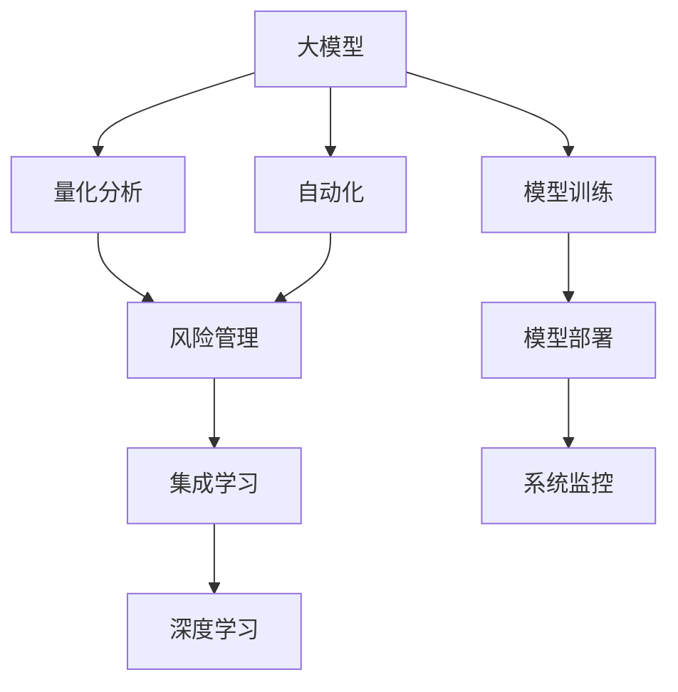

                 

# 大模型时代下的新型风险管理模式

> 关键词：风险管理,大模型,量化分析,自动化,算法优化,动态调整,集成学习,深度学习,模型训练,模型部署,系统监控

## 1. 背景介绍

### 1.1 问题由来

随着人工智能技术的不断进步，尤其是深度学习和大模型的飞速发展，企业在风险管理领域面临着全新的挑战和机遇。传统基于统计学和经验法则的风险管理方法已无法满足复杂多变、动态变化的市场需求。

传统风险管理模式依赖于大量的手工数据分析和经验积累，费时费力，难以适应高频交易和复杂业务场景。在高度不确定的市场环境中，风险管理的实时性和精准度显得尤为重要。

大模型时代下，通过利用深度学习和大模型的强大能力，可以在实时数据流中实现高效的定量风险分析和管理，极大提升风险管理的效率和准确性。

### 1.2 问题核心关键点

大模型时代的风险管理范式主要包含以下几个关键点：

- 高效量化分析：通过深度学习模型自动处理海量数据，快速生成复杂的量化指标，实时评估风险水平。
- 自动化风险决策：基于模型预测结果，自动化调整投资组合和策略，快速应对市场变化。
- 动态调整策略：根据市场动态和实时数据，自动调整模型参数和策略权重，优化风险管理效果。
- 集成学习与融合：结合多种模型和数据源，提升风险管理决策的鲁棒性和可靠性。
- 深度学习模型：利用深度学习模型的自适应能力和泛化能力，适应各种复杂的市场环境和风险场景。

### 1.3 问题研究意义

大模型时代的风险管理模式，对于提升金融机构的竞争力、防范系统性风险、保障市场稳定，具有重要意义：

1. 提升风险管理效率：利用大模型的计算能力和处理能力，实时、自动、精准地进行量化分析，降低人工分析的复杂度和成本。
2. 优化决策过程：基于模型预测，自动化调整策略，迅速响应市场变化，提高决策的速度和准确性。
3. 增强风险控制能力：通过实时动态调整模型和策略，适应市场的不确定性，提高风险控制的有效性和稳定性。
4. 提供综合决策支持：结合多种模型和数据源，提供多维度的风险分析，全面提升决策的科学性和合理性。
5. 促进技术创新：推动深度学习和大模型在金融风险管理领域的创新应用，引领行业发展方向。

## 2. 核心概念与联系

### 2.1 核心概念概述

为更好地理解大模型时代下的新型风险管理模式，本节将介绍几个密切相关的核心概念：

- 大模型(Deep Models)：如神经网络、深度学习模型等，通过多层非线性映射关系学习复杂模式，具备强大的数据处理和预测能力。
- 风险管理(Risk Management)：通过评估、监控和控制风险，保障金融市场的稳健运行和投资者的利益。
- 量化分析(Quantitative Analysis)：利用统计学和数学模型对市场行为进行量化分析，提高决策的科学性和可操作性。
- 自动化(Automation)：利用算法和机器人流程自动化技术，减少人工干预，提高决策和执行的效率和准确性。
- 集成学习(Integrated Learning)：将多个模型和数据源进行融合，提升决策的鲁棒性和全面性。
- 深度学习(Deep Learning)：一种基于多层神经网络的学习范式，通过大量数据和计算资源进行模型训练，具备卓越的特征提取和泛化能力。

这些核心概念之间的逻辑关系可以通过以下Mermaid流程图来展示：



这个流程图展示了大模型时代的风险管理核心概念及其之间的关系：

1. 大模型通过数据训练学习知识，提供精准的预测能力。
2. 量化分析使用模型生成复杂的量化指标，辅助决策。
3. 自动化通过算法和机器人流程，提高执行效率。
4. 风险管理综合考虑模型预测和数据源，控制和防范风险。
5. 集成学习通过多模型融合，提升决策的鲁棒性和全面性。
6. 深度学习利用复杂网络结构，学习更为细致的特征。
7. 模型训练通过大量数据和资源，提高模型的精准度和泛化能力。
8. 模型部署将训练好的模型应用于实际风险管理场景。
9. 系统监控实时监测模型运行状态，保证系统的稳定性和安全性。

这些概念共同构成了大模型时代下的风险管理框架，使得金融机构能够充分利用技术优势，实现风险管理的现代化和智能化。

## 3. 核心算法原理 & 具体操作步骤
### 3.1 算法原理概述

大模型时代下的风险管理，本质上是一个基于深度学习的量化分析与自动化决策过程。其核心思想是：通过深度学习模型自动处理海量数据，生成复杂的量化指标，并结合自动化决策算法，实时调整风险管理策略。

形式化地，假设风险管理场景为 $R$，其包含 $N$ 个风险因素 $X_1, X_2, ..., X_N$。风险管理的任务是找到最优策略 $\pi$，使得在一定时间区间内，风险损失最小化。具体数学表达为：

$$
\min_{\pi} \mathbb{E}[\sum_{t=1}^T f(X_t,\pi)] 
$$

其中 $f$ 为风险函数，$\mathbb{E}$ 表示数学期望。

通过深度学习模型 $M_{\theta}$ 来学习 $f$ 的映射关系，将输入风险因素映射到风险评估结果。自动化的决策算法 $\alpha$ 根据模型输出和预设规则，自动调整风险管理策略。最终，风险管理系统的输出为风险决策 $\pi^*$，满足优化目标。

### 3.2 算法步骤详解

基于深度学习和大模型的风险管理一般包括以下几个关键步骤：

**Step 1: 准备数据集和预训练模型**
- 收集历史市场数据和风险因素数据，构建标注数据集 $D$。
- 选择合适的预训练深度学习模型 $M_{\theta}$，如LSTM、CNN、RNN等，作为风险管理的基础模型。

**Step 2: 训练风险量化模型**
- 使用标注数据集 $D$ 训练风险量化模型 $M_{\theta}$，生成风险评估结果 $f(X)$。
- 选择损失函数和优化算法，如均方误差损失、AdamW等，调整模型参数。

**Step 3: 自动化决策策略设计**
- 设计自动化决策策略 $\alpha$，根据模型输出和预设规则调整风险管理策略。
- 集成多个模型和数据源，提高决策的鲁棒性和全面性。

**Step 4: 动态调整策略**
- 根据实时市场数据和风险因素，动态调整模型参数和策略权重。
- 实时监测系统运行状态，及时调整策略以应对市场变化。

**Step 5: 系统部署和监控**
- 将训练好的模型和策略部署到实际风险管理系统中。
- 实时监控系统运行状态，设置异常告警阈值，确保系统稳定性和安全性。

以上是基于深度学习和大模型的风险管理一般流程。在实际应用中，还需要针对具体风险管理任务的特点，对各环节进行优化设计，如改进训练目标函数，引入更多的正则化技术，搜索最优的超参数组合等，以进一步提升系统性能。

### 3.3 算法优缺点

大模型时代下的风险管理方法具有以下优点：
1. 实时性好。基于深度学习模型的高效计算能力，可以实时生成风险评估结果，快速调整策略。
2. 数据驱动。利用大数据和深度学习模型，自动提取和分析复杂的风险特征，提高决策的科学性。
3. 鲁棒性强。通过集成学习，结合多种模型和数据源，提升风险管理的鲁棒性和可靠性。
4. 决策自动化。自动化的决策算法，减少人工干预，提高决策和执行的效率和准确性。

同时，该方法也存在一定的局限性：
1. 数据需求大。深度学习模型需要大量高质量的数据进行训练，数据准备成本较高。
2. 计算资源需求高。深度学习模型的训练和推理需要大量的计算资源，对硬件设施要求较高。
3. 可解释性差。深度学习模型的黑盒特性，导致其决策过程缺乏可解释性，难以进行调试和优化。
4. 模型复杂度高。深度学习模型参数多，复杂度高，模型部署和维护成本较大。
5. 过拟合风险。深度学习模型可能过拟合训练数据，导致在实际应用中泛化性能不足。

尽管存在这些局限性，但就目前而言，基于深度学习和大模型的风险管理方法仍是大数据时代下风险管理的核心技术范式。未来相关研究的重点在于如何进一步降低对计算资源的依赖，提高模型的可解释性，同时兼顾决策的实时性和鲁棒性等因素。

### 3.4 算法应用领域

大模型时代下的风险管理方法，在金融、保险、资产管理等多个领域得到了广泛的应用，具体包括：

- 金融市场风险管理：通过深度学习模型预测股票、债券、期货等金融资产的价格波动和风险水平。
- 信用风险管理：利用深度学习模型评估客户的信用风险，决定贷款审批和额度调整。
- 保险精算和定价：使用深度学习模型进行保险赔付预测和风险评估，优化保险产品定价策略。
- 资产组合优化：通过深度学习模型优化投资组合的配置和权重，最大化收益并降低风险。
- 反欺诈检测：利用深度学习模型检测异常交易和欺诈行为，提高金融系统的安全性。
- 高频交易：结合深度学习模型和算法，进行实时高频交易，快速响应市场变化。
- 量化交易策略：设计深度学习模型，优化量化交易策略，提高交易执行效率。

## 4. 数学模型和公式 & 详细讲解
### 4.1 数学模型构建

本节将使用数学语言对基于深度学习和大模型的风险管理过程进行更加严格的刻画。

假设风险管理场景为 $R$，其中 $N$ 个风险因素 $X_1, X_2, ..., X_N$，目标是最小化在一定时间区间 $T$ 内的风险损失 $f(X_t,\pi)$。设 $\theta$ 为深度学习模型的参数，$M_{\theta}$ 为风险量化模型，其输出为风险评估结果 $f(X_t)$。

风险管理的优化目标为：

$$
\min_{\pi} \mathbb{E}[\sum_{t=1}^T f(X_t,\pi)]
$$

在实际应用中，通常使用基于梯度的优化算法（如AdamW、SGD等）来近似求解上述最优化问题。设 $\eta$ 为学习率，$\lambda$ 为正则化系数，则参数的更新公式为：

$$
\theta \leftarrow \theta - \eta \nabla_{\theta}\mathcal{L}(\theta) - \eta\lambda\theta
$$

其中 $\nabla_{\theta}\mathcal{L}(\theta)$ 为损失函数对参数 $\theta$ 的梯度，可通过反向传播算法高效计算。

### 4.2 公式推导过程

以下我们以信用风险评估为例，推导风险量化模型及其梯度计算公式。

假设风险管理场景 $R$ 包含 $N$ 个风险因素 $X_1, X_2, ..., X_N$，其中 $X_i$ 为第 $i$ 个风险因素，$y_i$ 为第 $i$ 个风险因素的真实标签，$f(X_i)$ 为模型输出，即第 $i$ 个风险因素的风险评估结果。

定义风险量化模型 $M_{\theta}$ 为多层神经网络，输出为风险评估结果 $f(X_i)$，其计算公式为：

$$
f(X_i) = \sigma(\sum_{j=1}^{d} w_j \phi(X_i) + b)
$$

其中 $\sigma$ 为激活函数，$d$ 为神经网络的输出维数，$w_j$ 为第 $j$ 层的权重参数，$b$ 为偏置项，$\phi(X_i)$ 为第 $i$ 个风险因素的特征表示。

假设损失函数为均方误差损失，则风险量化模型的损失函数为：

$$
\mathcal{L}(\theta) = \frac{1}{N} \sum_{i=1}^N (y_i - f(X_i))^2
$$

根据链式法则，损失函数对参数 $\theta$ 的梯度为：

$$
\frac{\partial \mathcal{L}(\theta)}{\partial \theta} = \frac{1}{N} \sum_{i=1}^N 2(y_i - f(X_i)) \frac{\partial f(X_i)}{\partial \theta}
$$

其中 $\frac{\partial f(X_i)}{\partial \theta}$ 可进一步递归展开，利用自动微分技术完成计算。

在得到损失函数的梯度后，即可带入参数更新公式，完成模型的迭代优化。重复上述过程直至收敛，最终得到适应风险管理场景的最优模型参数 $\theta^*$。

## 5. 项目实践：代码实例和详细解释说明
### 5.1 开发环境搭建

在进行风险管理项目实践前，我们需要准备好开发环境。以下是使用Python进行TensorFlow开发的环境配置流程：

1. 安装Anaconda：从官网下载并安装Anaconda，用于创建独立的Python环境。

2. 创建并激活虚拟环境：
```bash
conda create -n tf-env python=3.8 
conda activate tf-env
```

3. 安装TensorFlow：根据CUDA版本，从官网获取对应的安装命令。例如：
```bash
conda install tensorflow
```

4. 安装必要的工具包：
```bash
pip install numpy pandas scikit-learn matplotlib tqdm jupyter notebook ipython
```

完成上述步骤后，即可在`tf-env`环境中开始项目实践。

### 5.2 源代码详细实现

这里我们以信用风险管理为例，给出使用TensorFlow进行信用评分模型的PyTorch代码实现。

首先，定义信用评分问题的数据处理函数：

```python
import tensorflow as tf
import numpy as np
from tensorflow.keras.layers import Input, Dense, Dropout, Activation
from tensorflow.keras.models import Model

def data_loader(batch_size):
    def generator():
        while True:
            # 生成随机数据
            num_samples = 1000
            X = np.random.normal(size=(num_samples, 5))
            y = np.random.normal(size=num_samples)
            yield X, y
    return tf.data.Dataset.from_generator(generator, output_signature=(tf.float32, tf.float32)).shuffle(1000).batch(batch_size)
```

然后，定义模型和优化器：

```python
from tensorflow.keras.optimizers import Adam

# 定义模型
X = Input(shape=(5,))
H1 = Dense(64, activation='relu')(X)
H2 = Dense(64, activation='relu')(H1)
output = Dense(1, activation='sigmoid')(H2)

model = Model(inputs=X, outputs=output)
model.compile(optimizer=Adam(lr=0.01), loss='binary_crossentropy', metrics=['accuracy'])

# 定义优化器
optimizer = tf.keras.optimizers.Adam(learning_rate=0.01)
```

接着，定义训练和评估函数：

```python
def train_model(model, data_loader, epochs):
    model.fit(data_loader, epochs=epochs, validation_split=0.2)

def evaluate_model(model, data_loader):
    model.evaluate(data_loader)
```

最后，启动训练流程并在测试集上评估：

```python
epochs = 10
batch_size = 32

X_train, y_train = next(iter(data_loader(batch_size)))
y_train = tf.reshape(y_train, (len(y_train), 1))

train_model(model, data_loader(batch_size), epochs)
evaluate_model(model, data_loader(batch_size))
```

以上就是使用TensorFlow对信用评分模型进行训练的完整代码实现。可以看到，TensorFlow库的强大封装使得模型训练过程变得简洁高效。

### 5.3 代码解读与分析

让我们再详细解读一下关键代码的实现细节：

**data_loader函数**：
- 生成器函数：通过循环生成随机数据，保证数据集的随机性和多样性。
- 数据集加载：利用TensorFlow的DataLoader，将生成器函数的数据转换为模型可用的格式，并进行批处理、打乱和验证集划分。

**模型定义**：
- 定义神经网络结构：包括输入层、两个隐藏层和一个输出层。
- 激活函数：使用ReLU激活函数，提高模型的非线性表达能力。
- 损失函数：使用二元交叉熵损失，适用于二分类问题。

**模型编译**：
- 选择优化器：使用Adam优化器，自适应调整学习率。
- 设置损失函数：使用二元交叉熵损失，用于衡量模型预测和真实标签的差异。
- 选择评估指标：使用准确率作为评估指标，评估模型在验证集上的性能。

**训练函数**：
- 定义训练过程：通过fit函数，指定数据集、训练轮数和验证集比例，进行模型训练。
- 实时评估：每轮训练结束后，输出训练集和验证集上的损失和准确率。

**评估函数**：
- 使用evaluate函数，对模型进行测试集上的评估，输出测试集上的损失和准确率。

通过以上代码，可以构建一个简单的信用评分模型，并对其进行训练和评估。在实际应用中，还需要结合更多金融领域的专业知识，进一步优化模型架构和训练过程。

## 6. 实际应用场景
### 6.1 信用风险管理

基于深度学习和大模型的信用风险管理方法，可以在银行和金融机构中广泛应用。传统的信用风险评估依赖于人工评分和经验法则，耗时费力且难以适应复杂多变的市场环境。而使用深度学习模型进行信用评分，可以大幅提高评估的准确性和效率，降低信用风险管理的成本。

在技术实现上，可以收集客户的信用历史数据、行为数据、社交网络信息等，构建标注数据集。在此基础上训练深度学习模型，生成风险评估结果。通过自动化决策算法，根据模型输出和预设规则，调整信用评分和贷款审批策略，实时监控风险水平，确保信贷资产的质量。

### 6.2 市场风险管理

大模型时代下的市场风险管理，同样受益于深度学习和大模型的强大计算能力。传统市场风险管理依赖于历史数据和经验法则，难以应对高频交易和复杂市场环境。而利用深度学习模型，可以实时、自动、精准地进行量化分析，评估市场波动和风险水平。

具体而言，可以收集市场行情数据、交易数据、宏观经济指标等，构建标注数据集。在此基础上训练深度学习模型，生成市场风险评估结果。通过自动化决策算法，根据模型输出和预设规则，自动调整投资组合和策略，快速应对市场变化，提高资产配置的效率和稳健性。

### 6.3 反欺诈检测

反欺诈检测是大模型时代下的另一个重要应用场景。传统的欺诈检测依赖于人工规则和异常检测算法，难以应对日益复杂的欺诈手段。而利用深度学习模型，可以实时、自动地检测异常交易和欺诈行为，提高金融系统的安全性。

在技术实现上，可以收集交易数据、用户行为数据、社交网络信息等，构建标注数据集。在此基础上训练深度学习模型，生成欺诈风险评估结果。通过自动化决策算法，根据模型输出和预设规则，实时检测异常交易，及时预警并采取相应措施，降低欺诈带来的损失。

### 6.4 未来应用展望

随着深度学习和大模型的不断发展，基于这些技术的风险管理方法将在更多领域得到应用，为传统行业带来变革性影响。

在保险精算和定价领域，深度学习模型可以优化保险赔付预测和风险评估，优化保险产品定价策略，提高保险公司的经营效率和风险管理能力。

在资产管理领域，深度学习模型可以优化投资组合的配置和权重，提高资产管理的效果和稳健性，降低市场波动对投资组合的影响。

在高频交易领域，深度学习模型可以优化高频交易策略，提高交易执行效率和盈利能力，降低交易成本和风险。

此外，在物流、医疗、能源等诸多领域，深度学习和大模型的应用也正逐步拓展，为这些行业带来新的发展机遇。

## 7. 工具和资源推荐
### 7.1 学习资源推荐

为了帮助开发者系统掌握大模型时代下的风险管理技术，这里推荐一些优质的学习资源：

1. 《深度学习：基于Python的实现》：由深度学习领域专家撰写，深入浅出地介绍了深度学习的基本原理和实现方法，适合入门和进阶学习。

2. 《TensorFlow实战》：TensorFlow官方文档和实战指南，详细介绍了TensorFlow的基本功能和应用场景，适合快速上手使用。

3. 《机器学习实战》：由机器学习领域专家撰写，涵盖多种机器学习算法的实现和应用，适合初学者和进阶学习。

4. Kaggle：全球最大的数据科学竞赛平台，提供丰富的数据集和竞赛机会，适合实践和竞赛学习。

5. Coursera和edX：全球知名的在线教育平台，提供众多深度学习和机器学习相关课程，适合系统学习。

通过这些资源的学习实践，相信你一定能够快速掌握大模型时代下的风险管理技术，并用于解决实际的金融风险问题。
###  7.2 开发工具推荐

高效的开发离不开优秀的工具支持。以下是几款用于大模型时代下风险管理开发的常用工具：

1. TensorFlow和PyTorch：领先的深度学习框架，支持多种模型和算法，适合深度学习模型的开发和训练。

2. Keras和TensorFlow Keras：高层次的API，简化了深度学习模型的构建过程，适合初学者使用。

3. Jupyter Notebook：交互式的编程环境，支持代码编写和数据可视化，适合数据处理和模型调试。

4. Weights & Biases：模型训练的实验跟踪工具，可以记录和可视化模型训练过程中的各项指标，方便对比和调优。

5. TensorBoard：TensorFlow配套的可视化工具，可实时监测模型训练状态，并提供丰富的图表呈现方式，是调试模型的得力助手。

6. Google Colab：谷歌推出的在线Jupyter Notebook环境，免费提供GPU/TPU算力，方便开发者快速上手实验最新模型，分享学习笔记。

合理利用这些工具，可以显著提升大模型时代下风险管理项目的开发效率，加快创新迭代的步伐。

### 7.3 相关论文推荐

大模型时代下的风险管理技术正处于快速发展阶段，以下几篇奠基性的相关论文，推荐阅读：

1. 《Deep Learning for Credit Risk Analysis》：研究了深度学习在信用评分和风险管理中的应用，展示了深度模型在预测准确性和效率方面的优势。

2. 《Quantitative Risk Management with Deep Learning》：总结了深度学习在量化风险管理中的多种应用，包括信用风险、市场风险、违约预测等。

3. 《Fraud Detection with Deep Learning》：展示了深度学习在欺诈检测中的实时性和准确性，以及如何利用生成对抗网络（GAN）进行异常检测。

4. 《Deep Learning for Market Risk Management》：研究了深度学习在市场风险管理中的应用，包括模型构建、特征工程和模型评估。

5. 《Real-Time Risk Management with Deep Learning》：总结了深度学习在实时风险管理中的多维应用，包括高频交易、量化交易、模型优化等。

这些论文代表了深度学习在金融风险管理领域的最新进展，有助于深入理解这一前沿技术的应用前景和研究热点。

## 8. 总结：未来发展趋势与挑战
### 8.1 总结

本文对大模型时代下的新型风险管理模式进行了全面系统的介绍。首先阐述了大模型和深度学习在风险管理中的应用背景和意义，明确了深度学习在量化分析与自动化决策中的重要作用。其次，从原理到实践，详细讲解了深度学习在大模型时代下的风险管理过程，给出了完整的代码实现和模型评估方法。同时，本文还广泛探讨了深度学习在信用风险管理、市场风险管理、反欺诈检测等多个领域的应用前景，展示了深度学习技术的广阔应用空间。此外，本文精选了深度学习在大模型时代下的学习资源、开发工具和相关论文，力求为读者提供全方位的技术指引。

通过本文的系统梳理，可以看到，大模型时代下的风险管理模式正在成为金融行业的重要技术范式，极大地提升了风险管理的效率和准确性。未来，伴随深度学习和大模型的不断发展，基于这些技术的风险管理技术必将在更多领域得到应用，为传统行业带来变革性影响。

### 8.2 未来发展趋势

展望未来，大模型时代下的风险管理技术将呈现以下几个发展趋势：

1. 模型规模持续增大。随着算力成本的下降和数据规模的扩张，深度学习模型的参数量还将持续增长。超大规模深度学习模型蕴含的丰富知识，有望支撑更加复杂多变的风险管理任务。

2. 自动化程度提高。随着算法和机器人流程自动化技术的不断发展，风险管理流程将更加自动化、智能化，减少人工干预，提高决策和执行的效率和准确性。

3. 多模态融合加强。结合图像、语音、文本等多种数据源，提高风险管理决策的全面性和鲁棒性。

4. 实时化水平提升。通过分布式计算和流式数据处理技术，实现实时化、动态化的风险管理，适应高频交易和实时数据流的挑战。

5. 异构数据融合增强。利用深度学习模型，融合来自不同渠道和格式的数据，提高风险管理的综合性和精度。

6. 跨领域应用拓展。将深度学习技术应用于金融以外的领域，如医疗、物流、能源等，提供跨领域的风险管理解决方案。

7. 深度学习模型的不断优化。通过模型架构、优化算法、正则化技术的不断改进，提高深度学习模型的泛化能力和鲁棒性。

以上趋势凸显了大模型时代下风险管理技术的广阔前景。这些方向的探索发展，必将进一步提升风险管理的效果和效率，为金融机构带来新的价值。

### 8.3 面临的挑战

尽管大模型时代下的风险管理技术已经取得了瞩目成就，但在迈向更加智能化、普适化应用的过程中，它仍面临着诸多挑战：

1. 数据质量和标注成本高。深度学习模型需要大量高质量的数据进行训练，数据准备和标注成本较高。如何获取和处理大规模高质量的数据，仍是一个重要的技术难题。

2. 计算资源需求大。深度学习模型的训练和推理需要大量的计算资源，对硬件设施要求较高。如何降低计算成本，提高算力利用率，仍是一个关键的技术挑战。

3. 模型可解释性差。深度学习模型的黑盒特性，导致其决策过程缺乏可解释性，难以进行调试和优化。如何提高模型的可解释性，增强用户信任，仍是一个重要的研究方向。

4. 过拟合风险高。深度学习模型可能过拟合训练数据，导致在实际应用中泛化性能不足。如何降低过拟合风险，提高模型的泛化能力，仍是一个技术挑战。

5. 系统安全性差。深度学习模型可能学习到有害信息，导致在实际应用中产生误导性或歧视性的输出。如何保障模型的安全性，避免恶意用途，仍是一个重要的研究方向。

6. 异构数据融合难度大。结合多种数据源，进行深度学习模型的融合，仍是一个技术难题。如何提升异构数据融合的效率和效果，仍是一个关键的技术挑战。

尽管面临这些挑战，但随着深度学习和大模型的不断发展，基于这些技术的风险管理技术必将在更多领域得到应用，为传统行业带来变革性影响。未来，学界和产业界还需进一步探索优化深度学习模型、降低计算成本、提高模型可解释性和安全性等技术难题，才能真正实现深度学习在风险管理中的大规模落地。

### 8.4 研究展望

面对大模型时代下风险管理所面临的挑战，未来的研究需要在以下几个方面寻求新的突破：

1. 探索无监督和半监督学习范式。摆脱对大规模标注数据的依赖，利用自监督学习、主动学习等无监督和半监督方法，最大限度利用非结构化数据，实现更加灵活高效的风险管理。

2. 研究参数高效和计算高效的模型训练方法。开发更加参数高效的模型，在固定大部分预训练参数的同时，只更新极少量的任务相关参数。同时优化模型的计算图，减少前向传播和反向传播的资源消耗，实现更加轻量级、实时性的部署。

3. 引入因果分析和博弈论工具。通过引入因果推断和博弈论思想，增强风险管理决策的因果关系，学习更加普适、鲁棒的风险特征，从而提升决策的科学性和合理性。

4. 融合更多先验知识。将符号化的先验知识，如知识图谱、逻辑规则等，与深度学习模型进行巧妙融合，引导风险管理过程学习更准确、合理的风险特征。

5. 结合因果分析和博弈论工具。通过引入因果推断和博弈论工具，增强风险管理决策的因果关系，学习更加普适、鲁棒的风险特征，从而提升决策的科学性和合理性。

6. 纳入伦理道德约束。在模型训练目标中引入伦理导向的评估指标，过滤和惩罚有偏见、有害的输出倾向。同时加强人工干预和审核，建立模型行为的监管机制，确保输出符合人类价值观和伦理道德。

这些研究方向的探索，必将引领深度学习在金融风险管理领域的进一步发展，推动深度学习在更多领域的创新应用。只有勇于创新、敢于突破，才能真正实现深度学习在风险管理中的大规模落地。

## 9. 附录：常见问题与解答

**Q1：深度学习模型在风险管理中的应用有哪些？**

A: 深度学习模型在风险管理中的应用非常广泛，具体包括：

1. 信用风险管理：利用深度学习模型进行信用评分和风险预测，优化信贷审批和贷款策略。
2. 市场风险管理：使用深度学习模型进行市场波动预测和风险评估，优化投资组合和策略。
3. 反欺诈检测：通过深度学习模型检测异常交易和欺诈行为，提高金融系统的安全性。
4. 高频交易：结合深度学习模型进行高频交易策略优化，提高交易执行效率和盈利能力。
5. 量化交易：设计深度学习模型进行量化交易策略优化，提高交易执行效率和盈利能力。
6. 物流风险管理：利用深度学习模型进行物流异常检测和风险评估，优化物流流程和决策。

这些应用展示了深度学习模型在风险管理中的强大潜力和广泛应用。

**Q2：如何提高深度学习模型的泛化能力？**

A: 提高深度学习模型的泛化能力可以从以下几个方面入手：

1. 增加数据量和多样性：收集更多的数据，尤其是异构和高质量的数据，增加模型的泛化能力。

2. 数据增强技术：通过数据增强技术，如回译、旋转、裁剪等，扩充训练集，提高模型的泛化能力。

3. 正则化技术：使用L2正则、Dropout、Early Stopping等正则化技术，防止模型过拟合训练数据。

4. 参数高效微调：采用参数高效微调技术，只更新少量的模型参数，保持模型的泛化能力。

5. 集成学习：结合多个模型进行集成学习，提高模型的鲁棒性和泛化能力。

6. 对抗训练：使用对抗样本训练模型，提高模型的鲁棒性和泛化能力。

通过这些方法，可以显著提高深度学习模型的泛化能力，使其在实际应用中表现更加稳定和准确。

**Q3：深度学习模型在金融风险管理中的优势是什么？**

A: 深度学习模型在金融风险管理中的优势主要体现在以下几个方面：

1. 高效性：深度学习模型能够快速处理海量数据，实时生成风险评估结果，提高决策效率。

2. 准确性：深度学习模型能够自动提取和分析复杂的风险特征，提高风险评估的准确性。

3. 自动化：深度学习模型结合自动化决策算法，能够自动调整风险管理策略，减少人工干预。

4. 可解释性：深度学习模型通过可视化工具和可解释性方法，可以提高模型的可解释性，增强用户信任。

5. 鲁棒性：深度学习模型结合多种数据源和正则化技术，可以提高模型的鲁棒性和稳定性。

6. 实时化：深度学习模型结合实时数据流处理技术，可以实现实时化的风险管理，适应高频交易和实时数据流的挑战。

综上所述，深度学习模型在金融风险管理中具备高效、准确、自动化、可解释性和鲁棒性等优势，能够提供全面的风险管理解决方案。

**Q4：深度学习模型在风险管理中面临的主要挑战是什么？**

A: 深度学习模型在风险管理中面临的主要挑战包括：

1. 数据准备成本高：深度学习模型需要大量高质量的数据进行训练，数据准备和标注成本较高。

2. 计算资源需求大：深度学习模型的训练和推理需要大量的计算资源，对硬件设施要求较高。

3. 模型可解释性差：深度学习模型的黑盒特性，导致其决策过程缺乏可解释性，难以进行调试和优化。

4. 过拟合风险高：深度学习模型可能过拟合训练数据，导致在实际应用中泛化性能不足。

5. 系统安全性差：深度学习模型可能学习到有害信息，导致在实际应用中产生误导性或歧视性的输出。

6. 异构数据融合难度大：结合多种数据源，进行深度学习模型的融合，仍是一个技术难题。

7. 模型优化难度大：深度学习模型的优化过程中，需要平衡复杂性和泛化能力，找到最优模型配置。

8. 跨领域应用难度大：将深度学习技术应用于金融以外的领域，如医疗、物流等，仍需要大量的跨领域数据和模型优化。

尽管面临这些挑战，但随着深度学习和大模型的不断发展，基于这些技术的风险管理技术必将在更多领域得到应用，为传统行业带来变革性影响。未来，学界和产业界还需进一步探索优化深度学习模型、降低计算成本、提高模型可解释性和安全性等技术难题，才能真正实现深度学习在风险管理中的大规模落地。

**Q5：深度学习模型在信用风险管理中的具体应用是什么？**

A: 深度学习模型在信用风险管理中的具体应用包括：

1. 信用评分：利用深度学习模型对客户的信用历史数据、行为数据、社交网络信息等进行综合分析，生成信用评分。

2. 违约预测：利用深度学习模型对客户的违约风险进行预测，优化贷款审批和额度调整。

3. 贷款定价：利用深度学习模型对客户的信用风险进行评估，优化贷款定价策略。

4. 违约检测：利用深度学习模型对客户的交易数据、行为数据进行实时分析，及时预警和检测违约风险。

5. 风险定价：利用深度学习模型对贷款组合的违约风险进行评估，优化风险定价策略。

6. 欺诈检测：利用深度学习模型对客户的交易数据、行为数据进行实时分析，及时预警和检测欺诈行为。

通过这些具体应用，深度学习模型能够提供全面的信用风险管理解决方案，提高信用风险管理的效率和准确性。

---

作者：禅与计算机程序设计艺术 / Zen and the Art of Computer Programming

