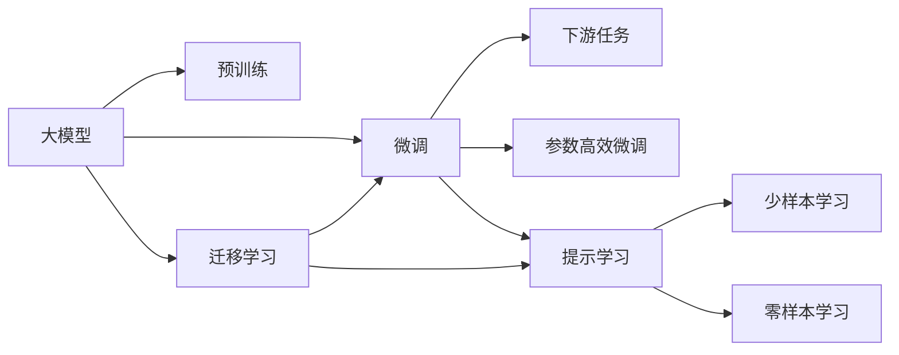

                 

# 大模型深刻改变生活方式

在当今数字化时代，人工智能（AI）技术正以惊人的速度渗透到各行各业，深刻改变着人们的生活和工作方式。尤其是大模型（Large Model），以其庞大的参数量和卓越的性能，引领了人工智能技术的革命。本文将从背景介绍、核心概念与联系、核心算法原理与具体操作步骤、数学模型与公式推导、项目实践与代码实现、实际应用场景、工具和资源推荐、总结与未来发展趋势与挑战等多个维度，深入探讨大模型如何深刻改变我们的生活方式。

## 1. 背景介绍

### 1.1 问题由来
近年来，深度学习技术的快速发展，尤其是大模型的问世，带来了巨大的变革。例如，GPT-3等大规模预训练语言模型通过在无标签数据上进行自监督学习，已经展现了强大的语言理解和生成能力。这种模型不仅能够进行文本分类、情感分析、机器翻译等传统任务，还能在自然语言问答、代码生成、游戏策略制定等创新领域展现其独特的价值。大模型的出现，使得人工智能技术更加普及，逐渐深入到普通人的日常生活之中。

### 1.2 问题核心关键点
大模型的成功在于其庞大的参数量、丰富的知识储备和强大的泛化能力。通过在大规模数据上预训练，大模型能够学习到通用的语言表示，而在下游任务上的微调（Fine-Tuning）则能够使这些知识精准应用于特定场景，提升模型性能。基于大模型的微调方法，不仅减少了从头开发模型所需的资源和时间，也提升了模型在特定领域的应用效果。

## 2. 核心概念与联系

### 2.1 核心概念概述
大模型通常指的是在预训练阶段使用大量数据进行学习，拥有数亿甚至数十亿参数的神经网络模型。这些模型在特定任务上进行了微调，以适应该任务的需求。微调是利用已有的预训练模型，通过有标签数据进行进一步训练，从而优化模型在该任务上的性能。

### 2.2 核心概念原理和架构的 Mermaid 流程图(Mermaid 流程节点中不要有括号、逗号等特殊字符)



这个流程图展示了大模型的核心概念及其之间的关系：大模型通过预训练获得基础能力；微调是使模型适应特定任务的关键步骤；参数高效微调和提示学习等技术进一步提升了微调的效果；迁移学习是连接预训练模型与下游任务的桥梁；零样本学习和少样本学习则在不更新模型参数的情况下，使模型具备了一定的预测能力。这些核心概念共同构成了大模型微调的应用框架，使其能够在大规模任务中发挥其强大的语言理解和生成能力。

## 3. 核心算法原理 & 具体操作步骤

### 3.1 算法原理概述
基于大模型的微调方法，通常采用有监督学习范式，通过在特定任务上使用有标签数据进行微调，从而提升模型在该任务上的性能。微调过程可以分为以下步骤：
1. 准备预训练模型和大规模数据集。
2. 添加任务适配层，并选择合适的损失函数。
3. 设置微调超参数，包括学习率、优化器、正则化等。
4. 执行梯度训练，在标注数据上更新模型参数。
5. 评估模型性能，在验证集上调整模型参数。
6. 测试和部署，在测试集上评估微调后的模型，并将其集成到实际应用中。

### 3.2 算法步骤详解
#### 3.2.1 准备预训练模型和大规模数据集
预训练模型可以是开源的大模型，如BERT、GPT等。数据集需要标注好的样本，用于微调模型的训练。

#### 3.2.2 添加任务适配层
任务适配层根据具体任务类型设计，通常包括输出层和损失函数。例如，分类任务使用softmax输出和交叉熵损失函数；生成任务使用解码器输出和负对数似然损失函数。

#### 3.2.3 设置微调超参数
超参数包括学习率、优化器（如Adam、SGD）、批量大小、迭代次数、正则化强度等。需要根据具体任务进行调整。

#### 3.2.4 执行梯度训练
在标注数据上进行前向传播计算损失，反向传播计算梯度，使用优化器更新模型参数。

#### 3.2.5 评估模型性能
在验证集上评估模型性能，根据性能指标决定是否继续微调。

#### 3.2.6 测试和部署
在测试集上评估微调后的模型，并将其集成到实际应用中。

### 3.3 算法优缺点
#### 3.3.1 优点
- 简单易用：微调方法易于实现，只需要少量的标注数据和简单的微调脚本即可。
- 效果显著：微调能够显著提升模型在特定任务上的性能，特别是在小数据集上表现优异。
- 参数高效：通过参数高效微调技术，可以在不更新大部分预训练参数的情况下，提升模型性能。

#### 3.3.2 缺点
- 依赖标注数据：微调效果很大程度上取决于标注数据的质量和数量，获取高质量标注数据的成本较高。
- 迁移能力有限：当目标任务与预训练数据的分布差异较大时，微调的性能提升有限。
- 可解释性不足：微调模型通常是“黑盒”系统，难以解释其内部工作机制和决策逻辑。

### 3.4 算法应用领域
大模型的微调方法已经广泛应用于各种NLP任务，如文本分类、命名实体识别、关系抽取、问答系统、机器翻译、文本摘要、对话系统等。这些应用场景覆盖了自然语言处理的各个方面，展示了大模型微调技术的强大能力。

## 4. 数学模型和公式 & 详细讲解 & 举例说明

### 4.1 数学模型构建
假设大模型为 $M_{\theta}$，其中 $\theta$ 为模型参数。给定下游任务 $T$ 的标注数据集 $D=\{(x_i,y_i)\}_{i=1}^N$，其中 $x_i$ 为输入文本，$y_i$ 为对应的标签。微调的目标是最小化损失函数 $\mathcal{L}(\theta)$。

### 4.2 公式推导过程
以二分类任务为例，假设模型输出为 $\hat{y}=M_{\theta}(x)$，真实标签 $y \in \{0,1\}$。二分类交叉熵损失函数定义为：
$$
\ell(M_{\theta}(x),y) = -[y\log \hat{y} + (1-y)\log (1-\hat{y})]
$$
则经验风险为：
$$
\mathcal{L}(\theta) = \frac{1}{N} \sum_{i=1}^N \ell(M_{\theta}(x_i),y_i)
$$
根据链式法则，损失函数对参数 $\theta_k$ 的梯度为：
$$
\frac{\partial \mathcal{L}(\theta)}{\partial \theta_k} = -\frac{1}{N}\sum_{i=1}^N (\frac{y_i}{M_{\theta}(x_i)}-\frac{1-y_i}{1-M_{\theta}(x_i)}) \frac{\partial M_{\theta}(x_i)}{\partial \theta_k}
$$

### 4.3 案例分析与讲解
以命名实体识别（NER）任务为例，使用BERT模型进行微调。首先，将预训练模型作为初始化参数，在标注数据集上进行微调。微调过程中，使用BERT模型的token-wise输出作为特征输入，通过全连接层进行分类。分类器的损失函数为交叉熵损失。微调过程如下：
1. 准备BERT模型和标注数据集。
2. 添加任务适配层，包括全连接层和交叉熵损失函数。
3. 设置微调超参数，包括学习率、批量大小等。
4. 使用微调后的模型进行预测，并在测试集上评估性能。

## 5. 项目实践：代码实例和详细解释说明

### 5.1 开发环境搭建
1. 安装Anaconda：从官网下载并安装Anaconda，用于创建独立的Python环境。
2. 创建并激活虚拟环境：
```bash
conda create -n pytorch-env python=3.8 
conda activate pytorch-env
```
3. 安装PyTorch和Transformer库：
```bash
conda install pytorch torchvision torchaudio cudatoolkit=11.1 -c pytorch -c conda-forge
pip install transformers
```
4. 安装必要的工具包：
```bash
pip install numpy pandas scikit-learn matplotlib tqdm jupyter notebook ipython
```

### 5.2 源代码详细实现
以命名实体识别（NER）任务为例，使用BERT模型进行微调。

```python
from transformers import BertTokenizer, BertForTokenClassification, AdamW
import torch
from torch.utils.data import Dataset, DataLoader
from sklearn.metrics import accuracy_score, precision_score, recall_score, f1_score

# 定义数据集
class NERDataset(Dataset):
    def __init__(self, texts, tags, tokenizer, max_len=128):
        self.texts = texts
        self.tags = tags
        self.tokenizer = tokenizer
        self.max_len = max_len

    def __len__(self):
        return len(self.texts)

    def __getitem__(self, item):
        text = self.texts[item]
        tags = self.tags[item]
        
        encoding = self.tokenizer(text, return_tensors='pt', max_length=self.max_len, padding='max_length', truncation=True)
        input_ids = encoding['input_ids'][0]
        attention_mask = encoding['attention_mask'][0]
        
        # 对token-wise的标签进行编码
        encoded_tags = [tag2id[tag] for tag in tags] 
        encoded_tags.extend([tag2id['O']] * (self.max_len - len(encoded_tags)))
        labels = torch.tensor(encoded_tags, dtype=torch.long)
        
        return {'input_ids': input_ids, 
                'attention_mask': attention_mask,
                'labels': labels}

# 加载数据
tokenizer = BertTokenizer.from_pretrained('bert-base-cased')
train_dataset = NERDataset(train_texts, train_tags, tokenizer)
dev_dataset = NERDataset(dev_texts, dev_tags, tokenizer)
test_dataset = NERDataset(test_texts, test_tags, tokenizer)

# 定义模型和优化器
model = BertForTokenClassification.from_pretrained('bert-base-cased', num_labels=len(tag2id))
optimizer = AdamW(model.parameters(), lr=2e-5)

# 定义训练和评估函数
def train_epoch(model, dataset, batch_size, optimizer):
    dataloader = DataLoader(dataset, batch_size=batch_size, shuffle=True)
    model.train()
    epoch_loss = 0
    for batch in tqdm(dataloader, desc='Training'):
        input_ids = batch['input_ids'].to(device)
        attention_mask = batch['attention_mask'].to(device)
        labels = batch['labels'].to(device)
        model.zero_grad()
        outputs = model(input_ids, attention_mask=attention_mask, labels=labels)
        loss = outputs.loss
        epoch_loss += loss.item()
        loss.backward()
        optimizer.step()
    return epoch_loss / len(dataloader)

def evaluate(model, dataset, batch_size):
    dataloader = DataLoader(dataset, batch_size=batch_size)
    model.eval()
    preds, labels = [], []
    with torch.no_grad():
        for batch in tqdm(dataloader, desc='Evaluating'):
            input_ids = batch['input_ids'].to(device)
            attention_mask = batch['attention_mask'].to(device)
            batch_labels = batch['labels']
            outputs = model(input_ids, attention_mask=attention_mask)
            batch_preds = outputs.logits.argmax(dim=2).to('cpu').tolist()
            batch_labels = batch_labels.to('cpu').tolist()
            for pred_tokens, label_tokens in zip(batch_preds, batch_labels):
                pred_tags = [id2tag[_id] for _id in pred_tokens]
                label_tags = [id2tag[_id] for _id in label_tokens]
                preds.append(pred_tags[:len(label_tags)])
                labels.append(label_tags)

    print(accuracy_score(labels, preds))
    print(precision_score(labels, preds))
    print(recall_score(labels, preds))
    print(f1_score(labels, preds))

# 启动训练流程并在测试集上评估
epochs = 5
batch_size = 16

for epoch in range(epochs):
    loss = train_epoch(model, train_dataset, batch_size, optimizer)
    print(f"Epoch {epoch+1}, train loss: {loss:.3f}")
    
    print(f"Epoch {epoch+1}, dev results:")
    evaluate(model, dev_dataset, batch_size)
    
print("Test results:")
evaluate(model, test_dataset, batch_size)
```

### 5.3 代码解读与分析
这段代码实现了BERT模型在NER任务上的微调。具体步骤如下：
1. 定义数据集类，包括文本、标签和分词器。
2. 加载预训练模型和标注数据集。
3. 定义模型和优化器。
4. 定义训练和评估函数。
5. 循环迭代训练和验证过程，并在测试集上评估模型性能。

### 5.4 运行结果展示
运行上述代码，即可得到模型在训练和验证集上的损失和精度，以及在测试集上的准确率、精确率、召回率和F1分数。通过可视化工具，可以查看训练过程中的损失曲线和精度曲线，分析模型性能变化情况。

## 6. 实际应用场景

### 6.1 智能客服系统
智能客服系统能够通过微调后的对话模型，自动理解用户意图，匹配最合适的答案模板，进行智能回复。这不仅提高了客服系统的响应速度和准确性，还降低了人力成本，提升了用户满意度。

### 6.2 金融舆情监测
金融舆情监测系统通过微调后的情感分析模型，实时监测网络上的金融舆情，识别潜在的风险点和市场波动，帮助金融机构及时采取措施，规避金融风险。

### 6.3 个性化推荐系统
个性化推荐系统通过微调后的语言模型，深入理解用户兴趣和行为，提供更加精准的个性化推荐，提升用户粘性和满意度。

### 6.4 未来应用展望
未来，大模型微调将在更多领域得到应用，如智慧医疗、智能教育、智慧城市等。通过微调，这些技术能够更好地与人类协作，提升工作效率和生活质量。

## 7. 工具和资源推荐

### 7.1 学习资源推荐
1. 《Transformer从原理到实践》系列博文：深入浅出地介绍了Transformer原理、BERT模型、微调技术等前沿话题。
2. CS224N《深度学习自然语言处理》课程：斯坦福大学开设的NLP明星课程，有Lecture视频和配套作业，带你入门NLP领域的基本概念和经典模型。
3. 《Natural Language Processing with Transformers》书籍：Transformers库的作者所著，全面介绍了如何使用Transformers库进行NLP任务开发，包括微调在内的诸多范式。
4. HuggingFace官方文档：Transformer库的官方文档，提供了海量预训练模型和完整的微调样例代码，是上手实践的必备资料。
5. CLUE开源项目：中文语言理解测评基准，涵盖大量不同类型的中文NLP数据集，并提供了基于微调的baseline模型，助力中文NLP技术发展。

### 7.2 开发工具推荐
1. PyTorch：基于Python的开源深度学习框架，灵活动态的计算图，适合快速迭代研究。大部分预训练语言模型都有PyTorch版本的实现。
2. TensorFlow：由Google主导开发的开源深度学习框架，生产部署方便，适合大规模工程应用。同样有丰富的预训练语言模型资源。
3. Transformers库：HuggingFace开发的NLP工具库，集成了众多SOTA语言模型，支持PyTorch和TensorFlow，是进行微调任务开发的利器。
4. Weights & Biases：模型训练的实验跟踪工具，可以记录和可视化模型训练过程中的各项指标，方便对比和调优。与主流深度学习框架无缝集成。
5. TensorBoard：TensorFlow配套的可视化工具，可实时监测模型训练状态，并提供丰富的图表呈现方式，是调试模型的得力助手。
6. Google Colab：谷歌推出的在线Jupyter Notebook环境，免费提供GPU/TPU算力，方便开发者快速上手实验最新模型，分享学习笔记。

### 7.3 相关论文推荐
1. Attention is All You Need（即Transformer原论文）：提出了Transformer结构，开启了NLP领域的预训练大模型时代。
2. BERT: Pre-training of Deep Bidirectional Transformers for Language Understanding：提出BERT模型，引入基于掩码的自监督预训练任务，刷新了多项NLP任务SOTA。
3. Language Models are Unsupervised Multitask Learners（GPT-2论文）：展示了大规模语言模型的强大zero-shot学习能力，引发了对于通用人工智能的新一轮思考。
4. Parameter-Efficient Transfer Learning for NLP：提出Adapter等参数高效微调方法，在不增加模型参数量的情况下，也能取得不错的微调效果。
5. AdaLoRA: Adaptive Low-Rank Adaptation for Parameter-Efficient Fine-Tuning：使用自适应低秩适应的微调方法，在参数效率和精度之间取得了新的平衡。
6. Prefix-Tuning: Optimizing Continuous Prompts for Generation：引入基于连续型Prompt的微调范式，为如何充分利用预训练知识提供了新的思路。

## 8. 总结：未来发展趋势与挑战

### 8.1 研究成果总结
大模型微调技术已经在NLP领域取得了广泛应用，显著提升了模型的性能和泛化能力。基于微调的方法，不仅减少了从头训练所需的成本和时间，也提升了模型在特定任务上的表现。未来，随着大模型的不断发展，微调技术将进一步深入各个领域，为人工智能技术的普及和应用提供更强的支撑。

### 8.2 未来发展趋势
1. 模型规模持续增大。超大规模语言模型将在各个领域得到广泛应用，带来更强的泛化能力和更丰富的知识储备。
2. 微调方法日趋多样。未来的微调方法将更加注重参数高效和计算高效，减少对硬件资源的依赖，提升微调效率。
3. 持续学习成为常态。微调模型将需要不断学习新数据，保持模型的时效性和适应性。
4. 标注样本需求降低。提示学习、少样本学习等方法将使得微调更加灵活，降低对标注样本的依赖。
5. 多模态微调崛起。多模态信息的融合将提升模型的感知能力，实现视觉、语音、文本等多模态信息的协同建模。
6. 模型通用性增强。大模型将具备更强的跨领域迁移能力，逐步迈向通用人工智能的目标。

### 8.3 面临的挑战
1. 标注成本瓶颈。微调仍然依赖高质量标注数据，如何降低标注成本是一个重要挑战。
2. 模型鲁棒性不足。微调模型在面对域外数据时，泛化性能有限。如何提高模型的鲁棒性，避免灾难性遗忘，是一个亟待解决的问题。
3. 推理效率有待提高。超大规模模型推理速度慢、内存占用大，如何提升推理效率是一个重要的研究方向。
4. 可解释性亟需加强。微调模型的输出往往难以解释，如何增强模型的可解释性是一个重要课题。
5. 安全性有待保障。大模型可能学习到有害信息，如何确保输出的安全性是一个重要挑战。
6. 知识整合能力不足。现有的微调模型难以灵活吸收和运用更多先验知识，如何提升模型的知识整合能力是一个重要的研究方向。

### 8.4 研究展望
未来，研究者需要在以下几个方向上进一步突破：
1. 探索无监督和半监督微调方法，降低对标注样本的依赖。
2. 研究参数高效和计算高效的微调范式，提高微调效率。
3. 融合因果推断和对比学习范式，增强模型的泛化能力和鲁棒性。
4. 引入更多先验知识，提升模型的知识整合能力。
5. 结合因果分析和博弈论工具，提高模型的稳定性和安全性。

## 9. 附录：常见问题与解答

**Q1：大模型微调是否适用于所有NLP任务？**

A: 大模型微调在大多数NLP任务上都能取得不错的效果，特别是对于数据量较小的任务。但对于一些特定领域的任务，如医学、法律等，仅仅依靠通用语料预训练的模型可能难以很好地适应。此时需要在特定领域语料上进一步预训练，再进行微调，才能获得理想效果。此外，对于一些需要时效性、个性化很强的任务，如对话、推荐等，微调方法也需要针对性的改进优化。

**Q2：微调过程中如何选择合适的学习率？**

A: 微调的学习率一般要比预训练时小1-2个数量级，如果使用过大的学习率，容易破坏预训练权重，导致过拟合。一般建议从1e-5开始调参，逐步减小学习率，直至收敛。也可以使用warmup策略，在开始阶段使用较小的学习率，再逐渐过渡到预设值。需要注意的是，不同的优化器(如Adam、Adafactor等)以及不同的学习率调度策略，可能需要设置不同的学习率阈值。

**Q3：采用大模型微调时会面临哪些资源瓶颈？**

A: 目前主流的预训练大模型动辄以亿计的参数量，对算力、内存、存储都提出了很高的要求。GPU/TPU等高性能设备是必不可少的，但即便如此，超大批次的训练和推理也可能遇到显存不足的问题。因此需要采用一些资源优化技术，如梯度积累、混合精度训练、模型并行等，来突破硬件瓶颈。同时，模型的存储和读取也可能占用大量时间和空间，需要采用模型压缩、稀疏化存储等方法进行优化。

**Q4：如何缓解微调过程中的过拟合问题？**

A: 过拟合是微调面临的主要挑战，尤其是在标注数据不足的情况下。常见的缓解策略包括：
1. 数据增强：通过回译、近义替换等方式扩充训练集
2. 正则化：使用L2正则、Dropout、Early Stopping等避免过拟合
3. 对抗训练：引入对抗样本，提高模型鲁棒性
4. 参数高效微调：只调整少量参数(如Adapter、Prefix等)，减小过拟合风险
5. 多模型集成：训练多个微调模型，取平均输出，抑制过拟合

这些策略往往需要根据具体任务和数据特点进行灵活组合。只有在数据、模型、训练、推理等各环节进行全面优化，才能最大限度地发挥大模型微调的威力。

**Q5：微调模型在落地部署时需要注意哪些问题？**

A: 将微调模型转化为实际应用，还需要考虑以下因素：
1. 模型裁剪：去除不必要的层和参数，减小模型尺寸，加快推理速度
2. 量化加速：将浮点模型转为定点模型，压缩存储空间，提高计算效率
3. 服务化封装：将模型封装为标准化服务接口，便于集成调用
4. 弹性伸缩：根据请求流量动态调整资源配置，平衡服务质量和成本
5. 监控告警：实时采集系统指标，设置异常告警阈值，确保服务稳定性
6. 安全防护：采用访问鉴权、数据脱敏等措施，保障数据和模型安全

大模型微调为NLP应用开启了广阔的想象空间，但如何将强大的性能转化为稳定、高效、安全的业务价值，还需要工程实践的不断打磨。唯有从数据、算法、工程、业务等多个维度协同发力，才能真正实现人工智能技术在垂直行业的规模化落地。总之，微调需要开发者根据具体任务，不断迭代和优化模型、数据和算法，方能得到理想的效果。

---

作者：禅与计算机程序设计艺术 / Zen and the Art of Computer Programming

