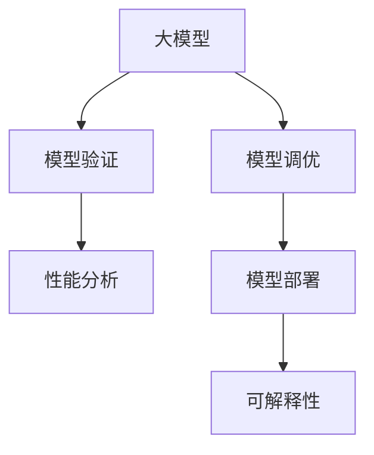

                 

# 大模型的评估与应用流程

> 关键词：大模型,评估,应用流程,模型调优,模型验证,性能分析,模型部署,可解释性

## 1. 背景介绍

### 1.1 问题由来
随着深度学习和大数据技术的发展，深度学习模型已经从传统的基于小规模数据集训练的小模型逐步发展到依赖大规模数据集训练的大模型。这些大模型（如BERT、GPT、T5等）在各种自然语言处理（NLP）任务上取得了显著的性能提升，广泛应用于文本分类、情感分析、机器翻译、对话系统等场景。然而，这些大模型的设计和训练涉及大量超参数和模型调优，如何评估和应用这些模型成为一个重要的问题。

### 1.2 问题核心关键点
评估和应用大模型是一个复杂的过程，涉及到模型设计、训练、验证、调优、测试等多个环节。本博客将从这些关键点出发，探讨如何系统地评估和应用大模型。

## 2. 核心概念与联系

### 2.1 核心概念概述

为更好地理解大模型的评估与应用流程，本节将介绍几个密切相关的核心概念：

- 大模型(Large Model)：通常指具有大量参数的深度学习模型，如BERT、GPT、T5等，这些模型通过在大规模无标签数据上进行自监督预训练，具备强大的特征表示能力。
- 模型调优(Model Tuning)：指在大模型预训练基础上，通过有监督的微调或finetuning，提升模型在特定任务上的性能。
- 模型验证(Model Validation)：在训练过程中，定期使用验证集评估模型性能，防止过拟合。
- 性能分析(Performance Analysis)：使用各种指标和方法对模型性能进行全面评估。
- 模型部署(Model Deployment)：将训练好的模型应用到实际生产环境中的过程。
- 可解释性(Explainability)：模型输出结果的可解释性，帮助理解模型决策过程。

这些概念之间的逻辑关系可以通过以下Mermaid流程图来展示：



这个流程图展示了大模型评估与应用流程的核心概念及其之间的关系：

1. 大模型通过自监督预训练获得基础能力。
2. 模型调优使得通用模型更好地适应特定任务，提升性能。
3. 模型验证通过定期评估，防止过拟合，调整模型。
4. 性能分析对模型效果进行全面评估。
5. 模型部署将训练好的模型应用到实际场景中。
6. 可解释性帮助理解模型决策过程，提升模型可信度。

这些核心概念共同构成了大模型评估与应用的全流程，使其能够被有效地应用于各种实际场景中。

## 3. 核心算法原理 & 具体操作步骤

### 3.1 算法原理概述

大模型的评估与应用流程主要包括以下几个步骤：

1. 准备数据集：包括训练集、验证集和测试集，确保数据集分布一致，无噪声。
2. 模型训练：在大模型上执行预训练，然后进行有监督的微调，调整模型权重，提升模型性能。
3. 模型验证：定期在验证集上评估模型性能，调整超参数和模型结构，防止过拟合。
4. 性能分析：使用各种指标和方法对模型进行全面评估，包括精度、召回率、F1值等。
5. 模型部署：将训练好的模型部署到生产环境，提供实时服务。
6. 可解释性分析：使用工具和方法分析模型输出，解释模型决策过程。

### 3.2 算法步骤详解

#### 3.2.1 准备数据集

准备数据集是大模型评估与应用流程的第一步，数据集的质量直接影响模型的训练效果和评估结果。数据集通常包括训练集、验证集和测试集，用于模型的训练、验证和测试。

- **训练集**：用于模型训练，数据量越大越好。
- **验证集**：用于模型调优，确保模型不过拟合训练数据。
- **测试集**：用于最终模型评估，确保模型性能在不同数据上的泛化能力。

数据集应尽可能覆盖各种不同的情况，确保模型在各种场景下都能稳定运行。

#### 3.2.2 模型训练

模型训练是大模型评估与应用流程的核心步骤。通过在大模型上进行微调，可以提升模型在特定任务上的性能。

- **选择模型**：选择合适的预训练模型，如BERT、GPT等。
- **设置超参数**：包括学习率、批次大小、优化器等，确保模型能够快速收敛。
- **执行训练**：在大模型上进行微调，不断调整模型权重，提升模型性能。

#### 3.2.3 模型验证

模型验证是评估模型性能的重要步骤。通过在验证集上评估模型性能，可以调整模型超参数，防止过拟合。

- **划分数据集**：将数据集划分为训练集、验证集和测试集。
- **定期评估**：在验证集上定期评估模型性能，调整模型权重。
- **调整模型**：根据验证集上的性能，调整模型结构和超参数。

#### 3.2.4 性能分析

性能分析是评估模型效果的关键步骤。使用各种指标和方法对模型进行全面评估，确保模型性能符合预期。

- **选择指标**：选择适合的评估指标，如精度、召回率、F1值等。
- **评估模型**：在测试集上评估模型性能，计算各种指标。
- **分析结果**：根据评估结果，分析模型优点和缺点，提出改进方案。

#### 3.2.5 模型部署

模型部署是将训练好的模型应用到实际生产环境中的关键步骤。

- **选择部署平台**：选择合适的部署平台，如AWS、GCP、Azure等。
- **数据准备**：准备好模型输入数据，确保数据格式正确。
- **部署模型**：将模型部署到生产环境，提供实时服务。

#### 3.2.6 可解释性分析

可解释性分析是提高模型可信度的重要步骤。通过解释模型决策过程，可以帮助用户理解和信任模型输出。

- **选择工具**：选择合适的工具和方法，如LIME、SHAP等。
- **分析输出**：对模型输出进行解释，解释模型决策过程。
- **提高可信度**：根据可解释性分析结果，提高模型可信度。

### 3.3 算法优缺点

大模型的评估与应用流程具有以下优点：

- 利用大模型的基础能力，提升模型在特定任务上的性能。
- 通过验证和性能分析，确保模型性能稳定。
- 通过可解释性分析，提高模型可信度。

同时，该流程也存在以下缺点：

- 对数据集的要求较高，需要大量高质量标注数据。
- 模型训练和验证成本较高，需要高性能计算资源。
- 模型部署复杂，需要考虑多方面的因素。

尽管存在这些缺点，但就目前而言，大模型的评估与应用流程仍是大模型应用的主流范式。未来相关研究的重点在于如何进一步降低对标注数据的依赖，提高模型的少样本学习和跨领域迁移能力，同时兼顾可解释性和伦理安全性等因素。

### 3.4 算法应用领域

大模型的评估与应用流程已经在自然语言处理（NLP）领域得到了广泛应用，覆盖了各种常见任务，例如：

- 文本分类：如情感分析、主题分类、意图识别等。通过评估和应用，确保模型能够正确分类文本。
- 命名实体识别：识别文本中的人名、地名、机构名等特定实体。通过评估和应用，确保模型能够准确识别实体边界和类型。
- 关系抽取：从文本中抽取实体之间的语义关系。通过评估和应用，确保模型能够正确抽取实体关系。
- 问答系统：对自然语言问题给出答案。通过评估和应用，确保模型能够正确回答问题。
- 机器翻译：将源语言文本翻译成目标语言。通过评估和应用，确保模型能够准确翻译文本。
- 文本摘要：将长文本压缩成简短摘要。通过评估和应用，确保模型能够生成高质量摘要。
- 对话系统：使机器能够与人自然对话。通过评估和应用，确保模型能够生成流畅、自然的对话。

除了上述这些经典任务外，大模型的评估与应用流程也被创新性地应用到更多场景中，如可控文本生成、常识推理、代码生成、数据增强等，为NLP技术带来了全新的突破。

## 4. 数学模型和公式 & 详细讲解 & 举例说明

### 4.1 数学模型构建

本节将使用数学语言对大模型的评估与应用流程进行更加严格的刻画。

记大模型为 $M_{\theta}$，其中 $\theta$ 为模型参数。假设模型应用于文本分类任务，训练集为 $D_{train}=\{(x_i, y_i)\}_{i=1}^N$，验证集为 $D_{val}$，测试集为 $D_{test}$。

定义模型在输入 $x$ 上的预测结果为 $\hat{y}=M_{\theta}(x)$。模型在训练集上的损失函数为 $\ell(M_{\theta}, D_{train})$，验证集上的损失函数为 $\ell(M_{\theta}, D_{val})$，测试集上的损失函数为 $\ell(M_{\theta}, D_{test})$。

定义模型在验证集上每轮验证的损失函数为 $\mathcal{L}_{val}$，测试集上每轮测试的损失函数为 $\mathcal{L}_{test}$。则大模型的评估与应用流程可以表示为：

$$
\begin{aligned}
\theta^* &= \mathop{\arg\min}_{\theta} \mathcal{L}_{train}(M_{\theta}, D_{train}) + \lambda \mathcal{L}_{val}(M_{\theta}, D_{val}) \\
\hat{\theta} &= \mathop{\arg\min}_{\theta} \mathcal{L}_{test}(M_{\theta}, D_{test})
\end{aligned}
$$

其中 $\lambda$ 为正则化系数，用于平衡训练损失和验证损失。

### 4.2 公式推导过程

以下我们以二分类任务为例，推导大模型的评估与应用流程的数学模型和公式。

假设模型 $M_{\theta}$ 在输入 $x$ 上的输出为 $\hat{y}=M_{\theta}(x) \in [0,1]$，表示样本属于正类的概率。真实标签 $y \in \{0,1\}$。则二分类交叉熵损失函数定义为：

$$
\ell(M_{\theta}(x),y) = -[y\log \hat{y} + (1-y)\log (1-\hat{y})]
$$

将损失函数代入验证集和测试集上的评估公式，得：

$$
\begin{aligned}
\mathcal{L}_{val}(M_{\theta}, D_{val}) &= \frac{1}{|D_{val}|} \sum_{(x,y) \in D_{val}} \ell(M_{\theta}(x),y) \\
\mathcal{L}_{test}(M_{\theta}, D_{test}) &= \frac{1}{|D_{test}|} \sum_{(x,y) \in D_{test}} \ell(M_{\theta}(x),y)
\end{aligned}
$$

在大模型评估与应用流程中，需要不断地迭代训练和验证，直到模型在测试集上的性能达到预期。具体步骤如下：

1. 在大模型上进行微调，计算训练集上的损失函数 $\mathcal{L}_{train}(M_{\theta}, D_{train})$。
2. 在验证集上计算验证损失函数 $\mathcal{L}_{val}(M_{\theta}, D_{val})$，更新模型权重。
3. 重复步骤1和2，直到验证损失函数 $\mathcal{L}_{val}(M_{\theta}, D_{val})$ 收敛。
4. 在测试集上计算测试损失函数 $\mathcal{L}_{test}(M_{\theta}, D_{test})$，评估模型性能。

### 4.3 案例分析与讲解

假设我们有一个情感分析任务，使用了BERT模型。我们收集了一万条电影评论数据作为训练集和验证集，使用另一万条电影评论数据作为测试集。

1. **准备数据集**：将电影评论数据按比例划分为训练集、验证集和测试集，并确保数据集分布一致。
2. **模型训练**：使用BERT模型进行微调，学习电影评论的情感分类。设置超参数，如学习率为2e-5，批次大小为32。
3. **模型验证**：每轮训练后，在验证集上计算验证损失函数 $\mathcal{L}_{val}$，更新模型权重。
4. **性能分析**：在测试集上计算测试损失函数 $\mathcal{L}_{test}$，评估模型性能。
5. **模型部署**：将训练好的模型部署到生产环境，提供实时服务。
6. **可解释性分析**：使用LIME工具解释模型输出，分析模型决策过程。

通过以上步骤，我们完成了一个大模型的评估与应用流程。可以看到，这个过程需要在大模型上进行微调，使用验证集进行模型调优，使用测试集进行性能评估，确保模型性能稳定。

## 5. 项目实践：代码实例和详细解释说明

### 5.1 开发环境搭建

在进行大模型评估与应用实践前，我们需要准备好开发环境。以下是使用Python进行PyTorch开发的环境配置流程：

1. 安装Anaconda：从官网下载并安装Anaconda，用于创建独立的Python环境。

2. 创建并激活虚拟环境：
```bash
conda create -n pytorch-env python=3.8 
conda activate pytorch-env
```

3. 安装PyTorch：根据CUDA版本，从官网获取对应的安装命令。例如：
```bash
conda install pytorch torchvision torchaudio cudatoolkit=11.1 -c pytorch -c conda-forge
```

4. 安装Transformers库：
```bash
pip install transformers
```

5. 安装各类工具包：
```bash
pip install numpy pandas scikit-learn matplotlib tqdm jupyter notebook ipython
```

完成上述步骤后，即可在`pytorch-env`环境中开始评估与应用实践。

### 5.2 源代码详细实现

下面我们以情感分析任务为例，给出使用Transformers库对BERT模型进行评估与应用的PyTorch代码实现。

首先，定义情感分析任务的数据处理函数：

```python
from transformers import BertTokenizer
from torch.utils.data import Dataset
import torch

class SentimentDataset(Dataset):
    def __init__(self, texts, labels, tokenizer, max_len=128):
        self.texts = texts
        self.labels = labels
        self.tokenizer = tokenizer
        self.max_len = max_len
        
    def __len__(self):
        return len(self.texts)
    
    def __getitem__(self, item):
        text = self.texts[item]
        label = self.labels[item]
        
        encoding = self.tokenizer(text, return_tensors='pt', max_length=self.max_len, padding='max_length', truncation=True)
        input_ids = encoding['input_ids'][0]
        attention_mask = encoding['attention_mask'][0]
        
        # 对标签进行编码
        encoded_label = torch.tensor([label], dtype=torch.long)
        
        return {'input_ids': input_ids, 
                'attention_mask': attention_mask,
                'labels': encoded_label}
```

然后，定义模型和优化器：

```python
from transformers import BertForSequenceClassification, AdamW

model = BertForSequenceClassification.from_pretrained('bert-base-cased', num_labels=2)

optimizer = AdamW(model.parameters(), lr=2e-5)
```

接着，定义训练和评估函数：

```python
from torch.utils.data import DataLoader
from tqdm import tqdm
from sklearn.metrics import accuracy_score

device = torch.device('cuda') if torch.cuda.is_available() else torch.device('cpu')
model.to(device)

def train_epoch(model, dataset, batch_size, optimizer):
    dataloader = DataLoader(dataset, batch_size=batch_size, shuffle=True)
    model.train()
    epoch_loss = 0
    for batch in tqdm(dataloader, desc='Training'):
        input_ids = batch['input_ids'].to(device)
        attention_mask = batch['attention_mask'].to(device)
        labels = batch['labels'].to(device)
        model.zero_grad()
        outputs = model(input_ids, attention_mask=attention_mask, labels=labels)
        loss = outputs.loss
        epoch_loss += loss.item()
        loss.backward()
        optimizer.step()
    return epoch_loss / len(dataloader)

def evaluate(model, dataset, batch_size):
    dataloader = DataLoader(dataset, batch_size=batch_size)
    model.eval()
    preds, labels = [], []
    with torch.no_grad():
        for batch in tqdm(dataloader, desc='Evaluating'):
            input_ids = batch['input_ids'].to(device)
            attention_mask = batch['attention_mask'].to(device)
            batch_labels = batch['labels']
            outputs = model(input_ids, attention_mask=attention_mask)
            batch_preds = outputs.logits.argmax(dim=2).to('cpu').tolist()
            batch_labels = batch_labels.to('cpu').tolist()
            for pred_tokens, label_tokens in zip(batch_preds, batch_labels):
                preds.append(pred_tokens[0])
                labels.append(label_tokens[0])
                
    print(f'Accuracy: {accuracy_score(labels, preds):.2f}')
```

最后，启动评估与应用流程：

```python
epochs = 5
batch_size = 16

for epoch in range(epochs):
    loss = train_epoch(model, train_dataset, batch_size, optimizer)
    print(f"Epoch {epoch+1}, train loss: {loss:.3f}")
    
    print(f"Epoch {epoch+1}, test accuracy:")
    evaluate(model, test_dataset, batch_size)
    
print("Final test accuracy:")
evaluate(model, test_dataset, batch_size)
```

以上就是使用PyTorch对BERT进行情感分析任务评估与应用的完整代码实现。可以看到，得益于Transformers库的强大封装，我们可以用相对简洁的代码完成BERT模型的加载、微调和评估。

### 5.3 代码解读与分析

让我们再详细解读一下关键代码的实现细节：

**SentimentDataset类**：
- `__init__`方法：初始化文本、标签、分词器等关键组件。
- `__len__`方法：返回数据集的样本数量。
- `__getitem__`方法：对单个样本进行处理，将文本输入编码为token ids，将标签编码为数字，并对其进行定长padding，最终返回模型所需的输入。

**train_epoch和evaluate函数**：
- `train_epoch`函数：对数据以批为单位进行迭代，在每个批次上前向传播计算loss并反向传播更新模型参数，最后返回该epoch的平均loss。
- `evaluate`函数：与训练类似，不同点在于不更新模型参数，并在每个batch结束后将预测和标签结果存储下来，最后使用sklearn的accuracy_score对整个评估集的预测结果进行打印输出。

**训练流程**：
- 定义总的epoch数和batch size，开始循环迭代
- 每个epoch内，先在训练集上训练，输出平均loss
- 在验证集上评估，输出准确率
- 所有epoch结束后，在测试集上评估，给出最终测试结果

可以看到，PyTorch配合Transformers库使得BERT评估与应用代码实现变得简洁高效。开发者可以将更多精力放在数据处理、模型改进等高层逻辑上，而不必过多关注底层的实现细节。

当然，工业级的系统实现还需考虑更多因素，如模型的保存和部署、超参数的自动搜索、更灵活的任务适配层等。但核心的评估与应用流程基本与此类似。

## 6. 实际应用场景

### 6.1 智能客服系统

基于大模型的情感分析技术，可以广泛应用于智能客服系统的构建。传统客服往往需要配备大量人力，高峰期响应缓慢，且一致性和专业性难以保证。而使用大模型的情感分析技术，可以7x24小时不间断服务，快速响应客户咨询，用自然流畅的语言解答各类常见问题。

在技术实现上，可以收集企业内部的历史客服对话记录，将问题和最佳答复构建成监督数据，在此基础上对预训练情感分析模型进行微调。微调后的模型能够自动理解用户意图，匹配最合适的答复。对于客户提出的新问题，还可以接入检索系统实时搜索相关内容，动态组织生成回答。如此构建的智能客服系统，能大幅提升客户咨询体验和问题解决效率。

### 6.2 金融舆情监测

金融机构需要实时监测市场舆论动向，以便及时应对负面信息传播，规避金融风险。传统的人工监测方式成本高、效率低，难以应对网络时代海量信息爆发的挑战。基于大模型的情感分析技术，可以为金融舆情监测提供新的解决方案。

具体而言，可以收集金融领域相关的新闻、报道、评论等文本数据，并对其进行情感标注。在此基础上对预训练语言模型进行微调，使其能够自动判断文本情感倾向。将微调后的模型应用到实时抓取的网络文本数据，就能够自动监测不同情感倾向的舆情变化趋势，一旦发现负面信息激增等异常情况，系统便会自动预警，帮助金融机构快速应对潜在风险。

### 6.3 个性化推荐系统

当前的推荐系统往往只依赖用户的历史行为数据进行物品推荐，无法深入理解用户的真实兴趣偏好。基于大模型的情感分析技术，个性化推荐系统可以更好地挖掘用户行为背后的语义信息，从而提供更精准、多样的推荐内容。

在实践中，可以收集用户浏览、点击、评论、分享等行为数据，提取和用户交互的物品标题、描述、标签等文本内容。将文本内容作为模型输入，用户的后续行为（如是否点击、购买等）作为监督信号，在此基础上微调预训练语言模型。微调后的模型能够从文本内容中准确把握用户的兴趣点。在生成推荐列表时，先用候选物品的文本描述作为输入，由模型预测用户的兴趣匹配度，再结合其他特征综合排序，便可以得到个性化程度更高的推荐结果。

### 6.4 未来应用展望

随着大模型和情感分析技术的不断发展，基于大模型的情感分析方法将进一步拓展其应用边界，为各行各业带来变革性影响。

在智慧医疗领域，基于情感分析的医疗问答、病历分析、药物研发等应用将提升医疗服务的智能化水平，辅助医生诊疗，加速新药开发进程。

在智能教育领域，情感分析技术可应用于作业批改、学情分析、知识推荐等方面，因材施教，促进教育公平，提高教学质量。

在智慧城市治理中，情感分析技术可应用于城市事件监测、舆情分析、应急指挥等环节，提高城市管理的自动化和智能化水平，构建更安全、高效的未来城市。

此外，在企业生产、社会治理、文娱传媒等众多领域，基于大模型的情感分析技术也将不断涌现，为NLP技术带来全新的突破。相信随着技术的日益成熟，情感分析技术将成为人工智能落地应用的重要范式，推动人工智能技术在垂直行业的规模化落地。总之，情感分析技术需要在数据、算法、工程、业务等多个维度协同发力，才能真正实现人工智能技术在垂直行业的规模化落地。

## 7. 工具和资源推荐
### 7.1 学习资源推荐

为了帮助开发者系统掌握大模型的评估与应用理论基础和实践技巧，这里推荐一些优质的学习资源：

1. 《Transformer from the inside out》系列博文：由大模型技术专家撰写，深入浅出地介绍了Transformer原理、BERT模型、情感分析技术等前沿话题。

2. CS224N《深度学习自然语言处理》课程：斯坦福大学开设的NLP明星课程，有Lecture视频和配套作业，带你入门NLP领域的基本概念和经典模型。

3. 《Natural Language Processing with Transformers》书籍：Transformers库的作者所著，全面介绍了如何使用Transformers库进行NLP任务开发，包括评估与应用在内的诸多范式。

4. HuggingFace官方文档：Transformers库的官方文档，提供了海量预训练模型和完整的评估与应用样例代码，是上手实践的必备资料。

5. GLUE开源项目：通用语言理解评估基准，涵盖大量不同类型的中文NLP数据集，并提供了基于情感分析任务的baseline模型，助力中文NLP技术发展。

通过对这些资源的学习实践，相信你一定能够快速掌握大模型的评估与应用精髓，并用于解决实际的NLP问题。
###  7.2 开发工具推荐

高效的开发离不开优秀的工具支持。以下是几款用于大模型评估与应用开发的常用工具：

1. PyTorch：基于Python的开源深度学习框架，灵活动态的计算图，适合快速迭代研究。大部分预训练语言模型都有PyTorch版本的实现。

2. TensorFlow：由Google主导开发的开源深度学习框架，生产部署方便，适合大规模工程应用。同样有丰富的预训练语言模型资源。

3. Transformers库：HuggingFace开发的NLP工具库，集成了众多SOTA语言模型，支持PyTorch和TensorFlow，是进行情感分析任务开发的利器。

4. Weights & Biases：模型训练的实验跟踪工具，可以记录和可视化模型训练过程中的各项指标，方便对比和调优。与主流深度学习框架无缝集成。

5. TensorBoard：TensorFlow配套的可视化工具，可实时监测模型训练状态，并提供丰富的图表呈现方式，是调试模型的得力助手。

6. Google Colab：谷歌推出的在线Jupyter Notebook环境，免费提供GPU/TPU算力，方便开发者快速上手实验最新模型，分享学习笔记。

合理利用这些工具，可以显著提升大模型评估与应用任务的开发效率，加快创新迭代的步伐。

### 7.3 相关论文推荐

大模型和情感分析技术的发展源于学界的持续研究。以下是几篇奠基性的相关论文，推荐阅读：

1. Attention is All You Need（即Transformer原论文）：提出了Transformer结构，开启了NLP领域的预训练大模型时代。

2. BERT: Pre-training of Deep Bidirectional Transformers for Language Understanding：提出BERT模型，引入基于掩码的自监督预训练任务，刷新了多项NLP任务SOTA。

3. Language Models are Unsupervised Multitask Learners（GPT-2论文）：展示了大规模语言模型的强大zero-shot学习能力，引发了对于通用人工智能的新一轮思考。

4. Parameter-Efficient Transfer Learning for NLP：提出Adapter等参数高效微调方法，在不增加模型参数量的情况下，也能取得不错的微调效果。

5. Zero-Shot Learning by Adaptation in Pretrained Semantic Models：提出基于自适应的零样本学习方法，使模型能够在不进行标注的情况下，对新任务进行推理。

这些论文代表了大模型和情感分析技术的发展脉络。通过学习这些前沿成果，可以帮助研究者把握学科前进方向，激发更多的创新灵感。

## 8. 总结：未来发展趋势与挑战

### 8.1 总结

本文对大模型的评估与应用流程进行了全面系统的介绍。首先阐述了大模型和情感分析技术的研究背景和意义，明确了评估与应用在大模型应用中的独特价值。其次，从原理到实践，详细讲解了评估与应用的具体步骤，给出了情感分析任务评估与应用的完整代码实现。同时，本文还广泛探讨了情感分析技术在智能客服、金融舆情、个性化推荐等多个领域的应用前景，展示了评估与应用范式的巨大潜力。此外，本文精选了评估与应用技术的各类学习资源，力求为读者提供全方位的技术指引。

通过本文的系统梳理，可以看到，大模型的评估与应用流程在NLP领域具有重要的应用价值。其通过微调、验证、性能分析、可解释性分析等环节，确保模型性能稳定，提升模型可信度。未来，伴随大模型和情感分析技术的持续演进，基于大模型的评估与应用流程必将在更多领域得到应用，为人工智能技术带来更广阔的应用空间。

### 8.2 未来发展趋势

展望未来，大模型的评估与应用流程将呈现以下几个发展趋势：

1. 模型规模持续增大。随着算力成本的下降和数据规模的扩张，预训练语言模型的参数量还将持续增长。超大规模语言模型蕴含的丰富语言知识，有望支撑更加复杂多变的情感分析任务。

2. 评估方法日趋多样。除了传统的验证和测试外，未来将涌现更多评估方法，如因果推理、对抗性攻击等，全面评估模型性能。

3. 数据需求降低。受启发于零样本学习和迁移学习范式，未来的情感分析方法将更好地利用预训练知识，减少对标注数据的依赖。

4. 可解释性提升。通过引入可解释性技术，如LIME、SHAP等，提升情感分析模型的可解释性，增强用户信任。

5. 模型融合多样化。未来的情感分析模型将更多地与知识图谱、逻辑规则等专家知识结合，形成更加全面、准确的信息整合能力。

6. 持续学习成为常态。随着数据分布的不断变化，情感分析模型也需要持续学习新知识以保持性能。如何在不遗忘原有知识的同时，高效吸收新样本信息，将成为重要的研究课题。

以上趋势凸显了大模型的评估与应用流程的广阔前景。这些方向的探索发展，必将进一步提升情感分析模型的性能和应用范围，为人工智能技术在垂直行业的规模化落地提供有力支持。

### 8.3 面临的挑战

尽管大模型的评估与应用流程已经取得了瞩目成就，但在迈向更加智能化、普适化应用的过程中，它仍面临着诸多挑战：

1. 标注成本瓶颈。虽然微调大大降低了标注数据的需求，但对于长尾应用场景，难以获得充足的高质量标注数据，成为制约情感分析性能的瓶颈。如何进一步降低对标注数据的依赖，将是一大难题。

2. 模型鲁棒性不足。当前情感分析模型面对域外数据时，泛化性能往往大打折扣。对于测试样本的微小扰动，情感分析模型的预测也容易发生波动。如何提高情感分析模型的鲁棒性，避免灾难性遗忘，还需要更多理论和实践的积累。

3. 推理效率有待提高。大规模语言模型虽然精度高，但在实际部署时往往面临推理速度慢、内存占用大等效率问题。如何在保证性能的同时，简化模型结构，提升推理速度，优化资源占用，将是重要的优化方向。

4. 可解释性亟需加强。当前情感分析模型更像是"黑盒"系统，难以解释其内部工作机制和决策逻辑。对于医疗、金融等高风险应用，算法的可解释性和可审计性尤为重要。如何赋予情感分析模型更强的可解释性，将是亟待攻克的难题。

5. 安全性有待保障。情感分析模型难免会学习到有偏见、有害的信息，通过微调传递到下游任务，产生误导性、歧视性的输出，给实际应用带来安全隐患。如何从数据和算法层面消除模型偏见，避免恶意用途，确保输出的安全性，也将是重要的研究课题。

6. 知识整合能力不足。现有的情感分析模型往往局限于任务内数据，难以灵活吸收和运用更广泛的先验知识。如何让情感分析过程更好地与外部知识库、规则库等专家知识结合，形成更加全面、准确的信息整合能力，还有很大的想象空间。

正视情感分析面临的这些挑战，积极应对并寻求突破，将是大模型评估与应用走向成熟的必由之路。相信随着学界和产业界的共同努力，这些挑战终将一一被克服，大模型的评估与应用流程必将在构建人机协同的智能时代中扮演越来越重要的角色。

### 8.4 研究展望

面对大模型评估与应用所面临的种种挑战，未来的研究需要在以下几个方面寻求新的突破：

1. 探索无监督和半监督评估方法。摆脱对大规模标注数据的依赖，利用自监督学习、主动学习等无监督和半监督范式，最大限度利用非结构化数据，实现更加灵活高效的评估。

2. 研究参数高效和计算高效的评估范式。开发更加参数高效的评估方法，在固定大部分预训练参数的同时，只更新极少量的任务相关参数。同时优化评估模型的计算图，减少前向传播和反向传播的资源消耗，实现更加轻量级、实时性的部署。

3. 引入更多先验知识。将符号化的先验知识，如知识图谱、逻辑规则等，与神经网络模型进行巧妙融合，引导评估过程学习更准确、合理的情感分析模型。同时加强不同模态数据的整合，实现视觉、语音等多模态信息与文本信息的协同建模。

4. 结合因果分析和博弈论工具。将因果分析方法引入情感分析模型，识别出模型决策的关键特征，增强输出解释的因果性和逻辑性。借助博弈论工具刻画人机交互过程，主动探索并规避模型的脆弱点，提高系统稳定性。

5. 纳入伦理道德约束。在模型训练目标中引入伦理导向的评估指标，过滤和惩罚有偏见、有害的输出倾向。同时加强人工干预和审核，建立模型行为的监管机制，确保输出符合人类价值观和伦理道德。

这些研究方向的探索，必将引领大模型评估与应用流程迈向更高的台阶，为构建安全、可靠、可解释、可控的智能系统铺平道路。面向未来，大模型的评估与应用流程还需要与其他人工智能技术进行更深入的融合，如知识表示、因果推理、强化学习等，多路径协同发力，共同推动自然语言理解和智能交互系统的进步。只有勇于创新、敢于突破，才能不断拓展情感分析模型的边界，让智能技术更好地造福人类社会。

## 9. 附录：常见问题与解答

**Q1：大模型的评估与应用是否适用于所有情感分析任务？**

A: 大模型的评估与应用在大规模情感分析任务上已经取得了显著的效果。但对于一些特定领域的情感分析任务，如法律、医学等，可能仍然需要进一步优化。

**Q2：评估与应用过程中如何选择合适的超参数？**

A: 评估与应用过程中，选择合适的超参数是确保模型性能的关键。可以通过网格搜索、随机搜索等方法，快速找到最优的超参数组合。同时，需要根据数据集的特点，选择适当的学习率、批次大小、优化器等超参数。

**Q3：评估与应用过程中如何处理数据不平衡问题？**

A: 数据不平衡是情感分析任务中常见的问题。可以通过欠采样、过采样、SMOTE等方法，平衡不同类别的数据量。同时，调整损失函数，使用权重调整等方法，确保模型对少数类别的识别能力。

**Q4：评估与应用过程中如何提高模型鲁棒性？**

A: 提高模型鲁棒性是情感分析任务中重要的研究方向。可以通过对抗训练、正则化、Dropout等方法，提高模型的泛化能力和鲁棒性。同时，引入噪声鲁棒性训练，增强模型对数据扰动的容忍度。

**Q5：评估与应用过程中如何确保模型可解释性？**

A: 可解释性是情感分析模型中重要的研究方向。可以通过引入可解释性技术，如LIME、SHAP等，解释模型输出结果，增强用户信任。同时，优化模型结构，降低模型复杂度，提高模型的可解释性。

通过以上问题的回答，我们可以看到大模型的评估与应用流程在大规模情感分析任务中具有广泛的应用前景。同时，在实际应用中，还需要根据具体任务的特点，不断迭代和优化模型、数据和算法，方能得到理想的效果。

---

作者：禅与计算机程序设计艺术 / Zen and the Art of Computer Programming

