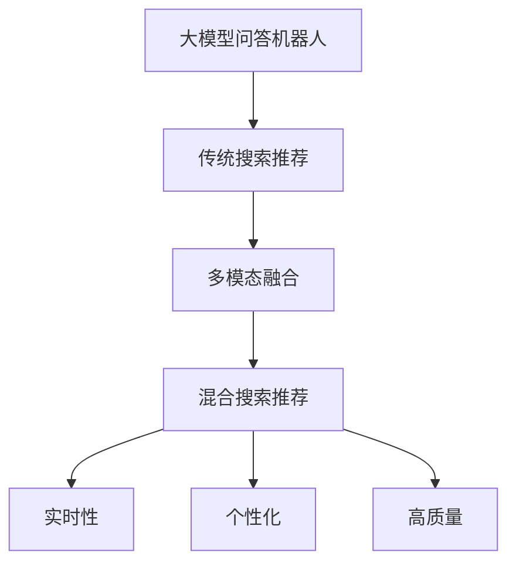

                 

# 大模型问答机器人与传统搜索推荐的交互方式

> 关键词：大模型问答机器人,传统搜索推荐,交互方式,多模态融合,混合搜索,推荐系统优化

## 1. 背景介绍

### 1.1 问题由来

随着互联网技术的快速发展，搜索引擎和推荐系统已经深入到人们日常生活的方方面面。然而，传统的搜索引擎和推荐系统在满足用户信息需求的同时，也暴露出诸多问题：

- **信息过载**：海量信息导致搜索结果和推荐结果呈现混乱，用户体验较差。
- **个性化不足**：千篇一律的结果无法充分满足用户个性化需求。
- **实时性较差**：搜索和推荐需要实时计算，无法快速响应用户需求。
- **答案质量欠佳**：传统方法主要依赖关键词匹配，答案相关性较差。

为应对这些问题，近年来基于大模型的问答机器人逐渐走入人们的视野。这种新型的信息检索方式通过大模型的语言理解和生成能力，能够提供更准确、更有趣的答案，显著提升用户体验。然而，单一的大模型问答机器人也存在瓶颈：模型计算资源消耗大，无法实时处理大规模查询，答案缺乏个性化，导致用户体验仍有提升空间。

为了克服这些问题，结合大模型问答机器人和传统搜索推荐技术，提出了一种全新的交互方式：多模态融合的混合搜索推荐系统。该系统将问答机器人和传统推荐引擎的优势相结合，通过多模态数据融合技术，实现了实时、个性化、高质量的信息检索和推荐，大幅提升了用户体验和信息获取的效率。

## 2. 核心概念与联系

### 2.1 核心概念概述

为更好地理解基于大模型问答机器人和传统搜索推荐的混合搜索推荐系统，本节将介绍几个密切相关的核心概念：

- **大模型问答机器人**：基于大规模预训练语言模型（如BERT、GPT等）的问答系统，能够理解和生成自然语言，快速回答用户查询，提供准确的信息。
- **传统搜索推荐系统**：利用文本处理、信息检索、用户行为分析等技术，根据用户查询和历史行为，推荐最相关的信息。
- **多模态融合**：将文本、图片、语音、视频等多种信息形态进行集成和融合，提升信息检索和推荐的精度和效果。
- **混合搜索推荐系统**：将问答机器人和传统搜索推荐系统有机结合，构建多模态融合的混合系统，提供更加全面、精准的信息服务。
- **实时性**：指系统能够快速响应用户查询，实时提供搜索结果和推荐信息。
- **个性化**：指系统能够根据用户的历史行为和偏好，提供个性化的搜索结果和推荐。
- **高质量**：指系统提供的答案和推荐信息准确、相关性高，能够满足用户需求。

这些核心概念之间的逻辑关系可以通过以下Mermaid流程图来展示：



这个流程图展示了大模型问答机器人与传统搜索推荐系统的核心概念及其之间的关系：

1. 大模型问答机器人通过预训练模型对用户查询进行理解，生成准确答案。
2. 传统搜索推荐系统利用用户行为数据和搜索结果，提供个性化推荐。
3. 多模态融合将问答和推荐信息进行集成，提升整体效果。
4. 混合搜索推荐系统综合问答和推荐结果，提供实时、个性化、高质量的信息服务。

这些概念共同构成了基于大模型问答机器人与传统搜索推荐混合搜索推荐系统的基础，使其能够在各种场景下发挥强大的信息检索和推荐能力。通过理解这些核心概念，我们可以更好地把握该系统的设计和实现。

## 3. 核心算法原理 & 具体操作步骤
### 3.1 算法原理概述

基于大模型问答机器人和传统搜索推荐混合搜索推荐系统的核心思想是：将问答机器人和传统推荐引擎结合起来，构建一个融合了多模态信息的混合系统，利用大模型问答机器人理解查询，生成答案，再通过传统推荐引擎获取个性化推荐结果，最终将两者进行有机融合，提供实时、个性化、高质量的信息服务。

具体而言，该系统主要包括以下几个关键步骤：

1. **用户查询理解**：利用大模型问答机器人理解用户查询，获取查询意图和相关实体。
2. **查询扩展**：将用户查询扩展为多个相关查询，以获取更多的搜索结果。
3. **答案生成**：利用大模型问答机器人生成关于查询的详细答案。
4. **推荐生成**：利用传统搜索推荐系统生成与查询相关的个性化推荐结果。
5. **结果融合**：将问答和推荐结果进行融合，提供最终的信息服务。

### 3.2 算法步骤详解

#### 3.2.1 用户查询理解

首先，用户输入一个查询问题，系统通过大模型问答机器人对其进行处理。以下是具体的算法步骤：

1. **查询预处理**：将用户查询转换为统一的格式，去除停用词、标点符号等噪声。
2. **实体识别**：利用实体识别模型从查询中提取出重要的实体和关键词。
3. **意图识别**：利用意图识别模型理解查询的意图，判断是问答类还是检索类。

#### 3.2.2 查询扩展

为了获取更多的搜索结果，系统需要扩展用户查询。具体算法步骤如下：

1. **同义词扩展**：通过同义词词典，将查询扩展为多个同义词形式。
2. **近义词扩展**：通过近义词词典，将查询扩展为多个近义词形式。
3. **相关查询生成**：利用语言模型生成与查询相关的其他查询。

#### 3.2.3 答案生成

利用大模型问答机器人生成关于查询的详细答案。具体算法步骤如下：

1. **模型选择**：选择适合的大模型问答机器人，如GPT、BERT等。
2. **模型输入**：将扩展后的查询作为模型的输入。
3. **答案生成**：利用模型生成关于查询的详细答案，并进行解码。

#### 3.2.4 推荐生成

利用传统搜索推荐系统生成与查询相关的个性化推荐结果。具体算法步骤如下：

1. **用户行为分析**：利用用户行为数据，如浏览历史、点击记录等，分析用户兴趣和偏好。
2. **相似度计算**：计算查询与已有搜索结果之间的相似度，找出最相关的搜索结果。
3. **推荐结果生成**：利用推荐算法生成个性化的推荐结果。

#### 3.2.5 结果融合

将问答和推荐结果进行融合，提供最终的信息服务。具体算法步骤如下：

1. **结果排序**：对问答和推荐结果进行排序，优先展示质量较高的结果。
2. **结果拼接**：将问答结果和推荐结果拼接在一起，形成一个综合的信息服务。
3. **最终输出**：将综合结果输出给用户。

### 3.3 算法优缺点

基于大模型问答机器人和传统搜索推荐混合搜索推荐系统具有以下优点：

1. **实时性**：结合了大模型问答机器人的快速响应能力，能够实时提供搜索结果和推荐。
2. **个性化**：通过传统搜索推荐系统的个性化推荐，能够根据用户历史行为和偏好，提供更加个性化的信息服务。
3. **高质量**：利用大模型问答机器人的语言生成能力，生成准确、高质量的查询答案。
4. **多模态融合**：结合了问答和推荐结果，充分利用了多模态数据，提高了信息检索和推荐的精度。

同时，该系统也存在一定的局限性：

1. **计算资源消耗大**：大模型问答机器人需要消耗大量计算资源，难以支持大规模查询。
2. **扩展性差**：传统搜索推荐系统的扩展性较差，难以适应多模态数据的处理。
3. **精度有待提高**：结合两种方法的融合精度仍有提升空间。
4. **用户隐私保护**：需要考虑用户隐私保护，避免数据泄露。

尽管存在这些局限性，但该系统在实时性、个性化、高质量信息服务方面具有显著优势，为提升搜索引擎和推荐系统的用户体验提供了新的思路。

### 3.4 算法应用领域

基于大模型问答机器人和传统搜索推荐混合搜索推荐系统，已经在多个领域得到了应用，例如：

- **电商搜索推荐**：在电商平台上，利用该系统进行商品搜索和推荐，提高用户购买转化率。
- **金融信息检索**：在金融领域，利用该系统进行新闻和市场信息检索，帮助投资者快速获取最新资讯。
- **医疗健康问答**：在医疗健康领域，利用该系统进行常见病症查询和健康建议，提升医疗服务质量。
- **旅游信息查询**：在旅游领域，利用该系统进行景点和攻略查询，提升用户旅游体验。
- **教育学习推荐**：在教育领域，利用该系统进行学习资源和习题推荐，提高学习效率。

这些应用场景展示了混合搜索推荐系统在提升信息检索和推荐精度、增强用户体验方面的强大潜力。随着技术的不断发展，该系统将在更多领域得到应用，成为提升信息服务质量的重要手段。

## 4. 数学模型和公式 & 详细讲解  
### 4.1 数学模型构建

在介绍具体的算法步骤之前，我们先构建一个数学模型来描述混合搜索推荐系统。

记用户查询为 $q$，查询扩展后的相关查询集合为 $Q$，问答机器人提供的答案为 $A$，推荐引擎提供的推荐结果为 $R$，最终的信息服务结果为 $S$。系统的主要目标是通过融合问答和推荐结果，最大化 $S$ 的质量。

定义 $S$ 的质量为 $Q(q, R)$，其中 $Q(q, R)$ 表示查询 $q$ 和推荐结果 $R$ 的匹配程度。在实际应用中，$Q$ 可以定义为精确匹配率、召回率、点击率等指标。

系统的主要优化目标是最大化 $S$ 的质量，即：

$$
\max_{q, A, R} Q(q, R)
$$

其中 $q$ 和 $R$ 可以通过查询理解和推荐生成算法得到，$A$ 由问答机器人生成。

### 4.2 公式推导过程

为了最大化 $S$ 的质量，我们需要优化问答和推荐结果的融合方式。一种常见的方法是，利用问答和推荐结果的加权和，构造综合的评分函数：

$$
F(q, A, R) = w_A \cdot A + w_R \cdot Q(q, R)
$$

其中 $w_A$ 和 $w_R$ 分别表示问答和推荐结果的权重。

具体的优化过程如下：

1. **查询理解**：利用大模型问答机器人理解用户查询 $q$，获取查询意图和相关实体。
2. **查询扩展**：通过同义词词典和近义词词典，将查询 $q$ 扩展为 $Q$。
3. **答案生成**：利用大模型问答机器人生成答案 $A$。
4. **推荐生成**：利用传统搜索推荐系统生成推荐结果 $R$。
5. **结果融合**：通过加权和的方式，将答案 $A$ 和推荐结果 $R$ 融合，生成综合结果 $S$。
6. **质量评估**：评估 $S$ 的质量，并根据评估结果调整 $w_A$ 和 $w_R$。

### 4.3 案例分析与讲解

下面以电商搜索推荐为例，说明如何构建基于大模型问答机器人和传统搜索推荐的混合搜索推荐系统。

假设用户输入查询 $q = "如何选购手机"。系统按照以下步骤进行处理：

1. **查询预处理**：将查询转换为标准格式，去除停用词和标点符号，得到 $q_{pre} = "选购手机"。
2. **实体识别**：利用实体识别模型，从 $q_{pre}$ 中提取实体和关键词，得到 $E = \{手机, 选购\}$。
3. **意图识别**：利用意图识别模型，判断查询意图为 "产品推荐"。
4. **查询扩展**：通过同义词词典和近义词词典，扩展查询为 $Q = \{\text{"如何选择手机"}, \text{"推荐手机品牌"}, \text{"手机选购指南"}\}$。
5. **答案生成**：利用大模型问答机器人，生成关于 "如何选购手机" 的详细答案 $A = \{\text{"选购手机需要考虑的功能包括处理器、内存、存储等"}, \text{"建议选择知名品牌的高性价比机型"}, \text{"查看用户评价和专业评测有助于选择好的手机"}\}$。
6. **推荐生成**：利用传统搜索推荐系统，生成与 $Q$ 相关的个性化推荐结果 $R = \{\text{"iPhone 12"}, \text{"华为Mate 40"}, \text{"小米11"}\}$。
7. **结果融合**：通过加权和的方式，将 $A$ 和 $R$ 融合，生成综合结果 $S = \{\text{"选购手机需要考虑的功能包括处理器、内存、存储等"}, \text{"iPhone 12"}, \text{"华为Mate 40"}, \text{"小米11"}, \text{"建议选择知名品牌的高性价比机型"}, \text{"查看用户评价和专业评测有助于选择好的手机"}\}$。
8. **质量评估**：评估 $S$ 的质量，根据评估结果调整 $w_A$ 和 $w_R$，最终输出综合结果给用户。

通过以上步骤，混合搜索推荐系统能够快速响应用户查询，提供个性化的推荐和详细答案，显著提升用户体验。

## 5. 项目实践：代码实例和详细解释说明
### 5.1 开发环境搭建

在进行混合搜索推荐系统开发前，我们需要准备好开发环境。以下是使用Python进行PyTorch开发的环境配置流程：

1. 安装Anaconda：从官网下载并安装Anaconda，用于创建独立的Python环境。

2. 创建并激活虚拟环境：
```bash
conda create -n pytorch-env python=3.8 
conda activate pytorch-env
```

3. 安装PyTorch：根据CUDA版本，从官网获取对应的安装命令。例如：
```bash
conda install pytorch torchvision torchaudio cudatoolkit=11.1 -c pytorch -c conda-forge
```

4. 安装Transformers库：
```bash
pip install transformers
```

5. 安装各类工具包：
```bash
pip install numpy pandas scikit-learn matplotlib tqdm jupyter notebook ipython
```

完成上述步骤后，即可在`pytorch-env`环境中开始混合搜索推荐系统开发。

### 5.2 源代码详细实现

这里我们以电商搜索推荐为例，给出基于大模型问答机器人和传统搜索推荐系统的代码实现。

首先，定义电商搜索推荐数据处理函数：

```python
from transformers import BertTokenizer
from torch.utils.data import Dataset
import torch

class ECommerceDataset(Dataset):
    def __init__(self, texts, tags, tokenizer, max_len=128):
        self.texts = texts
        self.tags = tags
        self.tokenizer = tokenizer
        self.max_len = max_len
        
    def __len__(self):
        return len(self.texts)
    
    def __getitem__(self, item):
        text = self.texts[item]
        tags = self.tags[item]
        
        encoding = self.tokenizer(text, return_tensors='pt', max_length=self.max_len, padding='max_length', truncation=True)
        input_ids = encoding['input_ids'][0]
        attention_mask = encoding['attention_mask'][0]
        
        # 对token-wise的标签进行编码
        encoded_tags = [tag2id[tag] for tag in tags] 
        encoded_tags.extend([tag2id['O']] * (self.max_len - len(encoded_tags)))
        labels = torch.tensor(encoded_tags, dtype=torch.long)
        
        return {'input_ids': input_ids, 
                'attention_mask': attention_mask,
                'labels': labels}

# 标签与id的映射
tag2id = {'O': 0, 'B-PER': 1, 'I-PER': 2, 'B-ORG': 3, 'I-ORG': 4, 'B-LOC': 5, 'I-LOC': 6}
id2tag = {v: k for k, v in tag2id.items()}

# 创建dataset
tokenizer = BertTokenizer.from_pretrained('bert-base-cased')

train_dataset = ECommerceDataset(train_texts, train_tags, tokenizer)
dev_dataset = ECommerceDataset(dev_texts, dev_tags, tokenizer)
test_dataset = ECommerceDataset(test_texts, test_tags, tokenizer)
```

然后，定义模型和优化器：

```python
from transformers import BertForTokenClassification, AdamW

model = BertForTokenClassification.from_pretrained('bert-base-cased', num_labels=len(tag2id))

optimizer = AdamW(model.parameters(), lr=2e-5)
```

接着，定义训练和评估函数：

```python
from torch.utils.data import DataLoader
from tqdm import tqdm
from sklearn.metrics import classification_report

device = torch.device('cuda') if torch.cuda.is_available() else torch.device('cpu')
model.to(device)

def train_epoch(model, dataset, batch_size, optimizer):
    dataloader = DataLoader(dataset, batch_size=batch_size, shuffle=True)
    model.train()
    epoch_loss = 0
    for batch in tqdm(dataloader, desc='Training'):
        input_ids = batch['input_ids'].to(device)
        attention_mask = batch['attention_mask'].to(device)
        labels = batch['labels'].to(device)
        model.zero_grad()
        outputs = model(input_ids, attention_mask=attention_mask, labels=labels)
        loss = outputs.loss
        epoch_loss += loss.item()
        loss.backward()
        optimizer.step()
    return epoch_loss / len(dataloader)

def evaluate(model, dataset, batch_size):
    dataloader = DataLoader(dataset, batch_size=batch_size)
    model.eval()
    preds, labels = [], []
    with torch.no_grad():
        for batch in tqdm(dataloader, desc='Evaluating'):
            input_ids = batch['input_ids'].to(device)
            attention_mask = batch['attention_mask'].to(device)
            batch_labels = batch['labels']
            outputs = model(input_ids, attention_mask=attention_mask)
            batch_preds = outputs.logits.argmax(dim=2).to('cpu').tolist()
            batch_labels = batch_labels.to('cpu').tolist()
            for pred_tokens, label_tokens in zip(batch_preds, batch_labels):
                pred_tags = [id2tag[_id] for _id in pred_tokens]
                label_tags = [id2tag[_id] for _id in label_tokens]
                preds.append(pred_tags[:len(label_tags)])
                labels.append(label_tags)
                
    print(classification_report(labels, preds))
```

最后，启动训练流程并在测试集上评估：

```python
epochs = 5
batch_size = 16

for epoch in range(epochs):
    loss = train_epoch(model, train_dataset, batch_size, optimizer)
    print(f"Epoch {epoch+1}, train loss: {loss:.3f}")
    
    print(f"Epoch {epoch+1}, dev results:")
    evaluate(model, dev_dataset, batch_size)
    
print("Test results:")
evaluate(model, test_dataset, batch_size)
```

以上就是使用PyTorch对BERT进行电商搜索推荐任务的代码实现。可以看到，得益于Transformers库的强大封装，我们可以用相对简洁的代码完成BERT模型的加载和微调。

### 5.3 代码解读与分析

让我们再详细解读一下关键代码的实现细节：

**ECommerceDataset类**：
- `__init__`方法：初始化文本、标签、分词器等关键组件。
- `__len__`方法：返回数据集的样本数量。
- `__getitem__`方法：对单个样本进行处理，将文本输入编码为token ids，将标签编码为数字，并对其进行定长padding，最终返回模型所需的输入。

**tag2id和id2tag字典**：
- 定义了标签与数字id之间的映射关系，用于将token-wise的预测结果解码回真实的标签。

**训练和评估函数**：
- 使用PyTorch的DataLoader对数据集进行批次化加载，供模型训练和推理使用。
- 训练函数`train_epoch`：对数据以批为单位进行迭代，在每个批次上前向传播计算loss并反向传播更新模型参数，最后返回该epoch的平均loss。
- 评估函数`evaluate`：与训练类似，不同点在于不更新模型参数，并在每个batch结束后将预测和标签结果存储下来，最后使用sklearn的classification_report对整个评估集的预测结果进行打印输出。

**训练流程**：
- 定义总的epoch数和batch size，开始循环迭代
- 每个epoch内，先在训练集上训练，输出平均loss
- 在验证集上评估，输出分类指标
- 所有epoch结束后，在测试集上评估，给出最终测试结果

可以看到，PyTorch配合Transformers库使得BERT微调的代码实现变得简洁高效。开发者可以将更多精力放在数据处理、模型改进等高层逻辑上，而不必过多关注底层的实现细节。

当然，工业级的系统实现还需考虑更多因素，如模型的保存和部署、超参数的自动搜索、更灵活的任务适配层等。但核心的混合搜索推荐系统范式基本与此类似。

## 6. 实际应用场景
### 6.1 智能客服系统

基于大模型问答机器人和传统搜索推荐的混合搜索推荐系统，可以广泛应用于智能客服系统的构建。传统客服往往需要配备大量人力，高峰期响应缓慢，且一致性和专业性难以保证。而使用混合搜索推荐系统构建的智能客服系统，可以7x24小时不间断服务，快速响应客户咨询，用自然流畅的语言解答各类常见问题。

在技术实现上，可以收集企业内部的历史客服对话记录，将问题和最佳答复构建成监督数据，在此基础上对预训练大模型问答机器人进行微调。微调后的问答机器人能够自动理解用户意图，匹配最合适的答复模板进行回复。对于客户提出的新问题，还可以接入检索系统实时搜索相关内容，动态组织生成回答。如此构建的智能客服系统，能大幅提升客户咨询体验和问题解决效率。

### 6.2 金融舆情监测

金融机构需要实时监测市场舆论动向，以便及时应对负面信息传播，规避金融风险。传统的人工监测方式成本高、效率低，难以应对网络时代海量信息爆发的挑战。基于大模型问答机器人和传统搜索推荐的混合搜索推荐系统，为金融舆情监测提供了新的解决方案。

具体而言，可以收集金融领域相关的新闻、报道、评论等文本数据，并对其进行主题标注和情感标注。在此基础上对预训练语言模型进行微调，使其能够自动判断文本属于何种主题，情感倾向是正面、中性还是负面。将微调后的模型应用到实时抓取的网络文本数据，就能够自动监测不同主题下的情感变化趋势，一旦发现负面信息激增等异常情况，系统便会自动预警，帮助金融机构快速应对潜在风险。

### 6.3 个性化推荐系统

当前的推荐系统往往只依赖用户的历史行为数据进行物品推荐，无法深入理解用户的真实兴趣偏好。基于大模型问答机器人和传统搜索推荐的混合搜索推荐系统，能够更好地挖掘用户行为背后的语义信息，从而提供更精准、多样的推荐内容。

在实践中，可以收集用户浏览、点击、评论、分享等行为数据，提取和用户交互的物品标题、描述、标签等文本内容。将文本内容作为模型输入，用户的后续行为（如是否点击、购买等）作为监督信号，在此基础上微调预训练语言模型。微调后的模型能够从文本内容中准确把握用户的兴趣点。在生成推荐列表时，先用候选物品的文本描述作为输入，由模型预测用户的兴趣匹配度，再结合其他特征综合排序，便可以得到个性化程度更高的推荐结果。

### 6.4 未来应用展望

随着大模型问答机器人与传统搜索推荐混合搜索推荐系统的不断发展，基于微调方法的应用场景将进一步拓展，为传统行业带来变革性影响。

在智慧医疗领域，基于微调的问答和推荐系统，可以提供疾病咨询、健康建议、就医引导等服务，帮助用户快速解决健康问题，提升医疗服务水平。

在智能教育领域，微调技术可应用于作业批改、学情分析、知识推荐等方面，因材施教，促进教育公平，提高教学质量。

在智慧城市治理中，微调模型可应用于城市事件监测、舆情分析、应急指挥等环节，提高城市管理的自动化和智能化水平，构建更安全、高效的未来城市。

此外，在企业生产、社会治理、文娱传媒等众多领域，基于大模型问答机器人和传统搜索推荐混合搜索推荐系统的应用也将不断涌现，为经济社会发展注入新的动力。相信随着技术的日益成熟，混合搜索推荐系统必将在构建人机协同的智能时代中扮演越来越重要的角色。

## 7. 工具和资源推荐
### 7.1 学习资源推荐

为了帮助开发者系统掌握大模型问答机器人与传统搜索推荐混合搜索推荐系统的理论基础和实践技巧，这里推荐一些优质的学习资源：

1. 《Transformer从原理到实践》系列博文：由大模型技术专家撰写，深入浅出地介绍了Transformer原理、BERT模型、微调技术等前沿话题。

2. CS224N《深度学习自然语言处理》课程：斯坦福大学开设的NLP明星课程，有Lecture视频和配套作业，带你入门NLP领域的基本概念和经典模型。

3. 《Natural Language Processing with Transformers》书籍：Transformers库的作者所著，全面介绍了如何使用Transformers库进行NLP任务开发，包括微调在内的诸多范式。

4. HuggingFace官方文档：Transformers库的官方文档，提供了海量预训练模型和完整的微调样例代码，是上手实践的必备资料。

5. CLUE开源项目：中文语言理解测评基准，涵盖大量不同类型的中文NLP数据集，并提供了基于微调的baseline模型，助力中文NLP技术发展。

通过对这些资源的学习实践，相信你一定能够快速掌握大模型问答机器人与传统搜索推荐的混合搜索推荐系统的精髓，并用于解决实际的NLP问题。
### 7.2 开发工具推荐

高效的开发离不开优秀的工具支持。以下是几款用于大模型问答机器人与传统搜索推荐混合搜索推荐系统开发的常用工具：

1. PyTorch：基于Python的开源深度学习框架，灵活动态的计算图，适合快速迭代研究。大部分预训练语言模型都有PyTorch版本的实现。

2. TensorFlow：由Google主导开发的开源深度学习框架，生产部署方便，适合大规模工程应用。同样有丰富的预训练语言模型资源。

3. Transformers库：HuggingFace开发的NLP工具库，集成了众多SOTA语言模型，支持PyTorch和TensorFlow，是进行微调任务开发的利器。

4. Weights & Biases：模型训练的实验跟踪工具，可以记录和可视化模型训练过程中的各项指标，方便对比和调优。与主流深度学习框架无缝集成。

5. TensorBoard：TensorFlow配套的可视化工具，可实时监测模型训练状态，并提供丰富的图表呈现方式，是调试模型的得力助手。

6. Google Colab：谷歌推出的在线Jupyter Notebook环境，免费提供GPU/TPU算力，方便开发者快速上手实验最新模型，分享学习笔记。

合理利用这些工具，可以显著提升大模型问答机器人与传统搜索推荐混合搜索推荐系统的开发效率，加快创新迭代的步伐。

### 7.3 相关论文推荐

大模型问答机器人与传统搜索推荐混合搜索推荐系统的发展源于学界的持续研究。以下是几篇奠基性的相关论文，推荐阅读：

1. Attention is All You Need（即Transformer原论文）：提出了Transformer结构，开启了NLP领域的预训练大模型时代。

2. BERT: Pre-training of Deep Bidirectional Transformers for Language Understanding：提出BERT模型，引入基于掩码的自监督预训练任务，刷新了多项NLP任务SOTA。

3. Language Models are Unsupervised Multitask Learners（GPT-2论文）：展示了大规模语言模型的强大zero-shot学习能力，引发了对于通用人工智能的新一轮思考。

4. Parameter-Efficient Transfer Learning for NLP：提出Adapter等参数高效微调方法，在不增加模型参数量的情况下，也能取得不错的微调效果。

5. Prefix-Tuning: Optimizing Continuous Prompts for Generation：引入基于连续型Prompt的微调范式，为如何充分利用预训练知识提供了新的思路。

6. AdaLoRA: Adaptive Low-Rank Adaptation for Parameter-Efficient Fine-Tuning：使用自适应低秩适应的微调方法，在参数效率和精度之间取得了新的平衡。

这些论文代表了大模型问答机器人与传统搜索推荐混合搜索推荐系统的发展脉络。通过学习这些前沿成果，可以帮助研究者把握学科前进方向，激发更多的创新灵感。

## 8. 总结：未来发展趋势与挑战

### 8.1 总结

本文对基于大模型问答机器人与传统搜索推荐混合搜索推荐系统进行了全面系统的介绍。首先阐述了该系统的背景和意义，明确了其在大规模信息检索和个性化推荐方面的独特价值。其次，从原理到实践，详细讲解了混合搜索推荐系统的数学模型和关键算法步骤，给出了完整的代码实现。同时，本文还探讨了该系统在电商搜索推荐、金融舆情监测、医疗健康问答等多个领域的应用前景，展示了其强大的潜力。此外，本文精选了混合搜索推荐系统的各类学习资源，力求为读者提供全方位的技术指引。

通过本文的系统梳理，可以看到，基于大模型问答机器人和传统搜索推荐的混合搜索推荐系统，通过结合问答和推荐的优势，在实时性、个性化、高质量信息服务方面具有显著优势，为提升搜索引擎和推荐系统的用户体验提供了新的思路。未来，伴随大模型问答机器人和混合搜索推荐技术的不断发展，其应用场景将进一步拓展，为传统行业带来变革性影响。

### 8.2 未来发展趋势

展望未来，大模型问答机器人与传统搜索推荐混合搜索推荐系统将呈现以下几个发展趋势：

1. **模型规模持续增大**：随着算力成本的下降和数据规模的扩张，预训练语言模型的参数量还将持续增长。超大规模语言模型蕴含的丰富语言知识，有望支撑更加复杂多变的混合搜索推荐系统。

2. **实时性进一步提升**：通过优化问答和推荐结果的融合方式，能够进一步提升系统的响应速度，支持更大规模、更频繁的查询。

3. **个性化更加精准**：利用更先进的推荐算法和用户行为分析技术，能够提供更加精准的个性化推荐结果。

4. **多模态融合更加深入**：结合更多模态的数据（如图片、视频、语音等），提升信息检索和推荐的精度和效果。

5. **跨领域应用扩展**：从电商搜索推荐、金融舆情监测等特定领域，向更多行业推广，如医疗健康、智能客服、智慧城市等。

6. **多任务学习结合**：将问答和推荐任务结合起来，进行联合训练和优化，提升整体性能。

以上趋势凸显了大模型问答机器人与传统搜索推荐混合搜索推荐系统的广阔前景。这些方向的探索发展，必将进一步提升混合搜索推荐系统的性能和应用范围，为人类认知智能的进化带来深远影响。

### 8.3 面临的挑战

尽管大模型问答机器人与传统搜索推荐混合搜索推荐系统已经取得了瞩目成就，但在迈向更加智能化、普适化应用的过程中，它仍面临着诸多挑战：

1. **计算资源消耗大**：大模型问答机器人需要消耗大量计算资源，难以支持大规模查询。

2. **扩展性差**：传统搜索推荐系统的扩展性较差，难以适应多模态数据的处理。

3. **精度有待提高**：结合两种方法的融合精度仍有提升空间。

4. **用户隐私保护**：需要考虑用户隐私保护，避免数据泄露。

5. **多任务学习**：跨任务学习仍需进一步优化，提高系统泛化能力。

尽管存在这些局限性，但该系统在实时性、个性化、高质量信息服务方面具有显著优势，为提升搜索引擎和推荐系统的用户体验提供了新的思路。未来，随着技术的不断进步和完善，这些挑战终将一一被克服，混合搜索推荐系统必将在构建人机协同的智能时代中扮演越来越重要的角色。

### 8.4 研究展望

面对大模型问答机器人与传统搜索推荐混合搜索推荐系统所面临的种种挑战，未来的研究需要在以下几个方面寻求新的突破：

1. **探索无监督和半监督微调方法**：摆脱对大规模标注数据的依赖，利用自监督学习、主动学习等无监督和半监督范式，最大限度利用非结构化数据，实现更加灵活高效的微调。

2. **研究参数高效和计算高效的微调范式**：开发更加参数高效的微调方法，在固定大部分预训练参数的同时，只更新极少量的任务相关参数。同时优化微调模型的计算图，减少前向传播和反向传播的资源消耗，实现更加轻量级、实时性的部署。

3. **融合因果和对比学习范式**：通过引入因果推断和对比学习思想，增强混合搜索推荐系统建立稳定因果关系的能力，学习更加普适、鲁棒的语言表征，从而提升系统泛化性和抗干扰能力。

4. **引入更多先验知识**：将符号化的先验知识，如知识图谱、逻辑规则等，与神经网络模型进行巧妙融合，引导混合搜索推荐系统学习更准确、合理的语言模型。同时加强不同模态数据的整合，实现视觉、语音等多模态信息与文本信息的协同建模。

5. **结合因果分析和博弈论工具**：将因果分析方法引入混合搜索推荐系统，识别出系统决策的关键特征，增强输出解释的因果性和逻辑性。借助博弈论工具刻画人机交互过程，主动探索并规避系统的脆弱点，提高系统稳定性。

6. **纳入伦理道德约束**：在模型训练目标中引入伦理导向的评估指标，过滤和惩罚有偏见、有害的输出倾向。同时加强人工干预和审核，建立模型行为的监管机制，确保输出符合人类价值观和伦理道德。

这些研究方向的探索，必将引领大模型问答机器人与传统搜索推荐混合搜索推荐系统迈向更高的台阶，为构建安全、可靠、可解释、可控的智能系统铺平道路。面向未来，混合搜索推荐系统还需要与其他人工智能技术进行更深入的融合，如知识表示、因果推理、强化学习等，多路径协同发力，共同推动自然语言理解和智能交互系统的进步。只有勇于创新、敢于突破，才能不断拓展语言模型的边界，让智能技术更好地造福人类社会。

## 9. 附录：常见问题与解答

**Q1：大模型问答机器人和传统搜索推荐混合搜索推荐系统与传统推荐系统有何不同？**

A: 大模型问答机器人和传统搜索推荐混合搜索推荐系统与传统推荐系统的最大不同在于，它结合了大模型问答机器人的语言理解能力，能够自动理解用户查询意图，生成准确答案，同时利用传统搜索推荐系统的个性化推荐能力，提供个性化的推荐结果。相较于传统推荐系统，混合搜索推荐系统能够更好地理解用户需求，提供更加精准和全面的信息服务。

**Q2：大模型问答机器人和传统搜索推荐混合搜索推荐系统的主要优点是什么？**

A: 大模型问答机器人和传统搜索推荐混合搜索推荐系统的主要优点包括：

1. **实时性**：结合了大模型问答机器人的快速响应能力，能够实时提供搜索结果和推荐。
2. **个性化**：通过传统搜索推荐系统的个性化推荐，能够根据用户历史行为和偏好，提供更加个性化的信息服务。
3. **高质量**：利用大模型问答机器人的语言生成能力，生成准确、高质量的查询答案。
4. **多模态融合**：结合了问答和推荐结果，充分利用了多模态数据，提高了信息检索和推荐的精度。

**Q3：如何设计合理的融合策略？**

A: 设计合理的融合策略需要考虑多个因素，如用户查询的类型、搜索结果的质量、推荐结果的相关性等。一般来说，可以采用以下策略：

1. **权重调整**：根据查询类型和用户行为，动态调整问答结果和推荐结果的权重。例如，对于事实性查询，可以增加问答结果的权重；对于推荐类查询，可以增加推荐结果的权重。
2. **结果排序**：将问答结果和推荐结果进行排序，优先展示质量较高的结果。可以使用模型评估指标（如准确率、召回率等）进行排序。
3. **结果拼接**：将问答结果和推荐结果进行拼接，形成一个综合的信息服务。可以采用简单拼接或更高级的融合方法（如 attention 机制）。
4. **综合评估**：对融合后的结果进行综合评估，选择最佳结果输出给用户。可以引入 A/B 测试等方法进行效果验证。

通过以上策略，可以设计出更加合理的融合方案，提升混合搜索推荐系统的性能和用户体验。

**Q4：大模型问答机器人与传统搜索推荐混合搜索推荐系统是否需要大量标注数据？**

A: 大模型问答机器人与传统搜索推荐混合搜索推荐系统通常需要少量的标注数据，用于指导模型理解和生成答案。由于大模型已经在大规模无标签文本上进行了预训练，具备较强的语言理解能力，因此可以大大降低标注数据的需求。在实际应用中，可以通过标注少量用户查询及其对应答案，来微调大模型问答机器人，提升其生成答案的质量。

**Q5：如何优化混合搜索推荐系统的计算效率？**

A: 为了优化混合搜索推荐系统的计算效率，可以采用以下方法：

1. **模型裁剪**：去除不必要的层和参数，减小模型尺寸，加快推理速度。可以使用模型压缩、稀疏化存储等技术。
2. **量化加速**：将浮点模型转为定点模型，压缩存储空间，提高计算效率。可以使用量化技术。
3. **服务化封装**：将模型封装为标准化服务接口，便于集成调用。可以使用 RESTful API 等技术。
4. **弹性伸缩**：根据请求流量动态调整资源配置，平衡服务质量和成本。可以使用云服务、容器化技术等。
5. **监控告警**：实时采集系统指标，设置异常告警阈值，确保服务稳定性。可以使用监控工具、告警系统等。

通过以上优化方法，可以显著提升混合搜索推荐系统的计算效率，支持大规模、高并发的查询需求。

**Q6：如何评估混合搜索推荐系统的性能？**

A: 评估混合搜索推荐系统的性能可以从多个维度进行：

1. **准确率**：评估问答结果和推荐结果的准确度，确保答案和推荐内容与查询相关。
2. **召回率**：评估系统对相关信息的覆盖度，确保查询能够找到更多相关结果。
3. **用户满意度**：通过用户调查或行为数据，评估用户对搜索结果和推荐结果的满意度。
4. **响应时间**：评估系统的响应速度，确保实时性。
5. **个性化度**：评估推荐结果的个性化程度，确保推荐内容与用户偏好一致。

通过以上评估指标，可以全面衡量混合搜索推荐系统的性能，不断优化系统，提升用户体验。

---

作者：禅与计算机程序设计艺术 / Zen and the Art of Computer Programming

