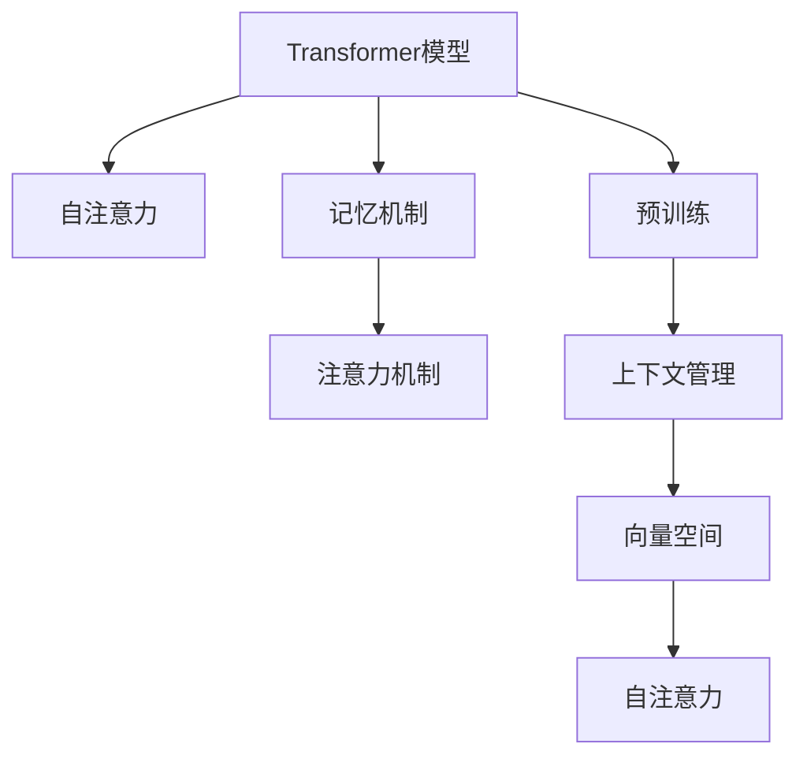

                 

# 大模型问答机器人如何处理上下文

> 关键词：大模型问答, 上下文管理, 记忆机制, 注意力机制, 向量空间, 自注意力, 预训练, 对话数据, 模型训练

## 1. 背景介绍

在自然语言处理(NLP)领域，问答机器人(QA)正逐渐成为信息检索和知识服务的重要工具。不同于传统的基于规则或简单模板的查询系统，大模型问答机器人能够利用深度学习技术，从大规模语料中学习到丰富的语言知识和对话策略，从而更自然、流畅地与用户进行交流。但随着对话深度的增加，模型面临上下文管理的挑战，如何有效管理上下文信息，是提升问答机器人效果的关键问题。

### 1.1 问题由来

现代问答系统要求不仅能够理解单一问题的答案，还需要能够持续追踪对话过程中的上下文信息，保证对话连贯性。传统基于规则或模板的问答系统，由于缺乏足够的语义理解能力，难以应对复杂的对话场景。而大模型问答机器人，通过利用预训练语言模型的泛化能力，可以更好地理解并生成上下文相关的回答，从而显著提升问答效果。

然而，尽管大模型具备强大的语言建模能力，但在处理上下文时，仍存在一些难以克服的问题，如记忆负担过重、注意力机制设计不合理等。这些问题导致模型在实际对话中容易出现上下文丢失、信息重复、回答不连贯等问题，进而影响用户体验。因此，如何设计高效、稳定的上下文管理机制，成为提升大模型问答系统性能的关键。

### 1.2 问题核心关键点

现代大模型问答机器人一般采用基于Transformer的结构。其核心思想是通过预训练学习到丰富的语言表示，再在任务数据上进行微调，使模型能够针对具体问答任务进行优化。其中，上下文管理是关键环节，涉及到如何高效存储、更新和利用对话历史信息。

为了有效处理上下文，现代问答系统主要采用两种机制：

- **记忆机制**：通过在模型内部创建专门的模块或层，用于存储和检索对话历史信息。
- **注意力机制**：在生成每个回答时，通过计算当前回答与历史信息的注意力权重，指导模型如何利用上下文信息。

这些机制在大模型的帮助下，使问答机器人能够更好地处理长对话和复杂任务，极大地提升了问答的流畅度和准确性。但同时，它们也带来了新的挑战，如如何平衡上下文管理和模型效率、如何保证上下文的一致性等。

## 2. 核心概念与联系

### 2.1 核心概念概述

为了更好地理解大模型问答机器人如何处理上下文，本节将介绍几个密切相关的核心概念：

- **Transformer模型**：一种基于自注意力机制的神经网络结构，广泛用于NLP领域的预训练模型，如BERT、GPT等。
- **记忆机制**：通过在模型内部添加专门的存储器模块，用于记录和更新对话历史信息。
- **注意力机制**：一种机制，通过计算当前回答与历史信息的注意力权重，指导模型如何利用上下文信息。
- **向量空间**：将语言信息表示为向量，通过向量空间内的计算，实现语言信息的相似度匹配和向量转换。
- **自注意力**：一种特殊的注意力机制，通过计算输入序列中每个元素与其他元素之间的相似度，指导模型如何处理序列中的信息。
- **预训练**：在大规模无标签语料上进行训练，学习到通用的语言表示，然后在特定任务上微调，使模型能够适应特定任务。
- **对话数据**：包含问答对的数据集，用于训练和测试问答系统的效果。

这些核心概念之间的逻辑关系可以通过以下Mermaid流程图来展示：



这个流程图展示了大模型问答系统的核心概念及其之间的关系：

1. 大模型问答系统基于Transformer模型，采用自注意力机制进行语义理解。
2. 通过记忆机制，模型可以记录和更新对话历史信息。
3. 注意力机制用于计算当前回答与历史信息的注意力权重，指导模型如何利用上下文。
4. 上下文管理基于向量空间进行信息的编码和解码，实现上下文的存储和检索。
5. 自注意力机制进一步优化上下文管理，使模型能够高效处理序列信息。
6. 预训练为模型提供通用的语言表示，在特定任务上进行微调，提升模型的适应性。

这些概念共同构成了大模型问答系统的设计和实现框架，使其能够在各种场景下发挥强大的语言理解和生成能力。通过理解这些核心概念，我们可以更好地把握大模型问答系统的工作原理和优化方向。

## 3. 核心算法原理 & 具体操作步骤
### 3.1 算法原理概述

大模型问答机器人处理上下文的核心算法原理，可以归纳为以下几点：

1. **上下文编码**：将对话历史信息编码成向量，以便在生成当前回答时能够利用。
2. **上下文更新**：根据当前回答和对话历史信息，更新对话上下文。
3. **上下文检索**：从对话历史中检索与当前回答相关的上下文信息，指导模型如何生成回答。
4. **上下文融合**：在生成回答时，融合当前输入和上下文信息，生成更连贯的回答。

这些步骤在Transformer模型的基础上，通过记忆机制和注意力机制的巧妙设计，实现了对上下文的高效管理。

### 3.2 算法步骤详解

以Transformer模型为基础，大模型问答机器人的上下文处理一般包括以下几个关键步骤：

**Step 1: 上下文编码**
- 将对话历史信息按照时间顺序拼接成一个序列，作为Transformer模型的输入。
- 在模型的每个编码层中，通过自注意力机制对输入序列进行编码，得到每个时间步的向量表示。

**Step 2: 上下文更新**
- 在生成当前回答时，将当前输入与上下文编码向量拼接，作为输入进行前向传播。
- 将输出向量进行解码，得到当前回答的概率分布。
- 根据解码器输出和对话历史信息，计算注意力权重，更新对话上下文。

**Step 3: 上下文检索**
- 在每个时间步，根据当前回答和上下文编码向量，计算注意力权重。
- 将上下文编码向量与注意力权重进行加权平均，得到上下文融合向量。
- 将上下文融合向量与当前输入拼接，作为下一时间步的输入。

**Step 4: 上下文融合**
- 在每个时间步，将当前输入和上下文融合向量进行拼接，作为输入进行前向传播。
- 将输出向量进行解码，得到当前回答的概率分布。
- 根据解码器输出和上下文融合向量，计算注意力权重，更新对话上下文。

### 3.3 算法优缺点

大模型问答机器人在处理上下文时，有以下优缺点：

**优点：**
1. 自注意力机制能够高效地处理序列信息，避免传统的记忆机制的负担过重问题。
2. 上下文编码和上下文更新可以灵活地处理不同长度的对话历史，适应多种对话场景。
3. 上下文检索和上下文融合能够动态更新对话上下文，保证对话的一致性。

**缺点：**
1. 自注意力机制的计算复杂度较高，可能会影响模型的推理速度。
2. 上下文管理依赖于序列长度，可能无法有效处理特别长的对话。
3. 上下文融合过程中，存在信息冲突的问题，需要进一步优化。

### 3.4 算法应用领域

大模型问答机器人在处理上下文时，广泛应用于各种自然语言问答系统，如智能客服、在线教育、医疗咨询等。这些系统通过理解用户的问题和上下文信息，能够提供更加个性化、精准的回答，提升用户体验。

在智能客服系统中，大模型问答机器人可以理解用户的意图和上下文信息，提供快速准确的解答，提升客户满意度。

在在线教育平台中，大模型问答机器人可以根据学生的学习记录和上下文信息，提供个性化的学习建议和问题解答，帮助学生更好地掌握知识。

在医疗咨询系统中，大模型问答机器人能够理解病人的症状和对话历史，提供初步诊断和建议，减轻医生的工作负担，提升医疗服务质量。

此外，大模型问答机器人还被应用于各类智能助手、智能家居、智能办公等场景，提供全方位的智能化服务。

## 4. 数学模型和公式 & 详细讲解 & 举例说明
### 4.1 数学模型构建

大模型问答机器人在处理上下文时，一般采用Transformer结构。以自注意力机制为基础，通过上下文编码、上下文更新、上下文检索和上下文融合等步骤，实现对对话历史的高效管理。

### 4.2 公式推导过程

以Transformer模型的自注意力机制为例，推导上下文编码和上下文更新的数学公式。

设输入序列为 $x=(x_1,x_2,\ldots,x_n)$，其中 $x_i \in \mathbb{R}^d$ 为第 $i$ 个时间步的向量表示。上下文编码的计算过程如下：

$$
\tilde{x}_i = \text{Attention}(Q_i,K_j,V_j)
$$

其中 $Q_i=\left[x_i;y_i\right]$，$K_j$ 和 $V_j$ 分别为上下文编码序列中的查询和值向量，$\text{Attention}$ 为自注意力机制。

在生成当前回答时，上下文更新的计算过程如下：

$$
\hat{x}_i = \text{Attention}(Q_i,K_j,V_j)
$$

其中 $\hat{x}_i$ 为当前回答的向量表示。

将上下文编码 $\tilde{x}_i$ 与上下文更新 $\hat{x}_i$ 拼接，作为下一时间步的输入。

### 4.3 案例分析与讲解

假设有一个基于Transformer的问答系统，需要处理如下对话：

**输入**：
```
- 用户：我最近感觉头晕，请问我该怎么办？
- 系统：您感觉头晕多久了？
- 用户：大概一周了，总是突然晕倒。
- 系统：您需要去医院检查头部CT。
```

系统在处理该对话时，需要进行上下文编码、上下文更新和上下文检索等步骤：

1. **上下文编码**：将对话历史信息编码成向量，得到 $x_1=([用户：我最近感觉头晕，请问我该怎么办？]; [系统：您感觉头晕多久了？])$ 和 $x_2=([用户：大概一周了，总是突然晕倒。])$。

2. **上下文更新**：在生成“您需要去医院检查头部CT”时，将当前输入“用户：我最近感觉头晕，请问我该怎么办？”与上下文编码向量 $x_1$ 拼接，作为输入进行前向传播。输出向量 $\hat{x}_3$ 通过上下文更新得到，表示当前回答的概率分布。

3. **上下文检索**：在每个时间步，根据当前回答和上下文编码向量，计算注意力权重，更新对话上下文。在生成“您需要去医院检查头部CT”时，上下文检索和上下文融合的具体过程如下：
   - 计算注意力权重：$\alpha_{i,j}=\text{softmax}(\text{Attention}(Q_3,K_j,V_j))$，其中 $Q_3$ 为当前回答的向量表示。
   - 上下文检索：$\tilde{x}_3=\alpha_{i,j}V_j$，其中 $V_j$ 为上下文编码向量。
   - 上下文融合：$x_3=\text{Attention}(Q_3,K_j,V_j)$，其中 $K_j$ 和 $V_j$ 分别为上下文编码序列中的查询和值向量。

4. **上下文融合**：在每个时间步，将当前输入和上下文融合向量进行拼接，作为输入进行前向传播。在生成“您需要去医院检查头部CT”时，上下文融合的具体过程如下：
   - 上下文融合：$x_4=\text{Attention}(Q_4,K_j,V_j)$，其中 $Q_4$ 为当前输入的向量表示。
   - 上下文更新：$\hat{x}_4=\text{Attention}(Q_4,K_j,V_j)$，其中 $K_j$ 和 $V_j$ 分别为上下文编码序列中的查询和值向量。

通过上述步骤，系统能够高效地处理上下文信息，生成连贯、准确的答案。

## 5. 项目实践：代码实例和详细解释说明
### 5.1 开发环境搭建

在进行大模型问答机器人项目实践前，我们需要准备好开发环境。以下是使用Python进行PyTorch开发的环境配置流程：

1. 安装Anaconda：从官网下载并安装Anaconda，用于创建独立的Python环境。

2. 创建并激活虚拟环境：
```bash
conda create -n pytorch-env python=3.8 
conda activate pytorch-env
```

3. 安装PyTorch：根据CUDA版本，从官网获取对应的安装命令。例如：
```bash
conda install pytorch torchvision torchaudio cudatoolkit=11.1 -c pytorch -c conda-forge
```

4. 安装Transformers库：
```bash
pip install transformers
```

5. 安装各类工具包：
```bash
pip install numpy pandas scikit-learn matplotlib tqdm jupyter notebook ipython
```

完成上述步骤后，即可在`pytorch-env`环境中开始项目实践。

### 5.2 源代码详细实现

下面我们以命名实体识别(NER)任务为例，给出使用Transformers库对BERT模型进行微调的PyTorch代码实现。

首先，定义NER任务的数据处理函数：

```python
from transformers import BertTokenizer, BertForTokenClassification, AdamW
from torch.utils.data import Dataset, DataLoader
import torch
import numpy as np

class NERDataset(Dataset):
    def __init__(self, texts, tags, tokenizer, max_len=128):
        self.texts = texts
        self.tags = tags
        self.tokenizer = tokenizer
        self.max_len = max_len
        
    def __len__(self):
        return len(self.texts)
    
    def __getitem__(self, item):
        text = self.texts[item]
        tags = self.tags[item]
        
        encoding = self.tokenizer(text, return_tensors='pt', max_length=self.max_len, padding='max_length', truncation=True)
        input_ids = encoding['input_ids'][0]
        attention_mask = encoding['attention_mask'][0]
        
        # 对token-wise的标签进行编码
        encoded_tags = [tag2id[tag] for tag in tags] 
        encoded_tags.extend([tag2id['O']] * (self.max_len - len(encoded_tags)))
        labels = torch.tensor(encoded_tags, dtype=torch.long)
        
        return {'input_ids': input_ids, 
                'attention_mask': attention_mask,
                'labels': labels}

# 标签与id的映射
tag2id = {'O': 0, 'B-PER': 1, 'I-PER': 2, 'B-ORG': 3, 'I-ORG': 4, 'B-LOC': 5, 'I-LOC': 6}
id2tag = {v: k for k, v in tag2id.items()}

# 创建dataset
tokenizer = BertTokenizer.from_pretrained('bert-base-cased')

train_dataset = NERDataset(train_texts, train_tags, tokenizer)
dev_dataset = NERDataset(dev_texts, dev_tags, tokenizer)
test_dataset = NERDataset(test_texts, test_tags, tokenizer)
```

然后，定义模型和优化器：

```python
model = BertForTokenClassification.from_pretrained('bert-base-cased', num_labels=len(tag2id))

optimizer = AdamW(model.parameters(), lr=2e-5)
```

接着，定义训练和评估函数：

```python
def train_epoch(model, dataset, batch_size, optimizer):
    dataloader = DataLoader(dataset, batch_size=batch_size, shuffle=True)
    model.train()
    epoch_loss = 0
    for batch in dataloader:
        input_ids = batch['input_ids'].to(device)
        attention_mask = batch['attention_mask'].to(device)
        labels = batch['labels'].to(device)
        model.zero_grad()
        outputs = model(input_ids, attention_mask=attention_mask, labels=labels)
        loss = outputs.loss
        epoch_loss += loss.item()
        loss.backward()
        optimizer.step()
    return epoch_loss / len(dataloader)

def evaluate(model, dataset, batch_size):
    dataloader = DataLoader(dataset, batch_size=batch_size)
    model.eval()
    preds, labels = [], []
    with torch.no_grad():
        for batch in dataloader:
            input_ids = batch['input_ids'].to(device)
            attention_mask = batch['attention_mask'].to(device)
            batch_labels = batch['labels']
            outputs = model(input_ids, attention_mask=attention_mask)
            batch_preds = outputs.logits.argmax(dim=2).to('cpu').tolist()
            batch_labels = batch_labels.to('cpu').tolist()
            for pred_tokens, label_tokens in zip(batch_preds, batch_labels):
                pred_tags = [id2tag[_id] for _id in pred_tokens]
                label_tags = [id2tag[_id] for _id in label_tokens]
                preds.append(pred_tags[:len(label_tags)])
                labels.append(label_tags)
                
    print(classification_report(labels, preds))
```

最后，启动训练流程并在测试集上评估：

```python
epochs = 5
batch_size = 16

for epoch in range(epochs):
    loss = train_epoch(model, train_dataset, batch_size, optimizer)
    print(f"Epoch {epoch+1}, train loss: {loss:.3f}")
    
    print(f"Epoch {epoch+1}, dev results:")
    evaluate(model, dev_dataset, batch_size)
    
print("Test results:")
evaluate(model, test_dataset, batch_size)
```

以上就是使用PyTorch对BERT进行命名实体识别任务微调的完整代码实现。可以看到，得益于Transformers库的强大封装，我们可以用相对简洁的代码完成BERT模型的加载和微调。

### 5.3 代码解读与分析

让我们再详细解读一下关键代码的实现细节：

**NERDataset类**：
- `__init__`方法：初始化文本、标签、分词器等关键组件。
- `__len__`方法：返回数据集的样本数量。
- `__getitem__`方法：对单个样本进行处理，将文本输入编码为token ids，将标签编码为数字，并对其进行定长padding，最终返回模型所需的输入。

**tag2id和id2tag字典**：
- 定义了标签与数字id之间的映射关系，用于将token-wise的预测结果解码回真实的标签。

**训练和评估函数**：
- 使用PyTorch的DataLoader对数据集进行批次化加载，供模型训练和推理使用。
- 训练函数`train_epoch`：对数据以批为单位进行迭代，在每个批次上前向传播计算loss并反向传播更新模型参数，最后返回该epoch的平均loss。
- 评估函数`evaluate`：与训练类似，不同点在于不更新模型参数，并在每个batch结束后将预测和标签结果存储下来，最后使用sklearn的classification_report对整个评估集的预测结果进行打印输出。

**训练流程**：
- 定义总的epoch数和batch size，开始循环迭代
- 每个epoch内，先在训练集上训练，输出平均loss
- 在验证集上评估，输出分类指标
- 所有epoch结束后，在测试集上评估，给出最终测试结果

可以看到，PyTorch配合Transformers库使得BERT微调的代码实现变得简洁高效。开发者可以将更多精力放在数据处理、模型改进等高层逻辑上，而不必过多关注底层的实现细节。

当然，工业级的系统实现还需考虑更多因素，如模型的保存和部署、超参数的自动搜索、更灵活的任务适配层等。但核心的微调范式基本与此类似。

## 6. 实际应用场景
### 6.1 智能客服系统

基于大语言模型微调的对话技术，可以广泛应用于智能客服系统的构建。传统客服往往需要配备大量人力，高峰期响应缓慢，且一致性和专业性难以保证。而使用微调后的对话模型，可以7x24小时不间断服务，快速响应客户咨询，用自然流畅的语言解答各类常见问题。

在技术实现上，可以收集企业内部的历史客服对话记录，将问题和最佳答复构建成监督数据，在此基础上对预训练对话模型进行微调。微调后的对话模型能够自动理解用户意图，匹配最合适的答案模板进行回复。对于客户提出的新问题，还可以接入检索系统实时搜索相关内容，动态组织生成回答。如此构建的智能客服系统，能大幅提升客户咨询体验和问题解决效率。

### 6.2 金融舆情监测

金融机构需要实时监测市场舆论动向，以便及时应对负面信息传播，规避金融风险。传统的人工监测方式成本高、效率低，难以应对网络时代海量信息爆发的挑战。基于大语言模型微调的文本分类和情感分析技术，为金融舆情监测提供了新的解决方案。

具体而言，可以收集金融领域相关的新闻、报道、评论等文本数据，并对其进行主题标注和情感标注。在此基础上对预训练语言模型进行微调，使其能够自动判断文本属于何种主题，情感倾向是正面、中性还是负面。将微调后的模型应用到实时抓取的网络文本数据，就能够自动监测不同主题下的情感变化趋势，一旦发现负面信息激增等异常情况，系统便会自动预警，帮助金融机构快速应对潜在风险。

### 6.3 个性化推荐系统

当前的推荐系统往往只依赖用户的历史行为数据进行物品推荐，无法深入理解用户的真实兴趣偏好。基于大语言模型微调技术，个性化推荐系统可以更好地挖掘用户行为背后的语义信息，从而提供更精准、多样的推荐内容。

在实践中，可以收集用户浏览、点击、评论、分享等行为数据，提取和用户交互的物品标题、描述、标签等文本内容。将文本内容作为模型输入，用户的后续行为（如是否点击、购买等）作为监督信号，在此基础上微调预训练语言模型。微调后的模型能够从文本内容中准确把握用户的兴趣点。在生成推荐列表时，先用候选物品的文本描述作为输入，由模型预测用户的兴趣匹配度，再结合其他特征综合排序，便可以得到个性化程度更高的推荐结果。

### 6.4 未来应用展望

随着大语言模型微调技术的发展，其在更多领域的应用前景将更加广阔。

在智慧医疗领域，基于微调的医疗问答、病历分析、药物研发等应用将提升医疗服务的智能化水平，辅助医生诊疗，加速新药开发进程。

在智能教育领域，微调技术可应用于作业批改、学情分析、知识推荐等方面，因材施教，促进教育公平，提高教学质量。

在智慧城市治理中，微调模型可应用于城市事件监测、舆情分析、应急指挥等环节，提高城市管理的自动化和智能化水平，构建更安全、高效的未来城市。

此外，在企业生产、社会治理、文娱传媒等众多领域，基于大模型微调的人工智能应用也将不断涌现，为经济社会发展注入新的动力。相信随着技术的日益成熟，微调方法将成为人工智能落地应用的重要范式，推动人工智能技术在垂直行业的规模化落地。

## 7. 工具和资源推荐
### 7.1 学习资源推荐

为了帮助开发者系统掌握大语言模型微调的理论基础和实践技巧，这里推荐一些优质的学习资源：

1. 《Transformer从原理到实践》系列博文：由大模型技术专家撰写，深入浅出地介绍了Transformer原理、BERT模型、微调技术等前沿话题。

2. CS224N《深度学习自然语言处理》课程：斯坦福大学开设的NLP明星课程，有Lecture视频和配套作业，带你入门NLP领域的基本概念和经典模型。

3. 《Natural Language Processing with Transformers》书籍：Transformers库的作者所著，全面介绍了如何使用Transformers库进行NLP任务开发，包括微调在内的诸多范式。

4. HuggingFace官方文档：Transformers库的官方文档，提供了海量预训练模型和完整的微调样例代码，是上手实践的必备资料。

5. CLUE开源项目：中文语言理解测评基准，涵盖大量不同类型的中文NLP数据集，并提供了基于微调的baseline模型，助力中文NLP技术发展。

通过对这些资源的学习实践，相信你一定能够快速掌握大语言模型微调的精髓，并用于解决实际的NLP问题。
###  7.2 开发工具推荐

高效的开发离不开优秀的工具支持。以下是几款用于大语言模型微调开发的常用工具：

1. PyTorch：基于Python的开源深度学习框架，灵活动态的计算图，适合快速迭代研究。大部分预训练语言模型都有PyTorch版本的实现。

2. TensorFlow：由Google主导开发的开源深度学习框架，生产部署方便，适合大规模工程应用。同样有丰富的预训练语言模型资源。

3. Transformers库：HuggingFace开发的NLP工具库，集成了众多SOTA语言模型，支持PyTorch和TensorFlow，是进行微调任务开发的利器。

4. Weights & Biases：模型训练的实验跟踪工具，可以记录和可视化模型训练过程中的各项指标，方便对比和调优。与主流深度学习框架无缝集成。

5. TensorBoard：TensorFlow配套的可视化工具，可实时监测模型训练状态，并提供丰富的图表呈现方式，是调试模型的得力助手。

6. Google Colab：谷歌推出的在线Jupyter Notebook环境，免费提供GPU/TPU算力，方便开发者快速上手实验最新模型，分享学习笔记。

合理利用这些工具，可以显著提升大语言模型微调任务的开发效率，加快创新迭代的步伐。

### 7.3 相关论文推荐

大语言模型和微调技术的发展源于学界的持续研究。以下是几篇奠基性的相关论文，推荐阅读：

1. Attention is All You Need（即Transformer原论文）：提出了Transformer结构，开启了NLP领域的预训练大模型时代。

2. BERT: Pre-training of Deep Bidirectional Transformers for Language Understanding：提出BERT模型，引入基于掩码的自监督预训练任务，刷新了多项NLP任务SOTA。

3. Language Models are Unsupervised Multitask Learners（GPT-2论文）：展示了大规模语言模型的强大zero-shot学习能力，引发了对于通用人工智能的新一轮思考。

4. Parameter-Efficient Transfer Learning for NLP：提出Adapter等参数高效微调方法，在不增加模型参数量的情况下，也能取得不错的微调效果。

5. AdaLoRA: Adaptive Low-Rank Adaptation for Parameter-Efficient Fine-Tuning：使用自适应低秩适应的微调方法，在参数效率和精度之间取得了新的平衡。

这些论文代表了大语言模型微调技术的发展脉络。通过学习这些前沿成果，可以帮助研究者把握学科前进方向，激发更多的创新灵感。

## 8. 总结：未来发展趋势与挑战
### 8.1 总结

本文对基于大模型问答机器人处理上下文的技术进行了全面系统的介绍。首先阐述了大语言模型和微调技术的研究背景和意义，明确了微调在拓展预训练模型应用、提升下游任务性能方面的独特价值。其次，从原理到实践，详细讲解了监督微调的数学原理和关键步骤，给出了微调任务开发的完整代码实例。同时，本文还广泛探讨了微调方法在智能客服、金融舆情、个性化推荐等多个行业领域的应用前景，展示了微调范式的巨大潜力。此外，本文精选了微调技术的各类学习资源，力求为读者提供全方位的技术指引。

通过本文的系统梳理，可以看到，基于大模型问答机器人的微调方法正在成为NLP领域的重要范式，极大地拓展了预训练语言模型的应用边界，催生了更多的落地场景。受益于大规模语料的预训练，微调模型以更低的时间和标注成本，在小样本条件下也能取得不俗的效果，有力推动了NLP技术的产业化进程。未来，伴随预训练语言模型和微调方法的持续演进，相信NLP技术将在更广阔的应用领域大放异彩，深刻影响人类的生产生活方式。

### 8.2 未来发展趋势

展望未来，大模型问答机器人处理上下文的微调技术将呈现以下几个发展趋势：

1. 模型规模持续增大。随着算力成本的下降和数据规模的扩张，预训练语言模型的参数量还将持续增长。超大规模语言模型蕴含的丰富语言知识，有望支撑更加复杂多变的上下文处理任务。

2. 微调方法日趋多样。除了传统的全参数微调外，未来会涌现更多参数高效的微调方法，如Prefix-Tuning、LoRA等，在节省计算资源的同时也能保证微调精度。

3. 上下文管理进一步优化。未来的上下文管理将更加灵活高效，能够动态更新和融合上下文信息，实现更加连贯、自然的对话交互。

4. 跨模态上下文融合。未来的上下文管理不仅限于文本信息，还将扩展到图像、视频、语音等多模态信息，实现多模态信息的高效融合和理解。

5. 上下文一致性保障。未来的上下文管理将更加注重上下文的一致性和连贯性，避免上下文信息的丢失和重复，提升对话流畅性和用户体验。

6. 上下文增强机制引入。未来的上下文管理将引入上下文增强机制，通过动态调整上下文信息，提升模型的上下文推理能力和效果。

这些趋势凸显了大模型问答机器人微调技术的广阔前景。这些方向的探索发展，必将进一步提升问答系统的性能和应用范围，为人类认知智能的进化带来深远影响。

### 8.3 面临的挑战

尽管大模型问答机器人处理上下文的微调技术已经取得了瞩目成就，但在迈向更加智能化、普适化应用的过程中，它仍面临着诸多挑战：

1. 上下文管理负担过重。尽管自注意力机制能够高效处理序列信息，但在处理长对话时，仍存在一定的计算负担和存储压力。

2. 上下文一致性问题。上下文信息的动态更新和融合可能导致上下文信息丢失，影响对话连贯性。

3. 上下文推理能力不足。当前的上下文管理方法，难以处理特别复杂的上下文推理任务，限制了其应用范围。

4. 上下文增强机制有待优化。现有的上下文增强机制，难以有效地提升上下文推理能力和效果，需要进一步研究。

5. 跨模态上下文融合问题。目前的上下文管理方法，难以处理跨模态信息融合，限制了其应用场景。

6. 上下文记忆负担。现有的上下文管理方法，对于长对话，仍存在一定的记忆负担。

这些挑战需要进一步的探索和研究，以提高大模型问答机器人处理上下文的性能和稳定性。

### 8.4 未来突破

面对大模型问答机器人处理上下文的微调所面临的种种挑战，未来的研究需要在以下几个方面寻求新的突破：

1. 探索无监督和半监督微调方法。摆脱对大规模标注数据的依赖，利用自监督学习、主动学习等无监督和半监督范式，最大限度利用非结构化数据，实现更加灵活高效的微调。

2. 研究参数高效和计算高效的微调范式。开发更加参数高效的微调方法，在固定大部分预训练参数的同时，只更新极少量的任务相关参数。同时优化微调模型的计算图，减少前向传播和反向传播的资源消耗，实现更加轻量级、实时性的部署。

3. 引入更多先验知识。将符号化的先验知识，如知识图谱、逻辑规则等，与神经网络模型进行巧妙融合，引导微调过程学习更准确、合理的语言模型。同时加强不同模态数据的整合，实现视觉、语音等多模态信息与文本信息的协同建模。

4. 结合因果分析和博弈论工具。将因果分析方法引入微调模型，识别出模型决策的关键特征，增强输出解释的因果性和逻辑性。借助博弈论工具刻画人机交互过程，主动探索并规避模型的脆弱点，提高系统稳定性。

5. 纳入伦理道德约束。在模型训练目标中引入伦理导向的评估指标，过滤和惩罚有偏见、有害的输出倾向。同时加强人工干预和审核，建立模型行为的监管机制，确保输出符合人类价值观和伦理道德。

这些研究方向的探索，必将引领大模型问答机器人微调技术迈向更高的台阶，为构建安全、可靠、可解释、可控的智能系统铺平道路。面向未来，大模型问答机器人微调技术还需要与其他人工智能技术进行更深入的融合，如知识表示、因果推理、强化学习等，多路径协同发力，共同推动自然语言理解和智能交互系统的进步。只有勇于创新、敢于突破，才能不断拓展语言模型的边界，让智能技术更好地造福人类社会。

## 9. 附录：常见问题与解答

**Q1：大语言模型问答机器人如何处理上下文？**

A: 大语言模型问答机器人处理上下文的核心算法原理，可以归纳为以下几点：

1. **上下文编码**：将对话历史信息编码成向量，以便在生成当前回答时能够利用。
2. **上下文更新**：根据当前回答和对话历史信息，更新对话上下文。
3. **上下文检索**：从对话历史中检索与当前回答相关的上下文信息，指导模型如何利用上下文信息。
4. **上下文融合**：在生成回答时，融合当前输入和上下文信息，生成更连贯的回答。

通过这些步骤，大语言模型问答机器人能够高效地处理上下文信息，生成连贯、准确的答案。

**Q2：上下文管理中常见的挑战是什么？**

A: 上下文管理中常见的挑战包括：

1. **上下文记忆负担**：现有的上下文管理方法，对于长对话，仍存在一定的记忆负担。
2. **上下文一致性问题**：上下文信息的动态更新和融合可能导致上下文信息丢失，影响对话连贯性。
3. **上下文推理能力不足**：当前的上下文管理方法，难以处理特别复杂的上下文推理任务，限制了其应用范围。
4. **上下文增强机制有待优化**：现有的上下文增强机制，难以有效地提升上下文推理能力和效果，需要进一步研究。
5. **跨模态上下文融合问题**：目前的上下文管理方法，难以处理跨模态信息融合，限制了其应用场景。

这些挑战需要进一步的探索和研究，以提高大模型问答机器人处理上下文的性能和稳定性。

**Q3：如何提高大模型问答机器人的上下文推理能力？**

A: 提高大模型问答机器人的上下文推理能力，可以从以下几个方面入手：

1. **引入因果分析方法**：将因果分析方法引入微调模型，识别出模型决策的关键特征，增强输出解释的因果性和逻辑性。
2. **借助博弈论工具**：借助博弈论工具刻画人机交互过程，主动探索并规避模型的脆弱点，提高系统稳定性。
3. **加入先验知识**：将符号化的先验知识，如知识图谱、逻辑规则等，与神经网络模型进行巧妙融合，引导微调过程学习更准确、合理的语言模型。

通过这些方法，可以提高大模型问答机器人的上下文推理能力和效果。

**Q4：上下文增强机制有哪些？**

A: 上下文增强机制有多种，常见的包括：

1. **记忆机制**：通过在模型内部添加专门的存储器模块，用于记录和更新对话历史信息。
2. **注意力机制**：在生成每个回答时，通过计算当前回答与历史信息的注意力权重，指导模型如何利用上下文信息。
3. **向量空间**：将语言信息表示为向量，通过向量空间内的计算，实现语言信息的相似度匹配和向量转换。
4. **自注意力**：一种特殊的注意力机制，通过计算输入序列中每个元素与其他元素之间的相似度，指导模型如何处理序列中的信息。

这些机制在大模型的帮助下，使问答机器人能够更好地处理长对话和复杂任务，极大地提升了问答的流畅度和准确性。

**Q5：上下文管理在大模型问答机器人中的应用场景有哪些？**

A: 上下文管理在大模型问答机器人中的应用场景包括：

1. **智能客服系统**：通过理解用户的问题和上下文信息，能够提供更加个性化、精准的回答，提升客户满意度。
2. **金融舆情监测**：通过理解金融领域相关的新闻、报道、评论等文本数据，自动判断文本属于何种主题，情感倾向是正面、中性还是负面，实现实时舆情监测。
3. **个性化推荐系统**：通过理解用户的浏览、点击、评论、分享等行为数据，提取和用户交互的物品标题、描述、标签等文本内容，生成推荐列表，提供个性化推荐。
4. **医疗咨询系统**：通过理解病人的症状和对话历史，提供初步诊断和建议，减轻医生的工作负担，提升医疗服务质量。

这些应用场景展示了上下文管理在大模型问答机器人中的重要性和广泛应用。

---

作者：禅与计算机程序设计艺术 / Zen and the Art of Computer Programming

