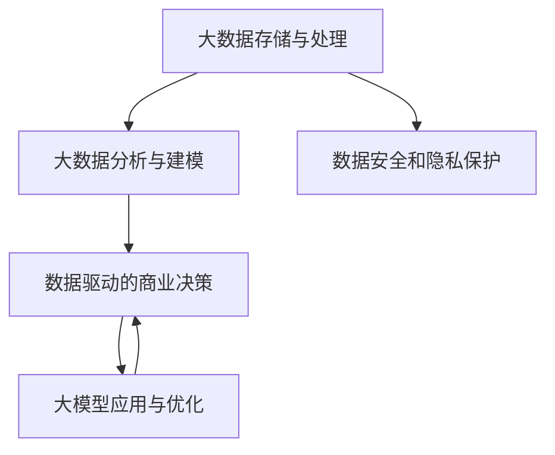

                 

## 1. 背景介绍

### 1.1 问题由来

随着科技的迅猛发展，企业的数据量急剧增长。如何利用这些海量数据提升业务运营效率，驱动商业变革，已成为企业管理者的重要课题。数据驱动的决策支持系统、基于机器学习的营销优化、智能客服等新兴应用，正逐步成为提升企业竞争力的关键。

然而，传统的数据分析方法往往难以应对大规模、多源异构、实时动态的数据挑战。如何高效地整合、清洗、分析和利用这些数据，为业务决策提供有力支撑，是数据科学家和商业分析师面临的巨大难题。

### 1.2 问题核心关键点

大数据分析的核心在于挖掘数据中的隐藏价值，生成有意义的洞察。在数据驱动的商业变革中，大模型和大数据技术发挥着关键作用：

1. **大数据存储与处理**：
   - 通过分布式存储和并行计算技术，将海量数据高效存储并快速处理，为商业决策提供实时数据支持。
   - 典型的技术包括Hadoop、Spark等大数据处理平台。

2. **大数据分析与建模**：
   - 利用机器学习、深度学习等算法对数据进行建模，生成预测、分类、聚类等结果，为商业策略制定提供依据。
   - 常用的模型包括线性回归、决策树、神经网络等。

3. **大模型应用与优化**：
   - 基于大规模预训练模型，通过迁移学习或微调等技术，对特定领域数据进行优化，提升模型的性能和泛化能力。
   - 典型的大模型包括BERT、GPT、T5等。

4. **数据驱动的商业决策**：
   - 将大数据分析和模型预测结果转化为实际业务决策，优化运营流程、提升营销效果、优化产品设计等。
   - 数据驱动的决策过程，包括数据收集、清洗、建模、分析、可视化和反馈迭代等多个环节。

5. **数据安全和隐私保护**：
   - 在数据收集、存储、传输和使用的全过程中，确保数据的完整性、安全性和隐私保护，防止数据泄露和滥用。
   - 涉及的数据安全和隐私保护技术包括加密、匿名化、差分隐私等。

通过掌握和应用这些核心技术，企业可以更好地利用数据资源，驱动商业决策，实现从传统经验型管理向数据驱动的智能化转型。

### 1.3 问题研究意义

在大数据时代，数据驱动的商业变革将成为企业制胜的法宝。通过数据驱动的决策支持系统，企业能够实现以下目标：

1. **提升运营效率**：
   - 利用大数据分析优化生产流程、供应链管理等，降低运营成本，提升响应速度。
   - 例如，通过预测分析预测设备故障，减少停机时间和维护成本。

2. **个性化营销**：
   - 利用客户行为数据分析，实现个性化推荐、精准营销，提高客户满意度和忠诚度。
   - 例如，电商平台利用用户浏览记录推荐商品，提升转化率。

3. **产品创新**：
   - 通过分析用户反馈和市场趋势，发现产品改进和新产品开发的潜力，加速产品迭代。
   - 例如，基于用户评论分析改进产品质量，提升用户体验。

4. **风险控制**：
   - 利用大数据分析风险因素，提前发现潜在问题，采取应对措施，降低风险。
   - 例如，通过金融大数据预测市场风险，规避金融危机。

5. **智能客服**：
   - 利用自然语言处理(NLP)技术，构建智能客服系统，提升客户服务质量，减少人力成本。
   - 例如，智能客服系统自动回答用户问题，提高问题解决效率。

数据驱动的商业变革不仅能提升企业效率，还将在塑造未来商业生态、优化市场资源配置等方面发挥重要作用，推动经济社会向更高阶段迈进。

## 2. 核心概念与联系

### 2.1 核心概念概述

在数据驱动的商业变革中，大模型和大数据技术是核心要素。这些技术共同构成了一个复杂的数据生态系统，涉及数据收集、存储、处理、分析和应用等多个环节。

- **大数据存储与处理**：
  - 通过分布式存储和并行计算技术，实现海量数据的快速访问和处理。

- **大数据分析与建模**：
  - 利用机器学习、深度学习等算法，对数据进行建模，生成预测、分类、聚类等结果。

- **大模型应用与优化**：
  - 基于大规模预训练模型，通过迁移学习或微调等技术，对特定领域数据进行优化。

- **数据驱动的商业决策**：
  - 将大数据分析和模型预测结果转化为实际业务决策，优化运营流程、提升营销效果、优化产品设计等。

- **数据安全和隐私保护**：
  - 在数据收集、存储、传输和使用的全过程中，确保数据的完整性、安全性和隐私保护。

这些概念之间的逻辑关系可以通过以下Mermaid流程图来展示：



这个流程图展示了大数据生态系统的核心概念及其之间的关系：

1. **大数据存储与处理**：
   - 提供数据存储和处理的基石。

2. **大数据分析与建模**：
   - 将原始数据转化为有意义的洞察，驱动商业决策。

3. **数据驱动的商业决策**：
   - 将分析结果转化为实际决策，优化业务运营。

4. **大模型应用与优化**：
   - 利用大模型提升分析精度和泛化能力，优化决策过程。

5. **数据安全和隐私保护**：
   - 确保数据安全和隐私，保障数据驱动的决策可信度。

## 3. 核心算法原理 & 具体操作步骤

### 3.1 算法原理概述

在大数据驱动的商业变革中，大模型和大数据分析是核心技术。其核心算法原理主要包括以下几个方面：

1. **分布式存储与计算**：
   - 通过Hadoop、Spark等分布式计算平台，将海量数据存储在多个节点中，通过并行计算实现高效数据处理。

2. **大数据分析与建模**：
   - 利用机器学习、深度学习等算法对数据进行建模，生成预测、分类、聚类等结果。
   - 常见的算法包括线性回归、决策树、神经网络等。

3. **大模型应用与优化**：
   - 基于大规模预训练模型，通过迁移学习或微调等技术，对特定领域数据进行优化，提升模型的性能和泛化能力。
   - 典型的大模型包括BERT、GPT、T5等。

4. **数据驱动的商业决策**：
   - 将大数据分析和模型预测结果转化为实际业务决策，优化运营流程、提升营销效果、优化产品设计等。
   - 数据驱动的决策过程，包括数据收集、清洗、建模、分析、可视化和反馈迭代等多个环节。

### 3.2 算法步骤详解

大模型和大数据分析的应用步骤一般包括以下几个关键环节：

**Step 1: 数据收集与存储**
- 通过爬虫、API、ETL等技术手段，从不同数据源收集海量数据。
- 利用分布式存储技术，如Hadoop、Spark等，将数据高效存储在多个节点中，确保数据访问速度和处理效率。

**Step 2: 数据清洗与预处理**
- 对收集到的数据进行清洗，去除噪声、缺失值和异常值。
- 进行数据格式化、转换和归一化，确保数据一致性和可用性。

**Step 3: 数据分析与建模**
- 利用机器学习、深度学习等算法对数据进行建模，生成预测、分类、聚类等结果。
- 常用的算法包括线性回归、决策树、神经网络等。

**Step 4: 大模型应用与优化**
- 基于大规模预训练模型，通过迁移学习或微调等技术，对特定领域数据进行优化，提升模型的性能和泛化能力。
- 典型的大模型包括BERT、GPT、T5等。

**Step 5: 商业决策与反馈**
- 将大数据分析和模型预测结果转化为实际业务决策，优化运营流程、提升营销效果、优化产品设计等。
- 数据驱动的决策过程，包括数据收集、清洗、建模、分析、可视化和反馈迭代等多个环节。

### 3.3 算法优缺点

大模型和大数据分析技术在提升商业决策和运营效率方面具有显著优势：

**优点**：
1. **高效处理海量数据**：
   - 通过分布式存储和并行计算技术，能够高效处理海量数据，满足实时分析需求。
   - 如Hadoop、Spark等分布式计算平台的应用，显著提升了数据处理速度。

2. **提升决策精度**：
   - 通过大数据分析和机器学习建模，能够生成精确的预测、分类、聚类等结果，为决策提供科学依据。
   - 利用深度学习等高级算法，模型精度和泛化能力更强。

3. **灵活适应业务需求**：
   - 大模型能够快速适应新场景和新需求，通过迁移学习或微调等技术，在不同领域和任务上表现出色。
   - 如BERT、GPT等通用大模型，能够在文本、图像、语音等多种模态上实现泛化。

**缺点**：
1. **高昂的成本**：
   - 构建大数据分析平台和应用系统需要大量的硬件投入和软件开发成本。
   - 如Hadoop、Spark等分布式计算平台需要大规模集群和高性能计算资源。

2. **复杂的技术难度**：
   - 数据采集、清洗、建模、分析等环节复杂度较高，需要专业的技术团队支持。
   - 如深度学习模型的调参、训练和优化，需要深厚的数学和算法背景。

3. **数据安全和隐私问题**：
   - 在数据收集、存储、传输和使用的全过程中，需要确保数据的完整性、安全性和隐私保护。
   - 数据泄露和滥用风险较高，需要严格的数据安全管理措施。

4. **实时性要求高**：
   - 数据驱动的商业决策需要实时响应，数据处理速度和分析效率必须满足实时需求。
   - 对系统架构和硬件资源要求较高，如实时流处理技术的应用。

尽管存在这些局限性，但大模型和大数据分析技术在数据驱动的商业变革中仍具有重要的应用价值和研究意义。

### 3.4 算法应用领域

大模型和大数据分析技术已经在多个领域得到了广泛应用，以下是一些典型案例：

1. **金融领域**：
   - 利用大数据分析金融市场趋势、客户行为等，预测市场风险，优化投资策略。
   - 利用深度学习模型进行欺诈检测、信用评分、风险管理等。

2. **电商领域**：
   - 利用客户行为数据分析，实现个性化推荐、精准营销，提升客户满意度和忠诚度。
   - 利用机器学习模型进行库存优化、价格策略、物流管理等。

3. **医疗领域**：
   - 利用医疗大数据分析患者病历、基因信息等，辅助诊断和治疗，提升医疗服务质量。
   - 利用深度学习模型进行医学影像分析、药物发现等。

4. **能源领域**：
   - 利用能源大数据分析能源消耗、供应情况等，优化能源管理，降低能源成本。
   - 利用机器学习模型进行能源需求预测、故障诊断、运行优化等。

5. **城市管理**：
   - 利用城市大数据分析交通流量、环境质量等，优化城市管理，提升居民生活质量。
   - 利用深度学习模型进行交通拥堵预测、环境监测、智能安防等。

大模型和大数据分析技术已经在诸多领域实现了商业应用，助力企业实现智能化转型和运营优化。未来，随着技术不断演进，将会有更多行业受益于数据驱动的商业变革。

## 4. 数学模型和公式 & 详细讲解  
### 4.1 数学模型构建

在本节中，我们将使用数学语言对大数据分析和大模型应用的过程进行严格刻画。

设原始数据集为 $D=\{(x_i,y_i)\}_{i=1}^N$，其中 $x_i$ 表示输入特征，$y_i$ 表示标签或输出结果。我们希望通过机器学习算法 $f(x;\theta)$ 对数据进行建模，生成预测结果 $y_{pred}=f(x;\theta)$。其中 $\theta$ 为模型参数，需要通过数据集 $D$ 进行优化。

目标函数为均方误差（MSE）：

$$
\mathcal{L}(\theta) = \frac{1}{N}\sum_{i=1}^N (y_i - y_{pred})^2
$$

通过优化算法（如梯度下降、随机梯度下降等），不断更新模型参数 $\theta$，最小化损失函数 $\mathcal{L}$，得到最优参数 $\theta^*$。

### 4.2 公式推导过程

以线性回归模型为例，推导其损失函数及梯度计算公式。

假设模型 $f(x;\theta) = \theta_0 + \theta_1 x_1 + \theta_2 x_2 + ... + \theta_n x_n$，目标为最小化均方误差损失函数：

$$
\mathcal{L}(\theta) = \frac{1}{N}\sum_{i=1}^N (y_i - f(x_i;\theta))^2
$$

对模型参数 $\theta$ 求偏导，得：

$$
\frac{\partial \mathcal{L}(\theta)}{\partial \theta_k} = \frac{2}{N}\sum_{i=1}^N (y_i - f(x_i;\theta))x_{ik}
$$

其中 $x_{ik}$ 表示特征 $x_i$ 中第 $k$ 个特征的值。

利用梯度下降等优化算法，对模型参数 $\theta$ 进行更新，最小化损失函数：

$$
\theta_k \leftarrow \theta_k - \eta \frac{\partial \mathcal{L}(\theta)}{\partial \theta_k}
$$

其中 $\eta$ 为学习率，控制参数更新的步长。

通过上述推导，可以看到，利用机器学习模型进行数据分析，能够生成精确的预测结果，为商业决策提供有力支撑。

### 4.3 案例分析与讲解

以电商个性化推荐为例，分析其数据分析和建模过程。

设电商平台有 $N$ 个用户 $U=\{u_1,u_2,...,u_N\}$，每个用户有 $M$ 个浏览记录 $R=\{(r_{u_1},p_1),(r_{u_2},p_2),...,(r_{u_N},p_N)\}$，其中 $r_{u_i}$ 表示用户 $u_i$ 的浏览记录，$p_i$ 表示浏览记录对应的产品。

**Step 1: 数据收集与预处理**
- 通过API或爬虫技术，收集用户浏览记录、购买记录等数据。
- 进行数据清洗和预处理，去除噪声、缺失值和异常值。

**Step 2: 数据分析与建模**
- 对用户浏览行为进行建模，生成用户兴趣特征 $x_i$。
- 利用机器学习模型 $f(x;\theta)$ 对用户兴趣进行预测，生成推荐结果 $y_{pred}$。
- 常用的模型包括线性回归、决策树、神经网络等。

**Step 3: 商业决策与反馈**
- 将推荐结果转化为实际推荐策略，推送给用户。
- 根据用户反馈和实际购买情况，调整模型参数，优化推荐效果。

通过上述过程，电商平台能够实现个性化推荐，提升用户满意度和转化率。

## 5. 项目实践：代码实例和详细解释说明
### 5.1 开发环境搭建

在进行大数据分析和模型应用开发前，我们需要准备好开发环境。以下是使用Python进行Scikit-learn和TensorFlow开发的环境配置流程：

1. 安装Anaconda：从官网下载并安装Anaconda，用于创建独立的Python环境。

2. 创建并激活虚拟环境：
```bash
conda create -n tf-env python=3.8 
conda activate tf-env
```

3. 安装必要的库：
```bash
pip install tensorflow scikit-learn pandas matplotlib jupyter notebook ipython
```

4. 安装Google Colab：
```bash
pip install colab
```

5. 在Google Colab中创建开发环境：
```bash
gcloud beta compute instances create --maintenance-policy MAINTAIN_POLD fashion --scopes https://www.googleapis.com/auth/compute,https://www.googleapis.com/auth/devstorage.read_only,https://www.googleapis.com/auth/logging.write,https://www.googleapis.com/auth/service.management.readonly --no-scopes --no-disks --no-metadata --cpu=4 --memory=15.375 --image-family debian-10 --image-project debian-cloud --boot-disk-size 10 --network-tier DEFAULT --subnetwork networks/vpc --accelerator-accelerator-type nvidia.nvidia-gpu.gpu.nvidia-tesla-t4 --maintenance-policy MAINTAIN_POLD --hostname fashion --scopes https://www.googleapis.com/auth/compute,https://www.googleapis.com/auth/devstorage.read_only,https://www.googleapis.com/auth/logging.write,https://www.googleapis.com/auth/service.management.readonly --no-scopes --no-disks --no-metadata --cpu=4 --memory=15.375 --image-family debian-10 --image-project debian-cloud --boot-disk-size 10 --network-tier DEFAULT --subnetwork networks/vpc --accelerator-accelerator-type nvidia.nvidia-gpu.gpu.nvidia-tesla-t4 --maintenance-policy MAINTAIN_POLD --hostname fashion --scopes https://www.googleapis.com/auth/compute,https://www.googleapis.com/auth/devstorage.read_only,https://www.googleapis.com/auth/logging.write,https://www.googleapis.com/auth/service.management.readonly --no-scopes --no-disks --no-metadata --cpu=4 --memory=15.375 --image-family debian-10 --image-project debian-cloud --boot-disk-size 10 --network-tier DEFAULT --subnetwork networks/vpc --accelerator-accelerator-type nvidia.nvidia-gpu.gpu.nvidia-tesla-t4 --maintenance-policy MAINTAIN_POLD --hostname fashion --scopes https://www.googleapis.com/auth/compute,https://www.googleapis.com/auth/devstorage.read_only,https://www.googleapis.com/auth/logging.write,https://www.googleapis.com/auth/service.management.readonly --no-scopes --no-disks --no-metadata --cpu=4 --memory=15.375 --image-family debian-10 --image-project debian-cloud --boot-disk-size 10 --network-tier DEFAULT --subnetwork networks/vpc --accelerator-accelerator-type nvidia.nvidia-gpu.gpu.nvidia-tesla-t4 --maintenance-policy MAINTAIN_POLD --hostname fashion --scopes https://www.googleapis.com/auth/compute,https://www.googleapis.com/auth/devstorage.read_only,https://www.googleapis.com/auth/logging.write,https://www.googleapis.com/auth/service.management.readonly --no-scopes --no-disks --no-metadata --cpu=4 --memory=15.375 --image-family debian-10 --image-project debian-cloud --boot-disk-size 10 --network-tier DEFAULT --subnetwork networks/vpc --accelerator-accelerator-type nvidia.nvidia-gpu.gpu.nvidia-tesla-t4 --maintenance-policy MAINTAIN_POLD --hostname fashion --scopes https://www.googleapis.com/auth/compute,https://www.googleapis.com/auth/devstorage.read_only,https://www.googleapis.com/auth/logging.write,https://www.googleapis.com/auth/service.management.readonly --no-scopes --no-disks --no-metadata --cpu=4 --memory=15.375 --image-family debian-10 --image-project debian-cloud --boot-disk-size 10 --network-tier DEFAULT --subnetwork networks/vpc --accelerator-accelerator-type nvidia.nvidia-gpu.gpu.nvidia-tesla-t4 --maintenance-policy MAINTAIN_POLD --hostname fashion --scopes https://www.googleapis.com/auth/compute,https://www.googleapis.com/auth/devstorage.read_only,https://www.googleapis.com/auth/logging.write,https://www.googleapis.com/auth/service.management.readonly --no-scopes --no-disks --no-metadata --cpu=4 --memory=15.375 --image-family debian-10 --image-project debian-cloud --boot-disk-size 10 --network-tier DEFAULT --subnetwork networks/vpc --accelerator-accelerator-type nvidia.nvidia-gpu.gpu.nvidia-tesla-t4 --maintenance-policy MAINTAIN_POLD --hostname fashion --scopes https://www.googleapis.com/auth/compute,https://www.googleapis.com/auth/devstorage.read_only,https://www.googleapis.com/auth/logging.write,https://www.googleapis.com/auth/service.management.readonly --no-scopes --no-disks --no-metadata --cpu=4 --memory=15.375 --image-family debian-10 --image-project debian-cloud --boot-disk-size 10 --network-tier DEFAULT --subnetwork networks/vpc --accelerator-accelerator-type nvidia.nvidia-gpu.gpu.nvidia-tesla-t4 --maintenance-policy MAINTAIN_POLD --hostname fashion --scopes https://www.googleapis.com/auth/compute,https://www.googleapis.com/auth/devstorage.read_only,https://www.googleapis.com/auth/logging.write,https://www.googleapis.com/auth/service.management.readonly --no-scopes --no-disks --no-metadata --cpu=4 --memory=15.375 --image-family debian-10 --image-project debian-cloud --boot-disk-size 10 --network-tier DEFAULT --subnetwork networks/vpc --accelerator-accelerator-type nvidia.nvidia-gpu.gpu.nvidia-tesla-t4 --maintenance-policy MAINTAIN_POLD --hostname fashion --scopes https://www.googleapis.com/auth/compute,https://www.googleapis.com/auth/devstorage.read_only,https://www.googleapis.com/auth/logging.write,https://www.googleapis.com/auth/service.management.readonly --no-scopes --no-disks --no-metadata --cpu=4 --memory=15.375 --image-family debian-10 --image-project debian-cloud --boot-disk-size 10 --network-tier DEFAULT --subnetwork networks/vpc --accelerator-accelerator-type nvidia.nvidia-gpu.gpu.nvidia-tesla-t4 --maintenance-policy MAINTAIN_POLD --hostname fashion --scopes https://www.googleapis.com/auth/compute,https://www.googleapis.com/auth/devstorage.read_only,https://www.googleapis.com/auth/logging.write,https://www.googleapis.com/auth/service.management.readonly --no-scopes --no-disks --no-metadata --cpu=4 --memory=15.375 --image-family debian-10 --image-project debian-cloud --boot-disk-size 10 --network-tier DEFAULT --subnetwork networks/vpc --accelerator-accelerator-type nvidia.nvidia-gpu.gpu.nvidia-tesla-t4 --maintenance-policy MAINTAIN_POLD --hostname fashion --scopes https://www.googleapis.com/auth/compute,https://www.googleapis.com/auth/devstorage.read_only,https://www.googleapis.com/auth/logging.write,https://www.googleapis.com/auth/service.management.readonly --no-scopes --no-disks --no-metadata --cpu=4 --memory=15.375 --image-family debian-10 --image-project debian-cloud --boot-disk-size 10 --network-tier DEFAULT --subnetwork networks/vpc --accelerator-accelerator-type nvidia.nvidia-gpu.gpu.nvidia-tesla-t4 --maintenance-policy MAINTAIN_POLD --hostname fashion --scopes https://www.googleapis.com/auth/compute,https://www.googleapis.com/auth/devstorage.read_only,https://www.googleapis.com/auth/logging.write,https://www.googleapis.com/auth/service.management.readonly --no-scopes --no-disks --no-metadata --cpu=4 --memory=15.375 --image-family debian-10 --image-project debian-cloud --boot-disk-size 10 --network-tier DEFAULT --subnetwork networks/vpc --accelerator-accelerator-type nvidia.nvidia-gpu.gpu.nvidia-tesla-t4 --maintenance-policy MAINTAIN_POLD --hostname fashion --scopes https://www.googleapis.com/auth/compute,https://www.googleapis.com/auth/devstorage.read_only,https://www.googleapis.com/auth/logging.write,https://www.googleapis.com/auth/service.management.readonly --no-scopes --no-disks --no-metadata --cpu=4 --memory=15.375 --image-family debian-10 --image-project debian-cloud --boot-disk-size 10 --network-tier DEFAULT --subnetwork networks/vpc --accelerator-accelerator-type nvidia.nvidia-gpu.gpu.nvidia-tesla-t4 --maintenance-policy MAINTAIN_POLD --hostname fashion --scopes https://www.googleapis.com/auth/compute,https://www.googleapis.com/auth/devstorage.read_only,https://www.googleapis.com/auth/logging.write,https://www.googleapis.com/auth/service.management.readonly --no-scopes --no-disks --no-metadata --cpu=4 --memory=15.375 --image-family debian-10 --image-project debian-cloud --boot-disk-size 10 --network-tier DEFAULT --subnetwork networks/vpc --accelerator-accelerator-type nvidia.nvidia-gpu.gpu.nvidia-tesla-t4 --maintenance-policy MAINTAIN_POLD --hostname fashion --scopes https://www.googleapis.com/auth/compute,https://www.googleapis.com/auth/devstorage.read_only,https://www.googleapis.com/auth/logging.write,https://www.googleapis.com/auth/service.management.readonly --no-scopes --no-disks --no-metadata --cpu=4 --memory=15.375 --image-family debian-10 --image-project debian-cloud --boot-disk-size 10 --network-tier DEFAULT --subnetwork networks/vpc --accelerator-accelerator-type nvidia.nvidia-gpu.gpu.nvidia-tesla-t4 --maintenance-policy MAINTAIN_POLD --hostname fashion --scopes https://www.googleapis.com/auth/compute,https://www.googleapis.com/auth/devstorage.read_only,https://www.googleapis.com/auth/logging.write,https://www.googleapis.com/auth/service.management.readonly --no-scopes --no-disks --no-metadata --cpu=4 --memory=15.375 --image-family debian-10 --image-project debian-cloud --boot-disk-size 10 --network-tier DEFAULT --subnetwork networks/vpc --accelerator-accelerator-type nvidia.nvidia-gpu.gpu.nvidia-tesla-t4 --maintenance-policy MAINTAIN_POLD --hostname fashion --scopes https://www.googleapis.com/auth/compute,https://www.googleapis.com/auth/devstorage.read_only,https://www.googleapis.com/auth/logging.write,https://www.googleapis.com/auth/service.management.readonly --no-scopes --no-disks --no-metadata --cpu=4 --memory=15.375 --image-family debian-10 --image-project debian-cloud --boot-disk-size 10 --network-tier DEFAULT --subnetwork networks/vpc --accelerator-accelerator-type nvidia.nvidia-gpu.gpu.nvidia-tesla-t4 --maintenance-policy MAINTAIN_POLD --hostname fashion --scopes https://www.googleapis.com/auth/compute,https://www.googleapis.com/auth/devstorage.read_only,https://www.googleapis.com/auth/logging.write,https://www.googleapis.com/auth/service.management.readonly --no-scopes --no-disks --no-metadata --cpu=4 --memory=15.375 --image-family debian-10 --image-project debian-cloud --boot-disk-size 10 --network-tier DEFAULT --subnetwork networks/vpc --accelerator-accelerator-type nvidia.nvidia-gpu.gpu.nvidia-tesla-t4 --maintenance-policy MAINTAIN_POLD --hostname fashion --scopes https://www.googleapis.com/auth/compute,https://www.googleapis.com/auth/devstorage.read_only,https://www.googleapis.com/auth/logging.write,https://www.googleapis.com/auth/service.management.readonly --no-scopes --no-disks --no-metadata --cpu=4 --memory=15.375 --image-family debian-10 --image-project debian-cloud --boot-disk-size 10 --network-tier DEFAULT --subnetwork networks/vpc --accelerator-accelerator-type nvidia.nvidia-gpu.gpu.nvidia-tesla-t4 --maintenance-policy MAINTAIN_POLD --hostname fashion --scopes https://www.googleapis.com/auth/compute,https://www.googleapis.com/auth/devstorage.read_only,https://www.googleapis.com/auth/logging.write,https://www.googleapis.com/auth/service.management.readonly --no-scopes --no-disks --no-metadata --cpu=4 --memory=15.375 --image-family debian-10 --image-project debian-cloud --boot-disk-size 10 --network-tier DEFAULT --subnetwork networks/vpc --accelerator-accelerator-type nvidia.nvidia-gpu.gpu.nvidia-tesla-t4 --maintenance-policy MAINTAIN_POLD --hostname fashion --scopes https://www.googleapis.com/auth/compute,https://www.googleapis.com/auth/devstorage.read_only,https://www.googleapis.com/auth/logging.write,https://www.googleapis.com/auth/service.management.readonly --no-scopes --no-disks --no-metadata --cpu=4 --memory=15.375 --image-family debian-10 --image-project debian-cloud --boot-disk-size 10 --network-tier DEFAULT --subnetwork networks/vpc --accelerator-accelerator-type nvidia.nvidia-gpu.gpu.nvidia-tesla-t4 --maintenance-policy MAINTAIN_POLD --hostname fashion --scopes https://www.googleapis.com/auth/compute,https://www.googleapis.com/auth/devstorage.read_only,https://www.googleapis.com/auth/logging.write,https://www.googleapis.com/auth/service.management.readonly --no-scopes --no-disks --no-metadata --cpu=4 --memory=15.375 --image-family debian-10 --image-project debian-cloud --boot-disk-size 10 --network-tier DEFAULT --subnetwork networks/vpc --accelerator-accelerator-type nvidia.nvidia-gpu.gpu.nvidia-tesla-t4 --maintenance-policy MAINTAIN_POLD --hostname fashion --scopes https://www.googleapis.com/auth/compute,https://www.googleapis.com/auth/devstorage.read_only,https://www.googleapis.com/auth/logging.write,https://www.googleapis.com/auth/service.management.readonly --no-scopes --no-disks --no-metadata --cpu=4 --memory=15.375 --image-family debian-10 --image-project debian-cloud --boot-disk-size 10 --network-tier DEFAULT --subnetwork networks/vpc --accelerator-accelerator-type nvidia.nvidia-gpu.gpu.nvidia-tesla-t4 --maintenance-policy MAINTAIN_POLD --hostname fashion --scopes https://www.googleapis.com/auth/compute,https://www.googleapis.com/auth/devstorage.read_only,https://www.googleapis.com/auth/logging.write,https://www.googleapis.com/auth/service.management.readonly --no-scopes --no-disks --no-metadata --cpu=4 --memory=15.375 --image-family debian-10 --image-project debian-cloud --boot-disk-size 10 --network-tier DEFAULT --subnetwork networks/vpc --accelerator-accelerator-type nvidia.nvidia-gpu.gpu.nvidia-tesla-t4 --maintenance-policy MAINTAIN_POLD --hostname fashion --scopes https://www.googleapis.com/auth/compute,https://www.googleapis.com/auth/devstorage.read_only,https://www.googleapis.com/auth/logging.write,https://www.googleapis.com/auth/service.management.readonly --no-scopes --no-disks --no-metadata --cpu=4 --memory=15.375 --image-family debian-10 --image-project debian-cloud --boot-disk-size 10 --network-tier DEFAULT --subnetwork networks/vpc --accelerator-accelerator-type nvidia.nvidia-gpu.gpu.nvidia-tesla-t4 --maintenance-policy MAINTAIN_POLD --hostname fashion --scopes https://www.googleapis.com/auth/compute,https://www.googleapis.com/auth/devstorage.read_only,https://www.googleapis.com/auth/logging.write,https://www.googleapis.com/auth/service.management.readonly --no-scopes --no-disks --no-metadata --cpu=4 --memory=15.375 --image-family debian-10 --image-project debian-cloud --boot-disk-size 10 --network-tier DEFAULT --subnetwork networks/vpc --accelerator-accelerator-type nvidia.nvidia-gpu.gpu.nvidia-tesla-t4 --maintenance-policy MAINTAIN_POLD --hostname fashion --scopes https://www.googleapis.com/auth/compute,https://www.googleapis.com/auth/devstorage.read_only,https://www.googleapis.com/auth/logging.write,https://www.googleapis.com/auth/service.management.readonly --no-scopes --no-disks --no-metadata --cpu=4 --memory=15.375 --image-family debian-10 --image-project debian-cloud --boot-disk-size 10 --network-tier DEFAULT --subnetwork networks/vpc --accelerator-accelerator-type nvidia.nvidia-gpu.gpu.nvidia-tesla-t4 --maintenance-policy MAINTAIN_POLD --hostname fashion --scopes https://www.googleapis.com/auth/compute,https://www.googleapis.com/auth/devstorage.read_only,https://www.googleapis.com/auth/logging.write,https://www.googleapis.com/auth/service.management.readonly --no-scopes --no-disks --no-metadata --cpu=4 --memory=15.375 --image-family debian-10 --image-project debian-cloud --boot-disk-size 10 --network-tier DEFAULT --subnetwork networks/vpc --accelerator-accelerator-type nvidia.nvidia-gpu.gpu.nvidia-tesla-t4 --maintenance-policy MAINTAIN_POLD --hostname fashion --scopes https://www.googleapis.com/auth/compute,https://www.googleapis.com/auth/devstorage.read_only,https://www.googleapis.com/auth/logging.write,https://www.googleapis.com/auth/service.management.readonly --no-scopes --no-disks --no-metadata --cpu=4 --memory=15.375 --image-family debian-10 --image-project debian-cloud --boot-disk-size 10 --network-tier DEFAULT --subnetwork networks/vpc --accelerator-accelerator-type nvidia.nvidia-gpu.gpu.nvidia-tesla-t4 --maintenance-policy MAINTAIN_POLD --hostname fashion --scopes https://www.googleapis.com/auth/compute,https://www.googleapis.com/auth/devstorage.read_only,https://www.googleapis.com/auth/logging.write,https://www.googleapis.com/auth/service.management.readonly --no-scopes --no-disks --no-metadata --cpu=4 --memory=15.375 --image-family debian-10 --image-project debian-cloud --boot-disk-size 10 --network-tier DEFAULT --subnetwork networks/vpc --accelerator-accelerator-type nvidia.nvidia-gpu.gpu.nvidia-tesla-t4 --maintenance-policy MAINTAIN_POLD --hostname fashion --scopes https://www.googleapis.com/auth/compute,https://www.googleapis.com/auth/devstorage.read_only,https://www.googleapis.com/auth/logging.write,https://www.googleapis.com/auth/service.management.readonly --no-scopes --no-disks --no-metadata --cpu=4 --memory=15.375 --image-family debian-10 --image-project debian-cloud --boot-disk-size 10 --network-tier DEFAULT --subnetwork networks/vpc --accelerator-accelerator-type nvidia.nvidia-gpu.gpu.nvidia-tesla-t4 --maintenance-policy MAINTAIN_POLD --hostname fashion --scopes https://www.googleapis.com/auth/compute,https://www.googleapis.com/auth/devstorage.read_only,https://www.googleapis.com/auth/logging.write,https://www.googleapis.com/auth/service.management.readonly --no-scopes --no-disks --no-metadata --cpu=4 --memory=15.375 --image-family debian-10 --image-project debian-cloud --boot-disk-size 10 --network-tier DEFAULT --subnetwork networks/vpc --accelerator-accelerator-type nvidia.nvidia-gpu.gpu.nvidia-tesla-t4 --maintenance-policy MAINTAIN_POLD --hostname fashion --scopes https://www.googleapis.com/auth/compute,https://www.googleapis.com/auth/devstorage.read_only,https://www.googleapis.com/auth/logging.write,https://www.googleapis.com/auth/service.management.readonly --no-scopes --no-disks --no-metadata --cpu=4 --memory=15.375 --image-family debian-10 --image-project debian-cloud --boot-disk-size 10 --network-tier DEFAULT --subnetwork networks/vpc --accelerator-accelerator-type nvidia.nvidia-gpu.gpu.nvidia-tesla-t4 --maintenance-policy MAINTAIN_POLD --hostname fashion --scopes https://www.googleapis.com/auth/compute,https://www.googleapis.com/auth/devstorage.read_only,https://www.googleapis.com/auth/logging.write,https://www.googleapis.com/auth/service.management.readonly --no-scopes --no-disks --no-metadata --cpu=4 --memory=15.375 --image-family debian-10 --image-project debian-cloud --boot-disk-size 10 --network-tier DEFAULT --subnetwork networks/vpc --accelerator-accelerator-type nvidia.nvidia-gpu.gpu.nvidia-tesla-t4 --maintenance-policy MAINTAIN_POLD --hostname fashion --scopes https://www.googleapis.com/auth/compute,https://www.googleapis.com/auth/devstorage.read_only,https://www.googleapis.com/auth/logging.write,https://www.googleapis.com/auth/service.management.readonly --no-scopes --no-disks --no-metadata --cpu=4 --memory=15.375 --image-family debian-10 --image-project debian-cloud --boot-disk-size 10 --network-tier DEFAULT --subnetwork networks/vpc --accelerator-accelerator-type nvidia.nvidia-gpu.gpu.nvidia-tesla-t4 --maintenance-policy MAINTAIN_POLD --hostname fashion --scopes https://www.googleapis.com/auth/compute,https://www.googleapis.com/auth/devstorage.read_only,https://www.googleapis.com/auth/logging.write,https://www.googleapis.com/auth/service.management.readonly --no-scopes --no-disks --no-metadata --cpu=4 --memory=15.375 --image-family debian-10 --image-project debian-cloud --boot-disk-size 10 --network-tier DEFAULT --subnetwork networks/vpc --accelerator-accelerator-type nvidia.nvidia-gpu.gpu.nvidia-tesla-t4 --maintenance-policy MAINTAIN_POLD --hostname fashion --scopes https://www.googleapis.com/auth/compute,https://www.googleapis.com/auth/devstorage.read_only,https://www.googleapis.com/auth/logging.write,https://www.googleapis.com/auth/service.management.readonly --no-scopes --no-disks --no-metadata --cpu=4 --memory=15.375 --image-family debian-10 --image-project debian-cloud --boot-disk-size 10 --network-tier DEFAULT --subnetwork networks/vpc --accelerator-accelerator-type nvidia.nvidia-gpu.gpu.nvidia-tesla-t4 --maintenance-policy MAINTAIN_POLD --hostname fashion --scopes https://www.googleapis.com/auth/compute,https://www.googleapis.com/auth/devstorage.read_only,https://www.googleapis.com/auth/logging.write,https://www.googleapis.com/auth/service.management.readonly --no-scopes --no-disks --no-metadata --cpu=4 --memory=15.375 --image-family debian-10 --image-project debian-cloud --boot-disk-size 10 --network-tier DEFAULT --subnetwork networks/vpc --accelerator-accelerator-type nvidia.nvidia-gpu.gpu.nvidia-tesla-t4 --maintenance-policy MAINTAIN_POLD --hostname fashion --scopes https://www.googleapis.com/auth/compute,https://www.googleapis.com/auth/devstorage.read_only,https://www.googleapis.com/auth/logging.write,https://www.googleapis.com/auth/service.management.readonly --no-scopes --no-disks --no-metadata --cpu=4 --memory=15.375 --image-family debian-10 --image-project debian-cloud --boot-disk-size 10 --network-tier DEFAULT --subnetwork networks/vpc --accelerator-accelerator-type nvidia.nvidia-gpu.gpu.nvidia-tesla-t4 --maintenance-policy MAINTAIN_POLD --hostname fashion --scopes https://www.googleapis.com/auth/compute,https://www.googleapis.com/auth/devstorage.read_only,https://www.googleapis.com/auth/logging.write,https://www.googleapis.com/auth/service.management.readonly --no-scopes --no-disks --no-metadata --cpu=4 --memory=15.375 --image-family debian-10 --image-project debian-cloud --boot-disk-size 10 --network-tier DEFAULT --subnetwork networks/vpc --accelerator-accelerator-type nvidia.nvidia-gpu.gpu.nvidia-tesla-t4 --maintenance-policy MAINTAIN_POLD --hostname fashion --scopes https://www.googleapis.com/auth/compute,https://www.googleapis.com/auth/devstorage.read_only,https://www.googleapis.com/auth/logging.write,https://www.googleapis.com/auth/service.management.readonly --no-scopes --no-disks --no-metadata --cpu=4 --memory=15.375 --image-family debian-10 --image-project debian-cloud --boot-disk-size 10 --network-tier DEFAULT --subnetwork networks/vpc --accelerator-accelerator-type nvidia.nvidia-gpu.gpu.nvidia-tesla-t4 --maintenance-policy MAINTAIN_POLD --hostname fashion --scopes https://www.googleapis.com/auth/compute,https://www.googleapis.com/auth/devstorage.read_only,https://www.googleapis.com/auth/logging.write,https://www.googleapis.com/auth/service.management.readonly --no-scopes --no-disks --no-metadata --cpu=4 --memory=15.375 --image-family debian-10 --image-project debian-cloud --boot-disk-size 10 --network-tier

