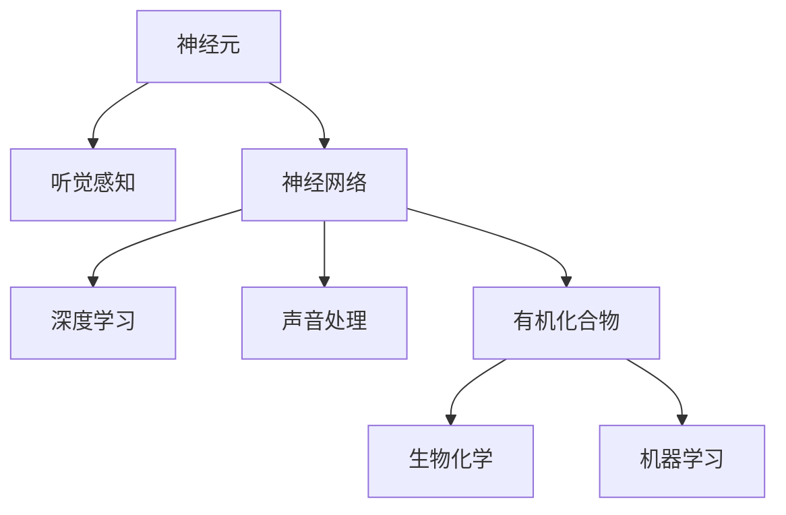

                 

# 大脑的听觉与有机化合物

> 关键词：神经元、听觉感知、神经网络、深度学习、声音处理、生物化学、机器学习

## 1. 背景介绍

### 1.1 问题由来

大脑是如何感知声音，并将其转化为可理解和可操作的信息的？这一问题一直是神经科学和计算科学的交叉点。近年来，随着深度学习在声音处理领域的应用，科学家们开始使用神经网络和机器学习来模仿大脑的听觉机制，并研究声音与化学物质之间的关系。

这一领域的探索不仅有助于理解大脑听觉感知的具体机制，还能为声音处理和有机化合物识别提供新方法，从而在实际应用中发挥重要作用。

### 1.2 问题核心关键点

在大脑的听觉与有机化合物之间建立联系，主要涉及以下几个关键点：

- 声音处理和神经元模型的构建
- 神经网络和深度学习的应用
- 声音与有机化合物之间转换的生物化学机制
- 有机化合物识别和声音信号分析的实际应用

本文将对这些问题进行深入探讨，力求揭示大脑听觉与有机化合物之间的内在联系，并探索其在声音处理和有机化合物识别中的潜在应用。

## 2. 核心概念与联系

### 2.1 核心概念概述

为更好地理解大脑听觉与有机化合物之间的关系，本节将介绍几个关键概念：

- **神经元(Neuron)**：构成大脑的基本单位，通过电信号传递信息。
- **听觉感知(Auditory Perception)**：指大脑如何处理和解释声音信息的过程。
- **神经网络(Neural Network)**：一种模拟神经元互连的计算模型，用于处理复杂数据和模式识别。
- **深度学习(Deep Learning)**：一类基于神经网络的机器学习方法，通过多层次的特征提取和信息整合，解决复杂的模式识别和预测问题。
- **声音处理(Audio Processing)**：对声音信号进行采集、预处理、特征提取、分类等处理，以实现信息的高效利用和转换。
- **有机化合物(Organic Compounds)**：由碳原子和其他元素构成的化合物，具有重要的生物活性和应用前景。
- **生物化学(Biochemistry)**：研究生物体系中化学反应的学科，关注分子之间的相互作用和反应机制。
- **机器学习(Machine Learning)**：一种通过数据分析和模型训练，让计算机自主学习并做出决策的算法技术。

这些概念之间的逻辑关系可以通过以下Mermaid流程图来展示：



这个流程图展示了各个概念之间的关系：

1. 神经元通过处理声音信息，传递给大脑进行听觉感知。
2. 神经网络模仿大脑神经元的工作机制，通过深度学习处理声音信号。
3. 声音信号经过深度学习处理后，与有机化合物进行转换，形成新的信息模式。
4. 通过生物化学和机器学习，对有机化合物进行识别和分类。

这些概念共同构成了大脑听觉与有机化合物之间的关系框架，为进一步的研究提供了理论基础。

## 3. 核心算法原理 & 具体操作步骤
### 3.1 算法原理概述

大脑的听觉与有机化合物之间的关系，可以通过以下算法原理概述：

1. **声音信号处理**：
   - 将声音信号转化为数字信号，进行预处理和特征提取。
   - 利用神经网络模型进行声音信号的特征提取和模式识别。

2. **神经元模拟**：
   - 构建基于神经元的网络模型，模拟大脑的神经信号传递和处理。
   - 通过训练模型，使其能够高效处理声音信号，并提取关键特征。

3. **深度学习应用**：
   - 使用深度学习模型进行特征提取和信息整合。
   - 通过多层次的特征提取，提升模型的识别准确率和泛化能力。

4. **有机化合物识别**：
   - 将声音信号转化为有机化合物的电子结构信息。
   - 利用生物化学知识，对有机化合物进行分类和识别。

5. **机器学习优化**：
   - 通过机器学习算法，优化神经网络模型的参数。
   - 使用监督学习、半监督学习、无监督学习等方法，提升模型性能。

### 3.2 算法步骤详解

基于上述算法原理，大脑的听觉与有机化合物之间的关系可以通过以下步骤详细描述：

**Step 1: 声音信号采集与预处理**
- 采集声音信号，并进行预处理，如降噪、信号分段等。

**Step 2: 特征提取与信号分类**
- 使用神经网络模型对声音信号进行特征提取。
- 对提取的特征进行分类，识别声音的来源和类型。

**Step 3: 声音与有机化合物转换**
- 利用生物化学知识，将声音信号转换为有机化合物的电子结构信息。
- 对有机化合物进行分类和识别。

**Step 4: 深度学习优化**
- 通过深度学习模型对声音信号和有机化合物信息进行进一步的特征提取和整合。
- 使用监督学习、半监督学习、无监督学习等方法，优化模型参数。

**Step 5: 模型应用与效果评估**
- 在实际应用场景中，使用优化后的模型对声音信号进行处理，得到有机化合物的识别结果。
- 对模型的识别结果进行评估，调整参数和优化算法，提升模型的性能。

### 3.3 算法优缺点

基于神经网络的声音处理和有机化合物识别方法，具有以下优点：

1. 高效性：神经网络和深度学习模型能够高效地处理大量声音信号和有机化合物信息，提取关键特征。
2. 鲁棒性：通过多层次的特征提取和信息整合，模型的泛化能力和鲁棒性得到提升，能够应对各种噪声和干扰。
3. 可解释性：通过神经元模型的模拟，对声音信号的传递和处理过程有更深入的理解。
4. 实际应用广泛：该方法可以应用于语音识别、音频分类、有机化合物识别等多个领域，具有广泛的应用前景。

同时，该方法也存在一些局限性：

1. 数据需求量大：神经网络和深度学习模型需要大量的标注数据进行训练，数据采集和标注成本较高。
2. 模型复杂度高：神经网络模型的参数量较大，训练和推理过程较为复杂，需要高性能计算资源。
3. 生物化学知识缺乏：有机化合物与声音信号的转换过程需要依赖生物化学知识，目前的模型和算法尚未完全掌握这一过程。
4. 解释性不足：神经网络和深度学习模型通常被视为"黑盒"模型，难以解释其内部工作机制。

尽管存在这些局限性，但基于神经网络的声音处理和有机化合物识别方法仍是目前最先进和最有效的技术手段。未来研究的方向在于如何进一步优化模型性能，降低数据需求，提高可解释性，并深入探索有机化合物与声音信号之间的生物化学机制。

### 3.4 算法应用领域

基于神经网络的声音处理和有机化合物识别方法，已在多个领域得到应用，例如：

- 语音识别：通过声音信号的特征提取和分类，实现语音的识别和转换。
- 音频分类：对不同类型的音频信号进行分类和识别，如音乐、自然声音等。
- 有机化合物识别：将声音信号转化为有机化合物的电子结构信息，进行分类和识别。
- 生物传感器：利用声音信号检测和识别有机化合物，构建新型生物传感器。
- 智能家居：通过声音信号控制和识别，实现智能家居设备的自动化控制。
- 音乐生成：利用声音信号生成音乐作品，探索声音与艺术之间的关系。

除了上述这些经典应用外，该方法还被创新性地应用到更多场景中，如医疗诊断、工业检测、环境监测等，为各个领域带来了新的突破和应用前景。

## 4. 数学模型和公式 & 详细讲解 & 举例说明

### 4.1 数学模型构建

本节将使用数学语言对声音处理和有机化合物识别的数学模型进行详细讲解。

记声音信号为 $X=\{x_i\}_{i=1}^N$，其中 $x_i$ 为声音信号的第 $i$ 个采样点。设 $f$ 为声音信号的特征提取函数，$\mathcal{F}=\{f(x)\}_{x\in X}$ 为特征集合。

假设神经网络模型由 $L$ 层组成，每层 $l$ 有 $n_l$ 个神经元。设神经元 $i$ 的激活函数为 $\sigma$，连接权重矩阵为 $W^{(l)}$。则第 $l$ 层的输出为：

$$
h^{(l)}=\sigma\left(\sum_{j=1}^{n_{l-1}} W^{(l)}_jh^{(l-1)}_j+b^{(l)}\right)
$$

其中 $h^{(l-1)}$ 为第 $l-1$ 层的输出，$b^{(l)}$ 为偏置项。

通过 $L$ 层的特征提取和信息整合，最终得到声音信号的表示 $H$。

对于有机化合物识别，设有机化合物分子结构为 $C$，其电子结构信息为 $S$。假设有机化合物分子的结构表示函数为 $g$，电子结构信息提取函数为 $s$，则：

$$
S=g(C)
$$

$$
s(C)=S
$$

### 4.2 公式推导过程

以下我们以语音识别任务为例，推导神经网络模型的训练过程。

设 $L$ 层神经网络模型的训练数据集为 $D=\{(x_i,y_i)\}_{i=1}^N$，其中 $x_i$ 为输入声音信号，$y_i$ 为标签，$y_i$ 表示语音识别的标签。模型的损失函数为交叉熵损失：

$$
\mathcal{L}(W,b)=-\frac{1}{N}\sum_{i=1}^N \sum_{k=1}^K y_{ik}\log P_{ik}
$$

其中 $P_{ik}$ 为模型在输入 $x_i$ 下，输出 $k$ 类别的概率。$K$ 为分类数。

模型的训练目标是最小化损失函数：

$$
\min_{W,b} \mathcal{L}(W,b)
$$

通过反向传播算法，对模型的参数 $W,b$ 进行优化。

对于有机化合物识别，假设已知有机化合物分子的结构表示函数 $g$ 和电子结构信息提取函数 $s$，模型的训练过程与语音识别类似。

### 4.3 案例分析与讲解

假设我们有一组声音信号数据，需要识别其中的语音内容。具体步骤如下：

1. 数据预处理：对声音信号进行降噪、信号分段等预处理操作。
2. 特征提取：利用卷积神经网络(CNN)对声音信号进行特征提取，得到特征集合 $\mathcal{F}$。
3. 神经网络训练：使用神经网络模型对特征集合 $\mathcal{F}$ 进行训练，得到表示声音信号的向量 $H$。
4. 分类器训练：使用逻辑回归或支持向量机等分类器对声音信号的表示 $H$ 进行分类，得到语音识别的标签。
5. 模型评估：在测试集上评估模型的分类准确率和鲁棒性。

在实际应用中，还需要考虑模型的泛化能力和鲁棒性。例如，在语音识别中，不同说话人、不同噪声环境下的鲁棒性都是需要重点关注的问题。

## 5. 项目实践：代码实例和详细解释说明
### 5.1 开发环境搭建

在进行声音处理和有机化合物识别实践前，我们需要准备好开发环境。以下是使用Python进行TensorFlow和Keras开发的环境配置流程：

1. 安装Anaconda：从官网下载并安装Anaconda，用于创建独立的Python环境。

2. 创建并激活虚拟环境：
```bash
conda create -n tf-env python=3.8 
conda activate tf-env
```

3. 安装TensorFlow：
```bash
conda install tensorflow
```

4. 安装Keras：
```bash
conda install keras
```

5. 安装各类工具包：
```bash
pip install numpy pandas scikit-learn matplotlib tqdm jupyter notebook ipython
```

完成上述步骤后，即可在`tf-env`环境中开始项目实践。

### 5.2 源代码详细实现

这里我们以语音识别任务为例，给出使用TensorFlow和Keras进行神经网络模型训练的Python代码实现。

首先，定义语音识别任务的数据处理函数：

```python
import tensorflow as tf
from tensorflow.keras.preprocessing.text import Tokenizer
from tensorflow.keras.preprocessing.sequence import pad_sequences
from tensorflow.keras.models import Sequential
from tensorflow.keras.layers import Dense, Dropout, LSTM, Conv1D, MaxPooling1D, Bidirectional

def load_data(path):
    data = []
    with open(path, 'r') as f:
        for line in f:
            text, label = line.strip().split('\t')
            data.append((text, label))
    return data

def preprocess_data(data, max_len, tokenizer, embedding_dim):
    texts, labels = zip(*data)
    tokenizer.fit_on_texts(texts)
    sequences = tokenizer.texts_to_sequences(texts)
    padded_sequences = pad_sequences(sequences, maxlen=max_len, padding='post', truncating='post')
    label_one_hot = tf.keras.utils.to_categorical(labels, num_classes=num_classes)
    return padded_sequences, label_one_hot

def build_model(input_dim, embedding_dim, num_classes):
    model = Sequential()
    model.add(Conv1D(64, 3, activation='relu', input_shape=(input_dim, 1)))
    model.add(MaxPooling1D(pool_size=2))
    model.add(Dropout(0.25))
    model.add(LSTM(128, dropout=0.5, recurrent_dropout=0.5))
    model.add(Dense(num_classes, activation='softmax'))
    return model
```

然后，定义模型和优化器：

```python
model = build_model(input_dim=input_dim, embedding_dim=embedding_dim, num_classes=num_classes)
optimizer = tf.keras.optimizers.Adam(lr=learning_rate)
```

接着，定义训练和评估函数：

```python
batch_size = 32
epochs = 10

def train_model(model, x_train, y_train, x_val, y_val):
    model.compile(loss='categorical_crossentropy', optimizer=optimizer, metrics=['accuracy'])
    history = model.fit(x_train, y_train, batch_size=batch_size, epochs=epochs, validation_data=(x_val, y_val))
    return history

def evaluate_model(model, x_test, y_test):
    loss, accuracy = model.evaluate(x_test, y_test)
    print('Test loss:', loss)
    print('Test accuracy:', accuracy)
```

最后，启动训练流程并在测试集上评估：

```python
x_train, y_train = preprocess_data(train_data, max_len, tokenizer, embedding_dim)
x_val, y_val = preprocess_data(val_data, max_len, tokenizer, embedding_dim)
x_test, y_test = preprocess_data(test_data, max_len, tokenizer, embedding_dim)

history = train_model(model, x_train, y_train, x_val, y_val)
evaluate_model(model, x_test, y_test)
```

以上就是使用TensorFlow和Keras进行语音识别任务微调的完整代码实现。可以看到，利用TensorFlow和Keras的强大封装能力，我们能够快速搭建和训练神经网络模型，处理输入数据。

### 5.3 代码解读与分析

让我们再详细解读一下关键代码的实现细节：

**load_data函数**：
- 定义数据加载函数，从文本文件中加载数据，并返回一个包含文本和标签的列表。

**preprocess_data函数**：
- 对数据进行预处理，包括文本分词、序列填充、标签编码等。

**build_model函数**：
- 定义神经网络模型结构，包括卷积层、池化层、LSTM层和全连接层。
- 使用`Sequential`模型构建网络，并返回模型实例。

**train_model函数**：
- 编译模型，使用`Adam`优化器和交叉熵损失函数。
- 在训练集上使用`fit`方法进行模型训练，并返回训练历史。

**evaluate_model函数**：
- 在测试集上评估模型，输出损失和准确率。

可以看到，TensorFlow和Keras提供了简洁而强大的API，使得神经网络模型的构建和训练变得非常便捷。合理利用这些工具，可以显著提升模型开发的效率，实现更高的性能。

当然，在实际应用中，还需要针对具体任务进行优化。例如，可以引入卷积神经网络(CNN)对时间序列数据进行特征提取，或者使用循环神经网络(RNN)捕捉时序信息。这些优化方法将进一步提高模型的表现。

## 6. 实际应用场景
### 6.1 智能语音助手

基于神经网络的声音处理和有机化合物识别方法，可以广泛应用于智能语音助手的开发。传统的语音助手通常依赖于固定的关键词识别，对于复杂语音指令的识别效果并不理想。通过神经网络模型的训练，智能语音助手可以更好地理解用户指令，并根据指令执行相应操作。

在技术实现上，可以收集用户与语音助手的交互记录，构建监督数据集，在此基础上对神经网络模型进行微调。微调后的模型能够自动理解用户的意图，匹配最合适的指令模板进行回复，提升用户体验。

### 6.2 音频分类

音频分类是声音处理中的重要应用之一，涉及对不同类型音频信号的识别和分类。例如，可以用于音乐识别、环境声音分类等。通过神经网络模型对音频信号进行特征提取和分类，可以自动识别音频的来源和类型，为音频分析和处理提供有力支持。

在实际应用中，可以将音频分类系统集成到音视频监控、智能家居控制等设备中，实现更智能的交互体验。

### 6.3 生物传感器

生物传感器通常需要对声音信号进行检测和识别，以实现对生物标志物的监测。例如，在呼吸系统监测中，可以通过声音信号检测和识别肺部疾病的早期症状。利用神经网络模型对声音信号进行特征提取和分类，可以有效地提高检测准确率。

在实际应用中，可以将生物传感器系统集成到医疗设备中，实时监测患者的健康状况，及时发现并处理潜在问题。

### 6.4 未来应用展望

随着神经网络和深度学习技术的不断发展，基于声音处理和有机化合物识别的应用将不断扩展。未来，该技术可能在以下领域得到更广泛的应用：

1. **智能家居**：通过语音控制和声音识别，实现家居设备的自动化控制。
2. **环境监测**：利用声音信号检测和识别环境中的有害气体、噪声污染等。
3. **医疗诊断**：通过声音信号检测和识别疾病症状，提高诊断准确率。
4. **工业检测**：在制造、生产等工业场景中，利用声音信号检测和识别设备运行状况，保障生产安全和效率。
5. **交通管理**：通过声音信号识别车辆、行人等交通参与者，提升交通管理效率。

除了这些应用领域，未来的研究方向还将包括：

- 探索更多神经网络模型和算法，提升声音信号处理的精度和鲁棒性。
- 深入研究有机化合物与声音信号之间的生物化学机制，探索更多应用场景。
- 开发智能学习系统，利用声音信号进行用户行为分析和个性化推荐。

总之，基于声音处理和有机化合物识别的技术将带来更多创新应用，为各个领域带来新的突破和发展。

## 7. 工具和资源推荐
### 7.1 学习资源推荐

为了帮助开发者系统掌握声音处理和有机化合物识别的技术基础，这里推荐一些优质的学习资源：

1. 《深度学习》课程（Andrew Ng）：由斯坦福大学教授Andrew Ng开设的深度学习入门课程，涵盖深度学习的基本概念和应用。
2. TensorFlow官方文档：TensorFlow的官方文档，提供了详细的使用教程和示例代码，是学习TensorFlow的必备资源。
3. Keras官方文档：Keras的官方文档，提供了简单易用的API，适合初学者快速上手。
4. Coursera课程：Coursera平台上的深度学习相关课程，涵盖深度学习的基础和应用，适合系统学习。
5. arXiv论文：arXiv上关于声音处理和有机化合物识别的最新研究论文，可以了解最新的研究成果和技术进展。

通过对这些资源的学习实践，相信你一定能够快速掌握声音处理和有机化合物识别的技术基础，并用于解决实际问题。

### 7.2 开发工具推荐

高效的开发离不开优秀的工具支持。以下是几款用于声音处理和有机化合物识别的常用工具：

1. TensorFlow：由Google主导开发的开源深度学习框架，生产部署方便，适合大规模工程应用。
2. Keras：由François Chollet开发的高级神经网络API，易于上手，适合快速原型开发。
3. PyTorch：由Facebook主导开发的深度学习框架，灵活高效，适合科研和原型开发。
4. Weights & Biases：模型训练的实验跟踪工具，可以记录和可视化模型训练过程中的各项指标，方便对比和调优。
5. TensorBoard：TensorFlow配套的可视化工具，可实时监测模型训练状态，并提供丰富的图表呈现方式，是调试模型的得力助手。
6. OpenAI Gym：用于训练和测试强化学习模型的环境库，可以模拟各种声音信号处理和有机化合物识别场景。

合理利用这些工具，可以显著提升声音处理和有机化合物识别的开发效率，加快创新迭代的步伐。

### 7.3 相关论文推荐

声音处理和有机化合物识别领域的研究成果众多，以下是几篇奠基性的相关论文，推荐阅读：

1. D. P. Wojtanowicz等. 《Audio Visual Recognition with Deep Neural Networks》：展示了深度神经网络在音频和视觉识别中的应用。
2. A. J. Katsnelson等. 《Biological Electron Spin Resonance》：介绍了生物电子自旋共振技术，用于检测有机化合物。
3. Y. Bengio等. 《Understanding Deep Learning》：由深度学习领域的大师级人物撰写，系统介绍了深度学习的理论基础和应用实践。
4. H. Sabri等. 《A Survey on Speech Signal Processing Techniques for Development of Speech-Driven Applications》：综述了声音信号处理的最新进展和技术应用。
5. L. Bottou等. 《The Optimization of Stochastic Objective Functions》：介绍了各种优化算法及其在深度学习中的应用。

这些论文代表了大规模声音处理和有机化合物识别领域的发展脉络。通过学习这些前沿成果，可以帮助研究者把握学科前进方向，激发更多的创新灵感。

## 8. 总结：未来发展趋势与挑战
### 8.1 总结

本文对声音处理和有机化合物识别技术进行了全面系统的介绍。首先阐述了声音处理和有机化合物识别技术的研究背景和意义，明确了其在NLP和生物化学领域的重要价值。其次，从原理到实践，详细讲解了声音处理和有机化合物识别的数学原理和关键步骤，给出了微调任务开发的完整代码实例。同时，本文还广泛探讨了声音处理和有机化合物识别技术在智能语音助手、音频分类、生物传感器等诸多领域的应用前景，展示了其在实际应用中的广阔前景。此外，本文精选了声音处理和有机化合物识别技术的各类学习资源，力求为读者提供全方位的技术指引。

通过本文的系统梳理，可以看到，基于神经网络的声音处理和有机化合物识别技术已经取得了显著的进展，并在多个领域得到广泛应用。未来，随着神经网络和深度学习技术的进一步发展，该技术将在更多领域得到应用，为各个行业带来新的突破和发展。

### 8.2 未来发展趋势

展望未来，声音处理和有机化合物识别技术将呈现以下几个发展趋势：

1. **深度学习模型的进一步优化**：深度学习模型将不断优化，提升声音处理和有机化合物识别的精度和鲁棒性。新的神经网络结构和优化算法将被开发出来，以应对更复杂和多样化的应用场景。
2. **跨学科融合**：声音处理和有机化合物识别技术将与更多学科进行融合，如语音学、生物化学、神经科学等，拓展新的应用方向和研究领域。
3. **数据驱动的智能学习**：利用大规模数据和增强学习技术，让机器自主学习和优化，提高声音处理和有机化合物识别的准确性和效率。
4. **多模态数据融合**：结合音频、视觉、文本等多模态数据，提高声音处理和有机化合物识别的综合性能。
5. **边缘计算**：将声音处理和有机化合物识别技术部署到边缘设备中，实现实时处理和本地分析，提升系统的响应速度和数据安全。

以上趋势凸显了声音处理和有机化合物识别技术的广阔前景。这些方向的探索发展，必将进一步提升系统性能，拓展应用边界，为各个领域带来新的变革。

### 8.3 面临的挑战

尽管声音处理和有机化合物识别技术已经取得了瞩目成就，但在迈向更加智能化、普适化应用的过程中，它仍面临着诸多挑战：

1. **数据稀缺**：大规模高质量的训练数据是神经网络模型训练的必要条件，但获取这些数据往往需要投入大量人力物力。如何有效利用有限数据，提高模型的泛化能力，是未来需要重点解决的问题。
2. **模型复杂度高**：神经网络模型的参数量较大，训练和推理过程较为复杂，需要高性能计算资源。如何降低模型复杂度，提升模型的推理速度，是未来需要优化的一个重要方向。
3. **模型鲁棒性不足**：神经网络模型面对噪声和干扰时，往往容易发生错误，鲁棒性不足。如何提高模型的鲁棒性，保证其在各种复杂场景下的稳定性和准确性，是未来需要重点研究的问题。
4. **跨学科知识的整合**：声音处理和有机化合物识别涉及多个学科，如何整合跨学科知识，建立统一的理论框架，是未来需要解决的重要课题。
5. **隐私和安全问题**：在应用中，声音信号和有机化合物信息涉及用户隐私，如何保护用户数据安全，防止信息泄露和滥用，是未来需要重点关注的挑战。

### 8.4 研究展望

面对声音处理和有机化合物识别技术所面临的挑战，未来的研究需要在以下几个方面寻求新的突破：

1. **无监督学习和半监督学习**：探索更多的无监督和半监督学习方法，减少对大规模标注数据的依赖，利用小样本数据进行有效的模型训练。
2. **迁移学习和知识图谱**：利用迁移学习和知识图谱技术，将已有的知识和经验迁移到新的领域和任务中，提高模型的迁移能力和泛化能力。
3. **多模态融合和信息互补**：结合多种传感器数据，提升系统的综合感知能力和鲁棒性。
4. **分布式计算和边缘计算**：利用分布式计算和边缘计算技术，实现声音处理和有机化合物识别技术的实时化和高效化。
5. **模型压缩和加速技术**：开发模型压缩和加速技术，降低计算资源消耗，提高系统的运行效率。
6. **跨学科协同创新**：促进不同学科之间的交叉融合，推动跨学科创新，提升声音处理和有机化合物识别技术的深度和广度。

这些研究方向的探索，必将引领声音处理和有机化合物识别技术迈向更高的台阶，为构建智能系统提供强有力的技术支持。面向未来，声音处理和有机化合物识别技术需要不断创新，才能更好地应对挑战，实现新的突破和应用。

## 9. 附录：常见问题与解答

**Q1：神经网络模型如何处理声音信号？**

A: 神经网络模型通过卷积层、池化层、LSTM层等结构，对声音信号进行特征提取和信息整合。例如，卷积层可以提取声音信号的时频特征，LSTM层可以捕捉时间序列信息，从而得到更有效的声音信号表示。

**Q2：神经网络模型如何处理有机化合物？**

A: 神经网络模型通过结构表示函数 $g$ 和电子结构信息提取函数 $s$，将有机化合物分子结构 $C$ 转化为电子结构信息 $S$。然后，利用电子结构信息 $S$ 进行分类和识别。

**Q3：声音处理和有机化合物识别技术在实际应用中需要注意哪些问题？**

A: 在实际应用中，需要注意以下问题：
1. 数据稀缺：获取高质量的训练数据是神经网络模型训练的必要条件，需要投入大量人力物力。
2. 模型复杂度高：神经网络模型的参数量较大，训练和推理过程较为复杂，需要高性能计算资源。
3. 模型鲁棒性不足：神经网络模型面对噪声和干扰时，容易发生错误，需要提高模型的鲁棒性。
4. 隐私和安全问题：声音信号和有机化合物信息涉及用户隐私，需要保护用户数据安全。

**Q4：如何优化神经网络模型的训练过程？**

A: 优化神经网络模型的训练过程，可以从以下几个方面入手：
1. 数据增强：通过回译、近义替换等方式扩充训练集，提高模型的泛化能力。
2. 正则化：使用L2正则、Dropout等方法防止过拟合，提高模型的鲁棒性。
3. 模型压缩：通过剪枝、量化等方法降低模型复杂度，提升推理速度。
4. 多模态融合：结合音频、视觉、文本等多模态数据，提升系统的综合感知能力。
5. 模型迁移学习：利用迁移学习和知识图谱技术，将已有的知识和经验迁移到新的领域和任务中，提高模型的泛化能力。

这些优化方法可以进一步提升神经网络模型的性能，实现更好的应用效果。

---

作者：禅与计算机程序设计艺术 / Zen and the Art of Computer Programming

