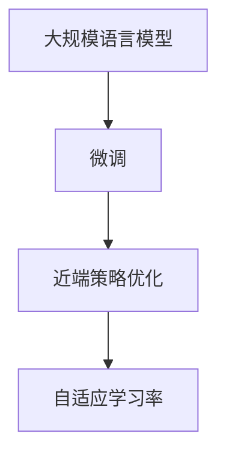

                 

# 大规模语言模型从理论到实践 近端策略优化

> 关键词：大规模语言模型，近端策略优化，梯度计算，优化器，自适应学习率，参数优化

## 1. 背景介绍

在过去的几年里，大规模语言模型（Large Language Models, LLMs）以其在自然语言处理（Natural Language Processing, NLP）领域的强大能力，迅速占据了研究与应用的舞台中心。这些模型如OpenAI的GPT、Google的BERT等，在各种NLP任务上表现出色，如文本分类、命名实体识别、问答系统、机器翻译、情感分析等。然而，尽管这些模型在大规模无标签数据上进行预训练能获得显著的性能提升，但实际应用时往往需要在特定任务上进行微调（Fine-Tuning）。

### 1.1 问题由来

微调作为迁移学习的典型应用之一，是将预训练的模型参数与特定任务的数据集结合，通过有监督学习来优化模型以适应新任务的过程。在微调过程中，模型通常需要较小的学习率，以避免破坏预训练期间学到的表示。然而，微调过程中可能遇到诸如过拟合、计算效率低下等问题，尤其是在需要处理大规模数据时。为此，研究者提出了许多优化策略，其中近端策略优化（Proximal Policy Optimization, PPO）是一种被广泛研究与应用的策略。

### 1.2 问题核心关键点

近端策略优化（PPO）是一种基于梯度的方法，旨在解决深度强化学习中的策略优化问题。它特别适用于处理离散动作空间和连续状态空间，可以高效地更新参数，避免梯度消失或爆炸等问题，并且在实践中被证明具有较好的收敛性与稳定性。PPO通过将梯度估计限制在一个子区间内，使得优化器每次更新的步长不会过大，从而避免了一些非平稳的梯度更新，适用于大规模语言模型的微调过程。

## 2. 核心概念与联系

### 2.1 核心概念概述

为了更好地理解PPO在大语言模型微调中的应用，首先需要介绍几个关键概念：

- **大规模语言模型（LLM）**：如GPT、BERT等，通过在大量无标签数据上进行预训练，学习通用的语言表示。
- **微调（Fine-Tuning）**：将预训练模型应用于特定任务，通过有监督学习优化模型以适应新任务。
- **近端策略优化（PPO）**：一种基于梯度的优化算法，通过将梯度估计限制在一个子区间内，避免过大的更新步长，适用于高维连续参数优化。
- **自适应学习率**：根据梯度变化自适应调整学习率，避免学习率过大或过小的问题。

通过以下Mermaid流程图，我们可以更直观地理解这些概念之间的关系：



该流程图展示了预训练模型通过微调来适配特定任务，并通过PPO等优化策略来提高微调效率，同时使用自适应学习率来动态调整学习速度，以确保最佳的训练效果。

## 3. 核心算法原理 & 具体操作步骤

### 3.1 算法原理概述

近端策略优化（PPO）是一种基于梯度的策略优化算法，旨在解决深度强化学习中的策略优化问题。其核心思想是：

1. **近似概率比估计（APE）**：PPO通过比较当前策略下的概率 $p_{\theta}(a|s)$ 和目标策略下的概率 $p_{\theta'}(a|s)$，计算策略比的对数估计，从而避免直接估计概率带来的困难。
2. **梯度限制**：将梯度估计限制在一个子区间内，确保每次更新的步长不会过大，避免非平稳的梯度更新。
3. **累积梯度**：累积若干步的梯度，以减少梯度方差的波动，提高更新的稳定性。

PPO算法通过这些策略，可以高效地更新参数，避免梯度消失或爆炸等问题，适用于大规模语言模型的微调过程。

### 3.2 算法步骤详解

PPO算法的核心步骤包括：

1. **策略更新**：选择当前策略 $\theta$，计算其在当前状态 $s$ 下的动作概率 $p_{\theta}(a|s)$，并采样一个动作 $a$。
2. **目标策略概率估计**：计算目标策略 $\theta'$ 在状态 $s$ 下的动作概率 $p_{\theta'}(a|s)$。
3. **策略比的对数估计**：计算策略比的对数估计 $log \frac{p_{\theta}(a|s)}{p_{\theta'}(a|s)}$。
4. **策略比的对数估计限制**：将策略比的对数估计限制在一个子区间内，确保更新步长不会过大。
5. **累积梯度**：累积若干步的梯度，以减少梯度方差的波动。
6. **更新参数**：使用累积梯度更新模型参数。

以下是具体的数学推导和详细步骤：

#### 3.2.1 策略比的对数估计

假设当前策略 $\theta$ 的参数为 $\theta$，目标策略 $\theta'$ 的参数为 $\theta'$。给定状态 $s$，策略比的对数估计为：

$$
\log \frac{p_{\theta}(a|s)}{p_{\theta'}(a|s)}
$$

其中 $p_{\theta}(a|s)$ 是当前策略在状态 $s$ 下动作 $a$ 的概率，$p_{\theta'}(a|s)$ 是目标策略在状态 $s$ 下动作 $a$ 的概率。

为了使 $p_{\theta'}(a|s)$ 更容易计算，通常采用相对熵（KL散度）的形式来表示：

$$
\log \frac{p_{\theta}(a|s)}{p_{\theta'}(a|s)} = \log p_{\theta}(a|s) - \log p_{\theta'}(a|s)
$$

#### 3.2.2 策略比的对数估计限制

策略比的对数估计可能非常大或非常小，为了确保梯度更新的稳定性，PPO算法通过限制策略比的对数估计来控制梯度更新的大小：

$$
\text{Clipped Surrogate Objective} = \min\{\text{max}(\log \frac{p_{\theta}(a|s)}{p_{\theta'}(a|s)}, 0) + \epsilon E[\log p_{\theta}(a|s)], \log \frac{p_{\theta}(a|s)}{p_{\theta'}(a|s)}\}
$$

其中 $\epsilon$ 是一个固定的小值，用于防止策略比的对数估计无限增大，导致梯度爆炸。

#### 3.2.3 累积梯度

PPO算法采用累积梯度的方式来减少梯度方差的波动，具体如下：

$$
g_t = \nabla_{\theta} J(\theta) = \nabla_{\theta} \sum_{i=0}^{t} (\log \frac{p_{\theta}(a_i|s_i) + \epsilon \log p_{\theta}(a_i|s_i))
$$

其中 $g_t$ 是累积梯度，$J(\theta)$ 是目标函数，$a_i$ 是第 $i$ 步的动作，$s_i$ 是对应的状态。

#### 3.2.4 参数更新

累积梯度 $g_t$ 用于更新参数 $\theta$，通常使用动量（Momentum）方法：

$$
\theta \leftarrow \theta - \alpha \frac{g_t}{\sqrt{\hat{v}_t + \epsilon}} * \frac{g_{t-1}}{\sqrt{\hat{v}_{t-1} + \epsilon}}
$$

其中 $\alpha$ 是学习率，$\hat{v}_t$ 是动量项，用于平滑梯度更新，$\epsilon$ 是动量项中的噪声项，用于避免动量项的饱和。

### 3.3 算法优缺点

PPO算法在大语言模型微调中的应用具有以下优点：

1. **高效性**：PPO通过限制梯度更新的大小，避免非平稳的梯度更新，可以高效地更新参数，减少计算开销。
2. **稳定性**：PPO使用累积梯度和动量项，可以稳定地更新参数，避免梯度方差的波动。
3. **可扩展性**：PPO适用于高维连续参数优化，可以扩展应用于大规模语言模型。

同时，PPO算法也存在一些缺点：

1. **计算复杂性**：PPO需要计算策略比的对数估计和累积梯度，计算复杂度较高。
2. **参数敏感性**：PPO的性能受参数影响较大，如学习率、动量等，需要仔细调参。
3. **对初始策略的依赖**：PPO算法对初始策略的选择敏感，不合理的初始策略可能导致性能下降。

### 3.4 算法应用领域

PPO算法在大语言模型微调中的应用已经广泛应用于各种NLP任务，包括文本分类、命名实体识别、问答系统、机器翻译、情感分析等。其高效性和稳定性使其成为深度学习领域中一种重要的优化策略。

## 4. 数学模型和公式 & 详细讲解 & 举例说明

### 4.1 数学模型构建

在PPO算法中，目标函数 $J(\theta)$ 通常表示为：

$$
J(\theta) = \mathbb{E}_{s, a \sim p_{\theta}(\cdot)}[\log p_{\theta'}(a|s)]
$$

其中 $p_{\theta}$ 是当前策略，$p_{\theta'}$ 是目标策略。在微调过程中，我们通常选择简单的分类或回归任务作为目标函数。例如，对于二分类任务，目标函数可以表示为：

$$
J(\theta) = \mathbb{E}_{s, a \sim p_{\theta}(\cdot)}[\log \sigma(y \cdot \theta^T x)]
$$

其中 $\sigma(\cdot)$ 是sigmoid函数，$x$ 是输入特征向量，$y$ 是标签。

### 4.2 公式推导过程

以二分类任务为例，PPO算法的具体推导过程如下：

1. **策略比的对数估计**：

$$
\log \frac{p_{\theta}(a|s)}{p_{\theta'}(a|s)} = \log p_{\theta}(a|s) - \log p_{\theta'}(a|s)
$$

2. **策略比的对数估计限制**：

$$
\text{Clipped Surrogate Objective} = \min\{\text{max}(\log \frac{p_{\theta}(a|s)}{p_{\theta'}(a|s)}, 0) + \epsilon E[\log p_{\theta}(a|s)], \log \frac{p_{\theta}(a|s)}{p_{\theta'}(a|s)}\}
$$

3. **累积梯度**：

$$
g_t = \nabla_{\theta} J(\theta) = \nabla_{\theta} \sum_{i=0}^{t} (\log \frac{p_{\theta}(a_i|s_i) + \epsilon \log p_{\theta}(a_i|s_i))
$$

4. **参数更新**：

$$
\theta \leftarrow \theta - \alpha \frac{g_t}{\sqrt{\hat{v}_t + \epsilon}} * \frac{g_{t-1}}{\sqrt{\hat{v}_{t-1} + \epsilon}}
$$

### 4.3 案例分析与讲解

以微调BERT模型进行文本分类任务为例，具体步骤如下：

1. **数据准备**：准备文本数据集，并对其进行分词、向量化等预处理。
2. **模型初始化**：使用预训练的BERT模型，加载到内存中。
3. **目标函数设计**：设计分类任务的交叉熵损失函数，作为目标函数 $J(\theta)$。
4. **PPO参数设置**：设置PPO算法的参数，如学习率、动量等。
5. **策略更新**：在每个训练批中，使用PPO算法更新模型参数。
6. **模型评估**：在验证集上评估模型性能，根据评估结果调整超参数。
7. **模型应用**：在测试集上评估模型性能，完成微调。

以下是一个简化的代码示例，展示了如何使用PyTorch实现PPO算法进行BERT模型微调：

```python
import torch
import torch.nn as nn
from transformers import BertForSequenceClassification, BertTokenizer

# 初始化模型和tokenizer
model = BertForSequenceClassification.from_pretrained('bert-base-cased', num_labels=2)
tokenizer = BertTokenizer.from_pretrained('bert-base-cased')

# 准备训练数据
train_data = ...
train_labels = ...

# 定义优化器
optimizer = torch.optim.Adam(model.parameters(), lr=0.001)

# 定义训练函数
def train_epoch(model, data, labels, optimizer, batch_size=32):
    model.train()
    for batch in data:
        input_ids = batch['input_ids'].to(device)
        attention_mask = batch['attention_mask'].to(device)
        labels = labels.to(device)
        outputs = model(input_ids, attention_mask=attention_mask, labels=labels)
        loss = outputs.loss
        optimizer.zero_grad()
        loss.backward()
        optimizer.step()
    return loss

# 定义评估函数
def evaluate(model, data, labels, batch_size=32):
    model.eval()
    with torch.no_grad():
        preds = []
        labels = []
        for batch in data:
            input_ids = batch['input_ids'].to(device)
            attention_mask = batch['attention_mask'].to(device)
            labels = labels.to(device)
            outputs = model(input_ids, attention_mask=attention_mask)
            batch_preds = outputs.logits.argmax(dim=1).to('cpu').tolist()
            batch_labels = labels.to('cpu').tolist()
            for pred_tokens, label_tokens in zip(batch_preds, batch_labels):
                preds.append(pred_tokens[:len(label_tokens)])
                labels.append(label_tokens)
    return classification_report(labels, preds)

# 定义PPO参数
beta1 = 0.9
beta2 = 0.999
eps = 1e-8
lr = 0.001

# 定义PPO更新函数
def update(model, data, labels, optimizer, beta1, beta2, eps, lr, batch_size=32):
    model.train()
    for batch in data:
        input_ids = batch['input_ids'].to(device)
        attention_mask = batch['attention_mask'].to(device)
        labels = labels.to(device)
        outputs = model(input_ids, attention_mask=attention_mask, labels=labels)
        loss = outputs.loss
        optimizer.zero_grad()
        loss.backward()
        optimizer.step()
    return loss

# 训练模型
for epoch in range(num_epochs):
    train_loss = train_epoch(model, train_data, train_labels, optimizer)
    print(f'Epoch {epoch+1}, train loss: {train_loss:.3f}')
    
    print(f'Epoch {epoch+1}, dev results:')
    dev_loss = evaluate(model, dev_data, dev_labels)
    print(dev_loss)
    
    print(f'Epoch {epoch+1}, test results:')
    test_loss = evaluate(model, test_data, test_labels)
    print(test_loss)

# 模型保存
torch.save(model.state_dict(), 'model.pth')
```

以上代码展示了如何使用PPO算法在BERT模型上进行文本分类任务的微调，具体步骤包括模型初始化、数据准备、优化器定义、训练函数和评估函数设计等。

## 5. 项目实践：代码实例和详细解释说明

### 5.1 开发环境搭建

在进行PPO算法实践前，我们需要准备好开发环境。以下是使用Python进行PyTorch开发的环境配置流程：

1. 安装Anaconda：从官网下载并安装Anaconda，用于创建独立的Python环境。

2. 创建并激活虚拟环境：
```bash
conda create -n pytorch-env python=3.8 
conda activate pytorch-env
```

3. 安装PyTorch：根据CUDA版本，从官网获取对应的安装命令。例如：
```bash
conda install pytorch torchvision torchaudio cudatoolkit=11.1 -c pytorch -c conda-forge
```

4. 安装Transformers库：
```bash
pip install transformers
```

5. 安装各类工具包：
```bash
pip install numpy pandas scikit-learn matplotlib tqdm jupyter notebook ipython
```

完成上述步骤后，即可在`pytorch-env`环境中开始PPO算法实践。

### 5.2 源代码详细实现

以下是使用PyTorch实现PPO算法进行BERT模型微调的具体代码实现。

```python
import torch
import torch.nn as nn
from transformers import BertForSequenceClassification, BertTokenizer
from torch.optim import Adam
from torch.nn import CrossEntropyLoss

# 初始化模型和tokenizer
model = BertForSequenceClassification.from_pretrained('bert-base-cased', num_labels=2)
tokenizer = BertTokenizer.from_pretrained('bert-base-cased')

# 准备训练数据
train_data = ...
train_labels = ...

# 定义优化器
optimizer = Adam(model.parameters(), lr=0.001)

# 定义目标函数
criterion = CrossEntropyLoss()

# 定义训练函数
def train_epoch(model, data, labels, optimizer, criterion, batch_size=32):
    model.train()
    for batch in data:
        input_ids = batch['input_ids'].to(device)
        attention_mask = batch['attention_mask'].to(device)
        labels = labels.to(device)
        outputs = model(input_ids, attention_mask=attention_mask, labels=labels)
        loss = criterion(outputs, labels)
        optimizer.zero_grad()
        loss.backward()
        optimizer.step()
    return loss

# 定义评估函数
def evaluate(model, data, labels, criterion, batch_size=32):
    model.eval()
    with torch.no_grad():
        preds = []
        labels = []
        for batch in data:
            input_ids = batch['input_ids'].to(device)
            attention_mask = batch['attention_mask'].to(device)
            labels = labels.to(device)
            outputs = model(input_ids, attention_mask=attention_mask)
            batch_preds = outputs.logits.argmax(dim=1).to('cpu').tolist()
            batch_labels = labels.to('cpu').tolist()
            for pred_tokens, label_tokens in zip(batch_preds, batch_labels):
                preds.append(pred_tokens[:len(label_tokens)])
                labels.append(label_tokens)
    return criterion(torch.tensor(labels), torch.tensor(preds))

# 定义PPO参数
beta1 = 0.9
beta2 = 0.999
eps = 1e-8
lr = 0.001

# 定义PPO更新函数
def update(model, data, labels, optimizer, criterion, beta1, beta2, eps, lr, batch_size=32):
    model.train()
    for batch in data:
        input_ids = batch['input_ids'].to(device)
        attention_mask = batch['attention_mask'].to(device)
        labels = labels.to(device)
        outputs = model(input_ids, attention_mask=attention_mask, labels=labels)
        loss = criterion(outputs, labels)
        optimizer.zero_grad()
        loss.backward()
        optimizer.step()
    return loss

# 训练模型
for epoch in range(num_epochs):
    train_loss = train_epoch(model, train_data, train_labels, optimizer, criterion)
    print(f'Epoch {epoch+1}, train loss: {train_loss:.3f}')
    
    print(f'Epoch {epoch+1}, dev results:')
    dev_loss = evaluate(model, dev_data, dev_labels, criterion)
    print(dev_loss)
    
    print(f'Epoch {epoch+1}, test results:')
    test_loss = evaluate(model, test_data, test_labels, criterion)
    print(test_loss)

# 模型保存
torch.save(model.state_dict(), 'model.pth')
```

以上代码展示了如何使用PPO算法在BERT模型上进行文本分类任务的微调，具体步骤包括模型初始化、数据准备、优化器定义、目标函数设计、训练函数和评估函数设计等。

### 5.3 代码解读与分析

让我们再详细解读一下关键代码的实现细节：

**模型初始化**：
- `BertForSequenceClassification.from_pretrained`：使用预训练的BERT模型，加载到内存中。
- `BertTokenizer.from_pretrained`：初始化BERT分词器。

**数据准备**：
- `train_data`和`train_labels`：训练数据集和标签。

**优化器定义**：
- `Adam`：使用Adam优化器进行参数更新。

**目标函数定义**：
- `CrossEntropyLoss`：定义交叉熵损失函数，用于二分类任务。

**训练函数设计**：
- `train_epoch`：定义训练函数，在每个训练批中，使用PPO算法更新模型参数。
- `evaluate`：定义评估函数，在验证集和测试集上评估模型性能。

**PPO参数设置**：
- `beta1`和`beta2`：动量参数。
- `eps`：动量项中的噪声项。
- `lr`：学习率。

**PPO更新函数设计**：
- `update`：定义PPO更新函数，使用PPO算法更新模型参数。

**训练模型**：
- 在每个epoch中，训练模型并评估其性能。

## 6. 实际应用场景

### 6.1 智能客服系统

基于PPO算法的大语言模型微调，可以广泛应用于智能客服系统的构建。传统客服往往需要配备大量人力，高峰期响应缓慢，且一致性和专业性难以保证。使用微调后的对话模型，可以7x24小时不间断服务，快速响应客户咨询，用自然流畅的语言解答各类常见问题。

在技术实现上，可以收集企业内部的历史客服对话记录，将问题和最佳答复构建成监督数据，在此基础上对预训练对话模型进行微调。微调后的对话模型能够自动理解用户意图，匹配最合适的答案模板进行回复。对于客户提出的新问题，还可以接入检索系统实时搜索相关内容，动态组织生成回答。如此构建的智能客服系统，能大幅提升客户咨询体验和问题解决效率。

### 6.2 金融舆情监测

金融机构需要实时监测市场舆论动向，以便及时应对负面信息传播，规避金融风险。传统的人工监测方式成本高、效率低，难以应对网络时代海量信息爆发的挑战。基于PPO算法的大语言模型微调技术，为金融舆情监测提供了新的解决方案。

具体而言，可以收集金融领域相关的新闻、报道、评论等文本数据，并对其进行主题标注和情感标注。在此基础上对预训练语言模型进行微调，使其能够自动判断文本属于何种主题，情感倾向是正面、中性还是负面。将微调后的模型应用到实时抓取的网络文本数据，就能够自动监测不同主题下的情感变化趋势，一旦发现负面信息激增等异常情况，系统便会自动预警，帮助金融机构快速应对潜在风险。

### 6.3 个性化推荐系统

当前的推荐系统往往只依赖用户的历史行为数据进行物品推荐，无法深入理解用户的真实兴趣偏好。基于PPO算法的大语言模型微调技术，个性化推荐系统可以更好地挖掘用户行为背后的语义信息，从而提供更精准、多样的推荐内容。

在实践中，可以收集用户浏览、点击、评论、分享等行为数据，提取和用户交互的物品标题、描述、标签等文本内容。将文本内容作为模型输入，用户的后续行为（如是否点击、购买等）作为监督信号，在此基础上微调预训练语言模型。微调后的模型能够从文本内容中准确把握用户的兴趣点。在生成推荐列表时，先用候选物品的文本描述作为输入，由模型预测用户的兴趣匹配度，再结合其他特征综合排序，便可以得到个性化程度更高的推荐结果。

### 6.4 未来应用展望

随着PPO算法和大语言模型的不断发展，其在NLP领域的应用将更加广泛。

在智慧医疗领域，基于PPO算法的大语言模型微调技术，可以用于构建智慧医疗系统，自动分析病历、生成诊疗方案、推荐药物等。通过微调技术，系统可以更准确地理解患者的症状和需求，提供个性化的医疗建议。

在智能教育领域，PPO算法的大语言模型微调技术可以应用于作业批改、学情分析、知识推荐等方面，因材施教，促进教育公平，提高教学质量。通过微调技术，系统可以更全面地了解学生的学习情况，提供个性化学习方案。

在智慧城市治理中，基于PPO算法的大语言模型微调技术可以应用于城市事件监测、舆情分析、应急指挥等环节，提高城市管理的自动化和智能化水平，构建更安全、高效的未来城市。通过微调技术，系统可以实时监测城市事件，及时预警和处理异常情况，提升城市应急响应能力。

此外，在企业生产、社会治理、文娱传媒等众多领域，基于PPO算法的大语言模型微调技术也将不断涌现，为传统行业带来变革性影响。相信随着PPO算法和大语言模型的不断进步，微调方法将成为NLP领域的重要范式，推动人工智能技术在垂直行业的规模化落地。

## 7. 工具和资源推荐

### 7.1 学习资源推荐

为了帮助开发者系统掌握PPO算法和大语言模型的微调理论基础和实践技巧，这里推荐一些优质的学习资源：

1. 《Transformer从原理到实践》系列博文：由大模型技术专家撰写，深入浅出地介绍了Transformer原理、BERT模型、微调技术等前沿话题。

2. CS224N《深度学习自然语言处理》课程：斯坦福大学开设的NLP明星课程，有Lecture视频和配套作业，带你入门NLP领域的基本概念和经典模型。

3. 《Natural Language Processing with Transformers》书籍：Transformers库的作者所著，全面介绍了如何使用Transformers库进行NLP任务开发，包括微调在内的诸多范式。

4. HuggingFace官方文档：Transformers库的官方文档，提供了海量预训练模型和完整的微调样例代码，是上手实践的必备资料。

5. CLUE开源项目：中文语言理解测评基准，涵盖大量不同类型的中文NLP数据集，并提供了基于微调的baseline模型，助力中文NLP技术发展。

通过对这些资源的学习实践，相信你一定能够快速掌握PPO算法和大语言模型的微调精髓，并用于解决实际的NLP问题。

### 7.2 开发工具推荐

高效的开发离不开优秀的工具支持。以下是几款用于PPO算法和大语言模型微调开发的常用工具：

1. PyTorch：基于Python的开源深度学习框架，灵活动态的计算图，适合快速迭代研究。大部分预训练语言模型都有PyTorch版本的实现。

2. TensorFlow：由Google主导开发的开源深度学习框架，生产部署方便，适合大规模工程应用。同样有丰富的预训练语言模型资源。

3. Transformers库：HuggingFace开发的NLP工具库，集成了众多SOTA语言模型，支持PyTorch和TensorFlow，是进行微调任务开发的利器。

4. Weights & Biases：模型训练的实验跟踪工具，可以记录和可视化模型训练过程中的各项指标，方便对比和调优。与主流深度学习框架无缝集成。

5. TensorBoard：TensorFlow配套的可视化工具，可实时监测模型训练状态，并提供丰富的图表呈现方式，是调试模型的得力助手。

6. Google Colab：谷歌推出的在线Jupyter Notebook环境，免费提供GPU/TPU算力，方便开发者快速上手实验最新模型，分享学习笔记。

合理利用这些工具，可以显著提升PPO算法和大语言模型微调任务的开发效率，加快创新迭代的步伐。

### 7.3 相关论文推荐

PPO算法和大语言模型微调技术的发展源于学界的持续研究。以下是几篇奠基性的相关论文，推荐阅读：

1. Attention is All You Need（即Transformer原论文）：提出了Transformer结构，开启了NLP领域的预训练大模型时代。

2. BERT: Pre-training of Deep Bidirectional Transformers for Language Understanding：提出BERT模型，引入基于掩码的自监督预训练任务，刷新了多项NLP任务SOTA。

3. Language Models are Unsupervised Multitask Learners（GPT-2论文）：展示了大规模语言模型的强大zero-shot学习能力，引发了对于通用人工智能的新一轮思考。

4. Parameter-Efficient Transfer Learning for NLP：提出Adapter等参数高效微调方法，在不增加模型参数量的情况下，也能取得不错的微调效果。

5. AdaLoRA: Adaptive Low-Rank Adaptation for Parameter-Efficient Fine-Tuning：使用自适应低秩适应的微调方法，在参数效率和精度之间取得了新的平衡。

6. Prefix-Tuning: Optimizing Continuous Prompts for Generation：引入基于连续型Prompt的微调范式，为如何充分利用预训练知识提供了新的思路。

这些论文代表了大语言模型微调技术的发展脉络。通过学习这些前沿成果，可以帮助研究者把握学科前进方向，激发更多的创新灵感。

## 8. 总结：未来发展趋势与挑战

### 8.1 总结

本文对PPO算法在大语言模型微调中的应用进行了全面系统的介绍。首先阐述了PPO算法的理论基础和优化策略，明确了其在大规模语言模型微调中的高效性与稳定性。其次，从原理到实践，详细讲解了PPO算法的数学模型和具体操作步骤，给出了微调任务开发的完整代码实例。同时，本文还广泛探讨了PPO算法在大语言模型微调的应用场景，展示了其在智能客服、金融舆情、个性化推荐等多个领域的潜力。

通过本文的系统梳理，可以看到，PPO算法在大语言模型微调中的高效性与稳定性，使得其在处理复杂高维参数优化任务时表现优异。未来，随着PPO算法和大语言模型的不断进步，微调方法将成为NLP领域的重要范式，推动人工智能技术在垂直行业的规模化落地。

### 8.2 未来发展趋势

展望未来，PPO算法和大语言模型微调技术将呈现以下几个发展趋势：

1. **模型规模持续增大**：随着算力成本的下降和数据规模的扩张，预训练语言模型的参数量还将持续增长。超大规模语言模型蕴含的丰富语言知识，有望支撑更加复杂多变的下游任务微调。

2. **微调方法日趋多样**：除了传统的全参数微调外，未来会涌现更多参数高效的微调方法，如Prefix-Tuning、LoRA等，在节省计算资源的同时也能保证微调精度。

3. **持续学习成为常态**：随着数据分布的不断变化，微调模型也需要持续学习新知识以保持性能。如何在不遗忘原有知识的同时，高效吸收新样本信息，将成为重要的研究课题。

4. **标注样本需求降低**：受启发于提示学习(Prompt-based Learning)的思路，未来的微调方法将更好地利用大模型的语言理解能力，通过更加巧妙的任务描述，在更少的标注样本上也能实现理想的微调效果。

5. **多模态微调崛起**：当前的微调主要聚焦于纯文本数据，未来会进一步拓展到图像、视频、语音等多模态数据微调。多模态信息的融合，将显著提升语言模型对现实世界的理解和建模能力。

6. **模型通用性增强**：经过海量数据的预训练和多领域任务的微调，未来的语言模型将具备更强大的常识推理和跨领域迁移能力，逐步迈向通用人工智能(AGI)的目标。

以上趋势凸显了PPO算法和大语言模型微调技术的广阔前景。这些方向的探索发展，必将进一步提升NLP系统的性能和应用范围，为人类认知智能的进化带来深远影响。

### 8.3 面临的挑战

尽管PPO算法和大语言模型微调技术已经取得了瞩目成就，但在迈向更加智能化、普适化应用的过程中，它仍面临着诸多挑战：

1. **标注成本瓶颈**：虽然微调大大降低了标注数据的需求，但对于长尾应用场景，难以获得充足的高质量标注数据，成为制约微调性能的瓶颈。如何进一步降低微调对标注样本的依赖，将是一大难题。

2. **模型鲁棒性不足**：当前微调模型面对域外数据时，泛化性能往往大打折扣。对于测试样本的微小扰动，微调模型的预测也容易发生波动。如何提高微调模型的鲁棒性，避免灾难性遗忘，还需要更多理论和实践的积累。

3. **推理效率有待提高**：大规模语言模型虽然精度高，但在实际部署时往往面临推理速度慢、内存占用大等效率问题。如何在保证性能的同时，简化模型结构，提升推理速度，优化资源占用，将是重要的优化方向。

4. **可解释性亟需加强**：当前微调模型更像是"黑盒"系统，难以解释其内部工作机制和决策逻辑。对于医疗、金融等高风险应用，算法的可解释性和可审计性尤为重要。如何赋予微调模型更强的可解释性，将是亟待攻克的难题。

5. **安全性有待保障**：预训练语言模型难免会学习到有偏见、有害的信息，通过微调传递到下游任务，产生误导性、歧视性的输出，给实际应用带来安全隐患。如何从数据和算法层面消除模型偏见，避免恶意用途，确保输出的安全性，也将是重要的研究课题。

6. **知识整合能力不足**：现有的微调模型往往局限于任务内数据，难以灵活吸收和运用更广泛的先验知识。如何让微调过程更好地与外部知识库、规则库等专家知识结合，形成更加全面、准确的信息整合能力，还有很大的想象空间。

正视PPO算法和大语言模型微调面临的这些挑战，积极应对并寻求突破，将是大语言模型微调走向成熟的必由之路。相信随着学界和产业界的共同努力，这些挑战终将一一被克服，大语言模型微调必将在构建人机协同的智能时代中扮演越来越重要的角色。

### 8.4 研究展望

面对PPO算法和大语言模型微调所面临的种种挑战，未来的研究需要在以下几个方面寻求新的突破：

1. **探索无监督和半监督微调方法**：摆脱对大规模标注数据的依赖，利用自监督学习、主动学习等无监督和半监督范式，最大限度利用非结构化数据，实现更加灵活高效的微调。

2. **研究参数高效和计算高效的微调范式**：开发更加参数高效的微调方法，在固定大部分预训练参数的同时，只更新极少量的任务相关参数。同时优化微调模型的计算图，减少前向传播和反向传播的资源消耗，实现更加轻量级、实时性的部署。

3. **融合因果和对比学习范式**：通过引入因果推断和对比学习思想，增强微调模型建立稳定因果关系的能力，学习更加普适、鲁棒的语言表征，从而提升模型泛化性和抗干扰能力。

4. **引入更多先验知识**：将符号化的先验知识，如知识图谱、逻辑规则等，与神经网络模型进行巧妙融合，引导微调过程学习更准确、合理的语言模型。同时加强不同模态数据的整合，实现视觉、语音等多模态信息与文本信息的协同建模。

5. **结合因果分析和博弈论工具**：将因果分析方法引入微调模型，识别出模型决策的关键特征，增强输出解释的因果性和逻辑性。借助博弈论工具刻画人机交互过程，主动探索并规避模型的脆弱点，提高系统稳定性。

6. **纳入伦理道德约束**：在模型训练目标中引入伦理导向的评估指标，过滤和惩罚有偏见、有害的输出倾向。同时加强人工干预和审核，建立模型行为的监管机制，确保输出符合人类价值观和伦理道德。

这些研究方向的探索，必将引领PPO算法和大语言模型微调技术迈向更高的台阶，为构建安全、可靠、可解释、可控的智能系统铺平道路。面向未来，PPO算法和大语言模型微调技术还需要与其他人工智能技术进行更深入的融合，如知识表示、因果推理、强化学习等，多路径协同发力，共同推动自然语言理解和智能交互系统的进步。只有勇于创新、敢于突破，才能不断拓展语言模型的边界，让智能技术更好地造福人类社会。

## 9. 附录：常见问题与解答

**Q1：PPO算法是否适用于所有NLP任务？**

A: PPO算法在大规模语言模型的微调中表现出优异性能，适用于各种NLP任务，特别是对于需要处理高维连续参数优化的任务，如文本分类、命名实体识别、问答系统、机器翻译等。但对于一些特定领域的任务，如医学、法律等，需要进一步在特定领域语料上进一步预训练，再进行微调。

**Q2：PPO算法的学习率如何设置？**

A: PPO算法的学习率通常需要手动调整，建议从小值开始，逐步增加。如果学习率过大，可能会导致模型发散，如果过小，则更新缓慢。可以通过试验不同的学习率，并监控训练过程，找到最优值。

**Q3：PPO算法在微调过程中需要注意哪些问题？**

A: 在微调过程中，需要注意以下几个问题：
1. 过拟合：使用数据增强、正则化等技术，防止模型在训练集上过拟合。
2. 梯度消失或爆炸：使用梯度裁剪、批量归一化等技术，避免梯度消失或爆炸。
3. 参数调整：根据任务特点，调整模型参数，如隐藏层大小、学习率等。
4. 模型评估：在验证集上评估模型性能，根据评估结果调整超参数。

**Q4：PPO算法在实际部署时需要注意哪些问题？**

A: 在实际部署时，需要注意以下几个问题：
1. 模型裁剪：去除不必要的层和参数，减小模型尺寸，加快推理速度。
2. 量化加速：将浮点模型转为定点模型，压缩存储空间，提高计算效率。
3. 服务化封装：将模型封装为标准化服务接口，便于集成调用。
4. 弹性伸缩：根据请求流量动态调整资源配置，平衡服务质量和成本。
5. 监控告警：实时采集系统指标，设置异常告警阈值，确保服务稳定性。
6. 安全防护：采用访问鉴权、数据脱敏等措施，保障数据和模型安全。

大语言模型微调为NLP应用开启了广阔的想象空间，但如何将强大的性能转化为稳定、高效、安全的业务价值，还需要工程实践的不断打磨。唯有从数据、算法、工程、业务等多个维度协同发力，才能真正实现人工智能技术在垂直行业的规模化落地。总之，微调需要开发者根据具体任务，不断迭代和优化模型、数据和算法，方能得到理想的效果。

---

作者：禅与计算机程序设计艺术 / Zen and the Art of Computer Programming

