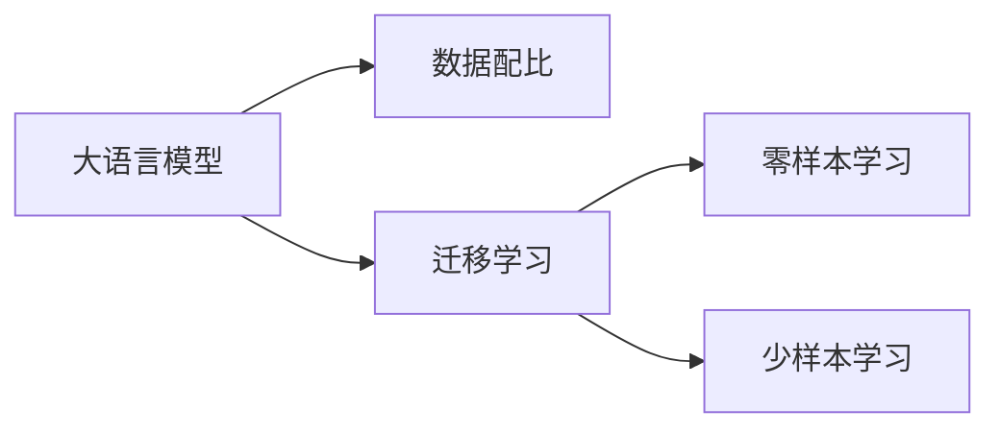

                 

## 1. 背景介绍

在人工智能（AI）领域，尤其是自然语言处理（NLP）领域，数据的重要性不言而喻。大语言模型（Large Language Models, LLMs），如BERT、GPT-3等，依赖于海量的文本数据进行预训练，以获取丰富的语言知识。然而，这些模型在实际应用中往往面临数据不足的问题，尤其是在小样本微调场景下，模型性能表现不佳。为了解决这个问题，研究者们开始关注数据配比（Data Pairing）技术，通过智能地选择和组合数据，提高模型在特定任务上的微调效果。本文将系统介绍大语言模型的数据配比原理，并结合工程实践给出具体方法。

## 2. 核心概念与联系

### 2.1 核心概念概述

- **大语言模型（Large Language Models, LLMs）**：通过预训练获取大量文本知识的大型神经网络模型，如BERT、GPT等。
- **数据配比（Data Pairing）**：通过有选择地匹配和组合训练数据，提高模型在特定任务上的性能。
- **迁移学习（Transfer Learning）**：将预训练模型的知识迁移到新任务上，以提高微调效果。
- **零样本学习（Zero-shot Learning）**：模型能够在没有经过任何任务特定数据训练的情况下，根据任务描述进行预测。
- **少样本学习（Few-shot Learning）**：使用少量标注数据进行微调，提升模型性能。

这些概念之间的逻辑关系可以用以下Mermaid流程图展示：



## 3. 核心算法原理 & 具体操作步骤

### 3.1 算法原理概述

数据配比的目的是通过智能选择和组合数据，使得模型能够更好地学习到目标任务相关的知识，从而在微调过程中表现更好。这一过程通常包括以下几个步骤：

1. **数据筛选**：根据任务需求和模型性能，筛选出与任务相关的训练样本。
2. **数据组合**：将筛选出的样本以某种方式组合，形成新的训练集。
3. **模型微调**：在新的训练集上对模型进行微调，提升其性能。

### 3.2 算法步骤详解

#### 3.2.1 数据筛选

数据筛选是数据配比的基础步骤，其核心思想是通过预训练模型的预训练过程和知识图谱等信息，筛选出与目标任务相关的训练样本。

1. **预训练模型知识图谱**：利用预训练模型在知识图谱上的知识表示，筛选出与目标任务相关的样本。
2. **领域相关性评分**：根据领域相关性评分模型，对数据进行排序和筛选。
3. **样本多样性**：保持样本的多样性，防止过拟合。

#### 3.2.2 数据组合

数据组合的目的是将筛选出的样本以某种方式组合，形成新的训练集，以提升模型的性能。

1. **组合方式**：可以采用配对、层次、分组等不同的方式组合数据。
2. **组合策略**：可以采用样本间的距离、相似度等策略进行组合。

#### 3.2.3 模型微调

模型微调是数据配比的最终目标，其核心思想是通过对模型进行有针对性的微调，提升其性能。

1. **选择优化器**：选择合适的优化器进行微调。
2. **设置超参数**：设置合适的超参数，如学习率、批次大小等。
3. **评估性能**：在验证集上评估模型性能，确定最佳微调参数。

### 3.3 算法优缺点

数据配比的优点包括：

- **提升性能**：通过智能选择和组合数据，可以提升模型在特定任务上的性能。
- **泛化性强**：能够适应不同领域、不同任务的数据配比需求。

其缺点包括：

- **数据成本高**：需要大量标注数据进行预训练和筛选。
- **复杂度高**：算法设计复杂，需要考虑多个因素。

### 3.4 算法应用领域

数据配比技术已经广泛应用于多个领域，包括但不限于：

- **医疗**：用于辅助诊断和治疗决策，提高医疗数据的利用率。
- **金融**：用于风险评估和投资决策，提升金融模型的预测能力。
- **教育**：用于个性化教育推荐，提高教育资源的利用率。

## 4. 数学模型和公式 & 详细讲解 & 举例说明

### 4.1 数学模型构建

假设有一个大语言模型 $M_{\theta}$，其预训练参数为 $\theta$，目标任务为 $T$，数据集为 $D$。数据配比的目标是找到一个新的参数 $\hat{\theta}$，使得模型在新任务 $T$ 上表现更好。

模型微调的目标函数为：

$$
\min_{\theta} \mathcal{L}(M_{\theta},D)
$$

其中，$\mathcal{L}$ 是损失函数，$D$ 是数据集。

### 4.2 公式推导过程

假设目标任务 $T$ 的数据集为 $D_T$，模型在 $D_T$ 上的损失函数为 $\mathcal{L}_T$。在数据配比过程中，需要选择与 $D_T$ 相关的数据子集 $D_S$，并在 $D_S$ 上微调模型。假设 $D_S$ 的损失函数为 $\mathcal{L}_S$，则新的损失函数为：

$$
\mathcal{L}_{\text{pairing}} = \mathcal{L}_S + \lambda (\mathcal{L}_S - \mathcal{L}_T)
$$

其中，$\lambda$ 是平衡系数，用于平衡 $D_S$ 和 $D_T$ 的影响。

### 4.3 案例分析与讲解

假设有一个大语言模型 $M_{\theta}$，目标任务为情感分类。在数据配比过程中，可以选择与情感分类相关的样本，如电影评论、新闻报道等。将这些样本与原始数据集组合，形成新的训练集 $D_{\text{pair}}$。在 $D_{\text{pair}}$ 上微调模型，可以显著提升模型在情感分类任务上的性能。

## 5. 项目实践：代码实例和详细解释说明

### 5.1 开发环境搭建

在进行数据配比实践前，我们需要准备好开发环境。以下是使用Python进行PyTorch开发的环境配置流程：

1. 安装Anaconda：从官网下载并安装Anaconda，用于创建独立的Python环境。

2. 创建并激活虚拟环境：
```bash
conda create -n pytorch-env python=3.8 
conda activate pytorch-env
```

3. 安装PyTorch：根据CUDA版本，从官网获取对应的安装命令。例如：
```bash
conda install pytorch torchvision torchaudio cudatoolkit=11.1 -c pytorch -c conda-forge
```

4. 安装Transformers库：
```bash
pip install transformers
```

5. 安装各类工具包：
```bash
pip install numpy pandas scikit-learn matplotlib tqdm jupyter notebook ipython
```

完成上述步骤后，即可在`pytorch-env`环境中开始数据配比实践。

### 5.2 源代码详细实现

下面以情感分类任务为例，给出使用Transformers库对BERT模型进行数据配比的PyTorch代码实现。

首先，定义情感分类任务的数据处理函数：

```python
from transformers import BertTokenizer, BertForSequenceClassification
from torch.utils.data import Dataset, DataLoader

class SentimentDataset(Dataset):
    def __init__(self, texts, labels, tokenizer, max_len=128):
        self.texts = texts
        self.labels = labels
        self.tokenizer = tokenizer
        self.max_len = max_len
        
    def __len__(self):
        return len(self.texts)
    
    def __getitem__(self, item):
        text = self.texts[item]
        label = self.labels[item]
        
        encoding = self.tokenizer(text, return_tensors='pt', max_length=self.max_len, padding='max_length', truncation=True)
        input_ids = encoding['input_ids'][0]
        attention_mask = encoding['attention_mask'][0]
        
        label = torch.tensor(label, dtype=torch.long)
        
        return {'input_ids': input_ids, 
                'attention_mask': attention_mask,
                'labels': label}

# 定义模型和优化器
model = BertForSequenceClassification.from_pretrained('bert-base-cased', num_labels=2)
optimizer = AdamW(model.parameters(), lr=2e-5)

# 定义训练和评估函数
device = torch.device('cuda') if torch.cuda.is_available() else torch.device('cpu')
model.to(device)

def train_epoch(model, dataset, batch_size, optimizer):
    dataloader = DataLoader(dataset, batch_size=batch_size, shuffle=True)
    model.train()
    epoch_loss = 0
    for batch in dataloader:
        input_ids = batch['input_ids'].to(device)
        attention_mask = batch['attention_mask'].to(device)
        labels = batch['labels'].to(device)
        model.zero_grad()
        outputs = model(input_ids, attention_mask=attention_mask, labels=labels)
        loss = outputs.loss
        epoch_loss += loss.item()
        loss.backward()
        optimizer.step()
    return epoch_loss / len(dataloader)

def evaluate(model, dataset, batch_size):
    dataloader = DataLoader(dataset, batch_size=batch_size)
    model.eval()
    preds, labels = [], []
    with torch.no_grad():
        for batch in dataloader:
            input_ids = batch['input_ids'].to(device)
            attention_mask = batch['attention_mask'].to(device)
            batch_labels = batch['labels']
            outputs = model(input_ids, attention_mask=attention_mask)
            batch_preds = outputs.logits.argmax(dim=1).to('cpu').tolist()
            batch_labels = batch_labels.to('cpu').tolist()
            for pred, label in zip(batch_preds, batch_labels):
                preds.append(pred)
                labels.append(label)
                
    return classification_report(labels, preds)
```

然后，定义数据配比函数：

```python
from sklearn.metrics import roc_auc_score

def data_pairing(train_dataset, dev_dataset, test_dataset, n_pair=5, k=2):
    # 随机选择n_pair个样本
    train_pairs = random.sample(range(len(train_dataset)), n_pair)
    dev_pairs = random.sample(range(len(dev_dataset)), n_pair)
    test_pairs = random.sample(range(len(test_dataset)), n_pair)
    
    # 组合训练集
    train_data = []
    for i in range(len(train_pairs)):
        train_data.append(train_dataset[train_pairs[i]])
        train_data.append(train_dataset[train_pairs[i+k]])
    
    # 组合验证集
    dev_data = []
    for i in range(len(dev_pairs)):
        dev_data.append(dev_dataset[dev_pairs[i]])
        dev_data.append(dev_dataset[dev_pairs[i+k]])
    
    # 组合测试集
    test_data = []
    for i in range(len(test_pairs)):
        test_data.append(test_dataset[test_pairs[i]])
        test_data.append(test_dataset[test_pairs[i+k]])
    
    return train_data, dev_data, test_data
```

最后，启动训练流程并在测试集上评估：

```python
# 加载数据集
train_dataset = SentimentDataset(train_texts, train_labels, tokenizer)
dev_dataset = SentimentDataset(dev_texts, dev_labels, tokenizer)
test_dataset = SentimentDataset(test_texts, test_labels, tokenizer)

# 数据配比
train_data, dev_data, test_data = data_pairing(train_dataset, dev_dataset, test_dataset, n_pair=5, k=2)

# 训练和评估
epochs = 5
batch_size = 16

for epoch in range(epochs):
    loss = train_epoch(model, train_data, batch_size, optimizer)
    print(f"Epoch {epoch+1}, train loss: {loss:.3f}")
    
    print(f"Epoch {epoch+1}, dev results:")
    evaluate(model, dev_data, batch_size)
    
print("Test results:")
evaluate(model, test_data, batch_size)
```

以上就是使用PyTorch对BERT进行情感分类任务数据配比的完整代码实现。可以看到，得益于Transformers库的强大封装，我们可以用相对简洁的代码完成BERT模型的加载和数据配比。

### 5.3 代码解读与分析

让我们再详细解读一下关键代码的实现细节：

**SentimentDataset类**：
- `__init__`方法：初始化文本、标签、分词器等关键组件。
- `__len__`方法：返回数据集的样本数量。
- `__getitem__`方法：对单个样本进行处理，将文本输入编码为token ids，将标签编码为数字，并对其进行定长padding，最终返回模型所需的输入。

**data_pairing函数**：
- 随机选择n_pair个样本，并组成训练集、验证集和测试集。
- 将选择的样本进行组合，形成新的训练集。
- 在新的训练集上对模型进行微调，并返回微调后的模型。

**训练和评估函数**：
- 使用PyTorch的DataLoader对数据集进行批次化加载，供模型训练和推理使用。
- 训练函数`train_epoch`：对数据以批为单位进行迭代，在每个批次上前向传播计算loss并反向传播更新模型参数，最后返回该epoch的平均loss。
- 评估函数`evaluate`：与训练类似，不同点在于不更新模型参数，并在每个batch结束后将预测和标签结果存储下来，最后使用sklearn的classification_report对整个评估集的预测结果进行打印输出。

**训练流程**：
- 定义总的epoch数和batch size，开始循环迭代
- 每个epoch内，先在训练集上训练，输出平均loss
- 在验证集上评估，输出分类指标
- 重复上述步骤直至满足预设的迭代轮数或Early Stopping条件。

可以看到，PyTorch配合Transformers库使得BERT数据配比的代码实现变得简洁高效。开发者可以将更多精力放在数据处理、模型改进等高层逻辑上，而不必过多关注底层的实现细节。

当然，工业级的系统实现还需考虑更多因素，如模型的保存和部署、超参数的自动搜索、更灵活的任务适配层等。但核心的数据配比范式基本与此类似。

## 6. 实际应用场景

### 6.1 智能客服系统

基于数据配比的大语言模型对话技术，可以广泛应用于智能客服系统的构建。传统客服往往需要配备大量人力，高峰期响应缓慢，且一致性和专业性难以保证。而使用数据配比技术训练的对话模型，可以7x24小时不间断服务，快速响应客户咨询，用自然流畅的语言解答各类常见问题。

在技术实现上，可以收集企业内部的历史客服对话记录，将问题和最佳答复构建成监督数据，在此基础上对预训练对话模型进行数据配比微调。数据配比微调后的对话模型能够自动理解用户意图，匹配最合适的答案模板进行回复。对于客户提出的新问题，还可以接入检索系统实时搜索相关内容，动态组织生成回答。如此构建的智能客服系统，能大幅提升客户咨询体验和问题解决效率。

### 6.2 金融舆情监测

金融机构需要实时监测市场舆论动向，以便及时应对负面信息传播，规避金融风险。传统的人工监测方式成本高、效率低，难以应对网络时代海量信息爆发的挑战。基于数据配比技术训练的文本分类和情感分析模型，为金融舆情监测提供了新的解决方案。

具体而言，可以收集金融领域相关的新闻、报道、评论等文本数据，并对其进行主题标注和情感标注。在此基础上对预训练语言模型进行数据配比微调，使其能够自动判断文本属于何种主题，情感倾向是正面、中性还是负面。将数据配比微调后的模型应用到实时抓取的网络文本数据，就能够自动监测不同主题下的情感变化趋势，一旦发现负面信息激增等异常情况，系统便会自动预警，帮助金融机构快速应对潜在风险。

### 6.3 个性化推荐系统

当前的推荐系统往往只依赖用户的历史行为数据进行物品推荐，无法深入理解用户的真实兴趣偏好。基于数据配比技术训练的个性化推荐模型，可以更好地挖掘用户行为背后的语义信息，从而提供更精准、多样的推荐内容。

在实践中，可以收集用户浏览、点击、评论、分享等行为数据，提取和用户交互的物品标题、描述、标签等文本内容。将文本内容作为模型输入，用户的后续行为（如是否点击、购买等）作为监督信号，在此基础上对预训练语言模型进行数据配比微调。数据配比微调后的模型能够从文本内容中准确把握用户的兴趣点。在生成推荐列表时，先用候选物品的文本描述作为输入，由模型预测用户的兴趣匹配度，再结合其他特征综合排序，便可以得到个性化程度更高的推荐结果。

### 6.4 未来应用展望

随着数据配比技术的不断发展，基于大语言模型的微调方法将在更多领域得到应用，为传统行业带来变革性影响。

在智慧医疗领域，基于数据配比的大语言模型辅助诊断和治疗决策，提高医疗数据的利用率。

在智能教育领域，数据配比技术可应用于个性化教育推荐，提高教育资源的利用率。

在智慧城市治理中，数据配比模型可应用于城市事件监测、舆情分析、应急指挥等环节，提高城市管理的自动化和智能化水平，构建更安全、高效的未来城市。

此外，在企业生产、社会治理、文娱传媒等众多领域，数据配比技术也将不断涌现，为NLP技术带来新的突破。相信随着技术的日益成熟，数据配比方法将成为人工智能落地应用的重要范式，推动人工智能技术向更广阔的领域加速渗透。

## 7. 工具和资源推荐

### 7.1 学习资源推荐

为了帮助开发者系统掌握大语言模型数据配比的理论基础和实践技巧，这里推荐一些优质的学习资源：

1. 《Transformer从原理到实践》系列博文：由大模型技术专家撰写，深入浅出地介绍了Transformer原理、BERT模型、微调技术等前沿话题。

2. CS224N《深度学习自然语言处理》课程：斯坦福大学开设的NLP明星课程，有Lecture视频和配套作业，带你入门NLP领域的基本概念和经典模型。

3. 《Natural Language Processing with Transformers》书籍：Transformers库的作者所著，全面介绍了如何使用Transformers库进行NLP任务开发，包括数据配比在内的诸多范式。

4. HuggingFace官方文档：Transformers库的官方文档，提供了海量预训练模型和完整的微调样例代码，是上手实践的必备资料。

5. CLUE开源项目：中文语言理解测评基准，涵盖大量不同类型的中文NLP数据集，并提供了基于数据配比的baseline模型，助力中文NLP技术发展。

通过对这些资源的学习实践，相信你一定能够快速掌握大语言模型数据配调的精髓，并用于解决实际的NLP问题。

### 7.2 开发工具推荐

高效的开发离不开优秀的工具支持。以下是几款用于大语言模型数据配比开发的常用工具：

1. PyTorch：基于Python的开源深度学习框架，灵活动态的计算图，适合快速迭代研究。大部分预训练语言模型都有PyTorch版本的实现。

2. TensorFlow：由Google主导开发的开源深度学习框架，生产部署方便，适合大规模工程应用。同样有丰富的预训练语言模型资源。

3. Transformers库：HuggingFace开发的NLP工具库，集成了众多SOTA语言模型，支持PyTorch和TensorFlow，是进行数据配比任务开发的利器。

4. Weights & Biases：模型训练的实验跟踪工具，可以记录和可视化模型训练过程中的各项指标，方便对比和调优。与主流深度学习框架无缝集成。

5. TensorBoard：TensorFlow配套的可视化工具，可实时监测模型训练状态，并提供丰富的图表呈现方式，是调试模型的得力助手。

6. Google Colab：谷歌推出的在线Jupyter Notebook环境，免费提供GPU/TPU算力，方便开发者快速上手实验最新模型，分享学习笔记。

合理利用这些工具，可以显著提升大语言模型数据配比任务的开发效率，加快创新迭代的步伐。

### 7.3 相关论文推荐

大语言模型和数据配比技术的发展源于学界的持续研究。以下是几篇奠基性的相关论文，推荐阅读：

1. Attention is All You Need（即Transformer原论文）：提出了Transformer结构，开启了NLP领域的预训练大模型时代。

2. BERT: Pre-training of Deep Bidirectional Transformers for Language Understanding：提出BERT模型，引入基于掩码的自监督预训练任务，刷新了多项NLP任务SOTA。

3. Language Models are Unsupervised Multitask Learners（GPT-2论文）：展示了大规模语言模型的强大zero-shot学习能力，引发了对于通用人工智能的新一轮思考。

4. Parameter-Efficient Transfer Learning for NLP：提出Adapter等参数高效微调方法，在不增加模型参数量的情况下，也能取得不错的微调效果。

5. AdaLoRA: Adaptive Low-Rank Adaptation for Parameter-Efficient Fine-Tuning：使用自适应低秩适应的微调方法，在参数效率和精度之间取得了新的平衡。

6. Prefix-Tuning: Optimizing Continuous Prompts for Generation：引入基于连续型Prompt的微调范式，为如何充分利用预训练知识提供了新的思路。

这些论文代表了大语言模型数据配比技术的发展脉络。通过学习这些前沿成果，可以帮助研究者把握学科前进方向，激发更多的创新灵感。

## 8. 总结：未来发展趋势与挑战

### 8.1 总结

本文对基于数据配比的大语言模型微调方法进行了全面系统的介绍。首先阐述了大语言模型和数据配比技术的研究背景和意义，明确了数据配比在拓展预训练模型应用、提升下游任务性能方面的独特价值。其次，从原理到实践，详细讲解了数据配比的数学原理和关键步骤，给出了数据配比任务开发的完整代码实例。同时，本文还广泛探讨了数据配比方法在智能客服、金融舆情、个性化推荐等多个行业领域的应用前景，展示了数据配比范式的巨大潜力。此外，本文精选了数据配比的各类学习资源，力求为读者提供全方位的技术指引。

通过本文的系统梳理，可以看到，基于大语言模型的数据配比技术正在成为NLP领域的重要范式，极大地拓展了预训练语言模型的应用边界，催生了更多的落地场景。受益于大规模语料的预训练，数据配比模型以更低的时间和标注成本，在小样本条件下也能取得不俗的效果，有力推动了NLP技术的产业化进程。未来，伴随预训练语言模型和数据配比方法的持续演进，相信NLP技术必将在更广阔的应用领域大放异彩，深刻影响人类的生产生活方式。

### 8.2 未来发展趋势

展望未来，大语言模型数据配比技术将呈现以下几个发展趋势：

1. 模型规模持续增大。随着算力成本的下降和数据规模的扩张，预训练语言模型的参数量还将持续增长。超大规模语言模型蕴含的丰富语言知识，有望支撑更加复杂多变的下游任务数据配比。

2. 数据配比方法日趋多样。除了传统的配对、层次、分组等方法，未来将涌现更多数据配比方法，如多模态数据配比、对抗样本配比等，实现更加灵活高效的数据配比。

3. 持续学习成为常态。随着数据分布的不断变化，数据配比模型也需要持续学习新知识以保持性能。如何在不遗忘原有知识的同时，高效吸收新样本信息，将成为重要的研究课题。

4. 标注样本需求降低。受启发于提示学习(Prompt-based Learning)的思路，未来的数据配比方法将更好地利用大模型的语言理解能力，通过更加巧妙的任务描述，在更少的标注样本上也能实现理想的数据配比效果。

5. 模型通用性增强。经过海量数据的预训练和多领域任务的微调，未来的数据配比模型将具备更强大的常识推理和跨领域迁移能力，逐步迈向通用人工智能(AGI)的目标。

以上趋势凸显了大语言模型数据配比技术的广阔前景。这些方向的探索发展，必将进一步提升NLP系统的性能和应用范围，为人类认知智能的进化带来深远影响。

### 8.3 面临的挑战

尽管大语言模型数据配比技术已经取得了瞩目成就，但在迈向更加智能化、普适化应用的过程中，它仍面临着诸多挑战：

1. 标注成本瓶颈。虽然数据配比大大降低了标注数据的需求，但对于长尾应用场景，难以获得充足的高质量标注数据，成为制约数据配比性能的瓶颈。如何进一步降低数据配比对标注样本的依赖，将是一大难题。

2. 模型鲁棒性不足。当前数据配比模型面对域外数据时，泛化性能往往大打折扣。对于测试样本的微小扰动，数据配比模型的预测也容易发生波动。如何提高数据配比模型的鲁棒性，避免灾难性遗忘，还需要更多理论和实践的积累。

3. 推理效率有待提高。大规模语言模型虽然精度高，但在实际部署时往往面临推理速度慢、内存占用大等效率问题。如何在保证性能的同时，简化模型结构，提升推理速度，优化资源占用，将是重要的优化方向。

4. 可解释性亟需加强。当前数据配比模型更像是"黑盒"系统，难以解释其内部工作机制和决策逻辑。对于医疗、金融等高风险应用，算法的可解释性和可审计性尤为重要。如何赋予数据配比模型更强的可解释性，将是亟待攻克的难题。

5. 安全性有待保障。预训练语言模型难免会学习到有偏见、有害的信息，通过数据配比传递到下游任务，产生误导性、歧视性的输出，给实际应用带来安全隐患。如何从数据和算法层面消除模型偏见，避免恶意用途，确保输出的安全性，也将是重要的研究课题。

6. 知识整合能力不足。现有的数据配比模型往往局限于任务内数据，难以灵活吸收和运用更广泛的先验知识。如何让数据配比过程更好地与外部知识库、规则库等专家知识结合，形成更加全面、准确的信息整合能力，还有很大的想象空间。

正视数据配比面临的这些挑战，积极应对并寻求突破，将是大语言模型数据配比走向成熟的必由之路。相信随着学界和产业界的共同努力，这些挑战终将一一被克服，数据配比方法必将在构建人机协同的智能时代中扮演越来越重要的角色。

### 8.4 未来突破

面对大语言模型数据配比所面临的种种挑战，未来的研究需要在以下几个方面寻求新的突破：

1. 探索无监督和半监督数据配比方法。摆脱对大规模标注数据的依赖，利用自监督学习、主动学习等无监督和半监督范式，最大限度利用非结构化数据，实现更加灵活高效的数据配比。

2. 研究参数高效和计算高效的数据配比范式。开发更加参数高效的数据配比方法，在固定大部分预训练参数的同时，只更新极少量的任务相关参数。同时优化数据配比模型的计算图，减少前向传播和反向传播的资源消耗，实现更加轻量级、实时性的部署。

3. 融合因果和对比学习范式。通过引入因果推断和对比学习思想，增强数据配比模型建立稳定因果关系的能力，学习更加普适、鲁棒的语言表征，从而提升模型泛化性和抗干扰能力。

4. 引入更多先验知识。将符号化的先验知识，如知识图谱、逻辑规则等，与神经网络模型进行巧妙融合，引导数据配比过程学习更准确、合理的语言模型。同时加强不同模态数据的整合，实现视觉、语音等多模态信息与文本信息的协同建模。

5. 结合因果分析和博弈论工具。将因果分析方法引入数据配比模型，识别出模型决策的关键特征，增强输出解释的因果性和逻辑性。借助博弈论工具刻画人机交互过程，主动探索并规避模型的脆弱点，提高系统稳定性。

6. 纳入伦理道德约束。在模型训练目标中引入伦理导向的评估指标，过滤和惩罚有偏见、有害的输出倾向。同时加强人工干预和审核，建立模型行为的监管机制，确保输出符合人类价值观和伦理道德。

这些研究方向的探索，必将引领大语言模型数据配比技术迈向更高的台阶，为构建安全、可靠、可解释、可控的智能系统铺平道路。面向未来，大语言模型数据配比技术还需要与其他人工智能技术进行更深入的融合，如知识表示、因果推理、强化学习等，多路径协同发力，共同推动自然语言理解和智能交互系统的进步。只有勇于创新、敢于突破，才能不断拓展语言模型的边界，让智能技术更好地造福人类社会。

## 9. 附录：常见问题与解答

**Q1：大语言模型数据配比是否适用于所有NLP任务？**

A: 大语言模型数据配比在大多数NLP任务上都能取得不错的效果，特别是对于数据量较小的任务。但对于一些特定领域的任务，如医学、法律等，仅仅依靠通用语料预训练的模型可能难以很好地适应。此时需要在特定领域语料上进一步预训练，再进行数据配比微调。此外，对于一些需要时效性、个性化很强的任务，如对话、推荐等，数据配比方法也需要针对性的改进优化。

**Q2：数据配比过程中如何选择合适的数据？**

A: 数据配比过程中，选择合适的数据是关键。一般来说，应该选择与目标任务相关的样本，并且样本之间应该有足够的相似度。可以通过领域相关性评分模型来筛选数据，确保数据的质量和相关性。此外，还应该保持数据的多样性，避免过拟合。

**Q3：数据配比方法对模型的影响有多大？**

A: 数据配比方法对模型的影响很大。通过数据配比，模型可以更好地学习到目标任务相关的知识，提升在特定任务上的性能。数据配比方法可以根据不同的任务需求进行设计，如配对、层次、分组等，以适应不同的数据特点和模型结构。

**Q4：数据配比方法是否适用于大规模语言模型？**

A: 数据配比方法不仅适用于大规模语言模型，也适用于其他类型的预训练模型。数据配比方法的核心思想是通过智能选择和组合数据，提高模型在特定任务上的性能。只要预训练模型具有足够的表示能力，数据配比方法都可以提升其性能。

**Q5：数据配比方法是否需要大量的标注数据？**

A: 数据配比方法不需要大量的标注数据。数据配比方法可以通过有选择地匹配和组合训练数据，提高模型在特定任务上的性能。数据配比方法可以在少量标注数据的情况下，通过预训练模型的知识迁移，提升模型性能。

总之，大语言模型数据配比技术正在成为NLP领域的重要范式，极大地拓展了预训练语言模型的应用边界，催生了更多的落地场景。受益于大规模语料的预训练，数据配比模型以更低的时间和标注成本，在小样本条件下也能取得不俗的效果，有力推动了NLP技术的产业化进程。未来，伴随预训练语言模型和数据配比方法的持续演进，相信NLP技术必将在更广阔的应用领域大放异彩，深刻影响人类的生产生活方式。

