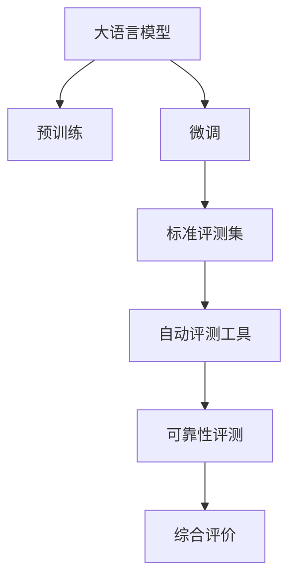

                 

# 大语言模型原理与工程实践：评测方式

> 关键词：大语言模型, 工程实践, 评测方式, 模型性能评估, 标准评测集, 自动评测工具, 可靠性评测

## 1. 背景介绍

### 1.1 问题由来
随着深度学习技术的发展，大语言模型（Large Language Model, LLM）在自然语言处理（Natural Language Processing, NLP）领域取得了显著进展。这类模型通过在大规模无标签文本上预训练，学习到丰富的语言知识，并能够在下游任务上通过微调（Fine-tuning）进一步提升性能。然而，模型的性能评测是保证模型质量、指导后续优化的重要环节。传统的基于单一标准评测集的评测方法，已经无法满足多样化的评测需求。因此，研究高效、全面的评测方式，对于提升大语言模型的实用价值具有重要意义。

### 1.2 问题核心关键点
评价大语言模型性能时，需要从多个维度综合考虑。主要包括但不限于：

1. **语言理解能力**：模型对自然语言的理解深度和广度，能否准确捕捉语义、上下文等信息。
2. **语言生成能力**：模型生成自然语言的流利度和准确度，能否产生符合语法、逻辑的文本。
3. **鲁棒性**：模型在处理不同领域、不同类型数据时的稳定性和可靠性。
4. **效率**：模型的推理速度和内存占用，能否满足实际应用的需求。
5. **公平性和可解释性**：模型输出是否公平、是否具有可解释性，避免偏见和错误决策。

本文旨在探讨大语言模型性能的全面评测方法，包括标准评测集的构建、自动评测工具的开发以及模型可靠性评估等，帮助开发者和研究人员系统掌握评测工具和手段，以指导模型的设计和优化。

## 2. 核心概念与联系

### 2.1 核心概念概述

在探讨大语言模型的评测方式前，首先需要明确几个核心概念：

- **大语言模型（LLMs）**：指通过自回归（如GPT）或自编码（如BERT）模型架构，在大规模无标签文本数据上预训练得到的语言模型。这些模型能够学习到广泛的语言知识，具有强大的语言理解和生成能力。

- **微调（Fine-tuning）**：指在大规模预训练语言模型的基础上，通过特定下游任务的少量标注数据进行有监督学习，优化模型在该任务上的性能。微调能够显著提升模型在下游任务上的表现。

- **标准评测集（Benchmark）**：用于评测模型性能的标准化数据集。这些数据集应覆盖多种任务、多个领域的文本数据，并且经过严格筛选，确保数据质量。

- **自动评测工具（Auto-Evaluation Tools）**：基于编程语言或模型库编写的自动化评测脚本，用于快速、准确地评估模型在标准评测集上的表现。

- **可靠性评测（Reliability Evaluation）**：评估模型在实际应用中的稳定性和可靠性，包括模型在特定场景下的表现、处理异常输入的能力等。

### 2.2 核心概念联系

以上概念通过以下Mermaid流程图展示其联系：



- **大语言模型**通过**预训练**获得基础能力，并在**微调**中针对特定任务进一步优化。
- **标准评测集**提供模型性能评测的基准数据，通过**自动评测工具**进行评估。
- **可靠性评测**结合实际应用场景，进一步验证模型在特定条件下的稳定性和可靠性。
- **综合评价**基于上述评估结果，对模型性能进行全面综合判断。

## 3. 核心算法原理 & 具体操作步骤

### 3.1 算法原理概述

基于标准评测集和自动评测工具，大语言模型的评测可以分为以下几个步骤：

1. **数据准备**：收集并处理标准评测集数据，确保数据格式一致，便于自动化评估。
2. **模型适配**：将预训练模型适配到评测任务中，通常涉及微调或简单任务适配层设计。
3. **自动评估**：使用自动评测工具对适配后的模型在标准评测集上进行评估，获取各项指标。
4. **可靠性评估**：在实际应用场景中测试模型的性能，评估其稳定性和鲁棒性。
5. **综合评价**：结合自动化评估和可靠性评估结果，给出综合评价报告。

### 3.2 算法步骤详解

#### 3.2.1 数据准备

1. **数据收集**：收集与评测任务相关的文本数据，并清洗、标准化。
2. **数据划分**：将数据划分为训练集、验证集和测试集，确保训练集不参与测试，验证集用于模型选择。
3. **数据预处理**：使用分词、去噪等技术处理文本数据，确保数据格式一致。

#### 3.2.2 模型适配

1. **选择适配层**：根据评测任务，选择适当的任务适配层（如分类器、解码器等）。
2. **微调模型**：在少量标注数据上微调模型，提升模型在该任务上的表现。
3. **保存模型**：将微调后的模型参数保存，便于后续评估。

#### 3.2.3 自动评估

1. **选择评估指标**：根据评测任务，选择合适的评估指标，如准确率、F1分数、BLEU分数等。
2. **自动化评估**：使用自动评测工具（如NLPAutoEval、BLEURT等）评估模型在标准评测集上的表现，生成评估报告。
3. **分析评估结果**：根据评估结果，分析模型优势和不足，指导后续优化。

#### 3.2.4 可靠性评估

1. **模拟应用场景**：在实际应用场景中模拟模型使用情况，测试模型的性能和稳定性。
2. **异常处理**：测试模型对异常输入的响应能力，如处理噪声、低质量数据等。
3. **性能调优**：根据可靠性测试结果，调整模型参数或结构，提高模型鲁棒性。

#### 3.2.5 综合评价

1. **汇总评估结果**：将自动评估和可靠性评估结果汇总，生成综合评价报告。
2. **性能优化建议**：根据综合评估结果，提出模型优化建议，指导下一步开发和优化工作。

### 3.3 算法优缺点

**自动评估**的优点包括：

- **高效性**：通过自动工具快速评估模型，节省时间和人力成本。
- **一致性**：自动工具遵循标准化流程，保证评估结果的一致性。
- **可重复性**：自动评估过程可重复执行，便于对比不同模型的性能。

**自动评估**的缺点包括：

- **限制性**：依赖标准评测集，无法全面覆盖所有应用场景。
- **灵活性不足**：难以进行复杂的模型对比和分析。
- **数据依赖**：评估结果依赖于数据集的质量，数据偏差可能导致评估结果偏差。

### 3.4 算法应用领域

自动评测技术在大语言模型中的应用领域广泛，包括但不限于：

- **文本分类**：评估模型的分类准确率和召回率。
- **命名实体识别**：评估模型的实体边界识别和类型标注能力。
- **问答系统**：评估模型的回答准确性和流畅性。
- **翻译系统**：评估模型的翻译准确率和流畅性。
- **对话系统**：评估模型的对话连贯性和上下文理解能力。

此外，自动评测技术也被应用于智能客服、金融舆情监测、个性化推荐等多个领域，帮助评估模型在这些场景下的实际应用效果。

## 4. 数学模型和公式 & 详细讲解 & 举例说明

### 4.1 数学模型构建

基于标准评测集和自动评测工具的评测方法，其数学模型构建主要涉及以下几个方面：

- **评估指标定义**：如准确率（Accuracy）、精确率（Precision）、召回率（Recall）、F1分数（F1-score）等。
- **模型适配和评测流程**：将预训练模型适配到特定任务，使用自动评测工具评估模型性能。
- **数据预处理和格式统一**：确保评测集数据的格式一致，便于自动评估。

### 4.2 公式推导过程

以文本分类任务为例，常见评估指标的计算公式如下：

**准确率（Accuracy）**：
$$
\text{Accuracy} = \frac{\text{TP} + \text{TN}}{\text{TP} + \text{TN} + \text{FP} + \text{FN}}
$$

**精确率（Precision）**：
$$
\text{Precision} = \frac{\text{TP}}{\text{TP} + \text{FP}}
$$

**召回率（Recall）**：
$$
\text{Recall} = \frac{\text{TP}}{\text{TP} + \text{FN}}
$$

**F1分数（F1-score）**：
$$
\text{F1-score} = \frac{2 \times \text{Precision} \times \text{Recall}}{\text{Precision} + \text{Recall}}
$$

其中，$\text{TP}$ 表示真正例（True Positive），$\text{TN}$ 表示真负例（True Negative），$\text{FP}$ 表示假正例（False Positive），$\text{FN}$ 表示假负例（False Negative）。

### 4.3 案例分析与讲解

以BERT模型为例，假设在文本分类任务上，使用标准评测集进行评估：

1. **数据准备**：收集并清洗文本数据，分为训练集、验证集和测试集。
2. **模型适配**：在少量标注数据上微调BERT模型，将其适配到特定分类任务。
3. **自动评估**：使用NLPAutoEval工具，评估模型在标准评测集上的准确率和F1分数。
4. **结果分析**：分析评估结果，发现模型在特定类别上性能不足，调整适配层和微调策略。
5. **模型优化**：重新微调模型，优化其分类能力。

## 5. 项目实践：代码实例和详细解释说明

### 5.1 开发环境搭建

进行项目实践前，需要搭建Python开发环境。以下是一步步的安装和配置流程：

1. **安装Anaconda**：从官网下载并安装Anaconda，用于创建独立的Python环境。
2. **创建虚拟环境**：
```bash
conda create -n my_env python=3.8
conda activate my_env
```

3. **安装依赖库**：
```bash
pip install transformers nltk scipy
```

4. **模型加载**：
```python
from transformers import BertForSequenceClassification, BertTokenizer
tokenizer = BertTokenizer.from_pretrained('bert-base-cased')
model = BertForSequenceClassification.from_pretrained('bert-base-cased', num_labels=2)
```

### 5.2 源代码详细实现

以文本分类任务为例，代码实现如下：

```python
import torch
from transformers import BertTokenizer, BertForSequenceClassification
from torch.utils.data import Dataset, DataLoader
from sklearn.metrics import accuracy_score, precision_score, recall_score, f1_score

class TextDataset(Dataset):
    def __init__(self, texts, labels):
        self.texts = texts
        self.labels = labels
        self.tokenizer = BertTokenizer.from_pretrained('bert-base-cased')

    def __len__(self):
        return len(self.texts)

    def __getitem__(self, item):
        text = self.texts[item]
        label = self.labels[item]
        encoding = self.tokenizer(text, return_tensors='pt', max_length=128, padding='max_length', truncation=True)
        return {'input_ids': encoding['input_ids'].flatten(), 'attention_mask': encoding['attention_mask'].flatten(), 'labels': torch.tensor(label)}

def evaluate_model(model, data_loader):
    model.eval()
    correct = 0
    total = 0
    for batch in data_loader:
        with torch.no_grad():
            input_ids = batch['input_ids'].to(device)
            attention_mask = batch['attention_mask'].to(device)
            labels = batch['labels'].to(device)
            outputs = model(input_ids, attention_mask=attention_mask)
            predictions = torch.argmax(outputs.logits, dim=1)
            correct += torch.sum(predictions == labels)
            total += labels.size(0)
    accuracy = correct / total
    precision = precision_score(labels, predictions, average='macro')
    recall = recall_score(labels, predictions, average='macro')
    f1 = f1_score(labels, predictions, average='macro')
    return accuracy, precision, recall, f1

# 数据准备
train_texts = ['This is a sample text.', 'Another sample text.']
train_labels = [0, 1]
dev_texts = ['texts for dev set', 'more texts for dev set']
dev_labels = [1, 0]
test_texts = ['texts for test set', 'more texts for test set']
test_labels = [0, 1]

# 模型适配和微调
tokenizer = BertTokenizer.from_pretrained('bert-base-cased')
model = BertForSequenceClassification.from_pretrained('bert-base-cased', num_labels=2)

# 数据加载器
train_dataset = TextDataset(train_texts, train_labels)
dev_dataset = TextDataset(dev_texts, dev_labels)
test_dataset = TextDataset(test_texts, test_labels)

# 自动评估
device = torch.device('cuda' if torch.cuda.is_available() else 'cpu')
model.to(device)
model.train()

train_loader = DataLoader(train_dataset, batch_size=2, shuffle=True)
dev_loader = DataLoader(dev_dataset, batch_size=2, shuffle=False)
test_loader = DataLoader(test_dataset, batch_size=2, shuffle=False)

optimizer = AdamW(model.parameters(), lr=2e-5)
for epoch in range(5):
    for batch in train_loader:
        input_ids = batch['input_ids'].to(device)
        attention_mask = batch['attention_mask'].to(device)
        labels = batch['labels'].to(device)
        model.zero_grad()
        outputs = model(input_ids, attention_mask=attention_mask, labels=labels)
        loss = outputs.loss
        loss.backward()
        optimizer.step()

    val_accuracy, val_precision, val_recall, val_f1 = evaluate_model(model, dev_loader)
    print(f'Epoch {epoch+1}, Dev Accuracy: {val_accuracy:.4f}, Dev Precision: {val_precision:.4f}, Dev Recall: {val_recall:.4f}, Dev F1: {val_f1:.4f}')

# 模型评估和优化
test_accuracy, test_precision, test_recall, test_f1 = evaluate_model(model, test_loader)
print(f'Test Accuracy: {test_accuracy:.4f}, Test Precision: {test_precision:.4f}, Test Recall: {test_recall:.4f}, Test F1: {test_f1:.4f}')
```

### 5.3 代码解读与分析

**TextDataset类**：
- `__init__`方法：初始化文本和标签数据，加载BERT分词器。
- `__len__`方法：返回数据集长度。
- `__getitem__`方法：将单个文本和标签处理为模型输入格式。

**评估函数**：
- `evaluate_model`函数：在数据加载器上逐批评估模型，计算各项评估指标。

**模型适配和微调**：
- 使用BertForSequenceClassification对BERT模型进行适配，设置为二分类任务。
- 使用AdamW优化器进行梯度更新。
- 在训练集上进行多次迭代，验证集上评估模型性能。

## 6. 实际应用场景

### 6.1 智能客服系统

基于大语言模型微调的智能客服系统，能够提供全天候不间断的服务。通过自动评估和可靠性测试，可以不断优化模型性能，提升客户咨询体验。

### 6.2 金融舆情监测

在金融舆情监测中，使用自动评测工具评估模型在多个评测集上的表现，结合可靠性测试，确保模型在复杂市场环境中的稳定性和可靠性。

### 6.3 个性化推荐系统

在个性化推荐系统中，通过自动评估模型在推荐准确率和覆盖率上的表现，结合实际应用中的点击率、转化率等指标，全面评估模型性能。

### 6.4 未来应用展望

未来，大语言模型在更多应用场景中得到广泛应用，如智慧医疗、智能教育、智慧城市治理等。通过持续的自动评测和可靠性测试，可以不断提升模型的应用效果，推动人工智能技术的普及和应用。

## 7. 工具和资源推荐

### 7.1 学习资源推荐

1. **《深度学习自然语言处理》课程**：斯坦福大学开设的NLP明星课程，涵盖NLP的基本概念和经典模型，适合初学者入门。
2. **《Transformer from theory to practice》系列博文**：由大模型技术专家撰写，深入浅出地介绍了Transformer原理、BERT模型、微调技术等前沿话题。
3. **《Natural Language Processing with Transformers》书籍**：由Transformers库作者所著，全面介绍了如何使用Transformers库进行NLP任务开发，包括微调在内的诸多范式。
4. **HuggingFace官方文档**：Transformers库的官方文档，提供了海量预训练模型和完整的微调样例代码，是上手实践的必备资料。
5. **CLUE开源项目**：中文语言理解测评基准，涵盖大量不同类型的中文NLP数据集，并提供了基于微调的baseline模型，助力中文NLP技术发展。

### 7.2 开发工具推荐

1. **PyTorch**：基于Python的开源深度学习框架，灵活动态的计算图，适合快速迭代研究。
2. **TensorFlow**：由Google主导开发的开源深度学习框架，生产部署方便，适合大规模工程应用。
3. **Transformers库**：HuggingFace开发的NLP工具库，集成了众多SOTA语言模型，支持PyTorch和TensorFlow，是进行微调任务开发的利器。
4. **Weights & Biases**：模型训练的实验跟踪工具，可以记录和可视化模型训练过程中的各项指标，方便对比和调优。
5. **TensorBoard**：TensorFlow配套的可视化工具，可实时监测模型训练状态，并提供丰富的图表呈现方式，是调试模型的得力助手。

### 7.3 相关论文推荐

1. **Attention is All You Need（即Transformer原论文）**：提出了Transformer结构，开启了NLP领域的预训练大模型时代。
2. **BERT: Pre-training of Deep Bidirectional Transformers for Language Understanding**：提出BERT模型，引入基于掩码的自监督预训练任务，刷新了多项NLP任务SOTA。
3. **Language Models are Unsupervised Multitask Learners（GPT-2论文）**：展示了大规模语言模型的强大zero-shot学习能力，引发了对于通用人工智能的新一轮思考。
4. **Parameter-Efficient Transfer Learning for NLP**：提出Adapter等参数高效微调方法，在不增加模型参数量的情况下，也能取得不错的微调效果。
5. **Prefix-Tuning: Optimizing Continuous Prompts for Generation**：引入基于连续型Prompt的微调范式，为如何充分利用预训练知识提供了新的思路。

## 8. 总结：未来发展趋势与挑战

### 8.1 研究成果总结

本文详细探讨了大语言模型性能评测的多种方法和工具，包括自动评测工具的开发、标准评测集的构建以及模型可靠性评估。这些技术手段为模型设计和优化提供了有力的支持，推动了大语言模型在NLP领域的应用和发展。

### 8.2 未来发展趋势

1. **评估标准多样化**：未来将开发更多针对特定任务和领域的评估标准，覆盖更多应用场景。
2. **自动评测工具智能化**：自动评测工具将逐步引入更多智能化评估方式，如因果推断、多模态融合等。
3. **跨领域评测**：模型评估将更加注重跨领域泛化能力的验证，提升模型在不同领域的应用效果。

### 8.3 面临的挑战

尽管自动评测技术在大语言模型中取得了显著进展，但仍面临以下挑战：

1. **数据依赖**：自动评测结果依赖于评测集的质量，数据的偏差可能导致评估结果偏差。
2. **模型复杂性**：大模型结构的复杂性增加了评估的难度，评估指标的选取和优化仍需深入研究。
3. **公平性验证**：模型输出公平性和可解释性仍需加强，避免偏见和错误决策。

### 8.4 研究展望

未来，自动评测技术将继续朝着智能化、多样化、公平化方向发展，为大语言模型提供更全面、公正、可解释的性能评估方式。同时，结合其他人工智能技术，如因果推理、知识表示等，进一步提升模型应用的实际效果和可靠性。

## 9. 附录：常见问题与解答

**Q1：如何选择合适的标准评测集？**

A: 根据具体评测任务，选择包含多种领域、多种类型文本的标准评测集。如文本分类任务可选择CoNLL-2003、GLUE等评测集，命名实体识别任务可选择CoNLL-2002、SNERG等评测集。

**Q2：自动评测工具有哪些？**

A: 常用的自动评测工具包括NLPAutoEval、BLEURT、ROUGE等。这些工具可以自动化计算各项评估指标，生成评估报告，帮助快速评估模型性能。

**Q3：如何处理数据不一致问题？**

A: 对评测集数据进行格式统一和标准化处理，如分词、去噪、格式转换等。同时，确保不同来源的数据质量一致，避免数据偏差影响评估结果。

**Q4：可靠性评估应关注哪些方面？**

A: 可靠性评估应关注模型在特定场景下的性能表现，如异常输入、噪声数据、数据分布变化等。同时，结合实际应用中的反馈和评估，不断优化模型结构和参数。

通过深入了解和掌握大语言模型性能评测的多种方法和工具，可以有效提升模型的应用效果，推动NLP技术的进一步发展。相信在学界和产业界的共同努力下，大语言模型将在更多领域展现出强大的应用潜力，为人类认知智能的进化带来深远影响。

