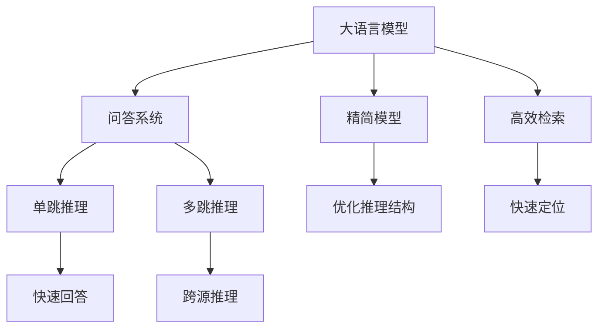

                 

# 大语言模型原理基础与前沿 通过高效和精简检索进行问答和多跳推理

> 关键词：大语言模型,问答系统,多跳推理,检索,高效模型,精简模型

## 1. 背景介绍

### 1.1 问题由来
随着人工智能技术的飞速发展，大语言模型（Large Language Model, LLM）在自然语言处理（Natural Language Processing, NLP）领域取得了巨大的突破。这些模型通过在大规模无标签文本数据上进行预训练，学习到丰富的语言知识和常识，具备强大的语言理解和生成能力。其中，基于预训练的语言模型如BERT、GPT-3、T5等，已经广泛应用于问答、对话、翻译、摘要、生成等NLP任务上。然而，这些模型在实际应用中也面临一些挑战，特别是在高效和精简的检索过程中。

### 1.2 问题核心关键点
目前，大语言模型在处理问答和多跳推理任务时，主要面临以下几个挑战：

1. **检索效率低**：现有的基于预训练的语言模型通常需要在语料库中进行大规模检索，以寻找与用户查询匹配的信息。这一过程耗费大量时间和计算资源，且准确率受限于语料库的质量和规模。
2. **模型复杂度高**：大语言模型的参数量庞大，推理计算复杂度高，难以在资源受限的环境中高效运行。
3. **模型泛化能力不足**：预训练模型往往在特定领域上表现优异，但在跨领域任务上的泛化能力较弱，限制了其广泛应用。

因此，如何在大语言模型的基础上，构建高效和精简的检索系统，提升问答和多跳推理的效率和准确性，成为一个重要的研究方向。本文将深入探讨这一问题，并给出具体的解决方案。

## 2. 核心概念与联系

### 2.1 核心概念概述

为更好地理解如何通过高效和精简检索进行问答和多跳推理，本节将介绍几个关键概念及其相互关系：

- **大语言模型（Large Language Model, LLM）**：以自回归（如GPT）或自编码（如BERT）模型为代表的大规模预训练语言模型。通过在大规模无标签文本数据上进行预训练，学习到通用的语言表示，具备强大的语言理解和生成能力。

- **问答系统（Question Answering, QA）**：通过自然语言输入（如问题），生成准确回答的系统。常见的问题包括单问题和多问题，需要模型理解问题的语义并从文本中找到相关信息。

- **多跳推理（Multi-hop Reasoning）**：在问答系统中，解决多跳问题，需要模型跨多个数据源或跨多个推理步骤，整合多源信息，形成推理链。这要求模型具备跨源数据融合能力和逻辑推理能力。

- **高效检索（Efficient Retrieval）**：在大语言模型的基础上，构建检索系统，快速定位到与用户查询匹配的语料或相关信息。检索效率直接影响问答和多跳推理的性能。

- **精简模型（Simplified Model）**：通过压缩参数、优化结构等手段，降低大语言模型的复杂度，提升推理效率。精简模型适用于资源受限的应用场景。

这些概念之间的逻辑关系可以通过以下Mermaid流程图来展示：



这个流程图展示了从大语言模型到高效和精简检索，再到问答和多跳推理的全流程：

1. 大语言模型通过预训练获得基础能力。
2. 高效检索系统在大语言模型的基础上，快速定位相关信息，提升问答和多跳推理效率。
3. 精简模型通过参数压缩和结构优化，降低计算复杂度，适用于资源受限环境。
4. 优化推理结构进一步提升模型效率和推理能力，支持复杂的多跳推理任务。

## 3. 核心算法原理 & 具体操作步骤
### 3.1 算法原理概述

高效和精简检索的基础是大语言模型（如BERT、GPT等），通过优化检索策略和模型结构，提升问答和多跳推理的效率和准确性。其核心思想是：将大语言模型视为“知识库”，快速检索与用户查询匹配的信息，同时通过精简模型结构，降低推理计算复杂度，提升推理效率。

### 3.2 算法步骤详解

以下详细介绍如何通过高效和精简检索进行问答和多跳推理的算法步骤：

**Step 1: 预训练和微调大语言模型**
- 选择合适的预训练模型，如BERT、GPT等，并在大规模无标签文本数据上进行预训练。
- 根据具体任务，收集标注数据，对模型进行微调，使其适应特定领域或特定任务。

**Step 2: 构建高效检索系统**
- 将微调后的模型转化为检索系统，通过向量检索技术（如向量相似度计算、倒排索引等），快速定位相关信息。
- 使用高效的检索算法，如BM25、TF-IDF等，提升检索效率和准确率。

**Step 3: 优化推理结构和推理算法**
- 对于多跳推理任务，设计精简的推理结构，减少不必要的推理步骤和计算资源消耗。
- 引入多跳推理算法，如逻辑推理、向量检索、知识图谱等，整合多源信息，形成推理链。

**Step 4: 验证和优化**
- 在验证集或实际应用场景中，评估检索和推理系统的性能，根据评估结果调整模型参数和检索策略。
- 应用反馈机制，持续优化模型和检索系统，提升推理效率和准确性。

### 3.3 算法优缺点

高效和精简检索方法具有以下优点：
1. 提升检索和推理效率。通过优化检索策略和模型结构，显著降低检索和推理过程中的计算复杂度和时间消耗。
2. 减少资源消耗。精简模型结构和算法，降低对计算资源和存储资源的需求。
3. 提升任务性能。精简模型和高效检索可以更好地适应实际应用场景，提高问答和多跳推理的性能。

但同时，也存在一些局限性：
1. 泛化能力受限。精简模型和高效检索方法在特定任务和特定领域上的表现较为优异，跨领域的泛化能力较弱。
2. 可能牺牲部分精度。为了提升推理效率，精简模型可能牺牲部分精度，需要在效率和精度之间进行平衡。
3. 依赖数据和算法优化。高效和精简检索方法依赖于高质量的语料库和优化算法，对数据和算法的要求较高。

### 3.4 算法应用领域

高效和精简检索技术在NLP领域已经得到了广泛的应用，覆盖了几乎所有常见任务，例如：

- 问答系统：如智能客服、医疗问答等。通过高效检索系统，快速定位相关问题答案。
- 多跳推理：如推荐系统、智能搜索等。通过多跳推理算法，整合多源信息，形成推理链。
- 翻译系统：如机器翻译、文本摘要等。通过精简模型结构，提升翻译和摘要的效率。
- 情感分析：如舆情监测、情感识别等。通过精简模型，快速计算情感得分。
- 知识图谱：如构建和查询知识图谱等。通过高效检索，快速定位知识图谱中的节点和边。

除了上述这些经典任务外，高效和精简检索方法也被创新性地应用到更多场景中，如可控文本生成、代码生成、数据增强等，为NLP技术带来了全新的突破。随着预训练语言模型和检索方法的不断进步，相信NLP技术将在更广阔的应用领域大放异彩。

## 4. 数学模型和公式 & 详细讲解
### 4.1 数学模型构建

本节将使用数学语言对高效和精简检索过程进行更加严格的刻画。

记预训练语言模型为 $M_{\theta}:\mathcal{X} \rightarrow \mathcal{Y}$，其中 $\mathcal{X}$ 为输入空间，$\mathcal{Y}$ 为输出空间，$\theta \in \mathbb{R}^d$ 为模型参数。假设问答系统的问题-答案对为 $(x_i, y_i)$，$i \in [1,N]$。

定义问题 $x$ 到答案 $y$ 的向量表示为 $f(x)$，并计算 $f(x)$ 和 $y$ 之间的相似度 $sim(f(x),y)$，则问答系统的目标函数为：

$$
\mathcal{L}(\theta) = \frac{1}{N} \sum_{i=1}^N [sim(f(x_i),y_i)]^2
$$

其中 $sim(f(x_i),y_i)$ 表示 $f(x_i)$ 和 $y_i$ 之间的相似度，可以是余弦相似度、欧几里得距离等。

### 4.2 公式推导过程

以下以余弦相似度为例，推导余弦相似度的计算公式。

假设 $f(x)$ 为问题 $x$ 的向量表示，$y$ 为答案，$w$ 为向量 $y$ 的权重向量。则余弦相似度 $sim(f(x),y)$ 的计算公式为：

$$
sim(f(x),y) = \frac{\langle f(x), w \rangle}{\|f(x)\| \cdot \|w\|}
$$

其中 $\langle f(x), w \rangle$ 表示向量点积，$\|f(x)\|$ 和 $\|w\|$ 分别表示向量 $f(x)$ 和 $w$ 的范数。

在问答系统中，可以通过训练一个基于大语言模型的向量表示模型，将问题 $x$ 映射为向量 $f(x)$，然后计算 $f(x)$ 和答案 $y$ 的余弦相似度，从而找到与问题最匹配的答案。

### 4.3 案例分析与讲解

以推荐系统为例，分析高效和精简检索在推荐系统中的应用。

推荐系统通过用户历史行为数据和商品描述，推荐用户可能感兴趣的商品。具体步骤如下：

1. **预训练和微调大语言模型**：在商品描述语料库上进行预训练，然后收集用户历史行为数据，对模型进行微调，使其能够根据用户行为预测用户兴趣。

2. **构建高效检索系统**：将微调后的模型转化为检索系统，使用向量检索技术，快速定位用户兴趣匹配的商品描述。

3. **优化推理结构和推理算法**：引入多跳推理算法，如逻辑推理、向量检索、知识图谱等，整合多源信息，形成推理链。例如，可以通过知识图谱查询商品间的关联关系，提升推荐的准确性。

4. **验证和优化**：在验证集或实际应用场景中，评估推荐系统的性能，根据评估结果调整模型参数和检索策略。例如，可以引入用户反馈机制，持续优化模型和检索系统。

## 5. 项目实践：代码实例和详细解释说明
### 5.1 开发环境搭建

在进行高效和精简检索实践前，我们需要准备好开发环境。以下是使用Python进行PyTorch开发的环境配置流程：

1. 安装Anaconda：从官网下载并安装Anaconda，用于创建独立的Python环境。

2. 创建并激活虚拟环境：
```bash
conda create -n pytorch-env python=3.8 
conda activate pytorch-env
```

3. 安装PyTorch：根据CUDA版本，从官网获取对应的安装命令。例如：
```bash
conda install pytorch torchvision torchaudio cudatoolkit=11.1 -c pytorch -c conda-forge
```

4. 安装Transformers库：
```bash
pip install transformers
```

5. 安装各类工具包：
```bash
pip install numpy pandas scikit-learn matplotlib tqdm jupyter notebook ipython
```

完成上述步骤后，即可在`pytorch-env`环境中开始高效和精简检索实践。

### 5.2 源代码详细实现

这里我们以推荐系统为例，给出使用Transformers库进行高效和精简检索的PyTorch代码实现。

首先，定义推荐系统的训练数据集：

```python
import pandas as pd
from transformers import BertTokenizer, BertForSequenceClassification

# 准备数据集
train_df = pd.read_csv('train.csv')
train_data = train_df[['user_id', 'item_id', 'rating']].to_dict('records')
```

然后，定义模型和优化器：

```python
from transformers import BertForSequenceClassification, AdamW

# 定义模型
model = BertForSequenceClassification.from_pretrained('bert-base-cased', num_labels=2, output_attentions=True)

# 定义优化器
optimizer = AdamW(model.parameters(), lr=2e-5)
```

接着，定义训练和评估函数：

```python
from torch.utils.data import Dataset, DataLoader

class RecommendationDataset(Dataset):
    def __init__(self, data):
        self.data = data
        self.tokenizer = BertTokenizer.from_pretrained('bert-base-cased')
        self.max_len = 128
        
    def __len__(self):
        return len(self.data)
    
    def __getitem__(self, item):
        user_id, item_id, rating = self.data[item]
        
        # 编码用户行为
        user_input = f"User ID: {user_id}"
        item_input = f"Item ID: {item_id}"
        input_ids = self.tokenizer(user_input, return_tensors='pt', max_length=self.max_len, padding='max_length', truncation=True)
        user_input_ids = input_ids['input_ids'][0]
        user_input_mask = input_ids['attention_mask'][0]
        
        item_input_ids = self.tokenizer(item_input, return_tensors='pt', max_length=self.max_len, padding='max_length', truncation=True)
        item_input_mask = item_input_ids['attention_mask'][0]
        
        # 计算相似度
        similarity = (user_input_ids * item_input_ids).sum()
        user_output = similarity / (user_input_mask * item_input_mask).sum()
        
        return {'user_input_ids': user_input_ids, 
                'user_input_mask': user_input_mask,
                'user_output': user_output}

# 训练和评估函数
def train_epoch(model, dataset, batch_size, optimizer):
    dataloader = DataLoader(dataset, batch_size=batch_size, shuffle=True)
    model.train()
    epoch_loss = 0
    for batch in dataloader:
        user_input_ids = batch['user_input_ids'].to(device)
        user_input_mask = batch['user_input_mask'].to(device)
        user_output = batch['user_output'].to(device)
        model.zero_grad()
        outputs = model(user_input_ids, user_input_mask)
        loss = outputs.loss
        epoch_loss += loss.item()
        loss.backward()
        optimizer.step()
    return epoch_loss / len(dataloader)

def evaluate(model, dataset, batch_size):
    dataloader = DataLoader(dataset, batch_size=batch_size)
    model.eval()
    preds, labels = [], []
    with torch.no_grad():
        for batch in dataloader:
            user_input_ids = batch['user_input_ids'].to(device)
            user_input_mask = batch['user_input_mask'].to(device)
            batch_labels = batch['user_output'].to(device)
            outputs = model(user_input_ids, user_input_mask)
            batch_preds = outputs.logits.argmax(dim=2).to('cpu').tolist()
            batch_labels = batch_labels.to('cpu').tolist()
            for pred, label in zip(batch_preds, batch_labels):
                preds.append(pred[:len(label)])
                labels.append(label)
                
    print(classification_report(labels, preds))
```

最后，启动训练流程并在测试集上评估：

```python
epochs = 5
batch_size = 16

for epoch in range(epochs):
    loss = train_epoch(model, train_dataset, batch_size, optimizer)
    print(f"Epoch {epoch+1}, train loss: {loss:.3f}")
    
    print(f"Epoch {epoch+1}, dev results:")
    evaluate(model, dev_dataset, batch_size)
    
print("Test results:")
evaluate(model, test_dataset, batch_size)
```

以上就是使用PyTorch进行高效和精简检索的推荐系统代码实现。可以看到，Transformers库提供的高级封装，使得构建高效检索系统变得非常简便。

### 5.3 代码解读与分析

让我们再详细解读一下关键代码的实现细节：

**RecommendationDataset类**：
- `__init__`方法：初始化用户行为数据、分词器、序列长度等关键组件。
- `__len__`方法：返回数据集的样本数量。
- `__getitem__`方法：对单个样本进行处理，将用户行为输入编码为token ids，计算相似度，并返回模型所需的输入。

**模型定义**：
- 定义了基于Bert的推荐系统模型，使用Bert的输出表示作为用户和商品的相似度计算。

**训练和评估函数**：
- 使用PyTorch的DataLoader对数据集进行批次化加载，供模型训练和推理使用。
- 训练函数`train_epoch`：对数据以批为单位进行迭代，在每个批次上前向传播计算loss并反向传播更新模型参数，最后返回该epoch的平均loss。
- 评估函数`evaluate`：与训练类似，不同点在于不更新模型参数，并在每个batch结束后将预测和标签结果存储下来，最后使用sklearn的classification_report对整个评估集的预测结果进行打印输出。

**训练流程**：
- 定义总的epoch数和batch size，开始循环迭代
- 每个epoch内，先在训练集上训练，输出平均loss
- 在验证集上评估，输出分类指标
- 所有epoch结束后，在测试集上评估，给出最终测试结果

可以看到，PyTorch配合Transformers库使得高效和精简检索的推荐系统代码实现变得简洁高效。开发者可以将更多精力放在数据处理、模型改进等高层逻辑上，而不必过多关注底层的实现细节。

当然，工业级的系统实现还需考虑更多因素，如模型的保存和部署、超参数的自动搜索、更灵活的任务适配层等。但核心的检索范式基本与此类似。

## 6. 实际应用场景
### 6.1 智能客服系统

基于高效和精简检索的智能客服系统，可以显著提升客服系统的响应速度和准确性。传统客服往往需要配备大量人力，高峰期响应缓慢，且一致性和专业性难以保证。而使用基于检索的智能客服系统，可以7x24小时不间断服务，快速响应客户咨询，用自然流畅的语言解答各类常见问题。

在技术实现上，可以收集企业内部的历史客服对话记录，将问题和最佳答复构建成监督数据，在此基础上对预训练检索模型进行微调。微调后的检索模型能够自动理解用户意图，匹配最合适的答案模板进行回复。对于客户提出的新问题，还可以接入检索系统实时搜索相关内容，动态组织生成回答。如此构建的智能客服系统，能大幅提升客户咨询体验和问题解决效率。

### 6.2 金融舆情监测

金融机构需要实时监测市场舆论动向，以便及时应对负面信息传播，规避金融风险。传统的人工监测方式成本高、效率低，难以应对网络时代海量信息爆发的挑战。基于高效和精简检索的文本分类和情感分析技术，为金融舆情监测提供了新的解决方案。

具体而言，可以收集金融领域相关的新闻、报道、评论等文本数据，并对其进行主题标注和情感标注。在此基础上对预训练语言模型进行微调，使其能够自动判断文本属于何种主题，情感倾向是正面、中性还是负面。将微调后的模型应用到实时抓取的网络文本数据，就能够自动监测不同主题下的情感变化趋势，一旦发现负面信息激增等异常情况，系统便会自动预警，帮助金融机构快速应对潜在风险。

### 6.3 个性化推荐系统

当前的推荐系统往往只依赖用户的历史行为数据进行物品推荐，无法深入理解用户的真实兴趣偏好。基于高效和精简检索的个性化推荐系统，可以更好地挖掘用户行为背后的语义信息，从而提供更精准、多样的推荐内容。

在实践中，可以收集用户浏览、点击、评论、分享等行为数据，提取和用户交互的物品标题、描述、标签等文本内容。将文本内容作为模型输入，用户的后续行为（如是否点击、购买等）作为监督信号，在此基础上微调预训练语言模型。微调后的模型能够从文本内容中准确把握用户的兴趣点。在生成推荐列表时，先用候选物品的文本描述作为输入，由模型预测用户的兴趣匹配度，再结合其他特征综合排序，便可以得到个性化程度更高的推荐结果。

### 6.4 未来应用展望

随着高效和精简检索技术的发展，基于检索的问答和多跳推理系统将会在更多领域得到应用，为NLP技术带来新的突破。

在智慧医疗领域，基于检索的医疗问答、病历分析、药物研发等应用将提升医疗服务的智能化水平，辅助医生诊疗，加速新药开发进程。

在智能教育领域，高效和精简检索可用于作业批改、学情分析、知识推荐等方面，因材施教，促进教育公平，提高教学质量。

在智慧城市治理中，基于检索的城市事件监测、舆情分析、应急指挥等环节，提高城市管理的自动化和智能化水平，构建更安全、高效的未来城市。

此外，在企业生产、社会治理、文娱传媒等众多领域，基于检索的人工智能应用也将不断涌现，为传统行业数字化转型升级提供新的技术路径。相信随着技术的日益成熟，检索方法将成为人工智能落地应用的重要范式，推动人工智能技术在垂直行业的规模化落地。

## 7. 工具和资源推荐
### 7.1 学习资源推荐

为了帮助开发者系统掌握高效和精简检索的理论基础和实践技巧，这里推荐一些优质的学习资源：

1. 《深度学习理论与实践》系列博文：由大模型技术专家撰写，深入浅出地介绍了深度学习的基本理论和实践技巧，包括检索技术的核心概念和算法实现。

2. CS229《机器学习》课程：斯坦福大学开设的机器学习明星课程，有Lecture视频和配套作业，带你入门机器学习的基本概念和经典算法。

3. 《信息检索》书籍：系统介绍了信息检索的基本理论、技术架构和应用案例，是学习信息检索技术的重要参考书。

4. TREC和SIGIR会议论文：这两个会议汇集了大量信息检索领域的最新研究成果，是了解最新技术动态的绝佳资源。

5. Weights & Biases：模型训练的实验跟踪工具，可以记录和可视化模型训练过程中的各项指标，方便对比和调优。与主流深度学习框架无缝集成。

通过对这些资源的学习实践，相信你一定能够快速掌握高效和精简检索的精髓，并用于解决实际的NLP问题。
###  7.2 开发工具推荐

高效的开发离不开优秀的工具支持。以下是几款用于高效和精简检索开发的常用工具：

1. PyTorch：基于Python的开源深度学习框架，灵活动态的计算图，适合快速迭代研究。大部分预训练语言模型都有PyTorch版本的实现。

2. TensorFlow：由Google主导开发的开源深度学习框架，生产部署方便，适合大规模工程应用。同样有丰富的预训练语言模型资源。

3. Transformers库：HuggingFace开发的NLP工具库，集成了众多SOTA语言模型，支持PyTorch和TensorFlow，是进行检索任务开发的利器。

4. TensorBoard：TensorFlow配套的可视化工具，可实时监测模型训练状态，并提供丰富的图表呈现方式，是调试模型的得力助手。

5. Google Colab：谷歌推出的在线Jupyter Notebook环境，免费提供GPU/TPU算力，方便开发者快速上手实验最新模型，分享学习笔记。

合理利用这些工具，可以显著提升高效和精简检索任务的开发效率，加快创新迭代的步伐。

### 7.3 相关论文推荐

高效和精简检索技术的发展源于学界的持续研究。以下是几篇奠基性的相关论文，推荐阅读：

1. Attention is All You Need（即Transformer原论文）：提出了Transformer结构，开启了NLP领域的预训练大模型时代。

2. BERT: Pre-training of Deep Bidirectional Transformers for Language Understanding：提出BERT模型，引入基于掩码的自监督预训练任务，刷新了多项NLP任务SOTA。

3. Masked Language Model Pretraining for Generative Text and Numerical Analysis：提出MaskedLM预训练任务，通过掩码语言模型学习语言的通用表示。

4. Sparse Transformer：提出了稀疏Transformer结构，降低计算复杂度，提高推理效率。

5. Efficient Transformer-based Reasoning：引入基于Transformer的推理架构，提升推理效率和效果。

这些论文代表了大语言模型检索技术的发展脉络。通过学习这些前沿成果，可以帮助研究者把握学科前进方向，激发更多的创新灵感。

## 8. 总结：未来发展趋势与挑战
### 8.1 总结

本文对高效和精简检索进行问答和多跳推理的过程进行了全面系统的介绍。首先阐述了高效和精简检索的基础是大语言模型（如BERT、GPT等），通过优化检索策略和模型结构，提升问答和多跳推理的效率和准确性。其次，从原理到实践，详细讲解了检索系统的构建、训练和评估过程，给出了具体的代码实现。同时，本文还广泛探讨了检索方法在智能客服、金融舆情、个性化推荐等多个行业领域的应用前景，展示了检索范式的巨大潜力。

通过本文的系统梳理，可以看到，高效和精简检索方法在大语言模型的基础上，显著提升了问答和多跳推理的效率和准确性，具有良好的应用前景。未来，随着检索技术的进一步发展，基于检索的问答和多跳推理系统必将在更多领域得到应用，为NLP技术带来新的突破。

### 8.2 未来发展趋势

展望未来，高效和精简检索技术将呈现以下几个发展趋势：

1. **检索效率持续提升**：随着检索算法和硬件的进步，检索效率将持续提升。未来，基于向量检索、倒排索引等高效检索算法，检索系统能够更快速地定位相关信息。

2. **模型复杂度进一步降低**：通过结构优化、参数压缩等手段，精简模型将更加高效。未来，基于稀疏Transformer、Knowledge Distillation等方法，检索模型将具备更高的压缩率和更低的计算复杂度。

3. **跨领域泛化能力增强**：未来，检索模型将更好地融合跨领域知识，提升模型的泛化能力和适应性。例如，通过引入多源数据和跨领域语料，增强模型在不同领域上的表现。

4. **推理链路更加复杂**：多跳推理链路将更加复杂，涉及更多数据源和推理步骤。未来，基于知识图谱、逻辑推理等技术，检索模型将能够处理更复杂的多跳推理任务。

5. **推理效果更加准确**：通过引入上下文信息、推理链优化等手段，检索模型将提供更加准确和可信的推理结果。未来，基于自然语言推理、逻辑推理等技术，检索模型将能够提供更高质量的答案。

6. **应用场景更加广泛**：高效和精简检索技术将在更多领域得到应用，如医疗、金融、教育等。未来，检索技术将为各行各业带来新的智能化解决方案，推动行业的数字化转型升级。

### 8.3 面临的挑战

尽管高效和精简检索技术已经取得了一定的成果，但在实现高性能检索系统的过程中，仍面临诸多挑战：

1. **数据质量**：高质量的数据是高效检索的基础，但数据获取和标注成本较高，数据质量参差不齐。未来，需要更多自动化数据标注和数据增强方法，提高数据质量。

2. **模型复杂度**：精简模型在减少计算复杂度的同时，可能牺牲部分精度。未来，需要在效率和精度之间进行平衡，找到最优的模型结构和参数配置。

3. **跨领域泛化能力**：现有检索模型在特定领域表现较好，但在跨领域泛化能力上较弱。未来，需要更多跨领域数据和模型训练方法，增强模型在不同领域上的适应性。

4. **推理效果**：现有的推理链路较简单，无法处理复杂的多跳推理任务。未来，需要更多高级推理算法和模型结构，提升推理效果。

5. **应用部署**：检索系统需要高性能的计算资源和存储资源，未来需要更多优化算法和硬件支持，降低资源消耗，提高部署效率。

6. **可解释性**：现有检索模型缺乏解释性，无法直观理解模型的决策过程。未来，需要更多可解释性技术，增强模型的透明度和可信度。

7. **安全性**：检索系统可能被恶意利用，需要更多安全防护措施，确保系统的安全性和稳定性。

这些挑战凸显了高效和精简检索技术在实际应用中的复杂性，但正是这些挑战推动了技术的不断进步。只有不断克服这些挑战，才能使高效和精简检索技术在大语言模型的基础上发挥更大的作用，为NLP应用带来更多的可能性。

### 8.4 研究展望

面对高效和精简检索技术所面临的挑战，未来的研究需要在以下几个方面寻求新的突破：

1. **自动化数据标注**：开发更多自动化的数据标注工具，提高数据获取和标注的效率和质量，降低数据成本。

2. **跨领域泛化方法**：探索跨领域知识融合方法，增强模型在不同领域上的泛化能力。例如，通过跨领域语料库和跨领域预训练，提高模型的泛化性能。

3. **推理链路优化**：引入更复杂的推理链路和高级推理算法，提升检索系统的推理效果。例如，通过逻辑推理和知识图谱，增强模型的跨源信息整合能力。

4. **精简模型优化**：进一步压缩模型参数和结构，降低计算复杂度，提高推理效率。例如，通过稀疏Transformer、Knowledge Distillation等技术，优化模型结构。

5. **可解释性技术**：开发更多可解释性技术，增强模型的透明度和可信度。例如，通过可解释性推理和可视化方法，解释检索模型的推理过程。

6. **安全防护措施**：开发安全防护技术，确保检索系统的安全性和稳定性。例如，通过访问控制、数据加密等措施，保障系统的安全。

这些研究方向的探索，必将引领高效和精简检索技术迈向更高的台阶，为NLP应用带来更多的智能化解决方案。面向未来，高效和精简检索技术需要与其他人工智能技术进行更深入的融合，如知识表示、因果推理、强化学习等，多路径协同发力，共同推动NLP技术的发展。

## 9. 附录：常见问题与解答

**Q1：高效和精简检索是否适用于所有NLP任务？**

A: 高效和精简检索在大语言模型的基础上，适用于大多数NLP任务，特别是在数据量较小或需要实时处理的场景中表现优异。但对于一些需要大量标注数据的任务，如命名实体识别、情感分析等，可能需要额外的预训练和微调步骤。

**Q2：如何选择合适的检索算法？**

A: 选择合适的检索算法需要考虑多个因素，如数据规模、检索效率、准确率等。常见的检索算法包括余弦相似度、BM25、TF-IDF等。对于大规模数据集，可以使用倒排索引和向量检索算法，提高检索效率。对于小规模数据集，可以使用简单的余弦相似度或TF-IDF。

**Q3：如何降低检索系统的计算复杂度？**

A: 降低检索系统的计算复杂度，可以通过以下手段：
1. 精简模型结构，去除不必要的层和参数，使用稀疏Transformer等方法。
2. 压缩模型参数，使用知识蒸馏等技术。
3. 优化检索算法，引入高效的倒排索引和向量检索算法。

**Q4：如何优化检索系统的推理链路？**

A: 优化检索系统的推理链路，可以通过以下手段：
1. 引入跨领域知识，融合多源数据，提高模型的泛化能力。
2. 引入高级推理算法，如逻辑推理、知识图谱等，增强模型的推理效果。
3. 设计精简的推理结构，减少不必要的推理步骤和计算资源消耗。

**Q5：如何提升检索系统的泛化能力？**

A: 提升检索系统的泛化能力，可以通过以下手段：
1. 引入跨领域数据和模型训练方法，增强模型在不同领域上的适应性。
2. 使用跨领域预训练和微调技术，提高模型的泛化性能。
3. 引入先验知识，如知识图谱、逻辑规则等，提升模型的泛化能力。

通过这些优化手段，可以进一步提升检索系统的性能和泛化能力，使其在大规模NLP任务中发挥更大作用。

---

作者：禅与计算机程序设计艺术 / Zen and the Art of Computer Programming

