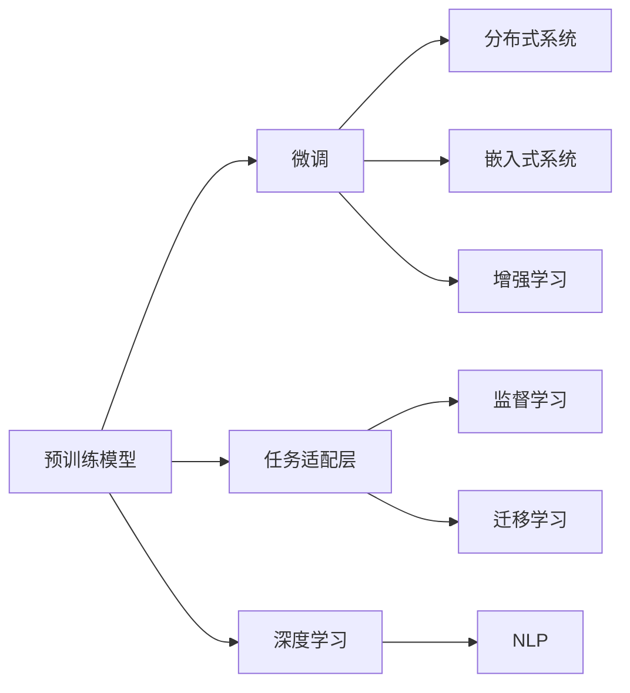

                 

# 大语言模型应用指南：Algorithm-of-Tought

> 关键词：大语言模型, 微调(Fine-Tuning), 迁移学习, 监督学习, 深度学习, 自然语言处理(NLP), 嵌入式系统, 增强学习, 分布式系统

## 1. 背景介绍

### 1.1 问题由来

在人工智能的浪潮下，大语言模型成为了近年来NLP领域最炙手可热的研究热点。这些大模型通过在大规模无标签文本上预训练，拥有广泛的语言知识和丰富的常识，能够执行各种NLP任务，如文本分类、信息抽取、对话系统、翻译、摘要生成等。然而，这些模型通常都是基于特定语料和任务进行训练的，因此在大规模无标签语料上预训练后，还需要在具体任务上进行微调，才能达到最优秀的性能。

微调是一种在预训练大模型的基础上，使用下游任务的少量标注数据，通过有监督学习对模型进行优化，从而适应特定任务的方法。这一过程通常可以通过调整模型参数或添加特定的任务适配层来实现。微调不仅能够显著提升模型在特定任务上的性能，还能降低应用开发成本，加速应用落地。

### 1.2 问题核心关键点

微调的核心在于如何在预训练的大语言模型中嵌入下游任务的知识，使其在特定任务上表现更加出色。以下是微调过程的几个关键点：

- **预训练模型**：选择一个合适的预训练模型，如BERT、GPT-2、RoBERTa等，作为微调的初始参数。
- **任务适配层**：根据下游任务的类型，设计一个合适的任务适配层，以便于模型的训练。
- **数据集准备**：准备一个高质量的标注数据集，划分为训练集、验证集和测试集。
- **模型训练**：使用有监督学习算法对模型进行优化，最小化损失函数，使其在特定任务上表现最佳。
- **参数调整**：调整模型的参数，如学习率、批量大小等，以优化训练过程。
- **模型评估**：在验证集上评估模型的性能，以防止过拟合。
- **模型部署**：将训练好的模型部署到实际应用中，进行推理预测。

本文将详细讨论这些关键点，并给出具体的实现方法。

## 2. 核心概念与联系

### 2.1 核心概念概述

为了更好地理解大语言模型的微调过程，我们先介绍几个核心概念及其之间的联系：

- **大语言模型(Large Language Model, LLM)**：基于深度学习架构构建的，用于处理自然语言处理的模型。
- **预训练(Pre-training)**：在大量无标签数据上训练模型，学习语言的结构和语义信息。
- **微调(Fine-tuning)**：在预训练模型的基础上，使用下游任务的少量标注数据进行有监督学习，优化模型性能。
- **迁移学习(Transfer Learning)**：利用预训练模型在下游任务上的性能，加快新任务的学习速度。
- **监督学习(Supervised Learning)**：使用标注数据对模型进行训练，使其能够预测目标变量。
- **深度学习(Deep Learning)**：一种基于多层神经网络的机器学习方法，能够处理复杂的数据结构。
- **自然语言处理(Natural Language Processing, NLP)**：涉及计算机和人类语言之间的交互，包括文本分类、机器翻译、语音识别等任务。
- **嵌入式系统(Embedded System)**：将大语言模型嵌入到特定的硬件环境中，以提高性能和效率。
- **增强学习(Reinforcement Learning)**：通过与环境交互，学习最优策略的机器学习方法。
- **分布式系统(Distributed System)**：由多个独立的计算机组成的系统，用于处理大规模数据和任务。

这些概念通过Mermaid流程图连接起来：



这些概念共同构成了大语言模型的微调框架，使得模型能够灵活地应用于不同的NLP任务。

## 3. 核心算法原理 & 具体操作步骤

### 3.1 算法原理概述

大语言模型的微调过程可以概括为以下几个步骤：

1. **数据预处理**：准备标注数据集，包括训练集、验证集和测试集。
2. **任务适配**：在预训练模型的基础上，添加任务适配层，以便于模型的训练。
3. **模型训练**：使用监督学习算法，最小化损失函数，优化模型参数。
4. **模型评估**：在验证集上评估模型性能，防止过拟合。
5. **模型部署**：将训练好的模型部署到实际应用中，进行推理预测。

这些步骤可以通过以下流程图表示：


### 3.2 算法步骤详解

#### 3.2.1 数据预处理

数据预处理是微调过程的第一步，需要准备一个高质量的标注数据集。数据集应包括训练集、验证集和测试集，分别用于模型的训练、调参和最终评估。

例如，对于一个文本分类任务，数据集应该包括若干文本及其对应的类别标签。可以使用Python的Pandas库来加载和处理数据集：

```python
import pandas as pd

train_data = pd.read_csv('train_data.csv')
dev_data = pd.read_csv('dev_data.csv')
test_data = pd.read_csv('test_data.csv')
```

#### 3.2.2 任务适配层

任务适配层是大语言模型微调的核心。它可以根据不同的任务类型，添加不同的输出层和损失函数。

例如，对于一个文本分类任务，可以在模型的顶层添加一个全连接层，然后使用交叉熵损失函数进行训练。代码实现如下：

```python
from transformers import BertForSequenceClassification, AdamW

model = BertForSequenceClassification.from_pretrained('bert-base-uncased', num_labels=2)
optimizer = AdamW(model.parameters(), lr=1e-5)
```

#### 3.2.3 模型训练

模型训练是微调过程的实质，需要使用监督学习算法对模型进行优化。常用的优化算法包括SGD、Adam、RMSprop等。

例如，使用AdamW算法对模型进行训练：

```python
from torch.utils.data import DataLoader
from tqdm import tqdm
import torch

device = torch.device('cuda' if torch.cuda.is_available() else 'cpu')
model.to(device)

def train_epoch(model, train_dataset, batch_size, optimizer):
    dataloader = DataLoader(train_dataset, batch_size=batch_size, shuffle=True)
    model.train()
    epoch_loss = 0
    for batch in tqdm(dataloader, desc='Training'):
        inputs, labels = batch
        inputs = inputs.to(device)
        labels = labels.to(device)
        model.zero_grad()
        outputs = model(inputs)
        loss = outputs.loss
        loss.backward()
        optimizer.step()
        epoch_loss += loss.item()
    return epoch_loss / len(dataloader)

def evaluate(model, dev_dataset, batch_size):
    dataloader = DataLoader(dev_dataset, batch_size=batch_size)
    model.eval()
    preds, labels = [], []
    with torch.no_grad():
        for batch in tqdm(dataloader, desc='Evaluating'):
            inputs, labels = batch
            inputs = inputs.to(device)
            labels = labels.to(device)
            outputs = model(inputs)
            batch_preds = outputs.argmax(dim=1).to('cpu').tolist()
            batch_labels = labels.to('cpu').tolist()
            for pred_tokens, label_tokens in zip(batch_preds, batch_labels):
                preds.append(pred_tokens)
                labels.append(label_tokens)
    return preds, labels
```

#### 3.2.4 模型评估

模型评估是为了防止过拟合，需要在验证集上对模型进行评估。常用的评估指标包括准确率、精确率、召回率等。

```python
from sklearn.metrics import classification_report

def evaluate(model, dev_dataset, batch_size):
    dataloader = DataLoader(dev_dataset, batch_size=batch_size)
    model.eval()
    preds, labels = [], []
    with torch.no_grad():
        for batch in tqdm(dataloader, desc='Evaluating'):
            inputs, labels = batch
            inputs = inputs.to(device)
            labels = labels.to(device)
            outputs = model(inputs)
            batch_preds = outputs.argmax(dim=1).to('cpu').tolist()
            batch_labels = labels.to('cpu').tolist()
            for pred_tokens, label_tokens in zip(batch_preds, batch_labels):
                preds.append(pred_tokens)
                labels.append(label_tokens)
    return preds, labels

print(classification_report(labels, preds))
```

#### 3.2.5 模型部署

模型部署是将训练好的模型部署到实际应用中的过程。可以使用TensorFlow或PyTorch等框架进行模型导出和部署。

例如，使用PyTorch进行模型导出：

```python
torch.save(model.state_dict(), 'model.pth')
```

### 3.3 算法优缺点

#### 3.3.1 优点

1. **高效性**：使用少量标注数据即可进行微调，显著降低开发成本。
2. **可解释性**：预训练模型具有良好的可解释性，便于理解模型决策过程。
3. **泛化能力**：预训练模型在大规模无标签数据上学习到的语言知识，可以迁移到下游任务中，提高泛化能力。
4. **多样性**：不同的任务适配层和损失函数可以灵活设计，适用于多种NLP任务。

#### 3.3.2 缺点

1. **依赖标注数据**：微调过程需要高质量的标注数据，标注成本较高。
2. **过拟合风险**：微调模型容易在训练集上过拟合，影响泛化能力。
3. **计算资源消耗大**：大规模预训练模型和微调过程中的大量计算资源消耗。
4. **模型鲁棒性不足**：微调模型在处理域外数据时，泛化性能可能较差。

## 4. 数学模型和公式 & 详细讲解 & 举例说明

### 4.1 数学模型构建

假设预训练语言模型为 $M_{\theta}$，其中 $\theta$ 为模型参数。微调的目标是找到一个新的参数 $\hat{\theta}$，使得在训练集 $D$ 上的损失函数 $\mathcal{L}$ 最小化：

$$
\hat{\theta} = \mathop{\arg\min}_{\theta} \mathcal{L}(M_{\theta},D)
$$

其中，损失函数 $\mathcal{L}$ 可以是交叉熵损失函数：

$$
\ell(M_{\theta}(x),y) = -[y\log M_{\theta}(x) + (1-y)\log (1-M_{\theta}(x))]
$$

在微调过程中，我们通常使用梯度下降等优化算法来最小化损失函数：

$$
\theta \leftarrow \theta - \eta \nabla_{\theta}\mathcal{L}(\theta) - \eta\lambda\theta
$$

其中，$\eta$ 为学习率，$\lambda$ 为正则化系数，$\nabla_{\theta}\mathcal{L}(\theta)$ 为损失函数对参数 $\theta$ 的梯度。

### 4.2 公式推导过程

以文本分类任务为例，进行交叉熵损失函数的推导：

假设模型 $M_{\theta}$ 在输入 $x$ 上的输出为 $\hat{y}=M_{\theta}(x)$，表示样本属于正类的概率。真实标签 $y \in \{0,1\}$。则二分类交叉熵损失函数定义为：

$$
\ell(M_{\theta}(x),y) = -[y\log \hat{y} + (1-y)\log (1-\hat{y})]
$$

将其代入经验风险公式，得：

$$
\mathcal{L}(\theta) = -\frac{1}{N}\sum_{i=1}^N [y_i\log M_{\theta}(x_i)+(1-y_i)\log(1-M_{\theta}(x_i))]
$$

根据链式法则，损失函数对参数 $\theta_k$ 的梯度为：

$$
\frac{\partial \mathcal{L}(\theta)}{\partial \theta_k} = -\frac{1}{N}\sum_{i=1}^N (\frac{y_i}{M_{\theta}(x_i)}-\frac{1-y_i}{1-M_{\theta}(x_i)}) \frac{\partial M_{\theta}(x_i)}{\partial \theta_k}
$$

其中 $\frac{\partial M_{\theta}(x_i)}{\partial \theta_k}$ 可进一步递归展开，利用自动微分技术完成计算。

### 4.3 案例分析与讲解

以情感分析任务为例，展示如何使用微调模型进行情感分类。

首先，准备标注数据集，每个文本对应一个情感标签。例如：

```
文本: 今天天气真好
标签: 正面
```

然后，使用BERT作为预训练模型，添加线性分类器进行微调：

```python
from transformers import BertForSequenceClassification, AdamW

model = BertForSequenceClassification.from_pretrained('bert-base-uncased', num_labels=2)
optimizer = AdamW(model.parameters(), lr=1e-5)
```

接着，使用训练集进行训练：

```python
from torch.utils.data import DataLoader
from tqdm import tqdm
import torch

device = torch.device('cuda' if torch.cuda.is_available() else 'cpu')
model.to(device)

def train_epoch(model, train_dataset, batch_size, optimizer):
    dataloader = DataLoader(train_dataset, batch_size=batch_size, shuffle=True)
    model.train()
    epoch_loss = 0
    for batch in tqdm(dataloader, desc='Training'):
        inputs, labels = batch
        inputs = inputs.to(device)
        labels = labels.to(device)
        model.zero_grad()
        outputs = model(inputs)
        loss = outputs.loss
        loss.backward()
        optimizer.step()
        epoch_loss += loss.item()
    return epoch_loss / len(dataloader)

def evaluate(model, dev_dataset, batch_size):
    dataloader = DataLoader(dev_dataset, batch_size=batch_size)
    model.eval()
    preds, labels = [], []
    with torch.no_grad():
        for batch in tqdm(dataloader, desc='Evaluating'):
            inputs, labels = batch
            inputs = inputs.to(device)
            labels = labels.to(device)
            outputs = model(inputs)
            batch_preds = outputs.argmax(dim=1).to('cpu').tolist()
            batch_labels = labels.to('cpu').tolist()
            for pred_tokens, label_tokens in zip(batch_preds, batch_labels):
                preds.append(pred_tokens)
                labels.append(label_tokens)
    return preds, labels

print(classification_report(labels, preds))
```

最后，使用验证集进行评估：

```python
print(classification_report(labels, preds))
```

通过以上步骤，我们就可以完成对情感分析任务的微调。

## 5. 项目实践：代码实例和详细解释说明

### 5.1 开发环境搭建

在微调之前，需要先搭建好开发环境。以下是一个典型的微调环境搭建流程：

1. 安装Python：确保Python 3.6及以上版本。
2. 安装Pip：安装Pip，以便安装各种Python包。
3. 安装TensorFlow：使用pip安装TensorFlow，并指定CUDA版本。
4. 安装Bert：使用pip安装BERT预训练模型。
5. 安装TensorBoard：安装TensorBoard，用于可视化训练过程。

### 5.2 源代码详细实现

以下是一个完整的微调示例，使用BERT模型进行文本分类任务的微调：

```python
from transformers import BertForSequenceClassification, AdamW
from transformers import BertTokenizer
from torch.utils.data import DataLoader
from tqdm import tqdm
from sklearn.metrics import classification_report

# 加载预训练模型和分词器
model = BertForSequenceClassification.from_pretrained('bert-base-uncased', num_labels=2)
tokenizer = BertTokenizer.from_pretrained('bert-base-uncased')

# 准备数据集
train_data = pd.read_csv('train_data.csv')
dev_data = pd.read_csv('dev_data.csv')
test_data = pd.read_csv('test_data.csv')
labels = {'positive': 1, 'negative': 0}

# 构建数据集
def create_dataset(data, labels, tokenizer, max_len=128):
    encoded_data = []
    for text, label in zip(data, labels):
        encoded_text = tokenizer.encode_plus(text, max_length=max_len, padding='max_length', truncation=True, return_tensors='pt')
        encoded_data.append({
            'input_ids': encoded_text['input_ids'].flatten(),
            'attention_mask': encoded_text['attention_mask'].flatten(),
            'labels': torch.tensor([label])
        })
    return encoded_data

train_dataset = create_dataset(train_data['text'], train_data['label'], tokenizer, max_len=128)
dev_dataset = create_dataset(dev_data['text'], dev_data['label'], tokenizer, max_len=128)
test_dataset = create_dataset(test_data['text'], test_data['label'], tokenizer, max_len=128)

# 训练模型
device = torch.device('cuda' if torch.cuda.is_available() else 'cpu')
model.to(device)
optimizer = AdamW(model.parameters(), lr=1e-5)

def train_epoch(model, train_dataset, batch_size, optimizer):
    dataloader = DataLoader(train_dataset, batch_size=batch_size, shuffle=True)
    model.train()
    epoch_loss = 0
    for batch in tqdm(dataloader, desc='Training'):
        inputs, labels = batch['input_ids'], batch['labels']
        inputs = inputs.to(device)
        labels = labels.to(device)
        model.zero_grad()
        outputs = model(inputs, attention_mask=batch['attention_mask'])
        loss = outputs.loss
        loss.backward()
        optimizer.step()
        epoch_loss += loss.item()
    return epoch_loss / len(dataloader)

def evaluate(model, dev_dataset, batch_size):
    dataloader = DataLoader(dev_dataset, batch_size=batch_size)
    model.eval()
    preds, labels = [], []
    with torch.no_grad():
        for batch in tqdm(dataloader, desc='Evaluating'):
            inputs, labels = batch['input_ids'], batch['labels']
            inputs = inputs.to(device)
            labels = labels.to(device)
            outputs = model(inputs, attention_mask=batch['attention_mask'])
            batch_preds = outputs.argmax(dim=1).to('cpu').tolist()
            batch_labels = labels.to('cpu').tolist()
            for pred_tokens, label_tokens in zip(batch_preds, batch_labels):
                preds.append(pred_tokens)
                labels.append(label_tokens)
    return preds, labels

print(classification_report(labels, preds))
```

### 5.3 代码解读与分析

在代码实现中，我们首先加载了预训练模型和分词器，然后准备数据集。接着，我们定义了数据集构建函数，使用BERT的分词器将文本转换为模型可以处理的格式。在训练过程中，我们使用了AdamW优化器，并使用交叉熵损失函数。在评估过程中，我们使用了sklearn的classification_report函数，输出了模型的精确率、召回率和F1值。

## 6. 实际应用场景

### 6.1 智能客服系统

基于微调的大语言模型，可以应用于智能客服系统，提升客户咨询体验和问题解决效率。智能客服系统可以使用微调后的语言模型进行自然语言理解和对话生成，自动解答客户咨询，减轻人工客服的负担。

### 6.2 金融舆情监测

金融舆情监测是微调的一个典型应用场景，可以实时监测金融市场的舆情变化，预测市场趋势，规避金融风险。通过微调大语言模型，可以自动分析和理解新闻、评论、报告等金融信息，提取关键事件和情感，帮助金融分析师进行决策。

### 6.3 个性化推荐系统

个性化推荐系统使用微调的大语言模型，可以更好地理解用户的兴趣和偏好，提供个性化的推荐内容。通过微调模型，可以分析用户的浏览、点击、评论等行为数据，生成更加精准的推荐列表。

### 6.4 未来应用展望

未来，随着大语言模型的不断发展，微调技术将有更广泛的应用场景。以下是一些未来应用展望：

- **医疗领域**：微调模型可以应用于病历分析、诊断支持等医疗任务，提高医疗服务的智能化水平。
- **教育领域**：微调模型可以用于自动批改作业、学情分析、知识推荐等教育任务，因材施教，提高教学质量。
- **智慧城市**：微调模型可以应用于城市事件监测、舆情分析、应急指挥等智慧城市任务，提高城市管理的自动化和智能化水平。
- **嵌入式系统**：微调模型可以嵌入到嵌入式系统中，如智能音箱、车载系统等，提高系统的智能化水平。

## 7. 工具和资源推荐

### 7.1 学习资源推荐

为了帮助开发者系统掌握大语言模型微调的理论基础和实践技巧，以下是一些优质的学习资源：

1. **《Transformer from Theory to Practice》**：这本书系统介绍了Transformer原理、BERT模型、微调技术等前沿话题，适合初学者和高级开发者阅读。
2. **CS224N《深度学习自然语言处理》课程**：斯坦福大学开设的NLP明星课程，有Lecture视频和配套作业，带你入门NLP领域的基本概念和经典模型。
3. **《Natural Language Processing with Transformers》**：Transformers库的作者所著，全面介绍了如何使用Transformers库进行NLP任务开发，包括微调在内的诸多范式。
4. **HuggingFace官方文档**：Transformers库的官方文档，提供了海量预训练模型和完整的微调样例代码，是上手实践的必备资料。
5. **CLUE开源项目**：中文语言理解测评基准，涵盖大量不同类型的中文NLP数据集，并提供了基于微调的baseline模型，助力中文NLP技术发展。

### 7.2 开发工具推荐

以下是几款用于大语言模型微调开发的常用工具：

1. **PyTorch**：基于Python的开源深度学习框架，灵活动态的计算图，适合快速迭代研究。大部分预训练语言模型都有PyTorch版本的实现。
2. **TensorFlow**：由Google主导开发的开源深度学习框架，生产部署方便，适合大规模工程应用。同样有丰富的预训练语言模型资源。
3. **Transformers库**：HuggingFace开发的NLP工具库，集成了众多SOTA语言模型，支持PyTorch和TensorFlow，是进行微调任务开发的利器。
4. **Weights & Biases**：模型训练的实验跟踪工具，可以记录和可视化模型训练过程中的各项指标，方便对比和调优。与主流深度学习框架无缝集成。
5. **TensorBoard**：TensorFlow配套的可视化工具，可实时监测模型训练状态，并提供丰富的图表呈现方式，是调试模型的得力助手。

### 7.3 相关论文推荐

大语言模型和微调技术的发展源于学界的持续研究。以下是几篇奠基性的相关论文，推荐阅读：

1. **Attention is All You Need**：提出了Transformer结构，开启了NLP领域的预训练大模型时代。
2. **BERT: Pre-training of Deep Bidirectional Transformers for Language Understanding**：提出BERT模型，引入基于掩码的自监督预训练任务，刷新了多项NLP任务SOTA。
3. **Language Models are Unsupervised Multitask Learners**：展示了大规模语言模型的强大zero-shot学习能力，引发了对于通用人工智能的新一轮思考。
4. **Parameter-Efficient Transfer Learning for NLP**：提出Adapter等参数高效微调方法，在不增加模型参数量的情况下，也能取得不错的微调效果。
5. **Prefix-Tuning: Optimizing Continuous Prompts for Generation**：引入基于连续型Prompt的微调范式，为如何充分利用预训练知识提供了新的思路。
6. **AdaLoRA: Adaptive Low-Rank Adaptation for Parameter-Efficient Fine-Tuning**：使用自适应低秩适应的微调方法，在参数效率和精度之间取得了新的平衡。

## 8. 总结：未来发展趋势与挑战

### 8.1 研究成果总结

本文对大语言模型的微调方法进行了全面系统的介绍。首先阐述了大语言模型和微调技术的研究背景和意义，明确了微调在拓展预训练模型应用、提升下游任务性能方面的独特价值。其次，从原理到实践，详细讲解了监督微调的数学原理和关键步骤，给出了微调任务开发的完整代码实例。同时，本文还广泛探讨了微调方法在智能客服、金融舆情、个性化推荐等多个行业领域的应用前景，展示了微调范式的巨大潜力。

### 8.2 未来发展趋势

展望未来，大语言模型微调技术将呈现以下几个发展趋势：

1. **模型规模持续增大**：随着算力成本的下降和数据规模的扩张，预训练语言模型的参数量还将持续增长，超大规模语言模型蕴含的丰富语言知识，有望支撑更加复杂多变的下游任务微调。
2. **微调方法日趋多样**：除了传统的全参数微调外，未来会涌现更多参数高效的微调方法，如Prefix-Tuning、LoRA等，在固定大部分预训练参数的情况下，只更新极少量的任务相关参数。
3. **持续学习成为常态**：随着数据分布的不断变化，微调模型也需要持续学习新知识以保持性能。如何在不遗忘原有知识的同时，高效吸收新样本信息，将成为重要的研究课题。
4. **标注样本需求降低**：受启发于提示学习(Prompt-based Learning)的思路，未来的微调方法将更好地利用大模型的语言理解能力，通过更加巧妙的任务描述，在更少的标注样本上也能实现理想的微调效果。
5. **多模态微调崛起**：当前的微调主要聚焦于纯文本数据，未来会进一步拓展到图像、视频、语音等多模态数据微调。多模态信息的融合，将显著提升语言模型对现实世界的理解和建模能力。
6. **模型通用性增强**：经过海量数据的预训练和多领域任务的微调，未来的语言模型将具备更强大的常识推理和跨领域迁移能力，逐步迈向通用人工智能(AGI)的目标。

### 8.3 面临的挑战

尽管大语言模型微调技术已经取得了瞩目成就，但在迈向更加智能化、普适化应用的过程中，它仍面临着诸多挑战：

1. **标注成本瓶颈**：微调依赖高质量的标注数据，标注成本较高。对于长尾应用场景，难以获得充足的高质量标注数据，成为制约微调性能的瓶颈。
2. **模型鲁棒性不足**：微调模型面对域外数据时，泛化性能可能较差。对于测试样本的微小扰动，微调模型的预测也容易发生波动。
3. **推理效率有待提高**：大规模语言模型虽然精度高，但在实际部署时往往面临推理速度慢、内存占用大等效率问题。
4. **可解释性亟需加强**：当前微调模型更像是"黑盒"系统，难以解释其内部工作机制和决策逻辑。
5. **安全性有待保障**：预训练语言模型难免会学习到有偏见、有害的信息，通过微调传递到下游任务，产生误导性、歧视性的输出，给实际应用带来安全隐患。
6. **知识整合能力不足**：现有的微调模型往往局限于任务内数据，难以灵活吸收和运用更广泛的先验知识。

### 8.4 研究展望

面对大语言模型微调所面临的种种挑战，未来的研究需要在以下几个方面寻求新的突破：

1. **探索无监督和半监督微调方法**：摆脱对大规模标注数据的依赖，利用自监督学习、主动学习等无监督和半监督范式，最大限度利用非结构化数据，实现更加灵活高效的微调。
2. **研究参数高效和计算高效的微调范式**：开发更加参数高效的微调方法，在固定大部分预训练参数的同时，只更新极少量的任务相关参数。同时优化微调模型的计算图，减少前向传播和反向传播的资源消耗，实现更加轻量级、实时性的部署。
3. **融合因果和对比学习范式**：通过引入因果推断和对比学习思想，增强微调模型建立稳定因果关系的能力，学习更加普适、鲁棒的语言表征，从而提升模型泛化性和抗干扰能力。
4. **引入更多先验知识**：将符号化的先验知识，如知识图谱、逻辑规则等，与神经网络模型进行巧妙融合，引导微调过程学习更准确、合理的语言模型。同时加强不同模态数据的整合，实现视觉、语音等多模态信息与文本信息的协同建模。
5. **结合因果分析和博弈论工具**：将因果分析方法引入微调模型，识别出模型决策的关键特征，增强输出解释的因果性和逻辑性。借助博弈论工具刻画人机交互过程，主动探索并规避模型的脆弱点，提高系统稳定性。
6. **纳入伦理道德约束**：在模型训练目标中引入伦理导向的评估指标，过滤和惩罚有偏见、有害的输出倾向。同时加强人工干预和审核，建立模型行为的监管机制，确保输出符合人类价值观和伦理道德。

这些研究方向的探索，必将引领大语言模型微调技术迈向更高的台阶，为构建安全、可靠、可解释、可控的智能系统铺平道路。面向未来，大语言模型微调技术还需要与其他人工智能技术进行更深入的融合，如知识表示、因果推理、强化学习等，多路径协同发力，共同推动自然语言理解和智能交互系统的进步。只有勇于创新、敢于突破，才能不断拓展语言模型的边界，让智能技术更好地造福人类社会。

## 9. 附录：常见问题与解答

**Q1: 大语言模型微调是否适用于所有NLP任务？**

A: 大语言模型微调在大多数NLP任务上都能取得不错的效果，特别是对于数据量较小的任务。但对于一些特定领域的任务，如医学、法律等，仅仅依靠通用语料预训练的模型可能难以很好地适应。此时需要在特定领域语料上进一步预训练，再进行微调，才能获得理想效果。

**Q2: 微调过程中如何选择合适的学习率？**

A: 微调的学习率一般要比预训练时小1-2个数量级，如果使用过大的学习率，容易破坏预训练权重，导致过拟合。一般建议从1e-5开始调参，逐步减小学习率，直至收敛。也可以使用warmup策略，在开始阶段使用较小的学习率，再逐渐过渡到预设值。需要注意的是，不同的优化器(如AdamW、Adafactor等)以及不同的学习率调度策略，可能需要设置不同的学习率阈值。

**Q3: 采用大模型微调时会面临哪些资源瓶颈？**

A: 目前主流的预训练大模型动辄以亿计的参数规模，对算力、内存、存储都提出了很高的要求。GPU/TPU等高性能设备是必不可少的，但即便如此，超大批次的训练和推理也可能遇到显存不足的问题。因此需要采用一些资源优化技术，如梯度积累、混合精度训练、模型并行等，来突破硬件瓶颈。同时，模型的存储和读取也可能占用大量时间和空间，需要采用模型压缩、稀疏化存储等方法进行优化。

**Q4: 如何缓解微调过程中的过拟合问题？**

A: 过拟合是微调面临的主要挑战，尤其是在标注数据不足的情况下。常见的缓解策略包括：
1. 数据增强：通过回译、近义替换等方式扩充训练集。
2. 正则化：使用L2正则、Dropout、Early Stopping等避免过拟合。
3. 对抗训练：引入对抗样本，提高模型鲁棒性。
4. 参数高效微调：只调整少量参数(如Adapter、Prefix等)，减小过拟合风险。
5. 多模型集成：训练多个微调模型，取平均输出，抑制过拟合。

这些策略往往需要根据具体任务和数据特点进行灵活组合。只有在数据、模型、训练、推理等各环节进行全面优化，才能最大限度地发挥大模型微调的威力。

**Q5: 微调模型在落地部署时需要注意哪些问题？**

A: 将微调模型转化为实际应用，还需要考虑以下因素：
1. 模型裁剪：去除不必要的层和参数，减小模型尺寸，加快推理速度。
2. 量化加速：将浮点模型转为定点模型，压缩存储空间，提高计算效率。
3. 服务化封装：将模型封装为标准化服务接口，便于集成调用。
4. 弹性伸缩：根据请求流量动态调整资源配置，平衡服务质量和成本。
5. 监控告警：实时采集系统指标，设置异常告警阈值，确保服务稳定性。
6. 安全防护：采用访问鉴权、数据脱敏等措施，保障数据和模型安全。

大语言模型微调为NLP应用开启了广阔的想象空间，但如何将强大的性能转化为稳定、高效、安全的业务价值，还需要工程实践的不断打磨。只有从数据、算法、工程、业务等多个维度协同发力，才能真正实现人工智能技术在垂直行业的规模化落地。总之，微调需要开发者根据具体任务，不断迭代和优化模型、数据和算法，方能得到理想的效果。

---

作者：禅与计算机程序设计艺术 / Zen and the Art of Computer Programming

