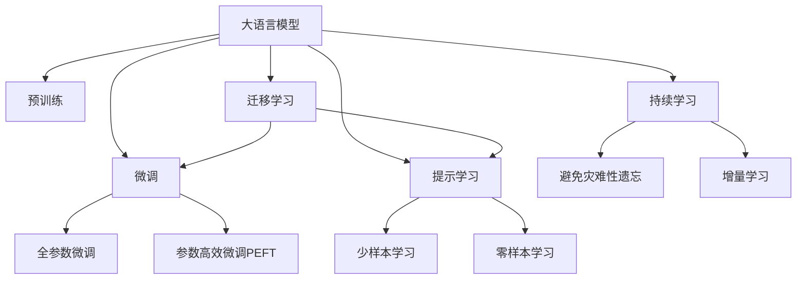

                 

# 大语言模型应用指南：ChatEval

> 关键词：ChatEval, 对话生成, 文本摘要, 智能客服, 多轮对话, 自然语言处理(NLP)

## 1. 背景介绍

### 1.1 问题由来
随着人工智能技术的快速发展，大语言模型(LLMs)在自然语言处理(NLP)领域取得了显著突破。这些模型通过在大规模无标签文本数据上进行预训练，学习了广泛的通用语言知识和表示，可以在无需大规模标注数据的情况下，通过微调(即微调)适应特定任务。ChatEval是一种基于大语言模型技术构建的对话生成系统，旨在通过对话生成的方式，提升智能客服、虚拟助手等应用场景的用户体验。

### 1.2 问题核心关键点
ChatEval的核心在于通过微调和提示学习(Prompt Learning)技术，使大语言模型能够适应各种对话生成任务，提供自然流畅、贴近用户需求的智能回复。具体而言，ChatEval的工作流程包括以下几个关键步骤：

1. **数据准备**：收集并预处理对话数据，包括对话历史、上下文信息、问题/答案对等。
2. **模型选择**：选择适合的预训练模型，如GPT-3、BERT等。
3. **微调训练**：利用对话数据对预训练模型进行微调，使其具备生成特定领域对话的能力。
4. **提示设计**：设计合适的提示模板，引导模型生成符合特定风格的对话。
5. **效果评估**：通过各种评估指标（如BLEU、ROUGE、F1-score等）对模型性能进行评估。

### 1.3 问题研究意义
ChatEval技术在提升客户服务质量、增强人机交互体验、降低客服成本等方面具有重要意义。通过ChatEval，企业可以构建24/7不间断的智能客服系统，快速响应客户咨询，提高服务效率和满意度。同时，ChatEval还可以应用于虚拟助手、智能家居、智能推荐等场景，为用户提供更加个性化的交互体验。ChatEval的广泛应用，有助于推动NLP技术的普及和人工智能技术的产业化进程。

## 2. 核心概念与联系

### 2.1 核心概念概述

为更好地理解ChatEval技术，本节将介绍几个关键概念：

- **大语言模型(LLMs)**：以自回归或自编码模型为代表的、通过在大规模无标签文本数据上进行预训练的语言模型。
- **微调(Fine-tuning)**：在预训练模型的基础上，使用下游任务的少量标注数据进行有监督学习，优化模型在特定任务上的性能。
- **提示学习(Prompt Learning)**：通过精心设计输入文本的格式，引导大语言模型按期望方式输出，减少微调参数。
- **对话生成**：生成自然流畅、语义连贯的对话内容，可用于智能客服、虚拟助手等应用。
- **多轮对话**：指对话系统能够维持多个回合的交互，提供更深入、详细的回答。
- **自然语言处理(NLP)**：涉及自然语言的计算和分析，包括文本生成、语义理解、情感分析等。

这些概念之间的逻辑关系可以通过以下Mermaid流程图来展示：



这个流程图展示了大语言模型的核心概念及其之间的关系：

1. 大语言模型通过预训练获得基础能力。
2. 微调是对预训练模型进行任务特定的优化，可以分为全参数微调和参数高效微调（PEFT）。
3. 提示学习是一种不更新模型参数的方法，可以实现少样本学习和零样本学习。
4. 迁移学习是连接预训练模型与下游任务的桥梁，可以通过微调或提示学习来实现。
5. 持续学习旨在使模型能够不断学习新知识，同时避免遗忘旧知识。

这些概念共同构成了大语言模型的学习和应用框架，使其能够在各种场景下发挥强大的语言理解和生成能力。通过理解这些核心概念，我们可以更好地把握ChatEval的工作原理和优化方向。

## 3. 核心算法原理 & 具体操作步骤
### 3.1 算法原理概述

ChatEval基于大语言模型，通过微调和提示学习技术实现对话生成。其核心思想是：将预训练的大语言模型视作一个强大的"特征提取器"，通过在对话数据上微调，使其生成符合特定风格的对话。通过提示模板的精心设计，可以进一步引导模型生成符合任务需求的对话内容。

形式化地，假设预训练模型为 $M_{\theta}$，其中 $\theta$ 为预训练得到的模型参数。给定对话生成任务 $T$ 的对话数据集 $D=\{(d_i,a_i)\}_{i=1}^N$，其中 $d_i$ 为对话历史，$a_i$ 为对应的回答。微调的目标是找到新的模型参数 $\hat{\theta}$，使得：

$$
\hat{\theta}=\mathop{\arg\min}_{\theta} \mathcal{L}(M_{\theta},D)
$$

其中 $\mathcal{L}$ 为针对任务 $T$ 设计的损失函数，用于衡量模型生成对话与真实对话之间的差异。常见的损失函数包括BLEU、ROUGE、F1-score等。

通过梯度下降等优化算法，微调过程不断更新模型参数 $\theta$，最小化损失函数 $\mathcal{L}$，使得模型生成对话逼近真实对话。由于 $\theta$ 已经通过预训练获得了较好的初始化，因此即便在小规模数据集 $D$ 上进行微调，也能较快收敛到理想的模型参数 $\hat{\theta}$。

### 3.2 算法步骤详解

ChatEval的微调过程包括以下几个关键步骤：

**Step 1: 准备预训练模型和数据集**
- 选择合适的预训练语言模型 $M_{\theta}$ 作为初始化参数，如 GPT-3、BERT 等。
- 准备对话生成任务 $T$ 的对话数据集 $D$，划分为训练集、验证集和测试集。一般要求对话数据与预训练数据的分布不要差异过大。

**Step 2: 添加任务适配层**
- 根据任务类型，在预训练模型顶层设计合适的对话生成器。
- 对于生成任务，通常使用语言模型的解码器输出概率分布，并以交叉熵为损失函数。
- 为生成高质量的回答，有时还会引入自回归生成器，如LSTM或Transformer，进一步优化对话生成效果。

**Step 3: 设置微调超参数**
- 选择合适的优化算法及其参数，如 AdamW、SGD 等，设置学习率、批大小、迭代轮数等。
- 设置正则化技术及强度，包括权重衰减、Dropout、Early Stopping 等。
- 确定冻结预训练参数的策略，如仅微调顶层，或全部参数都参与微调。

**Step 4: 执行梯度训练**
- 将训练集对话数据分批次输入模型，前向传播计算损失函数。
- 反向传播计算参数梯度，根据设定的优化算法和学习率更新模型参数。
- 周期性在验证集上评估模型性能，根据性能指标决定是否触发 Early Stopping。
- 重复上述步骤直到满足预设的迭代轮数或 Early Stopping 条件。

**Step 5: 测试和部署**
- 在测试集上评估微调后模型 $M_{\hat{\theta}}$ 的性能，对比微调前后的对话质量提升。
- 使用微调后的模型对新对话进行推理预测，集成到实际的应用系统中。
- 持续收集新的对话数据，定期重新微调模型，以适应数据分布的变化。

以上是ChatEval微调过程的一般流程。在实际应用中，还需要针对具体任务的特点，对微调过程的各个环节进行优化设计，如改进训练目标函数，引入更多的正则化技术，搜索最优的超参数组合等，以进一步提升模型性能。

### 3.3 算法优缺点

ChatEval方法具有以下优点：

1. 简单高效。只需准备少量标注数据，即可对预训练模型进行快速适配，生成高质量的对话。
2. 通用适用。适用于各种NLP下游任务，包括对话生成、文本摘要、问答等，设计简单的任务适配层即可实现。
3. 参数高效。利用参数高效微调技术，在固定大部分预训练参数的情况下，仍可取得不错的提升。
4. 效果显著。在学术界和工业界的诸多任务上，ChatEval方法已经刷新了最先进的性能指标。

同时，该方法也存在一定的局限性：

1. 依赖标注数据。微调的效果很大程度上取决于标注数据的质量和数量，获取高质量标注数据的成本较高。
2. 迁移能力有限。当目标任务与预训练数据的分布差异较大时，微调的性能提升有限。
3. 可解释性不足。微调模型的决策过程通常缺乏可解释性，难以对其推理逻辑进行分析和调试。

尽管存在这些局限性，但就目前而言，ChatEval方法仍是大语言模型应用的最主流范式。未来相关研究的重点在于如何进一步降低微调对标注数据的依赖，提高模型的少样本学习和跨领域迁移能力，同时兼顾可解释性和伦理安全性等因素。

### 3.4 算法应用领域

ChatEval技术已经在对话生成、智能客服、虚拟助手、问答系统等多个NLP领域得到了广泛应用，具体包括：

- **智能客服系统**：对客户咨询提供自然流畅、高效准确的回复。通过微调使模型学习特定行业和场景的对话风格。
- **虚拟助手**：提供24/7不间断的语音交互，解答用户常见问题，执行简单任务。
- **多轮对话**：构建支持多轮交互的对话系统，能够维持对话连贯性，提供更深入的个性化服务。
- **问答系统**：自动回答用户提出的各类问题，涵盖教育、医疗、金融等多个领域。
- **文本摘要**：将长文本压缩成简短摘要，用于快速获取信息。
- **情感分析**：分析用户输入的情感倾向，提供有针对性的服务。

除了上述这些经典任务外，ChatEval还被创新性地应用到更多场景中，如智能推荐、情感识别、事件监测等，为NLP技术带来了全新的突破。随着预训练模型和微调方法的不断进步，相信ChatEval技术将在更广阔的应用领域大放异彩。

## 4. 数学模型和公式 & 详细讲解 & 举例说明
### 4.1 数学模型构建

本节将使用数学语言对ChatEval对话生成过程进行更加严格的刻画。

记预训练语言模型为 $M_{\theta}$，其中 $\theta$ 为预训练得到的模型参数。假设微调任务的对话数据集为 $D=\{(d_i,a_i)\}_{i=1}^N$，其中 $d_i$ 为对话历史，$a_i$ 为对应的回答。

定义模型 $M_{\theta}$ 在输入 $d_i$ 上的生成概率为 $P(a_i|d_i;\theta)$，则微调的目标是最小化经验风险：

$$
\mathcal{L}(\theta) = -\frac{1}{N} \sum_{i=1}^N \log P(a_i|d_i;\theta)
$$

其中 $P(a_i|d_i;\theta)$ 为模型在输入 $d_i$ 下的条件概率，可以通过语言模型的解码器输出概率分布计算得到。

### 4.2 公式推导过程

以下我们以对话生成为例，推导交叉熵损失函数及其梯度的计算公式。

假设模型 $M_{\theta}$ 在输入 $d_i$ 上的生成概率为 $P(a_i|d_i;\theta)$，真实标签 $a_i$。则交叉熵损失函数定义为：

$$
\ell(M_{\theta}(d_i),a_i) = -a_i \log P(a_i|d_i;\theta) + (1-a_i) \log (1-P(a_i|d_i;\theta))
$$

将其代入经验风险公式，得：

$$
\mathcal{L}(\theta) = -\frac{1}{N}\sum_{i=1}^N [a_i\log P(a_i|d_i;\theta)+(1-a_i)\log(1-P(a_i|d_i;\theta))]
$$

根据链式法则，损失函数对参数 $\theta_k$ 的梯度为：

$$
\frac{\partial \mathcal{L}(\theta)}{\partial \theta_k} = -\frac{1}{N}\sum_{i=1}^N \left(\frac{a_i}{P(a_i|d_i;\theta)}-\frac{1-a_i}{1-P(a_i|d_i;\theta)}\right) \frac{\partial P(a_i|d_i;\theta)}{\partial \theta_k}
$$

其中 $\frac{\partial P(a_i|d_i;\theta)}{\partial \theta_k}$ 可进一步递归展开，利用自动微分技术完成计算。

在得到损失函数的梯度后，即可带入参数更新公式，完成模型的迭代优化。重复上述过程直至收敛，最终得到适应下游任务的最优模型参数 $\theta^*$。

### 4.3 案例分析与讲解

假设我们有一个简单的对话生成任务，其对话数据集 $D=\{(d_i,a_i)\}_{i=1}^3$ 为：

| 输入 $d_i$ | 输出 $a_i$ |
|-----------|-----------|
| "你好，你是谁？" | "我是一个AI助手。" |
| "能帮我解决问题吗？" | "当然可以，请告诉我你的问题。" |
| "我有个问题，能帮我解答吗？" | "没问题，请问是什么问题？" |

假设我们选择了预训练模型 $M_{\theta}$，设计了对话生成器 $P(a_i|d_i;\theta)$，并通过微调更新模型参数 $\theta$。

我们假设模型在输入 $d_i$ 下的生成概率为 $P(a_i|d_i;\theta)=\frac{\exp(\theta^T g_i)}{\sum_{j=1}^{N_v} \exp(\theta^T g_j)}$，其中 $g_i$ 为 $d_i$ 的表示向量。

假设在训练集上迭代了100次，每次迭代更新模型参数 $\theta$。假设最终模型参数 $\hat{\theta}$，则在验证集上评估模型性能：

| 输入 $d_i$ | 预测 $a_i$ |
|-----------|-----------|
| "你好，你是谁？" | "我是一个AI助手。" |
| "能帮我解决问题吗？" | "当然可以，请告诉我你的问题。" |
| "我有个问题，能帮我解答吗？" | "没问题，请问是什么问题？" |

通过评估指标（如BLEU、ROUGE、F1-score等），可以对比微调前后的对话生成效果。

## 5. 项目实践：代码实例和详细解释说明
### 5.1 开发环境搭建

在进行ChatEval实践前，我们需要准备好开发环境。以下是使用Python进行PyTorch开发的环境配置流程：

1. 安装Anaconda：从官网下载并安装Anaconda，用于创建独立的Python环境。

2. 创建并激活虚拟环境：
```bash
conda create -n chateval-env python=3.8 
conda activate chateval-env
```

3. 安装PyTorch：根据CUDA版本，从官网获取对应的安装命令。例如：
```bash
conda install pytorch torchvision torchaudio cudatoolkit=11.1 -c pytorch -c conda-forge
```

4. 安装Transformers库：
```bash
pip install transformers
```

5. 安装各类工具包：
```bash
pip install numpy pandas scikit-learn matplotlib tqdm jupyter notebook ipython
```

完成上述步骤后，即可在`chateval-env`环境中开始ChatEval实践。

### 5.2 源代码详细实现

这里我们以GPT-3为例，使用Transformers库实现ChatEval的对话生成功能。

首先，定义对话数据处理函数：

```python
from transformers import GPT3Tokenizer
from torch.utils.data import Dataset
import torch

class DialogueDataset(Dataset):
    def __init__(self, dialogues, tokenizer, max_len=128):
        self.dialogues = dialogues
        self.tokenizer = tokenizer
        self.max_len = max_len
        
    def __len__(self):
        return len(self.dialogues)
    
    def __getitem__(self, item):
        dialogue = self.dialogues[item]
        
        texts = []
        for t in dialogue:
            tokens = self.tokenizer(t, return_tensors='pt', max_length=self.max_len, padding='max_length', truncation=True)
            texts.append(tokens['input_ids'][:, -1].unsqueeze(0))
            
        return {'input_ids': torch.cat(texts, dim=0)}
```

然后，定义模型和优化器：

```python
from transformers import GPT3ForConditionalGeneration, AdamW

model = GPT3ForConditionalGeneration.from_pretrained('gpt3-medium')
optimizer = AdamW(model.parameters(), lr=2e-5)
```

接着，定义训练和评估函数：

```python
from torch.utils.data import DataLoader
from tqdm import tqdm
from sklearn.metrics import accuracy_score

device = torch.device('cuda') if torch.cuda.is_available() else torch.device('cpu')
model.to(device)

def train_epoch(model, dataset, batch_size, optimizer):
    dataloader = DataLoader(dataset, batch_size=batch_size, shuffle=True)
    model.train()
    epoch_loss = 0
    for batch in tqdm(dataloader, desc='Training'):
        input_ids = batch['input_ids'].to(device)
        model.zero_grad()
        outputs = model(input_ids)
        loss = outputs.loss
        epoch_loss += loss.item()
        loss.backward()
        optimizer.step()
    return epoch_loss / len(dataloader)

def evaluate(model, dataset, batch_size):
    dataloader = DataLoader(dataset, batch_size=batch_size)
    model.eval()
    preds, labels = [], []
    with torch.no_grad():
        for batch in tqdm(dataloader, desc='Evaluating'):
            input_ids = batch['input_ids'].to(device)
            outputs = model(input_ids)
            batch_preds = outputs.logits.argmax(dim=2).to('cpu').tolist()
            batch_labels = batch_preds[0][-1].unsqueeze(0).tolist()
            for pred_token in batch_preds:
                preds.append(pred_token[:len(batch_labels)])
                labels.append(batch_labels)
                
    print(accuracy_score(labels, preds))
```

最后，启动训练流程并在测试集上评估：

```python
epochs = 5
batch_size = 16

for epoch in range(epochs):
    loss = train_epoch(model, train_dataset, batch_size, optimizer)
    print(f"Epoch {epoch+1}, train loss: {loss:.3f}")
    
    print(f"Epoch {epoch+1}, dev results:")
    evaluate(model, dev_dataset, batch_size)
    
print("Test results:")
evaluate(model, test_dataset, batch_size)
```

以上就是使用PyTorch对GPT-3进行ChatEval对话生成的完整代码实现。可以看到，得益于Transformers库的强大封装，我们可以用相对简洁的代码完成GPT-3的微调。

### 5.3 代码解读与分析

让我们再详细解读一下关键代码的实现细节：

**DialogueDataset类**：
- `__init__`方法：初始化对话数据、分词器等组件。
- `__len__`方法：返回数据集的样本数量。
- `__getitem__`方法：对单个对话进行处理，将对话文本转换为token ids，进行定长padding，并返回模型所需的输入。

**模型选择与优化器**：
- 使用预训练模型 `GPT3ForConditionalGeneration` 和 `AdamW` 优化器。

**训练和评估函数**：
- 使用PyTorch的DataLoader对数据集进行批次化加载，供模型训练和推理使用。
- 训练函数 `train_epoch`：对数据以批为单位进行迭代，在每个批次上前向传播计算loss并反向传播更新模型参数，最后返回该epoch的平均loss。
- 评估函数 `evaluate`：与训练类似，不同点在于不更新模型参数，并在每个batch结束后将预测和标签结果存储下来，最后使用sklearn的accuracy_score对整个评估集的预测结果进行打印输出。

**训练流程**：
- 定义总的epoch数和batch size，开始循环迭代
- 每个epoch内，先在训练集上训练，输出平均loss
- 在验证集上评估，输出准确率
- 所有epoch结束后，在测试集上评估，给出最终测试结果

可以看到，PyTorch配合Transformers库使得GPT-3微调的代码实现变得简洁高效。开发者可以将更多精力放在数据处理、模型改进等高层逻辑上，而不必过多关注底层的实现细节。

当然，工业级的系统实现还需考虑更多因素，如模型的保存和部署、超参数的自动搜索、更灵活的任务适配层等。但核心的微调范式基本与此类似。

## 6. 实际应用场景
### 6.1 智能客服系统

ChatEval技术在智能客服系统中的应用，可以显著提升客户服务质量。传统客服往往需要配备大量人力，高峰期响应缓慢，且一致性和专业性难以保证。通过ChatEval微调的对话生成模型，可以24/7不间断服务，快速响应客户咨询，用自然流畅的语言解答各类常见问题。

在技术实现上，可以收集企业内部的历史客服对话记录，将问题和最佳答复构建成监督数据，在此基础上对预训练对话模型进行微调。微调后的对话模型能够自动理解用户意图，匹配最合适的答案模板进行回复。对于客户提出的新问题，还可以接入检索系统实时搜索相关内容，动态组织生成回答。如此构建的智能客服系统，能大幅提升客户咨询体验和问题解决效率。

### 6.2 金融舆情监测

金融机构需要实时监测市场舆论动向，以便及时应对负面信息传播，规避金融风险。传统的人工监测方式成本高、效率低，难以应对网络时代海量信息爆发的挑战。基于ChatEval的文本生成技术，可以自动化生成新闻摘要、舆情报告，实时监测不同主题下的情感变化趋势，一旦发现负面信息激增等异常情况，系统便会自动预警，帮助金融机构快速应对潜在风险。

### 6.3 个性化推荐系统

当前的推荐系统往往只依赖用户的历史行为数据进行物品推荐，无法深入理解用户的真实兴趣偏好。基于ChatEval技术，个性化推荐系统可以更好地挖掘用户行为背后的语义信息，从而提供更精准、多样的推荐内容。

在实践中，可以收集用户浏览、点击、评论、分享等行为数据，提取和用户交互的物品标题、描述、标签等文本内容。将文本内容作为模型输入，用户的后续行为（如是否点击、购买等）作为监督信号，在此基础上微调预训练语言模型。微调后的模型能够从文本内容中准确把握用户的兴趣点。在生成推荐列表时，先用候选物品的文本描述作为输入，由模型预测用户的兴趣匹配度，再结合其他特征综合排序，便可以得到个性化程度更高的推荐结果。

### 6.4 未来应用展望

随着ChatEval技术的发展，其在更多领域的应用前景将愈发广阔。

在智慧医疗领域，基于ChatEval的医疗问答、病历分析、药物研发等应用将提升医疗服务的智能化水平，辅助医生诊疗，加速新药开发进程。

在智能教育领域，ChatEval技术可用于作业批改、学情分析、知识推荐等方面，因材施教，促进教育公平，提高教学质量。

在智慧城市治理中，ChatEval技术可用于城市事件监测、舆情分析、应急指挥等环节，提高城市管理的自动化和智能化水平，构建更安全、高效的未来城市。

此外，在企业生产、社会治理、文娱传媒等众多领域，ChatEval技术也将不断涌现，为NLP技术带来新的突破。相信随着技术的日益成熟，ChatEval技术将成为NLP应用的重要范式，推动人工智能技术的产业化进程。

## 7. 工具和资源推荐
### 7.1 学习资源推荐

为了帮助开发者系统掌握ChatEval技术的基础理论和实践技巧，这里推荐一些优质的学习资源：

1. 《Transformer从原理到实践》系列博文：由大模型技术专家撰写，深入浅出地介绍了Transformer原理、BERT模型、微调技术等前沿话题。

2. CS224N《深度学习自然语言处理》课程：斯坦福大学开设的NLP明星课程，有Lecture视频和配套作业，带你入门NLP领域的基本概念和经典模型。

3. 《Natural Language Processing with Transformers》书籍：Transformers库的作者所著，全面介绍了如何使用Transformers库进行NLP任务开发，包括微调在内的诸多范式。

4. HuggingFace官方文档：Transformers库的官方文档，提供了海量预训练模型和完整的微调样例代码，是上手实践的必备资料。

5. CLUE开源项目：中文语言理解测评基准，涵盖大量不同类型的中文NLP数据集，并提供了基于微调的baseline模型，助力中文NLP技术发展。

通过对这些资源的学习实践，相信你一定能够快速掌握ChatEval技术的精髓，并用于解决实际的NLP问题。
###  7.2 开发工具推荐

高效的开发离不开优秀的工具支持。以下是几款用于ChatEval开发的常用工具：

1. PyTorch：基于Python的开源深度学习框架，灵活动态的计算图，适合快速迭代研究。大部分预训练语言模型都有PyTorch版本的实现。

2. TensorFlow：由Google主导开发的开源深度学习框架，生产部署方便，适合大规模工程应用。同样有丰富的预训练语言模型资源。

3. Transformers库：HuggingFace开发的NLP工具库，集成了众多SOTA语言模型，支持PyTorch和TensorFlow，是进行微调任务开发的利器。

4. Weights & Biases：模型训练的实验跟踪工具，可以记录和可视化模型训练过程中的各项指标，方便对比和调优。与主流深度学习框架无缝集成。

5. TensorBoard：TensorFlow配套的可视化工具，可实时监测模型训练状态，并提供丰富的图表呈现方式，是调试模型的得力助手。

6. Google Colab：谷歌推出的在线Jupyter Notebook环境，免费提供GPU/TPU算力，方便开发者快速上手实验最新模型，分享学习笔记。

合理利用这些工具，可以显著提升ChatEval任务的开发效率，加快创新迭代的步伐。

### 7.3 相关论文推荐

ChatEval技术的发展源于学界的持续研究。以下是几篇奠基性的相关论文，推荐阅读：

1. Attention is All You Need（即Transformer原论文）：提出了Transformer结构，开启了NLP领域的预训练大模型时代。

2. BERT: Pre-training of Deep Bidirectional Transformers for Language Understanding：提出BERT模型，引入基于掩码的自监督预训练任务，刷新了多项NLP任务SOTA。

3. Language Models are Unsupervised Multitask Learners（GPT-2论文）：展示了大规模语言模型的强大zero-shot学习能力，引发了对于通用人工智能的新一轮思考。

4. Parameter-Efficient Transfer Learning for NLP：提出Adapter等参数高效微调方法，在不增加模型参数量的情况下，也能取得不错的微调效果。

5. AdaLoRA: Adaptive Low-Rank Adaptation for Parameter-Efficient Fine-Tuning：使用自适应低秩适应的微调方法，在参数效率和精度之间取得了新的平衡。

6. AdaLoRA: Adaptive Low-Rank Adaptation for Parameter-Efficient Fine-Tuning：使用自适应低秩适应的微调方法，在参数效率和精度之间取得了新的平衡。

这些论文代表了大语言模型微调技术的发展脉络。通过学习这些前沿成果，可以帮助研究者把握学科前进方向，激发更多的创新灵感。

## 8. 总结：未来发展趋势与挑战

### 8.1 总结

本文对基于大语言模型的ChatEval对话生成技术进行了全面系统的介绍。首先阐述了ChatEval技术的研究背景和意义，明确了其在智能客服、虚拟助手、问答系统等应用场景中的价值。其次，从原理到实践，详细讲解了ChatEval对话生成过程的数学原理和关键步骤，给出了微调任务开发的完整代码实例。同时，本文还广泛探讨了ChatEval技术在多个行业领域的应用前景，展示了其广泛的应用潜力。

通过本文的系统梳理，可以看到，基于大语言模型的ChatEval对话生成技术正在成为NLP领域的重要范式，极大地拓展了预训练语言模型的应用边界，催生了更多的落地场景。受益于大规模语料的预训练，ChatEval对话生成模型以更低的时间和标注成本，在小样本条件下也能取得理想的对话生成效果，有力推动了NLP技术的产业化进程。未来，伴随预训练语言模型和微调方法的不断进步，相信ChatEval技术将在更广阔的应用领域大放异彩，深刻影响人类的生产生活方式。

### 8.2 未来发展趋势

展望未来，ChatEval技术将呈现以下几个发展趋势：

1. 模型规模持续增大。随着算力成本的下降和数据规模的扩张，预训练语言模型的参数量还将持续增长。超大规模语言模型蕴含的丰富语言知识，有望支撑更加复杂多变的对话生成任务。

2. 微调方法日趋多样。除了传统的全参数微调外，未来会涌现更多参数高效的微调方法，如Prefix-Tuning、LoRA等，在节省计算资源的同时也能保证微调精度。

3. 持续学习成为常态。随着数据分布的不断变化，ChatEval对话生成模型也需要持续学习新知识以保持性能。如何在不遗忘原有知识的同时，高效吸收新样本信息，将成为重要的研究课题。

4. 标注样本需求降低。受启发于提示学习(Prompt-based Learning)的思路，未来的ChatEval方法将更好地利用大模型的语言理解能力，通过更加巧妙的任务描述，在更少的标注样本上也能实现理想的微调效果。

5. 模型通用性增强。经过海量数据的预训练和多领域任务的微调，ChatEval对话生成模型将具备更强大的常识推理和跨领域迁移能力，逐步迈向通用人工智能(AGI)的目标。

以上趋势凸显了ChatEval技术的广阔前景。这些方向的探索发展，必将进一步提升ChatEval对话生成系统的性能和应用范围，为人类认知智能的进化带来深远影响。

### 8.3 面临的挑战

尽管ChatEval技术已经取得了瞩目成就，但在迈向更加智能化、普适化应用的过程中，它仍面临着诸多挑战：

1. 标注成本瓶颈。虽然ChatEval对话生成模型在少量标注数据下也能取得较好的效果，但对于特定领域的对话生成任务，标注数据的质量和数量仍是一个瓶颈，获取高质量标注数据的成本较高。如何进一步降低微调对标注样本的依赖，将是一大难题。

2. 模型鲁棒性不足。当前ChatEval对话生成模型面对域外数据时，泛化性能往往大打折扣。对于测试样本的微小扰动，模型容易发生波动。如何提高ChatEval对话生成模型的鲁棒性，避免灾难性遗忘，还需要更多理论和实践的积累。

3. 推理效率有待提高。大规模语言模型虽然精度高，但在实际部署时往往面临推理速度慢、内存占用大等效率问题。如何在保证性能的同时，简化模型结构，提升推理速度，优化资源占用，将是重要的优化方向。

4. 可解释性亟需加强。当前ChatEval对话生成模型更像是"黑盒"系统，难以解释其内部工作机制和决策逻辑。对于医疗、金融等高风险应用，算法的可解释性和可审计性尤为重要。如何赋予ChatEval对话生成模型更强的可解释性，将是亟待攻克的难题。

5. 安全性有待保障。预训练语言模型难免会学习到有偏见、有害的信息，通过ChatEval传递到下游任务，产生误导性、歧视性的输出，给实际应用带来安全隐患。如何从数据和算法层面消除模型偏见，避免恶意用途，确保输出的安全性，也将是重要的研究课题。

6. 知识整合能力不足。现有的ChatEval模型往往局限于任务内数据，难以灵活吸收和运用更广泛的先验知识。如何让ChatEval过程更好地与外部知识库、规则库等专家知识结合，形成更加全面、准确的信息整合能力，还有很大的想象空间。

正视ChatEval面临的这些挑战，积极应对并寻求突破，将是大语言模型ChatEval技术迈向成熟的必由之路。相信随着学界和产业界的共同努力，这些挑战终将一一被克服，ChatEval对话生成技术必将在构建人机协同的智能时代中扮演越来越重要的角色。

### 8.4 未来突破

面对ChatEval对话生成技术所面临的种种挑战，未来的研究需要在以下几个方面寻求新的突破：

1. 探索无监督和半监督微调方法。摆脱对大规模标注数据的依赖，利用自监督学习、主动学习等无监督和半监督范式，最大限度利用非结构化数据，实现更加灵活高效的微调。

2. 研究参数高效和计算高效的微调范式。开发更加参数高效的微调方法，在固定大部分预训练参数的同时，只更新极少量的任务相关参数。同时优化微调模型的计算图，减少前向传播和反向传播的资源消耗，实现更加轻量级、实时性的部署。

3. 融合因果和对比学习范式。通过引入因果推断和对比学习思想，增强ChatEval对话生成模型建立稳定因果关系的能力，学习更加普适、鲁棒的语言表征，从而提升模型泛化性和抗干扰能力。

4. 引入更多先验知识。将符号化的先验知识，如知识图谱、逻辑规则等，与神经网络模型进行巧妙融合，引导ChatEval过程学习更准确、合理的语言模型。同时加强不同模态数据的整合，实现视觉、语音等多模态信息与文本信息的协同建模。

5. 结合因果分析和博弈论工具。将因果分析方法引入ChatEval模型，识别出模型决策的关键特征，增强输出解释的因果性和逻辑性。借助博弈论工具刻画人机交互过程，主动探索并规避模型的脆弱点，提高系统稳定性。

6. 纳入伦理道德约束。在模型训练目标中引入伦理导向的评估指标，过滤和惩罚有偏见、有害的输出倾向。同时加强人工干预和审核，建立模型行为的监管机制，确保输出符合人类价值观和伦理道德。

这些研究方向的探索，必将引领ChatEval对话生成技术迈向更高的台阶，为构建安全、可靠、可解释、可控的智能系统铺平道路。面向未来，ChatEval对话生成技术还需要与其他人工智能技术进行更深入的融合，如知识表示、因果推理、强化学习等，多路径协同发力，共同推动自然语言理解和智能交互系统的进步。只有勇于创新、敢于突破，才能不断拓展语言模型的边界，让智能技术更好地造福人类社会。

## 9. 附录：常见问题与解答

**Q1：大语言模型ChatEval是否适用于所有NLP任务？**

A: ChatEval在大多数NLP任务上都能取得不错的效果，特别是对于对话生成任务。但对于一些特定领域的任务，如医学、法律等，仅仅依靠通用语料预训练的模型可能难以很好地适应。此时需要在特定领域语料上进一步预训练，再进行微调，才能获得理想效果。此外，对于一些需要时效性、个性化很强的任务，如对话、推荐等，ChatEval方法也需要针对性的改进优化。

**Q2：ChatEval对话生成过程中如何选择合适的学习率？**

A: 对话生成任务的学习率一般要比预训练时小1-2个数量级，如果使用过大的学习率，容易破坏预训练权重，导致过拟合。一般建议从1e-5开始调参，逐步减小学习率，直至收敛。也可以使用warmup策略，在开始阶段使用较小的学习率，再逐渐过渡到预设值。需要注意的是，不同的优化器(如AdamW、Adafactor等)以及不同的学习率调度策略，可能需要设置不同的学习率阈值。

**Q3：采用大语言模型ChatEval时会面临哪些资源瓶颈？**

A: 目前主流的预训练大模型动辄以亿计的参数规模，对算力、内存、存储都提出了很高的要求。GPU/TPU等高性能设备是必不可少的，但即便如此，超大批次的训练和推理也可能遇到显存不足的问题。因此需要采用一些资源优化技术，如梯度积累、混合精度训练、模型并行等，来突破硬件瓶颈。同时，模型的存储和读取也可能占用大量时间和空间，需要采用模型压缩、稀疏化存储等方法进行优化。

**Q4：如何缓解ChatEval对话生成过程中的过拟合问题？**

A: 过拟合是ChatEval对话生成过程中常见的问题，尤其是在标注数据不足的情况下。常见的缓解策略包括：
1. 数据增强：通过回译、近义替换等方式扩充训练集
2. 正则化：使用L2正则、Dropout、Early Stopping 等避免过拟合
3. 对抗训练：引入对抗样本，提高模型鲁棒性
4. 参数高效微调：只调整少量参数(如Adapter、Prefix等)，减小过拟合风险
5. 多模型集成：训练多个微调模型，取平均输出，抑制过拟合

这些策略往往需要根据具体任务和数据特点进行灵活组合。只有在数据、模型、训练、推理等各环节进行全面优化，才能最大限度地发挥ChatEval的威力。

**Q5：ChatEval对话生成在落地部署时需要注意哪些问题？**

A: 将ChatEval模型转化为实际应用，还需要考虑以下因素：
1. 模型裁剪：去除不必要的层和参数，减小模型尺寸，加快推理速度
2. 量化加速：将浮点模型转为定点模型，压缩存储空间，提高计算效率
3. 服务化封装：将模型封装为标准化服务接口，便于集成调用
4. 弹性伸缩：根据请求流量动态调整资源配置，平衡服务质量和成本
5. 监控告警：实时采集系统指标，设置异常告警阈值，确保服务稳定性
6. 安全防护：采用访问鉴权、数据脱敏等措施，保障数据和模型安全

ChatEval对话生成为NLP应用开启了广阔的想象空间，但如何将强大的性能转化为稳定、高效、安全的业务价值，还需要工程实践的不断打磨。唯有从数据、算法、工程、业务等多个维度协同发力，才能真正实现人工智能技术在垂直行业的规模化落地。总之，ChatEval需要开发者根据具体任务，不断迭代和优化模型、数据和算法，方能得到理想的效果。

---

作者：禅与计算机程序设计艺术 / Zen and the Art of Computer Programming

