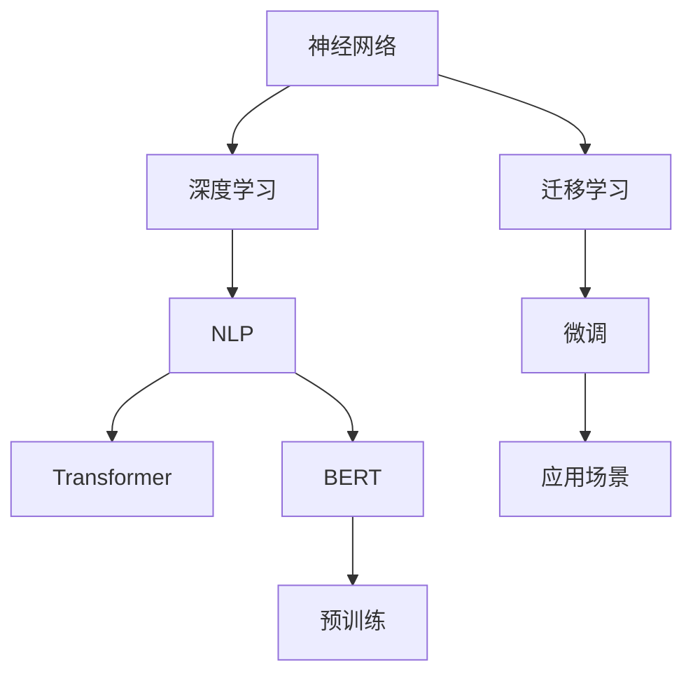

                 

# 大语言模型应用指南：什么是神经网络

> 关键词：大语言模型,神经网络,深度学习,自然语言处理(NLP),Transformer,BERT,预训练,迁移学习,应用场景

## 1. 背景介绍

### 1.1 问题由来

近年来，深度学习技术的飞速发展推动了大规模语言模型（Large Language Models, LLMs）在自然语言处理（NLP）领域的广泛应用。这些模型如GPT-3、BERT等，通过在海量无标签文本数据上预训练，学习到了丰富的语言知识和常识，具备强大的语言理解和生成能力。然而，这些大模型通常需要海量的标注数据进行微调（Fine-Tuning），以适应特定的下游任务。因此，理解神经网络这一核心概念，对于掌握和应用大语言模型至关重要。

### 1.2 问题核心关键点

大语言模型应用的核心问题在于如何理解神经网络，以及如何在神经网络框架下进行模型的预训练和微调。神经网络是一种强有力的计算模型，通过模拟人脑神经元之间的连接和信息传递，能够处理复杂的数据和非线性关系，是现代深度学习模型的基础。本文将详细介绍神经网络的基本概念、算法原理和实际操作，帮助读者深入理解大语言模型的核心技术。

### 1.3 问题研究意义

研究神经网络及其在大语言模型中的应用，有助于：

- 掌握深度学习的基本原理和技术。
- 理解大语言模型的构建和微调机制。
- 提升在自然语言处理领域的实战能力。
- 推动NLP技术在更多行业的应用和落地。

## 2. 核心概念与联系

### 2.1 核心概念概述

- **神经网络**：由大量人工神经元组成的计算模型，通过前向传播和反向传播学习优化模型参数，用于处理复杂数据和执行复杂计算任务。
- **深度学习**：神经网络的一种，通过多层次的特征提取和抽象，实现更高级别的模式识别和预测。
- **自然语言处理（NLP）**：利用深度学习等技术，处理、理解和生成人类语言的技术领域。
- **Transformer**：一种基于注意力机制的神经网络结构，通过自注意力机制实现输入序列的编码解码，显著提升了神经网络处理序列数据的能力。
- **BERT（Bidirectional Encoder Representations from Transformers）**：一种预训练的语言模型，通过双向编码机制学习到丰富的语言表示，广泛应用于NLP任务。
- **预训练**：在无标签数据上训练神经网络，学习通用的语言表示。
- **迁移学习**：在预训练模型的基础上，通过微调适应特定任务，提升模型性能。
- **应用场景**：涵盖文本分类、命名实体识别、机器翻译、问答系统等众多NLP任务，以及智能客服、金融舆情、个性化推荐等实际业务应用。

这些核心概念之间的逻辑关系可以通过以下Mermaid流程图来展示：



这个流程图展示了大语言模型的核心概念及其之间的关系：

1. 神经网络是深度学习的基础。
2. 深度学习通过多层次特征提取，实现更复杂的任务处理。
3. NLP利用深度学习技术，处理、理解和生成语言。
4. Transformer是NLP任务中常用的神经网络结构。
5. BERT通过双向编码预训练，学习通用的语言表示。
6. 预训练模型通过迁移学习，在特定任务上进行微调，提升性能。
7. 微调模型被应用于各种实际应用场景，如智能客服、金融舆情、推荐系统等。

## 3. 核心算法原理 & 具体操作步骤
### 3.1 算法原理概述

神经网络通过多层次的计算单元（神经元）模拟人脑处理信息的方式，实现了复杂数据的特征提取和处理。深度学习则通过多层神经网络，逐步抽象出更高级别的特征表示，用于复杂的模式识别和预测任务。在大语言模型中，通常使用Transformer等神经网络结构，通过在大量无标签文本数据上进行预训练，学习到通用的语言表示，然后通过微调，使其适应特定下游任务。

### 3.2 算法步骤详解

大语言模型的训练过程分为预训练和微调两个阶段。以下详细介绍这两个阶段的操作流程：

#### 预训练阶段
1. **数据准备**：收集大规模无标签文本数据，例如维基百科、新闻网站、社交媒体等。
2. **构建模型**：选择合适的网络结构，如Transformer，设置神经元的数量、激活函数、优化器等超参数。
3. **训练过程**：将数据输入模型进行前向传播，计算损失函数，通过反向传播更新模型参数。
4. **模型评估**：在验证集上评估模型的性能，监控训练过程中的各项指标。
5. **模型保存**：保存训练好的模型，供后续微调使用。

#### 微调阶段
1. **数据准备**：收集下游任务的标注数据，准备训练集、验证集和测试集。
2. **模型加载**：加载预训练模型，保留其大部分权重，只微调顶层。
3. **任务适配**：设计合适的任务适配器，将预训练模型输出转换为任务特定的输出。
4. **模型训练**：在标注数据上训练微调后的模型，设置合适的超参数。
5. **模型评估**：在验证集上评估模型性能，监控训练过程中的各项指标。
6. **模型测试**：在测试集上评估微调后的模型性能，对比微调前后效果。

### 3.3 算法优缺点

神经网络及其在大语言模型中的应用具有以下优点：

- **强大的表示能力**：通过多层特征提取，能够学习到复杂的语言表示。
- **自适应性强**：通过微调，神经网络能够适应特定任务，提升模型性能。
- **泛化能力强**：预训练模型在大规模数据上学习到通用的语言表示，对新数据的泛化能力强。

同时，神经网络及其在大语言模型中的应用也存在以下局限：

- **计算资源需求高**：大规模神经网络需要大量的计算资源和存储空间。
- **过拟合风险高**：如果标注数据不足，容易发生过拟合。
- **解释性不足**：神经网络模型的决策过程难以解释，缺乏可解释性。

尽管存在这些局限，神经网络及其在大语言模型中的应用仍然是大规模数据处理和复杂任务处理的重要工具。

### 3.4 算法应用领域

神经网络及其在大语言模型中的应用广泛，涵盖以下领域：

- **文本分类**：如情感分析、主题分类等。通过微调，神经网络模型能够学习文本-标签映射。
- **命名实体识别**：识别文本中的人名、地名、机构名等特定实体。通过微调，神经网络模型能够掌握实体边界和类型。
- **机器翻译**：将源语言文本翻译成目标语言。通过微调，神经网络模型能够学习语言-语言映射。
- **问答系统**：对自然语言问题给出答案。将问题-答案对作为微调数据，训练模型学习匹配答案。
- **文本摘要**：将长文本压缩成简短摘要。通过微调，神经网络模型能够学习抓取要点。
- **对话系统**：使机器能够与人自然对话。将多轮对话历史作为上下文，微调模型进行回复生成。

这些领域的应用展示了神经网络及其在大语言模型中的强大潜力。

## 4. 数学模型和公式 & 详细讲解 & 举例说明

### 4.1 数学模型构建

大语言模型的数学模型通常基于神经网络构建，以下详细介绍其中的数学模型和公式：

**神经网络模型**：
神经网络由多个神经元组成，每个神经元接收输入，通过加权和激活函数计算输出。

$$
y = \sigma(Wx + b)
$$

其中，$x$为输入向量，$W$为权重矩阵，$b$为偏置向量，$\sigma$为激活函数。

**深度学习模型**：
深度学习通过多层次神经网络实现复杂的特征提取和表示学习。

$$
y = \sigma_1(\sigma_2(\sigma_3(...\sigma_n(x)...)))
$$

其中，$\sigma_i$为第$i$层的激活函数。

**Transformer模型**：
Transformer通过自注意力机制实现输入序列的编码和解码，学习到更丰富的语言表示。

$$
Q = KV^T
$$

其中，$Q$为查询矩阵，$K$和$V$分别为键和值矩阵。

**BERT模型**：
BERT通过双向编码机制学习到丰富的语言表示，广泛应用于NLP任务。

$$
L = [CLS] + \sum_{i=1}^{n}{embedding(v_i)}
$$

其中，$L$为整个输入序列的表示，$embedding(v_i)$为单词$i$的表示。

### 4.2 公式推导过程

以下详细介绍神经网络中常用的激活函数和优化算法的数学推导：

**激活函数**：
激活函数是神经网络中最重要的组成部分之一，常用的激活函数包括Sigmoid、ReLU等。

$$
Sigmoid(x) = \frac{1}{1 + e^{-x}}
$$

$$
ReLU(x) = \max(0, x)
$$

**优化算法**：
常用的优化算法包括梯度下降（GD）、Adam等。

$$
\theta_{t+1} = \theta_{t} - \eta \nabla_{\theta}L(\theta_t)
$$

其中，$\theta$为模型参数，$\eta$为学习率，$\nabla_{\theta}L(\theta_t)$为损失函数对模型参数的梯度。

**Transformer中自注意力机制**：
自注意力机制是Transformer的核心组成部分，通过查询、键和值矩阵的计算，实现输入序列的编码和解码。

$$
a_{ij} = \frac{e^{Q_iK_j^T}}{\sum_{k=1}^{n}e^{Q_iK_k^T}}
$$

其中，$a_{ij}$为注意力权重，$Q_i$和$K_j$分别为查询和键矩阵。

### 4.3 案例分析与讲解

以下通过具体案例，详细分析神经网络在大语言模型中的应用：

**BERT模型的预训练**：
BERT通过在大量无标签文本数据上进行预训练，学习到通用的语言表示。其预训练任务包括掩码语言模型（Masked Language Model, MLM）和下一句预测（Next Sentence Prediction, NSP）。

1. **掩码语言模型**：从输入序列中随机掩盖一些单词，通过预测被掩盖的单词恢复原始序列，学习语言表示。
2. **下一句预测**：随机选择一对句子，预测其顺序，学习句子之间的关系。

**微调BERT模型进行文本分类**：
微调BERT模型进行文本分类任务，通过修改顶层分类器，适应特定任务的输出需求。

1. **数据准备**：准备文本分类任务的标注数据，划分训练集、验证集和测试集。
2. **模型加载**：加载预训练的BERT模型，保留其大部分权重。
3. **任务适配**：设计分类器，将BERT模型的输出转换为文本分类任务的预测。
4. **模型训练**：在标注数据上训练微调后的模型，设置合适的超参数。
5. **模型评估**：在验证集上评估模型性能，监控训练过程中的各项指标。
6. **模型测试**：在测试集上评估微调后的模型性能，对比微调前后效果。

## 5. 项目实践：代码实例和详细解释说明
### 5.1 开发环境搭建

在进行神经网络和大语言模型的实践前，我们需要准备好开发环境。以下是使用Python进行PyTorch开发的环境配置流程：

1. 安装Anaconda：从官网下载并安装Anaconda，用于创建独立的Python环境。

2. 创建并激活虚拟环境：
```bash
conda create -n pytorch-env python=3.8 
conda activate pytorch-env
```

3. 安装PyTorch：根据CUDA版本，从官网获取对应的安装命令。例如：
```bash
conda install pytorch torchvision torchaudio cudatoolkit=11.1 -c pytorch -c conda-forge
```

4. 安装TensorFlow：如果使用TensorFlow，请从官网下载并安装。

5. 安装各类工具包：
```bash
pip install numpy pandas scikit-learn matplotlib tqdm jupyter notebook ipython
```

完成上述步骤后，即可在`pytorch-env`环境中开始神经网络和语言模型的实践。

### 5.2 源代码详细实现

下面以BERT模型进行文本分类任务的微调为例，给出使用PyTorch进行微调的代码实现。

```python
import torch
import torch.nn as nn
import torch.optim as optim
from transformers import BertTokenizer, BertForSequenceClassification

# 数据准备
tokenizer = BertTokenizer.from_pretrained('bert-base-cased')
train_dataset = ...
val_dataset = ...
test_dataset = ...

# 模型构建
model = BertForSequenceClassification.from_pretrained('bert-base-cased', num_labels=num_labels)

# 定义损失函数
criterion = nn.CrossEntropyLoss()

# 定义优化器
optimizer = optim.Adam(model.parameters(), lr=1e-5)

# 训练过程
for epoch in range(num_epochs):
    model.train()
    for batch in train_loader:
        input_ids = batch['input_ids'].to(device)
        attention_mask = batch['attention_mask'].to(device)
        labels = batch['labels'].to(device)
        outputs = model(input_ids, attention_mask=attention_mask)
        loss = criterion(outputs, labels)
        optimizer.zero_grad()
        loss.backward()
        optimizer.step()
    
    model.eval()
    with torch.no_grad():
        eval_loss = 0
        eval_acc = 0
        for batch in val_loader:
            input_ids = batch['input_ids'].to(device)
            attention_mask = batch['attention_mask'].to(device)
            labels = batch['labels'].to(device)
            outputs = model(input_ids, attention_mask=attention_mask)
            loss = criterion(outputs, labels)
            eval_loss += loss.item()
            logits = outputs.logits
            log_probs = nn.functional.log_softmax(logits, dim=1)
            predicted_indices = torch.argmax(log_probs, dim=1)
            correct = (predicted_indices == labels).sum().item()
            eval_acc += correct / labels.size(0)
    
    print(f'Epoch {epoch+1}, Loss: {eval_loss/len(val_loader):.4f}, Acc: {eval_acc/len(val_loader):.4f}')
```

### 5.3 代码解读与分析

让我们再详细解读一下关键代码的实现细节：

**BERTForSequenceClassification**：
BERTForSequenceClassification类是BertForSequenceClassification类的子类，用于构建序列分类任务模型。

**BertTokenizer**：
BertTokenizer类用于处理BERT模型的输入，将文本转换为模型可以接受的token id。

**nn.CrossEntropyLoss**：
nn.CrossEntropyLoss类用于计算分类任务上的损失函数，即交叉熵损失。

**nn.functional.log_softmax**：
nn.functional.log_softmax函数用于计算softmax函数的log值，通常用于计算分类任务上的预测概率。

**with torch.no_grad()**：
with torch.no_grad()块用于禁用梯度计算，提高模型推理速度。

以上代码展示了使用PyTorch进行BERT模型微调的基本流程。通过调整模型结构、损失函数、优化器等超参数，可以在不同任务上实现高效的神经网络训练。

## 6. 实际应用场景
### 6.1 智能客服系统

基于大语言模型微调的对话技术，可以广泛应用于智能客服系统的构建。传统客服往往需要配备大量人力，高峰期响应缓慢，且一致性和专业性难以保证。而使用微调后的对话模型，可以7x24小时不间断服务，快速响应客户咨询，用自然流畅的语言解答各类常见问题。

在技术实现上，可以收集企业内部的历史客服对话记录，将问题和最佳答复构建成监督数据，在此基础上对预训练对话模型进行微调。微调后的对话模型能够自动理解用户意图，匹配最合适的答案模板进行回复。对于客户提出的新问题，还可以接入检索系统实时搜索相关内容，动态组织生成回答。如此构建的智能客服系统，能大幅提升客户咨询体验和问题解决效率。

### 6.2 金融舆情监测

金融机构需要实时监测市场舆论动向，以便及时应对负面信息传播，规避金融风险。传统的人工监测方式成本高、效率低，难以应对网络时代海量信息爆发的挑战。基于大语言模型微调的文本分类和情感分析技术，为金融舆情监测提供了新的解决方案。

具体而言，可以收集金融领域相关的新闻、报道、评论等文本数据，并对其进行主题标注和情感标注。在此基础上对预训练语言模型进行微调，使其能够自动判断文本属于何种主题，情感倾向是正面、中性还是负面。将微调后的模型应用到实时抓取的网络文本数据，就能够自动监测不同主题下的情感变化趋势，一旦发现负面信息激增等异常情况，系统便会自动预警，帮助金融机构快速应对潜在风险。

### 6.3 个性化推荐系统

当前的推荐系统往往只依赖用户的历史行为数据进行物品推荐，无法深入理解用户的真实兴趣偏好。基于大语言模型微调技术，个性化推荐系统可以更好地挖掘用户行为背后的语义信息，从而提供更精准、多样的推荐内容。

在实践中，可以收集用户浏览、点击、评论、分享等行为数据，提取和用户交互的物品标题、描述、标签等文本内容。将文本内容作为模型输入，用户的后续行为（如是否点击、购买等）作为监督信号，在此基础上微调预训练语言模型。微调后的模型能够从文本内容中准确把握用户的兴趣点。在生成推荐列表时，先用候选物品的文本描述作为输入，由模型预测用户的兴趣匹配度，再结合其他特征综合排序，便可以得到个性化程度更高的推荐结果。

### 6.4 未来应用展望

随着大语言模型和微调方法的不断发展，基于微调范式将在更多领域得到应用，为传统行业带来变革性影响。

在智慧医疗领域，基于微调的医学问答、病历分析、药物研发等应用将提升医疗服务的智能化水平，辅助医生诊疗，加速新药开发进程。

在智能教育领域，微调技术可应用于作业批改、学情分析、知识推荐等方面，因材施教，促进教育公平，提高教学质量。

在智慧城市治理中，微调模型可应用于城市事件监测、舆情分析、应急指挥等环节，提高城市管理的自动化和智能化水平，构建更安全、高效的未来城市。

此外，在企业生产、社会治理、文娱传媒等众多领域，基于大语言模型微调的人工智能应用也将不断涌现，为经济社会发展注入新的动力。相信随着技术的日益成熟，微调方法将成为人工智能落地应用的重要范式，推动人工智能技术在垂直行业的规模化落地。

## 7. 工具和资源推荐
### 7.1 学习资源推荐

为了帮助开发者系统掌握神经网络和大语言模型的理论基础和实践技巧，这里推荐一些优质的学习资源：

1. 《深度学习》书籍：Ian Goodfellow、Yoshua Bengio和Aaron Courville合著的经典教材，全面介绍了深度学习的基本原理和技术。
2. 《TensorFlow深度学习》课程：由Google主导开发的深度学习课程，涵盖了从基础到高级的各类知识，提供丰富的实践项目。
3. 《自然语言处理》课程：斯坦福大学开设的NLP明星课程，涵盖了NLP的基本概念和经典模型。
4. 《NeurIPS和ICML会议论文》：顶级深度学习会议上的最新研究成果，帮助读者了解前沿技术动态。
5. 《Transformers》书籍：HuggingFace的官方文档，全面介绍了Transformer的原理和实践方法，提供了丰富的代码样例。

通过对这些资源的学习实践，相信你一定能够快速掌握神经网络和语言模型的精髓，并用于解决实际的NLP问题。

### 7.2 开发工具推荐

高效的开发离不开优秀的工具支持。以下是几款用于神经网络和语言模型微调开发的常用工具：

1. PyTorch：基于Python的开源深度学习框架，灵活动态的计算图，适合快速迭代研究。
2. TensorFlow：由Google主导开发的开源深度学习框架，生产部署方便，适合大规模工程应用。
3. TensorBoard：TensorFlow配套的可视化工具，可实时监测模型训练状态，并提供丰富的图表呈现方式。
4. Weights & Biases：模型训练的实验跟踪工具，可以记录和可视化模型训练过程中的各项指标，方便对比和调优。
5. HuggingFace Transformers库：提供丰富的预训练语言模型和微调范式，是NLP任务的开发利器。

合理利用这些工具，可以显著提升神经网络和语言模型的开发效率，加快创新迭代的步伐。

### 7.3 相关论文推荐

神经网络和大语言模型的发展源于学界的持续研究。以下是几篇奠基性的相关论文，推荐阅读：

1. Neural Networks and Deep Learning（深度学习）：Ian Goodfellow等人著，全面介绍了深度学习的基本原理和技术。
2. Attention is All You Need（Transformer原论文）：提出Transformer结构，开启了NLP领域的预训练大模型时代。
3. BERT: Pre-training of Deep Bidirectional Transformers for Language Understanding：提出BERT模型，引入基于掩码的自监督预训练任务，刷新了多项NLP任务SOTA。
4. Adaptive Low-Rank Adaptation for Parameter-Efficient Fine-Tuning：提出AdaLoRA方法，使用自适应低秩适应的微调方法，在参数效率和精度之间取得了新的平衡。
5. Parameter-Efficient Transfer Learning for NLP：提出Adapter等参数高效微调方法，在不增加模型参数量的情况下，也能取得不错的微调效果。

这些论文代表了大语言模型微调技术的发展脉络。通过学习这些前沿成果，可以帮助研究者把握学科前进方向，激发更多的创新灵感。

## 8. 总结：未来发展趋势与挑战
### 8.1 总结

本文对神经网络及其在大语言模型中的应用进行了全面系统的介绍。首先阐述了神经网络的基本概念和算法原理，然后介绍了深度学习和大语言模型的构建和微调过程。通过具体的代码实例，展示了神经网络在大语言模型中的应用。最后，探讨了神经网络在大语言模型应用中的实际应用场景，以及未来的发展趋势和面临的挑战。

通过本文的系统梳理，可以看到，神经网络及其在大语言模型中的应用不仅是大规模数据处理和复杂任务处理的重要工具，也是现代NLP技术的基础。随着神经网络和大语言模型的不断演进，其在NLP领域的应用将更加广泛和深入，为经济社会发展注入新的动力。

### 8.2 未来发展趋势

展望未来，神经网络及其在大语言模型中的应用将呈现以下几个发展趋势：

1. 模型规模持续增大。随着算力成本的下降和数据规模的扩张，神经网络模型将持续增大，学习到更丰富、更复杂的语言表示。
2. 参数高效微调技术不断提升。未来将出现更多参数高效的微调方法，如AdaLoRA、Adapter等，在保证模型性能的同时，减少微调对计算资源的依赖。
3. 模型泛化能力增强。随着预训练模型的不断优化，神经网络模型将具备更强的泛化能力和跨领域迁移能力。
4. 多模态融合成为热点。未来的神经网络模型将更加注重跨模态信息的整合，如图像、语音、文本等信息的协同建模。
5. 模型解释性增强。未来将出现更多可解释性强的神经网络模型，帮助用户理解和调试模型行为。

这些趋势凸显了神经网络及其在大语言模型中的广阔前景。这些方向的探索发展，必将进一步提升神经网络和大语言模型在NLP领域的应用水平，为构建安全、可靠、可解释、可控的智能系统铺平道路。

### 8.3 面临的挑战

尽管神经网络及其在大语言模型中的应用取得了显著成果，但在迈向更加智能化、普适化应用的过程中，仍面临诸多挑战：

1. 数据质量和数量瓶颈。神经网络模型的训练和微调需要大量高质量的数据，而获取这些数据的过程往往耗时耗力。
2. 模型泛化能力不足。当前神经网络模型在特定领域的数据集上表现良好，但面对新数据或不同领域的数据时，泛化能力往往不足。
3. 计算资源需求高。大规模神经网络模型的训练和推理需要大量计算资源，对算力要求较高。
4. 可解释性不足。神经网络模型通常被认为是“黑盒”，难以解释其内部工作机制和决策逻辑。
5. 安全性有待保障。神经网络模型可能会学习到有害的偏见和信息，对模型的安全性提出了挑战。

这些挑战需要学术界和工业界共同努力，通过更多的研究和技术突破，才能进一步提升神经网络及其在大语言模型中的应用水平。

### 8.4 研究展望

未来，神经网络及其在大语言模型中的应用需要关注以下几个方面：

1. 无监督和半监督学习。研究无监督和半监督学习方法，降低对标注数据的需求，提高模型的泛化能力。
2. 参数高效微调技术。开发更高效的参数高效微调方法，减少微调对计算资源的依赖，提升模型训练效率。
3. 多模态融合。研究跨模态信息的整合方法，提升神经网络模型在多模态数据上的表现。
4. 可解释性和安全性。研究可解释性强的神经网络模型，提高模型的可解释性和安全性，确保模型的稳定性和可靠性。
5. 领域特化模型。研究针对特定领域的神经网络模型，提升模型在该领域的应用效果。

这些研究方向的探索，必将引领神经网络及其在大语言模型中的应用迈向更高的台阶，为构建安全、可靠、可解释、可控的智能系统铺平道路。面向未来，神经网络及其在大语言模型中的应用需要与其他人工智能技术进行更深入的融合，如知识表示、因果推理、强化学习等，多路径协同发力，共同推动自然语言理解和智能交互系统的进步。只有勇于创新、敢于突破，才能不断拓展神经网络和语言模型的边界，让智能技术更好地造福人类社会。

## 9. 附录：常见问题与解答

**Q1：神经网络的基本结构是怎样的？**

A: 神经网络由多个神经元组成，每个神经元接收输入，通过加权和激活函数计算输出。其基本结构包括输入层、隐藏层和输出层。在隐藏层中，神经元之间通过权重进行连接，形成网络。

**Q2：如何优化神经网络模型？**

A: 神经网络模型的优化方法包括梯度下降、Adam、Adagrad等。其中，梯度下降是最基础的优化方法，通过不断调整模型参数，使损失函数最小化。Adam算法则结合了动量优化和自适应学习率的优点，效果更好。

**Q3：神经网络在大语言模型中的应用有哪些？**

A: 神经网络在大语言模型中的应用非常广泛，包括文本分类、命名实体识别、机器翻译、问答系统、文本摘要等NLP任务。通过微调，神经网络模型能够适应特定的下游任务，提升性能。

**Q4：神经网络模型的解释性不足有什么影响？**

A: 神经网络模型的解释性不足会导致模型缺乏可解释性，难以理解其内部工作机制和决策逻辑。这对于需要高透明度和高信任度的应用场景，如医疗、金融等，是一个重要问题。

**Q5：神经网络模型面临哪些挑战？**

A: 神经网络模型面临的挑战包括数据质量和数量瓶颈、模型泛化能力不足、计算资源需求高、可解释性不足和安全性问题。未来需要研究无监督和半监督学习、参数高效微调技术、多模态融合、可解释性和安全性等方向，才能进一步提升神经网络模型在实际应用中的效果。

通过回答这些常见问题，我们希望读者能够更全面地理解神经网络及其在大语言模型中的应用，为未来的研究和实践奠定基础。

