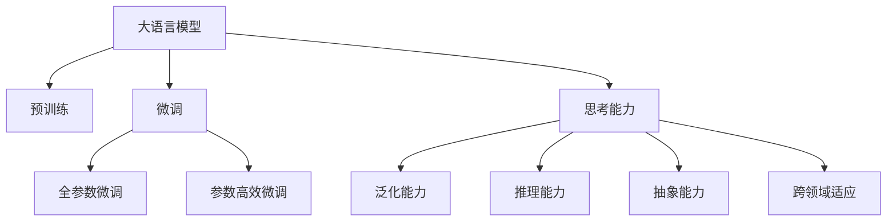

                 

# 大语言模型应用指南：关于大语言模型的思考能力

## 1. 背景介绍

### 1.1 问题由来
大语言模型（Large Language Models, LLMs）近年来在自然语言处理（Natural Language Processing, NLP）领域取得了显著的突破。这些模型通过大规模预训练，已经能够具备对语言的深度理解和生成能力，在诸如机器翻译、文本摘要、问答系统等任务上展现出了强大的表现。然而，这些模型的思考能力——即在特定领域中能否快速理解并解决复杂问题的能力，仍需进一步研究和优化。

### 1.2 问题核心关键点
大语言模型的思考能力涉及多个关键点：
- 泛化能力：模型能否将所学知识应用到新领域、新问题上。
- 推理能力：模型能否从给定信息中推理出新知识，并作出合理预测。
- 抽象能力：模型能否从复杂语境中抽取核心信息，进行抽象和概括。
- 跨领域适应：模型能否在多个领域中迁移使用，泛化出通用的知识表示。

### 1.3 问题研究意义
探讨大语言模型的思考能力对于提升模型性能，拓展其应用领域，推动NLP技术的实用化具有重要意义：
- 提高模型泛化能力：通过优化思考能力，模型能够更好地应对新任务和新场景，提升应用效果。
- 增强推理能力：提升模型的逻辑推理和因果分析能力，解决更为复杂的问题。
- 促进跨领域应用：改善模型的跨领域迁移能力，使模型能够广泛应用于各个行业。

## 2. 核心概念与联系

### 2.1 核心概念概述

为理解大语言模型的思考能力，需先掌握以下关键概念：

- 大语言模型（LLMs）：如BERT、GPT-3等，通过自回归或自编码模型，在大规模无标签文本数据上进行预训练，学习到语言表示。
- 预训练（Pre-training）：在无标签文本数据上进行自监督学习，学习语言的通用知识。
- 微调（Fine-tuning）：利用少量标注数据，在预训练模型的基础上，通过有监督学习优化模型在特定任务上的性能。
- 迁移学习（Transfer Learning）：预训练模型在特定任务上的微调，实现知识迁移。
- 思考能力：指模型在新任务中，通过推理和抽象，快速获取知识和解决问题的能力。

这些概念通过以下Mermaid流程图展示它们之间的联系：



## 3. 核心算法原理 & 具体操作步骤

### 3.1 算法原理概述

大语言模型的思考能力来源于其预训练和微调过程。预训练学习到语言的一般性知识，微调则在特定任务上优化这些知识，使之能够处理具体问题。思考能力体现在模型如何通过推理、抽象和泛化，在新任务中快速解决问题。

核心算法如下：
1. 预训练：使用大规模无标签数据，训练模型学习语言的通用知识。
2. 微调：利用少量标注数据，通过有监督学习，优化模型在特定任务上的性能。
3. 思考能力：在新任务中，模型通过推理、抽象和泛化，快速理解问题和生成答案。

### 3.2 算法步骤详解

#### 预训练步骤：
1. **数据准备**：收集大规模无标签文本数据，如维基百科、新闻、书籍等，作为预训练语料。
2. **模型选择**：选择适合的预训练模型，如BERT、GPT-2等。
3. **预训练目标**：设计自监督任务，如掩码语言模型（Masked Language Model, MLM）、下一句预测（Next Sentence Prediction, NSP）等。
4. **训练优化**：使用优化器如AdamW，学习率设置0.0001，训练轮次设置为30次。

#### 微调步骤：
1. **数据准备**：收集目标任务的数据集，标注好训练集、验证集和测试集。
2. **模型选择**：选择预训练好的模型。
3. **模型适配**：在模型顶层添加任务相关的输出层和损失函数。
4. **训练优化**：设置优化器和学习率，如AdamW，学习率设置为2e-5，训练轮次设置为5次。
5. **性能评估**：在测试集上评估模型性能，如准确率、F1-score等。

### 3.3 算法优缺点

#### 优点：
1. **通用性强**：适用于多种NLP任务，如分类、匹配、生成等。
2. **效果好**：在少量标注数据上，能够快速提升模型性能。
3. **灵活度高**：能够适应不同的领域和任务。

#### 缺点：
1. **数据依赖**：需要高质量的标注数据，获取成本较高。
2. **模型复杂**：参数量巨大，计算和存储资源需求高。
3. **推理慢**：推理速度较慢，部署效率较低。
4. **可解释性差**：模型黑盒化，难以解释其决策过程。

### 3.4 算法应用领域

#### 文本分类：
- 用于情感分析、主题分类、意图识别等任务。
- 示例：微调BERT模型，用于识别新闻文章的主旨情感。

#### 命名实体识别（NER）：
- 用于识别文本中的人名、地名、组织名等。
- 示例：微调BERT模型，识别医学文献中的疾病名称。

#### 关系抽取：
- 用于从文本中抽取实体之间的关系。
- 示例：微调BERT模型，抽取科技论文中引用关系。

#### 问答系统：
- 用于回答自然语言问题。
- 示例：微调GPT-3模型，回答用户查询的股票信息。

#### 机器翻译：
- 用于将源语言文本翻译成目标语言。
- 示例：微调Transformer模型，实现英中翻译。

#### 文本摘要：
- 用于将长文本压缩成简短摘要。
- 示例：微调BERT模型，对新闻报道进行自动摘要。

## 4. 数学模型和公式 & 详细讲解 & 举例说明

### 4.1 数学模型构建

假设预训练模型为 $M_{\theta}$，目标任务为 $T$，训练数据集为 $D=\{(x_i, y_i)\}_{i=1}^N$，其中 $x_i$ 为输入文本，$y_i$ 为标签。

微调的优化目标为最小化损失函数 $\mathcal{L}$：

$$
\mathcal{L}(\theta) = \frac{1}{N}\sum_{i=1}^N \ell(M_{\theta}(x_i), y_i)
$$

其中 $\ell$ 为针对任务 $T$ 设计的损失函数，如交叉熵损失。

### 4.2 公式推导过程

以二分类任务为例，推导交叉熵损失函数及其梯度：

假设模型输出为 $\hat{y}=M_{\theta}(x)$，其中 $M_{\theta}$ 为预训练模型，$x$ 为输入文本，$\theta$ 为模型参数。

交叉熵损失函数为：

$$
\ell(M_{\theta}(x), y) = -[y\log \hat{y} + (1-y)\log(1-\hat{y})]
$$

将损失函数代入经验风险公式，得：

$$
\mathcal{L}(\theta) = -\frac{1}{N}\sum_{i=1}^N [y_i\log M_{\theta}(x_i)+(1-y_i)\log(1-M_{\theta}(x_i))]
$$

损失函数对参数 $\theta_k$ 的梯度为：

$$
\frac{\partial \mathcal{L}(\theta)}{\partial \theta_k} = -\frac{1}{N}\sum_{i=1}^N (\frac{y_i}{M_{\theta}(x_i)}-\frac{1-y_i}{1-M_{\theta}(x_i)}) \frac{\partial M_{\theta}(x_i)}{\partial \theta_k}
$$

其中 $\frac{\partial M_{\theta}(x_i)}{\partial \theta_k}$ 可通过反向传播计算。

### 4.3 案例分析与讲解

假设任务为情感分析，数据集为电影评论，标签为情感分类（正面、负面）。

1. **数据预处理**：将电影评论文本和情感标签构建成训练集。
2. **模型选择**：使用BERT模型。
3. **模型适配**：在BERT模型顶部添加一个线性分类器和交叉熵损失函数。
4. **训练优化**：使用AdamW优化器，学习率设置为2e-5，训练轮次为5次。
5. **性能评估**：在测试集上评估模型，使用准确率和F1-score作为指标。

## 5. 项目实践：代码实例和详细解释说明

### 5.1 开发环境搭建

1. **安装Python**：安装最新版本的Python，如3.7及以上版本。
2. **安装TensorFlow**：通过pip安装TensorFlow 2.x版本。
3. **安装BERT模型**：通过TensorFlow Hub安装预训练好的BERT模型。
4. **安装其他依赖**：如numpy、scipy等科学计算库。

### 5.2 源代码详细实现

以下是一个简单的情感分析微调示例代码：

```python
import tensorflow as tf
import tensorflow_hub as hub
from tensorflow.keras import layers, models

# 加载预训练模型
model = hub.load("https://tfhub.dev/google/bert_base_en_uncased_L-12_H-768_A-12/1")

# 构建微调模型
input_layer = layers.Input(shape=(None,), dtype=tf.string)
encoder_output = model(input_layer)
classifier_layer = layers.Dense(1, activation='sigmoid')(encoder_output[:, 0, :])
model = models.Model(inputs=input_layer, outputs=classifier_layer)

# 设置优化器和学习率
optimizer = tf.keras.optimizers.Adam(learning_rate=2e-5)

# 编译模型
model.compile(optimizer=optimizer, loss='binary_crossentropy', metrics=['accuracy'])

# 训练模型
model.fit(train_dataset, epochs=5)

# 评估模型
model.evaluate(test_dataset)
```

### 5.3 代码解读与分析

1. **数据加载**：使用TensorFlow Hub加载预训练的BERT模型。
2. **模型构建**：在模型顶部添加一个全连接层，输出结果。
3. **优化器设置**：使用Adam优化器，学习率为2e-5。
4. **模型编译**：编译模型，使用二分类交叉熵损失函数。
5. **模型训练**：在训练集上进行模型训练。
6. **模型评估**：在测试集上评估模型性能。

## 6. 实际应用场景

### 6.4 未来应用展望

大语言模型的思考能力将推动其在更多领域的应用，如：

- **智能客服**：在客服对话中，模型能够理解用户意图，提供个性化服务。
- **金融风控**：利用模型预测客户信用风险，提高金融决策的准确性。
- **智能推荐**：在推荐系统中，模型能够理解用户兴趣，提供更加个性化的推荐。
- **医疗诊断**：在医疗咨询中，模型能够理解患者病情，提供诊断建议。
- **法律顾问**：在法律咨询中，模型能够理解法律条款，提供合理建议。

## 7. 工具和资源推荐

### 7.1 学习资源推荐

1. **自然语言处理入门**：推荐斯坦福大学的《CS224n: Natural Language Processing with Deep Learning》课程。
2. **深度学习框架**：推荐《Deep Learning》和《TensorFlow》相关书籍。
3. **BERT论文**：推荐论文《BERT: Pre-training of Deep Bidirectional Transformers for Language Understanding》。
4. **思考能力研究**：推荐论文《Improving Natural Language Understanding by Generative Pre-training》。

### 7.2 开发工具推荐

1. **Python**：推荐使用Python作为开发语言，简单易学，生态系统成熟。
2. **TensorFlow**：推荐使用TensorFlow进行深度学习开发，功能强大，社区活跃。
3. **BERT模型**：推荐使用TensorFlow Hub中的预训练BERT模型，简单易用。
4. **Jupyter Notebook**：推荐使用Jupyter Notebook进行交互式开发和调试。

### 7.3 相关论文推荐

1. **思考能力研究**：推荐论文《A Survey of Pre-trained Language Models》。
2. **迁移学习**：推荐论文《A Survey of Transfer Learning for Language Understanding》。
3. **微调技术**：推荐论文《The Anatomy of Parameter-Efficient Transfer Learning》。

## 8. 总结：未来发展趋势与挑战

### 8.1 总结

本文详细探讨了大语言模型的思考能力，从背景、核心概念、算法原理到项目实践，全面介绍了大语言模型的预训练和微调过程。

### 8.2 未来发展趋势

大语言模型的思考能力将面临以下趋势：
- **模型规模增长**：随着计算资源的增加，模型规模将进一步扩大。
- **思考能力提升**：未来模型将具备更强的推理、抽象和泛化能力。
- **多领域应用**：模型将在更多领域中实现迁移应用。
- **推理效率提升**：通过优化推理算法和模型结构，提升推理速度。
- **可解释性增强**：模型输出将更具可解释性。

### 8.3 面临的挑战

尽管大语言模型的思考能力在不断提升，但仍面临以下挑战：
- **数据需求高**：微调需要大量高质量标注数据。
- **计算资源消耗大**：模型推理和训练消耗大量资源。
- **推理速度慢**：推理速度较慢，影响应用效果。
- **可解释性差**：模型决策过程难以解释。
- **偏见和歧视**：模型可能存在偏见和歧视，影响公平性。

### 8.4 研究展望

未来研究将集中在以下几个方向：
- **无监督学习**：利用无监督和半监督学习，减少对标注数据的依赖。
- **推理效率优化**：优化推理算法和模型结构，提升推理效率。
- **可解释性增强**：提升模型的可解释性，使其输出更具可理解性。
- **多模态融合**：结合视觉、音频等多模态数据，提升模型的泛化能力。
- **知识增强**：引入专家知识，提升模型的推理能力。

## 9. 附录：常见问题与解答

**Q1: 大语言模型的思考能力如何体现？**

A: 大语言模型的思考能力体现在其在新任务中的推理、抽象和泛化能力。例如，在问答系统中，模型能够理解用户问题，从知识库中抽取相关信息，生成合理回答。

**Q2: 微调模型时，如何选择合适的方法？**

A: 选择微调方法需要考虑任务特点和数据规模。例如，对于数据量较大的任务，可以使用全参数微调，而对于数据量较小的任务，可以使用参数高效微调。

**Q3: 大语言模型在实际应用中，如何避免过拟合？**

A: 避免过拟合的方法包括：
1. 数据增强：通过数据生成和扩充技术，增加数据样本多样性。
2. 正则化：使用L2正则化和Dropout技术，防止模型过拟合。
3. 提前停止：在验证集上监测模型性能，提前停止训练。

**Q4: 微调模型的推理速度如何优化？**

A: 推理速度优化的方法包括：
1. 推理加速：使用模型剪枝和量化技术，减少计算量。
2. 分布式训练：使用分布式训练技术，加速训练和推理过程。
3. 硬件加速：使用GPU和TPU等高性能硬件，提高推理速度。

**Q5: 大语言模型在实际应用中，如何处理数据不均衡问题？**

A: 处理数据不均衡问题的方法包括：
1. 重采样：通过过采样或欠采样，平衡数据分布。
2. 类别权重调整：调整不同类别的样本权重，提升模型对少数类别的预测能力。
3. 多任务学习：将多个任务联合训练，提升模型的泛化能力。

