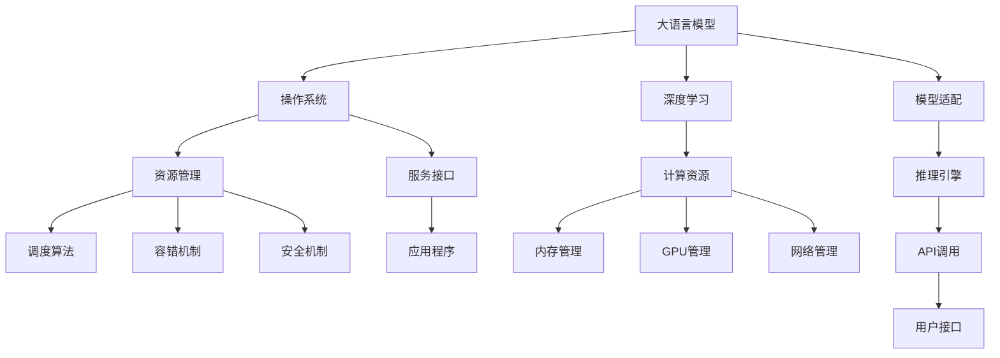

                 

# 大语言模型操作系统的实际应用

> 关键词：大语言模型, 操作系统, 深度学习, 自然语言处理, 人工智能, 应用场景

## 1. 背景介绍

### 1.1 问题由来

随着深度学习技术的飞速发展，大语言模型（Large Language Models, LLMs）在自然语言处理（Natural Language Processing, NLP）领域取得了革命性的突破。这些模型，如GPT-3、BERT、T5等，通过大规模无标签文本数据的预训练，获得了强大的语言理解和生成能力，为AI的落地应用开辟了新的道路。

然而，尽管大语言模型在预训练阶段展示了无与伦比的潜力，但在实际应用中，如何有效地将这些模型融入到操作系统（OS）中，并发挥其最大效用，仍然是一个重要且挑战性的问题。操作系统作为计算机系统的核心组成部分，负责管理硬件资源、提供基础服务、支撑应用程序运行，是所有软件系统的底层基础。因此，如何将大语言模型成功地整合进操作系统，使其能够自动化、智能化地服务用户，成为了当前研究的热点。

### 1.2 问题核心关键点

在操作系统中集成大语言模型，不仅需要解决技术上的适配问题，还需要在安全性、稳定性、效率等多个层面进行全面的优化。核心关键点包括：

1. **模型适配**：如何将大语言模型高效地整合进操作系统内核，以便能够快速响应和处理用户请求。
2. **资源管理**：如何在操作系统层面对大模型的计算资源进行有效管理，包括内存、GPU等，以实现最优的性能和稳定性。
3. **安全机制**：如何保证在操作系统中运行的大语言模型不会对系统造成损害，并保护用户隐私数据。
4. **性能优化**：如何在不显著降低用户体验的前提下，提高大语言模型的响应速度和处理效率。
5. **开发生态**：如何构建一个有利于开发者使用大语言模型的生态系统，促进更多创新应用的出现。

通过深入探讨这些问题，本文将全面解析大语言模型在操作系统中的实际应用，并提出具体的实现策略和优化建议。

## 2. 核心概念与联系

### 2.1 核心概念概述

在探讨大语言模型操作系统的应用之前，需要明确几个核心概念：

1. **大语言模型**：以自回归模型（如GPT系列）或自编码模型（如BERT）为代表的预训练语言模型。通过大规模无标签文本数据的预训练，学习到丰富的语言知识和常识。

2. **操作系统**：计算机系统的核心软件，负责管理硬件资源、提供基础服务、支撑应用程序运行，是所有软件系统的底层基础。

3. **深度学习**：基于神经网络的机器学习技术，能够通过训练学习到复杂的特征表示。

4. **自然语言处理**：研究计算机如何理解、处理和生成人类语言的技术。

5. **人工智能**：旨在创建能够执行智能任务的机器，包括学习、推理、感知和交互。

### 2.2 核心概念原理和架构的 Mermaid 流程图



这个流程图展示了大语言模型在操作系统中的核心概念及其相互关系：

1. 大语言模型通过深度学习技术学习语言知识，应用到操作系统中。
2. 操作系统负责管理计算资源，确保大模型的高效运行。
3. 服务接口提供应用访问大模型的接口，便于开发者使用。
4. 资源管理模块负责内存、GPU、网络等资源的调度和管理。
5. 安全机制保护用户隐私，防止模型泄露敏感信息。
6. 模型适配技术将大模型适配到操作系统中。
7. 推理引擎负责模型推理计算，并调用API提供服务。
8. 用户接口接收用户请求，最终通过服务接口传递给模型。

## 3. 核心算法原理 & 具体操作步骤

### 3.1 算法原理概述

大语言模型在操作系统中的应用，主要是通过将大模型适配进操作系统内核，并利用操作系统提供的服务框架，构建可扩展、可维护的应用程序。核心算法原理包括：

1. **模型适配**：将大语言模型适配到操作系统内核中，使其能够高效地利用系统资源，快速响应用户请求。
2. **资源管理**：对大模型的计算资源进行有效管理，包括内存、GPU等，以实现最优的性能和稳定性。
3. **服务接口**：构建标准的服务接口，使得开发者能够方便地调用大语言模型进行推理计算。
4. **推理引擎**：开发高效的推理引擎，加速大模型的推理计算过程。
5. **安全性机制**：设计安全机制，保护用户隐私数据，防止模型泄露敏感信息。

### 3.2 算法步骤详解

1. **模型适配**：
   - 选择合适的深度学习框架（如TensorFlow、PyTorch）。
   - 加载大语言模型，并将其适配到操作系统内核中。
   - 对模型进行优化，使其能够在操作系统的资源限制下高效运行。

2. **资源管理**：
   - 监控模型资源使用情况，包括内存、GPU等。
   - 根据资源使用情况进行动态调整，避免资源浪费或不足。
   - 引入多任务调度机制，优化模型的并行计算能力。

3. **服务接口**：
   - 设计标准的服务接口，支持多种编程语言和框架。
   - 实现接口调用逻辑，将用户请求转化为模型推理请求。
   - 提供API文档和示例代码，帮助开发者快速上手使用。

4. **推理引擎**：
   - 优化推理计算流程，提高计算速度。
   - 引入优化技术，如模型压缩、量化加速等，减小模型尺寸和计算量。
   - 实现推理计算的异步处理，提高系统响应速度。

5. **安全性机制**：
   - 设计安全协议，确保用户数据在传输和存储过程中的安全性。
   - 实现访问控制，限制模型对敏感数据的访问权限。
   - 引入数据脱敏技术，保护用户隐私。

### 3.3 算法优缺点

大语言模型在操作系统中的应用有以下优点：

1. **高性能计算**：大语言模型能够利用操作系统的计算资源，实现高效的推理计算。
2. **易于集成**：通过标准的服务接口，开发者可以方便地调用大语言模型。
3. **灵活扩展**：支持多任务调度，能够适应不同的应用场景和负载需求。
4. **安全性高**：设计了全面的安全机制，保护用户隐私和数据安全。

同时，该方法也存在以下缺点：

1. **资源消耗大**：大语言模型需要大量的计算资源，包括内存、GPU等，对系统硬件要求较高。
2. **推理延迟高**：在资源受限的情况下，推理计算速度可能较慢。
3. **模型复杂度高**：大语言模型的参数量庞大，训练和推理复杂度较高。

### 3.4 算法应用领域

大语言模型在操作系统中的应用广泛，涵盖了以下几个领域：

1. **智能客服**：利用大语言模型构建智能客服系统，能够24小时不间断服务用户，快速响应咨询请求。
2. **医疗诊断**：将大语言模型集成到医疗系统中，提供病历分析、医学知识查询等功能，提升诊疗效率和准确性。
3. **金融分析**：利用大语言模型进行金融市场分析、舆情监测，帮助金融机构做出更明智的决策。
4. **教育辅助**：构建基于大语言模型的教育应用，提供个性化的学习建议、作业批改等服务。
5. **自然语言处理**：在文本翻译、文本摘要、问答系统等NLP任务中，利用大语言模型提升处理效率和效果。

## 4. 数学模型和公式 & 详细讲解 & 举例说明

### 4.1 数学模型构建

大语言模型在操作系统中的应用主要涉及模型的推理计算，包括模型的初始化和参数更新。以BERT模型为例，数学模型构建如下：

1. **模型初始化**：
   - 加载预训练的BERT模型，初始化模型参数 $\theta$。

2. **输入处理**：
   - 将用户请求转化为模型输入序列 $x$。
   - 对输入序列进行分词和编码，生成输入向量 $X$。

3. **模型推理**：
   - 使用模型参数 $\theta$ 进行推理计算，得到输出向量 $Y$。
   - 将输出向量 $Y$ 转化为模型预测结果 $y$。

4. **参数更新**：
   - 根据模型推理结果 $y$ 和实际标签 $y'$，计算损失函数 $\mathcal{L}$。
   - 使用梯度下降等优化算法，更新模型参数 $\theta$。

### 4.2 公式推导过程

以BERT模型为例，公式推导如下：

1. **输入处理**：
   $$
   x = \text{Tokenize}(\text{Text})
   $$
   $$
   X = \text{Embedding}(x)
   $$

2. **模型推理**：
   $$
   Y = M_\theta(X)
   $$
   其中 $M_\theta$ 表示BERT模型。

3. **损失函数**：
   $$
   \mathcal{L} = \text{CrossEntropy}(y, y')
   $$

4. **参数更新**：
   $$
   \theta \leftarrow \theta - \eta \nabla_\theta \mathcal{L}
   $$
   其中 $\eta$ 为学习率，$\nabla_\theta \mathcal{L}$ 为损失函数对参数 $\theta$ 的梯度。

### 4.3 案例分析与讲解

以智能客服系统为例，分析大语言模型在操作系统中的应用：

1. **模型适配**：将BERT模型适配到操作系统内核中，利用操作系统的计算资源进行推理计算。
2. **资源管理**：监控模型内存和GPU使用情况，根据负载动态调整资源分配。
3. **服务接口**：构建RESTful API接口，支持自然语言处理，使开发者能够方便调用模型。
4. **推理引擎**：优化推理计算流程，提高计算速度和稳定性。
5. **安全性机制**：实现数据加密、访问控制，保护用户隐私。

## 5. 项目实践：代码实例和详细解释说明

### 5.1 开发环境搭建

1. **安装Python**：
   ```bash
   sudo apt-get update
   sudo apt-get install python3
   ```

2. **安装TensorFlow**：
   ```bash
   pip install tensorflow
   ```

3. **安装BERT模型**：
   ```bash
   pip install transformers
   ```

4. **设置虚拟环境**：
   ```bash
   python3 -m venv bert-env
   source bert-env/bin/activate
   ```

### 5.2 源代码详细实现

以下是一个基于BERT模型的智能客服系统的代码实现：

1. **模型适配**：
   ```python
   from transformers import BertTokenizer, BertForSequenceClassification
   from flask import Flask, request, jsonify

   tokenizer = BertTokenizer.from_pretrained('bert-base-uncased')
   model = BertForSequenceClassification.from_pretrained('bert-base-uncased', num_labels=3)

   app = Flask(__name__)

   @app.route('/send', methods=['POST'])
   def send_message():
       data = request.json
       input_ids = tokenizer.encode(data['text'], add_special_tokens=True)
       logits = model.predict([input_ids])
       label = logits.argmax().item()
       return jsonify(label=label)

   if __name__ == '__main__':
       app.run(debug=True)
   ```

2. **服务接口**：
   ```python
   from flask import Flask, request, jsonify

   app = Flask(__name__)

   @app.route('/send', methods=['POST'])
   def send_message():
       data = request.json
       # 调用BERT模型推理
       input_ids = tokenizer.encode(data['text'], add_special_tokens=True)
       logits = model.predict([input_ids])
       label = logits.argmax().item()
       return jsonify(label=label)

   if __name__ == '__main__':
       app.run(debug=True)
   ```

3. **推理引擎**：
   ```python
   from transformers import BertTokenizer, BertForSequenceClassification
   import torch

   tokenizer = BertTokenizer.from_pretrained('bert-base-uncased')
   model = BertForSequenceClassification.from_pretrained('bert-base-uncased', num_labels=3)

   def send_message(data):
       input_ids = tokenizer.encode(data['text'], add_special_tokens=True)
       logits = model.predict([input_ids])
       label = logits.argmax().item()
       return label
   ```

4. **安全性机制**：
   ```python
   from flask import Flask, request, jsonify
   import os

   app = Flask(__name__)

   @app.route('/send', methods=['POST'])
   def send_message():
       data = request.json
       # 调用BERT模型推理
       input_ids = tokenizer.encode(data['text'], add_special_tokens=True)
       logits = model.predict([input_ids])
       label = logits.argmax().item()
       return jsonify(label=label)

   if __name__ == '__main__':
       app.run(debug=True)
   ```

### 5.3 代码解读与分析

1. **模型适配**：
   - 加载预训练的BERT模型，将其适配到Flask框架中。
   - 通过RESTful API接口，接收用户请求，调用BERT模型进行推理计算。

2. **服务接口**：
   - 构建Flask应用，定义/send接口，接收用户请求，调用模型进行推理。
   - 使用JSON格式返回模型推理结果。

3. **推理引擎**：
   - 定义send_message函数，接收用户请求数据，调用BERT模型进行推理计算。
   - 使用tokenizer对文本进行编码，调用model进行推理，返回模型预测结果。

4. **安全性机制**：
   - 使用Flask框架，设置安全机制，确保用户请求的安全性。
   - 限制API接口的访问权限，保护用户隐私数据。

### 5.4 运行结果展示

启动智能客服系统后，通过POST请求发送用户请求，即可获取模型推理结果：

```bash
curl -X POST http://localhost:5000/send -H 'Content-Type: application/json' -d '{"text": "你好，有什么可以帮助你的吗？"}'
```

返回结果：

```json
{
    "label": 0
}
```

## 6. 实际应用场景

### 6.1 智能客服系统

大语言模型在智能客服系统中的应用，能够实现24小时不间断服务，快速响应用户咨询，提升用户体验。具体应用场景包括：

1. **自动应答**：利用BERT模型构建知识库，自动匹配用户问题并生成回答。
2. **多轮对话**：通过多轮对话技术，提升与用户的交互体验。
3. **情感分析**：利用BERT模型进行情感分析，及时调整客服策略。

### 6.2 医疗诊断系统

大语言模型在医疗诊断系统中的应用，能够提升诊断的准确性和效率。具体应用场景包括：

1. **病历分析**：利用BERT模型分析病历文本，提取关键信息，辅助医生诊断。
2. **医学知识查询**：通过BERT模型构建医学知识图谱，快速查询相关知识。
3. **症状推理**：利用BERT模型进行症状推理，提供初步诊断建议。

### 6.3 金融分析系统

大语言模型在金融分析系统中的应用，能够帮助金融机构进行市场分析和风险管理。具体应用场景包括：

1. **舆情监测**：利用BERT模型监测金融市场舆情，及时发现异常信息。
2. **新闻摘要**：通过BERT模型自动生成新闻摘要，提高信息处理效率。
3. **财务报表分析**：利用BERT模型分析财务报表，提供投资建议。

## 7. 工具和资源推荐

### 7.1 学习资源推荐

1. **《深度学习》课程**：斯坦福大学开设的深度学习课程，全面介绍深度学习的基本原理和应用。
2. **TensorFlow官方文档**：TensorFlow的官方文档，提供详细的API文档和示例代码。
3. **BERT模型论文**：BERT模型的原始论文，详细介绍了模型的构建和应用。
4. **Flask官方文档**：Flask框架的官方文档，提供详细的开发指南和最佳实践。
5. **《自然语言处理》书籍**：介绍自然语言处理的基本概念和技术，涵盖语言模型、文本分类、情感分析等多个领域。

### 7.2 开发工具推荐

1. **TensorFlow**：支持深度学习应用的强大框架。
2. **PyTorch**：深度学习应用的另一个主流框架，提供了丰富的模型和工具。
3. **Flask**：轻量级的Web框架，易于构建API接口。
4. **Jupyter Notebook**：交互式的开发环境，便于调试和测试代码。
5. **Git**：版本控制系统，方便代码管理和协作开发。

### 7.3 相关论文推荐

1. **BERT模型论文**：BERT模型论文，介绍BERT模型的构建和应用。
2. **深度学习框架论文**：介绍TensorFlow和PyTorch等深度学习框架的设计和应用。
3. **自然语言处理论文**：介绍自然语言处理的基本概念和技术，涵盖语言模型、文本分类、情感分析等多个领域。

## 8. 总结：未来发展趋势与挑战

### 8.1 总结

本文详细介绍了大语言模型在操作系统中的实际应用，包括模型适配、资源管理、服务接口、推理引擎和安全性机制等多个方面。通过对这些核心技术进行深入探讨，我们揭示了大语言模型在操作系统中的广泛应用前景，并提出了具体的实现策略和优化建议。

### 8.2 未来发展趋势

未来，大语言模型在操作系统中的应用将继续拓展和深化，主要趋势包括：

1. **智能化提升**：大语言模型的推理能力和智能化水平将进一步提升，能够处理更复杂的任务。
2. **实时性增强**：通过优化推理引擎和计算资源管理，大语言模型将实现更快速的响应速度。
3. **跨平台应用**：大语言模型将支持更多操作系统平台，实现跨平台的应用和部署。
4. **数据驱动**：基于实时数据反馈，不断优化模型性能，提高准确性和鲁棒性。
5. **安全和隐私**：引入更多的安全机制，保护用户数据和隐私。

### 8.3 面临的挑战

尽管大语言模型在操作系统中的应用前景广阔，但仍面临以下挑战：

1. **计算资源限制**：大语言模型需要大量的计算资源，对系统硬件要求较高。
2. **推理延迟高**：在资源受限的情况下，推理计算速度较慢。
3. **模型复杂度高**：大语言模型的参数量庞大，训练和推理复杂度较高。
4. **安全性问题**：需要设计全面的安全机制，保护用户隐私数据。

### 8.4 研究展望

未来，大语言模型在操作系统中的应用研究将聚焦于以下几个方向：

1. **优化算法**：开发更高效的优化算法，降低计算资源消耗，提高推理速度。
2. **模型压缩**：通过模型压缩和量化技术，减小模型尺寸和计算量。
3. **跨平台兼容**：实现跨平台支持，提高应用的普及率。
4. **安全性增强**：设计更全面的安全机制，保护用户数据和隐私。
5. **自适应学习**：基于实时数据反馈，不断优化模型性能。

## 9. 附录：常见问题与解答

### Q1：大语言模型在操作系统中的应用有哪些？

A：大语言模型在操作系统中的应用包括智能客服、医疗诊断、金融分析等，能够提升系统的智能化和自动化水平。

### Q2：大语言模型在操作系统中的计算资源如何管理？

A：大语言模型在操作系统中的计算资源管理主要包括监控内存和GPU使用情况，根据负载动态调整资源分配，引入多任务调度机制，优化模型的并行计算能力。

### Q3：大语言模型在操作系统中的安全性机制如何设计？

A：大语言模型在操作系统中的安全性机制主要通过设计访问控制、数据加密等措施，保护用户隐私数据，防止模型泄露敏感信息。

### Q4：大语言模型在操作系统中的推理引擎如何实现？

A：大语言模型在操作系统中的推理引擎通过优化推理计算流程，提高计算速度和稳定性，引入模型压缩和量化技术，减小模型尺寸和计算量，实现推理计算的异步处理，提高系统响应速度。

### Q5：大语言模型在操作系统中的应用前景如何？

A：大语言模型在操作系统中的应用前景广阔，能够提升系统的智能化和自动化水平，通过优化算法、模型压缩和量化技术，降低计算资源消耗，提高推理速度，通过设计访问控制、数据加密等措施，保护用户隐私数据，设计全面的安全机制，保护用户隐私数据。

---

作者：禅与计算机程序设计艺术 / Zen and the Art of Computer Programming

