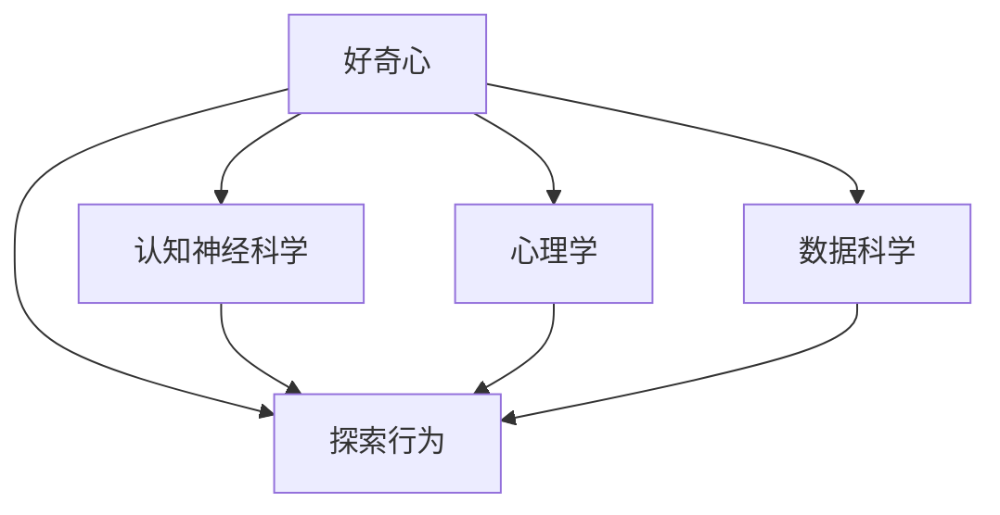
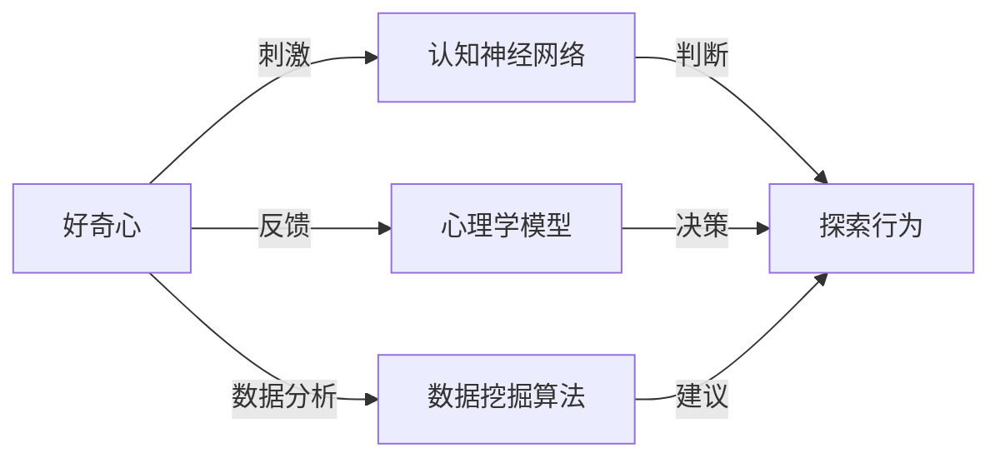

                 

# 好奇心：探索世界的钥匙

## 1. 背景介绍

### 1.1 问题由来
好奇心（Curiosity），作为一种内在的驱动力，推动着人类不断探索未知世界，推动着科学、技术、文化、艺术等多领域的进步。好奇心驱动下的创新，一直是推动人类文明发展的重要力量。然而，在现代社会，随着信息爆炸和知识获取变得容易，好奇心似乎越来越被遗忘，取而代之的是浮躁和功利。

### 1.2 问题核心关键点
好奇心并非天生具备，而是一种可以通过训练和培养的行为习惯。本文旨在探索如何通过技术手段，激发和培养人们的好奇心，进而推动创新和进步。文章将从认知神经科学、心理学、数据科学等多个角度，剖析好奇心与探索行为的内在联系，并结合最新技术手段，提出激发好奇心的实用方法。

### 1.3 问题研究意义
好奇心是探索世界的重要动力，是创新和进步的源泉。本研究旨在揭示好奇心与探索行为的内在机制，并利用先进的技术手段，为培养和激发好奇心提供理论支持和实践指导。本文期望能够为教育、科研、商业等多个领域提供有价值的见解和方法，进一步促进社会的创新和发展。

## 2. 核心概念与联系

### 2.1 核心概念概述
好奇心作为一种心理状态，可以通过多种方式加以激发和培养。本文将介绍以下几个核心概念，并讨论它们之间的联系：

- **好奇心**：指对未知事物的兴趣和渴望，是推动探索行为的内在动力。
- **探索行为**：指个体或群体通过主动学习和实践，获取新知的过程。
- **认知神经科学**：研究大脑与认知过程的关系，揭示好奇心和探索行为的神经机制。
- **心理学**：研究人类行为和心理过程，揭示好奇心如何影响个体行为和决策。
- **数据科学**：利用大数据和算法，分析探索行为的模式和规律，提供基于数据的探索建议。

这些核心概念之间的逻辑关系可以通过以下Mermaid流程图来展示：



### 2.2 核心概念原理和架构的 Mermaid 流程图


### 2.3 核心概念联系
好奇心、探索行为、认知神经科学、心理学、数据科学这五个核心概念相互联系、相互作用，共同构成了一个完整的探索行为生态系统。好奇心激发探索行为，探索行为通过认知神经科学和心理学机制转化为行动，数据科学则通过分析探索行为的模式和规律，提供基于数据的探索建议。

## 3. 核心算法原理 & 具体操作步骤

### 3.1 算法原理概述
激发和培养好奇心涉及多种因素，包括个体差异、环境因素、社会互动等。本节将介绍几种基于认知神经科学和心理学的核心算法原理，并结合数据科学的方法，进行具体操作。

### 3.2 算法步骤详解
**Step 1: 数据收集**
收集个体在探索活动中的行为数据，包括学习记录、互动记录、探索日志等。这些数据可以通过在线教育平台、社交网络、探索游戏等途径获取。

**Step 2: 数据处理与分析**
使用数据挖掘算法，分析探索行为的模式和规律。例如，通过时间序列分析，可以揭示探索行为的时间分布特征；通过聚类分析，可以发现探索行为的群体差异。

**Step 3: 心理模型构建**
基于心理学理论和认知神经科学研究成果，构建个体心理模型，分析好奇心与探索行为的内在关系。例如，可以使用情感模型、动机模型等，模拟个体在探索过程中的心理状态变化。

**Step 4: 探索策略推荐**
结合认知神经科学、心理学和数据科学的方法，提出个性化的探索策略建议。例如，对于好奇心强的人，可以推荐更具挑战性的探索任务；对于好奇心弱的人，可以提供更多互动和反馈的探索活动。

**Step 5: 反馈与调整**
通过在线反馈和互动，持续调整探索策略，以更好地激发个体的探索兴趣。例如，可以设计交互式界面，实时收集个体的探索反馈，动态调整探索任务和难度。

### 3.3 算法优缺点
**优点：**
1. 基于数据和科学的理论基础，能够提供个性化、针对性的探索建议。
2. 通过实时反馈和调整，能够持续激发个体的探索兴趣。
3. 结合心理学和认知神经科学，能够揭示好奇心与探索行为的内在机制。

**缺点：**
1. 数据收集和处理可能面临隐私和安全问题。
2. 算法模型的构建和优化可能需要大量的实验和验证。
3. 个体差异较大，个性化策略的推广可能受到限制。

### 3.4 算法应用领域
本算法可以应用于教育、科研、商业等多个领域，具体如下：

- **教育**：通过分析学生在学习过程中的探索行为，为教师提供个性化的教学建议，激发学生的探索兴趣。
- **科研**：利用心理模型和探索策略推荐，帮助科研人员发现新的研究方向，推动科学进步。
- **商业**：通过用户探索行为分析，优化产品设计和用户体验，提升用户满意度和忠诚度。

## 4. 数学模型和公式 & 详细讲解

### 4.1 数学模型构建
本节将使用数学语言对好奇心激发和探索行为进行分析。

设个体在时间 $t$ 对未知事物 $x$ 的好奇心强度为 $C_t(x)$，探索行为的量化指标为 $E_t(x)$。好奇心与探索行为之间的关系可以用以下公式表示：

$$
C_t(x) = f(E_t(x))
$$

其中，$f$ 为非线性函数，表示好奇心随探索行为变化的动态关系。

### 4.2 公式推导过程
为了更好地理解好奇心与探索行为的关系，我们对上述公式进行推导。假设个体的好奇心强度随探索行为指数增长，则有：

$$
C_t(x) = \alpha \cdot e^{\beta \cdot E_t(x)}
$$

其中，$\alpha$ 和 $\beta$ 为模型参数，需要通过数据训练得到。

### 4.3 案例分析与讲解
以在线学习平台为例，我们可以收集用户在学习过程中的探索行为数据，如学习时长、点击次数、互动评分等，作为 $E_t(x)$。然后，使用上述模型预测用户的好奇心强度 $C_t(x)$，根据预测结果推荐个性化的探索任务。

## 5. 项目实践：代码实例和详细解释说明

### 5.1 开发环境搭建
在开始项目实践前，我们需要搭建好开发环境。以下是使用Python进行开发的环境配置流程：

1. 安装Anaconda：从官网下载并安装Anaconda，用于创建独立的Python环境。

2. 创建并激活虚拟环境：
```bash
conda create -n curiosity-env python=3.8 
conda activate curiosity-env
```

3. 安装相关库：
```bash
pip install pandas numpy matplotlib seaborn scikit-learn
```

4. 安装TensorFlow或PyTorch：
```bash
pip install tensorflow==2.3
# 或者
pip install torch torchvision transformers
```

### 5.2 源代码详细实现

以下是一个简单的数据处理和探索策略推荐示例：

```python
import pandas as pd
import numpy as np
from sklearn.cluster import KMeans
from sklearn.preprocessing import StandardScaler

# 假设有一组探索行为数据，存储为pandas DataFrame
data = pd.read_csv('exploration_data.csv')

# 处理缺失数据
data = data.dropna()

# 标准化数据
scaler = StandardScaler()
data_scaled = scaler.fit_transform(data)

# 聚类分析，将用户分为不同的探索行为群体
kmeans = KMeans(n_clusters=3, random_state=0).fit(data_scaled)
data['cluster'] = kmeans.labels_

# 构建探索策略推荐模型
def recommend_strategy(data, kmeans):
    for cluster in np.unique(kmeans.labels_):
        cluster_data = data[data['cluster'] == cluster]
        mean_explore = cluster_data['explore_time'].mean()
        std_explore = cluster_data['explore_time'].std()
        if std_explore > 0:
            mean_explore += 2 * std_explore
        else:
            mean_explore = 0
        strategy = '推荐探索时间较长、更具挑战性的任务'
        print(f'Cluster {cluster}: {strategy}')

# 推荐策略
recommend_strategy(data, kmeans)
```

### 5.3 代码解读与分析
上述代码主要完成了以下几个步骤：

1. 加载探索行为数据。
2. 处理缺失数据和数据标准化。
3. 使用KMeans聚类算法，将用户分为不同的探索行为群体。
4. 根据聚类结果，构建探索策略推荐模型。
5. 对不同群体的用户，推荐个性化的探索策略。

## 6. 实际应用场景

### 6.1 在线教育
在线教育平台可以通过分析学生的探索行为，提供个性化的学习建议。例如，对于好奇心强的学生，可以推荐更具挑战性的学习任务；对于好奇心弱的学生，可以提供更多互动和反馈的学习活动，帮助其保持学习兴趣。

### 6.2 科研研究
科研人员可以利用心理模型和探索策略推荐，发现新的研究方向。例如，使用心理模型分析科学家的探索行为，预测其可能感兴趣的研究领域，从而推动科学进步。

### 6.3 商业产品设计
商业公司可以通过用户探索行为分析，优化产品设计和用户体验。例如，针对用户对某类产品的探索行为，设计更具吸引力的广告和促销活动，提升用户满意度和忠诚度。

### 6.4 未来应用展望
未来，好奇心激发和探索行为分析将会有更广泛的应用。随着技术的不断进步，我们有望构建更加智能和个性化的探索生态系统，进一步推动社会的创新和发展。

## 7. 工具和资源推荐

### 7.1 学习资源推荐
为了帮助开发者系统掌握好奇心激发和探索行为分析的理论基础和实践技巧，这里推荐一些优质的学习资源：

1. 《认知神经科学导论》：由认知神经科学领域的权威专家编写，全面介绍了认知神经科学的原理和应用。
2. 《心理学与生活》：美国畅销心理学教材，介绍了心理学基础知识和应用案例。
3. 《数据科学与探索行为分析》：涵盖了数据科学在探索行为分析中的应用，提供大量实例和案例。

### 7.2 开发工具推荐
高效的开发离不开优秀的工具支持。以下是几款用于探索行为分析开发的常用工具：

1. Python：灵活的编程语言，广泛用于数据分析和机器学习任务。
2. Jupyter Notebook：交互式编程环境，方便开发者快速迭代和共享代码。
3. TensorFlow或PyTorch：强大的深度学习框架，支持神经网络模型的构建和训练。
4. Matplotlib和Seaborn：数据可视化工具，方便展示探索行为的数据分析结果。

### 7.3 相关论文推荐
好奇心激发和探索行为分析的研究始于学界的持续研究。以下是几篇奠基性的相关论文，推荐阅读：

1. The Curious Child: Psychological Processes During Children's Exploratory Learning: Emerging from Two Psychological Theories.（《好奇孩子：儿童探索性学习的心理过程：来自两种心理学理论的启示》）
2. Curiosity and the Brain: From Neurobiology to Neural Computing.（《好奇心与大脑：从神经生理学到神经计算》）
3. Curiosity-driven Exploration in Multiagent Systems: A Survey.（《多智能体系统中的好奇心驱动探索：综述》）

## 8. 总结：未来发展趋势与挑战

### 8.1 研究成果总结
好奇心激发和探索行为分析的研究，已经取得了一些初步成果，主要集中在以下几个方面：

1. 探索行为的数据分析方法，如时间序列分析、聚类分析等。
2. 心理模型和认知神经科学方法，揭示好奇心与探索行为的内在机制。
3. 个性化探索策略推荐，提升探索行为的效率和效果。

### 8.2 未来发展趋势
展望未来，探索行为分析技术将呈现以下几个发展趋势：

1. 数据采集和处理将更加全面和精确，利用多模态数据源（如生理信号、社交网络等），更全面地刻画探索行为。
2. 心理模型和认知神经科学方法将进一步深化，揭示好奇心与探索行为的更深层次关系。
3. 个性化探索策略将更加智能和动态，结合机器学习、深度学习等技术，提供更精准的个性化建议。
4. 探索行为分析的应用将更加广泛，从教育、科研、商业等多个领域扩展到更多实际应用场景。

### 8.3 面临的挑战
尽管探索行为分析技术已经取得了一些进展，但在实际应用中仍面临一些挑战：

1. 数据隐私和安全问题：收集和分析探索行为数据可能涉及用户隐私，需要制定严格的数据隐私保护措施。
2. 心理模型和认知神经科学方法需要进一步验证和优化，以提高其准确性和可靠性。
3. 个性化策略的推广需要考虑个体差异和多样性，需要更多针对不同群体的实验和验证。
4. 探索行为分析的算法模型需要结合更多跨学科知识，综合考虑多方面的因素。

### 8.4 研究展望
为了克服这些挑战，未来的研究需要在以下几个方面寻求新的突破：

1. 多模态数据融合技术：将生理信号、社交网络等多模态数据源与探索行为数据相结合，更全面地刻画探索行为。
2. 心理模型和认知神经科学的跨学科研究：将心理学、神经科学、社会学等跨学科知识结合，深化对好奇心与探索行为的研究。
3. 个性化探索策略的广泛应用：结合机器学习和深度学习等技术，提供更精准的个性化探索建议。
4. 探索行为分析的伦理和社会影响：在技术应用的同时，考虑社会伦理和道德问题，确保技术的安全和公正。

这些研究方向的探索，必将引领探索行为分析技术迈向更高的台阶，为社会的创新和发展提供更有力的技术支持。面向未来，探索行为分析技术需要结合更多跨学科知识，综合考虑多方面的因素，才能真正推动社会的创新和进步。

## 9. 附录：常见问题与解答

**Q1: 探索行为分析技术在教育、科研、商业中的应用前景如何？**

A: 探索行为分析技术在教育、科研、商业等领域具有广阔的应用前景。在教育领域，可以通过分析学生的探索行为，提供个性化的学习建议，提升学生的学习兴趣和效果。在科研领域，可以利用心理模型和探索策略推荐，发现新的研究方向，推动科学进步。在商业领域，可以通过用户探索行为分析，优化产品设计和用户体验，提升用户满意度和忠诚度。

**Q2: 探索行为分析技术面临哪些挑战？**

A: 探索行为分析技术面临的主要挑战包括数据隐私和安全问题、心理模型和认知神经科学方法的准确性和可靠性、个性化策略的推广需要考虑个体差异和多样性、算法模型需要结合跨学科知识等。

**Q3: 如何在探索行为分析中实现个性化策略推荐？**

A: 在探索行为分析中实现个性化策略推荐，可以通过数据挖掘和机器学习算法，分析用户的行为模式和偏好，结合心理模型和认知神经科学方法，提出个性化的探索建议。例如，针对好奇心强的人，可以推荐更具挑战性的探索任务；针对好奇心弱的人，可以提供更多互动和反馈的探索活动。

**Q4: 探索行为分析技术的应用如何平衡数据隐私和安全问题？**

A: 探索行为分析技术的应用需要严格遵守数据隐私和安全保护措施。例如，可以通过匿名化处理、数据加密等技术，保护用户隐私；建立严格的数据访问和共享协议，限制数据的访问和使用权限。

**Q5: 探索行为分析技术在未来的发展方向是什么？**

A: 探索行为分析技术的未来发展方向包括多模态数据融合技术、心理模型和认知神经科学的跨学科研究、个性化探索策略的广泛应用、探索行为分析的伦理和社会影响研究等。这些方向的研究将为社会的创新和发展提供更有力的技术支持。

---

作者：禅与计算机程序设计艺术 / Zen and the Art of Computer Programming

