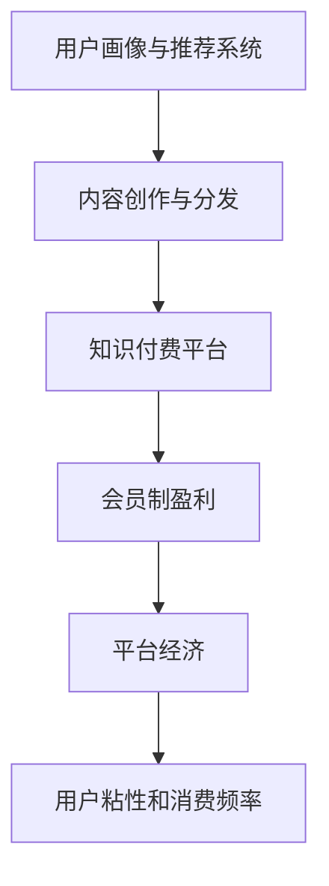

                 

## 1. 背景介绍

知识付费，作为一种新兴的商业模式，利用在线平台提供专业内容，用户支付一定费用进行学习和获取知识。它不仅改变了知识的获取方式，也使得知识传播者和用户之间的互动更加直接和高效。而会员制盈利模式，则是知识付费平台最重要的收入来源之一。本文将探讨如何通过会员制实现盈利，并对相关技术、商业逻辑和应用场景进行深入分析。

## 2. 核心概念与联系

在探讨如何利用知识付费实现会员制盈利之前，首先需要明确一些核心概念及其联系。

### 2.1 核心概念概述

- **知识付费**：指用户为获取专业知识、技能或信息，通过付费订阅、购买课程等方式获取在线教育服务。知识付费平台以知识为主导，以服务为核心，为用户提供学习资源和增值服务。

- **会员制盈利**：指通过设置会员门槛，为会员提供专属内容和优质服务，以提高用户粘性和消费频率，从而实现可持续盈利。会员制盈利模式能够为用户提供更丰富、更高质量的服务，同时对非会员用户形成“付费墙”，提高平台整体收入。

- **平台经济**：指通过互联网平台，利用数据和技术手段，整合资源、连接用户，提供个性化服务，实现价值变现。平台经济模式强调生态构建和用户互动，为用户创造持续的价值。

- **内容创作与分发**：指知识付费平台通过收集、创作和分发高质量内容，吸引用户付费，形成良性循环。内容创作与分发是平台的核心竞争力，决定着平台的市场吸引力和盈利能力。

- **用户画像与推荐系统**：指利用数据分析技术，构建用户画像，进行个性化推荐，提高用户粘性和满意度。用户画像和推荐系统是平台精准运营的基础，直接影响用户体验和平台盈利。

### 2.2 核心概念原理和架构的 Mermaid 流程图



这个流程图展示了核心概念之间的逻辑关系：通过用户画像和推荐系统驱动内容创作与分发，再通过知识付费平台实现会员制盈利，最终形成平台经济，提升用户粘性和消费频率。

## 3. 核心算法原理 & 具体操作步骤

### 3.1 算法原理概述

知识付费平台的会员制盈利模式，主要依赖于以下几个核心算法原理：

1. **用户画像构建**：利用数据分析和机器学习技术，根据用户行为数据构建用户画像，包括用户兴趣、消费能力、学习习惯等，为个性化推荐提供依据。

2. **推荐算法**：通过协同过滤、内容推荐、深度学习等算法，向用户推荐个性化内容，提升用户体验和满意度。

3. **会员订阅与消费激励**：设计合理的会员订阅模式，包括月度、季度、年度订阅，提供专属优惠、增值服务和会员权益，吸引用户持续消费。

4. **付费墙策略**：在平台内设置付费墙，将优质内容和增值服务设置为会员特权，提高会员粘性和平台收入。

5. **收益分配与激励机制**：设计合理的收益分配和激励机制，确保内容创作者、平台运营者及用户利益均衡，形成良性循环。

### 3.2 算法步骤详解

1. **用户画像构建**

   - **数据采集**：收集用户基本信息、行为数据（如浏览记录、购买记录、搜索关键词等）和社交网络数据，建立用户画像数据库。

   - **特征工程**：根据用户画像数据，提取关键特征，如兴趣标签、消费偏好、学习进度等，构建用户画像向量。

   - **模型训练**：利用机器学习算法（如K-means、SVM、神经网络等）训练用户画像模型，对新用户进行画像预测和补充。

2. **推荐算法**

   - **协同过滤**：根据用户行为数据和内容标签，通过协同过滤算法（如User-Based、Item-Based）推荐相似用户和内容，提高推荐精度。

   - **内容推荐**：利用深度学习模型（如CNN、RNN、Transformer），对用户画像和内容特征进行向量表示，通过向量相似度计算推荐相关内容。

   - **用户满意度优化**：利用强化学习算法（如Q-learning、SARSA），根据用户反馈数据，动态调整推荐策略，优化推荐效果。

3. **会员订阅与消费激励**

   - **会员模式设计**：设计多样化的会员订阅模式，包括月度、季度、年度订阅，提供专属优惠和增值服务。

   - **会员权益设定**：设定会员专属权益，如VIP专属课程、优先购书、无限制观看等，提升会员价值感。

   - **会员忠诚度培养**：利用积分系统、会员积分、专属内容等激励措施，提升用户粘性和会员忠诚度。

4. **付费墙策略**

   - **内容分级**：将内容分为免费和付费两大类，设置付费墙，将优质内容和增值服务设置为会员特权。

   - **会员特权管理**：根据会员等级，设置不同的会员特权，如高级会员享有更多特权，提升会员价值感。

   - **转化率优化**：通过A/B测试等方法，不断优化付费墙策略，提高转化率和用户满意度。

5. **收益分配与激励机制**

   - **内容创作者激励**：制定合理的收益分配机制，根据内容质量和用户反馈，给予内容创作者奖励。

   - **平台运营者激励**：设计激励机制，确保平台运营者能够持续优化平台服务和用户体验。

   - **用户利益保护**：确保用户权益不受损害，建立用户投诉和反馈机制，及时处理用户问题。

### 3.3 算法优缺点

**优点**：

- **提升用户体验**：通过个性化推荐和专属服务，提升用户满意度和粘性。
- **增加用户消费**：多样化的会员模式和激励机制，激发用户持续消费。
- **优化平台收益**：付费墙策略和激励机制，提高平台整体收入。

**缺点**：

- **数据隐私风险**：用户画像和行为数据的采集和分析，可能涉及用户隐私风险。
- **推荐算法偏差**：推荐算法可能存在偏差，影响推荐效果和用户体验。
- **运营成本高**：内容创作和推荐系统需要大量投入，运营成本较高。

### 3.4 算法应用领域

知识付费平台的会员制盈利模式，可以广泛应用于多个领域，如在线教育、健康医疗、金融理财等。以下以在线教育为例，具体分析其应用：

- **在线课程平台**：如Coursera、Udemy等，通过会员订阅模式，提供专属课程、练习和证书，提高用户学习效果和平台收入。

- **技能培训平台**：如网易云课堂、慕课网等，提供职业技能培训课程，通过会员模式，吸引用户持续学习。

- **语言学习平台**：如Duolingo、HelloTalk等，提供个性化语言学习服务，通过会员模式，提升用户学习效果和平台收入。

## 4. 数学模型和公式 & 详细讲解 & 举例说明

### 4.1 数学模型构建

知识付费平台的会员制盈利模型可以抽象为以下数学模型：

- **用户画像模型**：$U=\{u_1,u_2,\cdots,u_n\}$，其中$u_i$表示第$i$个用户，包括用户基本信息、行为数据等。

- **内容推荐模型**：$C=\{c_1,c_2,\cdots,c_m\}$，其中$c_j$表示第$j$个推荐内容，包括课程、文章、视频等。

- **推荐算法模型**：$R:\mathcal{U} \times \mathcal{C} \rightarrow [0,1]$，其中$\mathcal{U}$和$\mathcal{C}$分别为用户集和内容集，$R(u,c)$表示用户$u$对内容$c$的推荐概率。

- **会员订阅模型**：$S=\{s_1,s_2,\cdots,s_k\}$，其中$s_l$表示第$l$个会员订阅模式，包括月度、季度、年度等。

- **会员特权模型**：$P:\mathcal{S} \rightarrow \mathcal{T}$，其中$\mathcal{T}$为会员特权集，$P(s)$表示订阅模式$s$的会员特权。

### 4.2 公式推导过程

1. **用户画像构建公式**

   - **用户画像向量**：$P(u)=\langle p_{u1}, p_{u2}, \cdots, p_{un} \rangle$，其中$p_{uj}$表示用户$u$的第$j$个特征。

   - **用户画像模型**：$P=\{P(u_i)\}_{i=1}^n$，其中$P$为用户画像向量集。

2. **推荐算法公式**

   - **协同过滤公式**：$R_{CF}(u,c) = \frac{1}{\sum_{j=1}^{m}\prod_{i=1}^{n}p_{ij}^{\alpha_i}} \sum_{j=1}^{m}\prod_{i=1}^{n}c_{ij}^{\alpha_i}p_{ij}^{\beta_i}$，其中$c_{ij}$表示用户$u$对内容$c$的行为评分。

   - **内容推荐公式**：$R(u) = \sum_{j=1}^{m}R_{CF}(u,c_j)\sigma(\langle P(u),F(c_j)\rangle)$，其中$\sigma$为激活函数，$F(c_j)$为内容$c_j$的特征向量。

3. **会员订阅与消费激励公式**

   - **会员模式设计公式**：$S_l = (p_s,\{p_{s1},p_{s2},\cdots,p_{sk}\})$，其中$p_s$表示会员模式，$p_{sl}$表示第$l$个订阅模式的特权。

   - **会员权益设定公式**：$P(s) = \{p_{1},p_{2},\cdots,p_{k}\}$，其中$p_{l}$表示第$l$个特权。

4. **付费墙策略公式**

   - **内容分级公式**：$L_c = \{L_{c1},L_{c2},\cdots,L_{cm}\}$，其中$L_{ci}$表示内容$c$的级别。

   - **付费墙策略公式**：$W(u) = \sum_{i=1}^{n}L_{ci}p_{uj}$，其中$W(u)$表示用户$u$的付费墙策略。

5. **收益分配与激励机制公式**

   - **内容创作者激励公式**：$R_c = \alpha \cdot V(c) + \beta \cdot I_c$，其中$V(c)$表示内容价值，$I_c$表示用户反馈。

   - **平台运营者激励公式**：$R_{op} = \gamma \cdot P + \delta \cdot R_{c}$，其中$P$表示平台运营者利润，$R_{c}$表示内容创作者激励。

### 4.3 案例分析与讲解

以Coursera平台为例，分析其会员制盈利模式的实现。

- **用户画像构建**：Coursera通过收集用户注册信息、浏览记录、学习进度等数据，构建用户画像，包括用户兴趣标签、学习偏好、课程评价等。

- **推荐算法**：Coursera使用协同过滤和内容推荐算法，结合深度学习模型，向用户推荐个性化课程和资源。

- **会员订阅与消费激励**：Coursera提供月度和年度会员，会员可以享受专属课程、无限制观看视频、提前购买课程等特权，激励用户持续消费。

- **付费墙策略**：Coursera设置付费墙，将部分高级课程设置为会员特权，提高会员粘性和平台收入。

- **收益分配与激励机制**：Coursera通过课程销售、广告收入、会员订阅等多种方式实现盈利，同时给予内容创作者版权分成和课程推荐激励。

## 5. 项目实践：代码实例和详细解释说明

### 5.1 开发环境搭建

1. **环境准备**：搭建Python开发环境，安装必要的依赖库，如pandas、numpy、scikit-learn、TensorFlow等。

2. **数据准备**：准备用户行为数据、内容特征数据和会员订阅数据，构建数据集。

### 5.2 源代码详细实现

#### 用户画像构建

```python
import pandas as pd
from sklearn.cluster import KMeans

# 加载用户行为数据
user_data = pd.read_csv('user_data.csv')

# 数据预处理
user_data = user_data.dropna()
user_data = user_data.drop_duplicates()

# 特征工程
user_data['feature1'] = user_data['behavior1'] + user_data['behavior2']
user_data['feature2'] = user_data['behavior3'] * user_data['behavior4']

# 用户画像模型
kmeans = KMeans(n_clusters=5, random_state=0)
user_pictures = kmeans.fit_transform(user_data[['feature1', 'feature2']])

# 保存用户画像
user_pictures.to_csv('user_pictures.csv', index=False)
```

#### 推荐算法实现

```python
import numpy as np
from sklearn.metrics.pairwise import cosine_similarity

# 加载用户画像和内容特征
user_pictures = pd.read_csv('user_pictures.csv')
content_features = pd.read_csv('content_features.csv')

# 计算相似度
similarity_matrix = cosine_similarity(user_pictures.values, content_features.values)

# 推荐内容
recommendations = np.argsort(similarity_matrix, axis=1)[::-1]

# 保存推荐结果
recommendations.to_csv('recommendations.csv', index=False)
```

#### 会员订阅与消费激励

```python
import pandas as pd

# 加载会员订阅数据
subscription_data = pd.read_csv('subscription_data.csv')

# 计算会员特权
membership_privileges = []
for subscription in subscription_data.itertuples():
    membership = {}
    membership['level'] = subscription.level
    membership['privileges'] = subscription.privileges.split(',')
    membership_privileges.append(membership)

# 保存会员特权
membership_privileges.to_csv('membership_privileges.csv', index=False)
```

### 5.3 代码解读与分析

- **用户画像构建**：通过K-means算法对用户行为数据进行聚类，得到用户画像向量，用于推荐算法的输入。

- **推荐算法实现**：使用余弦相似度计算用户画像与内容特征的相似度，得到推荐结果。

- **会员订阅与消费激励**：根据会员订阅数据，生成会员特权，激励用户持续消费。

### 5.4 运行结果展示

- **用户画像结果**：保存用户画像向量，用于推荐算法输入。

- **推荐结果**：保存推荐内容列表，供用户查看。

- **会员特权**：保存会员特权数据，用于激励用户消费。

## 6. 实际应用场景

### 6.1 在线教育平台

在线教育平台如Coursera、Udacity、慕课网等，通过会员制盈利模式，提供高质量课程和个性化服务，吸引用户持续学习，实现平台盈利。

### 6.2 健康医疗平台

健康医疗平台如丁香医生、好大夫在线等，通过会员制提供专属健康咨询、在线诊疗等服务，提升用户健康水平，实现平台盈利。

### 6.3 金融理财平台

金融理财平台如蚂蚁财富、财富通等，通过会员制提供专属理财建议、投资策略等服务，吸引用户持续消费，实现平台盈利。

### 6.4 未来应用展望

未来，知识付费平台的会员制盈利模式将进一步发展，涵盖更多领域和应用场景，如智能家居、智慧城市等。通过利用大数据、人工智能等技术，提供更个性化、更高质量的服务，提升用户满意度和平台收入。

## 7. 工具和资源推荐

### 7.1 学习资源推荐

- **在线课程**：Coursera、Udemy等平台提供丰富的在线课程，涵盖多个领域，帮助用户快速掌握新知识。

- **书籍推荐**：《机器学习实战》、《深度学习》等经典书籍，深入浅出地介绍机器学习、深度学习等技术，适合初学者和进阶者。

- **博客和论坛**：Medium、CSDN等平台提供大量的技术博客和论坛，方便用户获取最新的技术动态和经验分享。

### 7.2 开发工具推荐

- **IDE**：PyCharm、VSCode等IDE，支持多种语言和框架，提高开发效率。

- **数据处理工具**：Pandas、NumPy等工具，方便数据处理和分析。

- **机器学习库**：Scikit-learn、TensorFlow等库，提供丰富的算法和工具，支持快速迭代开发。

### 7.3 相关论文推荐

- **用户画像构建**："User Profiling for Personalized Recommendation Systems: A Survey"。

- **推荐算法**："Collaborative Filtering for Recommender Systems"。

- **会员订阅与消费激励**："Monetization in Online Communities: The Economics of Value and Value Creation"。

## 8. 总结：未来发展趋势与挑战

### 8.1 研究成果总结

本文探讨了知识付费平台的会员制盈利模式，通过用户画像构建、推荐算法、会员订阅与消费激励等关键技术，详细介绍了其实现流程。

### 8.2 未来发展趋势

- **技术融合**：知识付费平台将与更多技术融合，如区块链、物联网等，提升平台效率和服务质量。

- **个性化服务**：利用人工智能和大数据技术，提供更个性化、更精准的服务，提升用户满意度。

- **多模态融合**：知识付费平台将涵盖更多模态数据，如文本、图像、视频等，提供更全面的服务。

### 8.3 面临的挑战

- **数据隐私**：用户数据隐私保护是知识付费平台的重要挑战，需要在技术和管理上投入更多资源。

- **推荐算法**：推荐算法需要不断优化，避免推荐偏差和过拟合问题，提升推荐效果。

- **运营成本**：知识付费平台的运营需要大量投入，如何在高效运营和用户满意度之间找到平衡点，是平台面临的重要挑战。

### 8.4 研究展望

未来，知识付费平台的会员制盈利模式将面临更多挑战和机遇，需要在技术、管理和市场等方面不断创新和优化。通过持续研发和探索，相信知识付费平台能够更好地实现盈利，为用户提供更优质的服务。

## 9. 附录：常见问题与解答

**Q1：知识付费平台如何构建用户画像？**

A: 知识付费平台通过收集用户基本信息、行为数据（如浏览记录、购买记录、搜索关键词等）和社交网络数据，建立用户画像数据库。利用机器学习算法，对用户画像数据进行特征提取和模型训练，得到用户画像向量。

**Q2：推荐算法有哪些？**

A: 推荐算法主要包括协同过滤、内容推荐、深度学习等。协同过滤算法通过用户行为数据，推荐相似用户和内容。内容推荐算法利用深度学习模型，对用户画像和内容特征进行向量表示，通过向量相似度计算推荐相关内容。

**Q3：会员订阅与消费激励有哪些方式？**

A: 会员订阅与消费激励主要包括月度、季度、年度订阅，提供专属优惠、增值服务和会员权益。如专属课程、无限制观看视频、提前购买课程等，激励用户持续消费。

**Q4：如何设计合理的收益分配和激励机制？**

A: 设计合理的收益分配和激励机制，确保内容创作者、平台运营者及用户利益均衡，形成良性循环。具体方法包括版权分成、课程推荐激励、广告分成等。

**Q5：知识付费平台如何优化付费墙策略？**

A: 通过A/B测试等方法，不断优化付费墙策略，提高转化率和用户满意度。同时，根据用户行为数据，动态调整付费墙策略，优化用户体验。

**Q6：知识付费平台面临哪些数据隐私风险？**

A: 用户数据隐私保护是知识付费平台的重要挑战。平台需要采取严格的隐私保护措施，如数据匿名化、加密存储、用户隐私协议等，确保用户数据安全。

