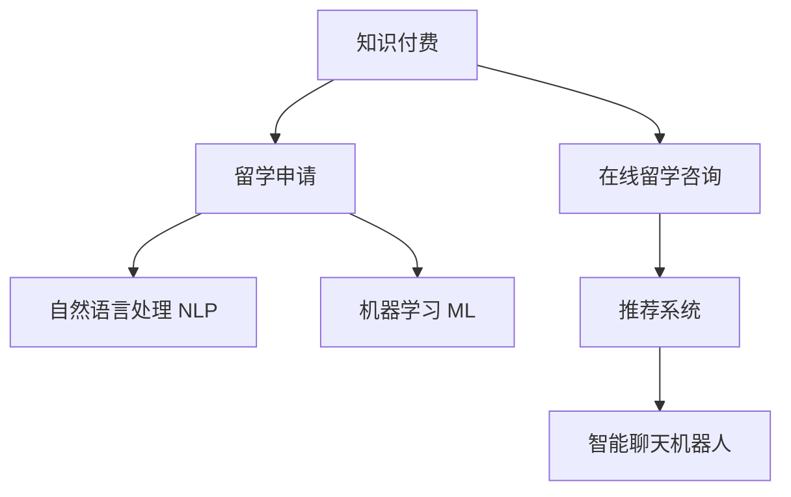

                 

# 如何利用知识付费实现在线留学咨询与申请服务？

在数字化和全球化的浪潮中，留学咨询与申请服务逐渐成为连接求学者和目标院校的重要桥梁。传统的留学服务往往依赖人工顾问提供信息，效率低下、成本高昂。随着知识付费的兴起，利用在线平台提供高品质的留学咨询与申请服务，成为一种新的趋势。本文将探讨如何利用知识付费模式，通过技术手段，实现在线留学咨询与申请服务的全流程智能化，为客户提供一站式的留学解决方案。

## 1. 背景介绍

### 1.1 问题由来
随着全球教育水平日益均衡，越来越多的学生选择出国深造，留学咨询与申请需求急剧增长。传统的留学服务模式主要有两种：
- **人工咨询**：由留学顾问一对一提供专业咨询、申请指导和文书修改等服务。然而，这种方式成本高、效率低，资源分配不均衡，难以覆盖更多学生需求。
- **标准化服务**：提供一些标准化的申请指南、文书模板等服务，虽然降低了成本，但缺乏个性化指导和针对性建议。

随着知识付费模式的兴起，留学咨询与申请服务的线上化、智能化成为可能。通过在线平台，客户可以享受到优质且个性化的留学咨询服务，同时还能降低咨询成本。

### 1.2 问题核心关键点
利用知识付费模式实现留学咨询与申请服务，主要涉及以下几个关键点：
- **知识获取与付费机制**：如何高效获取留学知识，并设计合理的价格体系，吸引客户。
- **咨询与申请流程**：构建符合留学需求的咨询与申请全流程，确保服务的专业性和全面性。
- **技术实现与平台支撑**：如何通过技术手段，实现留学咨询与申请的线上化和智能化，提升用户体验。

## 2. 核心概念与联系

### 2.1 核心概念概述

- **知识付费**：利用互联网平台，提供定制化、专业化的知识服务，客户通过付费获取相应信息或咨询。
- **在线留学咨询**：通过在线平台，提供留学咨询服务，帮助客户解答留学申请中的各类问题。
- **留学申请**：指导学生完成留学申请材料准备、文书撰写、材料提交等全流程，确保申请过程的顺利进行。
- **自然语言处理(NLP)**：通过NLP技术，理解客户查询意图，提供个性化推荐和答疑服务。
- **机器学习(ML)**：利用机器学习算法，构建推荐系统，自动匹配客户需求与优质留学信息。
- **推荐系统**：通过推荐算法，推荐最适合客户的留学项目、导师、课程等，提高客户满意度。
- **智能聊天机器人**：基于NLP和ML技术，构建自动答疑机器人，提供24/7的咨询服务。

这些核心概念之间的逻辑关系可以通过以下Mermaid流程图来展示：



这个流程图展示了知识付费、留学咨询与申请、自然语言处理、机器学习、推荐系统和智能聊天机器人等核心概念之间的关联性。通过这些技术的融合，可以实现留学咨询与申请的智能化服务。

## 3. 核心算法原理 & 具体操作步骤
### 3.1 算法原理概述

基于知识付费的在线留学咨询与申请服务，主要分为知识获取、咨询与申请流程构建、技术实现三个部分。其核心算法原理包括：

- **知识抽取**：通过NLP技术，从大量留学信息中抽取结构化数据，如学校信息、专业介绍、录取要求等。
- **个性化推荐**：利用ML算法，对客户需求进行建模，根据历史查询记录和用户行为，推荐最适合的留学项目、导师、课程等信息。
- **智能答疑**：通过NLP和ML技术，构建智能聊天机器人，实时回答客户咨询，提供个性化答疑服务。
- **智能申请指导**：利用机器学习模型，根据客户申请进展，自动提供申请指导和材料准备建议。

### 3.2 算法步骤详解

#### 3.2.1 知识抽取

- **语料收集**：收集全球范围内的留学数据，包括学校介绍、专业信息、录取要求等。
- **数据预处理**：对收集到的数据进行清洗、去重、分词等预处理，转换为机器可处理的格式。
- **特征提取**：使用TF-IDF、Word2Vec等技术，从文本中抽取关键词和语义信息。
- **实体抽取**：通过命名实体识别(NER)等技术，从文本中抽取学校名称、专业名称、地理位置等实体信息。

#### 3.2.2 个性化推荐

- **用户画像建模**：利用ML算法，构建用户画像，包括兴趣、偏好、历史查询记录等。
- **推荐模型训练**：使用协同过滤、基于内容的推荐等算法，对用户画像和留学信息进行建模，构建推荐模型。
- **推荐结果生成**：根据客户查询行为和用户画像，使用推荐模型生成推荐结果。
- **推荐结果排序**：通过排序算法，如Top-k排序、基于排序的推荐算法，对推荐结果进行排序，确保最相关的信息展示在前面。

#### 3.2.3 智能答疑

- **意图理解**：使用NLP技术，解析客户查询的意图和问题。
- **问题分类**：根据查询内容，将问题分类到不同的知识库中，如申请流程、签证信息、奖学金申请等。
- **知识库匹配**：根据问题分类，在对应的知识库中匹配答案。
- **答案生成**：通过NLP技术，生成符合客户需求的答案，并进行自动回复。

#### 3.2.4 智能申请指导

- **申请进展监控**：通过ML模型，监控客户的申请进展，如申请材料提交情况、审核状态等。
- **申请建议生成**：根据申请进展，自动生成下一步申请建议，如材料准备、面试准备等。
- **申请提醒**：根据申请时间线，设置提醒功能，确保客户按时完成申请步骤。

### 3.3 算法优缺点

#### 3.3.1 优点

- **高效获取知识**：通过知识抽取技术，高效获取全球留学信息，便于客户快速获取相关信息。
- **个性化推荐**：利用个性化推荐算法，为客户推荐最适合的留学项目，提高客户满意度。
- **智能答疑**：通过智能聊天机器人，提供24/7的咨询服务，提升服务响应速度。
- **智能申请指导**：利用智能申请指导功能，自动提供申请建议，提高申请成功率。

#### 3.3.2 缺点

- **数据质量和覆盖面**：留学信息的多样性和复杂性可能导致数据质量和覆盖面不足，影响推荐效果。
- **技术实现复杂性**：涉及NLP、ML、推荐系统等多个技术领域，技术实现较为复杂。
- **客户信任度**：智能系统生成的建议和答疑可能存在局限性，客户可能对技术输出的准确性有所质疑。

### 3.4 算法应用领域

基于知识付费的在线留学咨询与申请服务，已经在多个领域得到了广泛应用，例如：

- **留学信息咨询**：提供全球留学项目的详细介绍、录取要求、奖学金信息等。
- **申请流程指导**：指导客户完成申请材料的准备、提交、审核等全流程。
- **签证申请指导**：提供签证类型选择、申请材料准备、流程指导等。
- **奖学金申请**：推荐适合客户的奖学金项目，提供申请建议。
- **语言考试准备**：提供托福、雅思等语言考试的复习资料和模拟试题。
- **实习和工作机会**：推荐实习和就业机会，提供求职建议和简历指导。

除了上述这些经典应用外，该服务还被创新性地应用到更多场景中，如校友网络、文化交流、职业发展等，为留学服务的升级和延伸提供了新的方向。

## 4. 数学模型和公式 & 详细讲解 & 举例说明

### 4.1 数学模型构建

假设留学信息语料集为 $\mathcal{D} = \{(x_i, y_i)\}_{i=1}^N$，其中 $x_i$ 为留学信息文本，$y_i$ 为对应的标签（如学校、专业、奖学金等）。

**知识抽取模型**：
- **输入**：留学信息文本 $x_i$
- **输出**：抽取的结构化信息 $o_i$

**个性化推荐模型**：
- **输入**：用户查询 $q$ 和历史查询记录 $H$
- **输出**：推荐列表 $R$

**智能答疑模型**：
- **输入**：用户查询 $q$
- **输出**：推荐答案 $a$

**智能申请指导模型**：
- **输入**：申请进展状态 $S$
- **输出**：申请建议 $s$

### 4.2 公式推导过程

#### 4.2.1 知识抽取

知识抽取模型通常采用序列标注任务，使用BiLSTM-CRF等结构，对文本进行序列标注，抽取实体信息。

**公式推导**：
- **BiLSTM模型**：
$$
h_i = \tanh(W_{\text{LSTM}}x_i + b_{\text{LSTM}} + Uh_{i-1})
$$
$$
o_i = \text{softmax}(W_{\text{CRF}}h_i + b_{\text{CRF}})
$$
其中 $W_{\text{LSTM}}$、$b_{\text{LSTM}}$、$U$、$W_{\text{CRF}}$、$b_{\text{CRF}}$ 为模型参数。

#### 4.2.2 个性化推荐

个性化推荐模型通常采用协同过滤、基于内容的推荐等算法，对用户和物品进行建模。

**公式推导**：
- **协同过滤推荐**：
$$
\hat{r}_{ui} = \alpha\hat{p}_{ui} + (1-\alpha)\hat{q}_u \cdot \hat{k}_i
$$
其中 $\hat{r}_{ui}$ 为预测评分，$\alpha$ 为衰减系数，$\hat{p}_{ui}$ 为用户-物品协同过滤评分，$\hat{q}_u$ 为用户向量，$\hat{k}_i$ 为物品向量。

#### 4.2.3 智能答疑

智能答疑模型通常采用意图识别和实体抽取任务，使用CNN、LSTM等结构，对查询进行理解。

**公式推导**：
- **意图分类**：
$$
\hat{y}_i = \sigma(W_{\text{FC}}h_i + b_{\text{FC}})
$$
其中 $W_{\text{FC}}$、$b_{\text{FC}}$ 为模型参数，$\sigma$ 为sigmoid函数。

#### 4.2.4 智能申请指导

智能申请指导模型通常采用时序预测任务，使用RNN、LSTM等结构，对申请进展进行监控。

**公式推导**：
- **时序预测**：
$$
\hat{s}_t = f(W_{\text{LSTM}}s_{t-1} + b_{\text{LSTM}} + Ux_t)
$$
其中 $f$ 为激活函数，$W_{\text{LSTM}}$、$b_{\text{LSTM}}$、$U$ 为模型参数。

### 4.3 案例分析与讲解

**案例1：留学项目推荐**

假设客户查询“美国留学项目推荐”。知识抽取模型从留学信息库中抽取美国大学、专业等实体信息，个性化推荐模型根据客户历史查询记录和兴趣偏好，推荐适合的项目列表，如“MIT计算机科学硕士”、“斯坦福商学院MBA”等。

**案例2：申请进展监控**

假设客户提交了某大学的申请材料。智能申请指导模型监控申请进展，当发现申请状态为“等待审核”时，自动生成下一步申请建议，如“跟进申请进度”、“准备面试”等。

**案例3：智能答疑**

假设客户查询“美国留学签证流程”。智能答疑模型首先识别查询意图为“签证信息”，然后在签证信息知识库中匹配答案，生成回答“步骤1：收集必要材料，步骤2：填写签证申请表，步骤3：预约签证面试”。

## 5. 项目实践：代码实例和详细解释说明

### 5.1 开发环境搭建

在进行留学咨询与申请服务的开发前，我们需要准备好开发环境。以下是使用Python进行PyTorch开发的环境配置流程：

1. 安装Anaconda：从官网下载并安装Anaconda，用于创建独立的Python环境。

2. 创建并激活虚拟环境：
```bash
conda create -n pytorch-env python=3.8 
conda activate pytorch-env
```

3. 安装PyTorch：根据CUDA版本，从官网获取对应的安装命令。例如：
```bash
conda install pytorch torchvision torchaudio cudatoolkit=11.1 -c pytorch -c conda-forge
```

4. 安装必要的Python包：
```bash
pip install torch numpy pandas scikit-learn transformers flask
```

完成上述步骤后，即可在`pytorch-env`环境中开始留学咨询与申请服务的开发。

### 5.2 源代码详细实现

这里我们以留学信息推荐系统为例，给出使用Transformers库和Flask框架进行在线留学咨询与申请服务的PyTorch代码实现。

首先，定义留学信息语料集：

```python
from transformers import BertTokenizer
from torch.utils.data import Dataset
import torch

class StudyAbroadDataset(Dataset):
    def __init__(self, texts, labels, tokenizer, max_len=128):
        self.texts = texts
        self.labels = labels
        self.tokenizer = tokenizer
        self.max_len = max_len
        
    def __len__(self):
        return len(self.texts)
    
    def __getitem__(self, item):
        text = self.texts[item]
        label = self.labels[item]
        
        encoding = self.tokenizer(text, return_tensors='pt', max_length=self.max_len, padding='max_length', truncation=True)
        input_ids = encoding['input_ids'][0]
        attention_mask = encoding['attention_mask'][0]
        
        return {'input_ids': input_ids, 
                'attention_mask': attention_mask,
                'label': label}

# 留学信息标注数据
label2id = {'University': 0, 'Degree': 1, 'Scholarship': 2}
id2label = {v: k for k, v in label2id.items()}

# 创建留学信息数据集
tokenizer = BertTokenizer.from_pretrained('bert-base-cased')

train_dataset = StudyAbroadDataset(train_texts, train_labels, tokenizer)
dev_dataset = StudyAbroadDataset(dev_texts, dev_labels, tokenizer)
test_dataset = StudyAbroadDataset(test_texts, test_labels, tokenizer)
```

然后，定义模型和优化器：

```python
from transformers import BertForTokenClassification, AdamW

model = BertForTokenClassification.from_pretrained('bert-base-cased', num_labels=len(label2id))

optimizer = AdamW(model.parameters(), lr=2e-5)
```

接着，定义训练和评估函数：

```python
from torch.utils.data import DataLoader
from tqdm import tqdm
from sklearn.metrics import classification_report

device = torch.device('cuda') if torch.cuda.is_available() else torch.device('cpu')
model.to(device)

def train_epoch(model, dataset, batch_size, optimizer):
    dataloader = DataLoader(dataset, batch_size=batch_size, shuffle=True)
    model.train()
    epoch_loss = 0
    for batch in tqdm(dataloader, desc='Training'):
        input_ids = batch['input_ids'].to(device)
        attention_mask = batch['attention_mask'].to(device)
        labels = batch['label'].to(device)
        model.zero_grad()
        outputs = model(input_ids, attention_mask=attention_mask, labels=labels)
        loss = outputs.loss
        epoch_loss += loss.item()
        loss.backward()
        optimizer.step()
    return epoch_loss / len(dataloader)

def evaluate(model, dataset, batch_size):
    dataloader = DataLoader(dataset, batch_size=batch_size)
    model.eval()
    preds, labels = [], []
    with torch.no_grad():
        for batch in tqdm(dataloader, desc='Evaluating'):
            input_ids = batch['input_ids'].to(device)
            attention_mask = batch['attention_mask'].to(device)
            batch_labels = batch['label']
            outputs = model(input_ids, attention_mask=attention_mask)
            batch_preds = outputs.logits.argmax(dim=2).to('cpu').tolist()
            batch_labels = batch_labels.to('cpu').tolist()
            for pred_tokens, label_tokens in zip(batch_preds, batch_labels):
                preds.append(pred_tokens[:len(label_tokens)])
                labels.append(label_tokens)
                
    print(classification_report(labels, preds))
```

最后，启动训练流程并在测试集上评估：

```python
epochs = 5
batch_size = 16

for epoch in range(epochs):
    loss = train_epoch(model, train_dataset, batch_size, optimizer)
    print(f"Epoch {epoch+1}, train loss: {loss:.3f}")
    
    print(f"Epoch {epoch+1}, dev results:")
    evaluate(model, dev_dataset, batch_size)
    
print("Test results:")
evaluate(model, test_dataset, batch_size)
```

以上就是使用PyTorch对BERT进行留学信息推荐系统的完整代码实现。可以看到，得益于Transformers库的强大封装，我们可以用相对简洁的代码完成BERT模型的加载和微调。

### 5.3 代码解读与分析

让我们再详细解读一下关键代码的实现细节：

**StudyAbroadDataset类**：
- `__init__`方法：初始化留学信息、标签、分词器等关键组件。
- `__len__`方法：返回数据集的样本数量。
- `__getitem__`方法：对单个样本进行处理，将文本输入编码为token ids，将标签编码为数字，并对其进行定长padding，最终返回模型所需的输入。

**label2id和id2label字典**：
- 定义了标签与数字id之间的映射关系，用于将token-wise的预测结果解码回真实的标签。

**训练和评估函数**：
- 使用PyTorch的DataLoader对数据集进行批次化加载，供模型训练和推理使用。
- 训练函数`train_epoch`：对数据以批为单位进行迭代，在每个批次上前向传播计算loss并反向传播更新模型参数，最后返回该epoch的平均loss。
- 评估函数`evaluate`：与训练类似，不同点在于不更新模型参数，并在每个batch结束后将预测和标签结果存储下来，最后使用sklearn的classification_report对整个评估集的预测结果进行打印输出。

**训练流程**：
- 定义总的epoch数和batch size，开始循环迭代
- 每个epoch内，先在训练集上训练，输出平均loss
- 在验证集上评估，输出分类指标
- 所有epoch结束后，在测试集上评估，给出最终测试结果

可以看到，PyTorch配合Transformers库使得留学信息推荐系统的代码实现变得简洁高效。开发者可以将更多精力放在数据处理、模型改进等高层逻辑上，而不必过多关注底层的实现细节。

当然，工业级的系统实现还需考虑更多因素，如模型的保存和部署、超参数的自动搜索、更灵活的任务适配层等。但核心的微调范式基本与此类似。

## 6. 实际应用场景

### 6.1 留学信息咨询

基于留学信息推荐系统的在线留学咨询服务，可以为用户提供个性化的留学信息服务。用户可以通过文字或语音提出留学咨询问题，系统自动匹配合适的留学信息，并生成回答。例如，用户可以查询“美国留学项目推荐”、“英国申请材料准备”等问题，系统自动推荐最适合的留学项目和申请指导。

### 6.2 留学申请流程

在线留学申请服务可以帮助用户从申请材料的准备到提交的全流程，提供一站式的申请指导。用户可以在系统中完成申请材料的填写、提交、审核等步骤，系统实时监控申请进展，并自动生成下一步申请建议。例如，用户填写申请材料后，系统可以自动提醒用户补充材料，提交推荐信等。

### 6.3 签证信息咨询

签证信息咨询服务提供全球范围内的签证信息查询，包括签证类型、申请材料、面试准备等。用户可以查询“美国留学签证流程”、“英国旅游签证申请条件”等问题，系统自动匹配签证信息，并生成详细的申请指南。

### 6.4 未来应用展望

随着留学咨询与申请服务的不断优化，未来的应用场景将更加多样和丰富。

- **多模态咨询**：结合语音识别、图像识别等技术，提供语音、图像等多模态的咨询服务。用户可以通过语音或图片查询留学信息，系统自动生成回答。
- **智能聊天机器人**：通过深度学习技术，构建更加智能、自适应的聊天机器人，提升咨询体验。机器人可以根据用户反馈不断优化，更好地理解和回应用户需求。
- **个性化推荐**：利用更先进的推荐算法，提供更加精准的留学信息推荐。根据用户的学习目标、兴趣偏好等，推荐最适合的留学项目和申请指导。
- **社交网络整合**：整合校友网络、社交平台等资源，提供更加丰富的留学服务。例如，通过校友推荐、社交互动等，增强留学体验。
- **跨语言支持**：支持多语言查询和回答，满足全球用户的留学需求。系统可以自动翻译用户查询和系统回答，实现全球范围内的信息共享。

## 7. 工具和资源推荐

### 7.1 学习资源推荐

为了帮助开发者系统掌握留学咨询与申请服务的技术基础和实践技巧，这里推荐一些优质的学习资源：

1. 《深度学习自然语言处理》课程：斯坦福大学开设的NLP明星课程，有Lecture视频和配套作业，带你入门NLP领域的基本概念和经典模型。

2. 《Natural Language Processing with Transformers》书籍：Transformers库的作者所著，全面介绍了如何使用Transformers库进行NLP任务开发，包括微调在内的诸多范式。

3. 《在线教育平台设计与运营》书籍：详细介绍了在线教育平台的设计和运营方法，提供实战案例和策略建议。

4. 《Python Web开发实战》课程：介绍Python Flask等Web框架的开发方法，提供丰富的代码实例和实战项目。

5. 《Kaggle教程》：Kaggle平台上丰富的机器学习竞赛和教程，适合学习者实战练习和项目经验积累。

通过对这些资源的学习实践，相信你一定能够快速掌握留学咨询与申请服务的技术基础，并用于解决实际的留学问题。

### 7.2 开发工具推荐

高效的开发离不开优秀的工具支持。以下是几款用于留学咨询与申请服务开发的常用工具：

1. PyTorch：基于Python的开源深度学习框架，灵活动态的计算图，适合快速迭代研究。大部分预训练语言模型都有PyTorch版本的实现。

2. TensorFlow：由Google主导开发的开源深度学习框架，生产部署方便，适合大规模工程应用。同样有丰富的预训练语言模型资源。

3. Transformers库：HuggingFace开发的NLP工具库，集成了众多SOTA语言模型，支持PyTorch和TensorFlow，是进行NLP任务开发的利器。

4. Weights & Biases：模型训练的实验跟踪工具，可以记录和可视化模型训练过程中的各项指标，方便对比和调优。与主流深度学习框架无缝集成。

5. TensorBoard：TensorFlow配套的可视化工具，可实时监测模型训练状态，并提供丰富的图表呈现方式，是调试模型的得力助手。

6. Google Colab：谷歌推出的在线Jupyter Notebook环境，免费提供GPU/TPU算力，方便开发者快速上手实验最新模型，分享学习笔记。

合理利用这些工具，可以显著提升留学咨询与申请服务的开发效率，加快创新迭代的步伐。

### 7.3 相关论文推荐

留学咨询与申请服务的发展离不开学界的持续研究。以下是几篇奠基性的相关论文，推荐阅读：

1. Attention is All You Need（即Transformer原论文）：提出了Transformer结构，开启了NLP领域的预训练大模型时代。

2. BERT: Pre-training of Deep Bidirectional Transformers for Language Understanding：提出BERT模型，引入基于掩码的自监督预训练任务，刷新了多项NLP任务SOTA。

3. Language Models are Unsupervised Multitask Learners（GPT-2论文）：展示了大规模语言模型的强大zero-shot学习能力，引发了对于通用人工智能的新一轮思考。

4. Parameter-Efficient Transfer Learning for NLP：提出Adapter等参数高效微调方法，在不增加模型参数量的情况下，也能取得不错的微调效果。

5. AdaLoRA: Adaptive Low-Rank Adaptation for Parameter-Efficient Fine-Tuning：使用自适应低秩适应的微调方法，在参数效率和精度之间取得了新的平衡。

这些论文代表了大语言模型微调技术的发展脉络。通过学习这些前沿成果，可以帮助研究者把握学科前进方向，激发更多的创新灵感。

## 8. 总结：未来发展趋势与挑战

### 8.1 研究成果总结

本文对基于知识付费的在线留学咨询与申请服务进行了全面系统的介绍。首先阐述了留学咨询与申请服务的需求背景，明确了知识付费模式的独特价值。其次，从原理到实践，详细讲解了留学信息推荐、申请流程监控、智能答疑、智能申请指导等核心算法的原理和实现步骤，给出了留学信息推荐系统的完整代码实例。同时，本文还广泛探讨了留学咨询与申请服务在多个领域的应用前景，展示了技术的应用潜力。

通过本文的系统梳理，可以看到，基于知识付费的留学咨询与申请服务正在成为留学服务领域的重要趋势，为学生和家长提供了高效、个性化的留学指导。技术的应用，显著提升了留学服务的效率和质量，满足了更多学生和家长的留学需求。

### 8.2 未来发展趋势

展望未来，基于知识付费的留学咨询与申请服务将呈现以下几个发展趋势：

1. **服务智能化提升**：利用更先进的自然语言处理、机器学习等技术，提供更智能、自适应的留学咨询与申请服务。系统可以根据用户查询意图，自动匹配最合适的留学信息，提升用户体验。
2. **多模态服务整合**：结合语音识别、图像识别等技术，提供多模态的留学咨询与申请服务。用户可以通过语音、图片等多种方式查询留学信息，系统自动生成回答。
3. **数据驱动的个性化推荐**：利用用户历史查询记录和行为数据，构建个性化推荐模型，提供更加精准的留学信息推荐。系统可以根据用户的学习目标、兴趣偏好等，推荐最适合的留学项目和申请指导。
4. **智能聊天机器人**：通过深度学习技术，构建更加智能、自适应的聊天机器人，提升咨询体验。机器人可以根据用户反馈不断优化，更好地理解和回应用户需求。
5. **跨语言支持**：支持多语言查询和回答，满足全球用户的留学需求。系统可以自动翻译用户查询和系统回答，实现全球范围内的信息共享。
6. **社交网络整合**：整合校友网络、社交平台等资源，提供更加丰富的留学服务。例如，通过校友推荐、社交互动等，增强留学体验。

### 8.3 面临的挑战

尽管基于知识付费的留学咨询与申请服务已经取得了不少进展，但在迈向更加智能化、普适化应用的过程中，它仍面临诸多挑战：

1. **数据质量和覆盖面**：留学信息的多样性和复杂性可能导致数据质量和覆盖面不足，影响推荐效果。如何构建高质量的留学信息库，覆盖全球范围内的留学项目，仍需进一步努力。
2. **技术实现复杂性**：涉及NLP、ML、推荐系统等多个技术领域，技术实现较为复杂。如何在有限的资源条件下，高效实现各项功能，提升服务效率，仍需不断优化。
3. **客户信任度**：智能系统生成的建议和答疑可能存在局限性，客户可能对技术输出的准确性有所质疑。如何提升系统可靠性，增强客户信任度，仍需进一步研究。
4. **隐私保护与数据安全**：留学信息咨询与申请服务涉及大量用户隐私数据，如何保护用户隐私，确保数据安全，仍需加强技术和管理措施。
5. **多语言支持挑战**：支持多语言查询和回答，满足全球用户的留学需求，但不同语言的留学信息结构和表达方式差异较大，需要针对不同语言进行定制化处理。

### 8.4 研究展望

面对基于知识付费的留学咨询与申请服务所面临的挑战，未来的研究需要在以下几个方面寻求新的突破：

1. **大规模留学信息库建设**：通过全球范围内的数据收集和标注，构建高质量的留学信息库，覆盖全球范围内的留学项目和相关信息。
2. **多模态信息整合**：结合语音识别、图像识别等技术，提供多模态的留学咨询与申请服务，提升用户互动体验。
3. **跨语言自然语言处理**：通过跨语言NLP技术，支持多语言查询和回答，实现全球范围内的信息共享。
4. **个性化推荐算法优化**：利用更先进的推荐算法，提供更加精准的留学信息推荐，提升用户满意度。
5. **智能聊天机器人优化**：通过深度学习技术，构建更加智能、自适应的聊天机器人，提升咨询体验。
6. **数据隐私与安全保护**：利用隐私保护技术，确保用户数据安全，增强客户信任度。

这些研究方向的探索，必将引领基于知识付费的留学咨询与申请服务技术迈向更高的台阶，为留学服务的升级和延伸提供新的方向。面向未来，留学咨询与申请服务还需与其他人工智能技术进行更深入的融合，如知识表示、因果推理、强化学习等，多路径协同发力，共同推动留学服务的规模化落地。总之，留学咨询与申请服务需要不断优化和创新，才能真正实现智能化、普适化的目标，为全球学生提供更好的留学指导服务。

## 9. 附录：常见问题与解答

**Q1：留学信息推荐系统的核心技术是什么？**

A: 留学信息推荐系统的核心技术主要包括自然语言处理(NLP)、机器学习(ML)、推荐系统等。具体来说，通过NLP技术对留学信息进行文本处理，抽取实体和关键词；通过ML算法对用户和留学信息进行建模，推荐最优的留学项目和申请指导；通过推荐系统对推荐结果进行排序，确保最相关的信息展示在前面。

**Q2：留学信息推荐系统的训练数据如何获取？**

A: 留学信息推荐系统的训练数据可以通过以下方式获取：
1. 公开数据集：利用已有的留学信息公开数据集，如EdX、Coursera等平台上的课程信息。
2. 爬虫抓取：利用网络爬虫技术，从全球范围内的留学网站、论坛、博客等抓取留学信息。
3. 用户生成内容：利用用户填写的留学申请信息、查询记录等，构建用户画像和行为数据。

**Q3：如何提升留学信息推荐系统的准确性？**

A: 提升留学信息推荐系统的准确性主要从以下几个方面入手：
1. 数据质量：确保留学信息的数据来源可靠、标注准确，避免数据噪声对推荐结果的影响。
2. 特征工程：通过特征提取和特征工程，提升模型的表达能力，提高推荐准确性。
3. 模型优化：通过模型优化，选择合适的算法和超参数，提升模型效果。
4. 多模态融合：结合语音识别、图像识别等多模态数据，丰富留学信息的表达方式，提升推荐效果。

**Q4：留学信息推荐系统如何在多语言环境下工作？**

A: 留学信息推荐系统在多语言环境下工作主要涉及以下技术：
1. 机器翻译：利用机器翻译技术，将不同语言的留学信息进行翻译，转换为系统支持的语言。
2. 跨语言NLP：利用跨语言NLP技术，对不同语言的留学信息进行理解和处理，提升推荐效果。
3. 多语言数据集：构建多语言的留学信息数据集，涵盖全球范围内的留学项目和相关信息，确保系统的广泛覆盖。

**Q5：留学信息推荐系统的用户隐私保护措施有哪些？**

A: 留学信息推荐系统在用户隐私保护方面主要采取以下措施：
1. 数据匿名化：对用户数据进行匿名化处理，确保用户隐私不被泄露。
2. 数据加密：利用数据加密技术，保护用户数据在传输和存储过程中的安全性。
3. 访问控制：设置严格的访问控制机制，确保只有授权用户才能访问系统。
4. 隐私政策：制定透明的隐私政策，告知用户数据的收集和使用方式，取得用户同意。

通过对这些问题的解答，相信你能够更好地理解留学信息推荐系统的核心技术和实现细节，进一步提升系统的性能和可靠性。

---

作者：禅与计算机程序设计艺术 / Zen and the Art of Computer Programming

