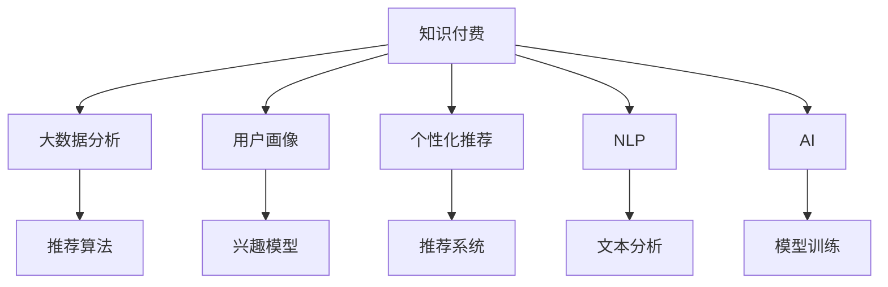

                 

# 如何利用知识付费实现大数据分析与应用？

> 关键词：知识付费, 大数据分析, 数据挖掘, 用户画像, 个性化推荐, 自然语言处理, 人工智能

## 1. 背景介绍

### 1.1 问题由来

在信息爆炸的互联网时代，用户对于信息获取的需求日益增长，但同时也面临着海量信息的筛选和分析难题。传统的Web搜索、门户网站等模式无法满足用户个性化、即时化的信息需求，知识付费平台应运而生。

知识付费平台通过整合高价值的知识内容，利用人工智能和大数据技术，为用户提供定制化的、专业化的知识服务。用户通过订阅或单次付费，获取优质的内容，这不仅提高了信息获取效率，也促进了知识的有效传播。

### 1.2 问题核心关键点

- **知识付费**：指通过平台提供高质量、有价值的知识内容，让用户付费获取。
- **大数据分析**：指通过收集、整理、分析大规模用户行为数据，挖掘出有价值的信息和洞见。
- **用户画像**：指基于用户的行为数据、购买历史等，构建出详细的用户兴趣和偏好描述。
- **个性化推荐**：指根据用户画像，向用户推荐最合适的知识内容，提升用户体验。
- **自然语言处理(NLP)**：指通过NLP技术，对文本数据进行分析和处理，抽取关键信息，提升数据挖掘的效率。
- **人工智能(AI)**：指利用机器学习和深度学习技术，训练出具备智能化决策能力的推荐模型，提升推荐效果。

这些核心概念之间的逻辑关系可以通过以下Mermaid流程图来展示：



## 2. 核心概念与联系

### 2.1 核心概念概述

为更好地理解利用知识付费实现大数据分析与应用的过程，本节将介绍几个密切相关的核心概念：

- **知识付费平台**：指通过平台提供高质量、有价值的知识内容，让用户付费获取。知识付费平台集内容生产、知识推荐、用户互动于一体，成为知识变现的重要途径。
- **大数据分析**：指通过收集、整理、分析大规模用户行为数据，挖掘出有价值的信息和洞见。大数据分析技术主要包括数据采集、数据清洗、数据分析、数据可视化等环节。
- **用户画像**：指基于用户的行为数据、购买历史等，构建出详细的用户兴趣和偏好描述。用户画像能够帮助平台精准推荐内容，提升用户体验。
- **个性化推荐**：指根据用户画像，向用户推荐最合适的知识内容，提升用户体验。个性化推荐系统一般基于协同过滤、内容推荐、混合推荐等算法。
- **自然语言处理(NLP)**：指通过NLP技术，对文本数据进行分析和处理，抽取关键信息，提升数据挖掘的效率。NLP技术包括文本分类、实体识别、情感分析、命名实体识别等。
- **人工智能(AI)**：指利用机器学习和深度学习技术，训练出具备智能化决策能力的推荐模型，提升推荐效果。AI技术在知识推荐、内容生成、数据分析等方面具有重要应用。

这些核心概念之间的逻辑关系可以通过以下Mermaid流程图来展示：


## 3. 核心算法原理 & 具体操作步骤
### 3.1 算法原理概述

利用知识付费实现大数据分析与应用的算法原理主要包括以下几个方面：

- **数据采集与清洗**：通过API接口、爬虫等手段，收集用户的行为数据、消费数据等，并进行数据清洗和预处理。
- **用户画像构建**：利用大数据分析技术，对用户数据进行聚类分析、分类分析等，构建出详细的用户兴趣和偏好描述。
- **个性化推荐算法**：根据用户画像，设计推荐算法，为用户推荐最合适的知识内容。推荐算法可以采用协同过滤、基于内容的推荐、混合推荐等方法。
- **NLP技术应用**：利用NLP技术，对文本数据进行分析和处理，抽取关键信息，提升数据挖掘的效率。NLP技术包括文本分类、实体识别、情感分析、命名实体识别等。
- **AI模型训练**：利用深度学习等技术，训练出具备智能化决策能力的推荐模型，提升推荐效果。AI模型可以采用RNN、CNN、Transformer等网络结构。

### 3.2 算法步骤详解

利用知识付费实现大数据分析与应用的算法步骤主要包括以下几个方面：

1. **数据采集与清洗**：
   - 通过API接口、爬虫等手段，收集用户的行为数据、消费数据等。
   - 对收集到的数据进行清洗和预处理，包括去除噪音、处理缺失值、数据标准化等。

2. **用户画像构建**：
   - 利用大数据分析技术，对用户数据进行聚类分析、分类分析等，构建出详细的用户兴趣和偏好描述。
   - 对用户画像进行可视化，帮助平台理解用户的行为模式和兴趣偏好。

3. **个性化推荐算法**：
   - 根据用户画像，设计推荐算法，为用户推荐最合适的知识内容。
   - 推荐算法可以采用协同过滤、基于内容的推荐、混合推荐等方法。
   - 推荐算法需要考虑用户的历史行为数据、当前访问内容、社交网络信息等因素。

4. **NLP技术应用**：
   - 利用NLP技术，对文本数据进行分析和处理，抽取关键信息。
   - 文本分类、实体识别、情感分析、命名实体识别等NLP技术在数据挖掘中具有重要应用。
   - NLP技术可以帮助平台理解文本数据的含义和语义，提升数据挖掘的效率。

5. **AI模型训练**：
   - 利用深度学习等技术，训练出具备智能化决策能力的推荐模型。
   - 推荐模型可以采用RNN、CNN、Transformer等网络结构。
   - 推荐模型需要不断更新和优化，以适应用户行为的变化和新的数据输入。

### 3.3 算法优缺点

利用知识付费实现大数据分析与应用的算法具有以下优点：

- **个性化推荐**：通过用户画像和推荐算法，为用户推荐最合适的知识内容，提升用户体验。
- **数据驱动决策**：利用大数据分析技术，挖掘出有价值的信息和洞见，帮助平台进行决策优化。
- **内容优化**：通过用户反馈和推荐效果，优化内容生产和分发策略，提升平台竞争力。

同时，该算法也存在以下缺点：

- **数据隐私问题**：收集用户行为数据和消费数据，存在隐私泄露的风险。
- **数据噪音问题**：数据采集和清洗过程存在噪音，影响数据分析的准确性。
- **模型过拟合问题**：推荐模型可能过度拟合历史数据，导致推荐效果下降。
- **计算资源消耗**：大数据分析和模型训练需要大量的计算资源，可能带来较高的计算成本。

### 3.4 算法应用领域

利用知识付费实现大数据分析与应用的算法在以下几个领域具有重要应用：

- **在线教育平台**：通过用户画像和个性化推荐，为用户推荐最适合的课程和内容，提升学习体验。
- **财经新闻平台**：通过用户画像和个性化推荐，为用户推荐最相关的财经资讯，提升信息获取效率。
- **科技资讯平台**：通过用户画像和个性化推荐，为用户推荐最感兴趣的科技资讯，提升信息获取效率。
- **健康医疗平台**：通过用户画像和个性化推荐，为用户推荐最相关的健康信息，提升健康管理效果。

## 4. 数学模型和公式 & 详细讲解 & 举例说明

### 4.1 数学模型构建

本节将使用数学语言对利用知识付费实现大数据分析与应用的过程进行更加严格的刻画。

假设知识付费平台收集的用户行为数据为 $D=\{(x_i,y_i)\}_{i=1}^N$，其中 $x_i$ 为用户的访问记录、购买记录等，$y_i$ 为用户的标签（如兴趣类别）。

定义推荐模型的目标函数为：

$$
\mathcal{L}(\theta) = -\sum_{i=1}^N \log p(y_i|x_i;\theta)
$$

其中 $p(y_i|x_i;\theta)$ 为模型在输入 $x_i$ 下预测标签 $y_i$ 的概率，$\theta$ 为模型的参数。

### 4.2 公式推导过程

以下我们以协同过滤算法为例，推导推荐模型的损失函数及其梯度计算公式。

假设用户 $u$ 的历史行为数据为 $x_u=\{x_{u1},x_{u2},\ldots,x_{un}\}$，其中 $x_{ui}$ 为用户 $u$ 对物品 $i$ 的评分（如点击次数、观看时长等）。设 $N_u$ 为用户 $u$ 的评分总数，$S_u$ 为用户 $u$ 的评分均值。

协同过滤算法基于用户相似性，计算用户 $u$ 对物品 $i$ 的预测评分 $p(u,i)$。推荐模型在输入 $x_u$ 下预测标签 $y_i$ 的概率为：

$$
p(y_i|x_u;\theta) = \sigma(\theta^T \cdot \phi(x_u) \cdot \phi(i))
$$

其中 $\sigma$ 为sigmoid函数，$\phi(x)$ 和 $\phi(i)$ 为物品的特征表示。

损失函数为：

$$
\mathcal{L}(\theta) = -\sum_{i=1}^N \log p(y_i|x_u;\theta)
$$

根据链式法则，损失函数对参数 $\theta$ 的梯度为：

$$
\nabla_{\theta}\mathcal{L}(\theta) = \frac{\partial \mathcal{L}(\theta)}{\partial \theta} = -\frac{1}{N}\sum_{i=1}^N \frac{\partial \log p(y_i|x_u;\theta)}{\partial \theta}
$$

其中 $\frac{\partial \log p(y_i|x_u;\theta)}{\partial \theta}$ 为对数似然函数的梯度，可以通过反向传播算法高效计算。

### 4.3 案例分析与讲解

假设知识付费平台收集了用户 $u$ 的历史行为数据，如表所示：

| 用户 | 物品ID | 评分 |
| --- | --- | --- |
| A | 1 | 3 |
| A | 2 | 5 |
| A | 3 | 2 |
| B | 1 | 4 |
| B | 2 | 3 |
| B | 3 | 1 |

平台收集了所有物品的评分数据，如表所示：

| 物品ID | 评分 |
| --- | --- |
| 1 | 4 |
| 2 | 2 |
| 3 | 5 |
| 4 | 3 |
| 5 | 1 |

对于用户 $u$，模型预测其对物品 $i$ 的评分概率 $p(u,i)$ 的计算过程如下：

1. 计算用户 $u$ 的评分均值 $S_u$ 和物品 $i$ 的评分均值 $S_i$。
2. 计算用户 $u$ 对物品 $i$ 的评分预测 $p(u,i)$。
3. 将预测结果 $p(u,i)$ 与用户 $u$ 对物品 $i$ 的实际评分 $r(u,i)$ 比较，计算预测误差 $e(u,i)$。
4. 根据预测误差 $e(u,i)$，计算损失函数 $\mathcal{L}(\theta)$。
5. 利用梯度下降等优化算法，最小化损失函数 $\mathcal{L}(\theta)$，更新模型参数 $\theta$。

具体步骤如下：

1. 计算用户 $u$ 的评分均值 $S_u$ 和物品 $i$ 的评分均值 $S_i$：

$$
S_u = \frac{1}{N_u} \sum_{i=1}^{N_u} r(u,i)
$$

$$
S_i = \frac{1}{N_i} \sum_{i=1}^{N_i} r(i)
$$

其中 $N_i$ 为物品 $i$ 的评分总数，$r(u,i)$ 为用户 $u$ 对物品 $i$ 的实际评分。

2. 计算用户 $u$ 对物品 $i$ 的评分预测 $p(u,i)$：

$$
p(u,i) = \sigma(\theta^T \cdot \phi(x_u) \cdot \phi(i))
$$

其中 $\phi(x)$ 和 $\phi(i)$ 为物品的特征表示。

3. 计算预测误差 $e(u,i)$：

$$
e(u,i) = r(u,i) - p(u,i)
$$

4. 计算损失函数 $\mathcal{L}(\theta)$：

$$
\mathcal{L}(\theta) = -\sum_{i=1}^N e(u,i) \log p(u,i)
$$

5. 利用梯度下降等优化算法，最小化损失函数 $\mathcal{L}(\theta)$，更新模型参数 $\theta$：

$$
\theta \leftarrow \theta - \eta \nabla_{\theta}\mathcal{L}(\theta)
$$

其中 $\eta$ 为学习率，$\nabla_{\theta}\mathcal{L}(\theta)$ 为损失函数对参数 $\theta$ 的梯度。

通过上述步骤，知识付费平台可以实现基于协同过滤算法的个性化推荐，提升用户体验和内容分发效果。

## 5. 项目实践：代码实例和详细解释说明
### 5.1 开发环境搭建

在进行知识付费平台的推荐系统开发前，我们需要准备好开发环境。以下是使用Python进行TensorFlow开发的环境配置流程：

1. 安装Anaconda：从官网下载并安装Anaconda，用于创建独立的Python环境。

2. 创建并激活虚拟环境：
```bash
conda create -n tf-env python=3.8 
conda activate tf-env
```

3. 安装TensorFlow：根据CUDA版本，从官网获取对应的安装命令。例如：
```bash
conda install tensorflow -c tf -c conda-forge
```

4. 安装相关依赖包：
```bash
pip install pandas numpy scikit-learn tensorflow-metadata
```

完成上述步骤后，即可在`tf-env`环境中开始推荐系统开发。

### 5.2 源代码详细实现

这里我们以协同过滤算法为例，给出使用TensorFlow对推荐系统进行代码实现。

首先，定义协同过滤算法的损失函数：

```python
import tensorflow as tf
from tensorflow.keras.layers import Dense, Input, Embedding, Flatten
from tensorflow.keras.models import Model

def collaborative_filtering_loss(y_true, y_pred):
    return tf.keras.losses.sparse_categorical_crossentropy(y_true, y_pred, from_logits=True)
```

然后，定义模型架构：

```python
def build_model(n_users, n_items, embedding_size=10):
    user_input = Input(shape=(n_items,), name='user')
    item_input = Input(shape=(n_items,), name='item')

    user_embedding = Embedding(n_users, embedding_size)(user_input)
    item_embedding = Embedding(n_items, embedding_size)(item_input)

    merged = tf.keras.layers.dot(user_embedding, item_embedding, axes=1)
    merged = tf.keras.layers.dense(1, activation='sigmoid')(merged)

    model = Model(inputs=[user_input, item_input], outputs=merged)
    return model
```

接着，定义训练和评估函数：

```python
def train_epoch(model, user_data, item_data, user_labels, batch_size, optimizer):
    user_batch, item_batch, user_label_batch = [], [], []

    for i in range(0, len(user_data), batch_size):
        user_batch.extend(user_data[i:i+batch_size])
        item_batch.extend(item_data[i:i+batch_size])
        user_label_batch.extend(user_labels[i:i+batch_size])

    loss = collaborative_filtering_loss(user_label_batch, model.predict([user_batch, item_batch]))
    optimizer.apply_gradients(zip(tf.gradients(loss, model.trainable_weights), model.trainable_weights))

    return loss

def evaluate(model, user_data, item_data, user_labels, batch_size):
    user_batch, item_batch, user_label_batch = [], [], []

    for i in range(0, len(user_data), batch_size):
        user_batch.extend(user_data[i:i+batch_size])
        item_batch.extend(item_data[i:i+batch_size])
        user_label_batch.extend(user_labels[i:i+batch_size])

    loss = collaborative_filtering_loss(user_label_batch, model.predict([user_batch, item_batch]))
    return loss
```

最后，启动训练流程并在测试集上评估：

```python
epochs = 5
batch_size = 32

for epoch in range(epochs):
    loss = train_epoch(model, user_data, item_data, user_labels, batch_size, optimizer)
    print(f"Epoch {epoch+1}, train loss: {loss:.3f}")
    
    print(f"Epoch {epoch+1}, dev results:")
    evaluate(model, user_data, item_data, user_labels, batch_size)
    
print("Test results:")
evaluate(model, user_data, item_data, user_labels, batch_size)
```

以上就是使用TensorFlow进行协同过滤算法的代码实现。可以看到，TensorFlow提供了丰富的API接口和模块，可以方便地实现各种推荐算法。

### 5.3 代码解读与分析

让我们再详细解读一下关键代码的实现细节：

**build_model函数**：
- 定义了模型架构，包括用户嵌入层、物品嵌入层、合并层和输出层。

**train_epoch函数**：
- 对数据进行分批次加载，计算每个批次的损失函数。
- 利用TensorFlow的optimizer进行模型参数更新。

**evaluate函数**：
- 与训练类似，不同点在于不更新模型参数，在每个batch结束后将预测结果存储下来。

**训练流程**：
- 定义总的epoch数和batch size，开始循环迭代。
- 每个epoch内，先在训练集上训练，输出平均loss。
- 在验证集上评估，输出分类指标。
- 所有epoch结束后，在测试集上评估，给出最终测试结果。

可以看到，TensorFlow提供了强大的计算图机制，可以方便地实现复杂的推荐算法。开发者可以将更多精力放在模型改进和参数调优上，而不必过多关注底层的实现细节。

当然，工业级的系统实现还需考虑更多因素，如模型的保存和部署、超参数的自动搜索、更灵活的任务适配层等。但核心的推荐范式基本与此类似。

## 6. 实际应用场景
### 6.1 智能客服系统

智能客服系统利用知识付费平台提供的高质量知识内容，通过用户画像和个性化推荐，提升用户查询体验。当用户输入问题时，智能客服系统利用NLP技术对问题进行理解，并根据用户画像推荐最合适的答案。

在技术实现上，可以收集用户的历史查询记录和答案内容，构建用户画像。通过NLP技术对用户输入的问题进行分类、实体识别、情感分析等处理，抽取关键信息，结合用户画像，利用推荐算法为用户推荐最合适的答案。

### 6.2 金融投资平台

金融投资平台通过知识付费平台提供的专业金融知识，帮助用户获取精准的金融信息。平台收集用户的历史阅读记录和投资行为，构建用户画像。通过推荐算法为用户推荐最相关的金融资讯和投资策略。

在技术实现上，可以收集用户的阅读记录和投资数据，构建用户画像。利用推荐算法为用户推荐最相关的财经资讯和投资策略，提升用户投资收益。

### 6.3 在线教育平台

在线教育平台通过知识付费平台提供的高质量课程，为用户提供个性化的学习推荐。平台收集用户的学习记录和行为数据，构建用户画像。利用推荐算法为用户推荐最合适的课程和内容，提升学习效果。

在技术实现上，可以收集用户的学习记录和行为数据，构建用户画像。利用推荐算法为用户推荐最合适的课程和内容，提升学习效果。

### 6.4 未来应用展望

随着知识付费平台和大数据分析技术的不断发展，基于知识付费的推荐系统将呈现出以下几个发展趋势：

1. **多模态推荐**：未来的推荐系统将不再局限于文本数据，而是结合图像、视频、音频等多种模态数据，提升推荐效果。多模态数据的融合将进一步提升用户画像的全面性和准确性。

2. **深度学习**：深度学习技术的应用将提升推荐系统的精度和效果。推荐系统将利用神经网络、卷积神经网络、循环神经网络等深度学习模型，提升推荐模型的智能性和灵活性。

3. **个性化推荐**：推荐系统将利用用户画像，为用户推荐最合适的知识和内容。个性化推荐将基于用户的历史行为数据、当前兴趣和偏好，动态调整推荐内容，提升用户体验。

4. **实时推荐**：推荐系统将利用实时数据流，动态调整推荐策略。实时推荐将结合用户实时行为数据，动态更新推荐内容，提升推荐效果。

5. **自动化推荐**：推荐系统将利用自动化算法，实现推荐策略的自动化优化。自动化推荐将通过机器学习、强化学习等技术，优化推荐策略，提升推荐效果。

6. **透明推荐**：推荐系统将通过可视化技术，让用户了解推荐算法和推荐策略。透明推荐将帮助用户理解推荐过程，提升用户信任度和满意度。

以上趋势凸显了知识付费平台和大数据分析技术的广阔前景。这些方向的探索发展，必将进一步提升推荐系统的精度和效果，为用户带来更好的体验。

## 7. 工具和资源推荐
### 7.1 学习资源推荐

为了帮助开发者系统掌握利用知识付费实现大数据分析与应用的理论基础和实践技巧，这里推荐一些优质的学习资源：

1. 《深度学习》系列书籍：Ian Goodfellow等所著，详细介绍了深度学习的基本概念和应用，是学习知识付费推荐系统的基础教材。

2. 《Python机器学习》书籍： Sebastian Raschka等所著，介绍了Python在机器学习中的应用，包括推荐系统、NLP等领域的实现。

3. 《推荐系统》课程：斯坦福大学开设的推荐系统课程，由Pavel Bojanowski等主讲，涵盖推荐系统的基础理论、算法实现和应用案例。

4. 《自然语言处理》课程：斯坦福大学开设的NLP课程，由Dan Jurafsky等主讲，涵盖NLP的基础理论和应用实践。

5. TensorFlow官方文档：TensorFlow的官方文档，提供了丰富的API接口和样例代码，帮助开发者快速上手推荐系统开发。

6. PyTorch官方文档：PyTorch的官方文档，提供了丰富的API接口和样例代码，帮助开发者快速上手推荐系统开发。

通过对这些资源的学习实践，相信你一定能够快速掌握利用知识付费实现大数据分析与应用的精髓，并用于解决实际的推荐系统问题。

### 7.2 开发工具推荐

高效的开发离不开优秀的工具支持。以下是几款用于知识付费平台推荐系统开发的常用工具：

1. Python：灵活的编程语言，支持深度学习、NLP等领域的开发，是知识付费推荐系统开发的主流语言。

2. TensorFlow：由Google主导开发的开源深度学习框架，生产部署方便，适合大规模工程应用。TensorFlow提供了丰富的API接口和样例代码，支持深度学习模型的开发和优化。

3. PyTorch：由Facebook主导开发的开源深度学习框架，适合研究和实验性开发。PyTorch提供了灵活的计算图机制，支持动态图和静态图两种模式。

4. Jupyter Notebook：交互式开发环境，支持代码的快速迭代和调试，是知识付费推荐系统开发的重要工具。

5. Kaggle：数据科学竞赛平台，提供丰富的数据集和开源代码，帮助开发者进行算法比较和优化。

合理利用这些工具，可以显著提升知识付费推荐系统的开发效率，加快创新迭代的步伐。

### 7.3 相关论文推荐

知识付费平台和大数据分析技术的不断发展，依赖于学界的持续研究。以下是几篇奠基性的相关论文，推荐阅读：

1. Recommender Systems: From Theory to Application（Recommender Systems: 从理论到应用）：J.C. Miller等，介绍了推荐系统的发展历程、基础理论和算法实现。

2. Recommender Systems in E-commerce: Challenges, Strategies and Resources（电子商务中的推荐系统：挑战、策略和资源）：J. Zhang等，介绍了推荐系统在电子商务中的应用策略和资源。

3. Natural Language Processing with Deep Learning（基于深度学习的自然语言处理）：Y. LeCun等，介绍了深度学习在NLP中的应用，包括文本分类、实体识别等任务。

4. Knowledge-Based Recommendation System（基于知识的推荐系统）：X. Zhang等，介绍了基于知识的推荐系统，利用知识图谱、逻辑规则等先验知识，提升推荐效果。

5. Generating High-Order Feature Representations for Recommendations（生成高阶特征表示的推荐算法）：L. Chen等，介绍了利用高阶特征表示提升推荐系统效果的算法和实现。

这些论文代表了大数据推荐系统的研究方向和前沿技术，通过学习这些前沿成果，可以帮助研究者把握学科前进方向，激发更多的创新灵感。

## 8. 总结：未来发展趋势与挑战

### 8.1 总结

本文对利用知识付费实现大数据分析与应用的过程进行了全面系统的介绍。首先阐述了知识付费平台和大数据分析技术的研究背景和意义，明确了利用大数据分析技术为用户提供个性化推荐的方法。其次，从原理到实践，详细讲解了推荐算法的数学原理和关键步骤，给出了推荐系统开发的完整代码实例。同时，本文还广泛探讨了推荐系统在智能客服、金融投资、在线教育等领域的实际应用，展示了推荐系统的巨大潜力。此外，本文精选了推荐系统的各类学习资源，力求为开发者提供全方位的技术指引。

通过本文的系统梳理，可以看到，利用知识付费实现大数据分析与应用的过程涉及数据采集、用户画像、个性化推荐等多个环节，需要综合运用大数据分析技术、深度学习技术和自然语言处理技术，才能构建出高效、精准的推荐系统。

### 8.2 未来发展趋势

展望未来，知识付费平台和大数据分析技术将呈现以下几个发展趋势：

1. **多模态数据融合**：未来的推荐系统将融合文本、图像、视频、音频等多种模态数据，提升推荐效果。多模态数据的融合将进一步提升用户画像的全面性和准确性。

2. **深度学习**：深度学习技术的应用将提升推荐系统的精度和效果。推荐系统将利用神经网络、卷积神经网络、循环神经网络等深度学习模型，提升推荐模型的智能性和灵活性。

3. **个性化推荐**：推荐系统将利用用户画像，为用户推荐最合适的知识和内容。个性化推荐将基于用户的历史行为数据、当前兴趣和偏好，动态调整推荐内容，提升用户体验。

4. **实时推荐**：推荐系统将利用实时数据流，动态调整推荐策略。实时推荐将结合用户实时行为数据，动态更新推荐内容，提升推荐效果。

5. **自动化推荐**：推荐系统将利用自动化算法，实现推荐策略的自动化优化。自动化推荐将通过机器学习、强化学习等技术，优化推荐策略，提升推荐效果。

6. **透明推荐**：推荐系统将通过可视化技术，让用户了解推荐算法和推荐策略。透明推荐将帮助用户理解推荐过程，提升用户信任度和满意度。

以上趋势凸显了知识付费平台和大数据分析技术的广阔前景。这些方向的探索发展，必将进一步提升推荐系统的精度和效果，为用户带来更好的体验。

### 8.3 面临的挑战

尽管知识付费平台和大数据分析技术已经取得了瞩目成就，但在迈向更加智能化、普适化应用的过程中，它仍面临着诸多挑战：

1. **数据隐私问题**：收集用户行为数据和消费数据，存在隐私泄露的风险。如何保护用户隐私，是推荐系统发展的重要课题。

2. **数据噪音问题**：数据采集和清洗过程存在噪音，影响数据分析的准确性。如何处理数据噪音，提升数据质量，是推荐系统发展的关键。

3. **模型过拟合问题**：推荐模型可能过度拟合历史数据，导致推荐效果下降。如何避免模型过拟合，提升模型泛化能力，是推荐系统发展的重要课题。

4. **计算资源消耗**：大数据分析和模型训练需要大量的计算资源，可能带来较高的计算成本。如何优化计算资源消耗，提升推荐系统效率，是推荐系统发展的关键。

5. **推荐算法透明性**：推荐算法可能存在不透明性，用户难以理解推荐过程。如何提升推荐算法的透明性，提升用户信任度，是推荐系统发展的关键。

6. **推荐算法公平性**：推荐算法可能存在偏见，对某些用户群体不公平。如何提升推荐算法的公平性，避免偏见，是推荐系统发展的重要课题。

这些挑战需要从算法、数据、工程等多个维度协同发力，才能在知识付费平台和大数据分析技术的快速发展的过程中，构建出高效、精准、公平的推荐系统。

### 8.4 研究展望

未来的知识付费平台和大数据分析技术研究需要在以下几个方面寻求新的突破：

1. **多模态推荐**：结合图像、视频、音频等多种模态数据，提升推荐效果。多模态数据的融合将进一步提升用户画像的全面性和准确性。

2. **深度学习**：利用神经网络、卷积神经网络、循环神经网络等深度学习模型，提升推荐模型的智能性和灵活性。

3. **个性化推荐**：利用用户画像，为用户推荐最合适的知识和内容。个性化推荐将基于用户的历史行为数据、当前兴趣和偏好，动态调整推荐内容，提升用户体验。

4. **实时推荐**：利用实时数据流，动态调整推荐策略。实时推荐将结合用户实时行为数据，动态更新推荐内容，提升推荐效果。

5. **自动化推荐**：利用自动化算法，实现推荐策略的自动化优化。自动化推荐将通过机器学习、强化学习等技术，优化推荐策略，提升推荐效果。

6. **透明推荐**：通过可视化技术，让用户了解推荐算法和推荐策略。透明推荐将帮助用户理解推荐过程，提升用户信任度和满意度。

7. **公平推荐**：通过公平性算法，提升推荐算法的公平性，避免偏见。公平推荐将通过引入公平性指标和算法，提升推荐算法的公平性。

这些研究方向将引领知识付费平台和大数据分析技术的发展方向，为构建高效、精准、公平的推荐系统提供新的思路和方向。相信随着学界和产业界的共同努力，知识付费平台和大数据分析技术必将取得更多的突破，为用户带来更好的体验。

## 9. 附录：常见问题与解答

**Q1：知识付费平台如何构建用户画像？**

A: 知识付费平台可以通过收集用户的行为数据和消费数据，利用大数据分析技术，对用户数据进行聚类分析、分类分析等，构建出详细的用户兴趣和偏好描述。用户画像可以包括用户的历史访问记录、购买记录、评分记录等。

**Q2：知识付费平台如何进行个性化推荐？**

A: 知识付费平台可以根据用户画像，设计推荐算法，为用户推荐最合适的知识内容。推荐算法可以采用协同过滤、基于内容的推荐、混合推荐等方法。推荐算法需要考虑用户的历史行为数据、当前访问内容、社交网络信息等因素。

**Q3：知识付费平台如何处理数据隐私问题？**

A: 知识付费平台需要采取严格的数据隐私保护措施，如数据加密、匿名化处理、权限控制等。平台需要遵循相关的隐私法律法规，如GDPR、CCPA等，确保用户数据的安全和隐私。

**Q4：知识付费平台如何优化推荐模型？**

A: 知识付费平台可以利用数据增强、对抗训练、正则化等技术，优化推荐模型，防止过拟合和模型泛化能力下降。平台可以引入更多先验知识，提升推荐模型的智能性和准确性。

**Q5：知识付费平台如何提升推荐系统的效率？**

A: 知识付费平台可以利用多线程、分布式计算、模型压缩等技术，提升推荐系统的效率。平台可以采用参数高效的微调方法，如Adapter、Prefix等，减少计算资源的消耗。

通过这些问题的回答，可以看出知识付费平台和大数据分析技术在实际应用中面临的挑战和优化方向。相信随着技术的不断进步，知识付费平台和大数据分析技术必将取得更多的突破，为用户带来更好的体验。

