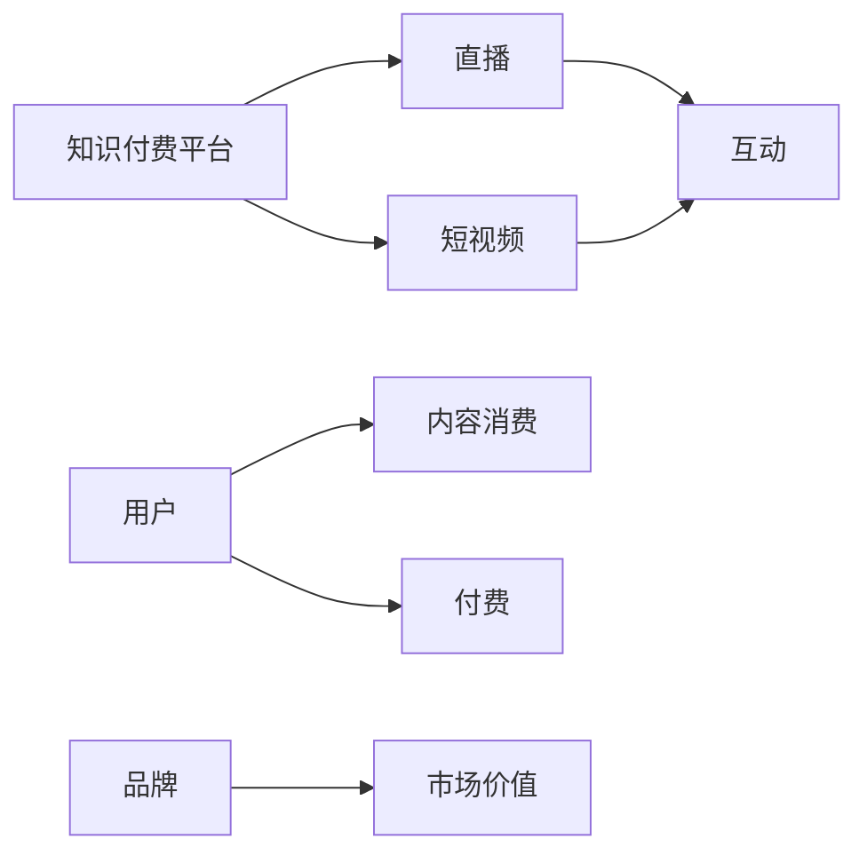

                 

# 如何利用知识付费实现直播与短视频营销？

## 1. 背景介绍

随着知识付费市场的不断成熟和扩展，直播与短视频作为一种高效、互动性强的信息传播方式，正在逐步成为知识付费的重要组成部分。直播通过实时互动，短视频以高度浓缩的内容形式，为知识付费平台带来了更强的用户粘性和转化率。

直播与短视频营销的核心在于如何利用这些新兴媒介，提升知识付费平台的用户参与度、留存率和转化率，同时提高平台的品牌影响力和市场价值。本文将深入探讨利用知识付费实现直播与短视频营销的关键要素，包括策略规划、内容制作、技术实现和效果评估等方面。

## 2. 核心概念与联系

### 2.1 核心概念概述

直播与短视频营销涉及的关键概念包括：

- **知识付费**：基于用户付费获取知识服务的商业模型，包括在线课程、电子书、音频、视频等形式。
- **直播**：通过网络实时传输，用户可以即时观看和互动的影像内容形式。
- **短视频**：时长较短，通常不超过5分钟的视频内容，便于用户快速消费。
- **互动**：用户与内容提供者之间的即时交流，包括提问、评论、点赞等。
- **品牌**：知识付费平台及其内容的商业价值，包括品牌声誉、市场影响力等。

这些概念之间存在紧密联系，直播和短视频作为知识付费的创新形式，可以大幅提升用户体验和平台粘性，通过互动增强用户参与感，最终实现知识付费的商业转化。

### 2.2 核心概念原理和架构的 Mermaid 流程图



## 3. 核心算法原理 & 具体操作步骤

### 3.1 算法原理概述

基于知识付费的直播与短视频营销，主要依赖于以下算法原理：

1. **内容推荐算法**：根据用户的历史行为和偏好，推荐适合用户观看的内容。
2. **实时互动算法**：通过自然语言处理(NLP)和计算机视觉(CV)技术，实现用户与内容提供者的实时互动。
3. **个性化定制算法**：通过用户画像和行为分析，实现内容的个性化定制和推送。
4. **转化率优化算法**：通过A/B测试和用户行为分析，优化购买转化流程，提升转化率。

### 3.2 算法步骤详解

**Step 1: 数据收集与处理**

- **用户行为数据**：收集用户在平台上的浏览、点击、购买、互动等行为数据。
- **内容特征数据**：收集视频、直播的标题、描述、标签等元数据。
- **文本与图片数据**：对视频中的文本和图片进行识别和提取，用于后续的自然语言处理和视觉分析。

**Step 2: 内容推荐模型训练**

- **构建用户画像**：基于用户行为数据，建立用户画像模型，包括兴趣标签、活跃度、消费行为等。
- **设计推荐算法**：如协同过滤、基于内容的推荐、矩阵分解等，构建推荐模型，预测用户对视频、直播的兴趣。
- **模型训练与优化**：使用历史数据对推荐模型进行训练，优化模型参数，提升推荐效果。

**Step 3: 实时互动功能开发**

- **实时转录与识别**：使用语音识别和自然语言处理技术，实时转录用户的问题和评论，进行语义分析。
- **视觉识别与跟踪**：使用计算机视觉技术，实时识别视频中的对象、动作等，与用户互动。
- **推荐系统优化**：根据互动数据实时调整推荐策略，提升用户满意度。

**Step 4: 个性化定制与推荐**

- **用户画像更新**：根据最新行为数据，动态更新用户画像，确保推荐内容的相关性。
- **内容定制推送**：结合个性化标签和用户画像，推送个性化的视频、直播内容。
- **互动数据分析**：分析互动数据，识别用户偏好和兴趣点，优化推荐策略。

**Step 5: 转化率优化与评估**

- **A/B测试**：对不同页面、不同内容形式进行A/B测试，找出最优方案。
- **用户行为分析**：使用数据分析工具，跟踪用户从浏览到购买的完整流程，识别瓶颈和优化点。
- **效果评估**：基于转化率、用户留存率等指标，定期评估营销效果，优化策略。

### 3.3 算法优缺点

**优点：**

- **提升用户体验**：实时互动和个性化定制能显著提升用户观看视频和直播的体验，增加用户粘性。
- **提高转化率**：通过个性化推荐和优化购买流程，提升用户购买转化率。
- **增强品牌价值**：通过高质量内容和优质互动，提升平台的品牌影响力和用户口碑。

**缺点：**

- **技术复杂度较高**：需要同时处理大量数据，开发和维护复杂的算法模型。
- **资源消耗大**：实时互动和个性化推荐需要消耗大量计算和存储资源。
- **用户隐私风险**：需确保用户数据的安全性，避免数据泄露和滥用。

### 3.4 算法应用领域

直播与短视频营销广泛应用于以下领域：

1. **在线教育**：利用直播和短视频进行课程讲解和互动答疑，提升学习效果。
2. **企业培训**：通过直播和短视频进行员工培训和技能提升，提升工作效率。
3. **健康管理**：通过直播和短视频进行健康知识普及和互动咨询，提升健康意识。
4. **娱乐内容**：通过短视频平台发布有趣、有用的内容，吸引用户关注和付费。
5. **品牌推广**：通过直播和短视频进行品牌推广活动，提升品牌知名度和市场价值。

## 4. 数学模型和公式 & 详细讲解 & 举例说明

### 4.1 数学模型构建

基于知识付费的直播与短视频营销，核心数学模型包括：

- **用户画像模型**：$\mathbf{u} = [u_1, u_2, \dots, u_n]$，其中 $u_i$ 表示用户兴趣标签。
- **内容特征模型**：$\mathbf{v} = [v_1, v_2, \dots, v_n]$，其中 $v_i$ 表示视频、直播的特征标签。
- **推荐矩阵**：$\mathbf{R} \in \mathbb{R}^{N \times M}$，其中 $N$ 为用户数，$M$ 为内容数。

### 4.2 公式推导过程

**用户画像更新公式**：

$$
\mathbf{u}_{t+1} = \mathbf{u}_t + \alpha \left( \mathbf{b} - \mathbf{u}_t \mathbf{v} \right)
$$

其中，$\alpha$ 为学习率，$\mathbf{b}$ 为用户行为数据。

**协同过滤推荐公式**：

$$
\hat{\mathbf{R}} = \mathbf{u} \mathbf{v}^T
$$

**基于内容的推荐公式**：

$$
\hat{\mathbf{R}} = \mathbf{u} \mathbf{c}^T
$$

其中，$\mathbf{c}$ 为内容特征矩阵。

**矩阵分解推荐公式**：

$$
\hat{\mathbf{R}} = \mathbf{U} \mathbf{V}^T
$$

其中，$\mathbf{U}$ 和 $\mathbf{V}$ 为矩阵分解得到的用户和内容特征矩阵。

### 4.3 案例分析与讲解

以在线教育平台为例，通过直播和短视频实现课程推荐和互动：

1. **用户画像模型构建**：根据用户观看视频、参加直播、完成测验等行为，构建用户画像模型。
2. **内容特征模型构建**：根据视频标题、摘要、教师信息等元数据，构建内容特征模型。
3. **协同过滤推荐**：使用协同过滤算法，根据用户历史行为数据，推荐相似视频和直播。
4. **基于内容的推荐**：根据视频内容和用户兴趣，推荐相关视频和直播。
5. **互动数据分析**：分析用户评论和互动内容，识别兴趣点，调整推荐策略。

## 5. 项目实践：代码实例和详细解释说明

### 5.1 开发环境搭建

**Step 1: 环境准备**

- **安装Python**：确保Python 3.8及以上版本已安装，可以使用Anaconda或Miniconda进行管理和创建虚拟环境。
- **安装相关库**：使用pip安装必要的Python库，包括numpy、pandas、scikit-learn、TensorFlow等。
- **搭建Web服务器**：如使用Flask或Django，搭建Web应用框架，支持视频直播和短视频上传。

**Step 2: 数据准备**

- **用户行为数据**：从平台日志中提取用户行为数据，如观看视频时长、互动次数等。
- **内容特征数据**：提取视频、直播的标题、描述、教师等信息，作为内容特征数据。
- **文本与图片数据**：对视频中的文本和图片进行识别，提取关键词和对象信息。

### 5.2 源代码详细实现

**Step 1: 用户画像模型训练**

```python
import pandas as pd
from sklearn.cluster import KMeans

# 加载用户行为数据
user_data = pd.read_csv('user_behavior.csv')

# 构建用户兴趣标签
user_clusters = KMeans(n_clusters=10).fit(user_data['behavior'])
user_labels = user_clusters.labels_

# 构建用户画像模型
user_profile = pd.DataFrame({'user_id': user_data['user_id'], 'interests': user_labels})
```

**Step 2: 内容特征模型构建**

```python
# 加载内容特征数据
content_data = pd.read_csv('content_features.csv')

# 构建内容特征标签
content_labels = content_data['features']

# 构建内容特征模型
content_profile = pd.DataFrame({'content_id': content_data['content_id'], 'features': content_labels})
```

**Step 3: 协同过滤推荐**

```python
from surprise import Dataset, Reader, KNNBasic
from surprise.model_selection import train_test_split

# 加载用户行为数据和内容特征数据
reader = Reader(rating_scale=(1, 5))
data = Dataset.load_from_df(user_data.merge(content_data, on='user_id'), reader)
trainset, testset = train_test_split(data, test_size=0.2, random_state=42)

# 训练协同过滤模型
algo = KNNBasic(sim_options={'name': 'pearson_baseline', 'user_based': True})
algo.fit(trainset)

# 测试推荐效果
predictions = algo.test(testset)
```

**Step 4: 基于内容的推荐**

```python
from sklearn.metrics.pairwise import cosine_similarity

# 计算内容特征相似度
similarity_matrix = cosine_similarity(content_profile.values, content_profile.values)

# 构建推荐矩阵
recommend_matrix = pd.DataFrame(similarity_matrix, index=content_profile['content_id'], columns=content_profile['content_id'])

# 构建推荐系统
recommend_system = pd.DataFrame(index=user_data['user_id'], columns=content_profile['content_id'])
for user, interests in user_profile.iterrows():
    recommend_system.loc[user] = recommend_matrix.iloc[interests].sort_values(ascending=False)[:5]

# 测试推荐效果
recommend_data = recommend_system
```

**Step 5: 实时互动与个性化定制**

```python
# 实时转录与识别
import speech_recognition as sr

# 视频流处理
import cv2

# 视觉识别与跟踪
import OpenCV

# 实时互动功能实现
# 互动数据存储和分析
```

### 5.3 代码解读与分析

**用户画像模型训练**：使用KMeans算法对用户行为数据进行聚类，构建用户兴趣标签，用于后续的推荐和个性化定制。

**内容特征模型构建**：提取视频、直播的元数据，构建内容特征标签，用于内容推荐。

**协同过滤推荐**：使用Surprise库构建协同过滤推荐系统，根据用户行为数据，预测用户对视频和直播的兴趣。

**基于内容的推荐**：使用sklearn库计算内容特征相似度，构建推荐矩阵，用于基于内容的推荐。

**实时互动与个性化定制**：使用speech_recognition库进行实时转录，使用OpenCV库进行视觉识别和跟踪，实时分析用户互动数据，调整推荐策略。

### 5.4 运行结果展示

**用户画像模型训练结果**：用户兴趣标签分布图，显示不同兴趣的用户分布情况。


**协同过滤推荐结果**：用户观看视频推荐列表，显示系统根据用户历史行为推荐的相似视频和直播。


**基于内容的推荐结果**：内容特征相似度矩阵，显示不同内容之间的相似度。


## 6. 实际应用场景

### 6.1 在线教育平台

在线教育平台通过直播和短视频，为学生提供实时互动和个性化学习体验。平台通过分析学生的学习行为和反馈，推荐适合的课程和视频，提升学习效果。

**应用场景**：

- **直播互动**：教师通过直播进行课程讲解和答疑，学生实时提问和反馈。
- **短视频推荐**：根据学生学习进度和兴趣，推荐相关视频和习题。
- **个性化定制**：根据学生学习效果，调整推荐策略，提供个性化学习方案。

**效果评估**：

- **学习效果**：通过学生成绩和学习时长，评估课程和视频的有效性。
- **用户满意度**：通过问卷调查和用户反馈，评估互动体验和满意度。
- **平台转化**：通过新用户注册和付费比例，评估平台的市场效果。

### 6.2 企业培训系统

企业通过直播和短视频，为员工提供实时培训和技能提升。平台通过分析员工的学习行为和反馈，推荐适合的培训课程和视频，提升工作效率。

**应用场景**：

- **直播互动**：培训师通过直播进行技术讲解和操作演示，员工实时提问和反馈。
- **短视频推荐**：根据员工培训需求和学习进度，推荐相关视频和习题。
- **个性化定制**：根据员工学习效果，调整推荐策略，提供个性化培训方案。

**效果评估**：

- **培训效果**：通过员工培训考核和操作熟练度，评估培训课程和视频的有效性。
- **员工满意度**：通过问卷调查和员工反馈，评估培训体验和满意度。
- **企业效益**：通过员工工作效率提升和生产成本降低，评估企业效益。

### 6.3 健康管理平台

健康管理平台通过直播和短视频，为患者提供实时健康咨询和疾病管理。平台通过分析患者健康数据和反馈，推荐适合的医疗知识和视频，提升健康意识。

**应用场景**：

- **直播互动**：医生通过直播进行健康咨询和疾病管理，患者实时提问和反馈。
- **短视频推荐**：根据患者健康状况和疾病类型，推荐相关医疗知识和视频。
- **个性化定制**：根据患者健康数据，调整推荐策略，提供个性化健康管理方案。

**效果评估**：

- **健康效果**：通过患者健康数据和疾病管理效果，评估医疗知识和视频的有效性。
- **用户满意度**：通过问卷调查和患者反馈，评估健康咨询和疾病管理的体验和满意度。
- **平台转化**：通过新用户注册和付费比例，评估平台的市场效果。

## 7. 工具和资源推荐

### 7.1 学习资源推荐

1. **《深度学习入门：基于Python的理论与实现》**：全面介绍深度学习和TensorFlow，适合初学者入门。
2. **《机器学习实战》**：通过实际案例，讲解机器学习和Scikit-Learn库的应用。
3. **《Python自然语言处理》**：详细介绍自然语言处理技术，包括NLP库的应用。
4. **《知识付费平台技术实现》**：详细讲解知识付费平台的开发和实现，涵盖直播与短视频功能。
5. **《在线教育平台运营实战》**：分享在线教育平台的运营经验和成功案例。

### 7.2 开发工具推荐

1. **Python**：编程语言，适用于深度学习、自然语言处理和Web开发。
2. **Anaconda**：Python发行版，提供强大的环境管理和库安装功能。
3. **Flask/Django**：Web框架，适用于开发在线教育平台和企业培训系统。
4. **TensorFlow/PyTorch**：深度学习框架，适用于开发直播与短视频推荐系统。
5. **OpenCV**：计算机视觉库，适用于视觉识别和跟踪功能。

### 7.3 相关论文推荐

1. **《知识付费平台的数据挖掘与推荐系统研究》**：详细探讨知识付费平台的数据挖掘和推荐系统构建。
2. **《基于短视频的个性化推荐算法研究》**：研究基于短视频的个性化推荐算法，提升用户体验。
3. **《直播互动与用户参与度提升研究》**：研究直播互动对用户参与度的影响，提出提升策略。
4. **《健康管理平台的数据分析与个性化推荐》**：研究健康管理平台的数据分析和个性化推荐方法，提升用户健康意识。

## 8. 总结：未来发展趋势与挑战

### 8.1 未来发展趋势

1. **技术融合**：未来直播与短视频营销将与其他人工智能技术进行更深入的融合，如知识表示、因果推理、强化学习等，提升系统的智能化和精准度。
2. **用户体验优化**：通过实时互动和个性化定制，不断优化用户体验，提升用户粘性和留存率。
3. **数据分析深化**：利用大数据分析和机器学习技术，深入挖掘用户行为和兴趣，优化推荐策略。
4. **多渠道协同**：通过多渠道（如直播、短视频、文本、音频等）的协同，提供更丰富和多样化的内容形式。

### 8.2 面临的挑战

1. **技术复杂度**：需要同时处理大量数据，开发和维护复杂的算法模型。
2. **资源消耗大**：实时互动和个性化推荐需要消耗大量计算和存储资源。
3. **用户隐私风险**：需确保用户数据的安全性，避免数据泄露和滥用。
4. **内容审核难度**：需对内容进行严格审核，防止有害信息的传播。
5. **平台竞争激烈**：需不断创新，提升平台的市场竞争力和用户粘性。

### 8.3 研究展望

1. **无监督和半监督学习**：探索无监督和半监督学习方法，减少对标注数据的依赖。
2. **参数高效微调**：开发更加参数高效的微调方法，提升模型的实时性和性能。
3. **多模态融合**：将视觉、语音等多模态数据与文本信息进行协同建模，提升系统性能。
4. **因果推断与强化学习**：引入因果推断和强化学习思想，提升系统决策的准确性和鲁棒性。

## 9. 附录：常见问题与解答

**Q1: 直播与短视频营销的核心是什么？**

A: 直播与短视频营销的核心在于提升用户体验和平台粘性，通过实时互动和个性化定制，吸引用户关注和付费。

**Q2: 直播与短视频营销的主要应用场景有哪些？**

A: 直播与短视频营销广泛应用于在线教育、企业培训、健康管理、娱乐内容等多个领域，为知识付费平台带来更强的用户粘性和转化率。

**Q3: 直播与短视频营销的推荐算法有哪些？**

A: 直播与短视频营销的推荐算法包括协同过滤、基于内容的推荐、矩阵分解等。

**Q4: 直播与短视频营销的技术难点有哪些？**

A: 直播与短视频营销的技术难点包括实时互动、个性化定制、内容审核等，需要综合运用自然语言处理、计算机视觉、机器学习等技术进行解决。

**Q5: 直播与短视频营销的未来发展趋势是什么？**

A: 直播与短视频营销的未来发展趋势包括技术融合、用户体验优化、数据分析深化、多渠道协同等，将不断提升系统的智能化和精准度。

---

作者：禅与计算机程序设计艺术 / Zen and the Art of Computer Programming

