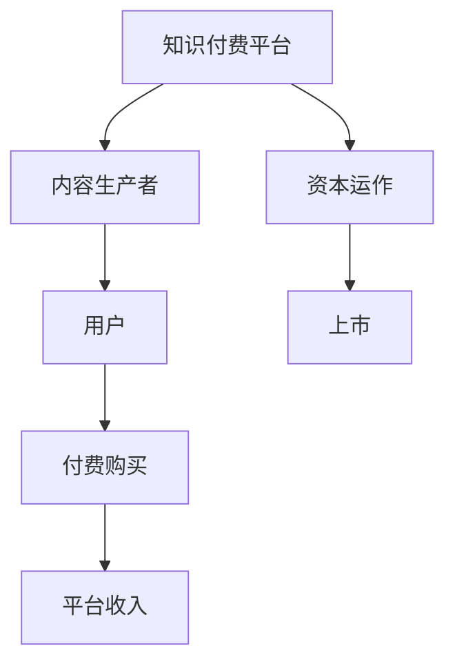

                 

# 如何利用知识付费实现资本运作与上市？

## 1. 背景介绍

随着互联网和信息技术的发展，知识付费作为一种新兴的商业模式，正在逐渐改变着人们的消费习惯和信息获取方式。知识付费平台通过提供高质量的在线课程、电子书、咨询顾问等服务，满足了用户对于知识和信息的深层次需求。同时，知识付费也成为了许多企业实现资本运作和上市的重要手段。

知识付费平台不仅能够直接带来丰厚的收入，还能够提升品牌的知名度和影响力，吸引更多的用户和投资者。然而，如何有效利用知识付费实现资本运作与上市，是一个复杂而重要的课题。本文将从核心概念、算法原理、操作步骤等多个角度，系统阐述如何通过知识付费实现资本运作与上市。

## 2. 核心概念与联系

### 2.1 核心概念概述

在知识付费领域，以下几个核心概念是不可或缺的：

- **知识付费平台**：指通过在线课程、电子书、咨询服务等形式，向用户提供有价值的知识和信息，从而收取费用的平台。

- **内容生产者**：指在知识付费平台上创作和发布内容的用户，可以是专家、学者、教师、作家等。

- **用户**：指在知识付费平台上购买、订阅、学习和使用的用户，可以是个人、企业、机构等。

- **资本运作**：指通过各种资本手段，如融资、并购、上市等，实现企业的价值提升和资产增值。

- **上市**：指企业通过证券交易所，向社会公众公开发行股票，募集资金，以实现资本市场的上市交易。

- **知识付费+资本运作**：指将知识付费与资本运作相结合，通过提供高质量的内容服务，吸引用户和投资者，从而实现企业的资本增值和上市目标。

### 2.2 核心概念原理和架构的 Mermaid 流程图



上述图表展示了一个简单的知识付费平台架构，其中内容生产者为用户提供有价值的内容，用户通过付费购买，平台获得收入，并利用这些收入进行资本运作，最终实现上市。

## 3. 核心算法原理 & 具体操作步骤

### 3.1 算法原理概述

知识付费平台的资本运作与上市，核心在于通过提供高质量的内容服务，吸引和留住用户，从而实现收入增长和资产增值。这一过程涉及多个环节，包括内容生产、用户获取、收入转化、资本运作和上市等。以下是对每个环节的详细分析：

1. **内容生产**：内容是知识付费平台的核心，内容生产者需要根据用户需求，提供高质量、多样化的内容，包括在线课程、电子书、咨询顾问等。
2. **用户获取**：平台需要采用多种手段，如搜索引擎优化、社交媒体营销、合作伙伴推广等，吸引新用户加入。
3. **收入转化**：平台通过提高用户的付费意愿，实现收入的增长。这可以通过优化定价策略、提供优惠券、推出限时优惠等手段实现。
4. **资本运作**：平台利用积累的收入，进行资本运作，如融资、并购等，提升企业的资本价值。
5. **上市**：平台通过资本运作，实现上市目标，进入资本市场，吸引更多的投资者和用户。

### 3.2 算法步骤详解

#### 3.2.1 内容生产

1. **用户需求分析**：通过数据分析，了解用户对内容的需求和偏好，设计课程和内容。
2. **内容制作**：邀请专家、学者、教师等，制作高质量的内容，确保内容的准确性和实用性。
3. **内容发布**：将内容发布到平台上，并采用SEO优化，提高内容的曝光率。

#### 3.2.2 用户获取

1. **渠道选择**：选择合适的营销渠道，如社交媒体、搜索引擎、合作伙伴等，推广平台和内容。
2. **活动策划**：策划各种活动，如免费试用、限时优惠、赠品活动等，吸引新用户注册和购买。
3. **用户反馈**：收集用户的反馈和建议，持续改进内容和平台。

#### 3.2.3 收入转化

1. **定价策略**：根据市场需求和成本，制定合理的价格策略。
2. **促销活动**：定期推出各种促销活动，提高用户的付费意愿。
3. **客户服务**：提供优质的客户服务，解决用户问题和反馈，增强用户粘性。

#### 3.2.4 资本运作

1. **融资**：通过风险投资、银行贷款等手段，获取资本注入。
2. **并购**：收购其他相关公司，扩大业务范围和市场份额。
3. **上市**：选择适合的时机和市场，申请上市，发行股票，募集资金。

#### 3.2.5 上市

1. **法律合规**：确保平台符合上市要求，包括财务、法律、信息披露等。
2. **上市准备**：准备上市材料，包括财务报表、招股说明书等。
3. **路演推广**：通过路演、媒体发布等手段，向投资者展示平台价值，吸引投资。

### 3.3 算法优缺点

#### 3.3.1 优点

1. **高收入潜力**：知识付费平台能够直接带来丰厚的收入，特别是在优质内容上。
2. **品牌效应**：通过提供高质量的内容，平台能够提升品牌知名度和影响力，吸引更多用户和投资者。
3. **资本增值**：利用资本运作手段，如融资、并购等，实现企业的资本增值。

#### 3.3.2 缺点

1. **内容生产成本高**：高质量内容的制作需要大量资源和人力投入，成本较高。
2. **用户获取难度大**：获取新用户需要大量营销和推广资源，且用户转化率难以保证。
3. **市场竞争激烈**：知识付费领域竞争激烈，平台需要不断创新和优化才能保持竞争力。

### 3.4 算法应用领域

知识付费+资本运作的方法，适用于各类知识付费平台，包括在线教育、技能培训、技术资讯、健康管理等。以下是几个典型的应用场景：

1. **在线教育平台**：通过提供优质的在线课程和咨询服务，吸引学生和家长，实现资本运作和上市。
2. **技能培训平台**：提供专业的技能培训课程，帮助用户提升职场竞争力，获取更多的培训费用和广告收入。
3. **技术资讯平台**：提供最新的技术资讯和咨询服务，吸引技术爱好者和企业用户，实现知识变现和资本增值。
4. **健康管理平台**：提供专业的健康管理和心理咨询服务，帮助用户改善健康状况，获取用户的长期付费。

## 4. 数学模型和公式 & 详细讲解 & 举例说明

### 4.1 数学模型构建

知识付费平台的收入和资本运作，可以通过以下数学模型进行描述：

- **收入模型**：平台总收入 = 用户数 × 用户平均付费 × 课程数量
- **资本运作模型**：资本增值率 = (上市后市值 - 上市前市值) / 上市前市值

### 4.2 公式推导过程

#### 4.2.1 收入模型

设平台用户数为 $U$，用户平均付费为 $P$，课程数量为 $C$，则平台总收入 $I$ 为：

$$
I = U \times P \times C
$$

其中 $U$ 和 $P$ 可以通过数据分析和市场调研得到，$C$ 是平台内容生产的关键因素。

#### 4.2.2 资本运作模型

设平台上市前的市值为 $V_1$，上市后的市值为 $V_2$，资本增值率为 $r$，则：

$$
r = \frac{V_2 - V_1}{V_1}
$$

资本增值率越高，平台的市场价值提升越明显。

### 4.3 案例分析与讲解

#### 案例分析

以Coursera平台为例，分析其知识付费+资本运作的模式：

1. **内容生产**：Coursera邀请全球顶尖大学和教授，制作高质量的在线课程，涵盖各类学科和技能。
2. **用户获取**：通过与大学合作、社交媒体推广、搜索引擎优化等手段，吸引全球数百万用户注册和使用。
3. **收入转化**：通过设定合理的课程价格和优惠活动，实现用户的高付费转化率。
4. **资本运作**：2019年Coursera完成2.45亿美元的D轮融资，2021年上市，市值超过30亿美元。

## 5. 项目实践：代码实例和详细解释说明

### 5.1 开发环境搭建

#### 5.1.1 服务器搭建

1. **服务器选择**：选择适合的服务器平台，如AWS、阿里云、腾讯云等。
2. **环境配置**：配置服务器环境，包括操作系统、数据库、开发工具等。

#### 5.1.2 数据库搭建

1. **数据库选择**：选择适合的数据库，如MySQL、PostgreSQL等。
2. **数据管理**：设计数据模型，存储用户信息、课程信息、支付记录等。

### 5.2 源代码详细实现

#### 5.2.1 用户管理模块

1. **用户注册和登录**：设计用户注册和登录接口，确保用户信息的安全性和隐私保护。
2. **用户管理**：提供用户管理功能，包括用户信息修改、密码重置等。

#### 5.2.2 课程管理模块

1. **课程发布**：设计课程发布接口，包括课程名称、描述、定价等。
2. **课程推荐**：根据用户兴趣和历史行为，推荐相关课程。

#### 5.2.3 支付管理模块

1. **支付接口**：设计支付接口，支持各种支付方式，如支付宝、微信支付等。
2. **订单管理**：管理订单信息，包括订单状态、支付状态等。

### 5.3 代码解读与分析

#### 5.3.1 用户管理模块

```python
from flask import Flask, request, jsonify

app = Flask(__name__)

# 用户注册接口
@app.route('/register', methods=['POST'])
def register():
    # 获取用户信息
    user_info = request.json
    # 数据库存储用户信息
    # ...
    return jsonify({'success': True})

# 用户登录接口
@app.route('/login', methods=['POST'])
def login():
    # 获取用户信息
    user_info = request.json
    # 数据库验证用户信息
    # ...
    return jsonify({'success': True})
```

#### 5.3.2 课程管理模块

```python
# 课程发布接口
@app.route('/course/publish', methods=['POST'])
def publish_course():
    # 获取课程信息
    course_info = request.json
    # 数据库存储课程信息
    # ...
    return jsonify({'success': True})

# 课程推荐接口
@app.route('/course/recommend', methods=['POST'])
def recommend_course():
    # 获取用户信息
    user_info = request.json
    # 根据用户兴趣推荐课程
    # ...
    return jsonify({'success': True})
```

#### 5.3.3 支付管理模块

```python
# 支付接口
@app.route('/payment', methods=['POST'])
def payment():
    # 获取支付信息
    payment_info = request.json
    # 调用支付接口
    # ...
    return jsonify({'success': True})

# 订单管理接口
@app.route('/order', methods=['POST'])
def manage_order():
    # 获取订单信息
    order_info = request.json
    # 数据库存储订单信息
    # ...
    return jsonify({'success': True})
```

### 5.4 运行结果展示

#### 5.4.1 用户管理模块

1. **用户注册和登录**：用户可以通过注册和登录功能，进入平台。
2. **用户管理**：用户可以修改个人信息，如密码、头像等。

#### 5.4.2 课程管理模块

1. **课程发布**：教师可以发布高质量的课程，供学生学习和使用。
2. **课程推荐**：平台根据用户兴趣，推荐相关课程，提高用户粘性。

#### 5.4.3 支付管理模块

1. **支付接口**：用户可以通过各种支付方式，支付课程费用。
2. **订单管理**：平台记录订单信息，方便用户查询和管理。

## 6. 实际应用场景

### 6.1 在线教育平台

在线教育平台是知识付费+资本运作的主要应用场景之一。通过提供优质的在线课程，吸引全球学生和家长，实现资本运作和上市。

#### 6.1.1 用户获取

1. **搜索引擎优化**：通过SEO优化，提高平台的曝光率，吸引新用户注册。
2. **社交媒体推广**：在各大社交媒体平台上，发布平台活动和课程信息，吸引用户关注和注册。
3. **合作伙伴推广**：与其他教育机构、学校合作，推广平台和课程。

#### 6.1.2 内容生产

1. **邀请专家和教授**：邀请全球顶尖大学和教授，制作高质量的在线课程，涵盖各类学科和技能。
2. **平台合作**：与高校和教育机构合作，获取优质课程资源。
3. **用户反馈**：收集用户反馈和评价，持续改进课程质量。

#### 6.1.3 收入转化

1. **定价策略**：根据市场需求和课程质量，制定合理的价格策略。
2. **促销活动**：定期推出各种促销活动，提高用户的付费意愿。
3. **客户服务**：提供优质的客户服务，解决用户问题和反馈，增强用户粘性。

#### 6.1.4 资本运作

1. **融资**：通过风险投资、银行贷款等手段，获取资本注入。
2. **并购**：收购其他相关公司，扩大业务范围和市场份额。
3. **上市**：选择适合的时机和市场，申请上市，发行股票，募集资金。

### 6.2 技能培训平台

技能培训平台通过提供专业的技能培训课程，帮助用户提升职场竞争力，获取更多的培训费用和广告收入。

#### 6.2.1 用户获取

1. **职业社区推广**：在各大职业社区和专业论坛上，推广平台和课程。
2. **企业合作**：与企业合作，推广平台和课程，提供企业员工培训服务。
3. **广告投放**：通过搜索引擎和社交媒体广告，吸引新用户注册和购买。

#### 6.2.2 内容生产

1. **邀请专家和教师**：邀请行业专家和教师，制作高质量的技能培训课程。
2. **课程认证**：与行业协会和认证机构合作，提供课程认证服务。
3. **用户反馈**：收集用户反馈和评价，持续改进课程质量。

#### 6.2.3 收入转化

1. **定价策略**：根据市场需求和课程质量，制定合理的价格策略。
2. **促销活动**：定期推出各种促销活动，提高用户的付费意愿。
3. **客户服务**：提供优质的客户服务，解决用户问题和反馈，增强用户粘性。

#### 6.2.4 资本运作

1. **融资**：通过风险投资、银行贷款等手段，获取资本注入。
2. **并购**：收购其他相关公司，扩大业务范围和市场份额。
3. **上市**：选择适合的时机和市场，申请上市，发行股票，募集资金。

### 6.3 技术资讯平台

技术资讯平台通过提供最新的技术资讯和咨询服务，吸引技术爱好者和企业用户，实现知识变现和资本增值。

#### 6.3.1 用户获取

1. **技术社区推广**：在各大技术社区和专业论坛上，推广平台和技术资讯。
2. **企业合作**：与企业合作，提供技术支持和咨询服务。
3. **广告投放**：通过搜索引擎和社交媒体广告，吸引新用户注册和购买。

#### 6.3.2 内容生产

1. **邀请专家和技术人员**：邀请行业专家和技术人员，提供最新的技术资讯和咨询服务。
2. **平台合作**：与技术媒体和科技公司合作，获取最新技术资讯。
3. **用户反馈**：收集用户反馈和评价，持续改进内容质量。

#### 6.3.3 收入转化

1. **定价策略**：根据市场需求和技术含量，制定合理的价格策略。
2. **促销活动**：定期推出各种促销活动，提高用户的付费意愿。
3. **客户服务**：提供优质的客户服务，解决用户问题和反馈，增强用户粘性。

#### 6.3.4 资本运作

1. **融资**：通过风险投资、银行贷款等手段，获取资本注入。
2. **并购**：收购其他相关公司，扩大业务范围和市场份额。
3. **上市**：选择适合的时机和市场，申请上市，发行股票，募集资金。

### 6.4 健康管理平台

健康管理平台通过提供专业的健康管理和心理咨询服务，帮助用户改善健康状况，获取用户的长期付费。

#### 6.4.1 用户获取

1. **健康社区推广**：在各大健康社区和专业论坛上，推广平台和健康管理服务。
2. **医院合作**：与医院和医疗机构合作，推广平台和健康管理服务。
3. **广告投放**：通过搜索引擎和社交媒体广告，吸引新用户注册和购买。

#### 6.4.2 内容生产

1. **邀请专家和医生**：邀请健康专家和医生，提供专业的健康管理和心理咨询服务。
2. **平台合作**：与医院和健康机构合作，获取优质健康管理资源。
3. **用户反馈**：收集用户反馈和评价，持续改进健康管理服务。

#### 6.4.3 收入转化

1. **定价策略**：根据市场需求和服务质量，制定合理的价格策略。
2. **促销活动**：定期推出各种促销活动，提高用户的付费意愿。
3. **客户服务**：提供优质的客户服务，解决用户问题和反馈，增强用户粘性。

#### 6.4.4 资本运作

1. **融资**：通过风险投资、银行贷款等手段，获取资本注入。
2. **并购**：收购其他相关公司，扩大业务范围和市场份额。
3. **上市**：选择适合的时机和市场，申请上市，发行股票，募集资金。

## 7. 工具和资源推荐

### 7.1 学习资源推荐

为了帮助开发者系统掌握知识付费+资本运作的理论基础和实践技巧，这里推荐一些优质的学习资源：

1. **《知识付费行业白皮书》**：全面介绍了知识付费行业的现状和未来发展趋势，是了解行业全貌的好材料。
2. **Coursera平台运营手册**：Coursera作为全球领先的在线教育平台，其运营手册详细介绍了平台的用户获取、内容生产、收入转化等关键环节，是学习知识付费平台运营的宝贵资源。
3. **《知识付费商业模式分析》**：系统分析了知识付费的商业模式，包括定价策略、营销手段、用户体验等，提供了丰富的案例和实践建议。
4. **《知识付费+资本运作》实战案例**：通过具体案例，展示知识付费+资本运作的成功经验和方法，对实战操作有很大帮助。
5. **在线课程学习平台**：如Udemy、edX、Khan Academy等，提供丰富的在线课程和学习资源，是提升知识和技能的好渠道。

### 7.2 开发工具推荐

知识付费平台的开发工具，可以帮助开发者高效、稳定地实现系统功能，以下是几款常用的开发工具：

1. **Flask**：轻量级的Web框架，适用于快速开发和部署，适合知识付费平台的开发需求。
2. **Django**：全功能的Web框架，功能强大，适合复杂的知识付费平台开发。
3. **MySQL**：广泛使用的关系型数据库，适合存储和管理用户数据。
4. **PostgreSQL**：开源的高级关系型数据库，支持复杂查询和事务处理，适合知识付费平台的高并发需求。
5. **Redis**：高性能的内存数据库，适合缓存和实时数据处理，提高系统的响应速度。

### 7.3 相关论文推荐

知识付费+资本运作的研究，源于学界的持续研究。以下是几篇奠基性的相关论文，推荐阅读：

1. **《知识付费平台用户行为分析与运营优化》**：通过数据分析和机器学习模型，对知识付费平台的用户行为进行建模和预测，指导运营优化。
2. **《知识付费平台的收入模型和优化》**：系统分析了知识付费平台的收入模型，提出了多层次的收入优化策略。
3. **《知识付费平台的内容推荐算法》**：介绍了基于协同过滤和深度学习的推荐算法，提升知识付费平台的内容推荐效果。
4. **《知识付费平台的用户获取与留存策略》**：通过用户行为分析和营销策略，提高知识付费平台的用户获取和留存率。
5. **《知识付费平台的资本运作与上市》**：详细分析了知识付费平台的资本运作流程和上市策略，提供了实用的操作建议。

这些论文代表了大语言模型微调技术的发展脉络。通过学习这些前沿成果，可以帮助研究者把握学科前进方向，激发更多的创新灵感。

## 8. 总结：未来发展趋势与挑战

### 8.1 研究成果总结

本文对知识付费+资本运作的方法进行了全面系统的介绍。从核心概念、算法原理、操作步骤等多个角度，详细阐述了如何通过知识付费实现资本运作与上市。通过系统梳理知识付费平台的运营策略和资本运作流程，希望为知识付费平台的运营者和投资者提供有价值的参考。

### 8.2 未来发展趋势

展望未来，知识付费+资本运作技术将呈现以下几个发展趋势：

1. **个性化推荐**：通过大数据和机器学习技术，实现用户个性化推荐，提高用户满意度和粘性。
2. **跨平台集成**：实现知识付费平台与其他平台的集成，提供一站式服务体验，扩大市场影响力。
3. **内容版权保护**：通过区块链和数字版权技术，保护知识产权，增强平台信誉度和用户信任感。
4. **国际化发展**：拓展海外市场，提供多语言支持和国际化服务，提升全球市场份额。
5. **社会责任与可持续发展**：通过知识付费平台，推动社会教育和知识普及，实现企业的社会价值和可持续发展。

### 8.3 面临的挑战

尽管知识付费+资本运作技术已经取得了瞩目成就，但在迈向更加智能化、普适化应用的过程中，仍面临诸多挑战：

1. **内容生产成本高**：高质量内容的制作需要大量资源和人力投入，成本较高。
2. **用户获取难度大**：获取新用户需要大量营销和推广资源，且用户转化率难以保证。
3. **市场竞争激烈**：知识付费领域竞争激烈，平台需要不断创新和优化才能保持竞争力。
4. **技术实现复杂**：知识付费平台涉及多个技术环节，需要全面考虑系统架构、数据存储、安全防护等问题。

### 8.4 研究展望

面对知识付费+资本运作所面临的挑战，未来的研究需要在以下几个方面寻求新的突破：

1. **自动化内容生产**：通过AI技术，实现自动化的内容生成和优化，降低内容制作成本。
2. **社交化知识传播**：利用社交媒体和社区平台，实现知识传播和共享，提升用户参与度。
3. **跨界融合创新**：结合区块链、云计算、大数据等前沿技术，实现知识付费平台的跨界融合，提升平台价值和用户体验。
4. **用户需求分析**：通过大数据和机器学习技术，深入分析用户需求和行为，实现个性化推荐和精准营销。
5. **市场扩展策略**：通过全球化布局和多元化市场策略，拓展海外市场，提升平台的影响力和竞争力。

这些研究方向的探索，必将引领知识付费+资本运作技术迈向更高的台阶，为知识付费平台的发展和上市提供更坚实的技术保障。

## 9. 附录：常见问题与解答

**Q1: 如何选择合适的知识付费平台？**

A: 选择合适的知识付费平台需要考虑以下因素：
1. 平台的市场规模和用户基数，选择用户数量多、市场影响力大的平台。
2. 平台的内容质量和多样化，选择提供优质、多样化课程的平台。
3. 平台的口碑和用户评价，选择用户评价高、信誉好的平台。
4. 平台的运营和商业模式，选择具备良好运营经验和盈利模式的平台。

**Q2: 如何提高知识付费平台的收入转化率？**

A: 提高知识付费平台的收入转化率，需要从以下几个方面入手：
1. 优化定价策略，根据市场需求和用户心理，制定合理的价格。
2. 提升课程质量，提供高质量、实用的课程内容。
3. 推广促销活动，定期推出各种促销和优惠活动。
4. 优化用户体验，提供优质的客户服务和产品功能。
5. 监测用户行为，通过数据分析优化课程推荐和营销策略。

**Q3: 知识付费平台如何进行资本运作？**

A: 知识付费平台的资本运作需要以下步骤：
1. 进行风险投资融资，获取初始资本注入。
2. 通过并购、合作等方式，扩大业务范围和市场份额。
3. 选择合适的上市时机和市场，申请上市，发行股票，募集资金。
4. 通过市场推广和产品优化，提升平台影响力和用户粘性。
5. 通过数据分析和财务报表，向投资者展示平台价值，吸引更多投资者。

**Q4: 知识付费平台如何实现国际化发展？**

A: 知识付费平台实现国际化发展，需要以下步骤：
1. 进行市场调研，了解目标市场的需求和特点。
2. 进行本地化运营，根据目标市场特点优化平台功能和内容。
3. 建立本地合作伙伴，拓展市场资源和渠道。
4. 利用社交媒体和广告平台，进行全球化市场推广。
5. 引入多语言支持，提供多语言内容和客服服务。

**Q5: 知识付费平台如何实现社会责任和可持续发展？**

A: 知识付费平台实现社会责任和可持续发展，需要以下措施：
1. 提供公益课程和免费资源，推动社会教育和知识普及。
2. 支持环保和公益事业，回馈社会。
3. 履行企业社会责任，提升企业形象和声誉。
4. 建立可持续的商业模式，实现长期稳定发展。
5. 加强用户隐私保护和数据安全，确保用户信息安全。

---

作者：禅与计算机程序设计艺术 / Zen and the Art of Computer Programming

