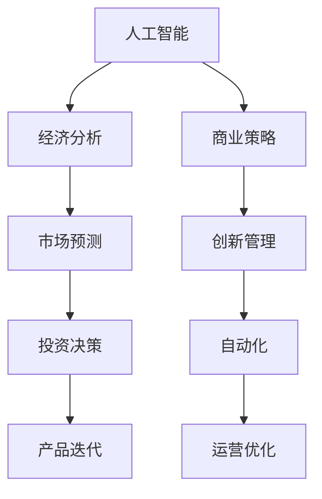

                 

# 如何在AI经济中把握商业大势

> 关键词：人工智能, 经济分析, 数据驱动, 商业策略, 创新管理, 自动化

## 1. 背景介绍

### 1.1 问题由来

人工智能（AI）正以前所未有的速度改变着全球经济的面貌。从制造到零售，从金融到医疗，AI正在深刻影响着各行各业的运营方式和商业模式。作为未来经济增长的新引擎，AI不仅带来了前所未有的机会，也提出了新的挑战。如何在AI经济中把握商业大势，成为了每个企业领导者亟需面对的问题。

### 1.2 问题核心关键点

在AI经济中，企业的成败很大程度上取决于其对AI技术的理解与应用。本文聚焦于AI在经济分析、商业策略、创新管理、自动化等方面的应用，旨在帮助企业领导者系统把握AI带来的商业大势，做出明智的战略决策。

### 1.3 问题研究意义

掌握AI经济中的商业大势，对于企业把握市场趋势、优化运营流程、提升竞争力和实现可持续发展至关重要。本文将通过理论分析与实际案例，深入探讨AI如何重塑企业竞争格局，如何通过数据驱动实现商业决策的精准化和智能化，如何借助AI提升自动化水平和创新管理效率，以期为企业提供实用的AI应用指南，助力其在AI经济中乘风破浪。

## 2. 核心概念与联系

### 2.1 核心概念概述

为更好地理解AI在经济中的作用，本节将介绍几个密切相关的核心概念：

- **人工智能（AI）**：指通过计算机模拟人的智能过程，实现感知、学习、推理、决策等功能的技术体系。
- **经济分析**：使用AI技术对经济数据进行量化分析和建模，辅助政策制定和市场预测。
- **商业策略**：基于AI分析结果，制定并实施有效的市场进入、产品开发、定价策略等。
- **创新管理**：利用AI推动组织内部的技术创新和流程优化，提升企业的创新能力。
- **自动化**：AI技术在生产、服务、管理等领域的自动化应用，以提高效率和降低成本。

这些核心概念之间的逻辑关系可以通过以下Mermaid流程图来展示：



这个流程图展示了几大核心概念之间的联系：

1. AI通过经济分析，为市场预测和投资决策提供数据支持。
2. 基于AI的经济分析结果，企业可以制定更具竞争力的商业策略。
3. 创新管理通过AI技术，推动产品迭代和流程优化。
4. 自动化应用大幅提升生产和服务效率。

这些概念共同构成了AI在经济中的作用框架，帮助企业实现全面数字化转型。

## 3. 核心算法原理 & 具体操作步骤

### 3.1 算法原理概述

AI在经济中的应用，主要依赖于数据驱动的算法模型。以下将详细介绍几个关键算法及其应用原理。

### 3.2 算法步骤详解

#### 3.2.1 经济数据分析模型

**步骤一：数据准备**
- 收集相关经济数据，包括但不限于GDP、就业率、通货膨胀率、消费者信心指数等。
- 清洗数据，处理缺失值和异常值。

**步骤二：特征工程**
- 对原始数据进行特征提取和构建，如时间序列分解、趋势分析等。
- 选择合适的特征，剔除噪声和无关特征。

**步骤三：模型构建**
- 根据数据类型和问题性质，选择适合的算法模型，如回归分析、时间序列预测、机器学习等。
- 对模型进行参数调优和交叉验证，确保模型性能。

**步骤四：结果分析**
- 分析模型输出结果，评估预测精度和稳定性。
- 利用可视化工具，直观展示模型预测结果和经济趋势。

#### 3.2.2 商业策略优化模型

**步骤一：市场分析**
- 使用AI对市场数据进行深度分析，识别市场趋势和潜在机会。
- 通过聚类分析、文本挖掘等方法，获取市场细分和用户需求洞察。

**步骤二：竞争分析**
- 应用AI进行竞争对手分析，比较不同企业的产品、定价和市场份额。
- 利用自然语言处理技术，分析社交媒体、新闻报道中的情绪和舆情。

**步骤三：策略制定**
- 基于AI分析结果，制定市场进入、产品开发、定价策略等。
- 利用模拟和优化算法，评估策略的效果和风险。

#### 3.2.3 创新管理应用模型

**步骤一：创新识别**
- 使用AI进行技术趋势和专利分析，识别行业内外的创新机会。
- 应用机器学习算法，预测技术发展的未来趋势。

**步骤二：创新筛选**
- 利用AI筛选出符合企业战略和资源条件的创新项目。
- 通过评分模型，综合评估创新项目的潜力和风险。

**步骤三：创新执行**
- 利用AI优化项目管理和团队协作，提升创新效率。
- 应用强化学习，持续迭代优化创新过程。

#### 3.2.4 自动化应用模型

**步骤一：流程优化**
- 应用AI进行业务流程分析和自动化，消除瓶颈和冗余环节。
- 利用机器学习预测流程效率，优化资源分配。

**步骤二：智能生产**
- 使用AI优化生产计划和调度，提升生产线的灵活性和效率。
- 应用深度学习算法，实现产品质量的实时监控和预测。

**步骤三：服务自动化**
- 利用AI进行客户服务和运营管理，提升客户满意度。
- 应用自然语言处理，实现智能客服和自动回复。

### 3.3 算法优缺点

#### 3.3.1 经济数据分析模型的优缺点

**优点：**
- 数据驱动，预测精度高。
- 可处理大规模复杂数据，支持多变量分析。

**缺点：**
- 对数据质量要求高，处理噪声和异常值难度大。
- 模型复杂，需要大量的计算资源和时间。

#### 3.3.2 商业策略优化模型的优缺点

**优点：**
- 精准分析市场趋势和用户需求。
- 支持多方案评估和模拟，降低决策风险。

**缺点：**
- 数据获取难度大，需大量手工标注。
- 模型依赖人工调整，易受主观因素影响。

#### 3.3.3 创新管理应用模型的优缺点

**优点：**
- 识别创新机会，支持快速决策。
- 优化资源配置，提升创新效率。

**缺点：**
- 数据收集和处理难度大，需多部门协作。
- 预测精度受数据和模型质量影响。

#### 3.3.4 自动化应用模型的优缺点

**优点：**
- 提升效率，降低成本。
- 实时响应，提高生产和服务质量。

**缺点：**
- 初期投入大，需技术支持和维护。
- 对数据的依赖性强，需要高质量的数据输入。

### 3.4 算法应用领域

AI在经济中的应用领域非常广泛，以下是几个典型的应用场景：

- **金融行业**：AI驱动的智能投顾、风险管理、反欺诈检测等，提升金融服务的效率和安全性。
- **零售业**：AI用于个性化推荐、库存管理、供应链优化等，提高运营效率和客户满意度。
- **制造业**：AI在生产计划、质量控制、设备维护等方面的应用，提升生产效率和产品质量。
- **医疗健康**：AI在疾病预测、诊断、治疗推荐等方面的应用，改善医疗服务质量。
- **农业**：AI在精准农业、农作物监测、气候预测等方面的应用，提升农业生产效率和抗风险能力。

这些应用场景展示了AI在经济中的巨大潜力和广泛应用，未来还将随着技术的不断进步和数据的积累，进一步拓展其应用范围。

## 4. 数学模型和公式 & 详细讲解  
### 4.1 数学模型构建

本节将使用数学语言对AI在经济中的应用进行更加严格的刻画。

假设经济数据集为 $D=\{(x_i,y_i)\}_{i=1}^N, x_i \in \mathcal{X}, y_i \in \mathcal{Y}$，其中 $\mathcal{X}$ 为输入空间，$\mathcal{Y}$ 为输出空间。假设经济预测模型为 $M_{\theta}:\mathcal{X} \rightarrow \mathcal{Y}$，其中 $\theta$ 为模型参数。

定义模型的损失函数为 $\ell(M_{\theta}(x),y)$，则在数据集 $D$ 上的经验风险为：

$$
\mathcal{L}(\theta) = \frac{1}{N} \sum_{i=1}^N \ell(M_{\theta}(x_i),y_i)
$$

在实际应用中，通常使用回归分析、时间序列预测等算法来构建经济模型。例如，使用线性回归模型对经济数据进行拟合：

$$
\hat{y} = \theta_0 + \sum_{j=1}^p \theta_j x_{ij}
$$

其中 $x_{ij}$ 为第 $j$ 个特征变量，$\theta_j$ 为对应的系数。

### 4.2 公式推导过程

以下我们以时间序列预测为例，推导ARIMA模型的预测公式及其参数估计。

**ARIMA模型公式：**

$$
y_t = \phi(L)y_{t-1} + \theta(L)X_t + \varepsilon_t
$$

其中 $y_t$ 为第 $t$ 时刻的预测值，$\phi(L)$ 和 $\theta(L)$ 为滞后算子，$X_t$ 为外生输入变量，$\varepsilon_t$ 为误差项。

**参数估计方法：**

1. **自回归模型（AR）：**

   $$
   y_t = \phi(L)y_{t-1} + \varepsilon_t
   $$

   其中 $\phi(L) = 1 - \phi_1 L - \phi_2 L^2 - \dots - \phi_p L^p$，$\phi_j$ 为自回归系数。

2. **差分自回归模型（AR(p)D(d))：**

   $$
   L^d y_t = \phi(L)y_{t-1}
   $$

   对 $y_t$ 进行 $d$ 阶差分，得到平稳时间序列。

3. **自回归积分滑动平均模型（ARIMA(p,d,q))：**

   $$
   (1 - \phi_1 L - \dots - \phi_p L^p)(1 - L^d)y_t = \theta(L)X_t + \varepsilon_t
   $$

   其中 $\theta(L) = \theta_1 L + \dots + \theta_k L^k$，$\theta_j$ 为外生输入系数。

通过最小化预测误差，得到参数估计值 $\hat{\theta}$。

### 4.3 案例分析与讲解

**案例一：金融风险管理**

假设某银行需要评估客户的信用风险，收集了客户的历史贷款数据 $(x_i)$ 和贷款违约概率 $(y_i)$，其中 $x_i$ 包括客户的收入、负债、信用记录等特征。使用线性回归模型对历史数据进行拟合，得到模型系数 $\theta$。对于新客户 $x$，可以预测其违约概率 $\hat{y} = M_{\theta}(x)$。

**案例二：市场趋势预测**

某零售公司需要预测未来季度的销售额，收集了历年的销售数据 $(x_i)$ 和当季销售量 $y_i$。使用ARIMA模型对历史数据进行拟合，得到模型参数 $\phi$、$\theta$ 和 $d$。对于未来季度的预测，可以计算出对应的销售额 $\hat{y} = M_{\theta}(x)$。

## 5. 项目实践：代码实例和详细解释说明
### 5.1 开发环境搭建

在进行AI项目开发前，我们需要准备好开发环境。以下是使用Python进行Scikit-learn和TensorFlow开发的简单环境配置流程：

1. 安装Anaconda：从官网下载并安装Anaconda，用于创建独立的Python环境。

2. 创建并激活虚拟环境：
```bash
conda create -n ai-env python=3.8 
conda activate ai-env
```

3. 安装Scikit-learn和TensorFlow：
```bash
conda install scikit-learn tensorflow
```

4. 安装各类工具包：
```bash
pip install numpy pandas scikit-learn matplotlib tqdm jupyter notebook ipython
```

完成上述步骤后，即可在`ai-env`环境中开始AI项目实践。

### 5.2 源代码详细实现

下面我们以时间序列预测为例，给出使用Scikit-learn进行ARIMA模型预测的Python代码实现。

```python
from sklearn.metrics import mean_squared_error
from statsmodels.tsa.arima.model import ARIMA
import pandas as pd
import matplotlib.pyplot as plt

# 读取数据
data = pd.read_csv('time_series_data.csv', index_col='date', parse_dates=True)

# 数据预处理
data = data.resample('D').mean().dropna()

# 划分训练集和测试集
train_data = data['2020-01-01':'2021-12-31']
test_data = data['2022-01-01':]

# 训练ARIMA模型
model = ARIMA(train_data, order=(1,1,1))
model_fit = model.fit()

# 预测并评估
predictions = model_fit.predict(start='2022-01-01', end='2022-12-31')
actual = test_data.values
mse = mean_squared_error(actual, predictions)
print(f'Mean Squared Error: {mse:.4f}')
```

### 5.3 代码解读与分析

让我们再详细解读一下关键代码的实现细节：

**数据预处理：**
- `data.resample('D').mean().dropna()`：对原始数据进行日均值处理，并去除缺失值，得到平稳时间序列。

**模型训练：**
- `ARIMA(train_data, order=(1,1,1))`：构建ARIMA模型，使用(1,1,1)的滞后阶数进行拟合。

**预测与评估：**
- `model_fit.predict(start='2022-01-01', end='2022-12-31')`：使用模型预测2022年的数据。
- `mean_squared_error(actual, predictions)`：计算预测结果与真实值之间的均方误差，评估模型性能。

## 6. 实际应用场景
### 6.1 金融行业

AI在金融行业的应用场景非常广泛，以下是几个典型应用案例：

**智能投顾**

某金融机构开发了基于AI的智能投顾系统，利用机器学习模型对历史市场数据进行分析，为客户提供个性化的投资建议。系统通过分析客户的风险偏好和历史交易记录，推荐适合其风险承受能力的投资组合。

**风险管理**

某银行应用AI进行风险管理，使用深度学习算法对客户贷款数据进行建模，识别潜在的违约风险。系统通过分析客户的信用记录、财务状况和行为数据，预测客户未来的违约概率，辅助贷款审批和风险控制。

**反欺诈检测**

某支付平台开发了AI反欺诈系统，利用异常检测和行为分析技术，实时监测交易数据中的异常行为。系统通过分析交易模式、交易时间等特征，识别并阻止潜在的欺诈行为。

### 6.2 零售业

AI在零售业的应用场景也非常丰富，以下是几个典型应用案例：

**个性化推荐**

某电商平台应用AI进行个性化推荐，利用协同过滤和深度学习模型，分析用户的历史浏览和购买行为，推荐用户可能感兴趣的商品。系统通过分析用户特征和商品特征，提高推荐精准度和用户满意度。

**库存管理**

某零售公司应用AI进行库存管理，使用预测模型对销售数据进行分析，优化库存水平和补货策略。系统通过分析历史销售数据和市场趋势，预测未来的销售量和库存需求，辅助库存管理和供应链优化。

**价格优化**

某零售企业应用AI进行价格优化，利用机器学习模型对市场价格数据进行分析，制定动态定价策略。系统通过分析竞争对手的价格、市场供需关系和客户支付意愿，调整商品价格，提升销售额和利润率。

### 6.3 制造业

AI在制造业的应用场景同样广泛，以下是几个典型应用案例：

**生产计划**

某制造企业应用AI进行生产计划优化，使用预测模型对生产数据进行分析，优化生产计划和调度。系统通过分析生产线的设备状态、生产负荷和原材料库存，预测生产需求和资源瓶颈，优化生产计划和调度。

**质量控制**

某汽车制造企业应用AI进行质量控制，利用机器学习模型对生产数据进行分析，检测和预测生产缺陷。系统通过分析生产线和设备数据，识别异常和潜在缺陷，提高产品质量和生产效率。

**设备维护**

某工程机械企业应用AI进行设备维护，使用预测模型对设备数据进行分析，优化设备维护计划和策略。系统通过分析设备的运行状态、维护记录和环境数据，预测设备故障和维护需求，优化设备维护计划。

### 6.4 医疗健康

AI在医疗健康领域的应用同样具有巨大潜力，以下是几个典型应用案例：

**疾病预测**

某医院应用AI进行疾病预测，利用机器学习模型对病历数据进行分析，预测患者未来可能患上的疾病。系统通过分析患者的病史、基因数据和生活习惯，预测患病风险，辅助医生制定预防和治疗方案。

**诊断支持**

某影像诊断公司应用AI进行诊断支持，利用深度学习模型对医学影像进行分析，辅助医生进行疾病诊断。系统通过分析医学影像数据，识别和定位病变区域，提供诊断建议和参考。

**治疗推荐**

某药物研发公司应用AI进行治疗推荐，利用机器学习模型对临床数据进行分析，推荐最适合患者的治疗方案。系统通过分析患者数据和药物数据，预测治疗效果和副作用，辅助医生制定治疗方案。

## 7. 工具和资源推荐
### 7.1 学习资源推荐

为了帮助开发者系统掌握AI在经济中的应用，这里推荐一些优质的学习资源：

1. **《机器学习》课程（Coursera）**：由斯坦福大学教授Andrew Ng主讲，系统介绍了机器学习的基本概念和算法，涵盖线性回归、分类、聚类等主题。

2. **《深度学习》课程（Coursera）**：由深度学习领域权威Ian Goodfellow主讲，深入讲解了深度学习的基本原理和应用，包括神经网络、卷积神经网络、循环神经网络等。

3. **《Python数据科学手册》（O'Reilly）**：由Jake VanderPlas撰写，全面介绍了Python在数据科学和机器学习中的应用，涵盖数据处理、统计分析、机器学习等主题。

4. **《Python机器学习实战》（O'Reilly）**：由Sebastian Raschka撰写，提供大量实战案例，帮助读者掌握Python在机器学习项目中的应用。

5. **Kaggle平台**：全球最大的数据科学竞赛平台，提供丰富的数据集和开源代码，支持学习和交流。

通过对这些资源的学习实践，相信你一定能够快速掌握AI在经济中的应用，并用于解决实际的商业问题。

### 7.2 开发工具推荐

高效的开发离不开优秀的工具支持。以下是几款用于AI项目开发的常用工具：

1. **Jupyter Notebook**：开源的交互式编程环境，支持Python、R等多种编程语言，方便代码开发和数据可视化。

2. **TensorFlow**：由Google主导开发的深度学习框架，支持分布式训练和优化，适合大规模工程应用。

3. **PyTorch**：Facebook开发的深度学习框架，灵活易用，支持动态图和静态图计算。

4. **Scikit-learn**：开源的机器学习库，提供大量经典算法的实现，支持数据预处理、特征工程、模型评估等。

5. **Tableau**：数据可视化工具，支持快速生成各种图表和报表，帮助数据洞察和决策支持。

合理利用这些工具，可以显著提升AI项目开发的效率，加快创新迭代的步伐。

### 7.3 相关论文推荐

AI在经济中的应用源于学界的持续研究。以下是几篇奠基性的相关论文，推荐阅读：

1. **《Google AI的TensorFlow白皮书》（Google）**：详细介绍了TensorFlow的架构和应用，提供丰富的实际案例和开发指南。

2. **《深度学习》（Ian Goodfellow, Yoshua Bengio和Aaron Courville）**：深度学习领域的经典教材，系统讲解了深度学习的基本原理和应用。

3. **《机器学习实战》（Peter Harrington）**：提供大量实际案例和代码实现，帮助读者掌握机器学习项目开发的实践技巧。

4. **《机器学习》（Tom Mitchell）**：机器学习领域的经典教材，涵盖经典算法和实际应用。

这些论文代表了大规模应用背景下的AI发展脉络，通过学习这些前沿成果，可以帮助研究者把握学科前进方向，激发更多的创新灵感。

## 8. 总结：未来发展趋势与挑战
### 8.1 总结

本文对AI在经济中的应用进行了全面系统的介绍。首先阐述了AI在经济分析、商业策略、创新管理、自动化等方面的研究背景和实际案例，明确了AI在经济中的应用方向和价值。其次，从原理到实践，详细讲解了ARIMA模型、智能投顾、风险管理等关键算法的实现过程和应用场景，提供了实用的AI应用指南。最后，通过对学习资源和开发工具的推荐，帮助读者系统掌握AI在经济中的应用。

通过本文的系统梳理，可以看到，AI技术在经济中已经展示了巨大的潜力和广泛的应用场景，必将深刻改变各行各业的运营方式和商业模式。未来，伴随技术的不断进步和数据的积累，AI将在更多领域得到应用，为人类经济社会发展带来新的机遇和挑战。

### 8.2 未来发展趋势

展望未来，AI在经济中的应用将呈现以下几个发展趋势：

1. **数据驱动决策的普及**：随着大数据和云计算技术的发展，数据驱动决策将变得更加普及和高效。企业将利用AI进行市场预测、客户分析、运营优化等，提升决策的精准性和速度。

2. **个性化服务的提升**：AI将进一步提升个性化服务水平，利用自然语言处理和推荐算法，实现智能客服、个性化推荐、精准营销等，提升客户满意度和忠诚度。

3. **自动化流程的优化**：AI将优化企业内部的自动化流程，利用机器学习进行生产调度、库存管理、质量控制等，提升运营效率和资源利用率。

4. **跨领域融合的加速**：AI将与其他技术进行深度融合，如区块链、物联网、人工智能等，形成更加综合、多维度的智能解决方案，推动产业升级和经济转型。

5. **伦理和安全性的重视**：AI在应用过程中，将更加重视伦理和安全问题，如隐私保护、数据隐私、算法透明等，构建更加安全、可控的智能系统。

### 8.3 面临的挑战

尽管AI在经济中的应用已经取得了显著进展，但在迈向更加智能化、普适化应用的过程中，仍面临诸多挑战：

1. **数据质量和安全问题**：数据质量、数据安全和隐私保护仍然是AI应用中需要重点解决的问题。低质量、不完整的数据将影响AI模型的性能和可靠性。

2. **技术复杂性和资源消耗**：AI模型的训练和应用需要大量的计算资源和时间，初期投入大，技术复杂度高，对企业的技术能力和资源配置提出挑战。

3. **模型解释和透明度**：AI模型的复杂性和黑盒特性，使其决策过程难以解释和理解。如何提高AI模型的透明度和可解释性，将是未来亟需解决的问题。

4. **伦理和社会责任**：AI应用过程中可能存在算法偏见、歧视性等问题，如何避免这些问题，确保AI技术应用的公平性和伦理性，是企业和社会需要共同关注的重要话题。

5. **法规和政策的不确定性**：AI技术的快速发展和广泛应用，可能引发一系列法律法规和政策问题，如数据隐私、人工智能伦理等，需要政府和企业在实践中不断探索和完善。

### 8.4 研究展望

面对AI应用中的挑战，未来的研究需要在以下几个方面寻求新的突破：

1. **数据治理和隐私保护**：建立数据质量评估和治理机制，确保数据的安全和隐私保护，提升数据驱动决策的可靠性。

2. **模型解释和透明化**：开发模型解释工具和框架，提高AI模型的透明度和可解释性，增强用户信任和接受度。

3. **跨领域融合技术**：推动AI与其他技术进行深度融合，形成更加综合、多维度的智能解决方案，推动产业升级和经济转型。

4. **伦理和社会责任框架**：构建AI应用的伦理和社会责任框架，确保技术应用的公平性、透明性和可控性。

这些研究方向将引领AI在经济中的持续发展和应用，为构建智能、公平、可控的未来经济提供有力支持。面向未来，只有不断创新和突破，才能确保AI技术在经济中的应用价值得到充分发挥，为人类经济社会发展带来新的动力和机遇。

## 9. 附录：常见问题与解答
**Q1：AI在经济中的应用具体有哪些？**

A: AI在经济中的应用广泛，具体包括但不限于以下几个方面：

1. **金融行业**：智能投顾、风险管理、反欺诈检测等。
2. **零售业**：个性化推荐、库存管理、价格优化等。
3. **制造业**：生产计划、质量控制、设备维护等。
4. **医疗健康**：疾病预测、诊断支持、治疗推荐等。

**Q2：如何选择合适的AI算法？**

A: 选择AI算法需要考虑以下几个因素：

1. **数据类型和问题性质**：根据数据类型和问题性质选择合适的算法，如回归分析、分类、聚类等。
2. **数据规模和特征维度**：对于大规模、高维数据，选择高效的算法，如随机森林、深度学习等。
3. **模型复杂度和可解释性**：根据应用场景和需求，选择复杂度适中、可解释性强的算法，如线性回归、决策树等。
4. **资源和时间限制**：考虑计算资源和时间的限制，选择适合的任务和算法。

**Q3：AI应用过程中如何处理数据质量问题？**

A: 处理数据质量问题主要从以下几个方面入手：

1. **数据清洗**：对数据进行去重、去噪、填补缺失值等预处理。
2. **特征工程**：选择和构建高质量的特征，去除噪声和无关特征。
3. **数据增强**：利用数据增强技术，扩充训练集，提升模型鲁棒性。
4. **异常检测**：对数据进行异常检测和处理，确保数据质量。

**Q4：AI应用中如何确保模型的可解释性？**

A: 确保模型可解释性主要从以下几个方面入手：

1. **模型简化**：使用简单模型或可解释性强的算法，如线性回归、决策树等。
2. **模型解释工具**：利用模型解释工具，如LIME、SHAP等，生成模型输出解释。
3. **可视化分析**：通过可视化工具，展示模型决策过程和关键特征，提高模型透明度。
4. **模型优化**：通过优化模型结构，提升模型的可解释性，如剪枝、降维等。

通过以上方法，可以有效提升AI模型的可解释性，增强用户信任和接受度。

**Q5：AI在经济中的应用未来将如何发展？**

A: AI在经济中的应用未来将呈现以下几个发展趋势：

1. **数据驱动决策的普及**：数据驱动决策将变得更加普及和高效。
2. **个性化服务的提升**：个性化服务水平将进一步提升，实现智能客服、个性化推荐、精准营销等。
3. **自动化流程的优化**：AI将优化企业内部的自动化流程，提升运营效率和资源利用率。
4. **跨领域融合的加速**：AI将与其他技术进行深度融合，形成更加综合、多维度的智能解决方案。
5. **伦理和安全性的重视**：AI应用过程中将更加重视伦理和社会责任问题，确保技术应用的公平性和透明性。

---

作者：禅与计算机程序设计艺术 / Zen and the Art of Computer Programming

