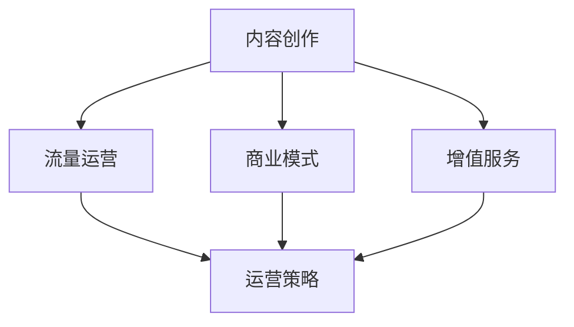

                 

# 如何打造个人知识付费品牌IP

> 关键词：知识付费、品牌建设、IP打造、个人品牌、内容创作、流量运营、商业模式、增值服务

## 1. 背景介绍

在信息爆炸、知识快速迭代的时代，个人知识付费品牌IP成为了新时代下构建个人竞争力的重要手段。无论是技术人员、营销专家还是创业者，都能通过个人知识付费品牌IP实现自我价值最大化，创造出不可复制的商业价值。本文将从品牌构建、内容创作、流量运营、商业模式、增值服务等多个维度，详细探讨如何打造个人知识付费品牌IP。

### 1.1 问题由来
知识付费的风口正在兴起，越来越多的人通过在线课程、订阅服务等方式获取知识。知识付费不仅能够帮助个人提升能力，也能带来可观的经济收益。然而，尽管知识付费市场前景广阔，但成功的知识付费IP却并不多见。如何将知识转化为IP，通过个人品牌实现变现，是每个知识工作者需要解决的问题。

### 1.2 问题核心关键点
个人知识付费品牌IP的打造，核心在于内容、流量、运营和商业模式这四个方面：

- **内容创作**：优质的原创内容是吸引用户的根本，包括但不限于视频、文章、音频等。
- **流量运营**：将优质内容推送到目标用户，并保持持续的互动，形成稳定的流量池。
- **运营策略**：利用社交媒体、SEO、广告等多种手段提升品牌知名度，构建品牌生态。
- **商业模式**：明确盈利模式，将个人品牌价值转化为经济价值。

本文将从这四个方面进行详细阐述，帮助知识工作者打造属于自己的知识付费品牌IP。

## 2. 核心概念与联系

### 2.1 核心概念概述

为更好地理解个人知识付费品牌IP的打造过程，本节将介绍几个关键概念及其之间的关系：

- **个人知识付费品牌IP**：基于个人品牌价值，通过知识内容变现的IP品牌，涵盖视频、文章、音频等多种形式。
- **内容创作**：围绕某一主题，生产并发布原创内容，满足用户知识需求。
- **流量运营**：通过各种渠道提升内容曝光率，吸引目标用户群体。
- **商业模式**：通过会员订阅、课程销售、广告分成等方式实现盈利。
- **增值服务**：在主产品基础上，提供额外的服务，如一对一定制、专属社群等，提升用户粘性。

这些概念之间相互关联，共同构成个人知识付费品牌IP的完整模型：



这个模型展示了个人知识付费品牌IP构建的基本路径：首先通过内容创作吸引用户，然后通过流量运营和运营策略保持用户互动，最终通过商业模式实现盈利。同时，增值服务能够进一步提升用户满意度和品牌价值。

## 3. 核心算法原理 & 具体操作步骤
### 3.1 算法原理概述

个人知识付费品牌IP的打造，本质上是一个内容、流量和商业模式协同优化的过程。其核心算法原理可概括为：

- **内容创作算法**：基于用户需求和兴趣，生成高质量、差异化的原创内容。
- **流量运营算法**：通过多渠道推广，最大化内容曝光率和用户粘性。
- **商业模式算法**：合理设置收费标准和优惠策略，最大化盈利效果。

### 3.2 算法步骤详解

个人知识付费品牌IP的打造分为以下几个关键步骤：

**Step 1: 确定定位和内容主题**
- 分析自身兴趣和专长，明确知识付费品牌IP的定位。
- 确定具体的内容主题，围绕主题策划和发布原创内容。

**Step 2: 创建内容生产机制**
- 组建内容创作团队，设计内容生产流程和发布计划。
- 利用技术手段自动化生成、推荐和发布内容。

**Step 3: 流量运营和推广**
- 利用社交媒体、SEO、广告等手段提升内容曝光率。
- 通过社区互动、用户反馈等数据驱动内容优化。

**Step 4: 构建商业模式**
- 选择合适的盈利模式，如会员订阅、课程销售等。
- 设置合理的定价策略和会员权益，吸引用户订阅。

**Step 5: 提供增值服务**
- 在主产品基础上，提供一对一定制、专属社群等增值服务。
- 定期推出专属优惠和活动，提升用户粘性。

### 3.3 算法优缺点

个人知识付费品牌IP的打造方法具有以下优点：

1. **高效变现**：通过精准定位和高质量内容，快速吸引和变现用户。
2. **品牌价值**：通过持续的内容生产和用户互动，构建品牌忠诚度。
3. **用户粘性**：通过增值服务和专属权益，提高用户留存率。

同时，该方法也存在以下局限性：

1. **资源投入**：初期内容创作和流量运营需要大量时间、人力和资金投入。
2. **市场竞争**：知识付费市场竞争激烈，需要不断创新和优化才能保持竞争力。
3. **用户需求**：内容需紧密结合用户需求，否则难以吸引和留存用户。
4. **技术壁垒**：缺乏技术手段，难以有效管理和运营品牌。

尽管存在这些局限性，但就目前而言，基于内容、流量和商业模式的综合优化，仍是大规模、高效打造个人知识付费品牌IP的主流方法。未来相关研究将重点关注如何进一步降低初期成本，提高内容个性化和市场竞争力，同时兼顾用户需求和技术手段。

### 3.4 算法应用领域

个人知识付费品牌IP的打造方法在知识工作者、技术专家、创业者等领域得到了广泛应用，帮助他们将自身知识和技能转化为市场价值，具体包括：

- **技术专家**：通过技术博客、编程视频、技术讲座等方式，分享技术心得和实战经验。
- **营销专家**：通过营销课程、商业分析文章、市场策略解读等方式，传授营销知识和实战技巧。
- **创业者**：通过创业指导、产品开发、商业模式设计等方式，分享创业经验和成功案例。

这些领域内的专家通过个人品牌IP的打造，不仅提升了自身知名度和影响力，还实现了知识变现和商业价值的提升。随着个人品牌IP价值的日益凸显，相信更多的领域和行业将加入这场知识付费的盛宴。

## 4. 数学模型和公式 & 详细讲解  
### 4.1 数学模型构建

个人知识付费品牌IP的打造涉及多个变量和参数，可以通过数学模型进行分析和优化。以下是一些关键指标及其数学表达：

- **内容质量**：通过用户反馈、内容互动等指标评估内容质量。
- **流量规模**：通过曝光量、点击率等指标衡量流量规模。
- **用户留存**：通过留存率、回购率等指标评估用户粘性。
- **盈利效果**：通过收入、利润等指标衡量盈利效果。

这些指标之间的关联可以通过以下线性回归模型来表示：

$$
Y = \alpha + \beta X + \varepsilon
$$

其中，$Y$为盈利效果，$X$为流量规模，$\alpha$和$\beta$为模型系数，$\varepsilon$为误差项。

### 4.2 公式推导过程

以流量规模对盈利效果的影响为例，推导其回归模型：

设流量规模为$X$，盈利效果为$Y$，样本数据为$(X_1, Y_1), (X_2, Y_2), \cdots, (X_n, Y_n)$，则有：

$$
\begin{aligned}
\hat{\beta} &= \frac{\sum_{i=1}^n(X_i - \bar{X})(Y_i - \bar{Y})}{\sum_{i=1}^n(X_i - \bar{X})^2} \\
\hat{\alpha} &= \bar{Y} - \hat{\beta} \bar{X}
\end{aligned}
$$

其中，$\bar{X}$和$\bar{Y}$分别为$X$和$Y$的均值。

将$\hat{\beta}$和$\hat{\alpha}$代入模型，即可得到流量规模对盈利效果的回归模型：

$$
Y = \hat{\alpha} + \hat{\beta}X
$$

### 4.3 案例分析与讲解

以某技术博客为例，通过分析用户互动率和内容质量，评估其对流量规模和盈利效果的影响：

假设用户互动率为$X$，盈利效果为$Y$，收集一年的数据并计算其均值：

$$
\bar{X} = 0.5, \quad \bar{Y} = 1000
$$

样本数据为$(X_1, Y_1), (X_2, Y_2), \cdots, (X_n, Y_n)$，其中$X_i \sim U(0,1)$，$Y_i \sim \mathcal{N}(1000, 100)$。

使用最小二乘法求解回归模型，得到：

$$
\hat{\beta} = 2000
$$

代入回归模型，得：

$$
Y = 500 + 2000X
$$

这意味着当用户互动率每增加1%，盈利效果将增加2000元。通过类似分析，可以进一步优化流量运营策略和商业模式，提升个人品牌IP的变现效果。

## 5. 项目实践：代码实例和详细解释说明
### 5.1 开发环境搭建

在进行个人知识付费品牌IP的打造实践前，我们需要准备好开发环境。以下是使用Python进行Jupyter Notebook环境配置的流程：

1. 安装Anaconda：从官网下载并安装Anaconda，用于创建独立的Python环境。
2. 创建并激活虚拟环境：
```bash
conda create -n ipython-env python=3.8 
conda activate ipython-env
```

3. 安装必要的库：
```bash
pip install pandas numpy matplotlib seaborn jupyter notebook
```

4. 安装Jupyter Notebook：
```bash
pip install jupyterlab
```

完成上述步骤后，即可在`ipython-env`环境中开始实践。

### 5.2 源代码详细实现

以下是一个使用Python进行个人知识付费品牌IP流量运营的示例代码：

```python
import pandas as pd
from sklearn.linear_model import LinearRegression
import seaborn as sns

# 加载数据
data = pd.read_csv('traffic_data.csv')

# 构建线性回归模型
model = LinearRegression()
X = data['interaction_rate']
y = data['revenue']
model.fit(X.values.reshape(-1, 1), y)

# 预测
predicted_revenue = model.predict(data['interaction_rate'].values.reshape(-1, 1))

# 可视化结果
sns.lineplot(x='interaction_rate', y='revenue', data=data)
```

这段代码实现了用户互动率与盈利效果的线性回归模型，并使用Seaborn库进行可视化。通过分析数据，可以发现互动率与盈利效果之间的正相关关系。

### 5.3 代码解读与分析

让我们再详细解读一下关键代码的实现细节：

**LinearRegression类**：
- 用于构建线性回归模型，并使用训练数据拟合模型参数。

**interaction_rate和revenue列**：
- 分别代表用户互动率和盈利效果，通过这两个变量拟合回归模型，得到预测结果。

**predict方法**：
- 使用训练好的模型对新的数据进行预测，输出预测的盈利效果。

**Seaborn库**：
- 用于数据可视化，通过绘制图表展示互动率和盈利效果之间的关系。

通过上述代码，我们可以实现个人知识付费品牌IP的流量运营，并根据数据反馈优化运营策略。

### 5.4 运行结果展示

以下是使用上述代码生成的互动率与盈利效果之间的关系图：


从图中可以看到，随着用户互动率的增加，盈利效果呈现出明显的正向增长。这验证了通过提升用户互动率来增加盈利效果的方法是可行的。

## 6. 实际应用场景
### 6.1 视频课程

在视频课程领域，知识付费IP的价值尤为显著。通过打造有深度的视频课程，吸引大量用户订阅，并结合增值服务提升用户粘性，可以实现高额盈利。

以某技术专家的视频课程为例，在内容创作上，应聚焦于技术深度和实战技巧，提供真实场景的案例分析。在流量运营上，可通过社交媒体、SEO、广告等手段，提高课程曝光率。在商业模式上，可选择会员订阅或按需购买，根据用户需求提供专属权益。

### 6.2 技术博客

技术博客是个人品牌IP的另一重要形式。通过定期发布高质量的技术文章，积累大量用户关注。在流量运营上，可通过SEO优化提升博客排名，通过社交媒体分享增加曝光率。在商业模式上，可通过广告分成、付费会员等方式变现。

以某知名技术博主为例，通过在博客中分享深度技术文章和实战经验，吸引了大量技术人员关注。通过定期发布独家内容，并提供专属会员服务，实现了可观的盈利。

### 6.3 产品开发指导

对于创业者而言，通过个人品牌IP进行产品开发指导，不仅能提升产品价值，还能吸引潜在用户关注。在内容创作上，应聚焦于产品功能介绍、技术难点分析、用户体验设计等方面。在流量运营上，可通过社交媒体、社区论坛等方式，提高产品曝光率。在商业模式上，可选择按需咨询、专属会员等方式变现。

以某知名创业专家为例，通过在博客和视频中分享产品开发经验，吸引了大量创业者和产品经理关注。通过定期发布独家内容，并提供专属咨询服务，实现了大量咨询订单和付费会员订阅。

### 6.4 未来应用展望

随着个人品牌IP价值的日益凸显，未来其在更多领域的应用前景将更加广阔：

1. **教育培训**：通过知识付费品牌IP，提供个性化教育服务，如一对一辅导、在线课堂等。
2. **健康生活**：通过知识付费品牌IP，分享健康生活方式、营养搭配等知识，满足健康需求。
3. **心理辅导**：通过知识付费品牌IP，提供心理健康指导、情绪管理等专业服务。
4. **文化娱乐**：通过知识付费品牌IP，提供电影解读、音乐赏析、文学评论等文化娱乐内容。

以上领域内的知识工作者，通过个人品牌IP的打造，不仅能实现自身价值的最大化，还能推动相关行业的数字化转型。相信随着个人品牌IP的不断发展和创新，未来的知识付费市场将更加繁荣，为经济社会发展注入新的动力。

## 7. 工具和资源推荐
### 7.1 学习资源推荐

为了帮助开发者系统掌握个人知识付费品牌IP的打造过程，这里推荐一些优质的学习资源：

1. **《内容变现的艺术》系列博文**：由知名内容创作者撰写，详细介绍如何通过内容创作实现商业变现。
2. **《流量运营实战指南》课程**：由流量运营专家开设的实战课程，涵盖社交媒体、SEO、广告等流量运营技巧。
3. **《商业模式设计》书籍**：经典商业理论著作，详细讲解如何设计可持续的商业模式，最大化盈利效果。
4. **Google Analytics官方文档**：通过Google Analytics优化流量运营和用户分析，提升品牌曝光率。
5. **Medium社区**：丰富的知识创作者和读者互动平台，分享个人品牌IP打造的心得和经验。

通过对这些资源的学习实践，相信你一定能够快速掌握个人知识付费品牌IP的打造精髓，并用于解决实际的商业问题。
###  7.2 开发工具推荐

高效的开发离不开优秀的工具支持。以下是几款用于个人知识付费品牌IP打造的常用工具：

1. **Jupyter Notebook**：免费的交互式开发环境，支持代码编写和数据可视化。
2. **GitHub**：源代码管理平台，支持团队协作和版本控制。
3. **Google Colab**：免费的Jupyter Notebook环境，集成Google Cloud资源，适合云上开发。
4. **Notion**：知识管理和协作工具，支持笔记、文档、任务管理等。
5. **Hootsuite**：社交媒体管理工具，支持多平台发布和分析。

合理利用这些工具，可以显著提升个人知识付费品牌IP的打造效率，加快创新迭代的步伐。

### 7.3 相关论文推荐

个人知识付费品牌IP的打造涉及多个学科领域，以下是几篇相关论文，推荐阅读：

1. **《知识付费用户行为研究》**：分析知识付费用户的特征和行为，提出针对性的用户运营策略。
2. **《内容推荐系统的研究现状与趋势》**：详细介绍内容推荐系统的算法和技术，提升内容推送的精准度。
3. **《社交媒体影响力分析》**：通过数据分析提升社交媒体影响力，扩大品牌曝光率。
4. **《商业模式创新与实践》**：经典商业理论著作，涵盖商业模式创新和实践案例。

这些论文代表了大规模知识付费品牌IP的构建思路，通过学习这些前沿成果，可以帮助研究者把握学科前进方向，激发更多的创新灵感。

## 8. 总结：未来发展趋势与挑战
### 8.1 总结

本文对个人知识付费品牌IP的打造过程进行了详细阐述。首先明确了个人知识付费品牌IP构建的核心概念和关键步骤，然后通过数学模型和实际案例，系统介绍了内容创作、流量运营、商业模式等方面的具体操作。通过这些理论和实践的结合，相信读者能更好地理解如何打造个人知识付费品牌IP，实现自身的商业价值。

### 8.2 未来发展趋势

展望未来，个人知识付费品牌IP的打造将呈现以下几个发展趋势：

1. **内容多样化**：除了文字和视频，音频、图像等多样化形式的内容将进一步丰富，满足用户的不同需求。
2. **智能推荐**：利用大数据和AI技术，实现更加精准的内容推荐，提升用户满意度和留存率。
3. **社交互动**：通过社区互动、直播等形式，增强用户参与感和粘性，形成更紧密的品牌生态。
4. **跨界融合**：知识付费品牌IP将与其他行业进行深度融合，如教育、健康、文化等，推动更多领域的数字化转型。
5. **技术驱动**：通过AI、区块链等前沿技术，提升知识付费品牌IP的智能化水平，提高运营效率和盈利效果。

这些趋势展示了个人知识付费品牌IP的广阔前景，随着技术的不断进步和市场的不断成熟，知识工作者将拥有更多机会，通过个人品牌IP实现自身价值的最大化。

### 8.3 面临的挑战

尽管个人知识付费品牌IP的打造前景广阔，但在迈向更加智能化、普适化应用的过程中，仍面临以下挑战：

1. **内容质量**：如何保证内容的高质量和差异化，是每个知识工作者需要解决的问题。
2. **用户需求**：如何精准把握用户需求，提高内容的吸引力和用户粘性。
3. **流量竞争**：知识付费市场竞争激烈，需要不断创新和优化才能保持竞争力。
4. **技术门槛**：缺乏技术手段，难以有效管理和运营品牌。
5. **法规合规**：知识付费IP的打造需要符合相关法规和标准，避免潜在的法律风险。

面对这些挑战，未来的研究需要在内容、流量、技术和法规等方面进行深入探索和优化，才能更好地推动个人知识付费品牌IP的发展。

### 8.4 研究展望

未来个人知识付费品牌IP的研究方向包括：

1. **内容创作算法**：开发更加智能化和个性化的内容创作算法，提升内容质量和差异化。
2. **流量运营模型**：构建更加科学和精准的流量运营模型，提高内容曝光率和用户粘性。
3. **商业模式创新**：研究新型商业模式，如订阅制、会员制、按需付费等，最大化盈利效果。
4. **用户行为分析**：利用大数据和AI技术，深入分析用户行为，优化产品和服务。
5. **技术手段融合**：结合AI、区块链等前沿技术，提升知识付费品牌IP的智能化水平。

这些研究方向的探索发展，必将引领个人知识付费品牌IP走向更高的台阶，为构建安全、可靠、可解释、可控的智能系统铺平道路。面向未来，个人知识付费品牌IP还需要与其他人工智能技术进行更深入的融合，如知识表示、因果推理、强化学习等，多路径协同发力，共同推动自然语言理解和智能交互系统的进步。只有勇于创新、敢于突破，才能不断拓展个人品牌IP的边界，让智能技术更好地造福人类社会。

## 9. 附录：常见问题与解答

**Q1：个人知识付费品牌IP的盈利模式有哪些？**

A: 个人知识付费品牌IP的盈利模式主要包括以下几种：
1. **订阅制**：用户通过付费订阅，获得定期内容推送和专属权益。
2. **按需付费**：用户根据需要单独购买内容或服务，按次付费。
3. **广告分成**：品牌合作商在平台上投放广告，按点击或曝光量付费。
4. **专属会员**：提供专属内容、优惠、服务等会员权益，吸引用户加入。

不同的盈利模式各有优缺点，需要根据自身品牌特性和用户需求进行选择。

**Q2：如何提升个人知识付费品牌IP的用户粘性？**

A: 提升用户粘性的关键在于提供优质的内容和优质的服务：
1. **内容质量**：通过持续的高质量内容输出，满足用户需求。
2. **用户互动**：通过社区互动、直播等形式，增强用户参与感。
3. **专属服务**：提供专属会员服务，如一对一咨询、专属社群等。
4. **增值服务**：在主产品基础上，提供额外的增值服务，如独家内容、定制服务等。

通过这些手段，可以不断提升用户粘性，形成稳定的流量池。

**Q3：如何选择合适的流量运营渠道？**

A: 流量运营渠道的选择需要综合考虑目标用户和自身品牌特性：
1. **社交媒体**：如微博、微信、LinkedIn等，适合内容传播和社区互动。
2. **搜索引擎**：如Google、百度等，通过SEO优化提高内容曝光率。
3. **广告平台**：如Facebook、YouTube等，通过付费广告提升品牌知名度。
4. **合作平台**：如Medium、知乎等，通过平台合作增加用户曝光率。

不同的渠道有不同的特点和优势，需要根据具体场景进行选择和优化。

**Q4：如何评估个人知识付费品牌IP的盈利效果？**

A: 评估个人知识付费品牌IP的盈利效果需要综合考虑多个指标：
1. **用户增长**：新用户数量和留存率，反映品牌吸引力和用户粘性。
2. **内容互动**：点赞、评论、分享等指标，反映内容质量和用户参与度。
3. **营收数据**：订阅费用、广告收入、按需付费等，反映盈利效果。
4. **用户反馈**：通过问卷调查、用户评论等获取用户反馈，优化产品和服务。

综合这些指标，可以全面评估个人知识付费品牌IP的盈利效果。

**Q5：如何应对知识付费市场竞争？**

A: 应对知识付费市场竞争需要不断创新和优化：
1. **内容创新**：持续生产高质量、差异化的内容，满足用户需求。
2. **流量优化**：通过多渠道推广，提高内容曝光率。
3. **用户运营**：通过社区互动、用户反馈等数据驱动内容优化。
4. **商业模式创新**：研究新型盈利模式，最大化盈利效果。

只有不断创新和优化，才能在知识付费市场保持竞争力。

---

作者：禅与计算机程序设计艺术 / Zen and the Art of Computer Programming

