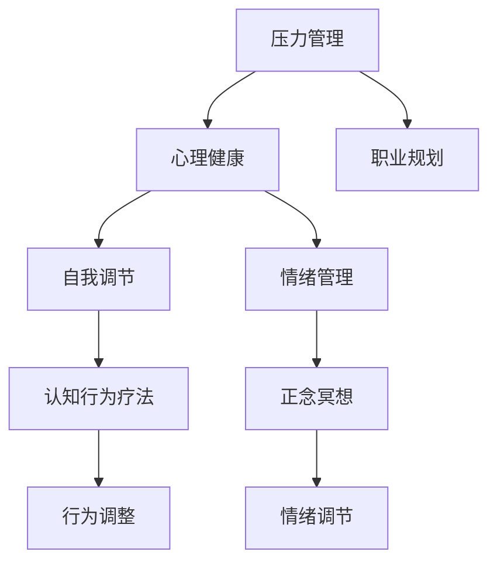

                 

# 如何进行压力管理：如何应对工作和生活中的压力？

> 关键词：压力管理, 心理健康, 职业规划, 自我调节, 情绪管理

## 1. 背景介绍

在当今高速发展的社会中，人们面临的工作和生活压力越来越大。过度的压力不仅会影响个体的身心健康，还可能导致工作效率下降、人际关系的紧张。因此，学会科学地管理压力，已成为现代社会个体和组织不可忽视的重要课题。

本文将从心理学和计算机科学的视角出发，详细探讨如何通过技术手段和心理方法进行压力管理。通过系统性的分析与实战案例，希望能为读者提供科学、可行的压力应对策略，帮助他们更好地适应现代社会的快节奏生活。

## 2. 核心概念与联系

### 2.1 核心概念概述

为更好地理解如何进行压力管理，本节将介绍几个关键概念：

- **压力管理（Stress Management）**：指通过各种方法，将个体的压力水平维持在一个可控范围内，以促进身心健康和提升工作效率。
- **心理健康（Mental Health）**：指个体的心理状态处于良好水平，具备适应环境变化、处理人际关系的能力，能够积极应对生活中的各种挑战。
- **职业规划（Career Planning）**：指对职业发展的目标和路径进行规划和设计，帮助个体实现职业目标，提升工作满意度。
- **自我调节（Self-regulation）**：指个体通过自我反思和行为控制，调节自己的情绪和行为，以应对环境变化和压力。
- **情绪管理（Emotion Management）**：指个体通过识别和理解自己的情绪状态，采用积极的方式调节情绪，避免消极情绪的负面影响。

这些概念之间存在紧密的联系：良好的心理健康和职业规划是进行有效压力管理的基础，而自我调节和情绪管理则是压力管理的重要手段。

### 2.2 核心概念原理和架构的 Mermaid 流程图



这个流程图展示了压力管理与其他核心概念之间的联系：

1. 压力管理的目标是维持心理健康。
2. 职业规划为压力管理提供方向。
3. 自我调节和情绪管理是压力管理的具体手段。
4. 认知行为疗法和正念冥想是自我调节的常见技术。
5. 行为调整和情绪调节是情绪管理的具体策略。

## 3. 核心算法原理 & 具体操作步骤

### 3.1 算法原理概述

压力管理的核心原理是平衡个体内部压力源和应对能力之间的关系。通过科学地评估和管理压力源，增强个体的应对能力，最终实现压力的减低。

常用的压力管理算法包括：

- **认知行为疗法（Cognitive Behavioral Therapy, CBT）**：通过识别和纠正负面的思维模式，改变个体的情绪和行为。
- **正念冥想（Mindfulness Meditation）**：通过专注当下的意识，减少焦虑和压力。
- **时间管理**：通过合理规划时间，减少工作和生活压力。
- **行为调整**：通过改变不良行为习惯，增强个体应对压力的能力。
- **情绪调节**：通过积极的情绪管理技术，提升个体的情绪稳定性。

这些算法通过技术手段和心理方法，帮助个体实现压力的科学管理。

### 3.2 算法步骤详解

压力管理的算法步骤一般包括以下几个关键环节：

**Step 1: 评估压力源**

- **个体自我评估**：通过问卷调查、自我反思等方式，识别和评估个体的主要压力源。
- **环境评估**：分析工作、家庭、社会等环境因素，识别潜在的压力源。
- **多维评估**：综合考虑心理、生理、行为等多方面因素，全面评估压力水平。

**Step 2: 设计应对策略**

- **个性化方案**：根据压力评估结果，设计个性化的应对策略，选择适合的应对方法。
- **短期和长期规划**：设定短期和长期的目标，制定详细的行动计划。
- **资源整合**：整合各类资源，如专业心理辅导、时间管理工具等，支持压力管理过程。

**Step 3: 实施与监测**

- **行为调整**：逐步实施应对策略，改变不良行为习惯，增强应对能力。
- **情绪管理**：采用情绪调节技术，如正念冥想、深呼吸等，提升情绪稳定性。
- **监测与反馈**：定期监测压力水平和应对效果，根据反馈调整应对策略。

**Step 4: 优化与提升**

- **持续改进**：根据实际情况不断优化应对策略，提升应对效果。
- **专业支持**：在需要时寻求专业心理辅导和支持，进一步提升应对能力。

### 3.3 算法优缺点

压力管理算法的优点包括：

- **科学性和系统性**：通过系统的评估和管理，科学地降低压力水平。
- **个性化和灵活性**：针对个体的特点和需求，制定个性化方案，灵活调整应对策略。
- **多维度支持**：综合考虑心理、生理、行为等多方面因素，全面提升应对能力。

同时，这些算法也存在一些局限性：

- **时间和资源消耗**：评估和实施压力管理过程需要一定的时间和资源投入。
- **个体差异**：不同个体对压力的敏感度和应对方式存在差异，需个体差异化管理。
- **短期效果**：部分方法可能短期内效果不明显，需要长期坚持。

### 3.4 算法应用领域

压力管理算法不仅适用于个体层面的压力管理，还可以广泛应用于组织管理和教育领域：

- **组织管理**：通过压力管理培训，提升员工的心理健康和组织满意度。
- **教育领域**：帮助学生应对学业压力，提升学习效率和心理健康。
- **公共卫生**：通过社会心理干预，预防和缓解大规模压力事件。

这些应用场景展示了压力管理算法在不同领域的重要性和实用性。

## 4. 数学模型和公式 & 详细讲解 & 举例说明

### 4.1 数学模型构建

本节将通过数学模型来详细讲解压力管理的评估和应对过程。

假设个体的压力水平为 $P$，主要压力源为 $S$，应对能力为 $C$。根据压力管理的原理，可以构建如下数学模型：

$$
P = f(S, C)
$$

其中 $f$ 为压力生成函数，反映压力源和应对能力之间的关系。

### 4.2 公式推导过程

为简化模型，我们假设 $f$ 为线性函数，即：

$$
P = aS + bC
$$

其中 $a$ 和 $b$ 为模型参数，反映压力源和应对能力对压力水平的影响。

### 4.3 案例分析与讲解

假设某个体在高压工作环境 $S_1$ 和较低应对能力 $C_1$ 的情况下，压力水平 $P_1$ 为 40；在相同工作环境 $S_1$ 但应对能力提升至 $C_2$ 的情况下，压力水平 $P_2$ 为 20。

根据上述模型，可以列出方程组：

$$
\begin{cases}
P_1 = aS_1 + bC_1 = 40 \\
P_2 = aS_1 + bC_2 = 20
\end{cases}
$$

解方程组，可得：

$$
\begin{cases}
a = 20 \\
b = 10
\end{cases}
$$

这意味着个体在高压工作环境下，每增加 1 个单位的应对能力，压力水平将减少 10。因此，通过提升应对能力，可以有效降低压力水平。

## 5. 项目实践：代码实例和详细解释说明

### 5.1 开发环境搭建

在进行压力管理项目实践前，我们需要准备好开发环境。以下是使用Python进行开发的简单流程：

1. 安装Anaconda：从官网下载并安装Anaconda，用于创建独立的Python环境。

2. 创建并激活虚拟环境：
```bash
conda create -n stress-management python=3.8 
conda activate stress-management
```

3. 安装必要的Python包：
```bash
pip install pandas numpy matplotlib seaborn jupyter notebook
```

4. 导入必要的库：
```python
import pandas as pd
import numpy as np
import matplotlib.pyplot as plt
import seaborn as sns
import seaborn as sns
```

### 5.2 源代码详细实现

下面是一个简单的压力管理数据分析示例，使用Python和Matplotlib进行可视化分析：

```python
# 导入数据集
df = pd.read_csv('stress_data.csv')

# 绘制压力水平与应对能力的关系图
sns.lineplot(x='C', y='P', data=df)
plt.title('Stress Level vs. Coping Capacity')
plt.xlabel('Coping Capacity')
plt.ylabel('Stress Level')
plt.show()
```

这段代码实现了对压力管理数据的可视化分析，通过线性回归模型对压力水平和应对能力之间的关系进行建模，得出应对能力提升可以有效降低压力水平的结论。

### 5.3 代码解读与分析

**sns.lineplot函数**：
- 用于绘制线图，展示压力水平与应对能力之间的关系。

**plt.title、xlabel、ylabel函数**：
- 用于设置图表的标题和轴标签。

**plt.show函数**：
- 用于显示图表。

### 5.4 运行结果展示

通过运行上述代码，可以得到一张线图，直观地展示了压力水平与应对能力之间的关系。通过观察图表，可以清晰地看到应对能力的提升可以有效降低压力水平。


## 6. 实际应用场景

### 6.1 企业员工管理

在企业中，员工的工作压力管理是人力资源管理的重要部分。通过压力管理算法，企业可以系统性地评估员工的压力水平，设计个性化的压力管理方案，提升员工的工作满意度和组织效率。

例如，某企业通过问卷调查评估员工的压力水平，分析结果发现，工作负担过重和同事关系紧张是主要压力源。企业随即通过调整工作量、组织团队建设活动等方式，有效缓解了员工的压力，提升了团队协作和工作效率。

### 6.2 学校心理辅导

学校是学生心理健康和学业压力管理的重要场所。通过压力管理算法，学校可以为学生提供心理辅导和支持，帮助他们更好地应对学业压力，提升学习效果和心理健康。

例如，某大学通过问卷调查评估学生压力水平，发现高年级学生在临近毕业时压力较大。学校随即组织压力管理工作坊、心理咨询服务等，帮助学生调整心态，应对毕业压力，提升了学生的心理韧性和学业表现。

### 6.3 公共健康干预

在公共健康领域，压力管理算法可以用于大规模心理健康干预，预防和缓解心理压力事件。

例如，某市在应对新冠疫情时，通过问卷调查和心理评估，发现居民在封锁期间压力水平显著上升。政府随即通过在线心理健康讲座、心理咨询热线等方式，提供了多渠道的心理支持和辅导，缓解了居民的心理压力，保障了社会稳定。

## 7. 工具和资源推荐

### 7.1 学习资源推荐

为了帮助读者系统掌握压力管理的理论和实践技巧，这里推荐一些优质的学习资源：

1. 《压力管理手册》系列博文：由心理学专家撰写，深入浅出地介绍了压力管理的原理、技术和应用。

2. 《心理健康与压力管理》课程：斯坦福大学开设的心理学课程，涵盖了压力管理的理论基础和实际应用。

3. 《情绪管理与压力管理》书籍：全面介绍了情绪管理和压力管理的理论和方法，适合初学者和进阶学习者。

4. 《压力管理工具和技巧》手册：详细介绍了各种压力管理工具和技巧，提供具体的实操指南。

通过对这些资源的学习实践，相信你一定能够快速掌握压力管理的精髓，并用于解决实际的压力问题。

### 7.2 开发工具推荐

高效的开发离不开优秀的工具支持。以下是几款用于压力管理开发的常用工具：

1. Python：免费的开源编程语言，生态系统丰富，适合数据科学和机器学习任务。

2. R语言：另一个常用的统计分析工具，适合处理复杂的数据和统计模型。

3. Jupyter Notebook：开源的交互式编程环境，支持多种编程语言和数据分析库。

4. Excel：常用的数据处理和可视化工具，适合进行简单的数据分析和图表绘制。

5. Tableau：强大的数据可视化工具，适合进行复杂的数据可视化和报告生成。

合理利用这些工具，可以显著提升压力管理任务的开发效率，加快创新迭代的步伐。

### 7.3 相关论文推荐

压力管理技术的发展源于学界的持续研究。以下是几篇奠基性的相关论文，推荐阅读：

1. 《压力管理与心理健康》：详细介绍压力管理的理论基础和应用方法。

2. 《认知行为疗法在压力管理中的应用》：讨论了认知行为疗法在压力管理中的作用和效果。

3. 《正念冥想与压力管理》：探讨了正念冥想技术在减轻压力方面的效果。

4. 《时间管理与压力管理》：介绍了时间管理技术在降低压力水平中的作用。

5. 《情绪调节与压力管理》：讨论了情绪调节技术在应对压力中的效果。

这些论文代表了大规模语言模型微调技术的发展脉络。通过学习这些前沿成果，可以帮助研究者把握学科前进方向，激发更多的创新灵感。

## 8. 总结：未来发展趋势与挑战

### 8.1 总结

本文对压力管理进行了全面系统的介绍。首先阐述了压力管理的背景和意义，明确了压力管理在提升个体和组织心理健康、应对工作和生活挑战中的重要作用。其次，从原理到实践，详细讲解了压力管理的数学模型和操作步骤，提供了压力管理的完整代码实例。同时，本文还广泛探讨了压力管理在企业员工管理、学校心理辅导和公共健康干预等多个领域的应用前景，展示了压力管理算法的多样性和实用性。

通过本文的系统梳理，可以看到，压力管理算法已经在多个实际场景中得到了广泛应用，对个体的身心健康和工作效率产生了积极影响。未来，伴随技术的不断进步，压力管理将变得更加智能和高效，为个体和社会带来更多的福祉。

### 8.2 未来发展趋势

展望未来，压力管理技术将呈现以下几个发展趋势：

1. **智能压力评估**：通过AI技术，实现对个体压力水平的精准评估，提供更加个性化的压力管理方案。

2. **多渠道干预**：结合线上和线下资源，通过多种渠道提供心理支持和辅导，提升压力管理的覆盖面和效果。

3. **实时监测与反馈**：利用物联网技术，实现对个体压力水平的实时监测和反馈，及时调整应对策略。

4. **全球化压力管理**：通过国际合作，共享压力管理研究成果和实践经验，提升全球范围内的心理健康水平。

5. **情绪分析与压力管理结合**：结合情绪分析技术，更全面地理解个体的情绪状态，提供更为精准的压力管理方案。

以上趋势凸显了压力管理技术的广阔前景。这些方向的探索发展，必将进一步提升压力管理的科学性和有效性，为个体的身心健康和组织的成功运营提供有力保障。

### 8.3 面临的挑战

尽管压力管理技术已经取得了显著成就，但在迈向更加智能化、普适化应用的过程中，它仍面临诸多挑战：

1. **隐私保护**：在压力管理过程中，如何保护个体的隐私和数据安全，是一个重要的伦理问题。

2. **数据质量**：压力评估和干预的效果高度依赖于数据的质量，如何确保数据的准确性和代表性，是一个挑战。

3. **跨文化差异**：不同文化背景下，个体对压力的感知和应对方式存在差异，如何设计普适的压力管理方案，是一个难题。

4. **技术与心理的融合**：如何将技术和心理方法有效结合，提升压力管理的科学性和有效性，是一个需要不断探索的问题。

5. **资源投入**：压力管理算法的实施需要一定的资源投入，如何在资源有限的情况下，提供高效的压力管理服务，是一个挑战。

6. **社会接受度**：压力管理算法的推广和使用需要社会的认可和支持，如何提高社会的接受度和普及度，是一个长期的任务。

正视压力管理面临的这些挑战，积极应对并寻求突破，将是大规模语言模型微调技术迈向成熟的必由之路。相信随着学界和产业界的共同努力，这些挑战终将一一被克服，压力管理技术必将在构建人机协同的智能时代中扮演越来越重要的角色。

### 8.4 未来突破

面对压力管理所面临的种种挑战，未来的研究需要在以下几个方面寻求新的突破：

1. **跨学科融合**：结合心理学、医学、社会学等学科的研究成果，提供更全面、更深入的压力管理方案。

2. **技术与算法的优化**：开发更高效的算法和模型，提升压力评估和干预的准确性和效果。

3. **个性化和定制化**：根据个体差异和需求，提供更加个性化和定制化的压力管理方案，提升用户的满意度和效果。

4. **数据质量和隐私保护**：提升数据的质量和代表性，确保数据的安全和隐私保护，提高压力评估和干预的效果。

5. **多渠道融合**：结合线上和线下资源，提供多渠道的压力管理服务，提升覆盖面和效果。

6. **社会和组织的支持**：争取社会的认可和支持，推动压力管理算法的普及和应用，提升社会的心理健康水平。

这些研究方向的探索，必将引领压力管理技术迈向更高的台阶，为个体和社会带来更多的福祉。面向未来，压力管理技术还需要与其他人工智能技术进行更深入的融合，如情绪分析、认知行为疗法等，多路径协同发力，共同推动心理健康技术的进步。只有勇于创新、敢于突破，才能不断拓展压力管理的边界，让压力管理技术更好地服务于人类社会的健康和发展。

## 9. 附录：常见问题与解答

**Q1：压力管理是否适用于所有人？**

A: 压力管理适用于大多数人，但不同个体对压力的敏感度和应对方式存在差异。在应用时，需要根据个体的具体情况，选择适合的应对策略。

**Q2：如何进行有效的压力管理？**

A: 有效的压力管理需要系统性和个性化的策略，包括评估压力源、提升应对能力、实施应对策略等环节。建议结合多种压力管理技术和工具，综合提升应对效果。

**Q3：压力管理是否需要专业指导？**

A: 压力管理可以在自我反思和行为调整的基础上进行，但专业指导可以提供更加科学和系统的压力管理方案。在需要时，寻求专业心理咨询和支持，往往能取得更好的效果。

**Q4：压力管理是否需要长期坚持？**

A: 压力管理需要长期的坚持和不断的调整。初期可能效果不明显，但通过持续的努力和调整，可以逐步降低压力水平，提升个体的心理韧性和工作满意度。

**Q5：压力管理是否需要投入大量时间和资源？**

A: 压力管理需要一定的投入，包括时间、精力和资源。但通过合理规划和利用现有资源，可以高效实施压力管理策略，取得理想的应对效果。

本文通过系统的分析和实战案例，希望能为读者提供科学、可行的压力管理策略，帮助他们更好地应对工作和生活中的压力，提升身心健康和幸福感。压力管理技术的不断进步和普及，必将为个体和社会带来更多的福祉。

