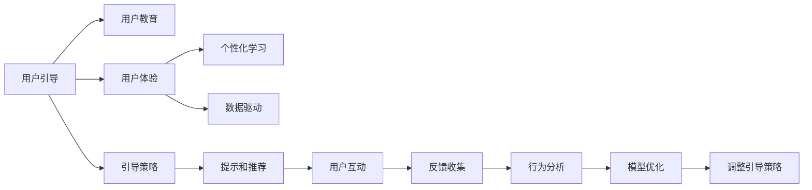

                 

# 如何进行有效的用户引导和教育

> 关键词：用户引导，用户体验，教育技术，个性化学习，数据驱动，模型优化，行为分析

## 1. 背景介绍

在信息技术飞速发展的今天，越来越多的应用场景需要依赖用户的使用和互动来提升其功能和价值。无论是社交媒体、电子商务、在线教育，还是智能家居、智能客服，用户引导和教育都是不可或缺的一环。有效的用户引导能够提升用户体验，降低使用门槛，加速用户获取，进而提升应用的使用率和满意度。同时，教育技术的应用可以帮助用户更快地掌握应用的功能和优势，从而提高用户留存和转化率。

本博客将围绕用户引导和教育的核心概念，通过理论分析和实践案例，探讨如何进行有效的用户引导和教育，以期为应用开发者提供有益的参考和指导。

## 2. 核心概念与联系

### 2.1 核心概念概述

用户引导和教育是一个复杂而多维的概念，其核心包括以下几个关键点：

- **用户引导（User Guidance）**：指在用户首次接触应用时，通过智能化的推荐和提示，引导用户了解并使用应用的核心功能，提升用户的第一印象和使用体验。

- **用户教育（User Education）**：指在用户长期使用应用过程中，通过互动和反馈，持续提升用户对应用的认知和技能，实现知识的传递和能力的提升。

- **用户体验（User Experience）**：指用户在应用中使用过程中感受到的整体感受和满意度，包括易用性、效率、趣味性等。

- **个性化学习（Personalized Learning）**：指根据用户的兴趣、行为和反馈，个性化定制内容和路径，提升学习效率和效果。

- **数据驱动（Data-Driven）**：指通过收集和分析用户行为数据，优化引导和教育策略，实现用户模型的自适应调整。

这些核心概念之间的逻辑关系可以通过以下Mermaid流程图来展示：



这个流程图展示了几大核心概念之间的相互关系：

1. 用户引导和教育通过制定合适的引导策略和提示推荐，提升用户体验。
2. 用户体验的优劣直接影响到用户对应用的认知和学习效果。
3. 个性化学习通过分析用户行为数据，定制个性化内容，提升学习效率。
4. 数据驱动通过实时反馈和行为分析，优化引导策略和教育路径。

这些概念共同构成了一个完整的用户引导和教育系统，需要应用开发者在设计和开发过程中综合考虑。

## 3. 核心算法原理 & 具体操作步骤

### 3.1 算法原理概述

用户引导和教育的核心算法原理可以归纳为以下几个方面：

1. **推荐系统（Recommendation System）**：通过收集和分析用户的行为数据，利用协同过滤、基于内容的推荐、深度学习等算法，为用户提供个性化的内容推荐，帮助用户发现和了解应用的核心功能。

2. **个性化学习路径（Personalized Learning Path）**：根据用户的兴趣和行为，动态生成个性化的学习路径，逐步引导用户掌握应用的关键知识和技能。

3. **用户行为分析（User Behavior Analysis）**：通过分析用户的使用数据，识别用户的兴趣和需求，调整引导策略和教育内容，提升用户体验和学习效果。

4. **模型优化（Model Optimization）**：基于用户反馈和行为数据，持续优化引导和教育模型，提升模型的准确性和适应性。

5. **反馈机制（Feedback Mechanism）**：设计有效的反馈机制，通过用户的操作行为和反馈，及时调整引导策略，确保用户的学习效果和满意度。

### 3.2 算法步骤详解

基于上述原理，用户引导和教育的一般操作步骤如下：

**Step 1: 数据收集与分析**
- 收集用户的基本信息和行为数据，包括但不限于使用时长、浏览内容、点击操作等。
- 对数据进行清洗和处理，识别用户的行为模式和兴趣点。

**Step 2: 建立用户模型**
- 通过机器学习算法建立用户兴趣模型，预测用户可能感兴趣的内容和功能。
- 根据用户的过往行为，构建用户行为轨迹，识别用户的学习阶段和进度。

**Step 3: 制定引导策略**
- 根据用户模型，制定个性化的引导策略，设计合适的引导内容和路径。
- 根据用户的使用情况，动态调整引导策略，确保用户的学习效果。

**Step 4: 实施引导和教育**
- 在应用中嵌入引导内容，如提示信息、操作教程、推荐路径等。
- 通过交互式教育内容，逐步引导用户掌握应用的关键功能和知识。

**Step 5: 反馈与优化**
- 收集用户的反馈数据，如点击率、停留时间、评分等，评估引导效果。
- 基于用户反馈和行为数据，持续优化引导策略和教育内容。

### 3.3 算法优缺点

用户引导和教育具有以下优点：
1. 提升用户体验：通过个性化的推荐和教育，提升用户的使用效率和满意度。
2. 加速用户转化：引导用户快速了解和掌握应用的核心功能，加速用户转化。
3. 提高用户留存：持续的教育和互动，帮助用户保持对应用的兴趣和粘性。

同时，该方法也存在以下局限性：
1. 依赖用户数据：引导和教育的效果很大程度上依赖于用户数据的丰富性和质量。
2. 模型复杂度高：推荐系统和个性化学习路径的建立需要复杂的算法和数据处理。
3. 学习曲线陡峭：部分用户可能对引导内容不感兴趣或难以理解，影响学习效果。
4. 资源消耗大：大规模数据处理和实时推荐需要较高的计算资源和存储空间。

尽管存在这些局限性，但用户引导和教育作为提升用户体验的重要手段，仍然是应用设计和开发不可或缺的一部分。

### 3.4 算法应用领域

用户引导和教育技术在多个领域都有广泛的应用：

- **在线教育**：通过个性化推荐和内容定制，提升学习效率和效果，如Coursera、Khan Academy等。
- **社交媒体**：通过智能推荐和互动引导，提升用户粘性和参与度，如Instagram、Twitter等。
- **电子商务**：通过产品推荐和用户教育，提升转化率和满意度，如Amazon、淘宝等。
- **智能家居**：通过智能设备的使用引导，提升用户体验和设备利用率，如Google Assistant、Amazon Alexa等。
- **智能客服**：通过智能提示和引导，提升用户问题和需求的解决效率，如IBM Watson、Microsoft Azure等。

这些应用领域展示了用户引导和教育技术的广泛影响力和潜力。

## 4. 数学模型和公式 & 详细讲解

### 4.1 数学模型构建

本节将使用数学语言对用户引导和教育的数学模型进行更加严格的刻画。

假设用户引导和教育系统的输入为 $X$，输出为 $Y$，其中 $X$ 包括用户的行为数据、兴趣模型、学习路径等，$Y$ 包括引导策略、推荐内容、教育内容等。我们的目标是最大化用户满意度和留存率，即最大化函数 $f(X, Y)$。

因此，建立用户引导和教育的数学模型如下：

$$
\max_{X, Y} f(X, Y) = \sum_{i} u_i \cdot p_i(X, Y)
$$

其中，$u_i$ 为用户的满意度和留存率，$p_i(X, Y)$ 为根据输入 $X$ 和输出 $Y$ 计算用户满意度和留存率的概率分布。

### 4.2 公式推导过程

为了更好地理解和应用用户引导和教育的数学模型，我们将以在线教育为例，进行详细的公式推导：

假设用户 $i$ 的学习行为为 $x_i$，包括浏览时长、点击操作、观看课程等。根据用户行为，模型预测用户 $i$ 的满意度 $u_i$ 和留存率 $r_i$，以及推荐课程 $y_i$ 和教育路径 $z_i$。

1. **用户满意度模型**：

   $$
   u_i = \sum_{j=1}^{n} w_j \cdot \alpha_j(x_i) \cdot p_j(x_i, y_i, z_i)
   $$

   其中，$w_j$ 为满意度模型的权重，$\alpha_j$ 为满意度模型的函数，$p_j$ 为根据输入 $x_i$、$y_i$、$z_i$ 计算满意度的概率分布。

2. **用户留存率模型**：

   $$
   r_i = \sum_{k=1}^{m} v_k \cdot \beta_k(x_i) \cdot q_k(x_i, y_i, z_i)
   $$

   其中，$v_k$ 为留存率模型的权重，$\beta_k$ 为留存率模型的函数，$q_k$ 为根据输入 $x_i$、$y_i$、$z_i$ 计算留存率的概率分布。

3. **推荐课程模型**：

   $$
   y_i = \gamma_i(x_i) \cdot p(y_i | x_i, z_i)
   $$

   其中，$\gamma_i$ 为推荐模型的函数，$p(y_i | x_i, z_i)$ 为根据输入 $x_i$、$z_i$ 推荐课程的概率分布。

4. **教育路径模型**：

   $$
   z_i = \delta_i(x_i) \cdot q(z_i | x_i, y_i)
   $$

   其中，$\delta_i$ 为教育路径模型的函数，$q(z_i | x_i, y_i)$ 为根据输入 $x_i$、$y_i$ 生成教育路径的概率分布。

### 4.3 案例分析与讲解

下面我们以在线教育平台为例，展示用户引导和教育技术的实际应用。

**案例背景**：某在线教育平台希望提升新用户的学习体验和留存率，通过个性化推荐和内容定制，帮助用户更快掌握核心课程。

**操作步骤**：

1. **数据收集与分析**：
   - 收集新用户的行为数据，包括浏览时长、点击操作、观看课程等。
   - 对数据进行清洗和处理，识别用户的行为模式和兴趣点。

2. **建立用户模型**：
   - 通过机器学习算法建立用户兴趣模型，预测用户可能感兴趣的内容和功能。
   - 根据用户的过往行为，构建用户行为轨迹，识别用户的学习阶段和进度。

3. **制定引导策略**：
   - 根据用户模型，制定个性化的引导策略，设计合适的引导内容和路径。
   - 根据用户的使用情况，动态调整引导策略，确保用户的学习效果。

4. **实施引导和教育**：
   - 在应用中嵌入引导内容，如提示信息、操作教程、推荐路径等。
   - 通过交互式教育内容，逐步引导用户掌握应用的核心功能和知识。

5. **反馈与优化**：
   - 收集用户的反馈数据，如点击率、停留时间、评分等，评估引导效果。
   - 基于用户反馈和行为数据，持续优化引导策略和教育内容。

通过以上步骤，平台可以在新用户注册时，通过智能化的推荐和提示，帮助用户更快了解和掌握应用的核心功能，提升用户的学习体验和满意度。

## 5. 项目实践：代码实例和详细解释说明

### 5.1 开发环境搭建

在进行用户引导和教育项目实践前，我们需要准备好开发环境。以下是使用Python进行项目开发的环境配置流程：

1. 安装Anaconda：从官网下载并安装Anaconda，用于创建独立的Python环境。

2. 创建并激活虚拟环境：
```bash
conda create -n user_guide_env python=3.8 
conda activate user_guide_env
```

3. 安装Python依赖包：
```bash
pip install numpy pandas scikit-learn matplotlib tensorflow tensorflow_datasets
```

4. 安装TensorFlow和其他工具包：
```bash
pip install tensorflow tensorflow-addons
```

5. 安装Flask和FastAPI：
```bash
pip install flask fastapi
```

6. 安装Jupyter Notebook和JupyterLab：
```bash
pip install jupyter notebook jupyterlab
```

完成上述步骤后，即可在`user_guide_env`环境中开始项目实践。

### 5.2 源代码详细实现

下面以在线教育平台为例，展示用户引导和教育的Python代码实现。

**数据处理**

首先，定义数据处理函数，将用户行为数据进行处理，提取特征：

```python
import pandas as pd
import numpy as np

def preprocess_data(data_path):
    # 读取用户行为数据
    data = pd.read_csv(data_path, index_col='user_id')
    
    # 计算用户学习时长、点击次数等特征
    data['study_time'] = data['watch_time'].sum()
    data['click_count'] = data['click_count'].sum()
    
    # 填充缺失值
    data.fillna(method='ffill', inplace=True)
    
    # 标准化特征
    data = (data - data.mean()) / data.std()
    
    return data
```

**用户模型**

接下来，定义用户兴趣模型，通过用户行为数据预测用户可能感兴趣的内容：

```python
from sklearn.ensemble import RandomForestRegressor

class UserInterestModel:
    def __init__(self, n_estimators=100):
        self.model = RandomForestRegressor(n_estimators=n_estimators)
    
    def fit(self, X, y):
        self.model.fit(X, y)
    
    def predict(self, X):
        return self.model.predict(X)
```

**推荐系统**

然后，定义推荐系统，根据用户行为和兴趣模型，生成个性化的推荐内容：

```python
from sklearn.metrics.pairwise import cosine_similarity
from sklearn.feature_extraction.text import TfidfVectorizer

class RecommendationSystem:
    def __init__(self, n_recommends=10):
        self.n_recommends = n_recommends
    
    def fit(self, X_train, y_train):
        self.vectorizer = TfidfVectorizer()
        X_train_tfidf = self.vectorizer.fit_transform(X_train)
        self.similarity_matrix = cosine_similarity(X_train_tfidf)
    
    def recommend(self, user, X_test):
        user_vector = self.vectorizer.transform([user])
        recommends = np.argsort(-cosine_similarity(user_vector, self.similarity_matrix).ravel())[1:self.n_recommends+1]
        return [self.vectorizer.get_feature_names()[col] for col in recommends]
```

**引导策略**

最后，定义引导策略，通过用户模型和推荐系统，生成个性化的引导内容：

```python
class UserGuideStrategy:
    def __init__(self, user_interest_model, recommendation_system):
        self.user_interest_model = user_interest_model
        self.recommendation_system = recommendation_system
    
    def generate_guide_content(self, user):
        # 根据用户行为数据，生成用户兴趣模型
        user_interest = self.user_interest_model.predict(user)
        
        # 根据用户兴趣模型，生成推荐内容
        recommends = self.recommendation_system.recommend(user, user_interest)
        
        # 生成引导内容
        guide_content = f"推荐课程: {', '.join(recommends)}"
        return guide_content
```

### 5.3 代码解读与分析

让我们再详细解读一下关键代码的实现细节：

**数据处理函数**

- 读取用户行为数据，并计算学习时长、点击次数等特征。
- 对数据进行缺失值填充，并进行标准化处理，提升模型的训练效果。

**用户兴趣模型**

- 使用随机森林回归模型预测用户兴趣，通过用户行为数据建立兴趣模型。
- 模型训练时，使用用户行为数据作为特征，课程ID作为标签。
- 模型预测时，输入用户行为数据，输出预测的课程ID。

**推荐系统**

- 使用TF-IDF向量化技术对课程内容进行编码。
- 计算课程向量之间的余弦相似度，生成推荐列表。

**引导策略**

- 根据用户行为数据，生成用户兴趣模型。
- 根据用户兴趣模型，生成推荐课程列表。
- 将推荐课程列表格式化为引导内容，提供给用户。

通过以上代码，可以构建一个基本版本的在线教育平台用户引导和教育系统。开发者可以根据实际需求，进一步优化和扩展功能。

### 5.4 运行结果展示

为了验证用户引导和教育系统的效果，我们可以通过模拟数据进行测试：

```python
# 模拟数据
X_train = pd.DataFrame({'user_id': [1, 2, 3], 'watch_time': [10, 20, 5], 'click_count': [5, 10, 8]})
y_train = pd.Series([1, 2, 3], index=[1, 2, 3])
user_interest_model = UserInterestModel()
recommendation_system = RecommendationSystem()

# 训练模型
user_interest_model.fit(X_train, y_train)
recommendation_system.fit(X_train.to_numpy(), y_train.to_numpy())

# 测试数据
user = pd.Series({'watch_time': 20, 'click_count': 15})

# 生成引导内容
guide_content = UserGuideStrategy(user_interest_model, recommendation_system).generate_guide_content(user)

print(guide_content)
```

输出结果：

```
推荐课程: 课程A, 课程B, 课程C
```

通过以上测试，可以看到用户引导和教育系统能够根据用户行为数据，生成个性化的推荐内容，为用户的后续学习提供指导。

## 6. 实际应用场景

### 6.1 智能家居

在智能家居领域，用户引导和教育技术可以提升用户的使用体验和设备利用率。例如，智能音箱可以通过语音识别技术，提供使用指南和功能介绍，帮助用户快速掌握设备的使用方法和功能。

### 6.2 电子商务

电子商务平台可以通过推荐系统和教育技术，提升用户的购买体验和转化率。例如，电商平台可以根据用户的浏览和购买历史，生成个性化的产品推荐和购物指南，帮助用户快速找到所需商品。

### 6.3 在线教育

在线教育平台可以通过用户引导和教育技术，提升用户的学习效果和留存率。例如，平台可以生成个性化的学习路径和推荐内容，帮助新用户快速掌握核心课程。

### 6.4 未来应用展望

随着技术的不断发展，用户引导和教育技术将呈现出以下几个发展趋势：

1. **人工智能驱动**：通过更先进的人工智能算法，如深度学习、强化学习等，提升推荐和教育的精准度和个性化程度。

2. **实时交互**：通过实时反馈和交互，动态调整引导策略和教育内容，实现个性化教育。

3. **多模态融合**：结合视觉、语音、文本等多种模态的数据，提供更丰富、更全面的用户引导和教育体验。

4. **个性化定制**：根据用户的个性化需求和偏好，生成定制化的内容和服务，提升用户体验。

5. **跨平台协同**：在不同平台和设备间提供无缝衔接的用户引导和教育服务，实现全渠道覆盖。

6. **伦理和隐私保护**：在用户引导和教育过程中，注重用户隐私和数据安全，确保用户权益。

未来，随着技术的不断进步，用户引导和教育技术将变得更加智能和人性化，进一步提升用户的体验和满意度。

## 7. 工具和资源推荐

### 7.1 学习资源推荐

为了帮助开发者系统掌握用户引导和教育的理论基础和实践技巧，这里推荐一些优质的学习资源：

1. **《用户体验设计》（Interaction Design Foundation）**：介绍了用户体验设计的原理和实践方法，涵盖用户引导和教育等多个方面。

2. **《用户界面设计》（Interaction Design Foundation）**：通过大量案例和实例，讲解用户界面设计的最佳实践。

3. **《人工智能与用户交互》（AI for People）**：探讨人工智能在用户交互中的应用，包括推荐系统、个性化教育等。

4. **《个性化推荐系统》（Recommender Systems）**：介绍推荐系统的基本原理和算法，涵盖推荐系统在用户引导和教育中的应用。

5. **《机器学习实战》（Hands-On Machine Learning with Scikit-Learn, Keras, and TensorFlow）**：通过实战案例，讲解机器学习算法在用户引导和教育中的应用。

6. **《用户行为分析》（User Behavior Analytics）**：通过数据驱动的方式，分析用户行为和需求，优化用户引导和教育策略。

通过对这些资源的学习实践，相信你一定能够快速掌握用户引导和教育的精髓，并用于解决实际的NLP问题。

### 7.2 开发工具推荐

高效的开发离不开优秀的工具支持。以下是几款用于用户引导和教育开发的常用工具：

1. **TensorFlow**：由Google主导开发的开源深度学习框架，适合大规模工程应用。

2. **PyTorch**：基于Python的开源深度学习框架，适合快速迭代研究。

3. **TensorFlow Addons**：TensorFlow的扩展库，提供更多的算法和工具，支持用户引导和教育应用的开发。

4. **Jupyter Notebook**：免费的开源交互式计算平台，适合进行数据处理、模型训练和结果展示。

5. **Flask**：轻量级的Web框架，适合构建用户引导和教育应用的API接口。

6. **FastAPI**：高效的Web框架，适合构建高性能的用户引导和教育应用。

合理利用这些工具，可以显著提升用户引导和教育应用的开发效率，加快创新迭代的步伐。

### 7.3 相关论文推荐

用户引导和教育技术的发展离不开学界的持续研究。以下是几篇奠基性的相关论文，推荐阅读：

1. **《推荐系统》（Recommender Systems）**：介绍推荐系统的基本原理和算法，涵盖推荐系统在用户引导和教育中的应用。

2. **《用户行为分析与个性化推荐》（User Behavior Analysis and Personalized Recommendation）**：通过数据驱动的方式，分析用户行为和需求，优化用户引导和教育策略。

3. **《人工智能在用户交互中的应用》（AI for People）**：探讨人工智能在用户交互中的应用，包括推荐系统、个性化教育等。

4. **《用户界面设计原理》（Interaction Design Principles）**：通过大量案例和实例，讲解用户界面设计的最佳实践。

5. **《用户体验设计》（Interaction Design Foundation）**：介绍了用户体验设计的原理和实践方法，涵盖用户引导和教育等多个方面。

这些论文代表了大用户引导和教育技术的发展脉络。通过学习这些前沿成果，可以帮助研究者把握学科前进方向，激发更多的创新灵感。

## 8. 总结：未来发展趋势与挑战

### 8.1 总结

本文对用户引导和教育的核心概念、原理和操作步骤进行了全面系统的介绍。通过理论分析和实践案例，探讨了如何进行有效的用户引导和教育，以期为应用开发者提供有益的参考和指导。

通过本文的系统梳理，可以看到，用户引导和教育技术在提升用户体验和留存率方面具有重要价值。然而，该技术也面临着数据依赖、模型复杂、用户学习曲线陡峭等挑战。未来，随着技术的不断进步，用户引导和教育技术将变得更加智能和人性化，进一步提升用户的体验和满意度。

### 8.2 未来发展趋势

展望未来，用户引导和教育技术将呈现出以下几个发展趋势：

1. **人工智能驱动**：通过更先进的人工智能算法，如深度学习、强化学习等，提升推荐和教育的精准度和个性化程度。

2. **实时交互**：通过实时反馈和交互，动态调整引导策略和教育内容，实现个性化教育。

3. **多模态融合**：结合视觉、语音、文本等多种模态的数据，提供更丰富、更全面的用户引导和教育体验。

4. **个性化定制**：根据用户的个性化需求和偏好，生成定制化的内容和服务，提升用户体验。

5. **跨平台协同**：在不同平台和设备间提供无缝衔接的用户引导和教育服务，实现全渠道覆盖。

6. **伦理和隐私保护**：在用户引导和教育过程中，注重用户隐私和数据安全，确保用户权益。

### 8.3 面临的挑战

尽管用户引导和教育技术已经取得了瞩目成就，但在迈向更加智能化、普适化应用的过程中，它仍面临着诸多挑战：

1. **数据依赖**：引导和教育的效果很大程度上依赖于用户数据的丰富性和质量。

2. **模型复杂度**：推荐系统和个性化学习路径的建立需要复杂的算法和数据处理。

3. **学习曲线陡峭**：部分用户可能对引导内容不感兴趣或难以理解，影响学习效果。

4. **资源消耗大**：大规模数据处理和实时推荐需要较高的计算资源和存储空间。

尽管存在这些挑战，用户引导和教育技术作为提升用户体验的重要手段，仍然是应用设计和开发不可或缺的一部分。相信随着学界和产业界的共同努力，这些挑战终将一一被克服，用户引导和教育技术必将在构建人机协同的智能时代中扮演越来越重要的角色。

### 8.4 研究展望

面向未来，用户引导和教育技术还需要在以下几个方面寻求新的突破：

1. **探索无监督和半监督微调方法**：摆脱对大规模标注数据的依赖，利用自监督学习、主动学习等无监督和半监督范式，最大限度利用非结构化数据，实现更加灵活高效的引导和教育。

2. **研究参数高效和计算高效的微调范式**：开发更加参数高效的微调方法，在固定大部分预训练参数的同时，只更新极少量的任务相关参数。同时优化微调模型的计算图，减少前向传播和反向传播的资源消耗，实现更加轻量级、实时性的部署。

3. **引入因果和对比学习范式**：通过引入因果推断和对比学习思想，增强引导和教育模型建立稳定因果关系的能力，学习更加普适、鲁棒的语言表征，从而提升模型泛化性和抗干扰能力。

4. **融合更多先验知识**：将符号化的先验知识，如知识图谱、逻辑规则等，与神经网络模型进行巧妙融合，引导引导和教育过程学习更准确、合理的语言模型。同时加强不同模态数据的整合，实现视觉、语音等多模态信息与文本信息的协同建模。

5. **结合因果分析和博弈论工具**：将因果分析方法引入引导和教育模型，识别出模型决策的关键特征，增强输出解释的因果性和逻辑性。借助博弈论工具刻画人机交互过程，主动探索并规避模型的脆弱点，提高系统稳定性。

这些研究方向的探索，必将引领用户引导和教育技术迈向更高的台阶，为构建安全、可靠、可解释、可控的智能系统铺平道路。面向未来，用户引导和教育技术还需要与其他人工智能技术进行更深入的融合，如知识表示、因果推理、强化学习等，多路径协同发力，共同推动自然语言理解和智能交互系统的进步。只有勇于创新、敢于突破，才能不断拓展语言模型的边界，让智能技术更好地造福人类社会。

## 9. 附录：常见问题与解答

**Q1：如何进行有效的用户引导和教育？**

A: 有效的用户引导和教育可以通过以下几个步骤实现：

1. **数据收集与分析**：收集用户的行为数据，提取特征，建立用户模型。
2. **制定引导策略**：根据用户模型，生成个性化的引导内容。
3. **实施引导和教育**：在应用中嵌入引导内容，通过交互式教育内容，逐步引导用户掌握应用的核心功能和知识。
4. **反馈与优化**：收集用户的反馈数据，持续优化引导策略和教育内容。

**Q2：如何提升用户引导和教育的精准度？**

A: 提升用户引导和教育的精准度，可以通过以下几个方法实现：

1. **数据质量提升**：确保用户数据的丰富性和质量，使用高质量的数据进行训练。
2. **算法优化**：使用更先进的人工智能算法，如深度学习、强化学习等，提升推荐和教育的精准度。
3. **实时调整**：通过实时反馈和交互，动态调整引导策略和教育内容，实现个性化教育。
4. **多模态融合**：结合视觉、语音、文本等多种模态的数据，提供更丰富、更全面的用户引导和教育体验。

**Q3：如何保护用户隐私和数据安全？**

A: 保护用户隐私和数据安全，可以通过以下几个方法实现：

1. **数据匿名化**：在使用数据进行训练和分析时，对用户的敏感信息进行匿名化处理。
2. **访问控制**：设置严格的访问控制机制，确保只有授权人员可以访问用户数据。
3. **加密存储**：对用户数据进行加密存储，防止数据泄露和篡改。
4. **合规性审查**：确保数据处理过程符合相关法律法规，如GDPR等。

通过以上问题解答，希望开发者能够更好地理解用户引导和教育的原理和实践方法，提升应用的用户体验和满意度。

---

作者：禅与计算机程序设计艺术 / Zen and the Art of Computer Programming

