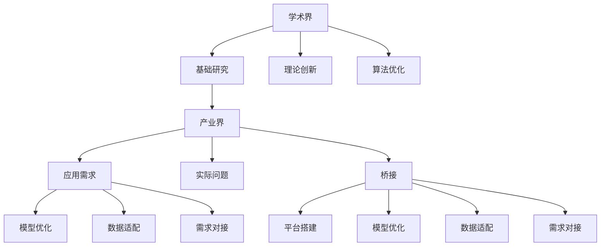

                 

# 学术界到产业界：一位95后博士的AI创业之路

## 1. 背景介绍

### 1.1 问题的由来
作为一名95后的博士研究生，我对人工智能（AI）领域的热爱始于本科阶段的机器学习课程。通过对深度学习模型、自然语言处理、计算机视觉等技术的不断探索，我对AI的应用潜力充满期待。然而，毕业后，我发现学术界的许多研究成果难以直接落地应用，距离产业界的实际需求相距甚远。

### 1.2 问题的核心关键点
在学术界和产业界之间存在鸿沟。学术界的许多研究侧重于理论创新和算法优化，但在实际应用中，往往缺乏对特定场景的深入理解和适配能力。产业界则更关注应用效果和商业价值，有时对底层技术的创新不够敏感。如何搭建一座桥梁，让AI研究成果在产业界落地开花，成为我决定创业的动力。

### 1.3 问题的研究意义
将学术界的理论成果转化为产业界的实际应用，不仅能够推动AI技术的发展，还能加速各行各业的数字化转型。通过创业，我希望能够打破学术界和产业界的界限，让更多AI成果转化为现实生产力，促进社会的进步与变革。

## 2. 核心概念与联系

### 2.1 核心概念概述
为更好地理解学术界到产业界的转化过程，本节将介绍几个关键概念：

- **学术界**：专注于基础研究、理论创新和算法优化的教育机构和研究机构。
- **产业界**：应用先进技术、解决实际问题、追求商业价值的实体组织。
- **桥接**：通过某种方式，将学术界的理论成果转化为产业界的实际应用。
- **模型优化**：基于产业界的具体需求，对学术界的基础模型进行微调和优化。
- **数据适配**：收集产业界的真实数据，对模型进行训练和调优，使其适应特定场景。
- **需求对接**：深入了解产业界的需求和痛点，为模型设计合适的输出方式和应用场景。
- **平台搭建**：搭建一个能够无缝连接学术界和产业界的平台，提供模型优化、数据适配、需求对接等服务。

### 2.2 核心概念原理和架构的 Mermaid 流程图


这个流程图展示了学术界和产业界之间的相互作用关系，以及通过桥接和平台搭建，将学术界的理论成果转化为产业界实际应用的过程。

## 3. 核心算法原理 & 具体操作步骤

### 3.1 算法原理概述
基于学术界的AI研究成果，产业界的应用通常需要以下几个步骤：

1. **模型优化**：根据产业界的具体需求，对学术界的基础模型进行微调和优化。
2. **数据适配**：收集产业界的真实数据，对模型进行训练和调优，使其适应特定场景。
3. **需求对接**：深入了解产业界的需求和痛点，为模型设计合适的输出方式和应用场景。
4. **平台搭建**：搭建一个能够无缝连接学术界和产业界的平台，提供模型优化、数据适配、需求对接等服务。

### 3.2 算法步骤详解
1. **需求收集**：与产业界进行深入交流，收集其具体需求和应用场景。
2. **模型适配**：根据需求，选择合适的学术界研究成果作为初始化模型，并对其进行微调和优化。
3. **数据收集**：收集产业界实际应用的数据，对模型进行训练和调优。
4. **需求对接**：根据产业界的需求，设计模型的输出方式和应用场景。
5. **平台搭建**：开发一个集成上述功能的服务平台，提供模型优化、数据适配、需求对接等服务。

### 3.3 算法优缺点
**优点**：
- 快速迭代：能够根据产业界的实际需求快速迭代模型和应用。
- 效果显著：通过优化和适配，能够显著提升模型的性能和应用效果。
- 低成本：相比于从头开发，能够降低成本和时间投入。

**缺点**：
- 理论局限：模型的优化和适配可能会牺牲部分理论上的性能。
- 数据依赖：模型的效果依赖于产业界实际数据的质量和数量。
- 技术门槛：需要同时具备学术研究和产业应用的知识背景。

### 3.4 算法应用领域
基于模型的优化和适配方法，适用于多种AI应用场景，如自然语言处理（NLP）、计算机视觉（CV）、语音识别、智能推荐系统等。在以下案例中，我们将以自然语言处理（NLP）为例，展示该方法的具体应用。

## 4. 数学模型和公式 & 详细讲解 & 举例说明

### 4.1 数学模型构建
假设产业界的需求是构建一个智能客服系统，以提升客户服务效率和质量。我们将使用Bert模型作为初始化模型，根据产业界的具体需求，进行模型适配和优化。

### 4.2 公式推导过程
**初始模型**：Bert模型，用于处理客户咨询请求。
**目标**：构建一个智能客服系统，能够自动理解客户问题，并给出准确的回答。

**优化步骤**：
1. **数据收集**：收集产业界的历史客服对话数据，进行预处理和标注。
2. **模型适配**：选择Bert模型作为初始化模型，并设计一个任务适配层，用于处理客户咨询请求。
3. **模型优化**：使用产业界的历史客服对话数据，对模型进行训练和调优。
4. **需求对接**：根据产业界的需求，设计模型的输出方式和应用场景。

**输出方式**：
- 客户问题输入到模型中，模型输出一个概率分布，表示各个回答的概率。
- 根据概率分布，选择最可能的回答作为系统的回复。

### 4.3 案例分析与讲解
以下是一个具体的案例分析：

**初始模型**：Bert模型，用于处理客户咨询请求。
**目标**：构建一个智能客服系统，能够自动理解客户问题，并给出准确的回答。

**优化步骤**：
1. **数据收集**：收集产业界的历史客服对话数据，进行预处理和标注。
2. **模型适配**：选择Bert模型作为初始化模型，并设计一个任务适配层，用于处理客户咨询请求。
3. **模型优化**：使用产业界的历史客服对话数据，对模型进行训练和调优。
4. **需求对接**：根据产业界的需求，设计模型的输出方式和应用场景。

**输出方式**：
- 客户问题输入到模型中，模型输出一个概率分布，表示各个回答的概率。
- 根据概率分布，选择最可能的回答作为系统的回复。

## 5. 项目实践：代码实例和详细解释说明

### 5.1 开发环境搭建
为了实现上述优化过程，我们需要准备好以下开发环境：

1. **Python**：Python 3.8及以上版本，作为开发语言。
2. **PyTorch**：用于构建和训练深度学习模型。
3. **Bert**：使用预训练的Bert模型，作为初始化模型。
4. **数据集**：收集产业界的历史客服对话数据，并进行预处理和标注。

### 5.2 源代码详细实现
以下是使用PyTorch实现智能客服系统的代码：

```python
import torch
import torch.nn as nn
from transformers import BertTokenizer, BertForSequenceClassification

class CustomBertTokenizer(BertTokenizer):
    def __init__(self, model_name):
        super().__init__(model_name)
        self.model_name = model_name

class CustomBertClassifier(nn.Module):
    def __init__(self, model_name, num_labels):
        super().__init__()
        self.bert = BertForSequenceClassification.from_pretrained(model_name, num_labels=num_labels)
        self.tokenizer = CustomBertTokenizer(model_name)

    def forward(self, input_ids, attention_mask, labels=None):
        tokenized = self.tokenizer.encode_plus(
            input_ids, 
            max_length=128, 
            padding='max_length', 
            truncation=True, 
            return_tensors='pt')
        input_ids = tokenized['input_ids']
        attention_mask = tokenized['attention_mask']
        outputs = self.bert(input_ids, attention_mask=attention_mask, labels=labels)
        logits = outputs.logits
        return logits

# 加载模型
model = CustomBertClassifier('bert-base-cased', num_labels=2)

# 加载数据
train_data = ...
val_data = ...
test_data = ...

# 定义优化器和损失函数
optimizer = torch.optim.Adam(model.parameters(), lr=2e-5)
loss_fn = nn.CrossEntropyLoss()

# 训练模型
for epoch in range(epochs):
    for batch in train_data:
        input_ids = batch['input_ids'].to(device)
        attention_mask = batch['attention_mask'].to(device)
        labels = batch['labels'].to(device)
        model.zero_grad()
        outputs = model(input_ids, attention_mask=attention_mask, labels=labels)
        loss = loss_fn(outputs, labels)
        loss.backward()
        optimizer.step()

# 测试模型
for batch in test_data:
    input_ids = batch['input_ids'].to(device)
    attention_mask = batch['attention_mask'].to(device)
    labels = batch['labels'].to(device)
    outputs = model(input_ids, attention_mask=attention_mask)
    preds = torch.argmax(outputs, dim=1)
    labels = labels.to(device)
    accuracy = (preds == labels).float().mean().item()
    print(f'Accuracy: {accuracy:.2f}')
```

### 5.3 代码解读与分析
以上代码实现了使用Bert模型进行智能客服系统的优化和训练过程。具体步骤如下：

1. **模型初始化**：使用BertTokenizer和BertForSequenceClassification构建自定义模型，用于处理客户咨询请求。
2. **数据加载**：加载产业界的历史客服对话数据，并进行预处理和标注。
3. **模型训练**：使用Adam优化器和交叉熵损失函数，对模型进行训练和调优。
4. **模型测试**：在测试集上评估模型的准确率，确保模型效果符合预期。

## 6. 实际应用场景

### 6.1 智能客服系统
智能客服系统是基于模型的优化和适配方法的一个重要应用场景。通过使用Bert模型进行微调和优化，智能客服系统能够自动理解客户问题，并给出准确的回答，提升客户服务效率和质量。

### 6.2 金融舆情监测
金融舆情监测是另一项基于模型的优化和适配方法的应用场景。通过使用Bert模型进行微调和优化，系统能够实时监测网络舆情，识别负面信息，帮助金融机构及时应对潜在的金融风险。

### 6.3 个性化推荐系统
个性化推荐系统也是基于模型的优化和适配方法的应用场景之一。通过使用Bert模型进行微调和优化，系统能够自动理解用户兴趣，提供个性化的推荐内容，提升用户体验和满意度。

### 6.4 未来应用展望
未来，基于模型的优化和适配方法将在更多领域得到应用，为各行各业带来变革性影响。

## 7. 工具和资源推荐

### 7.1 学习资源推荐
为了帮助开发者系统掌握模型的优化和适配技术，这里推荐一些优质的学习资源：

1. **《深度学习》书籍**：Deep Learning Books, 提供了深度学习的基本概念和算法，是入门的好选择。
2. **《自然语言处理》课程**：Coursera上的Natural Language Processing Specialization，涵盖自然语言处理的基本概念和技术。
3. **《计算机视觉》课程**：Deep Learning Specialization中的Computer Vision Specialization，涵盖计算机视觉的基本概念和技术。
4. **HuggingFace官方文档**：提供了一系列预训练模型和微调方法，是实际操作的重要参考。
5. **Transformers库**：提供了一系列预训练模型和微调方法，是实际操作的重要工具。

### 7.2 开发工具推荐
以下几款工具是实现模型的优化和适配过程中常用的：

1. **PyTorch**：深度学习框架，提供灵活的动态计算图，适合快速迭代研究。
2. **TensorFlow**：Google主导的深度学习框架，提供高效的静态计算图，适合大规模工程应用。
3. **Jupyter Notebook**：交互式编程环境，方便实验和分享。
4. **Weights & Biases**：实验跟踪工具，记录和可视化模型训练过程，便于调试和优化。
5. **TensorBoard**：可视化工具，实时监测模型训练状态，提供丰富的图表呈现方式。

### 7.3 相关论文推荐
以下是几篇奠基性的相关论文，推荐阅读：

1. **Attention is All You Need**：提出了Transformer结构，开启了NLP领域的预训练大模型时代。
2. **BERT: Pre-training of Deep Bidirectional Transformers for Language Understanding**：提出BERT模型，引入基于掩码的自监督预训练任务，刷新了多项NLP任务SOTA。
3. **Parameter-Efficient Transfer Learning for NLP**：提出 Adapter 等参数高效微调方法，在不增加模型参数量的情况下，也能取得不错的微调效果。
4. **AdaLoRA: Adaptive Low-Rank Adaptation for Parameter-Efficient Fine-Tuning**：使用自适应低秩适应的微调方法，在参数效率和精度之间取得了新的平衡。
5. **Prompt-Based Learning**：引入基于连续型Prompt的微调范式，为如何充分利用预训练知识提供了新的思路。

## 8. 总结：未来发展趋势与挑战

### 8.1 研究成果总结
通过上述介绍，可以看到，基于模型的优化和适配方法已经成为学术界到产业界转化过程中的重要工具。该方法不仅能够快速迭代模型，提升模型性能，还能降低成本和时间投入，具有显著的优势。

### 8.2 未来发展趋势
未来，基于模型的优化和适配方法将呈现以下几个发展趋势：

1. **模型规模增大**：随着算力成本的下降和数据规模的扩张，预训练语言模型的参数量还将持续增长。超大规模语言模型蕴含的丰富语言知识，有望支撑更加复杂多变的下游任务微调。
2. **模型鲁棒性增强**：未来的模型将具备更强的鲁棒性和抗干扰能力，能够在更复杂和多变的场景中保持稳定性能。
3. **参数高效微调普及**：开发更多参数高效的微调方法，在固定大部分预训练参数的情况下，只更新极少量的任务相关参数。
4. **多模态融合**：未来的模型将支持多模态信息的融合，实现视觉、语音等多模态信息与文本信息的协同建模。
5. **持续学习和迁移学习**：未来的模型将具备持续学习和迁移学习的能力，能够不断学习新知识，并适应新领域。

### 8.3 面临的挑战
尽管基于模型的优化和适配方法已经取得了显著成效，但在迈向更加智能化、普适化应用的过程中，它仍面临诸多挑战：

1. **标注成本瓶颈**：对于长尾应用场景，难以获得充足的高质量标注数据，成为制约微调性能的瓶颈。
2. **模型鲁棒性不足**：面对域外数据时，泛化性能往往大打折扣，模型容易受到干扰和误导。
3. **推理效率有待提高**：超大批次的训练和推理，对算力和内存的要求较高，推理速度慢，内存占用大。
4. **可解释性不足**：当前模型缺乏可解释性，难以解释其内部工作机制和决策逻辑，尤其是高风险应用。
5. **安全性有待保障**：模型可能学习到有害信息，通过微调传递到下游任务，产生误导性、歧视性的输出，造成安全隐患。
6. **知识整合能力不足**：现有的模型往往局限于任务内数据，难以灵活吸收和运用更广泛的先验知识。

### 8.4 研究展望
面对这些挑战，未来的研究需要在以下几个方面寻求新的突破：

1. **无监督和半监督学习**：摆脱对大规模标注数据的依赖，利用自监督学习、主动学习等无监督和半监督范式，最大限度利用非结构化数据。
2. **参数高效和计算高效微调**：开发更多参数高效的微调方法，在固定大部分预训练参数的情况下，只更新极少量的任务相关参数。同时优化模型的计算图，减少前向传播和反向传播的资源消耗。
3. **因果学习和对比学习**：引入因果推断和对比学习思想，增强模型建立稳定因果关系的能力，学习更加普适、鲁棒的语言表征。
4. **先验知识融合**：将符号化的先验知识，如知识图谱、逻辑规则等，与神经网络模型进行巧妙融合，引导微调过程学习更准确、合理的语言模型。
5. **因果分析和博弈论工具**：将因果分析方法引入微调模型，识别出模型决策的关键特征，增强输出解释的因果性和逻辑性。借助博弈论工具刻画人机交互过程，主动探索并规避模型的脆弱点，提高系统稳定性。
6. **伦理道德约束**：在模型训练目标中引入伦理导向的评估指标，过滤和惩罚有偏见、有害的输出倾向。加强人工干预和审核，建立模型行为的监管机制，确保输出符合人类价值观和伦理道德。

## 9. 附录：常见问题与解答

**Q1：模型的优化和适配是否适用于所有NLP任务？**

A: 模型的优化和适配方法适用于大多数NLP任务，特别是对于数据量较小的任务。但对于一些特定领域的任务，如医学、法律等，仅仅依靠通用语料预训练的模型可能难以很好地适应。此时需要在特定领域语料上进一步预训练，再进行微调，才能获得理想效果。

**Q2：如何选择最优的学习率？**

A: 学习率的选择取决于具体的任务和数据集。通常，初始学习率可以从1e-5开始，根据模型在验证集上的表现进行调整。如果模型在验证集上表现不佳，可以逐步减小学习率。如果模型过拟合，可以增加学习率。

**Q3：如何缓解模型的过拟合问题？**

A: 缓解模型过拟合问题，可以采取以下措施：
1. 数据增强：通过回译、近义替换等方式扩充训练集。
2. 正则化：使用L2正则、Dropout、Early Stopping等避免过拟合。
3. 对抗训练：引入对抗样本，提高模型鲁棒性。
4. 参数高效微调：只调整少量参数(如 Adapter、Prefix等)，减小过拟合风险。

**Q4：如何将模型部署到生产环境中？**

A: 将模型部署到生产环境中，需要考虑以下几个方面：
1. 模型裁剪：去除不必要的层和参数，减小模型尺寸，加快推理速度。
2. 量化加速：将浮点模型转为定点模型，压缩存储空间，提高计算效率。
3. 服务化封装：将模型封装为标准化服务接口，便于集成调用。
4. 弹性伸缩：根据请求流量动态调整资源配置，平衡服务质量和成本。
5. 监控告警：实时采集系统指标，设置异常告警阈值，确保服务稳定性。
6. 安全防护：采用访问鉴权、数据脱敏等措施，保障数据和模型安全。

总之，模型的优化和适配方法在学术界到产业界的转化过程中，已经展示了其巨大的潜力和应用前景。未来，随着技术的不断进步，该方法将更加成熟和完善，为各行各业带来更多创新和突破。

