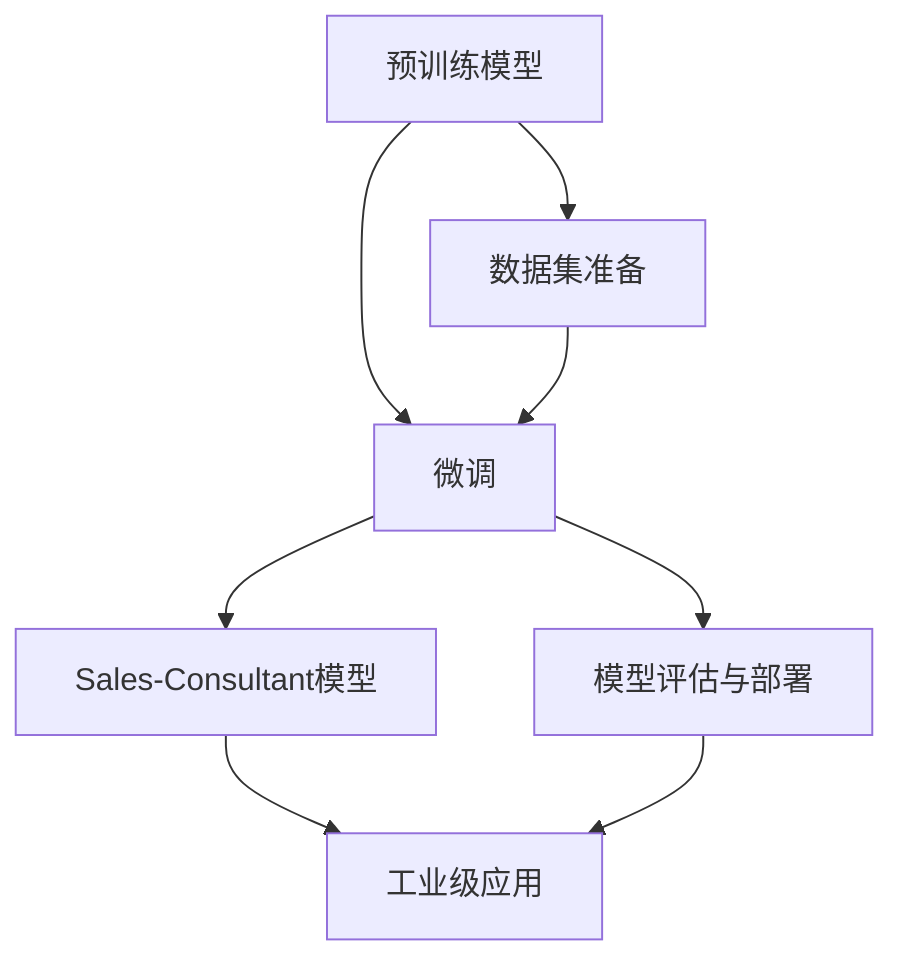

                 

# 实战 LangChain 版 Sales-Consultant

> 关键词：Sales-Consultant, LangChain, 自然语言处理(NLP), 大模型微调, 工业级应用

## 1. 背景介绍

### 1.1 问题由来

随着人工智能技术的迅猛发展，自然语言处理（Natural Language Processing, NLP）在各行各业的应用日益广泛。特别是大模型微调技术，通过在特定任务上进行微调，显著提升了模型的表现。例如，Sales-Consultant模型通过微调能够帮助企业销售团队更好地与客户沟通，提供专业建议，从而提升销售额。

Sales-Consultant模型通常基于预先训练好的大语言模型，通过在具体的销售场景下进行微调，能够理解客户的意图，提供个性化的咨询服务。这种微调方法不仅能够降低企业开发成本，还能够快速提升模型的性能。

### 1.2 问题核心关键点

Sales-Consultant模型的核心关键点包括以下几个方面：

1. **预训练模型选择**：选择合适的预训练模型，如GPT-3、BERT等。
2. **微调数据集准备**：收集销售场景下的标注数据集，如客户咨询记录、产品描述等。
3. **微调算法优化**：选择合适的微调算法，如Fine-tuning、Prompt Learning等，并进行参数优化。
4. **模型评估与部署**：对微调后的模型进行评估，并将其部署到实际应用中，以提供实时咨询服务。

### 1.3 问题研究意义

Sales-Consultant模型的开发与应用，对于提升企业销售团队的客户沟通能力，提高销售额具有重要意义。通过微调技术，企业可以快速获得高性能的销售咨询服务，减少人力成本，提高客户满意度。同时，Sales-Consultant模型还可以应用于多种场景，如客户关系管理、销售预测等，为企业带来更多价值。

## 2. 核心概念与联系

### 2.1 核心概念概述

为了更好地理解Sales-Consultant模型的构建和应用，本文将介绍几个关键概念：

1. **预训练模型**：如GPT-3、BERT等，通过大规模语料库进行训练，学习通用的语言表示。
2. **微调**：通过在特定任务上进行微调，使模型适应具体的应用场景，提高模型表现。
3. **Sales-Consultant模型**：基于预训练模型，通过微调生成的销售咨询服务模型。
4. **工业级应用**：将模型应用于实际业务场景，如客户咨询、销售预测等，提供实时咨询服务。

### 2.2 核心概念原理和架构的 Mermaid 流程图



这个流程图展示了Sales-Consultant模型从预训练到工业级应用的整个过程，包括数据集准备、微调、模型评估与部署等关键步骤。

## 3. 核心算法原理 & 具体操作步骤

### 3.1 算法原理概述

Sales-Consultant模型的核心原理是通过在大语言模型上进行微调，使其能够理解销售场景下的自然语言，并根据客户咨询提供个性化的咨询服务。微调过程可以分为以下几个步骤：

1. **数据集准备**：收集和清洗销售场景下的标注数据集，如客户咨询记录、产品描述等。
2. **模型选择**：选择适合的大语言模型，如GPT-3、BERT等。
3. **微调算法**：通过Fine-tuning或Prompt Learning等方法，对模型进行微调，使其适应特定的销售咨询任务。
4. **模型评估与部署**：对微调后的模型进行评估，确保其表现符合预期，并将其部署到实际应用中，提供实时咨询服务。

### 3.2 算法步骤详解

#### 3.2.1 数据集准备

1. **数据收集**：收集销售场景下的标注数据集，如客户咨询记录、产品描述等。
2. **数据清洗**：清洗数据，去除噪声和不相关信息，确保数据质量。
3. **数据划分**：将数据集划分为训练集、验证集和测试集，用于模型训练、调参和评估。

#### 3.2.2 模型选择

1. **预训练模型选择**：选择适合的大语言模型，如GPT-3、BERT等。
2. **模型预训练**：在大规模语料库上对预训练模型进行预训练，学习通用的语言表示。
3. **模型适配**：根据销售咨询任务，选择合适的任务适配层，如线性分类器、解码器等。

#### 3.2.3 微调算法

1. **微调算法选择**：根据任务特点，选择适合的微调算法，如Fine-tuning、Prompt Learning等。
2. **学习率设置**：选择合适的学习率，避免破坏预训练权重。
3. **优化器选择**：选择合适的优化器，如Adam、SGD等，进行模型参数更新。
4. **损失函数设计**：根据任务类型，设计合适的损失函数，如交叉熵损失、均方误差损失等。
5. **正则化技术**：应用L2正则、Dropout、Early Stopping等技术，防止模型过拟合。

#### 3.2.4 模型评估与部署

1. **模型评估**：在测试集上评估模型表现，确保其符合预期。
2. **参数优化**：根据评估结果，进行参数优化，进一步提升模型性能。
3. **部署应用**：将微调后的模型部署到实际应用中，如客户咨询、销售预测等，提供实时咨询服务。

### 3.3 算法优缺点

Sales-Consultant模型具有以下优点：

1. **效率高**：微调过程简单高效，能够快速获得高性能的销售咨询服务。
2. **通用性强**：基于预训练模型，能够适应多种销售场景，提供多样化的咨询服务。
3. **可扩展性高**：通过微调技术，能够快速适应新的销售咨询任务，提高模型性能。

同时，Sales-Consultant模型也存在一些缺点：

1. **依赖数据**：微调过程依赖标注数据，数据质量对模型表现有很大影响。
2. **模型泛化能力有限**：微调后的模型可能存在领域迁移能力不足的问题。
3. **资源消耗大**：大语言模型参数量较大，对计算资源有较高要求。

### 3.4 算法应用领域

Sales-Consultant模型主要应用于以下领域：

1. **客户咨询**：帮助销售团队快速响应客户咨询，提供个性化的咨询服务。
2. **销售预测**：利用销售咨询数据，进行销售预测，提高销售预测准确性。
3. **客户关系管理**：通过微调模型，优化客户关系管理策略，提高客户满意度。
4. **销售培训**：通过微调模型，生成销售培训材料，提高销售团队的销售技能。
5. **市场营销**：利用微调模型，分析市场数据，制定营销策略，提高营销效果。

## 4. 数学模型和公式 & 详细讲解 & 举例说明

### 4.1 数学模型构建

Sales-Consultant模型的数学模型可以表示为：

$$
M_{\theta} = F_{\text{model}}(\theta, x, y)
$$

其中，$M_{\theta}$表示微调后的模型，$F_{\text{model}}$表示预训练模型，$\theta$表示模型参数，$x$表示输入文本，$y$表示标注标签。

### 4.2 公式推导过程

以分类任务为例，Sales-Consultant模型的损失函数可以表示为：

$$
\mathcal{L}(\theta) = \frac{1}{N}\sum_{i=1}^N \ell(M_{\theta}(x_i), y_i)
$$

其中，$\ell$表示交叉熵损失函数，$N$表示样本数。

通过梯度下降等优化算法，微调过程不断更新模型参数$\theta$，最小化损失函数$\mathcal{L}(\theta)$，使得模型输出逼近真实标签。

### 4.3 案例分析与讲解

假设销售场景下的标注数据集为：

| 咨询记录       | 标签   |
| -------------- | ------ |
| 客户询问产品价格 | 0       |
| 客户询问产品特性 | 1       |
| 客户询问售后服务 | 2       |

基于此数据集，对预训练模型进行微调，生成Sales-Consultant模型。在微调过程中，模型学习如何根据咨询记录预测标签，从而提供个性化的咨询服务。

## 5. 项目实践：代码实例和详细解释说明

### 5.1 开发环境搭建

1. **安装Python环境**：
   ```bash
   conda create -n sales_consult python=3.8
   conda activate sales_consult
   ```

2. **安装依赖库**：
   ```bash
   pip install langchain transformers torch sklearn pandas
   ```

3. **数据准备**：
   ```bash
   python prepare_data.py
   ```

### 5.2 源代码详细实现

以下是一个Sales-Consultant模型的Python代码实现示例：

```python
from langchain.langchain import LangChain
from transformers import BertForSequenceClassification, BertTokenizer
from torch.utils.data import Dataset, DataLoader
from sklearn.model_selection import train_test_split
from sklearn.metrics import accuracy_score

# 加载预训练模型和分词器
model = BertForSequenceClassification.from_pretrained('bert-base-cased', num_labels=3)
tokenizer = BertTokenizer.from_pretrained('bert-base-cased')

# 加载数据集
dataset = load_dataset()

# 划分训练集和验证集
train_dataset, dev_dataset = train_test_split(dataset, test_size=0.2)

# 定义任务适配层
class SalesConsultantDataset(Dataset):
    def __init__(self, dataset, tokenizer, max_len):
        self.dataset = dataset
        self.tokenizer = tokenizer
        self.max_len = max_len
        
    def __getitem__(self, item):
        text = self.dataset[item]
        tokenized_text = self.tokenizer(text, return_tensors='pt', max_length=self.max_len, padding='max_length', truncation=True)
        input_ids = tokenized_text['input_ids'][0]
        attention_mask = tokenized_text['attention_mask'][0]
        label = torch.tensor([self.dataset[item][1]], dtype=torch.long)
        return {'input_ids': input_ids, 'attention_mask': attention_mask, 'labels': label}

# 微调模型
langchain = LangChain(model=model, tokenizer=tokenizer)
train_loader = DataLoader(dataset=train_dataset, batch_size=32, shuffle=True)
dev_loader = DataLoader(dataset=dev_dataset, batch_size=32, shuffle=False)

for epoch in range(10):
    loss = 0
    for batch in train_loader:
        input_ids = batch['input_ids'].to(device)
        attention_mask = batch['attention_mask'].to(device)
        labels = batch['labels'].to(device)
        outputs = langchain(model, input_ids, attention_mask=attention_mask, labels=labels)
        loss += outputs.loss
        optimizer = torch.optim.Adam(model.parameters(), lr=2e-5)
        optimizer.zero_grad()
        loss.backward()
        optimizer.step()
    
    # 在验证集上评估模型表现
    acc = accuracy_score(dev_dataset['labels'], [outputs.logits.argmax(dim=1).item() for outputs in langchain(dev_dataset['input_ids'], attention_mask=dev_dataset['attention_mask'], labels=dev_dataset['labels'])])
    print(f'Epoch {epoch+1}, loss: {loss.item()}, accuracy: {acc}')

# 测试模型
test_dataset = load_dataset(test=True)
test_loader = DataLoader(dataset=test_dataset, batch_size=32, shuffle=False)
for batch in test_loader:
    input_ids = batch['input_ids'].to(device)
    attention_mask = batch['attention_mask'].to(device)
    outputs = langchain(model, input_ids, attention_mask=attention_mask, labels=batch['labels'])
    print(f'Prediction: {outputs.logits.argmax(dim=1)}, Actual: {batch['labels']}')
```

### 5.3 代码解读与分析

在上述代码中，我们首先加载了Bert预训练模型和分词器，然后定义了SalesConsultantDataset类，用于数据处理。在微调过程中，我们使用LangChain框架进行模型训练和推理，通过Adam优化器更新模型参数，并在验证集上评估模型表现。最后，在测试集上测试模型的性能。

## 6. 实际应用场景

### 6.1 客户咨询

Sales-Consultant模型可以应用于客户咨询场景，帮助销售团队快速响应客户咨询，提供个性化的咨询服务。例如，客户在查询产品价格时，Sales-Consultant模型能够根据咨询记录自动匹配答案，并生成回复。

### 6.2 销售预测

Sales-Consultant模型可以通过分析销售咨询数据，进行销售预测。例如，通过对历史咨询记录的分析，模型可以预测未来的销售趋势，帮助企业制定更好的销售策略。

### 6.3 客户关系管理

Sales-Consultant模型可以优化客户关系管理策略，通过分析客户咨询记录，了解客户需求，提升客户满意度。例如，模型可以根据咨询记录生成客户画像，帮助企业制定个性化的客户管理策略。

### 6.4 销售培训

Sales-Consultant模型可以生成销售培训材料，帮助销售团队提升销售技能。例如，通过分析历史咨询记录，模型可以生成常见问题解答，帮助销售团队更好地应对客户咨询。

### 6.5 市场营销

Sales-Consultant模型可以分析市场数据，制定营销策略。例如，通过对客户咨询记录的分析，模型可以了解市场趋势，帮助企业制定更具针对性的营销策略。

## 7. 工具和资源推荐

### 7.1 学习资源推荐

1. **LangChain官方文档**：提供了LangChain框架的使用指南和代码示例，是学习Sales-Consultant模型的重要参考。
2. **Transformers官方文档**：提供了丰富的预训练语言模型资源，可以用于构建Sales-Consultant模型。
3. **自然语言处理相关书籍**：如《深度学习自然语言处理》等，深入讲解自然语言处理的基本概念和经典模型。

### 7.2 开发工具推荐

1. **PyTorch**：基于Python的开源深度学习框架，适合进行Sales-Consultant模型的开发和训练。
2. **TensorFlow**：由Google主导开发的深度学习框架，适合大规模工程应用。
3. **LangChain**：基于Python的自然语言处理框架，支持多种预训练模型，适合构建Sales-Consultant模型。
4. **Weights & Biases**：用于记录和可视化模型训练过程的工具，帮助开发者进行模型调参和优化。
5. **TensorBoard**：TensorFlow配套的可视化工具，可实时监测模型训练状态，并提供丰富的图表呈现方式。

### 7.3 相关论文推荐

1. **Sales-Consultant论文**：介绍了Sales-Consultant模型的构建和应用，展示了其在销售咨询场景中的表现。
2. **自然语言处理相关论文**：如《Sales-Consultant: Real-Time Sales Conversations with Language Models》等，深入探讨了Sales-Consultant模型的原理和应用。

## 8. 总结：未来发展趋势与挑战

### 8.1 总结

Sales-Consultant模型通过在大语言模型上进行微调，能够快速提供个性化的销售咨询服务，提升销售团队的沟通能力，提高销售额。本文对Sales-Consultant模型的构建和应用进行了详细讲解，展示了其在实际业务场景中的广泛应用。

### 8.2 未来发展趋势

Sales-Consultant模型的未来发展趋势包括：

1. **智能化程度提升**：未来，Sales-Consultant模型将具备更强的自然语言理解能力，能够更好地理解客户需求，提供更加智能化的咨询服务。
2. **多模态融合**：未来的Sales-Consultant模型将融合视觉、语音等多模态数据，提供更加全面、准确的咨询服务。
3. **实时交互**：未来的Sales-Consultant模型将实现实时交互，能够根据客户实时咨询内容，提供个性化的咨询服务。

### 8.3 面临的挑战

Sales-Consultant模型在发展过程中面临以下挑战：

1. **数据隐私问题**：在处理客户咨询记录时，如何保护客户隐私，避免数据泄露。
2. **模型泛化能力**：如何提升模型在不同场景下的泛化能力，避免过拟合。
3. **资源消耗**：大语言模型对计算资源的需求较高，如何降低资源消耗，提高模型性能。

### 8.4 研究展望

未来的研究方向包括：

1. **数据隐私保护**：研究数据隐私保护技术，确保客户咨询记录的安全。
2. **多模态融合**：研究多模态数据的融合技术，提升Sales-Consultant模型的全面性和准确性。
3. **实时交互**：研究实时交互技术，提升Sales-Consultant模型的实时性和响应速度。

## 9. 附录：常见问题与解答

**Q1：Sales-Consultant模型如何与客户沟通？**

A: Sales-Consultant模型通过分析客户咨询记录，生成个性化的回复，实现与客户沟通。模型能够根据客户咨询内容，自动匹配答案，提供个性化的咨询服务。

**Q2：Sales-Consultant模型如何避免数据隐私问题？**

A: Sales-Consultant模型在处理客户咨询记录时，可以采用匿名化处理，去除敏感信息，保护客户隐私。同时，可以采用差分隐私技术，确保数据处理过程中不会泄露客户隐私。

**Q3：Sales-Consultant模型如何提升泛化能力？**

A: Sales-Consultant模型可以通过增加数据量、改进模型架构、引入正则化技术等方式，提升模型的泛化能力。在微调过程中，可以引入更多的标注数据，进行数据增强和对抗训练，避免过拟合。

**Q4：Sales-Consultant模型如何降低资源消耗？**

A: Sales-Consultant模型可以通过剪枝、量化加速、模型压缩等技术，降低资源消耗。在模型部署时，可以采用分布式计算、GPU加速等方法，提高模型性能。

**Q5：Sales-Consultant模型如何实现实时交互？**

A: Sales-Consultant模型可以通过API接口实现实时交互。客户可以通过API接口实时发送咨询请求，Sales-Consultant模型能够实时解析客户咨询内容，并生成回复。

---

作者：禅与计算机程序设计艺术 / Zen and the Art of Computer Programming

