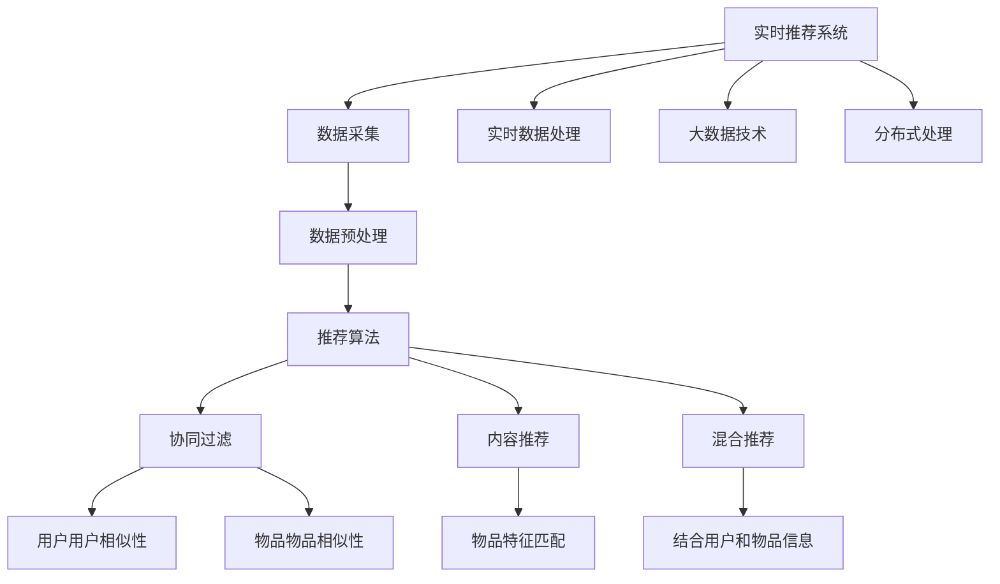

                 

# 实时推荐技术的实现与优化

> 关键词：实时推荐系统,协同过滤,内容推荐,用户行为数据,推荐算法优化,推荐系统,网络效率,实时大数据,分布式处理

## 1. 背景介绍

### 1.1 问题由来
随着大数据和云计算技术的发展，实时推荐系统已经成为各大互联网企业推动用户参与、提高用户体验的重要手段。在推荐系统中，通过分析用户的历史行为和喜好，提供个性化的推荐信息，以提升用户的满意度和促进商业活动。

然而，由于推荐系统面临的数据量巨大和变化迅速，如何设计高效的实时推荐算法和系统，保证推荐的实时性、个性化和网络效率，是当前研究的热点。

### 1.2 问题核心关键点
在实时推荐系统中，核心技术包括数据采集、推荐算法和系统架构。数据采集阶段，需要实时收集用户的行为数据，如点击、收藏、购买等。推荐算法阶段，需要设计高效的算法来生成个性化的推荐列表。系统架构阶段，需要设计高可用、高扩展性和低延迟的系统架构以支撑实时推荐。

为了实现上述目标，实时推荐系统通常需要结合协同过滤、内容推荐和混合推荐等多种推荐策略。协同过滤可以利用用户行为数据发现用户之间的相似性，推荐相似的用户也可能喜欢的物品。内容推荐则是根据物品的特征信息进行推荐。混合推荐则结合了两者，既利用用户行为数据，又利用物品特征信息。

### 1.3 问题研究意义
实时推荐技术的研究和应用对于提升用户体验、增加用户粘性、优化商业决策等方面具有重要意义。通过实时推荐，用户可以更容易地发现他们感兴趣的内容，增加了用户参与度和满意度。而对于企业而言，实时推荐可以帮助优化产品推荐策略，提升销售转化率，降低用户流失率。

## 2. 核心概念与联系

### 2.1 核心概念概述

为了更好地理解实时推荐系统的工作原理，本节将介绍几个密切相关的核心概念：

- 协同过滤(Collaborative Filtering, CF)：利用用户或物品的行为数据，发现用户之间或物品之间的相似性，推荐相似用户或物品的内容。
- 内容推荐(Content-Based Filtering, CBF)：根据用户或物品的特征信息，推荐与其特征相似的用户或物品。
- 混合推荐(Multi-Modal Recommenders)：结合协同过滤和内容推荐的方法，既利用用户行为数据，也利用物品特征信息。
- 实时数据处理实时数据处理：指系统能够在接受到新的数据后，立即进行处理并生成推荐结果的能力。
- 大数据技术：用于处理大量数据的技术，包括Hadoop、Spark等。
- 分布式处理：指将任务分散到多个计算节点进行处理，提高处理效率。

这些核心概念之间的逻辑关系可以通过以下Mermaid流程图来展示：



这个流程图展示了实时推荐系统的核心概念及其之间的关系：

1. 实时推荐系统通过数据采集阶段收集用户行为数据。
2. 数据预处理阶段包括数据清洗、特征提取等，用于准备推荐算法的输入。
3. 推荐算法阶段，根据不同的策略生成推荐列表，包括协同过滤、内容推荐和混合推荐。
4. 实时数据处理阶段，系统需要实时处理新数据并生成推荐结果。
5. 大数据技术和分布式处理技术用于支撑系统的扩展性和效率。

这些概念共同构成了实时推荐系统的学习和应用框架，使其能够在各种场景下发挥强大的推荐能力。通过理解这些核心概念，我们可以更好地把握实时推荐系统的工作原理和优化方向。

## 3. 核心算法原理 & 具体操作步骤

### 3.1 算法原理概述

实时推荐系统的核心是推荐算法。根据用户和物品的特征信息，推荐算法可以分为协同过滤、内容推荐和混合推荐等多种类型。下面我们分别介绍这三种推荐策略的原理和实现步骤。

- **协同过滤**：协同过滤通过分析用户之间的相似性或物品之间的相似性，推荐相似用户或物品的内容。用户相似性通常通过计算用户历史行为数据中的交叉相似度来评估，而物品相似性则通过计算物品的特征向量之间的距离来评估。根据这两种相似性评估，系统可以推荐相似的物品给用户。

- **内容推荐**：内容推荐通过分析用户和物品的特征信息，推荐与其特征相似的用户或物品。这种推荐策略通过比对用户的兴趣特征和物品的属性特征，推荐物品符合用户兴趣的内容。

- **混合推荐**：混合推荐则结合了两者的优点，既利用用户行为数据，又利用物品特征信息。通过权重的合理分配，混合推荐可以在保持个性化推荐的同时，提高推荐的准确性和覆盖率。

### 3.2 算法步骤详解

下面我们详细介绍协同过滤算法的步骤：

- **数据预处理**：首先需要收集用户的行为数据，如点击、收藏、购买等，并将用户行为数据转化为可用于计算的形式，如转化为用户-物品矩阵，其中每个单元的值代表用户对物品的兴趣程度。

- **相似性计算**：计算用户之间或物品之间的相似性。常用的相似性度量方法包括余弦相似度、皮尔逊相关系数、Jaccard相似度等。根据相似性矩阵，计算每个用户或物品的相似度得分。

- **推荐生成**：根据用户的历史行为数据和物品的特征信息，通过相似性矩阵，推荐相似的物品给用户。协同过滤的推荐列表可以通过用户或物品的相似度得分来评估，通常采用启发式推荐策略如Top-K推荐或排序推荐。

### 3.3 算法优缺点

协同过滤推荐策略的优缺点如下：

- **优点**：协同过滤可以有效地发现用户之间或物品之间的隐性相似性，对于推荐偏差性较小的场景，表现效果较好。
- **缺点**：协同过滤需要较长时间来发现用户之间或物品之间的相似性，尤其在数据量巨大的场景中，计算成本和效率问题比较突出。

### 3.4 算法应用领域

协同过滤推荐策略在电商、音乐、电影、视频等多个领域都有广泛的应用，包括用户的物品推荐、内容的推荐等。通过分析用户的历史行为数据，协同过滤可以发现用户之间的相似性，推荐用户可能感兴趣的物品。

## 4. 数学模型和公式 & 详细讲解 & 举例说明

### 4.1 数学模型构建

在构建协同过滤模型时，我们需要考虑用户和物品之间的相似性问题。这里我们可以构建用户-物品矩阵，矩阵中的每个单元表示用户对物品的兴趣程度。矩阵R的维度为users x items，其中rij表示用户i对物品j的兴趣程度。矩阵R的缺失值问题是推荐系统中的一个重要问题，通常我们可以采用填补缺失值的方法，如均值填充、最频繁值填充等。

### 4.2 公式推导过程

我们可以通过矩阵分解的方法来发现用户之间或物品之间的相似性。假设矩阵R可以分解为两个矩阵P和Q的乘积，P是用户特征矩阵，Q是物品特征矩阵。P和Q的维度为users x factors，items x factors，其中factors是矩阵R的因子数。矩阵分解的目标是最小化矩阵R和矩阵PQ的方差，即：

$$
\text{min}_P, Q ||R - PQ||^2
$$

这个优化问题可以通过梯度下降算法来求解，每次迭代更新P和Q，使得损失函数最小。

### 4.3 案例分析与讲解

在实践中，我们可以采用矩阵分解的方法来发现用户之间的相似性。例如，如果我们有一个用户对电影的兴趣矩阵，我们可以通过矩阵分解来发现用户之间的兴趣相似性，然后推荐相似用户喜欢的电影。

## 5. 项目实践：代码实例和详细解释说明

### 5.1 开发环境搭建

在开始实践之前，我们需要搭建一个可行的开发环境。这通常包括：

1. **数据采集**：收集用户的行为数据，如点击、收藏、购买等。
2. **数据预处理**：将用户行为数据转化为用户-物品矩阵。
3. **开发工具**：选择合适的编程语言和框架，如Python和TensorFlow，搭建推荐模型。

### 5.2 源代码详细实现

下面是一个协同过滤算法的简单实现：

```python
from tensorflow.keras.models import Sequential
from tensorflow.keras.layers import Dense, Embedding, Flatten
from tensorflow.keras.optimizers import Adam

def create_cf_model(num_users, num_items, num_factors):
    model = Sequential([
        Embedding(num_users, num_factors, input_length=1, name='user_embedding'),
        Flatten(),
        Dense(num_factors, activation='relu', name='user_dense'),
        Embedding(num_items, num_factors, input_length=1, name='item_embedding'),
        Flatten(),
        Dense(num_factors, activation='relu', name='item_dense'),
        Dense(1, activation='linear', name='rating')
    ])

    model.compile(optimizer=Adam(lr=0.001), loss='mean_squared_error')
    return model

# 示例
num_users = 100
num_items = 100
num_factors = 10
model = create_cf_model(num_users, num_items, num_factors)
model.summary()
```

### 5.3 代码解读与分析

在上面的代码中，我们首先定义了一个协同过滤模型，该模型包括用户嵌入、用户特征、物品嵌入和物品特征。然后，通过连接这些层，我们构建了一个深度神经网络模型，该模型将用户特征和物品特征作为输入，并预测用户对物品的兴趣程度。

### 5.4 运行结果展示

在上述代码的基础上，我们可以通过训练模型并使用测试数据集对模型性能进行评估。使用评估指标如均方误差(MSE)或根均方误差(RMSE)可以帮助我们理解模型的性能。

## 6. 实际应用场景

### 6.1 电商推荐

实时推荐技术在电商领域广泛应用，通过分析用户的浏览和购买行为，为用户推荐可能感兴趣的商品。例如，电商网站可以收集用户的点击行为和购买记录，通过协同过滤或混合推荐算法，推送个性化的商品推荐，提升用户满意度和转化率。

### 6.2 视频推荐

视频推荐系统可以利用用户的观看历史来推荐新的视频内容。通过实时处理用户的观看数据，系统可以发现用户之间的兴趣相似性，并推荐相似用户喜欢的视频内容。

### 6.3 社交媒体推荐

社交媒体平台如Facebook和Twitter经常使用实时推荐技术来推送用户可能感兴趣的内容。通过分析用户的点赞、分享和评论行为，实时推荐系统可以发现用户的兴趣特征，并推荐与其兴趣相似的内容。

### 6.4 未来应用展望

随着人工智能技术的不断进步，实时推荐技术将继续在各个领域发挥重要作用。未来，实时推荐系统可能会更加智能，能够更加准确地理解用户的需求和偏好，并实时调整推荐策略以满足用户的个性化需求。

## 7. 工具和资源推荐

### 7.1 学习资源推荐

实时推荐技术的学习通常需要结合数学、计算机科学和数据分析的知识。以下是一些推荐资源：

- 《实时推荐系统》：这本书提供了实时推荐系统的基础知识和高级技术，包括算法、系统架构和性能优化。
- 《深度学习》：了解深度学习技术对于理解实时推荐系统中的推荐算法至关重要。
- 《数据分析》：掌握数据分析的基本技能对于理解用户行为数据和预测用户的兴趣至关重要。

### 7.2 开发工具推荐

以下是一些常用的开发工具：

- **Python**：Python是实时推荐技术中最流行的编程语言之一。它拥有大量的库和框架，用于数据分析、机器学习和人工智能。
- **TensorFlow**：TensorFlow是一个流行的机器学习框架，广泛用于实时推荐系统的开发。
- **Apache Mahout**：Apache Mahout是一个开源的机器学习库，用于大规模的推荐系统开发。
- **Apache Spark**：Apache Spark是一个高效的数据处理平台，用于处理大规模的数据集。

### 7.3 相关论文推荐

以下是一些相关的论文推荐：

- 《Collaborative Filtering for Recommender Systems》：这篇论文提供了协同过滤算法的基础知识和高级技术。
- 《Content-Based Recommendation Systems》：这篇论文介绍了内容推荐算法的基本原理和应用。
- 《Hybrid Recommendation Systems》：这篇论文讨论了混合推荐系统的概念和应用。

## 8. 总结：未来发展趋势与挑战

### 8.1 研究成果总结

实时推荐技术已成为互联网应用的重要组成部分，广泛应用于电商、视频、社交媒体等领域。实时推荐系统通过分析用户的行为数据，发现用户之间或物品之间的相似性，推荐个性化的内容，以提升用户体验和增强用户粘性。实时推荐技术的研究成果包括各种推荐算法、系统架构和性能优化技术。

### 8.2 未来发展趋势

随着人工智能技术的进步，实时推荐技术将继续在各个领域发挥重要作用。未来，实时推荐系统可能会更加智能，能够更加准确地理解用户的需求和偏好，并实时调整推荐策略以满足用户的个性化需求。此外，随着技术的进步，实时推荐系统可能会更加多样化，能够处理更复杂的数据和用户偏好。

### 8.3 面临的挑战

实时推荐技术面临的挑战包括数据管理、算法效率、用户隐私保护和性能优化等。随着数据量的增加，数据管理和处理成为了主要挑战。算法效率也是一个重要挑战，因为实时推荐系统需要快速地处理大量数据。此外，用户隐私保护也是一个重要的挑战，因为实时推荐系统需要处理用户的个人数据。

### 8.4 研究展望

为了应对这些挑战，研究者需要继续探索新的算法、技术和方法。例如，研究者可以开发新的算法来提高推荐系统的效率和准确性，或者开发新的方法来保护用户的隐私。此外，研究者还可以探索如何将实时推荐技术与其他技术结合起来，例如机器学习、自然语言处理和计算机视觉。

## 9. 附录：常见问题与解答

### Q1：如何选择合适的推荐算法？

A: 选择推荐算法时，需要根据具体的应用场景和数据特点来决定。例如，如果数据量较小，且用户之间的相似性较为明显，则可以选择协同过滤。否则，如果数据量较大，且物品的特征信息丰富，则可以选择混合推荐。

### Q2：如何处理冷启动问题？

A: 冷启动问题是指新用户或新物品的推荐难题。解决这个问题的一种方法是使用内容推荐算法，根据物品的特征信息来推荐。另一种方法是使用图像处理技术，将用户的行为数据转化为图像，然后使用图像识别技术来发现用户的兴趣特征。

### Q3：如何提高推荐系统的准确性？

A: 提高推荐系统的准确性需要从多个角度来考虑，例如优化推荐算法、提高数据质量、实时处理用户的行为数据等。另外，还可以使用用户反馈和系统性能数据来调整推荐策略，以提高推荐的准确性。

### Q4：如何保护用户的隐私？

A: 保护用户的隐私是一个复杂的挑战。实时推荐系统需要在提供个性化推荐的同时，保护用户的个人数据不被滥用。一个常用的方法是使用匿名化技术，将用户的行为数据转化为匿名的数据标签，然后再进行推荐。

---

作者：禅与计算机程序设计艺术 / Zen and the Art of Computer Programming

