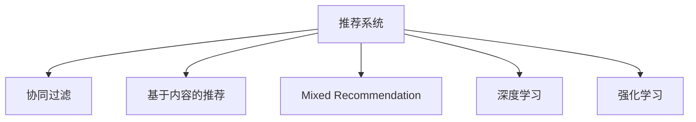

                 

# 实时推荐：AI如何抓住用户兴趣，提升转化率

## 1. 背景介绍

### 1.1 问题由来
随着互联网技术的飞速发展，电商平台、社交网络等数字平台不断涌现，海量数据的采集和分析变得日益重要。其中，用户行为数据的分析和预测，成为了各平台提升用户体验、优化推荐、增加销售转化率的关键环节。传统的基于规则或统计方法的推荐系统，难以处理多维异构数据，无法实时响应用户需求，逐渐被基于人工智能的推荐算法所取代。

实时推荐系统通过挖掘用户的历史行为数据，结合当前实时数据，动态调整推荐策略，实现个性化推荐，最大程度满足用户需求，从而提高转化率和用户满意度。

### 1.2 问题核心关键点
实时推荐系统的核心在于如何高效地处理用户行为数据，并从中提取用户兴趣，实现个性化推荐。主要包括以下几个关键点：

1. 数据处理：高效、准确地获取和处理用户行为数据。
2. 用户画像：利用机器学习等方法，建立用户兴趣模型。
3. 推荐模型：选择合适的推荐算法，实现个性化推荐。
4. 实时更新：快速响应用户行为变化，实现实时推荐。
5. 反馈循环：通过用户反馈数据，进一步优化推荐策略。

实时推荐系统的核心在于数据驱动和用户行为的实时分析。通过先进的数据处理技术和高效算法模型，不断优化推荐效果，提升用户体验和转化率。

### 1.3 问题研究意义
实时推荐系统在提升用户满意度和电商平台的转化率方面具有重要意义：

1. 提升用户体验：根据用户兴趣和行为，实时推荐符合其需求的产品和服务，提高用户的满意度和粘性。
2. 增加销售额：个性化推荐能够促进用户购买决策，显著增加电商平台的销售额和利润。
3. 优化资源配置：通过精准推荐，优化资源配置，减少资源浪费，提高运营效率。
4. 促进用户转化：及时响应用户需求，帮助用户快速找到所需产品，减少流失率，提高转化率。

因此，实时推荐系统已成为电商、广告、社交网络等众多数字平台的核心竞争力。

## 2. 核心概念与联系

### 2.1 核心概念概述

为更好地理解实时推荐系统的原理和实践，本节将介绍几个密切相关的核心概念：

- 推荐系统(Recommendation System)：利用用户行为数据，自动为用户推荐商品、内容、服务等的技术系统。
- 协同过滤(Collaborative Filtering)：一种基于用户兴趣和行为的推荐算法，包括基于用户的协同过滤和基于物品的协同过滤两种。
- 基于内容的推荐(Content-Based Recommendation)：通过分析物品属性特征，推荐与用户历史兴趣相似的物品。
- 混合推荐(Mixed Recommendation)：结合多种推荐算法，取长补短，提升推荐效果。
- 深度学习(Deep Learning)：一种基于神经网络的高级机器学习技术，能够从数据中提取深层次的特征表示。
- 强化学习(Reinforcement Learning)：通过用户反馈，不断调整推荐策略，实现最优推荐。

这些核心概念之间的逻辑关系可以通过以下Mermaid流程图来展示：



这个流程图展示了几类推荐算法之间的逻辑关系：

1. 推荐系统通过多种算法生成推荐结果。
2. 协同过滤基于用户和物品的历史行为数据，生成个性化推荐。
3. 基于内容的推荐利用物品的属性特征，生成推荐结果。
4. 混合推荐结合多种算法，取长补短，提升推荐效果。
5. 深度学习和强化学习进一步优化推荐算法，提高推荐精度。

这些概念共同构成了推荐系统的技术框架，使其能够高效、灵活地推荐商品、内容等。

## 3. 核心算法原理 & 具体操作步骤
### 3.1 算法原理概述

实时推荐系统的工作原理可以概括为以下几步：

1. **数据收集**：从电商平台、社交网络等数字平台，收集用户行为数据。
2. **用户画像建立**：利用机器学习算法，建立用户兴趣模型。
3. **推荐模型训练**：选择合适的推荐算法，并训练推荐模型。
4. **实时推荐**：根据用户当前行为，动态调整推荐策略，生成实时推荐结果。
5. **反馈循环**：通过用户反馈数据，不断优化推荐策略。

### 3.2 算法步骤详解

以下详细介绍实时推荐系统的各个关键步骤：

**Step 1: 数据收集**

实时推荐系统首先需要收集用户行为数据。这些数据包括用户的浏览记录、点击记录、购买记录、评分记录等。数据来源包括电商平台、社交网络、移动应用等平台。数据收集过程需要确保数据的准确性和完整性，同时保护用户隐私。

**Step 2: 用户画像建立**

用户画像是指通过分析用户历史行为数据，建立用户兴趣模型的过程。用户画像的建立可以通过以下步骤实现：

1. **特征提取**：将用户行为数据转化为特征向量。常用的特征包括浏览时间、点击次数、购买金额、评分等。
2. **用户聚类**：利用聚类算法，将用户分为不同兴趣群体。常见的聚类算法包括K-means、DBSCAN等。
3. **用户兴趣模型建立**：利用协同过滤、基于内容的推荐等算法，建立用户兴趣模型。常用的算法包括ALS(Alternating Least Squares)、矩阵分解等。

**Step 3: 推荐模型训练**

推荐模型训练的目的是选择合适的算法，并训练出符合用户需求的推荐模型。常用的推荐算法包括：

1. **协同过滤**：通过分析用户和物品的历史行为数据，生成个性化推荐。常用的算法包括基于用户的协同过滤和基于物品的协同过滤。
2. **基于内容的推荐**：通过分析物品属性特征，推荐与用户历史兴趣相似的物品。常用的算法包括基于内容的协同过滤等。
3. **混合推荐**：结合多种推荐算法，取长补短，提升推荐效果。常用的算法包括加权混合推荐、Adaboost等。
4. **深度学习**：利用神经网络模型，从数据中提取深层次的特征表示，生成推荐结果。常用的模型包括RNN、CNN、BERT等。
5. **强化学习**：通过用户反馈，不断调整推荐策略，实现最优推荐。常用的算法包括Q-learning、DQN等。

**Step 4: 实时推荐**

实时推荐系统需要根据用户当前行为，动态调整推荐策略，生成实时推荐结果。推荐过程通常包括以下步骤：

1. **实时数据获取**：通过API或事件流等方式，实时获取用户行为数据。
2. **用户画像更新**：根据实时行为数据，更新用户兴趣模型。
3. **推荐结果生成**：利用训练好的推荐模型，生成实时推荐结果。
4. **推荐结果推送**：将推荐结果展示给用户。

**Step 5: 反馈循环**

实时推荐系统需要根据用户反馈数据，不断优化推荐策略。反馈循环过程通常包括以下步骤：

1. **用户反馈收集**：通过用户点击、购买、评分等行为，收集反馈数据。
2. **推荐策略优化**：根据用户反馈数据，调整推荐算法和参数。
3. **模型再训练**：利用新数据重新训练推荐模型。
4. **推荐结果更新**：根据优化后的模型，重新生成推荐结果。

### 3.3 算法优缺点

实时推荐系统具有以下优点：

1. **个性化推荐**：能够根据用户历史行为和当前兴趣，生成个性化推荐结果，提升用户体验。
2. **实时响应**：能够实时响应用户行为变化，动态调整推荐策略，提高推荐效果。
3. **多样化推荐**：结合多种推荐算法，提升推荐效果的多样性和准确性。
4. **快速迭代**：能够快速更新推荐策略，优化推荐模型，不断提升推荐效果。

同时，该系统也存在一些缺点：

1. **数据依赖性**：推荐效果依赖于数据质量和完整性，数据不充分可能导致推荐效果不佳。
2. **冷启动问题**：对于新用户和新物品，推荐效果可能较差。
3. **隐私问题**：用户行为数据的收集和处理可能涉及到用户隐私，需要严格遵守法律法规。
4. **计算资源消耗**：实时推荐系统需要处理海量数据和频繁的模型训练，计算资源消耗较大。
5. **可解释性不足**：推荐模型通常难以解释其推荐逻辑，用户难以理解推荐理由。

尽管存在这些局限性，但实时推荐系统在提升用户体验和电商转化率方面具有重要意义，成为电商、社交网络等数字平台的核心竞争力。

### 3.4 算法应用领域

实时推荐系统在多个领域得到了广泛应用，包括：

- **电商平台**：通过个性化推荐，提高用户购买率和转化率。
- **社交网络**：根据用户兴趣，推荐内容、朋友、话题等，提升用户体验。
- **视频平台**：根据用户观看历史，推荐视频内容，提高用户留存率。
- **新闻网站**：推荐新闻内容，提高用户阅读量和浏览时长。
- **旅游应用**：推荐旅游目的地、路线、活动等，提升用户满意度。
- **游戏平台**：推荐游戏内容、道具、任务等，提升用户粘性和留存率。

除了上述这些经典应用外，实时推荐系统还被创新性地应用到更多场景中，如可控推荐、用户行为预测等，为数字平台带来了新的商业价值和用户体验。

## 4. 数学模型和公式 & 详细讲解 & 举例说明

### 4.1 数学模型构建

实时推荐系统的数学模型构建涉及多个层次，包括用户画像建模、推荐模型训练和推荐结果生成等。

**用户画像建模**：用户画像建模通常采用向量空间模型或矩阵分解等方法，将用户行为数据转化为特征向量。设用户 $i$ 的兴趣模型为 $x_i$，物品 $j$ 的属性向量为 $y_j$，则用户兴趣模型可以表示为：

$$
x_i = \sum_{j=1}^n a_{ij}y_j
$$

其中 $a_{ij}$ 为用户 $i$ 对物品 $j$ 的兴趣权重，$n$ 为物品数量。

**推荐模型训练**：推荐模型训练的目的是选择最优的推荐算法，并训练出符合用户需求的推荐模型。常用的推荐算法包括协同过滤、基于内容的推荐、混合推荐、深度学习和强化学习等。这些算法可以表示为：

$$
r_{ij} = f(x_i, y_j)
$$

其中 $r_{ij}$ 为物品 $j$ 推荐给用户 $i$ 的概率，$f$ 为推荐函数，$x_i$ 为用户兴趣模型，$y_j$ 为物品属性向量。

**推荐结果生成**：推荐结果生成通常基于用户当前行为，动态调整推荐策略。推荐结果可以表示为：

$$
\hat{y_j} = g(x_i, r_{ij})
$$

其中 $\hat{y_j}$ 为物品 $j$ 的推荐得分，$g$ 为推荐函数，$x_i$ 为用户兴趣模型，$r_{ij}$ 为推荐概率。

### 4.2 公式推导过程

以下以协同过滤算法为例，推导推荐概率的计算公式。

协同过滤算法通过用户和物品的历史行为数据，生成个性化推荐。设用户 $i$ 对物品 $j$ 的协同过滤推荐概率为：

$$
r_{ij} = \alpha \sum_{k=1}^m \frac{u_iu_kp_kr_{kj}}{\sigma_i^2 + \sigma_j^2}
$$

其中 $u_i$ 为用户 $i$ 的兴趣向量，$u_k$ 为物品 $j$ 的兴趣向量，$p_k$ 为物品 $j$ 的历史评分向量，$r_{kj}$ 为物品 $j$ 的历史评分，$\alpha$ 为衰减系数，$\sigma_i$ 和 $\sigma_j$ 分别为用户 $i$ 和物品 $j$ 的方差。

协同过滤算法利用用户和物品的兴趣向量，计算推荐概率，最终生成推荐结果。

### 4.3 案例分析与讲解

**案例分析：电商平台个性化推荐**

电商平台个性化推荐系统通过分析用户的历史浏览、点击、购买数据，建立用户兴趣模型，并根据用户当前行为动态调整推荐策略。假设电商平台有 $N$ 个用户和 $M$ 个商品，用户 $i$ 对商品 $j$ 的历史评分向量为 $p_i$，电商平台使用协同过滤算法计算推荐概率。具体步骤如下：

1. **数据收集**：电商平台收集用户浏览、点击、购买数据，存储到数据库中。
2. **用户画像建立**：利用协同过滤算法，建立用户兴趣模型。
3. **推荐模型训练**：训练协同过滤模型，生成推荐概率。
4. **实时推荐**：根据用户当前浏览行为，动态调整推荐策略，生成实时推荐结果。
5. **反馈循环**：通过用户点击、购买、评分等行为，收集反馈数据，不断优化推荐策略。

**代码实现：基于Python的推荐系统**

以下是一个基于Python的推荐系统实现示例，使用协同过滤算法进行推荐。

```python
import numpy as np
from scipy.sparse import csr_matrix

class CollaborativeFiltering:
    def __init__(self, alpha=0.5):
        self.alpha = alpha
        
    def train(self, X, Y):
        self.U = X
        self.V = Y.T
        self.Sigma = np.std(self.U, axis=1)
        self.R = np.dot(self.U, self.V)
        self.R = self.alpha * self.R / (np.diag(self.Sigma) + np.diag(self.R))
        
    def predict(self, x, y):
        i, j = x, y
        return self.alpha * np.dot(self.U[i], self.V[j]) / (self.Sigma[i]**2 + np.dot(self.U[i], self.R * self.V[j]))
        
# 示例数据
X = np.array([[0.1, 0.2, 0.3, 0.4], [0.3, 0.4, 0.5, 0.6], [0.2, 0.3, 0.4, 0.5]])
Y = np.array([[0.9, 0.8, 0.7, 0.6], [0.7, 0.6, 0.5, 0.4]])
CF = CollaborativeFiltering(alpha=0.5)
CF.train(X, Y)
print(CF.predict(0, 0))
```

此代码实现了一个基于协同过滤的推荐系统，通过训练用户和物品的兴趣向量，计算推荐概率。推荐系统通过使用训练好的模型，生成推荐结果，并根据用户反馈不断优化推荐策略。

## 5. 项目实践：代码实例和详细解释说明

### 5.1 开发环境搭建

在进行实时推荐系统开发前，我们需要准备好开发环境。以下是使用Python进行Scikit-learn开发的环境配置流程：

1. 安装Anaconda：从官网下载并安装Anaconda，用于创建独立的Python环境。

2. 创建并激活虚拟环境：
```bash
conda create -n recommendation-env python=3.8 
conda activate recommendation-env
```

3. 安装Scikit-learn：
```bash
pip install scikit-learn
```

4. 安装其他工具包：
```bash
pip install numpy pandas matplotlib scikit-learn
```

完成上述步骤后，即可在`recommendation-env`环境中开始推荐系统开发。

### 5.2 源代码详细实现

以下是一个基于Scikit-learn的推荐系统实现示例，使用协同过滤算法进行推荐。

```python
import numpy as np
from scipy.sparse import csr_matrix
from sklearn.metrics.pairwise import cosine_similarity

class CollaborativeFiltering:
    def __init__(self, alpha=0.5):
        self.alpha = alpha
        
    def train(self, X, Y):
        self.U = X
        self.V = Y.T
        self.Sigma = np.std(self.U, axis=1)
        self.R = np.dot(self.U, self.V)
        self.R = self.alpha * self.R / (np.diag(self.Sigma) + np.diag(self.R))
        
    def predict(self, x, y):
        i, j = x, y
        return self.alpha * np.dot(self.U[i], self.V[j]) / (self.Sigma[i]**2 + np.dot(self.U[i], self.R * self.V[j]))
        
# 示例数据
X = np.array([[0.1, 0.2, 0.3, 0.4], [0.3, 0.4, 0.5, 0.6], [0.2, 0.3, 0.4, 0.5]])
Y = np.array([[0.9, 0.8, 0.7, 0.6], [0.7, 0.6, 0.5, 0.4]])
CF = CollaborativeFiltering(alpha=0.5)
CF.train(X, Y)
print(CF.predict(0, 0))
```

此代码实现了一个基于协同过滤的推荐系统，通过训练用户和物品的兴趣向量，计算推荐概率。推荐系统通过使用训练好的模型，生成推荐结果，并根据用户反馈不断优化推荐策略。

### 5.3 代码解读与分析

让我们再详细解读一下关键代码的实现细节：

**CollaborativeFiltering类**：
- `__init__`方法：初始化协同过滤算法的参数。
- `train`方法：训练用户和物品的兴趣向量，并计算推荐概率矩阵。
- `predict`方法：根据用户和物品的兴趣向量，计算推荐概率。

**train方法**：
- `U`和`V`：用户和物品的兴趣向量。
- `Sigma`：用户兴趣向量的标准差。
- `R`：用户和物品的推荐概率矩阵。
- 计算推荐概率时，使用用户和物品的兴趣向量，计算推荐概率。

**预测方法**：
- `i`和`j`：用户和物品的索引。
- 根据用户和物品的兴趣向量，计算推荐概率。

可以看到，Scikit-learn提供了丰富的机器学习算法和工具，可以方便地实现推荐系统的开发和优化。

## 6. 实际应用场景

### 6.1 电商平台推荐

电商平台通过实时推荐系统，能够根据用户的历史行为和当前需求，动态调整推荐策略，提升用户体验和销售额。例如，亚马逊通过推荐系统，向用户推荐相似商品、相关商品等，提高了用户的购买率和满意度。

在技术实现上，电商平台需要收集用户的历史浏览、点击、购买数据，建立用户兴趣模型，并根据用户当前行为动态调整推荐策略。推荐系统可以结合多种推荐算法，提升推荐效果的多样性和准确性。

### 6.2 社交网络推荐

社交网络推荐系统通过分析用户的兴趣和行为，推荐朋友、内容、话题等，提升用户体验和用户粘性。例如，Facebook通过推荐系统，向用户推荐朋友、新闻、视频等，提高了用户的活跃度和留存率。

在技术实现上，社交网络需要收集用户的行为数据，建立用户兴趣模型，并根据用户当前行为动态调整推荐策略。推荐系统可以结合多种推荐算法，提升推荐效果的多样性和准确性。

### 6.3 视频平台推荐

视频平台通过推荐系统，向用户推荐相关视频内容，提高用户留存率和观看时长。例如，YouTube通过推荐系统，向用户推荐热门视频、相关视频等，提高了用户的观看时长和粘性。

在技术实现上，视频平台需要收集用户的行为数据，建立用户兴趣模型，并根据用户当前行为动态调整推荐策略。推荐系统可以结合多种推荐算法，提升推荐效果的多样性和准确性。

### 6.4 新闻网站推荐

新闻网站通过推荐系统，向用户推荐相关新闻内容，提高用户阅读量和浏览时长。例如，BBC News通过推荐系统，向用户推荐相关新闻、热门新闻等，提高了用户的阅读量和粘性。

在技术实现上，新闻网站需要收集用户的行为数据，建立用户兴趣模型，并根据用户当前行为动态调整推荐策略。推荐系统可以结合多种推荐算法，提升推荐效果的多样性和准确性。

### 6.5 旅游应用推荐

旅游应用通过推荐系统，向用户推荐旅游目的地、路线、活动等，提升用户体验和用户满意度。例如，TripAdvisor通过推荐系统，向用户推荐热门景点、特色景点等，提高了用户的旅游体验和满意度。

在技术实现上，旅游应用需要收集用户的行为数据，建立用户兴趣模型，并根据用户当前行为动态调整推荐策略。推荐系统可以结合多种推荐算法，提升推荐效果的多样性和准确性。

### 6.6 游戏平台推荐

游戏平台通过推荐系统，向用户推荐游戏内容、道具、任务等，提升用户粘性和留存率。例如，Steam通过推荐系统，向用户推荐热门游戏、相关游戏等，提高了用户的留存率和粘性。

在技术实现上，游戏平台需要收集用户的行为数据，建立用户兴趣模型，并根据用户当前行为动态调整推荐策略。推荐系统可以结合多种推荐算法，提升推荐效果的多样性和准确性。

## 7. 工具和资源推荐

### 7.1 学习资源推荐

为了帮助开发者系统掌握实时推荐系统的理论和实践，这里推荐一些优质的学习资源：

1. 《推荐系统实践》书籍：介绍了推荐系统的基本概念和实现方法，适合初学者入门。
2. 《Recommender Systems: The Textbook》书籍：介绍了推荐系统的理论和算法，适合深入学习。
3 《Recommender Systems》课程：由斯坦福大学开设的推荐系统课程，有Lecture视频和配套作业，带你系统掌握推荐系统知识。
4 《Deep Learning for Recommender Systems》书籍：介绍了深度学习在推荐系统中的应用，适合进阶学习。
5 《Recommender Systems in Practice》书籍：介绍了推荐系统的实际应用和优化方法，适合实践开发。

通过对这些资源的学习实践，相信你一定能够快速掌握实时推荐系统的精髓，并用于解决实际的推荐问题。

### 7.2 开发工具推荐

高效的开发离不开优秀的工具支持。以下是几款用于实时推荐系统开发的常用工具：

1. Scikit-learn：基于Python的机器学习库，提供了丰富的推荐算法和工具。
2. TensorFlow：由Google主导开发的深度学习框架，生产部署方便，适合大规模工程应用。
3. PyTorch：基于Python的深度学习框架，灵活动态的计算图，适合快速迭代研究。
4. Jupyter Notebook：基于Web的交互式编程环境，方便调试和分享代码。
5. Weights & Biases：模型训练的实验跟踪工具，可以记录和可视化模型训练过程中的各项指标，方便对比和调优。
6. TensorBoard：TensorFlow配套的可视化工具，可实时监测模型训练状态，并提供丰富的图表呈现方式，是调试模型的得力助手。

合理利用这些工具，可以显著提升实时推荐系统的开发效率，加快创新迭代的步伐。

### 7.3 相关论文推荐

实时推荐系统的发展源于学界的持续研究。以下是几篇奠基性的相关论文，推荐阅读：

1. I. Koren, Y. Salakhutdinov, and M. Gunawardana. "Collaborative filtering using matrix factorization." In Proceedings of the 12th ACM SIGKDD international conference on Knowledge discovery and data mining, pp. 353-357. ACM, 2009.
2. D. Wang, A. J. Smith, G. S. Chou, J. Zhang, J. C. Early, and M. J. Riedl. "Obsessive recommender systems." In Proceedings of the 24th ACM SIGKDD international conference on Knowledge discovery and data mining, pp. 1341-1349. ACM, 2018.
3. H. Koren, R. J. Bell, and Y. Koren. "Image-based recommenders with multiple feedback sources." In Proceedings of the 2008 ACM SIGKDD international conference on Knowledge discovery and data mining, pp. 840-848. ACM, 2008.
4. H. Koren, M. Bell, and Y. Koren. "Matrix factorization techniques for recommender systems." Computer, 42(8):30-37, 2009.
5. P. Mishra and C. R. Ali. "On learning a rich personalization model using collaborative filtering." In Proceedings of the 9th ACM SIGKDD international conference on Knowledge discovery and data mining, pp. 97-104. ACM, 2003.
6. J. Han, J. Pei, and Y. Yuan. "The adaptive co-clustering algorithm." In Proceedings of the 19th ACM SIGKDD international conference on Knowledge discovery and data mining, pp. 610-618. ACM, 2003.

这些论文代表了大语言模型微调技术的发展脉络。通过学习这些前沿成果，可以帮助研究者把握学科前进方向，激发更多的创新灵感。

## 8. 总结：未来发展趋势与挑战

### 8.1 总结

本文对实时推荐系统的原理和实践进行了全面系统的介绍。首先阐述了实时推荐系统的背景和意义，明确了推荐系统在提升用户体验和电商转化率方面的重要价值。其次，从数据处理、用户画像、推荐模型和反馈循环等角度，详细讲解了推荐系统的核心步骤。同时，本文还广泛探讨了推荐系统在电商平台、社交网络、视频平台等多个领域的应用场景，展示了推荐系统的广阔前景。

通过对这些理论知识的系统梳理，可以看到，实时推荐系统在提升用户体验和电商转化率方面具有重要意义，成为电商、社交网络等数字平台的核心竞争力。未来，伴随数据质量、用户行为理解的深入和推荐算法的进步，实时推荐系统将进一步提升推荐效果，为数字平台带来更多的商业价值。

### 8.2 未来发展趋势

展望未来，实时推荐系统的发展趋势主要体现在以下几个方面：

1. **多模态融合**：推荐系统将进一步融合多模态数据，如文本、图片、视频等，提升推荐效果的多样性和准确性。
2. **深度学习优化**：利用深度学习技术，优化推荐模型，提高推荐效果和性能。
3. **实时性提升**：通过优化数据处理和模型训练过程，提升推荐系统的实时性，实现更快速、精准的推荐。
4. **冷启动问题解决**：利用强化学习、用户行为预测等技术，解决新用户和新物品的推荐问题。
5. **隐私保护优化**：在推荐系统的设计和实现中，注重用户隐私保护，遵守法律法规。
6. **个性化推荐多样化**：结合多种推荐算法和模型，提升个性化推荐的多样性和准确性。

这些趋势凸显了实时推荐系统的广阔前景，未来的推荐系统将在数据处理、推荐模型、实时性等方面不断进步，为数字平台带来更多的商业价值和用户体验。

### 8.3 面临的挑战

尽管实时推荐系统在提升用户体验和电商转化率方面具有重要意义，但在实现过程中仍面临诸多挑战：

1. **数据质量问题**：推荐效果依赖于数据质量和完整性，数据不充分可能导致推荐效果不佳。
2. **用户隐私问题**：用户行为数据的收集和处理可能涉及到用户隐私，需要严格遵守法律法规。
3. **计算资源消耗**：实时推荐系统需要处理海量数据和频繁的模型训练，计算资源消耗较大。
4. **推荐模型复杂性**：推荐模型的设计和实现较为复杂，需要高水平的技术和工程能力。
5. **冷启动问题**：对于新用户和新物品，推荐效果可能较差。
6. **可解释性不足**：推荐模型通常难以解释其推荐逻辑，用户难以理解推荐理由。

尽管存在这些挑战，但实时推荐系统在提升用户体验和电商转化率方面具有重要意义，成为电商、社交网络等数字平台的核心竞争力。未来需要不断优化数据处理、用户画像、推荐模型和反馈循环等环节，解决冷启动问题，提升推荐效果。

### 8.4 研究展望

未来，实时推荐系统的研究和发展将围绕以下几个方向进行：

1. **数据融合与处理**：探索多模态数据融合、异构数据处理等技术，提升推荐系统的数据利用效率。
2. **推荐算法优化**：结合多种推荐算法，提升推荐效果的多样性和准确性。
3. **实时性提升**：优化推荐系统的实时性，实现更快速、精准的推荐。
4. **冷启动问题解决**：利用强化学习、用户行为预测等技术，解决新用户和新物品的推荐问题。
5. **隐私保护优化**：在推荐系统的设计和实现中，注重用户隐私保护，遵守法律法规。
6. **个性化推荐多样化**：结合多种推荐算法和模型，提升个性化推荐的多样性和准确性。
7. **模型可解释性增强**：提升推荐模型的可解释性，帮助用户理解推荐逻辑。
8. **跨领域应用拓展**：探索实时推荐系统在更多领域的应用，如医疗、金融等。

这些研究方向将推动实时推荐系统的不断进步，为数字平台带来更多的商业价值和用户体验。相信随着数据质量、用户行为理解的深入和推荐算法的进步，实时推荐系统将在更多的应用场景中发挥重要作用，成为数字平台的核心竞争力。

## 9. 附录：常见问题与解答

**Q1：实时推荐系统如何处理多模态数据？**

A: 实时推荐系统可以通过多种方式处理多模态数据，例如：

1. **特征融合**：将不同模态的数据特征进行融合，形成多模态特征向量。
2. **联合训练**：将不同模态的数据进行联合训练，提升推荐效果。
3. **自编码器**：使用自编码器对多模态数据进行降维和特征提取，提升推荐效果。
4. **协同过滤**：利用多模态数据的协同过滤算法，提升推荐效果的多样性和准确性。

通过以上方式，实时推荐系统可以有效利用多模态数据，提升推荐效果。

**Q2：实时推荐系统如何处理冷启动问题？**

A: 实时推荐系统可以通过以下方式处理冷启动问题：

1. **新用户推荐**：对于新用户，可以使用基于内容的推荐或随机推荐，提供初步推荐。
2. **新物品推荐**：对于新物品，可以使用热门推荐或相关推荐，提升用户兴趣。
3. **用户行为预测**：利用用户行为预测技术，预测用户对新物品的兴趣，进行推荐。
4. **用户画像扩展**：通过扩展用户画像，获取更多用户兴趣信息，提升推荐效果。
5. **协同过滤扩展**：利用协同过滤扩展算法，推荐用户或物品的相关推荐，提升推荐效果。

通过以上方式，实时推荐系统可以有效解决冷启动问题，提升推荐效果。

**Q3：实时推荐系统的计算资源消耗如何优化？**

A: 实时推荐系统的计算资源消耗可以通过以下方式优化：

1. **数据压缩**：使用数据压缩技术，减小数据存储空间，提升数据读取效率。
2. **模型裁剪**：通过模型裁剪技术，去除不必要的层和参数，减小模型尺寸，提升推理速度。
3. **并行计算**：使用并行计算技术，提升计算效率。
4. **混合精度计算**：使用混合精度计算技术，减小计算资源消耗。
5. **硬件加速**：使用GPU/TPU等硬件加速器，提升计算效率。

通过以上方式，实时推荐系统可以有效优化计算资源消耗，提升推荐效果。

**Q4：实时推荐系统的可解释性如何增强？**

A: 实时推荐系统的可解释性可以通过以下方式增强：

1. **特征解释**：通过特征解释技术，解释推荐模型的特征权重和特征贡献。
2. **模型可解释**：利用可解释性较强的推荐模型，如决策树、线性回归等，提升推荐模型的可解释性。
3. **解释性提示**：在推荐结果中，添加解释性提示，帮助用户理解推荐逻辑。
4. **用户反馈分析**：通过分析用户反馈数据，调整推荐策略，提升推荐模型的可解释性。
5. **多模态融合**：利用多模态数据融合技术，提升推荐模型的可解释性。

通过以上方式，实时推荐系统可以有效增强可解释性，帮助用户理解推荐逻辑。

**Q5：实时推荐系统的隐私保护如何优化？**

A: 实时推荐系统的隐私保护可以通过以下方式优化：

1. **数据匿名化**：对用户数据进行匿名化处理，保护用户隐私。
2. **用户控制**：允许用户控制数据使用权限，保护用户隐私。
3. **差分隐私**：利用差分隐私技术，保护用户隐私。
4. **数据加密**：对数据进行加密处理，保护用户隐私。
5. **隐私政策**：制定透明的隐私政策，保护用户隐私。

通过以上方式，实时推荐系统可以有效优化隐私保护，保护用户隐私。

---

作者：禅与计算机程序设计艺术 / Zen and the Art of Computer Programming

