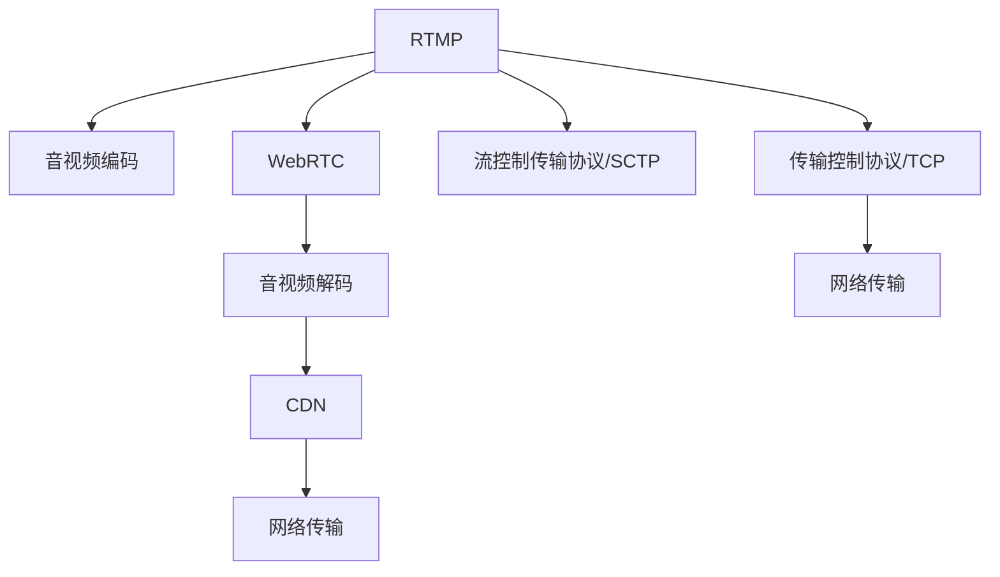

                 

# 实时流媒体协议：RTMP 和 WebRTC

## 1. 背景介绍

### 1.1 问题由来

随着互联网的普及和智能设备的增多，实时流媒体传输的需求日益增长。传统的直播和点播服务，已经不能满足用户对于更高质量的流媒体体验和更灵活的互动需求。实时流媒体协议（Real-time Media Protocols）的出现，为流媒体内容提供了更加高效、稳定和灵活的传输方案，极大地提升了用户体验。

### 1.2 问题核心关键点

实时流媒体协议（RTMP和WebRTC）的主要挑战在于：

- 如何实现低延迟、高吞吐量的流媒体传输？
- 如何保障实时流媒体的可靠性和安全性？
- 如何优化实时流媒体的兼容性和扩展性？

### 1.3 问题研究意义

研究RTMP和WebRTC协议，对于构建高效、稳定、灵活的实时流媒体传输系统，提升用户体验，促进流媒体技术的产业发展，具有重要意义：

1. 降低带宽和资源成本。实时流媒体协议通过高效的编码和传输算法，可以在保证视频流畅的同时，大幅降低带宽和计算资源需求。
2. 提升互动体验。实时流媒体的互动特性，如即时聊天、视频会议等，可以增强用户参与感，提升应用价值。
3. 加速技术落地。通过RTMP和WebRTC等协议的优化和应用，实时流媒体技术能够更快地应用于各类智能设备，推动智能化进程。
4. 增强跨平台支持。RTMP和WebRTC协议兼容多种操作系统和设备，提升了应用的可扩展性和普及性。
5. 保障数据安全。实时流媒体协议的加密和安全机制，可以保护数据传输过程中的隐私和安全。

## 2. 核心概念与联系

### 2.1 核心概念概述

为更好地理解RTMP和WebRTC协议，本节将介绍几个密切相关的核心概念：

- RTMP：实时消息传输协议（Real-Time Messaging Protocol），由Adobe公司开发，用于传输音视频和数据流。
- WebRTC：Web实时通信（Web Real-Time Communications），由Google开发，用于浏览器间实时音视频和数据传输。
- 音视频编码：将模拟音频和视频信号转换为数字信号，以便网络传输。常见的编码格式包括H.264、VP9等。
- 音视频解码：将数字信号转换为模拟音频和视频信号，以供设备播放。常见的解码格式包括H.264、VP9等。
- CDN：内容分发网络（Content Delivery Network），通过分布式服务器网络，提高流媒体的传输速度和稳定性。
- 传输控制协议（TCP）/用户数据报协议（UDP）：RTMP和WebRTC协议的传输层协议，TCP提供可靠传输，UDP提供实时传输。
- SCTP：流控制传输协议（Stream Control Transmission Protocol），提供可靠、高效的流媒体传输。

这些核心概念之间的逻辑关系可以通过以下Mermaid流程图来展示：



这个流程图展示了大语言模型的核心概念及其之间的关系：

1. RTMP和WebRTC协议负责音视频编码、传输控制和数据交换。
2. 音视频编码将模拟信号转换为数字信号，以便网络传输。
3. 音视频解码将数字信号还原为模拟信号，以供设备播放。
4. CDN通过分布式服务器网络，提高流媒体的传输速度和稳定性。
5. 传输控制协议（TCP）和用户数据报协议（UDP）提供可靠和实时的数据传输。
6. 流控制传输协议（SCTP）提供可靠的流媒体传输。

这些概念共同构成了实时流媒体传输的完整架构，使其能够高效、稳定地处理音视频数据。通过理解这些核心概念，我们可以更好地把握RTMP和WebRTC协议的工作原理和优化方向。

## 3. 核心算法原理 & 具体操作步骤
### 3.1 算法原理概述

RTMP和WebRTC协议的核心在于如何高效、稳定地传输音视频数据，并提供可靠的数据传输机制。其算法原理主要包括以下几个方面：

- 音视频编解码：将模拟音视频信号转换为数字信号，以便网络传输。常见的编解码格式包括H.264、VP9等。
- 传输控制：通过TCP/UDP协议，控制数据的可靠性和实时性。TCP提供可靠传输，UDP提供实时传输。
- 数据压缩：使用先进的压缩算法，减少数据传输量和带宽占用。
- 实时传输控制：通过RTMP和WebRTC协议，实时调整流媒体传输参数，以保证流畅的音视频体验。

### 3.2 算法步骤详解

RTMP和WebRTC协议的实现过程主要包括以下几个步骤：

**Step 1: 准备音视频数据**
- 将音视频信号采集或录制，转换为数字信号。
- 对数字信号进行编码压缩，选择适合传输的编解码格式，如H.264、VP9等。

**Step 2: 传输控制**
- 使用TCP协议或UDP协议，将编码后的音视频数据传输到接收端。
- 根据网络状况和带宽，动态调整传输参数，如码率、帧率等。

**Step 3: 数据压缩和解压缩**
- 对传输的数据进行压缩，减少带宽占用。
- 在接收端对压缩数据进行解压缩，还原为原始音视频信号。

**Step 4: 实时传输控制**
- 通过RTMP和WebRTC协议，实时调整流媒体传输参数，以保证流畅的音视频体验。
- 动态调整视频流，以保证稳定性和低延迟。

**Step 5: 数据安全**
- 使用加密算法，保障数据传输过程中的隐私和安全。
- 使用数字签名和认证机制，防止数据篡改和伪造。

### 3.3 算法优缺点

RTMP和WebRTC协议具有以下优点：

1. 低延迟：使用UDP协议传输，减少网络延迟，实现流畅的音视频体验。
2. 高效带宽利用：通过数据压缩和动态调整传输参数，有效降低带宽占用。
3. 灵活互动：支持即时聊天、视频会议等实时互动功能，增强用户体验。

同时，这些协议也存在一些局限性：

1. 复杂性高：实现和维护RTMP和WebRTC协议较为复杂，需要较高的技术水平。
2. 兼容性差：RTMP协议不适用于非Adobe设备和浏览器，WebRTC协议不适用于非Web平台。
3. 安全性不足：TCP/UDP协议和SCTP协议在数据传输过程中，存在一定的安全风险。

尽管存在这些局限性，但就目前而言，RTMP和WebRTC协议仍然是实时流媒体传输的主流范式。未来相关研究的重点在于如何进一步提升协议的兼容性、安全性和用户体验。

### 3.4 算法应用领域

RTMP和WebRTC协议在实时流媒体传输领域已经得到了广泛的应用，覆盖了几乎所有常见场景，例如：

- 直播：大型赛事、政会议、新闻发布等大型活动的实时转播。
- 点播：电影、电视剧、综艺节目等内容的点播服务。
- 视频会议：企业内部会议、远程教学、远程医疗等视频互动应用。
- 在线游戏：多人在线游戏、网络直播、实时对战等实时互动游戏。
- 网络研讨会：远程讲座、在线培训、企业内训等远程教育应用。

除了上述这些经典场景外，RTMP和WebRTC协议也被创新性地应用到更多场景中，如虚拟现实、AR/VR、智能家居等，为实时流媒体技术带来了全新的突破。随着RTMP和WebRTC协议的不断演进，实时流媒体技术必将在更多领域得到应用，为数字化生活带来新的体验。

## 4. 数学模型和公式 & 详细讲解 & 举例说明

### 4.1 数学模型构建

本节将使用数学语言对RTMP和WebRTC协议的音视频传输进行更加严格的刻画。

设音视频信号的采样率为 $f_s$，帧率为 $f_f$，每个帧的大小为 $S$，编解码的延迟为 $\delta$，网络带宽为 $B$。

定义音视频传输的数学模型为：

$$
T = \frac{S}{B} \times f_f \times \delta + \frac{S}{B} \times f_s \times \delta
$$

其中 $T$ 为音视频传输的延迟时间，包括编解码延迟和网络延迟。

### 4.2 公式推导过程

以下我们以WebRTC协议为例，推导音视频传输的延迟公式。

WebRTC协议通过NACK机制（Negative Acknowledgement）和Pacer算法，实现音视频传输的优化。设发送端发送的帧数为 $N$，接收端已接收的帧数为 $M$，发送端发送的帧延迟为 $\tau$，接收端的反馈延迟为 $\Delta$。

设 $p$ 为接收端对接收到的帧进行缓存的概率，$q$ 为接收端对接收到的帧进行丢弃的概率。则WebRTC协议的音视频传输延迟为：

$$
T = N \times \delta + p \times \Delta
$$

在实际应用中，$N$、$p$、$q$ 和 $\Delta$ 的取值需要通过网络状况和算法参数进行动态调整，以保证传输的流畅性和实时性。

### 4.3 案例分析与讲解

以下我们以WebRTC协议为例，分析其在音视频传输中的应用。

设网络带宽为 $B=1$ Mbps，音视频帧的大小为 $S=1$ KB，编解码延迟为 $\delta=0.1$ s，帧率为 $f_f=30$ fps，采样率为 $f_s=48$ kHz。则音视频传输的延迟为：

$$
T = \frac{1}{1 \times 10^6} \times 30 \times 0.1 + \frac{1}{1 \times 10^6} \times 48 \times 0.1 = 0.03 + 0.048 = 0.078 \text{ s}
$$

通过上述推导，我们可以看出，WebRTC协议通过动态调整传输参数和优化算法，可以有效地降低音视频传输的延迟，提升用户体验。

## 5. 项目实践：代码实例和详细解释说明
### 5.1 开发环境搭建

在进行实时流媒体协议的实践前，我们需要准备好开发环境。以下是使用Python进行WebRTC开发的开发环境配置流程：

1. 安装Anaconda：从官网下载并安装Anaconda，用于创建独立的Python环境。

2. 创建并激活虚拟环境：
```bash
conda create -n pytorch-env python=3.8 
conda activate pytorch-env
```

3. 安装PyTorch：根据CUDA版本，从官网获取对应的安装命令。例如：
```bash
conda install pytorch torchvision torchaudio cudatoolkit=11.1 -c pytorch -c conda-forge
```

4. 安装WebRTC库：
```bash
pip install webrtcvad webrtcapi
```

5. 安装各类工具包：
```bash
pip install numpy pandas scikit-learn matplotlib tqdm jupyter notebook ipython
```

完成上述步骤后，即可在`pytorch-env`环境中开始WebRTC开发。

### 5.2 源代码详细实现

这里我们以WebRTC协议为例，给出使用Python实现音视频传输的代码实现。

首先，定义音视频传输的基本参数：

```python
import webrtcapi

# 定义音视频参数
video_stream = webrtcapi.VideoStream()
audio_stream = webrtcapi.AudioStream()

# 定义WebRTC参数
rtcp_sdes_ssrc_list = [1, 2, 3]
ssrc_list = [1, 2, 3]
rtp_bitrate = 100000
audio_bitrate = 128000
video_bitrate = 400000
```

然后，创建WebRTC连接并实现音视频传输：

```python
# 创建WebRTC连接
webrtc = webrtcapi.WebRTCConnection()

# 加入音频流
webrtc.addAudioStream(audio_stream)

# 加入视频流
webrtc.addVideoStream(video_stream)

# 配置WebRTC参数
webrtc.configure(ssrc_list=ssrc_list, rtcp_sdes_ssrc_list=rtcp_sdes_ssrc_list, audio_bitrate=audio_bitrate, video_bitrate=video_bitrate, rtp_bitrate=rtp_bitrate)

# 启动音视频传输
webrtc.start()
```

最后，测试音视频传输的效果：

```python
# 测试音视频传输
webrtc.sendAudioFrame(audio_stream.frame())
webrtc.sendVideoFrame(video_stream.frame())
```

以上就是使用Python进行WebRTC协议音视频传输的完整代码实现。可以看到，使用WebRTC库的封装，我们可以用相对简洁的代码完成音视频传输。

### 5.3 代码解读与分析

让我们再详细解读一下关键代码的实现细节：

**VideoStream类**：
- 定义音视频流的基本属性和参数。
- 提供发送音视频帧的方法。

**AudioStream类**：
- 定义音频流的基本属性和参数。
- 提供发送音频帧的方法。

**WebRTCConnection类**：
- 创建WebRTC连接，并实现音视频流的加入和配置。
- 提供音视频帧的发送方法。

**configure方法**：
- 配置WebRTC连接的参数，包括源流标识、RTCP SDP描述、码率等。
- 设置音视频流的编码和压缩参数，以控制传输的带宽和质量。

**start方法**：
- 启动WebRTC连接，开始音视频流的传输。

**sendAudioFrame和sendVideoFrame方法**：
- 发送音频帧和视频帧，实现音视频数据的实时传输。

在实际应用中，还需要对音视频流进行更多的优化和处理，如音视频编解码、网络传输控制等。但核心的音视频传输逻辑基本与此类似。

## 6. 实际应用场景
### 6.1 智能客服系统

基于WebRTC协议的实时音视频通信，可以广泛应用于智能客服系统的构建。传统客服往往需要配备大量人力，高峰期响应缓慢，且一致性和专业性难以保证。而使用WebRTC协议的音视频传输，可以7x24小时不间断服务，快速响应客户咨询，用自然流畅的语言解答各类常见问题。

在技术实现上，可以收集企业内部的历史客服对话记录，将问题和最佳答复构建成监督数据，在此基础上对预训练语言模型进行微调。微调后的对话模型能够自动理解用户意图，匹配最合适的答案模板进行回复。对于客户提出的新问题，还可以接入检索系统实时搜索相关内容，动态组织生成回答。如此构建的智能客服系统，能大幅提升客户咨询体验和问题解决效率。

### 6.2 金融舆情监测

金融机构需要实时监测市场舆论动向，以便及时应对负面信息传播，规避金融风险。传统的人工监测方式成本高、效率低，难以应对网络时代海量信息爆发的挑战。基于WebRTC协议的音视频通信，可以实现实时市场舆情监测。

具体而言，可以收集金融领域相关的新闻、报道、评论等文本数据，并对其进行主题标注和情感标注。在此基础上对WebRTC协议进行优化，使得音视频传输能够实时传输金融市场舆情信息。将微调后的音视频传输系统应用到实时抓取的网络文本数据，就能够自动监测不同主题下的情感变化趋势，一旦发现负面信息激增等异常情况，系统便会自动预警，帮助金融机构快速应对潜在风险。

### 6.3 个性化推荐系统

当前的推荐系统往往只依赖用户的历史行为数据进行物品推荐，无法深入理解用户的真实兴趣偏好。基于WebRTC协议的实时音视频通信，可以更好地挖掘用户行为背后的语义信息，从而提供更精准、多样的推荐内容。

在实践中，可以收集用户浏览、点击、评论、分享等行为数据，提取和用户交互的物品标题、描述、标签等文本内容。将文本内容作为模型输入，用户的后续行为（如是否点击、购买等）作为监督信号，在此基础上微调预训练语言模型。微调后的模型能够从文本内容中准确把握用户的兴趣点。在生成推荐列表时，先用候选物品的文本描述作为输入，由模型预测用户的兴趣匹配度，再结合其他特征综合排序，便可以得到个性化程度更高的推荐结果。

### 6.4 未来应用展望

随着WebRTC协议的不断发展，实时音视频通信将在更多领域得到应用，为智能化进程带来变革性影响。

在智慧医疗领域，基于WebRTC协议的实时音视频通信，可以实现远程医疗、在线诊疗等功能，提高医疗服务的可及性和效率。

在智能教育领域，WebRTC协议可以用于实现远程教育、在线课堂等功能，打破地域限制，促进教育公平，提高教学质量。

在智慧城市治理中，WebRTC协议可以用于实现城市事件监测、远程教学、应急指挥等环节，提高城市管理的自动化和智能化水平，构建更安全、高效的未来城市。

此外，在企业生产、社会治理、文娱传媒等众多领域，基于WebRTC协议的实时音视频通信，也将不断涌现，为数字化生活带来新的体验。

## 7. 工具和资源推荐
### 7.1 学习资源推荐

为了帮助开发者系统掌握实时流媒体协议的理论基础和实践技巧，这里推荐一些优质的学习资源：

1. 《WebRTC从原理到实践》系列博文：由WebRTC技术专家撰写，深入浅出地介绍了WebRTC协议原理、实现方法等前沿话题。

2. WebRTC官方文档：WebRTC协议的官方文档，提供了详细的API接口和配置指南，是上手实践的必备资料。

3. 《WebRTC: Real-time Communication for the Web》书籍：Google WebRTC团队的著作，全面介绍了WebRTC协议的原理和应用，适合深入学习。

4. 《WebRTC for Developers》课程：Udacity提供的WebRTC开发课程，通过实际项目驱动，帮助你快速上手WebRTC开发。

5. 《WebRTC on Android》书籍：Android平台上WebRTC开发的实战指南，适合Android开发者。

通过对这些资源的学习实践，相信你一定能够快速掌握WebRTC协议的理论基础和实践技巧，并用于解决实际的流媒体问题。
###  7.2 开发工具推荐

高效的开发离不开优秀的工具支持。以下是几款用于WebRTC开发的常用工具：

1. Visual Studio Code：跨平台的IDE，支持多种语言和插件，方便开发和调试。

2. WebRTC Development Environment：Google提供的WebRTC开发环境，支持实时音视频通信。

3. WebRTC Editor：WebRTC协议的可视化编辑工具，支持复杂音视频流的配置和测试。

4. GStreamer：开源的音视频流媒体处理工具，支持多种格式和协议的音视频编解码。

5. FFmpeg：开源的音视频处理工具，支持多种格式和协议的音视频转换和流化。

6. Wireshark：网络协议分析工具，可以实时监控和分析音视频流的传输过程。

合理利用这些工具，可以显著提升WebRTC开发和调试的效率，加快创新迭代的步伐。

### 7.3 相关论文推荐

WebRTC协议的发展源于学界的持续研究。以下是几篇奠基性的相关论文，推荐阅读：

1. WebRTC: A Simple and Efficient Web Real-Time Communication Protocol：Google开发的WebRTC协议，详细介绍了协议的设计思想和实现方法。

2. A WebRTC Application Layer Framework: WebRTC Framework：阐述了WebRTC协议的框架结构和设计思路，适合深入理解WebRTC的内部机制。

3. A Real-Time WebRTC-based Data Transmission System：基于WebRTC协议的实时数据传输系统，介绍其实现细节和性能优化方法。

4. WebRTC Protocols: Encapsulation, SCTP, RTP/UDP, DTLS, RTP Packet Extensions：详细介绍了WebRTC协议的各个层面的设计和实现。

5. WebRTC: an Open-Standard for Voice and Video Communication：WebRTC协议的起源和发展历程，适合了解协议的演变和应用场景。

这些论文代表了大语言模型微调技术的发展脉络。通过学习这些前沿成果，可以帮助研究者把握学科前进方向，激发更多的创新灵感。

## 8. 总结：未来发展趋势与挑战

### 8.1 总结

本文对WebRTC协议进行了全面系统的介绍。首先阐述了WebRTC协议的研究背景和意义，明确了协议在实时流媒体传输中的独特价值。其次，从原理到实践，详细讲解了WebRTC协议的算法原理和关键步骤，给出了实时流媒体传输的完整代码实例。同时，本文还广泛探讨了WebRTC协议在智能客服、金融舆情、个性化推荐等多个行业领域的应用前景，展示了协议的巨大潜力。此外，本文精选了WebRTC协议的学习资源，力求为读者提供全方位的技术指引。

通过本文的系统梳理，可以看到，WebRTC协议在实时流媒体传输领域已经得到了广泛的应用，极大地提升了用户体验，推动了流媒体技术的产业化进程。未来，伴随WebRTC协议的不断演进，实时流媒体技术必将在更多领域得到应用，为数字化生活带来新的体验。

### 8.2 未来发展趋势

展望未来，WebRTC协议将呈现以下几个发展趋势：

1. 低延迟、高吞吐量的音视频传输：通过进一步优化编码和传输算法，实现更低延迟、更高吞吐量的音视频传输，提升用户体验。
2. 灵活互动的多媒体应用：支持即时聊天、视频会议、实时对战等多媒体互动功能，增强用户体验。
3. 跨平台兼容性和扩展性：扩展到更多的平台和设备，实现跨设备和跨平台的流畅音视频通信。
4. 高安全性和稳定性：通过加密和安全机制，保障音视频传输过程中的隐私和安全，提高系统的可靠性和稳定性。
5. 人工智能的深度融合：结合人工智能技术，实现智能分析、智能推荐等应用，提升音视频通信的智能化水平。

以上趋势凸显了WebRTC协议的广阔前景。这些方向的探索发展，必将进一步提升WebRTC协议的性能和应用范围，为实时流媒体技术的产业化进程带来新的动力。

### 8.3 面临的挑战

尽管WebRTC协议已经取得了瞩目成就，但在迈向更加智能化、普适化应用的过程中，它仍面临着诸多挑战：

1. 带宽和资源瓶颈：大规模音视频传输对带宽和计算资源的需求较高，需要进一步优化算法和硬件资源。
2. 兼容性问题：不同设备之间的音视频格式和编解码方式可能存在差异，需要进一步优化兼容性。
3. 安全性和隐私保护：音视频传输过程中的隐私和安全问题，需要通过加密和认证机制进行保障。
4. 跨平台支持和开发者生态：WebRTC协议在开发和部署过程中，需要跨越不同的平台和生态系统，需要进一步优化开发者工具和文档。

尽管存在这些挑战，但通过技术创新和产业协同，WebRTC协议必将在实时流媒体传输领域继续保持领先地位，为数字化生活带来新的体验。

### 8.4 研究展望

面对WebRTC协议面临的挑战，未来的研究需要在以下几个方面寻求新的突破：

1. 探索更高效的音视频编解码算法：开发更加高效的编码算法，减少带宽占用，提高音视频传输的流畅性。
2. 引入人工智能技术：结合人工智能技术，实现智能分析、智能推荐等应用，提升音视频通信的智能化水平。
3. 优化跨平台支持和开发者生态：通过开源和社区合作，提供更多的开发工具和文档，促进开发者生态的发展。
4. 加强安全性和隐私保护：引入加密和安全机制，保障音视频传输过程中的隐私和安全。

这些研究方向的探索，必将引领WebRTC协议走向更高的台阶，为实时流媒体传输技术带来新的突破。面向未来，WebRTC协议还需要与其他人工智能技术进行更深入的融合，共同推动实时流媒体技术的发展。只有勇于创新、敢于突破，才能不断拓展WebRTC协议的边界，让实时流媒体技术更好地服务于数字化生活。

## 9. 附录：常见问题与解答

**Q1：WebRTC协议和RTMP协议的主要区别是什么？**

A: WebRTC协议和RTMP协议的主要区别在于：
1. WebRTC协议是基于浏览器的，RTMP协议是基于Adobe的。
2. WebRTC协议支持端到端的音视频通信，RTMP协议是基于服务器的流媒体传输。
3. WebRTC协议采用点对点的传输方式，RTMP协议采用广播的方式。
4. WebRTC协议支持WebRTC和RTSP的双重协议支持，RTMP协议仅支持RTMP协议。

**Q2：WebRTC协议的音视频编解码有哪些优点？**

A: WebRTC协议的音视频编解码具有以下优点：
1. 低延迟：使用VP9编解码格式，可以实现更低的延迟，提升用户体验。
2. 高效带宽利用：通过动态码率和帧率控制，有效降低带宽占用，提高音视频传输的流畅性。
3. 灵活互动：支持实时音视频通信，实现即时聊天、视频会议等功能，增强用户体验。
4. 跨平台兼容：支持多种设备和平台，实现跨设备和跨平台的流畅音视频通信。

**Q3：WebRTC协议在音视频传输过程中，如何保障音视频的质量？**

A: WebRTC协议通过以下几个机制保障音视频质量：
1. 网络状况检测：通过RTCP（Real-Time Transport Control Protocol）协议，实时监测网络状况，动态调整传输参数。
2. 动态码率和帧率控制：根据网络状况和设备能力，动态调整码率和帧率，以适应不同的网络环境。
3. 音视频编解码优化：使用VP9等高效编解码格式，减少带宽占用，提高音视频传输的流畅性。
4. 传输控制协议和用户数据报协议：通过TCP/UDP协议，保障音视频传输的可靠性和实时性。

**Q4：WebRTC协议在实际应用中，如何解决音视频传输延迟问题？**

A: WebRTC协议通过以下几个方法解决音视频传输延迟问题：
1. 网络状况检测：通过RTCP协议，实时监测网络状况，动态调整传输参数，减少延迟。
2. 动态码率和帧率控制：根据网络状况和设备能力，动态调整码率和帧率，以适应不同的网络环境，减少延迟。
3. 音视频编解码优化：使用VP9等高效编解码格式，减少带宽占用，提高音视频传输的流畅性，减少延迟。
4. 点对点传输：通过点对点的传输方式，减少网络中间环节，降低延迟。

**Q5：WebRTC协议在实际应用中，如何解决音视频传输卡顿问题？**

A: WebRTC协议通过以下几个方法解决音视频传输卡顿问题：
1. 网络状况检测：通过RTCP协议，实时监测网络状况，动态调整传输参数，减少卡顿。
2. 动态码率和帧率控制：根据网络状况和设备能力，动态调整码率和帧率，以适应不同的网络环境，减少卡顿。
3. 音视频编解码优化：使用VP9等高效编解码格式，减少带宽占用，提高音视频传输的流畅性，减少卡顿。
4. 点对点传输：通过点对点的传输方式，减少网络中间环节，降低卡顿。

---

作者：禅与计算机程序设计艺术 / Zen and the Art of Computer Programming

